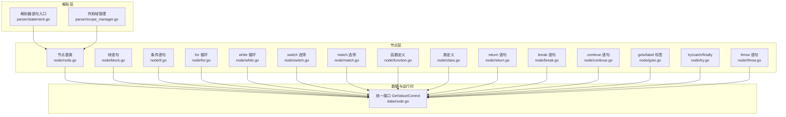
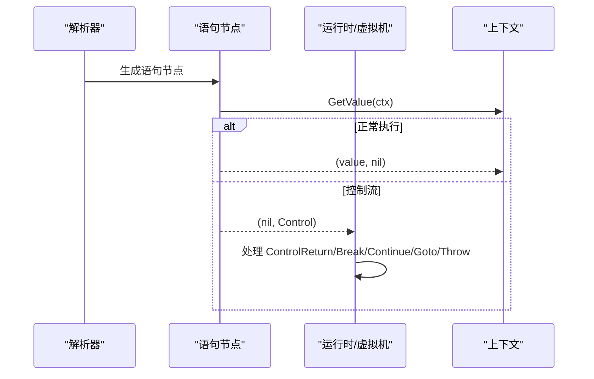
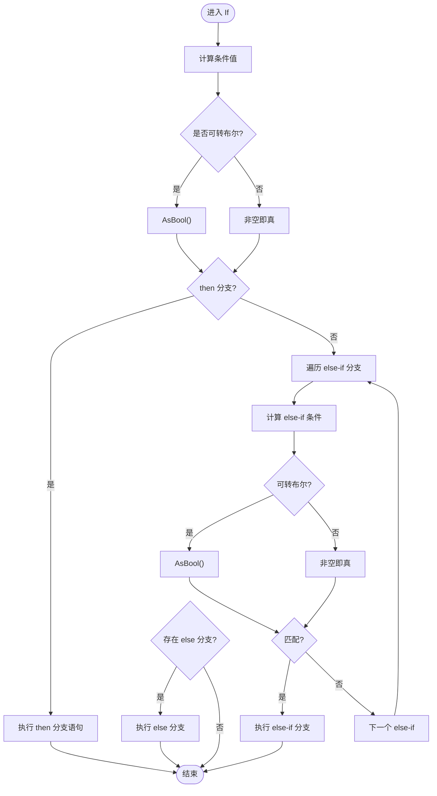
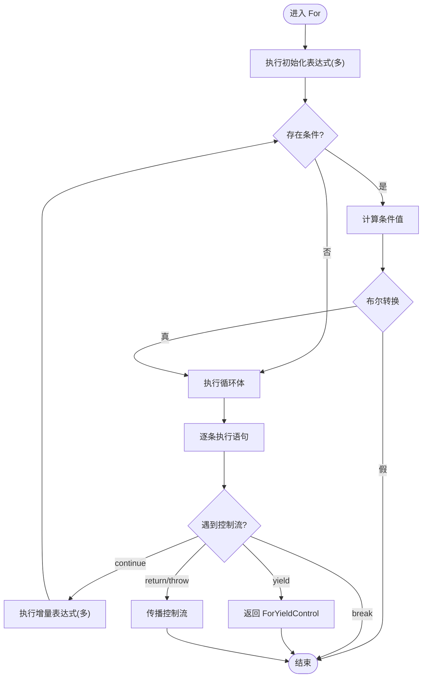
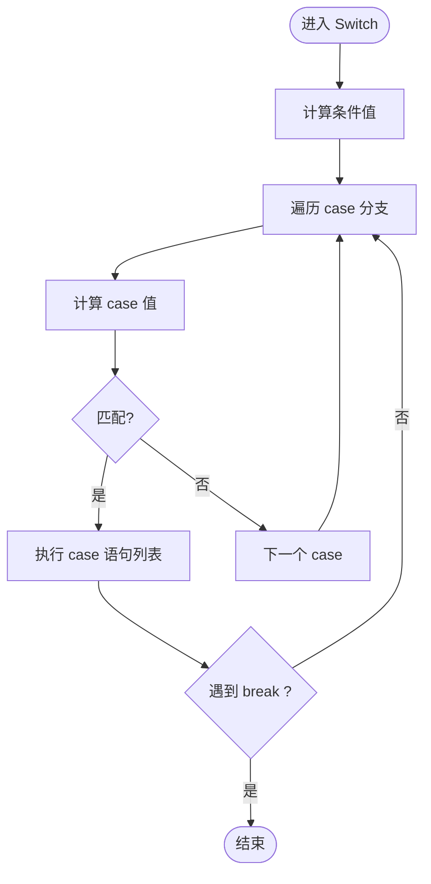
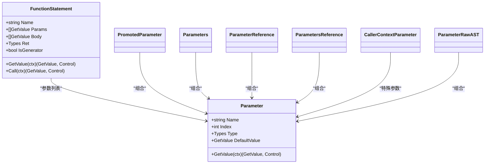
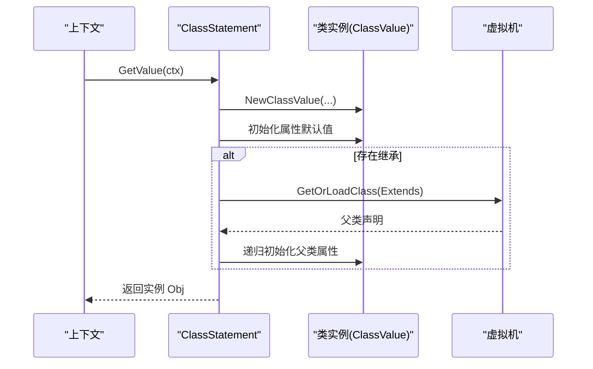
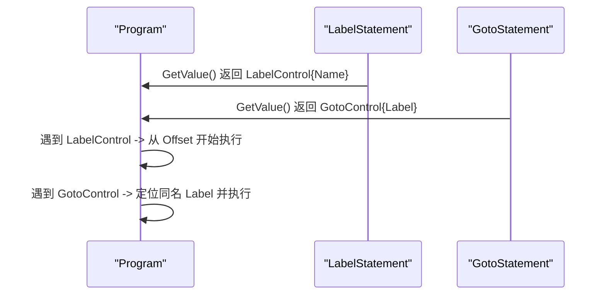
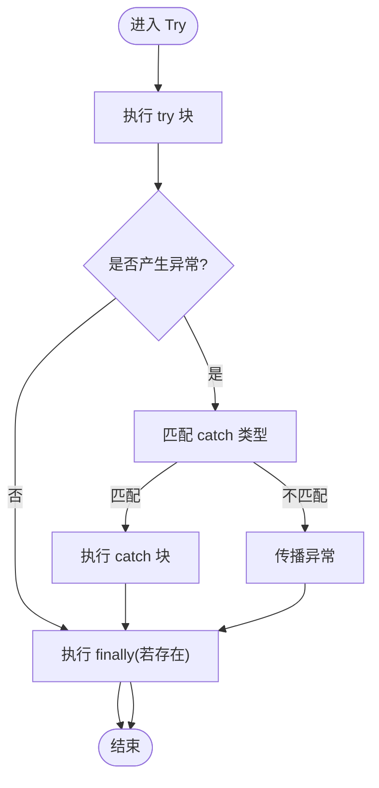
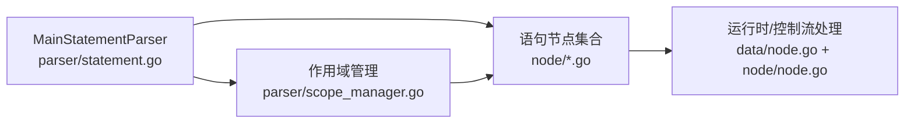

# 语句节点

<cite>
**本文引用的文件**
- [node.go](file://node/node.go)
- [block.go](file://node/block.go)
- [if.go](file://node/if.go)
- [for.go](file://node/for.go)
- [while.go](file://node/while.go)
- [switch.go](file://node/switch.go)
- [match.go](file://node/match.go)
- [function.go](file://node/function.go)
- [class.go](file://node/class.go)
- [return.go](file://node/return.go)
- [break.go](file://node/break.go)
- [continue.go](file://node/continue.go)
- [goto.go](file://node/goto.go)
- [try.go](file://node/try.go)
- [throw.go](file://node/throw.go)
- [statement.go](file://parser/statement.go)
- [scope_manager.go](file://parser/scope_manager.go)
- [node.go](file://data/node.go)
</cite>

## 目录
1. [简介](#简介)
2. [项目结构](#项目结构)
3. [核心组件](#核心组件)
4. [架构总览](#架构总览)
5. [详细组件分析](#详细组件分析)
6. [依赖分析](#依赖分析)
7. [性能考量](#性能考量)
8. [故障排查指南](#故障排查指南)
9. [结论](#结论)
10. [附录](#附录)

## 简介
本文件系统性梳理语句节点体系，覆盖块级语句、条件语句、循环语句、选择语句、函数定义语句与类定义语句。重点阐述：
- 各类语句的语法结构与控制流处理
- 作用域管理与变量解析
- 语句嵌套关系、标签与跳转控制
- 执行顺序、异常处理与性能优化
- 编写语句的最佳实践与常见陷阱

## 项目结构
语句节点位于 node/ 目录，解析器侧通过 parser/ 提供语句解析入口，运行时通过 data/ 定义统一的 GetValue 与 Control 接口，配合 runtime/ 的虚拟机执行。

图示来源
- [statement.go:21-45](file://parser/statement.go#L21-L45)
- [scope_manager.go:64-100](file://parser/scope_manager.go#L64-L100)
- [node.go:30-98](file://node/node.go#L30-L98)
- [block.go:5-22](file://node/block.go#L5-L22)
- [if.go:11-111](file://node/if.go#L11-L111)
- [for.go:78-231](file://node/for.go#L78-L231)
- [while.go:52-66](file://node/while.go#L52-L66)
- [switch.go:35-107](file://node/switch.go#L35-L107)
- [match.go:34-99](file://node/match.go#L34-L99)
- [function.go:9-150](file://node/function.go#L9-L150)
- [class.go:11-182](file://node/class.go#L11-L182)
- [return.go:19-62](file://node/return.go#L19-L62)
- [break.go:5-33](file://node/break.go#L5-L33)
- [continue.go:10-33](file://node/continue.go#L10-L33)
- [goto.go:19-74](file://node/goto.go#L19-L74)
- [try.go:16-121](file://node/try.go#L16-L121)
- [throw.go:9-36](file://node/throw.go#L9-L36)
- [node.go:3-7](file://data/node.go#L3-L7)

章节来源
- [statement.go:21-45](file://parser/statement.go#L21-L45)
- [scope_manager.go:64-100](file://parser/scope_manager.go#L64-L100)
- [node.go:30-98](file://node/node.go#L30-L98)

## 核心组件
- 节点基类与程序执行
  - 节点基类 Node 提供 From 来源与 GetValue 接口；Program 聚合语句序列，逐条执行并处理控制流（Return、Label、Goto、Throw 等）。
- 统一接口
  - GetValue 接口定义所有可执行节点的 GetValue(ctx) -> (GetValue, Control)；Control 用于中断/跳转/异常传播。
- 作用域管理
  - ScopeManager 维护作用域栈，提供变量注册、查找与索引分配，支持 Lambda 作用域标识。

章节来源
- [node.go:7-98](file://node/node.go#L7-L98)
- [node.go:3-7](file://data/node.go#L3-L7)
- [scope_manager.go:64-100](file://parser/scope_manager.go#L64-L100)

## 架构总览
语句节点的执行遵循“GetValue 顺序执行 + 控制流中断”的模式。解析器根据词法类型分派到具体语句解析器，最终生成语句节点树，运行时按节点 GetValue 顺序推进，并在遇到控制流（Return、Break、Continue、Goto、Throw 等）时进行相应处理。

图示来源
- [statement.go:21-45](file://parser/statement.go#L21-L45)
- [node.go:44-98](file://node/node.go#L44-L98)
- [node.go:3-7](file://data/node.go#L3-L7)

## 详细组件分析

### 块级语句（BlockStatement）
- 语法结构
  - 由若干语句组成，形成局部作用域边界。
- 执行逻辑
  - GetValue 通常不返回值，仅顺序执行内部语句。
- 作用域
  - 作为语句容器，其内部变量由上层作用域管理器登记与解析。

章节来源
- [block.go:5-22](file://node/block.go#L5-L22)

### 条件语句（IfStatement）
- 语法结构
  - 支持 then 分支、任意数量 else-if 分支与可选 else 分支。
- 执行逻辑
  - 计算条件值并转换为布尔，优先执行匹配分支；若无匹配则执行 else（若存在）。
- 布尔转换
  - 若实现 AsBool 接口则调用 AsBool，否则以非空判定为真。
- 嵌套与控制流
  - 分支内语句逐条执行，遇到 return/throw/break/continue/label/goto 等控制流即时返回。

图示来源
- [if.go:20-100](file://node/if.go#L20-L100)

章节来源
- [if.go:11-111](file://node/if.go#L11-L111)

### 循环语句（ForStatement 与 WhileStatement）
- For 循环
  - 支持多初始化、多增量表达式；循环体内支持 break/continue/yield/return/throw。
  - yield 场景下封装 ForYieldControl，记录 BodyIndex 与当前值，支持 Next/Valid/Rewind。
- While 循环
  - 每轮先评估条件，再执行循环体；支持 break/continue/return/throw。
- 控制流处理
  - break：直接结束循环。
  - continue：跳过剩余体，执行增量后继续下一轮。
  - yield：返回 ForYieldControl，交由外部迭代器协议处理。
  - return/throw：向上层传播，由调用者或 Program 处理。

图示来源
- [for.go:5-76](file://node/for.go#L5-L76)
- [for.go:102-189](file://node/for.go#L102-L189)
- [for.go:195-231](file://node/for.go#L195-L231)
- [while.go:5-50](file://node/while.go#L5-L50)

章节来源
- [for.go:78-231](file://node/for.go#L78-L231)
- [while.go:52-66](file://node/while.go#L52-L66)

### 选择语句（SwitchStatement 与 MatchStatement）
- Switch
  - 计算条件值，依次与各 case 值比较，命中后执行对应分支；支持 default。
  - 分支内可出现 break，命中后跳出 switch。
- Match
  - 每个分支包含一组条件表达式与一个表达式或语句列表；命中任一条件即执行对应分支。
  - 支持 default 分支。

图示来源
- [switch.go:53-96](file://node/switch.go#L53-L96)
- [match.go:52-88](file://node/match.go#L52-L88)

章节来源
- [switch.go:35-107](file://node/switch.go#L35-L107)
- [match.go:34-99](file://node/match.go#L34-L99)

### 函数定义语句（FunctionStatement）
- 语法结构
  - 名称、参数、函数体、符号表、返回类型；支持生成器（含 yield）。
- 执行逻辑
  - 定义阶段：向 VM 注册函数；调用阶段：顺序执行函数体，遇到 return/throw/生成器控制流时处理。
  - 生成器：调用时返回 Generator 对象，内部保存函数体与执行状态。
- 参数类型与默认值
  - 支持普通参数、默认值、引用参数、多值参数、属性提升参数等变体，均在 GetValue 时完成类型校验与赋值。

图示来源
- [function.go:9-150](file://node/function.go#L9-L150)
- [function.go:152-450](file://node/function.go#L152-L450)

章节来源
- [function.go:9-150](file://node/function.go#L9-L150)
- [function.go:152-450](file://node/function.go#L152-L450)

### 类定义语句（ClassStatement）
- 语法结构
  - 名称、继承、实现接口、属性、方法、注解、构造函数等。
- 执行逻辑
  - 定义阶段：构建类声明对象；实例化阶段：初始化属性默认值，沿继承链初始化父类属性，调用父类构造。
- 方法与属性
  - 方法与属性通过映射维护，支持静态属性/方法、只读、属性提升等特性。

图示来源
- [class.go:28-84](file://node/class.go#L28-L84)

章节来源
- [class.go:11-182](file://node/class.go#L11-L182)

### 标签与跳转（LabelStatement 与 GotoStatement）
- LabelStatement
  - 作为跳转目标，GetValue 返回 LabelControl，携带名称与偏移。
- GotoStatement
  - 作为跳转指令，GetValue 返回自身（实现 data.GotoControl），由 Program 统一调度。
- Program 的标签执行
  - 遇到 LabelControl 时从指定偏移开始继续执行；遇到 GotoControl 时根据标签名定位并进入对应 Label 的执行流程。

图示来源
- [goto.go:19-74](file://node/goto.go#L19-L74)
- [node.go:72-98](file://node/node.go#L72-L98)

章节来源
- [goto.go:19-74](file://node/goto.go#L19-L74)
- [node.go:72-98](file://node/node.go#L72-L98)

### 异常处理（TryStatement、ThrowStatement）
- TryStatement
  - 执行 try 块，捕获异常后尝试匹配 catch 类型；若未匹配则异常继续传播；finally 总是执行，其内的异常会覆盖先前异常。
- ThrowStatement
  - 计算异常值，若为类实例则按类异常抛出，否则按字符串异常抛出。

图示来源
- [try.go:24-121](file://node/try.go#L24-L121)
- [throw.go:23-36](file://node/throw.go#L23-L36)

章节来源
- [try.go:16-121](file://node/try.go#L16-L121)
- [throw.go:9-36](file://node/throw.go#L9-L36)

### 返回与控制流（ReturnStatement、BreakStatement、ContinueStatement）
- ReturnStatement
  - 计算返回值（或空值），封装为 ReturnControl 传播。
- BreakStatement/ContinueStatement
  - 作为控制流对象返回，供循环/选择语句处理。

章节来源
- [return.go:5-62](file://node/return.go#L5-L62)
- [break.go:5-33](file://node/break.go#L5-L33)
- [continue.go:5-33](file://node/continue.go#L5-L33)

## 依赖分析
- 节点与运行时
  - 所有语句节点实现 GetValue(ctx) -> (GetValue, Control)，统一由运行时处理控制流。
- 解析与语句
  - MainStatementParser 根据词法类型分派到具体语句解析器，生成语句节点。
- 作用域与变量
  - ScopeManager 管理变量注册与查找，变量在节点 GetValue 时通过上下文解析。

图示来源
- [statement.go:21-45](file://parser/statement.go#L21-L45)
- [node.go:44-98](file://node/node.go#L44-L98)
- [node.go:3-7](file://data/node.go#L3-L7)
- [scope_manager.go:64-100](file://parser/scope_manager.go#L64-L100)

章节来源
- [statement.go:21-45](file://parser/statement.go#L21-L45)
- [node.go:44-98](file://node/node.go#L44-L98)
- [node.go:3-7](file://data/node.go#L3-L7)
- [scope_manager.go:64-100](file://parser/scope_manager.go#L64-L100)

## 性能考量
- 控制流短路
  - If/Match/Switch 在命中后尽快终止后续分支，减少无效计算。
- 循环内控制流
  - break/continue/yield 显著降低无效迭代成本；ForYieldControl 将循环体切分为可恢复状态，避免重复执行。
- 异常处理
  - try/catch 仅在异常发生时介入；finally 仅在存在时执行，避免不必要的开销。
- 作用域栈
  - 通过作用域栈快速定位变量，避免全局扫描；Lambda 作用域标识有助于闭包捕获优化。

## 故障排查指南
- 类型不匹配
  - 函数/方法参数与返回类型检查失败时抛出异常；注意 PHP 语义下的 __toString 自动转换场景。
- 异常未捕获
  - try 块中未匹配 catch 的异常会继续传播；确认 catch 类型是否覆盖异常值类型。
- 标签与 goto
  - goto 必须指向存在的标签；标签名冲突或越界可能导致执行异常。
- 循环控制流
  - break/continue 仅影响最近一层循环；多层嵌套需结合标签或重构逻辑。
- 生成器
  - 生成器函数调用返回 Generator 对象；若在非迭代场景直接使用可能引发行为差异。

章节来源
- [function.go:103-150](file://node/function.go#L103-L150)
- [class.go:379-440](file://node/class.go#L379-L440)
- [try.go:79-121](file://node/try.go#L79-L121)
- [goto.go:19-74](file://node/goto.go#L19-L74)
- [for.go:102-189](file://node/for.go#L102-L189)

## 结论
语句节点系统以统一的 GetValue/Control 接口为核心，结合解析器的分派机制与运行时的控制流处理，实现了对块、条件、循环、选择、函数与类的完整覆盖。通过作用域管理与生成器状态保存，系统在保证 PHP 语义一致性的同时，提供了良好的可扩展性与性能表现。编写语句时建议遵循类型约束、合理使用控制流与标签、谨慎处理异常与生成器状态，以获得稳定高效的执行体验。

## 附录
- 最佳实践
  - 明确控制流语义：break/continue/yield/return/throw 的使用范围与时机。
  - 严格类型检查：函数/方法参数与返回类型声明，必要时利用默认值与引用参数。
  - 合理组织作用域：避免深层嵌套与复杂闭包捕获，减少变量查找成本。
  - 异常设计：明确 try/catch 范围与 finally 的副作用，避免掩盖真实问题。
- 常见陷阱
  - goto 与标签：仅在必要时使用，避免破坏可读性与可维护性。
  - 生成器：不要将生成器对象当作普通值直接使用，确保通过迭代器协议消费。
  - switch/match：注意命中后提前退出，避免多余分支执行。
  - 继承链初始化：子类属性覆盖与父类默认值初始化的顺序与条件。