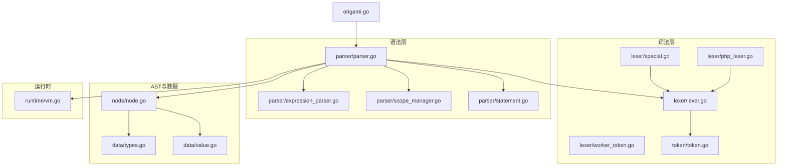
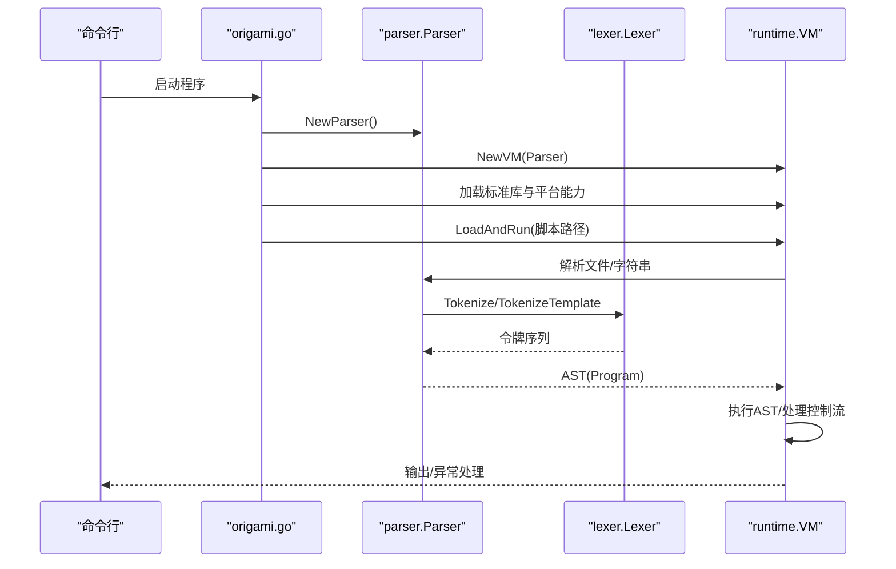
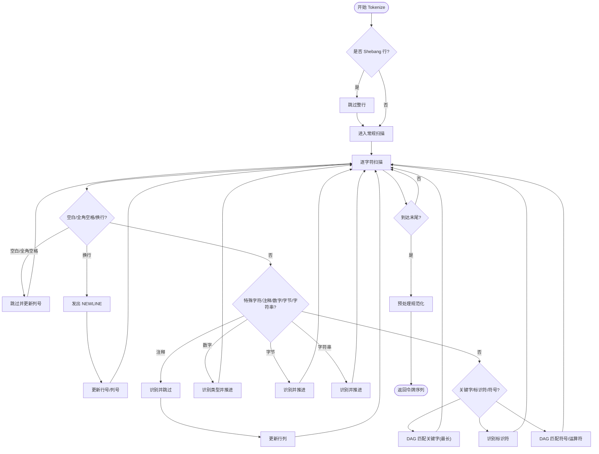
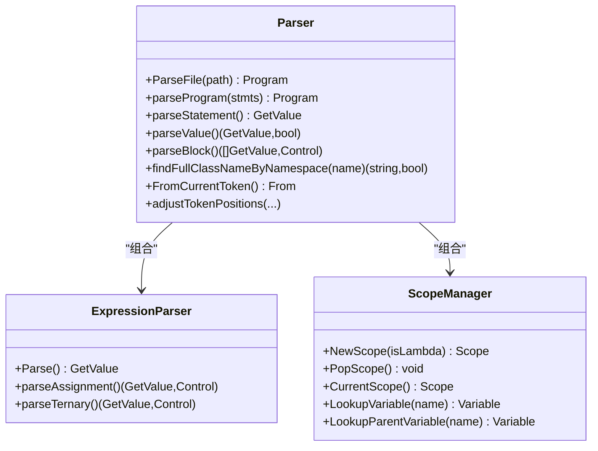
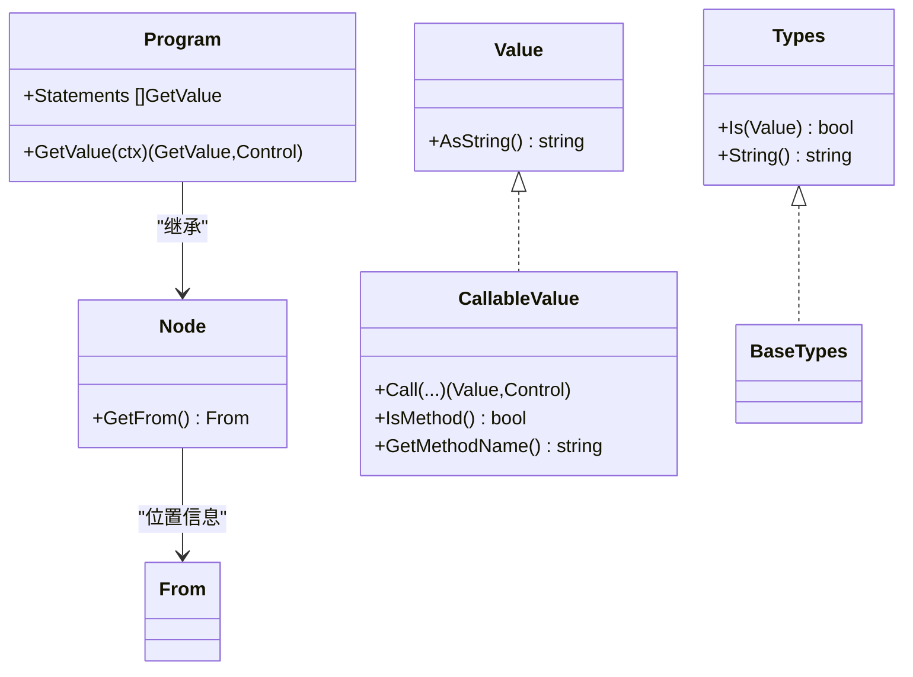
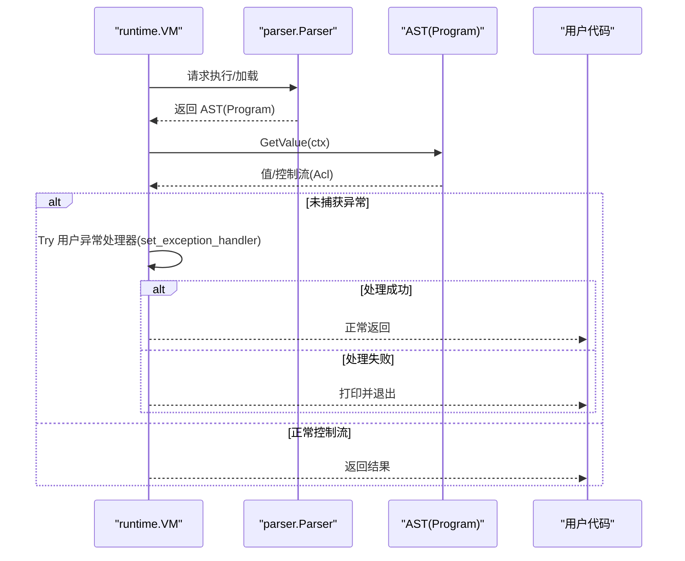
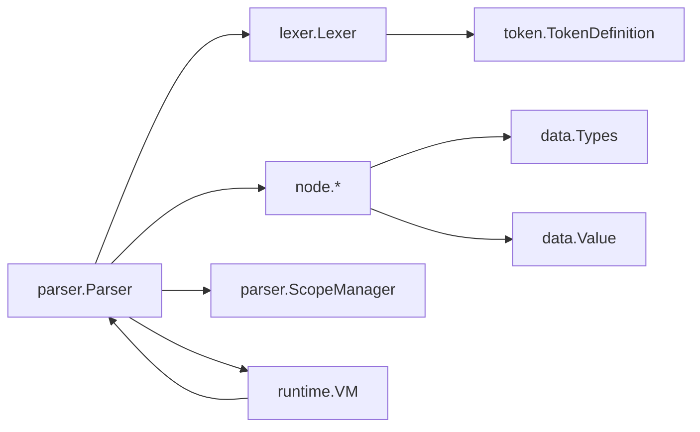

# 编译器系统

<cite>
**本文引用的文件**
- [lexer/lexer.go](file://lexer/lexer.go)
- [lexer/php_lexer.go](file://lexer/php_lexer.go)
- [lexer/special.go](file://lexer/special.go)
- [lexer/worker_token.go](file://lexer/worker_token.go)
- [token/token.go](file://token/token.go)
- [parser/parser.go](file://parser/parser.go)
- [parser/scope_manager.go](file://parser/scope_manager.go)
- [parser/expression_parser.go](file://parser/expression_parser.go)
- [parser/statement.go](file://parser/statement.go)
- [node/node.go](file://node/node.go)
- [data/types.go](file://data/types.go)
- [data/value.go](file://data/value.go)
- [runtime/vm.go](file://runtime/vm.go)
- [origami.go](file://origami.go)
</cite>

## 目录
1. [简介](#简介)
2. [项目结构](#项目结构)
3. [核心组件](#核心组件)
4. [架构总览](#架构总览)
5. [详细组件分析](#详细组件分析)
6. [依赖分析](#依赖分析)
7. [性能考量](#性能考量)
8. [故障排查指南](#故障排查指南)
9. [结论](#结论)
10. [附录](#附录)

## 简介
本文件面向编译器开发者，系统化阐述 Origami 编译器的词法分析、语法分析、AST 节点系统、作用域管理与语义分析、编译流程与运行时集成。重点覆盖：
- 词法分析器对令牌识别、特殊字符处理与 PHP 兼容模式的实现
- 语法分析器的 AST 节点体系、作用域管理与语义分析策略
- 从源码到 AST 再到目标代码/运行时的完整编译流程
- 设计决策、性能优化与扩展机制

## 项目结构
编译器相关模块主要分布在以下目录：
- 词法分析：lexer/*（含 DAG 匹配、特殊字符处理、PHP 模板模式）
- 令牌定义：token/*
- 语法分析：parser/*（含表达式解析、作用域管理、语句解析路由）
- AST 节点：node/*
- 数据与类型系统：data/*
- 运行时：runtime/*
- 入口：origami.go

**图表来源**
- [origami.go:34-67](file://origami.go#L34-L67)
- [parser/parser.go:36-50](file://parser/parser.go#L36-L50)
- [lexer/lexer.go:53-67](file://lexer/lexer.go#L53-L67)
- [lexer/php_lexer.go:11-200](file://lexer/php_lexer.go#L11-L200)
- [lexer/special.go:311-366](file://lexer/special.go#L311-L366)
- [lexer/worker_token.go:15-56](file://lexer/worker_token.go#L15-L56)
- [token/token.go:33-213](file://token/token.go#L33-L213)
- [parser/expression_parser.go:19-97](file://parser/expression_parser.go#L19-L97)
- [parser/scope_manager.go:70-100](file://parser/scope_manager.go#L70-L100)
- [parser/statement.go:20-46](file://parser/statement.go#L20-L46)
- [node/node.go:30-42](file://node/node.go#L30-L42)
- [data/types.go:5-262](file://data/types.go#L5-L262)
- [data/value.go:3-39](file://data/value.go#L3-L39)
- [runtime/vm.go:14-33](file://runtime/vm.go#L14-L33)

**章节来源**
- [origami.go:34-67](file://origami.go#L34-L67)
- [parser/parser.go:36-50](file://parser/parser.go#L36-L50)
- [lexer/lexer.go:53-67](file://lexer/lexer.go#L53-L67)

## 核心组件
- 词法分析器（Lexer）：基于 UTF-8 流扫描，支持空白/换行处理、Shebang 忽略、HTML 模板模式、DAG 最长匹配、关键字与标识符区分、特殊字符（注释、数字、字节字面量、插值字符串）处理与预处理管线。
- 令牌定义（TokenDefinition）：集中维护所有关键字、运算符、符号、字面量与 HTML 标签的定义，支持按类型查询与字面量映射。
- 语法分析器（Parser）：驱动词法分析，解析程序、语句与表达式，维护作用域栈，处理命名空间、use 别名、类/函数查找，生成 AST 并进行语义校验。
- 表达式解析器（ExpressionParser）：自顶向下优先级解析，支持赋值、三元/Elvis、空合并、字符串连接、空安全调用等。
- 作用域管理（ScopeManager）：作用域栈、变量登记、lambda 标记、父子作用域查找。
- AST 节点（node.*）：程序、语句、表达式、调用、变量、字面量等节点，统一携带位置信息与来源标记。
- 数据与类型系统（data.*）：类型接口、联合/可空/泛型/多返回值类型、值接口与可调用值接口。
- 运行时（VM）：类/接口/函数/常量注册、全局变量、异常处理回调、类路径缓存与加载。

**章节来源**
- [lexer/lexer.go:41-51](file://lexer/lexer.go#L41-L51)
- [token/token.go:23-31](file://token/token.go#L23-L31)
- [parser/parser.go:17-34](file://parser/parser.go#L17-L34)
- [parser/expression_parser.go:14-24](file://parser/expression_parser.go#L14-L24)
- [parser/scope_manager.go:64-68](file://parser/scope_manager.go#L64-L68)
- [node/node.go:7-19](file://node/node.go#L7-L19)
- [data/types.go:5-262](file://data/types.go#L5-L262)
- [data/value.go:3-39](file://data/value.go#L3-L39)
- [runtime/vm.go:35-56](file://runtime/vm.go#L35-L56)

## 架构总览
编译器入口负责初始化解析器与运行时，加载标准库与平台能力，随后加载并运行脚本文件。解析流程由词法分析器产出令牌，语法分析器构建 AST，运行时执行 AST 并处理控制流与异常。

**图表来源**
- [origami.go:34-67](file://origami.go#L34-L67)
- [parser/parser.go:86-122](file://parser/parser.go#L86-L122)
- [lexer/lexer.go:88-248](file://lexer/lexer.go#L88-L248)
- [runtime/vm.go:14-33](file://runtime/vm.go#L14-L33)

## 详细组件分析

### 词法分析器：令牌识别、特殊字符与 PHP 兼容
- DAG 最长匹配：将所有 TokenDefinition 构建为前缀树（DAG），在扫描过程中沿字符边移动，记录“最长匹配”以保证关键字优先级与最长原则。
- 关键字与标识符：对以字母/下划线/中文开头的序列，使用 DAG 匹配关键字；若关键字后仍有标识符字符则回退为标识符，避免误判。
- 特殊字符处理：
  - 注释：单行与多行注释识别与跳过，更新行号与列号。
  - 数字：整数/浮点/科学计数法/十六进制/二进制/八进制识别，返回 NUMBER/FLOAT/INT 等类型。
  - 字节字面量：b'...' 形式识别。
  - 插值字符串：LingToken 子令牌序列，交由语法分析器按链接规则组合。
- PHP 模板模式：TokenizeTemplate 支持嵌入式脚本块（<?php ... ?>），在 HTML 与脚本间切换，保留 HTML 文本为独立令牌。
- Shebang 忽略：自动跳过 #! 行，避免被当作文本输出。
- 预处理：最终经 Preprocessor.Process() 进一步规范化空白、换行与特殊序列。

**图表来源**
- [lexer/lexer.go:88-248](file://lexer/lexer.go#L88-L248)
- [lexer/php_lexer.go:11-200](file://lexer/php_lexer.go#L11-L200)
- [lexer/special.go:39-280](file://lexer/special.go#L39-L280)
- [lexer/special.go:311-366](file://lexer/special.go#L311-L366)

**章节来源**
- [lexer/lexer.go:69-81](file://lexer/lexer.go#L69-L81)
- [lexer/lexer.go:250-302](file://lexer/lexer.go#L250-L302)
- [lexer/lexer.go:304-349](file://lexer/lexer.go#L304-L349)
- [lexer/php_lexer.go:11-200](file://lexer/php_lexer.go#L11-L200)
- [lexer/special.go:39-280](file://lexer/special.go#L39-L280)
- [lexer/worker_token.go:15-56](file://lexer/worker_token.go#L15-L56)

### 语法分析器：AST 节点系统、作用域管理与语义分析
- 程序解析：parseProgram 遍历令牌，识别命名空间、use、类/函数声明与语句，构建 Program 节点。
- 语句解析路由：MainStatementParser 根据首个令牌类型选择对应解析器（命名空间、use、类、函数等）。
- 表达式解析：ExpressionParser 实现自顶向下优先级解析，支持赋值、三元/Elvis、空合并、字符串连接、空安全调用等。
- 作用域管理：ScopeManager 维护作用域栈，支持变量登记、lambda 标记、父子作用域查找。
- 命名空间与类解析：findFullClassNameByNamespace 支持 use 别名、相对/绝对命名空间解析、类路径管理器查找与 VM 注册查询。
- 位置信息：FromCurrentToken/FromPositionRange 提供精确的源码位置，便于错误定位与堆栈追踪。

**图表来源**
- [parser/parser.go:17-34](file://parser/parser.go#L17-L34)
- [parser/parser.go:124-158](file://parser/parser.go#L124-L158)
- [parser/parser.go:368-378](file://parser/parser.go#L368-L378)
- [parser/expression_parser.go:14-24](file://parser/expression_parser.go#L14-L24)
- [parser/expression_parser.go:26-97](file://parser/expression_parser.go#L26-L97)
- [parser/scope_manager.go:64-100](file://parser/scope_manager.go#L64-L100)

**章节来源**
- [parser/parser.go:86-122](file://parser/parser.go#L86-L122)
- [parser/parser.go:124-158](file://parser/parser.go#L124-L158)
- [parser/statement.go:20-46](file://parser/statement.go#L20-L46)
- [parser/expression_parser.go:26-97](file://parser/expression_parser.go#L26-L97)
- [parser/scope_manager.go:102-135](file://parser/scope_manager.go#L102-L135)
- [parser/parser.go:478-568](file://parser/parser.go#L478-L568)

### AST 节点系统与数据类型
- 节点基类：Node 携带 From 位置信息，Program 聚合语句序列，支持顺序执行与控制流（return/goto/label）。
- 表达式节点：二元运算、三元、空合并、字符串连接、变量、字面量等，均实现 GetValue 接口。
- 类型系统：Types 接口及其实现（基础类型、联合、可空、泛型、多返回值、静态类型、闭包类型、空类型等），支持类型判断与字符串化。
- 值系统：Value/CallableValue 接口，统一值访问与调用，支持属性/方法访问与 ZVal 包装。

**图表来源**
- [node/node.go:7-19](file://node/node.go#L7-L19)
- [node/node.go:30-42](file://node/node.go#L30-L42)
- [data/types.go:5-262](file://data/types.go#L5-L262)
- [data/value.go:3-39](file://data/value.go#L3-L39)

**章节来源**
- [node/node.go:30-42](file://node/node.go#L30-L42)
- [data/types.go:142-188](file://data/types.go#L142-L188)
- [data/types.go:83-106](file://data/types.go#L83-L106)
- [data/value.go:3-39](file://data/value.go#L3-L39)

### 运行时与控制流
- VM：注册类/接口/函数/常量，维护全局变量与类路径缓存，处理未捕获异常与 set_exception_handler 回调。
- 控制流：ThrowControl 优先调用用户异常处理器，否则回退至底层处理；支持 ACL（异常/控制流）传播与堆栈帧记录。
- 上下文：CreateContext/变量绑定，配合 VM 执行 AST。

**图表来源**
- [runtime/vm.go:14-33](file://runtime/vm.go#L14-L33)
- [runtime/vm.go:73-104](file://runtime/vm.go#L73-L104)
- [parser/parser.go:86-122](file://parser/parser.go#L86-L122)
- [node/node.go:44-70](file://node/node.go#L44-L70)

**章节来源**
- [runtime/vm.go:73-104](file://runtime/vm.go#L73-L104)
- [runtime/vm.go:14-33](file://runtime/vm.go#L14-L33)
- [node/node.go:44-70](file://node/node.go#L44-L70)

## 依赖分析
- 低耦合：词法/语法/运行时通过接口解耦，Parser 仅依赖 Lexer 与 TokenDefinition，VM 仅依赖 Parser 与 AST。
- 令牌定义集中：TokenDefinition 与 GetTokenDefinitions 提供统一的词法规则与查询。
- 作用域与类型：ScopeManager 与 Types 独立于具体节点，便于扩展与测试。

**图表来源**
- [lexer/lexer.go:53-67](file://lexer/lexer.go#L53-L67)
- [token/token.go:33-213](file://token/token.go#L33-L213)
- [parser/parser.go:17-34](file://parser/parser.go#L17-L34)
- [parser/scope_manager.go:64-68](file://parser/scope_manager.go#L64-L68)
- [node/node.go:7-19](file://node/node.go#L7-L19)
- [data/types.go:5-262](file://data/types.go#L5-L262)
- [data/value.go:3-39](file://data/value.go#L3-L39)
- [runtime/vm.go:35-56](file://runtime/vm.go#L35-L56)

**章节来源**
- [token/token.go:33-213](file://token/token.go#L33-L213)
- [parser/parser.go:17-34](file://parser/parser.go#L17-L34)
- [runtime/vm.go:35-56](file://runtime/vm.go#L35-L56)

## 性能考量
- 词法阶段
  - DAG 匹配：O(L) 时间复杂度（L 为匹配长度），避免回溯；建议保持 TokenDefinition 精简与有序，减少分支。
  - UTF-8 解码：逐字符解码，注意热点路径的缓存与批量处理。
  - 预处理：尽量在词法阶段完成规范化，减少语法阶段额外开销。
- 语法阶段
  - 优先级解析：ExpressionParser 采用自顶向下，避免递归下降的回溯成本；建议对高频运算符设置更高优先级以减少括号。
  - 作用域查找：ScopeManager 使用哈希表存储变量，查找 O(1)，注意变量命名冲突与作用域弹栈时机。
- 运行时
  - VM 类/接口/函数注册使用并发读锁保护，写操作加锁；建议批量注册与延迟加载策略。
  - 异常处理回调避免递归调用，必要时引入 inExceptionHandler 标志位。

[本节为通用性能讨论，无需特定文件引用]

## 故障排查指南
- 词法错误
  - 无法识别字符：检查特殊字符处理与 UTF-8 错误分支，确认 WorkerToken UNKNOWN 类型的输出位置。
  - Shebang 未忽略：确认 Tokenize/TokenizeTemplate 对首行 #! 的处理。
  - 注释/数字识别异常：核对 handleComment/handleNumber 的终止条件与进制判定。
- 语法错误
  - 三目/Elvis/空合并解析失败：检查 parseTernary 的分支与冒号缺失提示。
  - 命名空间解析失败：核对 findFullClassNameByNamespace 的 use 别名、相对/绝对命名空间与类路径管理器。
- 运行时错误
  - 未捕获异常：确认 set_exception_handler 回调注册与 inExceptionHandler 标志位。
  - 控制流丢失：检查 Program.GetValue 中的 ReturnControl/GotoControl/LabelControl 分支。

**章节来源**
- [lexer/lexer.go:234-248](file://lexer/lexer.go#L234-L248)
- [lexer/special.go:39-280](file://lexer/special.go#L39-L280)
- [parser/expression_parser.go:99-198](file://parser/expression_parser.go#L99-L198)
- [parser/parser.go:478-568](file://parser/parser.go#L478-L568)
- [runtime/vm.go:73-104](file://runtime/vm.go#L73-L104)

## 结论
Origami 编译器以清晰的分层设计实现了从源码到 AST 再到运行时的完整流程。词法分析采用 DAG 最长匹配与特殊字符处理保障了 PHP 兼容性；语法分析通过表达式优先级与作用域管理实现强健的语义分析；运行时提供完善的异常处理与扩展点。整体架构利于扩展与维护，适合进一步增强类型推断、增量编译与跨平台目标生成。

[本节为总结性内容，无需特定文件引用]

## 附录
- 设计要点
  - 令牌定义集中化，便于维护与扩展。
  - 作用域管理与类型系统分离，降低耦合。
  - 运行时异常处理可插拔，便于集成用户态错误处理。
- 扩展建议
  - 词法：增加更多 PHP 兼容特性（如 heredoc/nowdoc、多行字符串）与 Unicode 标识符支持。
  - 语法：引入类型推断与静态检查钩子，增强 IDE/LSP 能力。
  - 运行时：支持 JIT/解释混合执行与多目标后端（WASM/Go/JS）。

[本节为概念性内容，无需特定文件引用]