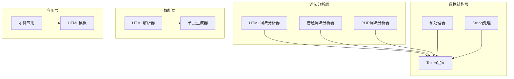
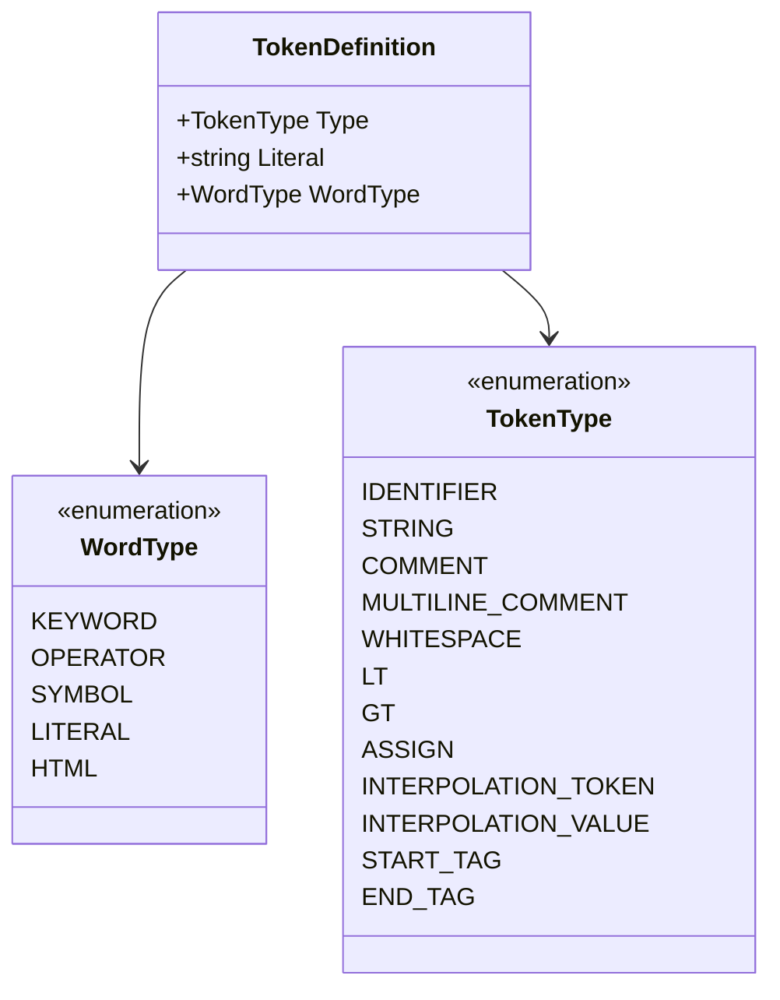
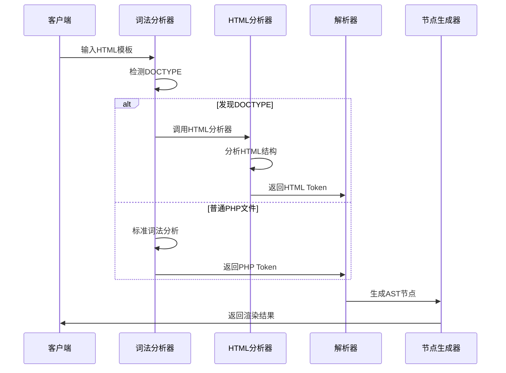
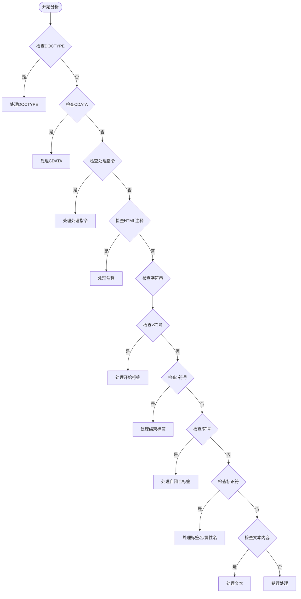
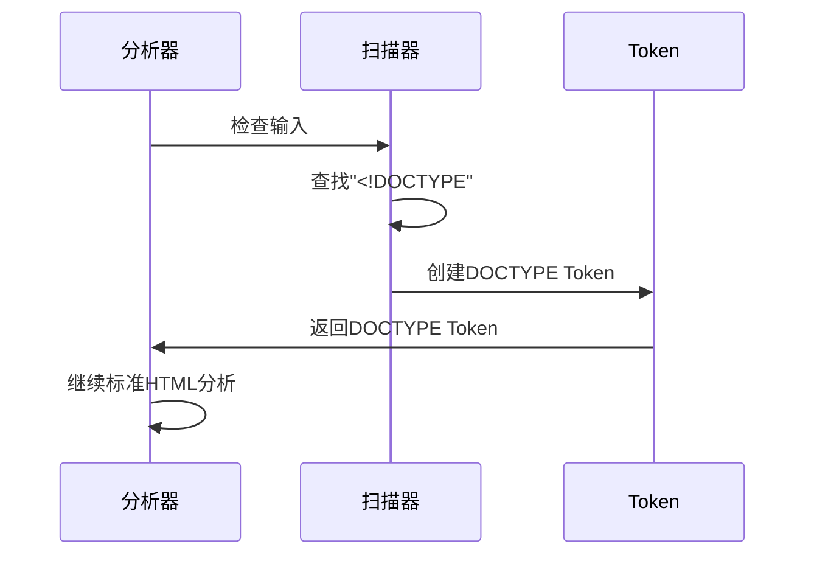
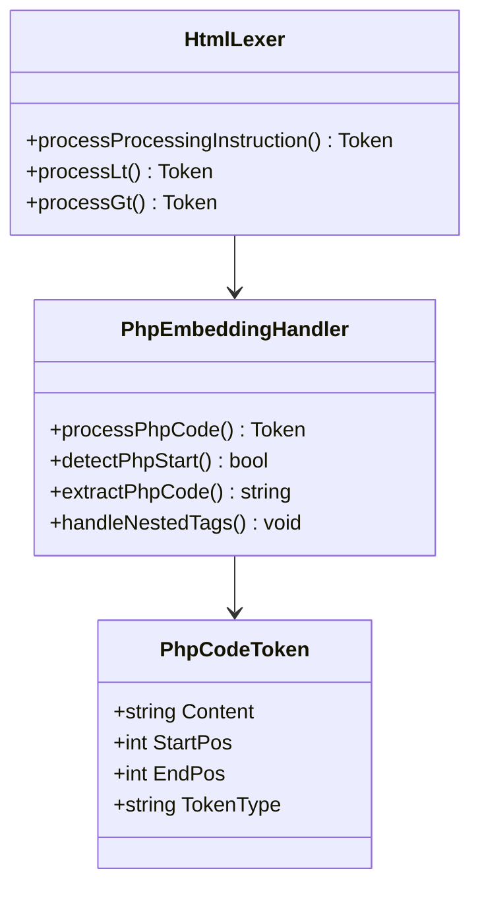
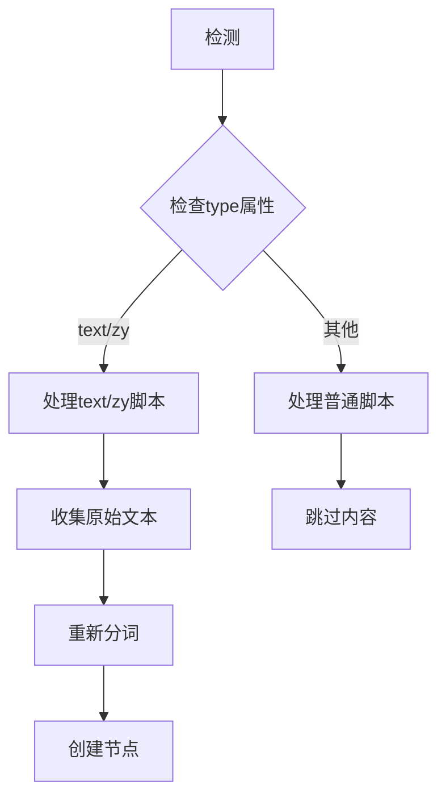
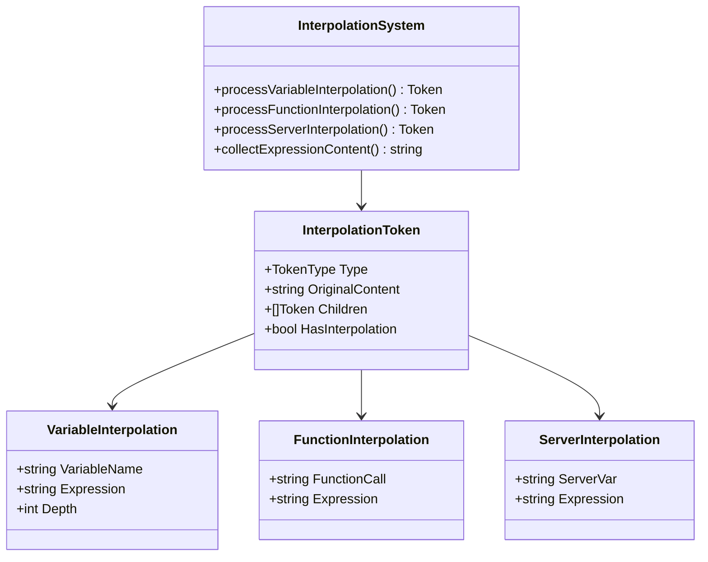
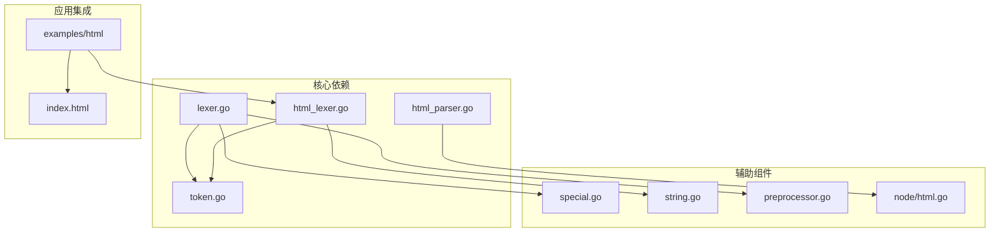

# HTML词法分析器

<cite>
**本文档引用的文件**
- [html_lexer.go](file://lexer/html_lexer.go)
- [lexer.go](file://lexer/lexer.go)
- [php_lexer.go](file://lexer/php_lexer.go)
- [special.go](file://lexer/special.go)
- [string.go](file://lexer/string.go)
- [string_heredoc.go](file://lexer/string_heredoc.go)
- [string_quoted.go](file://lexer/string_quoted.go)
- [preprocessor.go](file://lexer/preprocessor.go)
- [token.go](file://token/token.go)
- [html.go](file://node/html.go)
- [html_parser.go](file://parser/html_parser.go)
- [html_attributes.go](file://parser/html_attributes.go)
- [html_attrs.go](file://node/html_attrs.go)
- [index.html](file://index.html)
- [main.zy](file://examples/html/main.zy)
- [index.html](file://examples/html/pages/index.html)
</cite>

## 目录
1. [简介](#简介)
2. [项目结构](#项目结构)
3. [核心组件](#核心组件)
4. [架构概览](#架构概览)
5. [详细组件分析](#详细组件分析)
6. [依赖分析](#依赖分析)
7. [性能考虑](#性能考虑)
8. [故障排除指南](#故障排除指南)
9. [结论](#结论)
10. [附录](#附录)

## 简介

HTML词法分析器是Origami语言系统中的核心组件，专门负责处理HTML模板文件的词法分析。该分析器不仅能够识别标准的HTML标签、属性和文本内容，还具备处理PHP嵌入代码、HTML注释、DOCTYPE声明等高级功能的能力。

该系统采用模块化设计，通过独立的HTML词法分析器与通用词法分析器协作，实现了对HTML模板的精确解析。分析器能够智能识别HTML特殊标签（如script、style、textarea），并正确处理嵌入式PHP代码的隔离和解析。

## 项目结构

项目采用分层架构设计，主要包含以下核心模块：

**图表来源**
- [html_lexer.go:1-1254](file://lexer/html_lexer.go#L1-L1254)
- [lexer.go:1-350](file://lexer/lexer.go#L1-L350)
- [php_lexer.go:1-200](file://lexer/php_lexer.go#L1-L200)

**章节来源**
- [html_lexer.go:1-1254](file://lexer/html_lexer.go#L1-L1254)
- [lexer.go:1-350](file://lexer/lexer.go#L1-L350)

## 核心组件

### HTML词法分析器 (HtmlLexer)

HTML词法分析器是系统的核心组件，专门处理HTML模板文件的词法分析。其主要特点包括：

- **保留所有字符**：与普通词法分析器不同，HTML分析器保留所有字符，包括空格和换行符
- **智能标签识别**：能够准确识别HTML标签的开始和结束
- **属性处理**：支持多种属性值类型的处理
- **文本内容提取**：能够处理标签之间的文本内容

### Token定义系统

系统使用统一的Token定义系统，支持多种Token类型：

**图表来源**
- [token.go:24-213](file://token/token.go#L24-L213)

**章节来源**
- [token.go:1-213](file://token/token.go#L1-L213)

## 架构概览

系统采用分层架构，各层职责明确：

**图表来源**
- [lexer.go:88-248](file://lexer/lexer.go#L88-L248)
- [html_lexer.go:25-147](file://lexer/html_lexer.go#L25-L147)

## 详细组件分析

### HTML标签识别机制

HTML词法分析器采用优先级处理策略，按照特定顺序识别不同的HTML元素：

**图表来源**
- [html_lexer.go:41-147](file://lexer/html_lexer.go#L41-L147)

#### DOCTYPE声明处理

DOCTYPE声明具有最高优先级，系统会立即识别并处理：

**图表来源**
- [html_lexer.go:149-174](file://lexer/html_lexer.go#L149-L174)

#### HTML注释处理

HTML注释采用特殊处理机制，确保注释内容被正确识别和处理：

**章节来源**
- [html_lexer.go:265-301](file://lexer/html_lexer.go#L265-L301)

### PHP嵌入代码识别

系统能够智能识别和处理嵌入在HTML中的PHP代码：

**图表来源**
- [html_lexer.go:214-263](file://lexer/html_lexer.go#L214-L263)

**章节来源**
- [php_lexer.go:11-199](file://lexer/php_lexer.go#L11-L199)

### 特殊标签处理策略

系统针对HTML特殊标签（如script、style、textarea）采用了专门的处理策略：

#### Script标签处理

**图表来源**
- [html_parser.go:116-161](file://parser/html_parser.go#L116-L161)

**章节来源**
- [html_parser.go:554-599](file://parser/html_parser.go#L554-L599)

### 文本插值系统

HTML词法分析器支持复杂的文本插值功能，包括多种插值语法：

**图表来源**
- [html_lexer.go:808-1213](file://lexer/html_lexer.go#L808-L1213)

**章节来源**
- [html_lexer.go:808-1213](file://lexer/html_lexer.go#L808-L1213)

### 字符串处理机制

系统提供了完整的字符串处理能力，支持多种字符串类型：

**章节来源**
- [string.go:1-69](file://lexer/string.go#L1-L69)
- [string_heredoc.go:1-67](file://lexer/string_heredoc.go#L1-L67)
- [string_quoted.go:1-80](file://lexer/string_quoted.go#L1-L80)

## 依赖分析

系统采用松耦合设计，各组件间依赖关系清晰：

**图表来源**
- [lexer.go:1-350](file://lexer/lexer.go#L1-L350)
- [html_lexer.go:1-1254](file://lexer/html_lexer.go#L1-L1254)

**章节来源**
- [lexer.go:1-350](file://lexer/lexer.go#L1-L350)
- [html_lexer.go:1-1254](file://lexer/html_lexer.go#L1-L1254)

## 性能考虑

系统在设计时充分考虑了性能优化：

### 时间复杂度分析

- **HTML分析**：O(n)，其中n为输入字符串长度
- **Token识别**：每个字符最多被扫描常数次
- **嵌套结构处理**：使用栈结构，时间复杂度为O(n)

### 空间复杂度优化

- **Token缓存**：避免重复分配内存
- **字符串池**：重用常用的字符串常量
- **增量解析**：支持流式处理大型HTML文件

### 缓存策略

系统采用多级缓存机制：

1. **Token缓存**：缓存已识别的Token
2. **解析缓存**：缓存解析结果
3. **编译缓存**：缓存编译后的代码

## 故障排除指南

### 常见问题及解决方案

#### 1. HTML标签未正确识别

**症状**：HTML标签被错误地识别为文本内容

**原因分析**：
- 标签内包含未转义的特殊字符
- 标签格式不规范

**解决方案**：
- 检查HTML标签的完整性
- 确保特殊字符正确转义

#### 2. PHP代码被错误解析

**症状**：嵌入的PHP代码被当作HTML文本处理

**原因分析**：
- PHP标签未正确闭合
- 嵌套标签处理错误

**解决方案**：
- 检查PHP标签的闭合
- 确保嵌套结构正确

#### 3. 文本插值失效

**症状**：插值表达式未被正确解析

**原因分析**：
- 插值语法不正确
- 嵌套括号未正确匹配

**解决方案**：
- 检查插值语法格式
- 确保括号正确匹配

**章节来源**
- [html_lexer.go:132-146](file://lexer/html_lexer.go#L132-L146)
- [html_parser.go:785-800](file://parser/html_parser.go#L785-L800)

## 结论

HTML词法分析器是一个功能强大、设计精良的组件，它成功地解决了HTML模板处理中的复杂问题。通过模块化设计和智能算法，系统能够准确识别HTML结构、处理嵌入式PHP代码、支持丰富的插值语法，并提供良好的性能表现。

该分析器的主要优势包括：

1. **准确性**：能够正确处理复杂的HTML结构和嵌套关系
2. **灵活性**：支持多种插值语法和特殊标签处理
3. **性能**：采用高效的算法和优化策略
4. **可扩展性**：模块化设计便于功能扩展和维护

对于Web开发者而言，该系统提供了强大的HTML模板处理能力，能够满足现代Web开发的各种需求。

## 附录

### 使用示例

系统提供了完整的示例应用，展示了HTML词法分析器的实际应用场景：

**章节来源**
- [main.zy:1-74](file://examples/html/main.zy#L1-L74)
- [index.html:1-70](file://examples/html/pages/index.html#L1-L70)

### 扩展指南

开发者可以通过以下方式扩展HTML词法分析器的功能：

1. **自定义Token类型**：在token.go中添加新的Token定义
2. **特殊标签处理**：在html_lexer.go中添加新的标签处理函数
3. **插值语法扩展**：在html_lexer.go中实现新的插值处理逻辑
4. **解析器增强**：在html_parser.go中添加新的解析规则