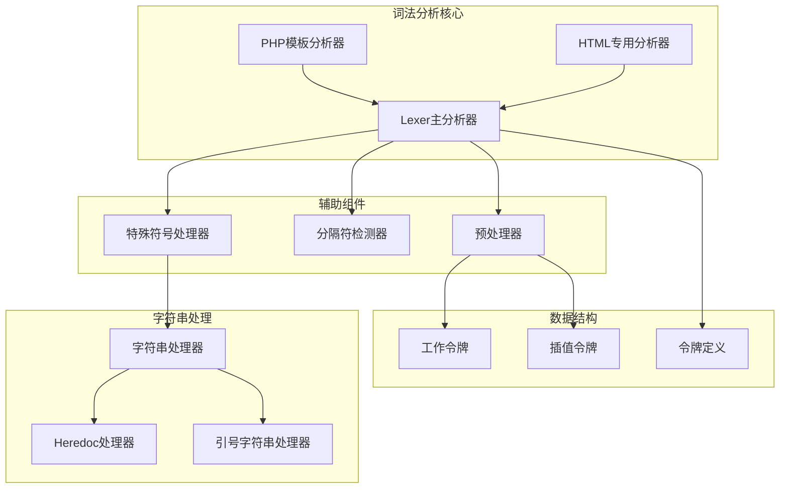
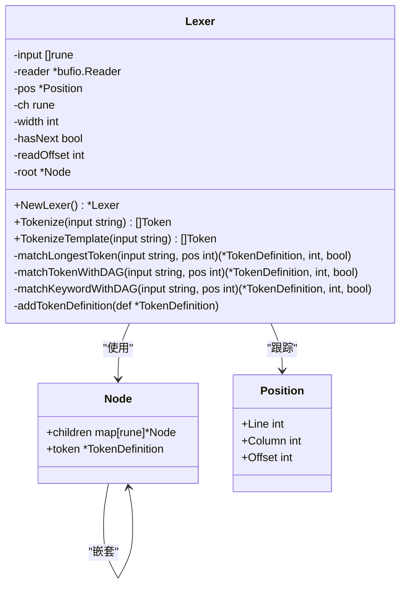
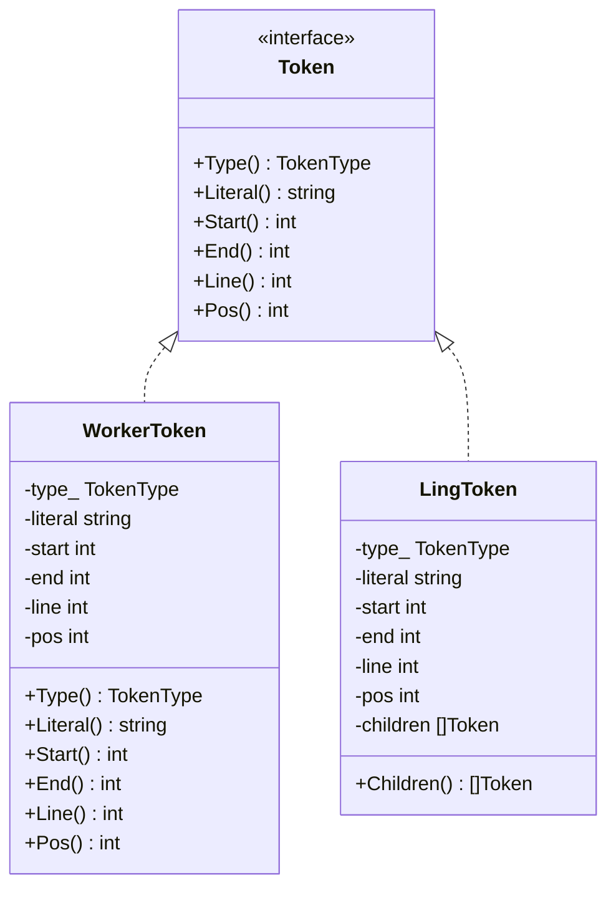
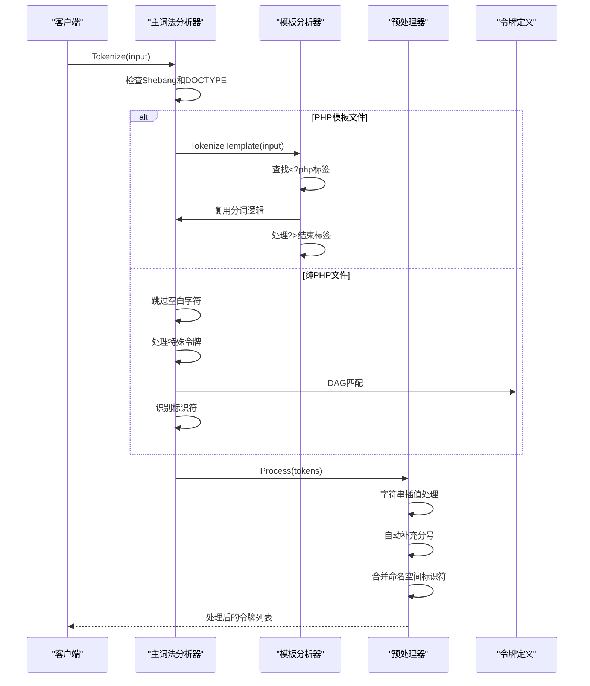
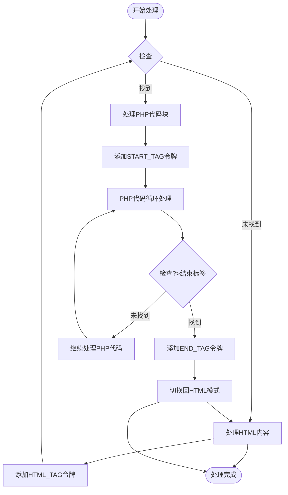
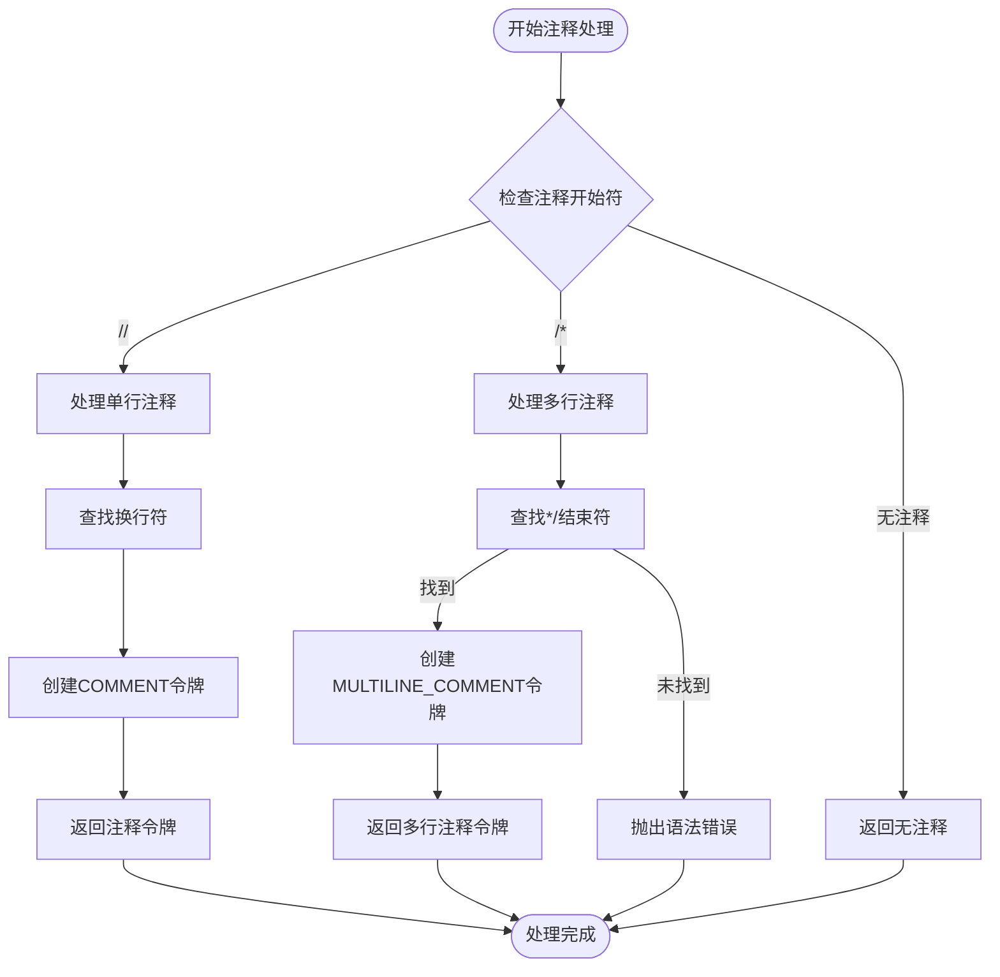
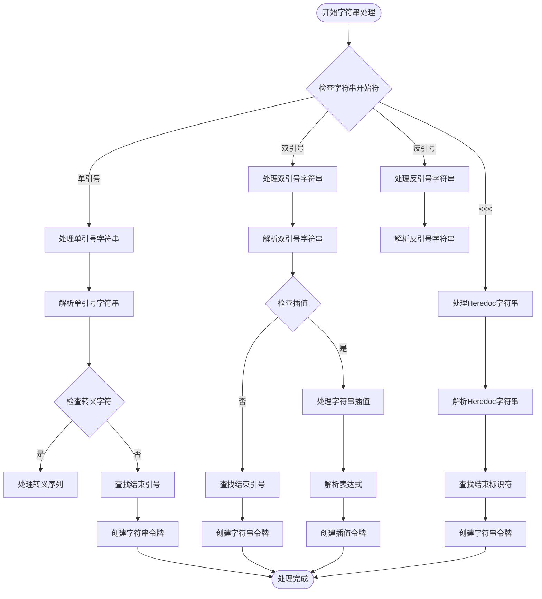
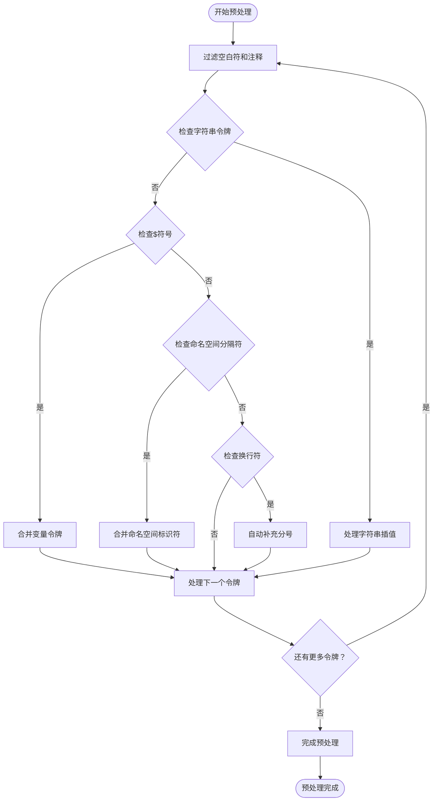
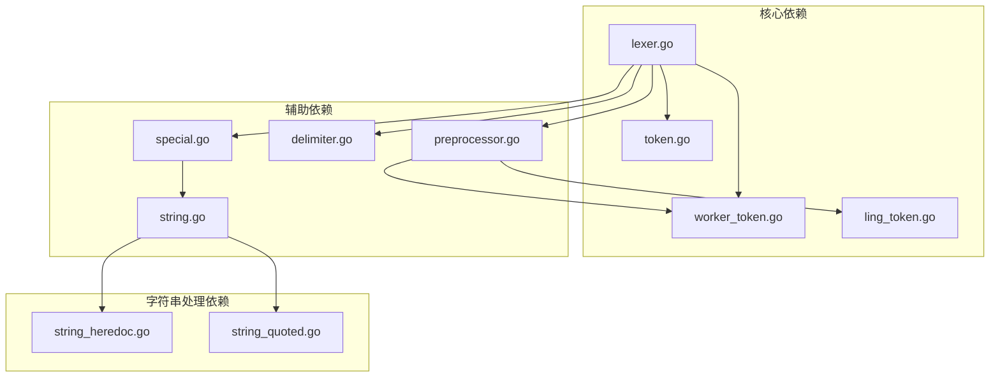

# PHP词法分析器

<cite>
**本文档引用的文件**
- [lexer.go](file://lexer/lexer.go)
- [php_lexer.go](file://lexer/php_lexer.go)
- [html_lexer.go](file://lexer/html_lexer.go)
- [special.go](file://lexer/special.go)
- [string.go](file://lexer/string.go)
- [string_heredoc.go](file://lexer/string_heredoc.go)
- [string_quoted.go](file://lexer/string_quoted.go)
- [preprocessor.go](file://lexer/preprocessor.go)
- [delimiter.go](file://lexer/delimiter.go)
- [worker_token.go](file://lexer/worker_token.go)
- [ling_token.go](file://lexer/ling_token.go)
- [token.go](file://token/token.go)
- [type_config.go](file://token/type_config.go)
- [lexer_test.go](file://lexer/lexer_test.go)
- [preprocessor_test.go](file://lexer/preprocessor_test.go)
- [special_test.go](file://lexer/special_test.go)
</cite>

## 目录
1. [简介](#简介)
2. [项目结构](#项目结构)
3. [核心组件](#核心组件)
4. [架构概览](#架构概览)
5. [详细组件分析](#详细组件分析)
6. [依赖关系分析](#依赖关系分析)
7. [性能考虑](#性能考虑)
8. [故障排除指南](#故障排除指南)
9. [结论](#结论)
10. [附录](#附录)

## 简介

PHP词法分析器是一个专为PHP语言设计的高性能词法分析系统，能够准确识别PHP语法中的各种构造，包括PHP标签处理、命名空间声明、use语句、类和接口定义等PHP特有语法。该分析器采用先进的DAG（有向无环图）匹配算法，结合预处理器机制，实现了对PHP复杂语法的精确解析。

该系统支持PHP与HTML的混合模式处理，能够智能识别PHP标签（<?php ?>）并在不同模式间无缝切换。同时，它提供了完整的注释处理能力，包括单行注释（//）、多行注释（/* */）、以及PHP文档注释（/** */）的识别。

## 项目结构

该项目采用模块化的架构设计，主要分为以下几个核心模块：



**图表来源**
- [lexer.go:1-350](file://lexer/lexer.go#L1-L350)
- [php_lexer.go:1-200](file://lexer/php_lexer.go#L1-L200)
- [html_lexer.go:1-800](file://lexer/html_lexer.go#L1-L800)

**章节来源**
- [lexer.go:1-350](file://lexer/lexer.go#L1-L350)
- [token.go:1-213](file://token/token.go#L1-L213)

## 核心组件

### 词法分析器主类

Lexer类是整个词法分析系统的核心，采用了DAG（有向无环图）结构来高效匹配PHP关键字和操作符。该设计使得词法分析过程具有O(k)的时间复杂度，其中k是关键字的最大长度。



**图表来源**
- [lexer.go:41-51](file://lexer/lexer.go#L41-L51)
- [lexer.go:69-81](file://lexer/lexer.go#L69-L81)
- [lexer.go:12-17](file://lexer/lexer.go#L12-L17)

### 令牌系统

系统采用统一的令牌接口设计，支持多种类型的令牌，包括关键字、操作符、字面量、注释等。每个令牌都包含完整的位置信息，便于后续的语法分析和错误定位。



**图表来源**
- [worker_token.go:5-13](file://lexer/worker_token.go#L5-L13)
- [ling_token.go:5-14](file://lexer/ling_token.go#L5-L14)

**章节来源**
- [worker_token.go:1-56](file://lexer/worker_token.go#L1-L56)
- [ling_token.go:1-63](file://lexer/ling_token.go#L1-L63)

## 架构概览

PHP词法分析器采用分层架构设计，从底层的DAG匹配到高层的预处理机制，形成了完整的分析流水线。



**图表来源**
- [lexer.go:88-248](file://lexer/lexer.go#L88-L248)
- [php_lexer.go:11-199](file://lexer/php_lexer.go#L11-L199)

## 详细组件分析

### PHP标签处理机制

PHP词法分析器实现了智能的PHP标签切换机制，能够准确识别和处理PHP代码块与HTML内容的混合模式。



**图表来源**
- [php_lexer.go:11-199](file://lexer/php_lexer.go#L11-L199)

该机制通过两阶段处理实现：首先识别PHP标签边界，然后在PHP模式下应用标准的词法规则，在HTML模式下保留所有字符。

**章节来源**
- [php_lexer.go:11-199](file://lexer/php_lexer.go#L11-L199)

### 注释处理系统

系统提供了完整的注释处理能力，支持多种注释格式的识别和处理。



**图表来源**
- [special.go:38-77](file://lexer/special.go#L38-L77)

**章节来源**
- [special.go:38-77](file://lexer/special.go#L38-L77)

### 字符串处理机制

PHP词法分析器支持多种字符串格式的处理，包括普通字符串、Heredoc字符串和Nowdoc字符串。



**图表来源**
- [string.go:44-68](file://lexer/string.go#L44-L68)
- [string_heredoc.go:9-66](file://lexer/string_heredoc.go#L9-L66)
- [string_quoted.go:7-79](file://lexer/string_quoted.go#L7-L79)

**章节来源**
- [string.go:44-68](file://lexer/string.go#L44-L68)
- [string_heredoc.go:9-66](file://lexer/string_heredoc.go#L9-L66)
- [string_quoted.go:7-79](file://lexer/string_quoted.go#L7-L79)

### 预处理器功能

预处理器负责对基础令牌进行后处理，实现字符串插值、自动补分号、命名空间合并等功能。



**图表来源**
- [preprocessor.go:189-350](file://lexer/preprocessor.go#L189-L350)

**章节来源**
- [preprocessor.go:189-350](file://lexer/preprocessor.go#L189-L350)

## 依赖关系分析

词法分析器的依赖关系相对简单，主要依赖于令牌定义和基本的数据结构。



**图表来源**
- [lexer.go:3-10](file://lexer/lexer.go#L3-L10)
- [special.go:3-8](file://lexer/special.go#L3-L8)

**章节来源**
- [lexer.go:3-10](file://lexer/lexer.go#L3-L10)
- [special.go:3-8](file://lexer/special.go#L3-L8)

## 性能考虑

### DAG匹配算法优化

词法分析器采用DAG（有向无环图）结构来存储和匹配PHP关键字，这种设计具有以下优势：

1. **时间复杂度优化**：匹配过程为O(k)，其中k为关键字的最大长度
2. **空间效率**：共享相同的前缀路径，减少内存占用
3. **扩展性**：新增关键字只需在现有路径上扩展，无需重构整个结构

### 内存管理策略

系统采用了高效的内存管理策略：

- **缓冲区复用**：使用bufio.Reader进行输入流的缓冲读取
- **令牌池化**：WorkerToken和LingToken结构体经过精心设计，减少内存碎片
- **延迟初始化**：DAG结构按需构建，避免不必要的内存分配

### 并发安全性

词法分析器在设计时考虑了并发使用的场景：

- **无状态设计**：Lexer实例不保存可变状态，可在多个goroutine中安全使用
- **不可变令牌**：生成的令牌对象都是不可变的，避免竞态条件
- **线程安全的令牌定义**：TokenDefinitions使用sync.Once确保初始化的原子性

## 故障排除指南

### 常见问题诊断

#### 1. PHP标签识别问题

**症状**：PHP代码块未被正确识别为PHP模式

**解决方案**：
- 检查PHP标签是否正确闭合
- 确认标签前后没有多余的字符
- 验证编码格式是否为UTF-8

#### 2. 字符串插值错误

**症状**：字符串中的变量插值未被正确解析

**解决方案**：
- 检查插值语法是否符合PHP规范
- 确认变量名符合PHP标识符规则
- 验证表达式括号是否正确匹配

#### 3. 注释处理异常

**症状**：注释内容被错误地识别为代码

**解决方案**：
- 检查注释开始符是否正确
- 确认注释结束符是否存在
- 验证注释嵌套是否正确

### 调试技巧

#### 1. 位置信息追踪

系统提供了完整的位置信息追踪功能，可以通过以下方式调试：

```go
// 获取令牌的详细位置信息
fmt.Printf("Token: %s, Line: %d, Column: %d, Start: %d, End: %d\n", 
    token.Literal(), 
    token.Line(), 
    token.Pos(), 
    token.Start(), 
    token.End())
```

#### 2. 令牌序列验证

使用测试框架验证令牌序列的正确性：

```go
// 运行词法分析测试
go test ./lexer -run TestTokenPositions -v
```

**章节来源**
- [lexer_test.go:27-144](file://lexer/lexer_test.go#L27-L144)

## 结论

PHP词法分析器是一个设计精良、功能完备的词法分析系统，具有以下特点：

1. **高性能**：采用DAG匹配算法，实现O(k)时间复杂度的关键字匹配
2. **完整性**：支持PHP的所有核心语法特性，包括复杂的字符串处理和注释识别
3. **可扩展性**：模块化设计便于功能扩展和维护
4. **可靠性**：完善的错误处理和位置追踪机制

该系统为PHP开发提供了强大的基础设施，能够支持从简单的PHP脚本到复杂的Web应用程序的各种需求。通过合理的架构设计和优化策略，系统在保证功能完整性的同时，也确保了良好的性能表现。

## 附录

### 使用示例

#### 基本使用方法

```go
// 创建词法分析器实例
lexer := NewLexer()

// 分析PHP代码
code := `<?php
namespace App\Controllers;
class UserController {
    public function index() {
        echo "Hello World";
    }
}
?>`

tokens := lexer.Tokenize(code)
```

#### 扩展方法

要扩展词法分析器以支持新的PHP语法特性：

1. **添加新的令牌类型**：在`type_config.go`中定义新的TokenType
2. **更新令牌定义**：在`token.go`中添加相应的TokenDefinition
3. **实现处理逻辑**：在相应的处理器中添加新语法的支持
4. **编写测试用例**：在测试文件中验证新功能的正确性

### API参考

#### 主要接口

- `NewLexer() *Lexer`：创建新的词法分析器实例
- `Tokenize(input string) []Token`：分析输入字符串并返回令牌列表
- `TokenizeTemplate(input string) []Token`：处理包含PHP标签的模板文件

#### 令牌类型

系统支持的令牌类型包括：
- 关键字：if、else、class、function等
- 操作符：+, -, *, /, =, ==等
- 字面量：字符串、数字、布尔值等
- 注释：单行注释、多行注释
- 标识符：变量名、函数名、类名等