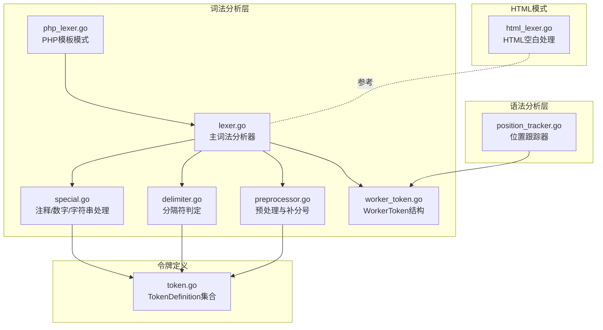
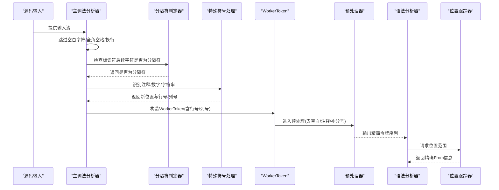
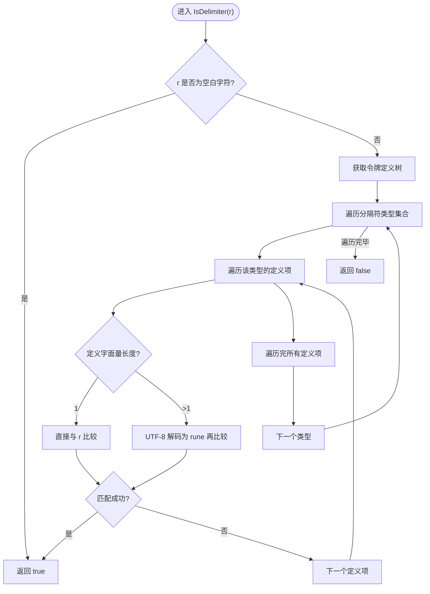
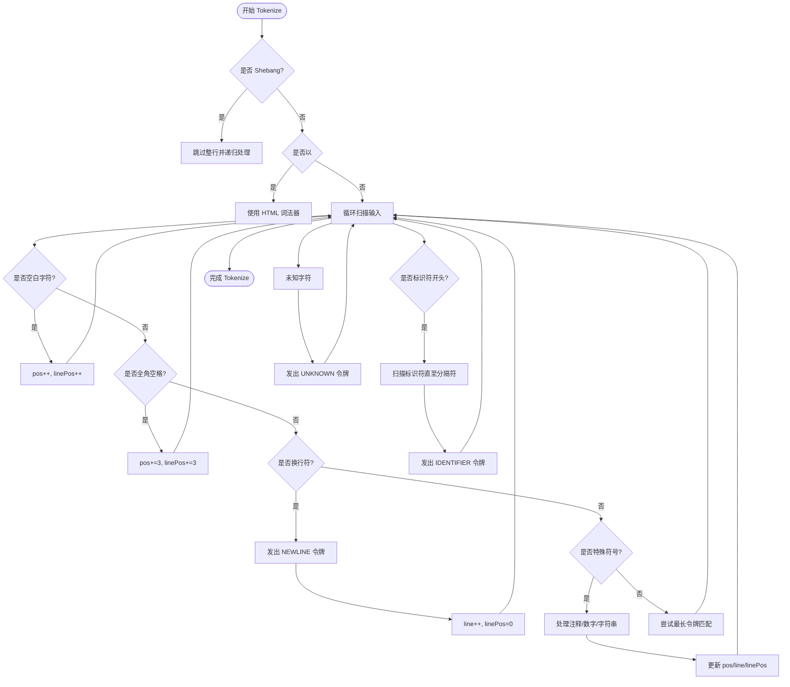
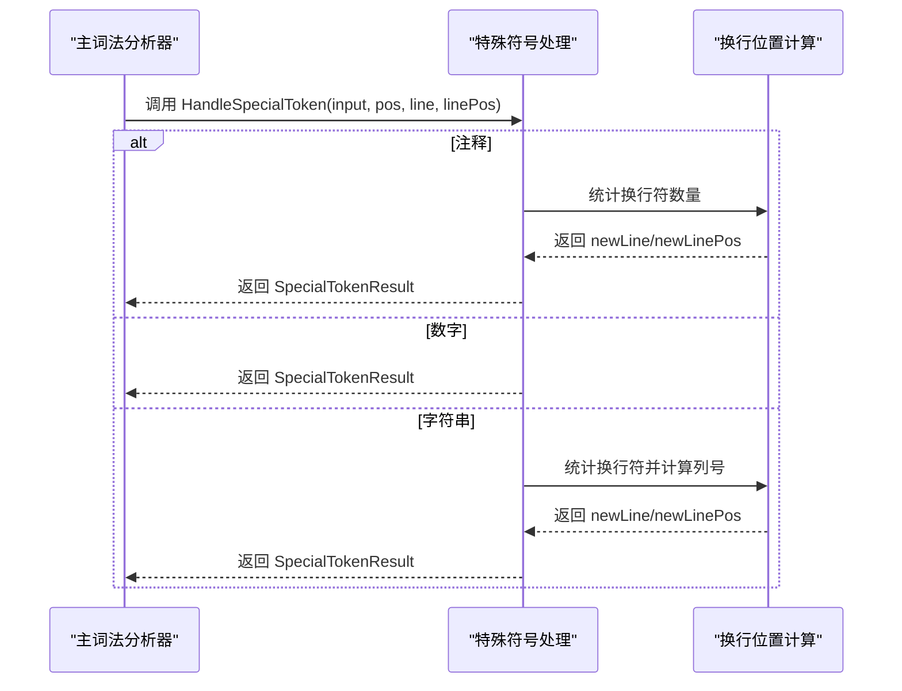
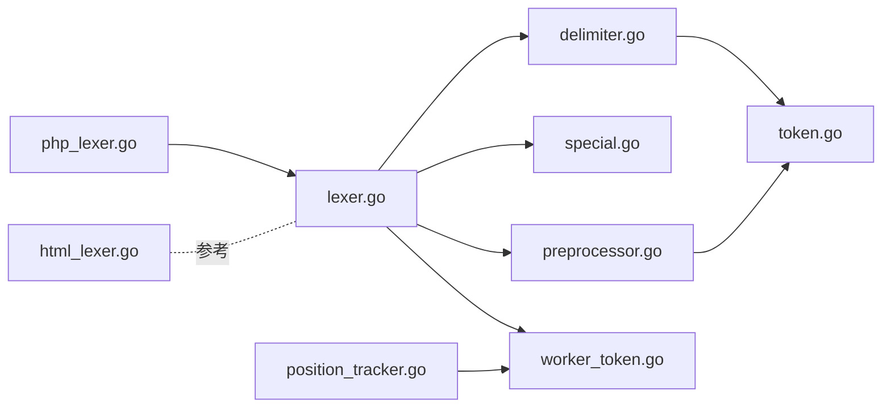

# 分隔符处理

<cite>
**本文引用的文件**
- [delimiter.go](file://lexer/delimiter.go)
- [lexer.go](file://lexer/lexer.go)
- [php_lexer.go](file://lexer/php_lexer.go)
- [special.go](file://lexer/special.go)
- [preprocessor.go](file://lexer/preprocessor.go)
- [worker_token.go](file://lexer/worker_token.go)
- [position_tracker.go](file://parser/position_tracker.go)
- [token.go](file://token/token.go)
- [html_lexer.go](file://lexer/html_lexer.go)
</cite>

## 目录
1. [简介](#简介)
2. [项目结构](#项目结构)
3. [核心组件](#核心组件)
4. [架构总览](#架构总览)
5. [详细组件分析](#详细组件分析)
6. [依赖分析](#依赖分析)
7. [性能考量](#性能考量)
8. [故障排查指南](#故障排查指南)
9. [结论](#结论)
10. [附录](#附录)

## 简介
本文件聚焦于词法分析器中的“分隔符处理”机制，系统性阐述空白字符、制表符、换行符、回车符、全角空格等空白字符的识别与处理策略；解释分隔符在语法分析中如何帮助识别令牌边界与语句分隔；覆盖全角空格处理、UTF-8字符宽度计算、多字节字符的正确处理方法；并说明分隔符对位置跟踪的影响，确保行号与列号计算的准确性。最后给出面向编译器开发者的实现细节与性能优化建议。

## 项目结构
围绕分隔符处理的相关模块主要位于 lexer 子目录，并与 token 定义、预处理器、位置跟踪器协同工作：
- 词法分析主流程与空白字符处理：lexer/lexer.go
- PHP 模板模式下的空白与换行处理：lexer/php_lexer.go
- 分隔符判定与多字节字符匹配：lexer/delimiter.go
- 特殊符号（注释、数字、字符串）处理及换行位置计算：lexer/special.go
- 令牌预处理（去空白、补分号、插值等）：lexer/preprocessor.go
- 令牌数据结构与位置信息：lexer/worker_token.go
- 语法分析阶段的位置跟踪：parser/position_tracker.go
- 令牌定义与字面量映射：token/token.go
- HTML 模式下的空白字符处理（对比参考）：lexer/html_lexer.go

图表来源
- [lexer.go:1-350](file://lexer/lexer.go#L1-L350)
- [php_lexer.go:1-200](file://lexer/php_lexer.go#L1-L200)
- [delimiter.go:1-95](file://lexer/delimiter.go#L1-L95)
- [special.go:1-470](file://lexer/special.go#L1-L470)
- [preprocessor.go:1-200](file://lexer/preprocessor.go#L1-L200)
- [worker_token.go:1-56](file://lexer/worker_token.go#L1-L56)
- [position_tracker.go:1-179](file://parser/position_tracker.go#L1-L179)
- [token.go:1-213](file://token/token.go#L1-L213)
- [html_lexer.go:1229-1253](file://lexer/html_lexer.go#L1229-L1253)

章节来源
- [lexer.go:1-350](file://lexer/lexer.go#L1-L350)
- [php_lexer.go:1-200](file://lexer/php_lexer.go#L1-L200)
- [delimiter.go:1-95](file://lexer/delimiter.go#L1-L95)
- [special.go:1-470](file://lexer/special.go#L1-L470)
- [preprocessor.go:1-200](file://lexer/preprocessor.go#L1-L200)
- [worker_token.go:1-56](file://lexer/worker_token.go#L1-L56)
- [position_tracker.go:1-179](file://parser/position_tracker.go#L1-L179)
- [token.go:1-213](file://token/token.go#L1-L213)
- [html_lexer.go:1229-1253](file://lexer/html_lexer.go#L1229-L1253)

## 核心组件
- 分隔符判定器：判断字符是否为分隔符，涵盖空白字符与各类标点/运算符/括号等，支持多字节字符的正确匹配。
- 主词法分析器：负责扫描输入、识别空白字符与换行、构建 WorkerToken、调用 DAG 匹配与特殊符号处理。
- PHP 模板模式词法器：在模板中切换脚本模式，保持空白与换行处理的一致性。
- 特殊符号处理器：注释、数字、字符串等的识别与换行位置计算。
- 预处理器：去除空白与注释、自动补分号、字符串插值等。
- 位置跟踪器：在语法分析阶段基于词法阶段的精确位置信息生成 AST 节点的 From 信息。

章节来源
- [delimiter.go:10-94](file://lexer/delimiter.go#L10-L94)
- [lexer.go:83-248](file://lexer/lexer.go#L83-L248)
- [php_lexer.go:12-199](file://lexer/php_lexer.go#L12-L199)
- [special.go:311-366](file://lexer/special.go#L311-L366)
- [preprocessor.go:189-200](file://lexer/preprocessor.go#L189-L200)
- [position_tracker.go:16-112](file://parser/position_tracker.go#L16-L112)

## 架构总览
分隔符处理贯穿词法分析的多个阶段：
- 词法扫描阶段：识别空白字符（含全角空格）、换行符并维护行号与列号；对标识符进行扫描时，通过分隔符判定终止。
- 特殊符号处理阶段：注释、数字、字符串等在识别过程中需要正确计算换行带来的行号变化与列号偏移。
- 预处理阶段：去除空白与注释，为语法分析提供更清晰的令牌序列。
- 语法分析阶段：位置跟踪器根据 WorkerToken 的行号与列号生成精确的 AST 范围信息。

图表来源
- [lexer.go:115-248](file://lexer/lexer.go#L115-L248)
- [delimiter.go:16-70](file://lexer/delimiter.go#L16-L70)
- [special.go:311-366](file://lexer/special.go#L311-L366)
- [preprocessor.go:189-200](file://lexer/preprocessor.go#L189-L200)
- [position_tracker.go:34-72](file://parser/position_tracker.go#L34-L72)

## 详细组件分析

### 组件A：分隔符判定器（IsDelimiter 与 RuneIsToken）
- 功能概述
  - 判定字符是否为分隔符，用于标识符扫描终止条件与令牌边界识别。
  - 支持空白字符（含全角空格）与各类标点、运算符、括号等。
  - 对多字节字符采用 UTF-8 正确解码后再匹配，避免错误比较。
- 关键实现要点
  - 使用 Unicode 空白字符判定覆盖常见空白字符族。
  - 通过令牌定义树（按类型分组）遍历匹配，兼容多字节字面量。
  - 单字节与多字节路径分别处理，保证性能与正确性。
- 性能与正确性
  - 多字节字符解码仅在必要时进行，减少不必要的开销。
  - 与令牌定义树配合，避免对每个字符都进行全量扫描。

图表来源
- [delimiter.go:16-70](file://lexer/delimiter.go#L16-L70)
- [token.go:187-201](file://token/token.go#L187-L201)

章节来源
- [delimiter.go:10-94](file://lexer/delimiter.go#L10-L94)
- [token.go:33-201](file://token/token.go#L33-L201)

### 组件B：主词法分析器（空白字符、换行符、全角空格处理）
- 功能概述
  - 维护行号、列号与字节偏移，逐字符扫描输入。
  - 跳过空白字符（空格、制表符、回车），保留换行符并发出 NEWLINE 令牌。
  - 识别全角空格（UTF-8 三字节序列）并正确推进列号。
  - 对标识符扫描时，遇到分隔符即终止，确保令牌边界清晰。
- 关键实现要点
  - 使用 UTF-8 解码获取字符宽度，保证列号计算准确。
  - 对 Shebang 行进行跳过处理，避免影响后续词法分析。
  - 对以 “<!DOCTYPE” 开头的输入采用 HTML 词法器，保留符号。
- 位置跟踪
  - 每次构造 WorkerToken 时携带行号与列号，为后续语法分析提供基础。

图表来源
- [lexer.go:88-248](file://lexer/lexer.go#L88-L248)
- [delimiter.go:16-20](file://lexer/delimiter.go#L16-L20)

章节来源
- [lexer.go:83-248](file://lexer/lexer.go#L83-L248)
- [delimiter.go:16-20](file://lexer/delimiter.go#L16-L20)

### 组件C：PHP 模板模式下的分隔符处理
- 功能概述
  - 在模板中遇到 “<?php” 进入脚本模式，复用主词法分析逻辑。
  - 遇到 “?>” 退出脚本模式，回到 HTML 模式。
  - 在脚本模式下同样处理空白字符、全角空格与换行符。
- 关键实现要点
  - 在脚本模式中对 “?>” 进行检测，提前终止脚本模式。
  - 保持与主词法器一致的空白与换行处理策略。

章节来源
- [php_lexer.go:12-199](file://lexer/php_lexer.go#L12-L199)

### 组件D：特殊符号处理与换行位置计算
- 功能概述
  - 注释、数字、字符串等特殊符号的识别与处理。
  - 在处理过程中统计换行符数量并据此更新行号，列号基于最后换行符位置计算。
- 关键实现要点
  - 注释处理：单行注释与多行注释分别处理，遇到换行符即停止。
  - 数字处理：科学计数法、十六进制、二进制、八进制等格式识别，避免将 “+/-” 视为分隔符。
  - 字符串处理：单引号、双引号、反引号与 heredoc/nowdoc 语法，正确计算换行与列号。

图表来源
- [special.go:311-366](file://lexer/special.go#L311-L366)
- [special.go:368-469](file://lexer/special.go#L368-L469)

章节来源
- [special.go:311-366](file://lexer/special.go#L311-L366)
- [special.go:368-469](file://lexer/special.go#L368-L469)

### 组件E：预处理与分号补全
- 功能概述
  - 去除空白与注释，为语法分析提供更清晰的令牌序列。
  - 在合适位置自动补充分号，避免因分隔符缺失导致的语法错误。
- 关键实现要点
  - 通过 cannotAddSemicolon/cannotAddSemicolonAfter 判定前后文是否允许补分号。
  - 与分隔符处理紧密配合，确保语句边界清晰。

章节来源
- [preprocessor.go:189-200](file://lexer/preprocessor.go#L189-L200)
- [preprocessor.go:21-187](file://lexer/preprocessor.go#L21-L187)

### 组件F：位置跟踪与精度保障
- 功能概述
  - 语法分析阶段根据词法阶段提供的精确位置信息生成 AST 节点的 From 信息。
  - 支持从指定位置开始跟踪、结束位置跟踪、带精确位置的结束等。
- 关键实现要点
  - 基于 WorkerToken 的 Start/End、Line、Pos 生成 TokenFrom。
  - 在结束跟踪时可设置精确的结束位置，确保 AST 范围准确。

章节来源
- [position_tracker.go:16-112](file://parser/position_tracker.go#L16-L112)
- [worker_token.go:27-55](file://lexer/worker_token.go#L27-L55)

## 依赖分析
- 分隔符判定依赖令牌定义树，确保对多字节字符的正确匹配。
- 主词法分析器依赖分隔符判定与特殊符号处理，共同决定标识符扫描终止与令牌边界。
- 预处理器依赖词法阶段输出的 WorkerToken，进一步清理与规范化令牌序列。
- 语法分析阶段依赖位置跟踪器，后者依赖 WorkerToken 的行号与列号。

图表来源
- [delimiter.go:16-70](file://lexer/delimiter.go#L16-L70)
- [token.go:187-201](file://token/token.go#L187-L201)
- [lexer.go:83-248](file://lexer/lexer.go#L83-L248)
- [special.go:311-366](file://lexer/special.go#L311-L366)
- [preprocessor.go:189-200](file://lexer/preprocessor.go#L189-L200)
- [position_tracker.go:34-72](file://parser/position_tracker.go#L34-L72)
- [worker_token.go:27-55](file://lexer/worker_token.go#L27-L55)
- [php_lexer.go:12-199](file://lexer/php_lexer.go#L12-L199)
- [html_lexer.go:1229-1253](file://lexer/html_lexer.go#L1229-L1253)

章节来源
- [delimiter.go:16-70](file://lexer/delimiter.go#L16-L70)
- [token.go:187-201](file://token/token.go#L187-L201)
- [lexer.go:83-248](file://lexer/lexer.go#L83-L248)
- [special.go:311-366](file://lexer/special.go#L311-L366)
- [preprocessor.go:189-200](file://lexer/preprocessor.go#L189-L200)
- [position_tracker.go:34-72](file://parser/position_tracker.go#L34-L72)
- [worker_token.go:27-55](file://lexer/worker_token.go#L27-L55)
- [php_lexer.go:12-199](file://lexer/php_lexer.go#L12-L199)
- [html_lexer.go:1229-1253](file://lexer/html_lexer.go#L1229-L1253)

## 性能考量
- 多字节字符解码
  - 仅在需要时进行 UTF-8 解码，避免对单字节字符的额外开销。
  - 分隔符判定中对多字节路径与单字节路径分流，提升整体吞吐。
- DAG 匹配
  - 使用前缀树（DAG）进行最长匹配，减少回溯成本。
  - 关键字与普通令牌分别匹配，避免对非关键字路径的无谓搜索。
- 空白字符处理
  - 使用常量时间的字节级判断与全角空格的固定三字节序列匹配，降低分支预测失败概率。
- 位置计算
  - 列号计算基于 UTF-8 宽度累加，避免二次扫描；换行符统计在特殊符号处理中集中完成，减少重复计算。
- 预处理阶段
  - 去除空白与注释，减少语法分析阶段的令牌数量，提高解析效率。

## 故障排查指南
- 问题：全角空格未被正确识别，导致列号偏移错误
  - 排查：确认全角空格的三字节序列匹配逻辑是否被执行，以及 linePos 的推进步长是否为 3。
  - 参考：主词法分析器与 PHP 模板模式中的全角空格处理。
- 问题：换行符未产生 NEWLINE 令牌或行号未递增
  - 排查：检查换行符处理分支与 NEWLINE 令牌的构造逻辑，确认 lastWasNewline 状态管理。
- 问题：标识符扫描过长或过短
  - 排查：检查分隔符判定是否正确，特别是多字节字符与运算符的匹配。
- 问题：注释/字符串中的换行导致列号计算错误
  - 排查：核对特殊符号处理中的换行统计与列号重置逻辑。
- 问题：语法分析阶段位置信息不准确
  - 排查：确认 WorkerToken 的行号与列号是否正确传入位置跟踪器，AST 范围是否按 TokenFrom 设置。

章节来源
- [lexer.go:115-145](file://lexer/lexer.go#L115-L145)
- [php_lexer.go:64-93](file://lexer/php_lexer.go#L64-L93)
- [delimiter.go:16-70](file://lexer/delimiter.go#L16-L70)
- [special.go:317-366](file://lexer/special.go#L317-L366)
- [position_tracker.go:34-72](file://parser/position_tracker.go#L34-L72)

## 结论
分隔符处理在词法分析中承担着“令牌边界”的关键角色。通过对空白字符（含全角空格）、换行符、制表符、回车符与各类标点/运算符/括号的统一判定，结合 UTF-8 字符宽度与多字节字符的正确处理，确保了标识符扫描的准确性与令牌边界的清晰性。配合预处理阶段的空白去除与分号补全，以及语法分析阶段的精确位置跟踪，最终实现了高可靠性的编译前端。对于编译器开发者而言，遵循本文的实现细节与优化建议，可在保证正确性的同时获得良好的性能表现。

## 附录
- 分隔符类型清单（来源于令牌定义）
  - 括号类：( ) [ ] { } < >
  - 运算符：+ - * / % = ! & | ^ ~ ? : <compare> << >> ** += -= *= /= %= .= &= |= ^= <<= >>= **=
  - 标点符号：, ; : ' " ` @ # $
  - 其他：. （注意：\ 在命名空间中有特殊含义，不在分隔符列表中）

章节来源
- [token.go:106-181](file://token/token.go#L106-L181)