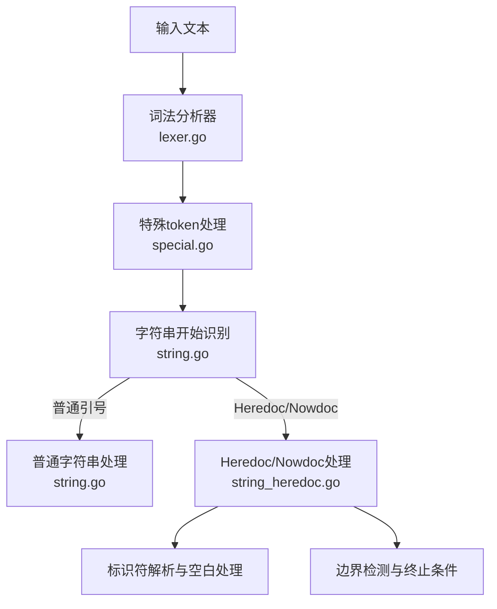
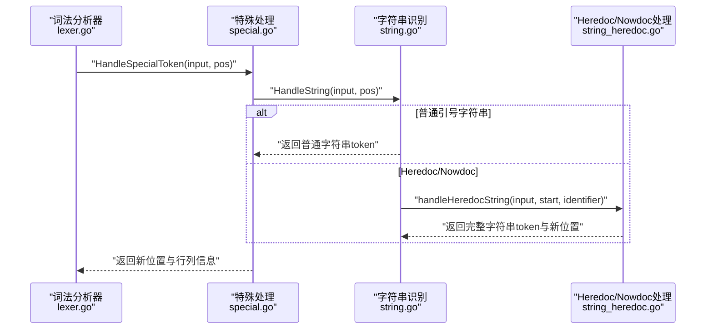
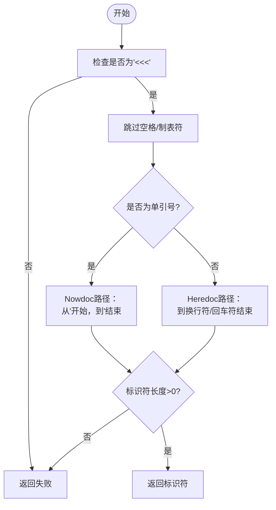
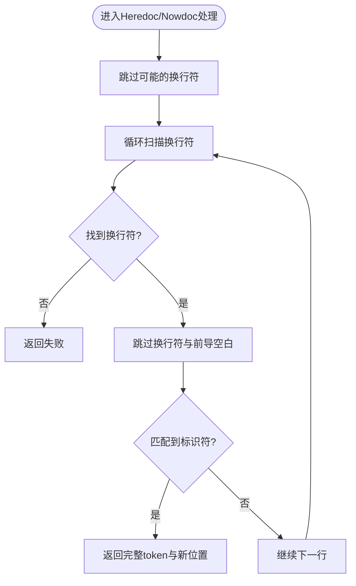
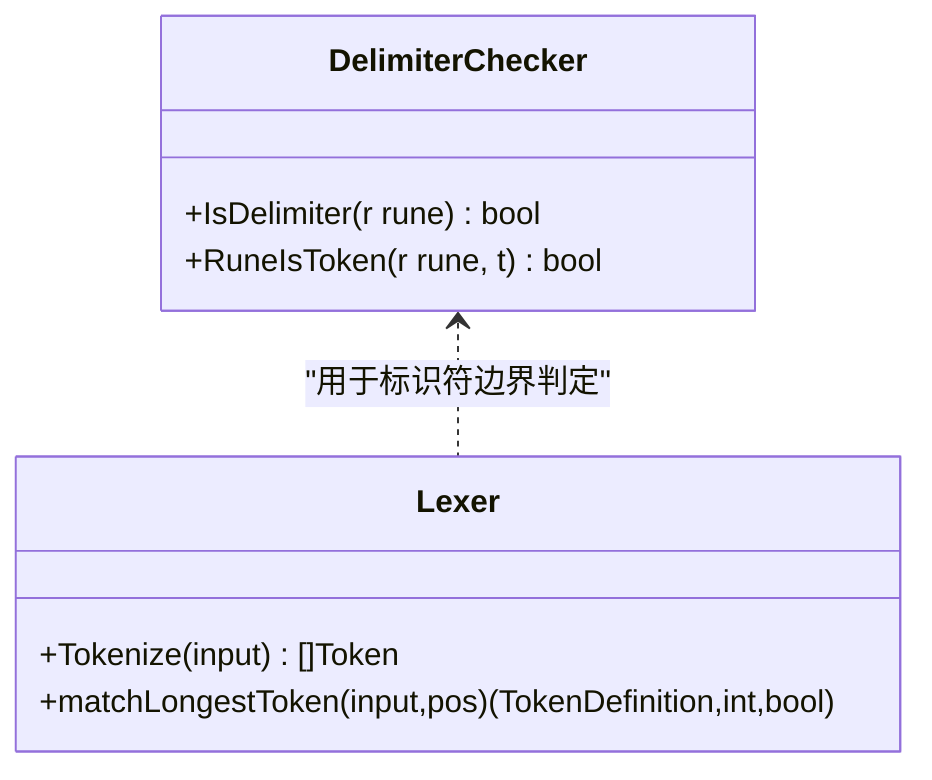
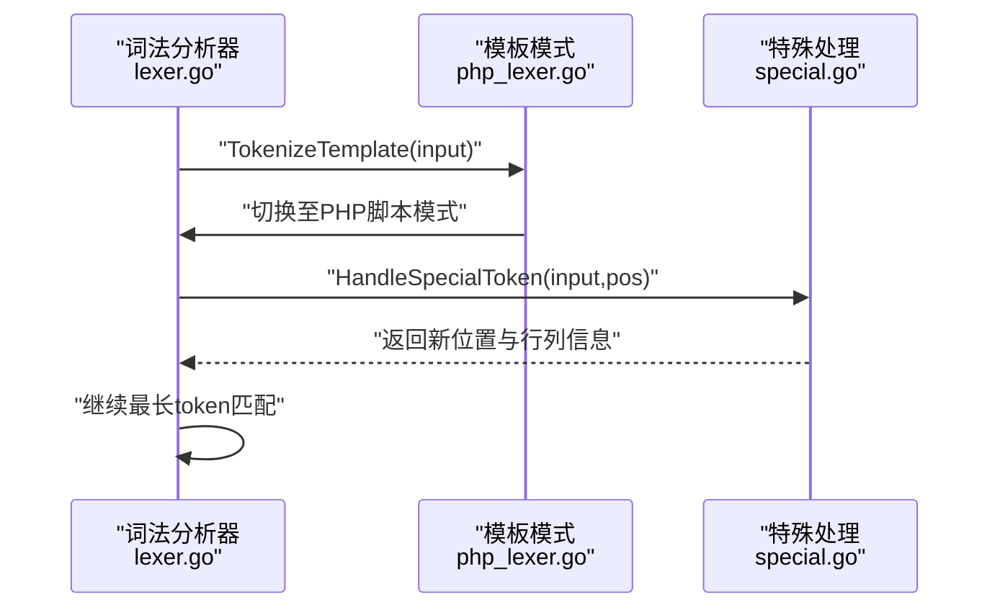
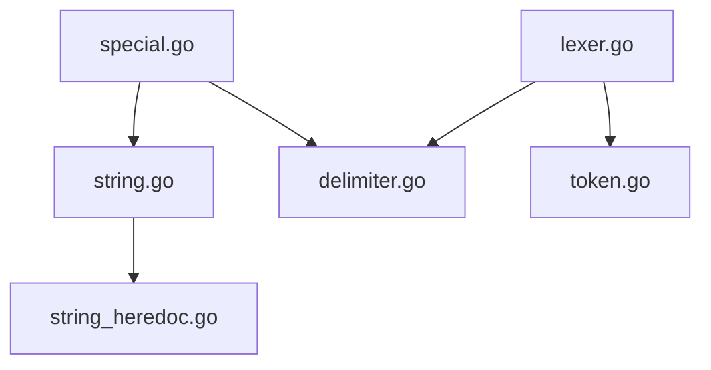

# Heredoc和Nowdoc语法

<cite>
**本文引用的文件**
- [lexer/string.go](file://lexer/string.go)
- [lexer/string_heredoc.go](file://lexer/string_heredoc.go)
- [lexer/special.go](file://lexer/special.go)
- [lexer/delimiter.go](file://lexer/delimiter.go)
- [lexer/lexer.go](file://lexer/lexer.go)
- [lexer/php_lexer.go](file://lexer/php_lexer.go)
- [token/token.go](file://token/token.go)
</cite>

## 目录
1. [简介](#简介)
2. [项目结构](#项目结构)
3. [核心组件](#核心组件)
4. [架构总览](#架构总览)
5. [详细组件分析](#详细组件分析)
6. [依赖分析](#依赖分析)
7. [性能考量](#性能考量)
8. [故障排查指南](#故障排查指南)
9. [结论](#结论)
10. [附录](#附录)

## 简介
本文件聚焦于Heredoc与Nowdoc语法在词法分析阶段的实现细节，系统阐述以下主题：
- <<< 操作符的识别机制与起始位置检测
- Heredoc（无引号标识符）与 Nowdoc（单引号包裹标识符）的差异与处理逻辑
- 标识符解析、空白字符处理与多行字符串终止条件
- heredoc标签的验证规则、边界检测算法与与普通代码的混合解析策略
- 为开发者提供的实现细节与自定义扩展建议

## 项目结构
围绕Heredoc/Nowdoc的实现主要分布在词法分析模块中：
- 顶层入口负责扫描输入并委派给特殊token处理器
- 特殊token处理器识别字符串开始并分发到具体字符串处理函数
- 字符串处理函数进一步区分普通引号字符串与Heredoc/Nowdoc
- Heredoc/Nowdoc专用处理函数完成标识符解析、空白处理与边界检测

**图示来源**
- [lexer/lexer.go:88-248](file://lexer/lexer.go#L88-L248)
- [lexer/special.go:312-366](file://lexer/special.go#L312-L366)
- [lexer/string.go:44-68](file://lexer/string.go#L44-L68)
- [lexer/string_heredoc.go:10-66](file://lexer/string_heredoc.go#L10-L66)

**章节来源**
- [lexer/lexer.go:88-248](file://lexer/lexer.go#L88-L248)
- [lexer/special.go:312-366](file://lexer/special.go#L312-L366)
- [lexer/string.go:44-68](file://lexer/string.go#L44-L68)
- [lexer/string_heredoc.go:10-66](file://lexer/string_heredoc.go#L10-L66)

## 核心组件
- 特殊token处理入口：识别字符串开始并计算新位置与行列信息
- 字符串开始识别：判断是否为普通引号字符串或Heredoc/Nowdoc，并提取标识符
- Heredoc/Nowdoc处理：解析标识符、处理空白字符、定位终止边界
- 分割符判定：用于标识符与数字等token的边界判断

**章节来源**
- [lexer/special.go:312-366](file://lexer/special.go#L312-L366)
- [lexer/string.go:4-42](file://lexer/string.go#L4-L42)
- [lexer/string_heredoc.go:10-66](file://lexer/string_heredoc.go#L10-L66)
- [lexer/delimiter.go:10-70](file://lexer/delimiter.go#L10-L70)

## 架构总览
Heredoc/Nowdoc的处理流程如下：
- 词法分析器在主循环中跳过空白字符，遇到特殊token时委派给特殊处理函数
- 特殊处理函数优先尝试字符串识别；若命中Heredoc/Nowdoc，则进入专用处理
- 专用处理函数解析标识符、跳过前置空白与换行，再逐行扫描终止边界
- 终止边界由“换行符 + 前导空白（可选） + 标识符”的模式确定

**图示来源**
- [lexer/lexer.go:147-162](file://lexer/lexer.go#L147-L162)
- [lexer/special.go:312-366](file://lexer/special.go#L312-L366)
- [lexer/string.go:44-68](file://lexer/string.go#L44-L68)
- [lexer/string_heredoc.go:10-66](file://lexer/string_heredoc.go#L10-L66)

## 详细组件分析

### Heredoc与Nowdoc的识别与标识符解析
- 操作符识别：以“<<<”作为入口，随后跳过任意数量的空格与制表符
- Nowdoc判定：若紧随空格后的字符为单引号，则进入Nowdoc分支；否则为Heredoc
- Nowdoc标识符：从开始的单引号之后开始，直至遇到结束单引号为止
- Heredoc标识符：从“<<<”后首个非空白字符开始，直至遇到换行符或回车符为止
- 标识符长度需大于0，否则视为无效

**图示来源**
- [lexer/string.go:14-42](file://lexer/string.go#L14-L42)

**章节来源**
- [lexer/string.go:14-42](file://lexer/string.go#L14-L42)

### Heredoc/Nowdoc正文解析与边界检测
- 跳过标识符后可能存在的换行符（LF/CR）
- 逐行扫描，定位换行符
- 在换行符后跳过前导空格与制表符
- 若该行起始恰好为标识符，则匹配成功，结束位置即为终止边界
- 若未找到匹配的终止标识符，返回失败

**图示来源**
- [lexer/string_heredoc.go:33-66](file://lexer/string_heredoc.go#L33-L66)

**章节来源**
- [lexer/string_heredoc.go:10-66](file://lexer/string_heredoc.go#L10-L66)

### 分割符与标识符边界
- 分割符集合覆盖括号、运算符、标点与空白字符，用于标识符与数字的边界判定
- 标识符字符允许字母、下划线与中文字符，且在PHP命名空间中“\”具有特殊含义
- 该规则确保Heredoc/Nowdoc标识符不会被错误切分为其他token

**图示来源**
- [lexer/delimiter.go:10-70](file://lexer/delimiter.go#L10-L70)
- [lexer/lexer.go:196-232](file://lexer/lexer.go#L196-L232)

**章节来源**
- [lexer/delimiter.go:10-70](file://lexer/delimiter.go#L10-L70)
- [lexer/lexer.go:196-232](file://lexer/lexer.go#L196-L232)

### 与普通代码的混合解析策略
- 词法分析器在主循环中优先处理特殊token（含字符串），随后进行最长token匹配
- 对于模板模式（如嵌入PHP的HTML），先按HTML片段处理，再进入PHP脚本模式
- 行号与列号在特殊token处理中根据换行符数量与最后换行位置精确更新

**图示来源**
- [lexer/php_lexer.go:12-199](file://lexer/php_lexer.go#L12-L199)
- [lexer/lexer.go:88-248](file://lexer/lexer.go#L88-L248)
- [lexer/special.go:312-366](file://lexer/special.go#L312-L366)

**章节来源**
- [lexer/php_lexer.go:12-199](file://lexer/php_lexer.go#L12-L199)
- [lexer/lexer.go:88-248](file://lexer/lexer.go#L88-L248)
- [lexer/special.go:312-366](file://lexer/special.go#L312-L366)

## 依赖分析
- 特殊token处理依赖字符串识别与分割符判定
- 字符串识别依赖token定义以区分不同字符串类型
- 词法分析器通过DAG匹配实现高效token识别，避免回溯

**图示来源**
- [lexer/special.go:312-366](file://lexer/special.go#L312-L366)
- [lexer/string.go:44-68](file://lexer/string.go#L44-L68)
- [lexer/string_heredoc.go:10-66](file://lexer/string_heredoc.go#L10-L66)
- [lexer/delimiter.go:10-70](file://lexer/delimiter.go#L10-L70)
- [lexer/lexer.go:250-302](file://lexer/lexer.go#L250-L302)
- [token/token.go:34-181](file://token/token.go#L34-L181)

**章节来源**
- [lexer/special.go:312-366](file://lexer/special.go#L312-L366)
- [lexer/string.go:44-68](file://lexer/string.go#L44-L68)
- [lexer/string_heredoc.go:10-66](file://lexer/string_heredoc.go#L10-L66)
- [lexer/delimiter.go:10-70](file://lexer/delimiter.go#L10-L70)
- [lexer/lexer.go:250-302](file://lexer/lexer.go#L250-L302)
- [token/token.go:34-181](file://token/token.go#L34-L181)

## 性能考量
- 最长token匹配采用DAG前缀树，避免多次回溯，提升整体吞吐
- Heredoc/Nowdoc处理仅在识别到“<<<”后触发，常量时间的预处理开销
- 边界检测按行扫描，最坏情况下与正文长度线性相关，但通常终止边界靠近起始位置

[本节为通用性能讨论，无需列出具体文件来源]

## 故障排查指南
- 标识符为空：当“<<<”后紧跟换行符或无有效标识符时，识别失败
- Nowdoc引号缺失：若使用Nowdoc但缺少成对单引号，将无法正确解析标识符
- 终止边界不匹配：若正文内出现与标识符相同的行，但未处于行首或存在前导空白，将被忽略
- 混合模式问题：在HTML模板中，确保“<?php”与“?>”正确闭合，避免跨模式误判

**章节来源**
- [lexer/string.go:14-42](file://lexer/string.go#L14-L42)
- [lexer/string_heredoc.go:33-66](file://lexer/string_heredoc.go#L33-L66)
- [lexer/php_lexer.go:12-199](file://lexer/php_lexer.go#L12-L199)

## 结论
本实现以简洁高效的策略支持Heredoc与Nowdoc语法：
- 通过“<<<”快速入口与前后置空白处理，可靠识别两类语法
- 以“换行符 + 前导空白 + 标识符”的严格模式确保边界检测的确定性
- 与普通token解析与模板模式无缝集成，满足复杂脚本场景

[本节为总结性内容，无需列出具体文件来源]

## 附录
- token类型定义：包含关键字、运算符、符号与字面量等，为最长匹配与特殊处理提供基础
- 实现要点速记
  - Heredoc：标识符到换行符结束；Nowdoc：标识符在单引号内
  - 终止边界必须位于独立行首，可有前导空白
  - 行号与列号在特殊token处理中精确更新

**章节来源**
- [token/token.go:34-181](file://token/token.go#L34-L181)