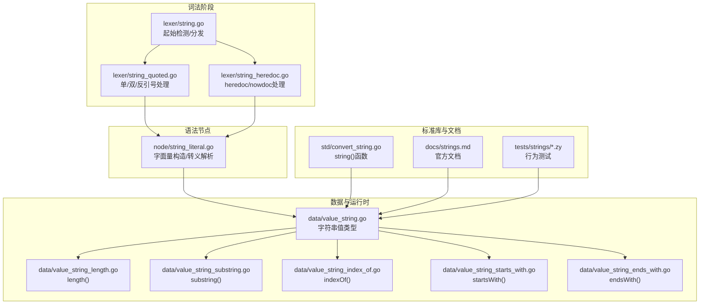
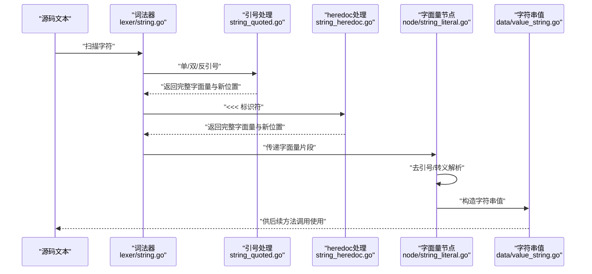
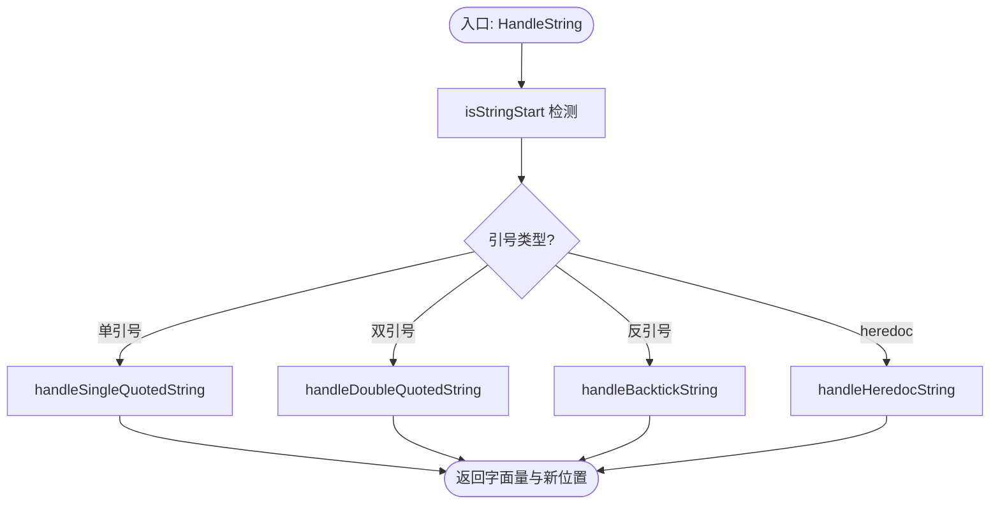
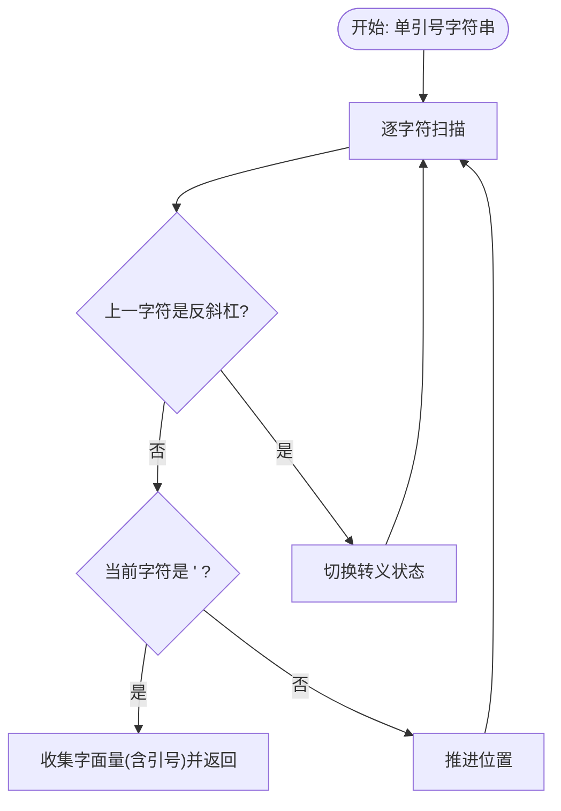
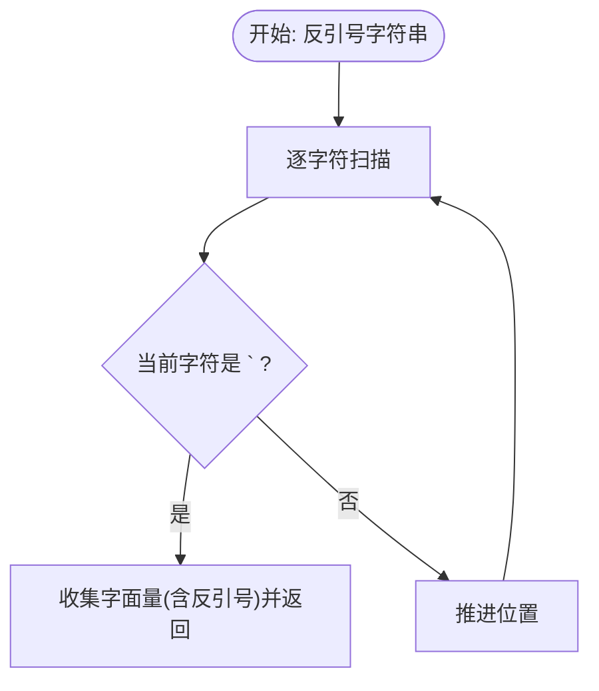
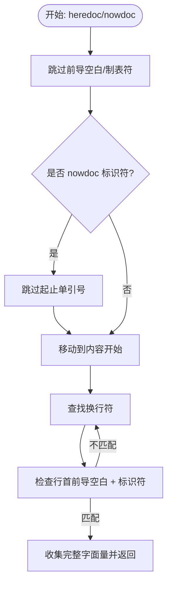
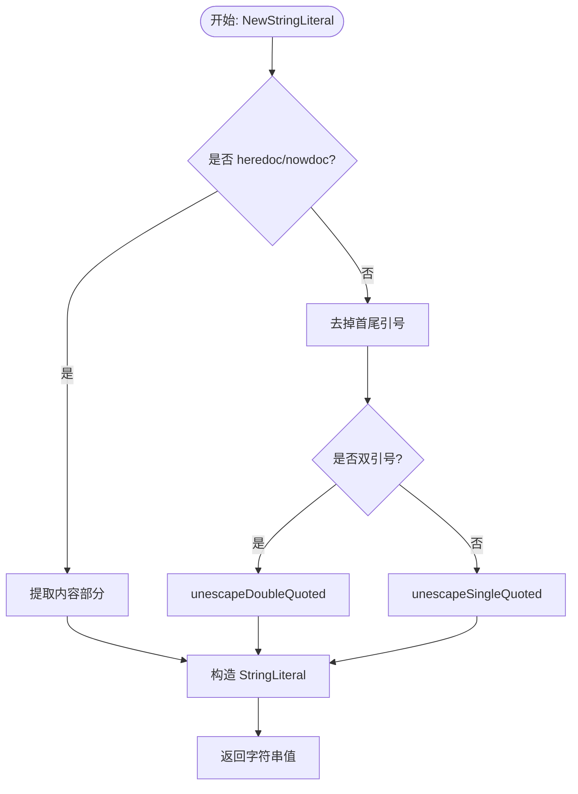
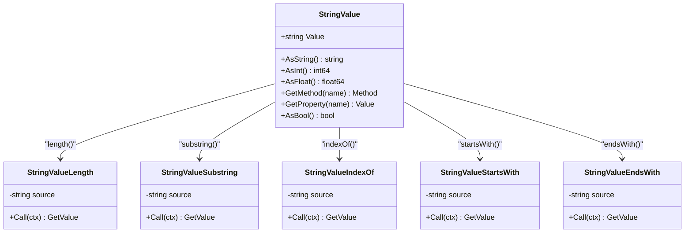
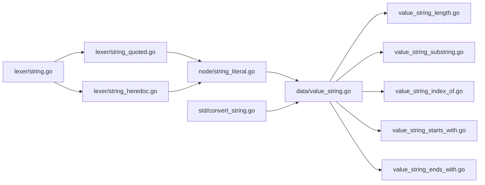

# 基础字符串字面量

<cite>
**本文引用的文件**
- [lexer/string.go](file://lexer/string.go)
- [lexer/string_quoted.go](file://lexer/string_quoted.go)
- [lexer/string_heredoc.go](file://lexer/string_heredoc.go)
- [node/string_literal.go](file://node/string_literal.go)
- [data/value_string.go](file://data/value_string.go)
- [data/value_string_length.go](file://data/value_string_length.go)
- [data/value_string_substring.go](file://data/value_string_substring.go)
- [data/value_string_index_of.go](file://data/value_string_index_of.go)
- [data/value_string_starts_with.go](file://data/value_string_starts_with.go)
- [data/value_string_ends_with.go](file://data/value_string_ends_with.go)
- [std/convert_string.go](file://std/convert_string.go)
- [docs/strings.md](file://docs/strings.md)
- [tests/strings/length.zy](file://tests/strings/length.zy)
- [tests/strings/substring.zy](file://tests/strings/substring.zy)
- [tests/strings/indexOf.zy](file://tests/strings/indexOf.zy)
- [tests/strings/all_methods.zy](file://tests/strings/all_methods.zy)
</cite>

## 目录
1. [简介](#简介)
2. [项目结构](#项目结构)
3. [核心组件](#核心组件)
4. [架构总览](#架构总览)
5. [详细组件分析](#详细组件分析)
6. [依赖分析](#依赖分析)
7. [性能考虑](#性能考虑)
8. [故障排查指南](#故障排查指南)
9. [结论](#结论)
10. [附录](#附录)

## 简介
本技术文档聚焦“基础字符串字面量”的识别与处理，覆盖单引号字符串、双引号字符串与反引号字符串的词法识别、边界检测、转义解析与运行时行为，并补充字符串长度计算、字符编码与性能优化建议。文档同时给出与代码混合时的解析策略说明，帮助开发者在扩展或维护时保持一致性。

## 项目结构
围绕基础字符串字面量，涉及以下关键模块：
- 词法阶段：识别字符串起始、引号匹配与heredoc/nowdoc标识符解析
- 语法节点：字符串字面量的AST节点构造与转义解析
- 数据模型与运行时：字符串值类型及其方法（长度、截取、查找、前后缀判断等）
- 文档与测试：官方文档与测试用例验证行为



图表来源
- [lexer/string.go:1-69](file://lexer/string.go#L1-L69)
- [lexer/string_quoted.go:1-80](file://lexer/string_quoted.go#L1-L80)
- [lexer/string_heredoc.go:1-67](file://lexer/string_heredoc.go#L1-L67)
- [node/string_literal.go:1-155](file://node/string_literal.go#L1-L155)
- [data/value_string.go:1-86](file://data/value_string.go#L1-L86)
- [data/value_string_length.go:1-35](file://data/value_string_length.go#L1-L35)
- [data/value_string_substring.go:1-130](file://data/value_string_substring.go#L1-L130)
- [data/value_string_index_of.go:1-77](file://data/value_string_index_of.go#L1-L77)
- [data/value_string_starts_with.go:1-72](file://data/value_string_starts_with.go#L1-L72)
- [data/value_string_ends_with.go:1-72](file://data/value_string_ends_with.go#L1-L72)
- [std/convert_string.go:1-39](file://std/convert_string.go#L1-L39)
- [docs/strings.md:1-424](file://docs/strings.md#L1-L424)
- [tests/strings/length.zy:1-53](file://tests/strings/length.zy#L1-L53)
- [tests/strings/substring.zy:1-78](file://tests/strings/substring.zy#L1-L78)
- [tests/strings/indexOf.zy:1-95](file://tests/strings/indexOf.zy#L1-L95)
- [tests/strings/all_methods.zy:1-99](file://tests/strings/all_methods.zy#L1-L99)

章节来源
- [lexer/string.go:1-69](file://lexer/string.go#L1-L69)
- [lexer/string_quoted.go:1-80](file://lexer/string_quoted.go#L1-L80)
- [lexer/string_heredoc.go:1-67](file://lexer/string_heredoc.go#L1-L67)
- [node/string_literal.go:1-155](file://node/string_literal.go#L1-L155)
- [data/value_string.go:1-86](file://data/value_string.go#L1-L86)
- [data/value_string_length.go:1-35](file://data/value_string_length.go#L1-L35)
- [data/value_string_substring.go:1-130](file://data/value_string_substring.go#L1-L130)
- [data/value_string_index_of.go:1-77](file://data/value_string_index_of.go#L1-L77)
- [data/value_string_starts_with.go:1-72](file://data/value_string_starts_with.go#L1-L72)
- [data/value_string_ends_with.go:1-72](file://data/value_string_ends_with.go#L1-L72)
- [std/convert_string.go:1-39](file://std/convert_string.go#L1-L39)
- [docs/strings.md:1-424](file://docs/strings.md#L1-L424)
- [tests/strings/length.zy:1-53](file://tests/strings/length.zy#L1-L53)
- [tests/strings/substring.zy:1-78](file://tests/strings/substring.zy#L1-L78)
- [tests/strings/indexOf.zy:1-95](file://tests/strings/indexOf.zy#L1-L95)
- [tests/strings/all_methods.zy:1-99](file://tests/strings/all_methods.zy#L1-L99)

## 核心组件
- 词法器字符串处理入口：负责识别字符串起始、分发到不同处理函数，并支持heredoc/nowdoc
- 引号字符串处理器：分别处理单引号、双引号与反引号字符串，含转义与边界检测
- heredoc/nowdoc处理器：识别标识符、定位内容边界与结束标记
- 字符串字面量节点：构造AST节点、执行转义解析（双引号/单引号）
- 字符串值类型与方法：提供 length、substring、indexOf、startsWith、endsWith 等运行时能力
- string() 标准库函数：将任意值转换为字符串

章节来源
- [lexer/string.go:44-69](file://lexer/string.go#L44-L69)
- [lexer/string_quoted.go:7-79](file://lexer/string_quoted.go#L7-L79)
- [lexer/string_heredoc.go:9-66](file://lexer/string_heredoc.go#L9-L66)
- [node/string_literal.go:97-155](file://node/string_literal.go#L97-L155)
- [data/value_string.go:16-86](file://data/value_string.go#L16-L86)
- [std/convert_string.go:8-39](file://std/convert_string.go#L8-L39)

## 架构总览
下图展示从输入文本到字符串字面量运行时行为的关键流程：



图表来源
- [lexer/string.go:44-69](file://lexer/string.go#L44-L69)
- [lexer/string_quoted.go:7-79](file://lexer/string_quoted.go#L7-L79)
- [lexer/string_heredoc.go:9-66](file://lexer/string_heredoc.go#L9-L66)
- [node/string_literal.go:97-155](file://node/string_literal.go#L97-L155)
- [data/value_string.go:8-26](file://data/value_string.go#L8-L26)

## 详细组件分析

### 1) 起始检测与分发（isStringStart/HandleString）
- 起始检测：判断当前位置是否为单引号、双引号或反引号；或是否为heredoc起始“<<<”
- heredoc标识符解析：支持带或不带单引号的nowdoc标识符，跳过前导空白与制表符
- 分发策略：根据引号类型分派至对应处理函数；否则进入heredoc处理



图表来源
- [lexer/string.go:4-42](file://lexer/string.go#L4-L42)
- [lexer/string.go:44-69](file://lexer/string.go#L44-L69)

章节来源
- [lexer/string.go:4-42](file://lexer/string.go#L4-L42)
- [lexer/string.go:44-69](file://lexer/string.go#L44-L69)

### 2) 单引号字符串（handleSingleQuotedString）
- 边界检测：遇到未转义的单引号即结束（包含结束引号）
- 转义策略：仅处理两个连续反斜杠与单引号转义
- 长度计算：字面量长度包含起止引号



图表来源
- [lexer/string_quoted.go:7-33](file://lexer/string_quoted.go#L7-L33)

章节来源
- [lexer/string_quoted.go:7-33](file://lexer/string_quoted.go#L7-L33)

### 3) 双引号字符串（handleDoubleQuotedString）
- 边界检测：遇到未转义的双引号即结束（包含结束引号）
- 转义策略：支持多种转义形式（如换行、回车、制表、反斜杠、单引号、双引号、转义、八进制、十六进制等）
- 长度计算：字面量长度包含起止引号

```mermaid
flowchart TD
D0(["开始: 双引号字符串"]) --> DScan["逐字符扫描"]
DScan --> DEsc{"上一字符是反斜杠?"}
DEsc --> |否| DQuote{"当前字符是 \" ?"}
DEsc --> |是| DNext["切换转义状态"] --> DScan
DQuote --> |是| DEnd["收集字面量(含引号)并返回"]
DQuote --> |否| DNextScan["推进位置"] --> DScan
```

图表来源
- [lexer/string_quoted.go:35-61](file://lexer/string_quoted.go#L35-L61)

章节来源
- [lexer/string_quoted.go:35-61](file://lexer/string_quoted.go#L35-L61)

### 4) 反引号字符串（handleBacktickString）
- 边界检测：遇到反引号即结束（包含结束反引号）
- 转义策略：与单引号类似，但此处为反引号环境，不进行双引号转义规则
- 长度计算：字面量长度包含起止反引号



图表来源
- [lexer/string_quoted.go:63-79](file://lexer/string_quoted.go#L63-L79)

章节来源
- [lexer/string_quoted.go:63-79](file://lexer/string_quoted.go#L63-L79)

### 5) heredoc/nowdoc 字符串（handleHeredocString）
- 标识符处理：支持带单引号的nowdoc与普通heredoc，跳过前导空白与制表符
- 内容边界：从标识符后换行开始，直到找到“前导空白 + 标识符 + 行尾”的结束标记
- 长度计算：返回从起始“<<<”到结束标识符的完整字面量



图表来源
- [lexer/string_heredoc.go:9-66](file://lexer/string_heredoc.go#L9-L66)

章节来源
- [lexer/string_heredoc.go:9-66](file://lexer/string_heredoc.go#L9-L66)

### 6) 字符串字面量节点与转义解析（node/string_literal.go）
- heredoc/nowdoc解析：从“<<<”格式中抽取内容部分（去掉首尾标识符与换行）
- 普通引号字符串：区分单引号与双引号，去掉首尾引号并执行相应转义规则
- 双引号转义：支持八进制与十六进制转义序列
- 单引号转义：仅处理反斜杠与单引号



图表来源
- [node/string_literal.go:97-155](file://node/string_literal.go#L97-L155)

章节来源
- [node/string_literal.go:97-155](file://node/string_literal.go#L97-L155)

### 7) 字符串值类型与方法（data/value_string.go 及其方法）
- 字符串值类型：封装底层字符串，提供方法与属性查询
- length 属性：返回字符串长度（字节长度）
- 方法族：
  - length(): 返回长度
  - substring(start, end?): 截取子串，支持负索引与越界处理
  - indexOf(search): 查找子串首次出现位置，不存在返回 -1
  - startsWith/endsWith(search): 判断前缀/后缀
- string() 标准库函数：将任意值转换为字符串



图表来源
- [data/value_string.go:16-86](file://data/value_string.go#L16-L86)
- [data/value_string_length.go:3-35](file://data/value_string_length.go#L3-L35)
- [data/value_string_substring.go:7-130](file://data/value_string_substring.go#L7-L130)
- [data/value_string_index_of.go:7-77](file://data/value_string_index_of.go#L7-L77)
- [data/value_string_starts_with.go:5-72](file://data/value_string_starts_with.go#L5-L72)
- [data/value_string_ends_with.go:5-72](file://data/value_string_ends_with.go#L5-L72)

章节来源
- [data/value_string.go:16-86](file://data/value_string.go#L16-L86)
- [data/value_string_length.go:3-35](file://data/value_string_length.go#L3-L35)
- [data/value_string_substring.go:7-130](file://data/value_string_substring.go#L7-L130)
- [data/value_string_index_of.go:7-77](file://data/value_string_index_of.go#L7-L77)
- [data/value_string_starts_with.go:5-72](file://data/value_string_starts_with.go#L5-L72)
- [data/value_string_ends_with.go:5-72](file://data/value_string_ends_with.go#L5-L72)
- [std/convert_string.go:8-39](file://std/convert_string.go#L8-L39)

## 依赖分析
- 词法器依赖：字符串处理函数彼此独立，heredoc处理依赖字符串工具库进行换行查找
- 语法节点依赖：字面量节点依赖转义解析函数，构建字符串值类型
- 运行时依赖：字符串值类型提供方法查询与属性访问，方法内部依赖标准库 strings 包与数值转换



图表来源
- [lexer/string.go:44-69](file://lexer/string.go#L44-L69)
- [lexer/string_quoted.go:7-79](file://lexer/string_quoted.go#L7-L79)
- [lexer/string_heredoc.go:9-66](file://lexer/string_heredoc.go#L9-L66)
- [node/string_literal.go:97-155](file://node/string_literal.go#L97-L155)
- [data/value_string.go:16-86](file://data/value_string.go#L16-L86)
- [data/value_string_length.go:3-35](file://data/value_string_length.go#L3-L35)
- [data/value_string_substring.go:7-130](file://data/value_string_substring.go#L7-L130)
- [data/value_string_index_of.go:7-77](file://data/value_string_index_of.go#L7-L77)
- [data/value_string_starts_with.go:5-72](file://data/value_string_starts_with.go#L5-L72)
- [data/value_string_ends_with.go:5-72](file://data/value_string_ends_with.go#L5-L72)
- [std/convert_string.go:8-39](file://std/convert_string.go#L8-L39)

章节来源
- [lexer/string.go:44-69](file://lexer/string.go#L44-L69)
- [lexer/string_quoted.go:7-79](file://lexer/string_quoted.go#L7-L79)
- [lexer/string_heredoc.go:9-66](file://lexer/string_heredoc.go#L9-L66)
- [node/string_literal.go:97-155](file://node/string_literal.go#L97-L155)
- [data/value_string.go:16-86](file://data/value_string.go#L16-L86)
- [data/value_string_length.go:3-35](file://data/value_string_length.go#L3-L35)
- [data/value_string_substring.go:7-130](file://data/value_string_substring.go#L7-L130)
- [data/value_string_index_of.go:7-77](file://data/value_string_index_of.go#L7-L77)
- [data/value_string_starts_with.go:5-72](file://data/value_string_starts_with.go#L5-L72)
- [data/value_string_ends_with.go:5-72](file://data/value_string_ends_with.go#L5-L72)
- [std/convert_string.go:8-39](file://std/convert_string.go#L8-L39)

## 性能考虑
- 字符扫描：单引号与反引号字符串采用线性扫描，时间复杂度 O(n)，空间复杂度 O(1)（不含输出）
- 双引号转义：转义解析为线性扫描，常见转义（如 \n/\t/\r）为常数时间；八进制/十六进制需最多固定步数读取
- heredoc/nowdoc：查找结束标识符需要逐行扫描，最坏情况下 O(n)，但通常结束标识符靠近内容末尾
- 字符串值方法：length 为 O(1)（底层长度缓存）、substring 与 indexOf 依赖 Go 标准库，性能稳定
- 建议：
  - 避免在热路径中频繁构造超长字面量
  - 合理使用 trim、split 等方法，减少重复拷贝
  - 对于大量字符串拼接，优先使用批量处理或缓冲区策略

## 故障排查指南
- 症状：字符串未闭合或提前结束
  - 排查点：确认引号是否正确配对；检查转义序列是否合法
  - 参考：引号字符串处理函数的边界检测逻辑
- 症状：转义字符未生效
  - 排查点：双引号转义规则是否满足；八进制/十六进制位数是否正确
  - 参考：双引号转义解析函数
- 症状：heredoc/nowdoc 未识别结束标记
  - 排查点：结束标识符前是否仅有空白；标识符是否与起始一致
  - 参考：heredoc/nowdoc 处理函数
- 症状：运行时方法行为异常
  - 排查点：参数类型与默认值；索引越界与负索引处理
  - 参考：各方法实现与测试用例

章节来源
- [lexer/string_quoted.go:7-79](file://lexer/string_quoted.go#L7-L79)
- [lexer/string_heredoc.go:9-66](file://lexer/string_heredoc.go#L9-L66)
- [data/value_string_substring.go:7-130](file://data/value_string_substring.go#L7-L130)
- [data/value_string_index_of.go:7-77](file://data/value_string_index_of.go#L7-L77)
- [tests/strings/length.zy:1-53](file://tests/strings/length.zy#L1-L53)
- [tests/strings/substring.zy:1-78](file://tests/strings/substring.zy#L1-L78)
- [tests/strings/indexOf.zy:1-95](file://tests/strings/indexOf.zy#L1-L95)
- [tests/strings/all_methods.zy:1-99](file://tests/strings/all_methods.zy#L1-L99)

## 结论
本系统对基础字符串字面量提供了完善的词法识别与运行时支持：单引号、双引号与反引号字符串具备清晰的边界检测与转义规则；heredoc/nowdoc 支持灵活的内容界定；运行时方法覆盖常用字符串操作。遵循本文档的解析策略与性能建议，可在保证正确性的前提下提升处理效率。

## 附录
- 官方文档与示例参考：[docs/strings.md:1-424](file://docs/strings.md#L1-L424)
- 行为测试参考：
  - [tests/strings/length.zy:1-53](file://tests/strings/length.zy#L1-L53)
  - [tests/strings/substring.zy:1-78](file://tests/strings/substring.zy#L1-L78)
  - [tests/strings/indexOf.zy:1-95](file://tests/strings/indexOf.zy#L1-L95)
  - [tests/strings/all_methods.zy:1-99](file://tests/strings/all_methods.zy#L1-L99)