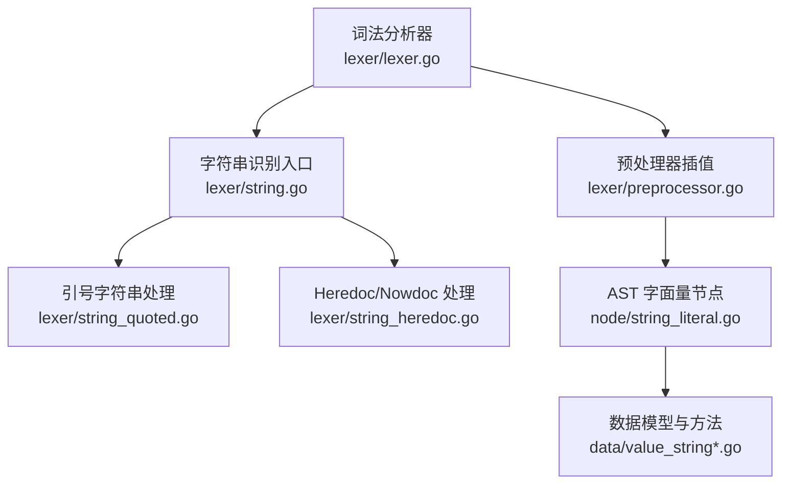
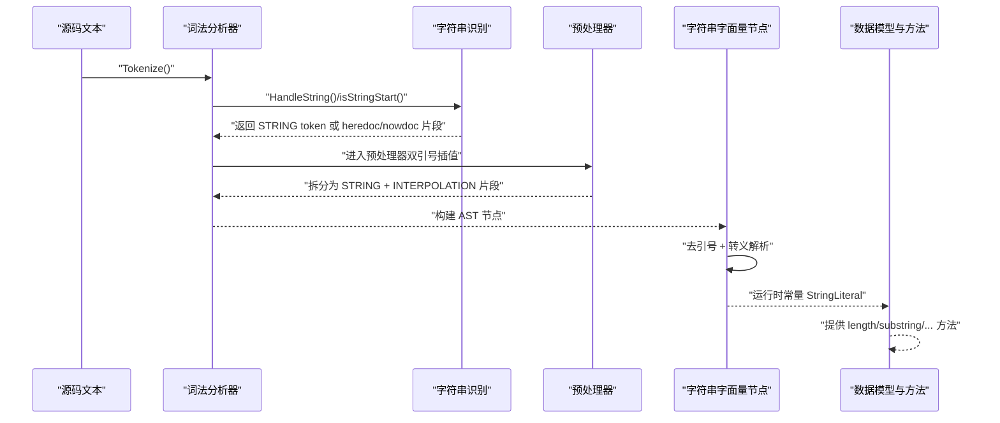
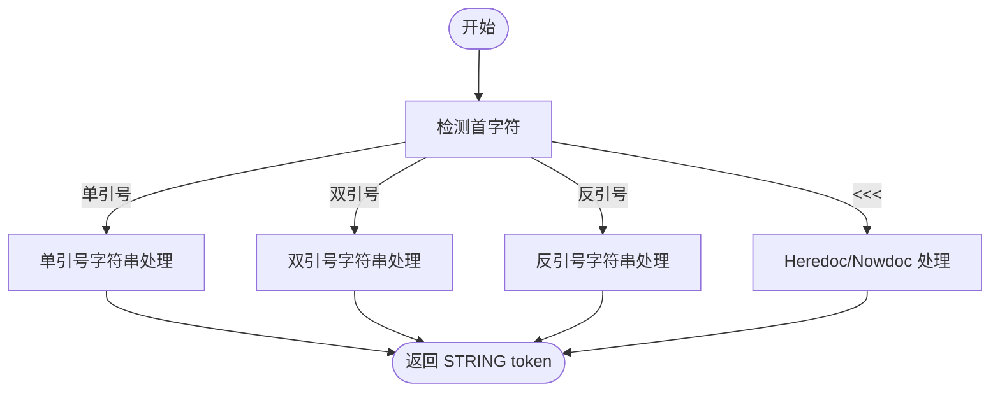
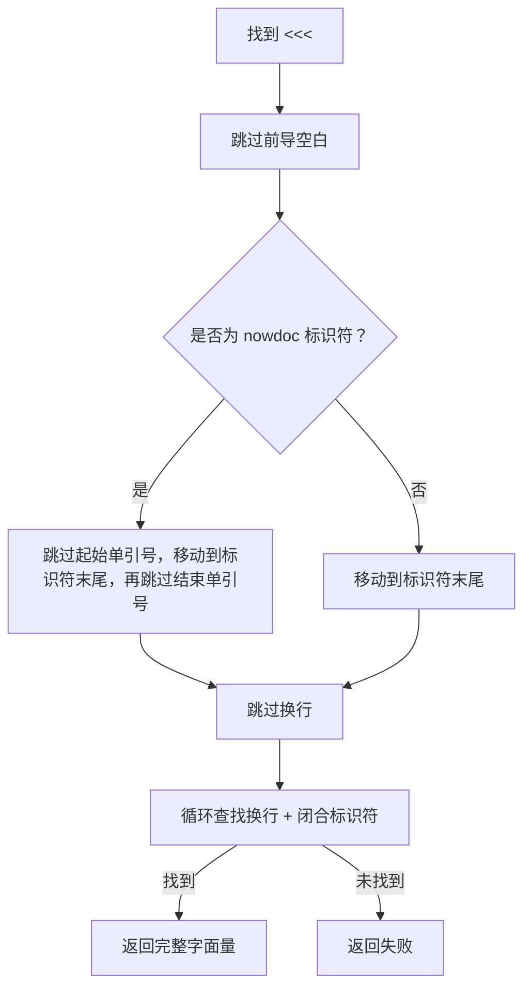
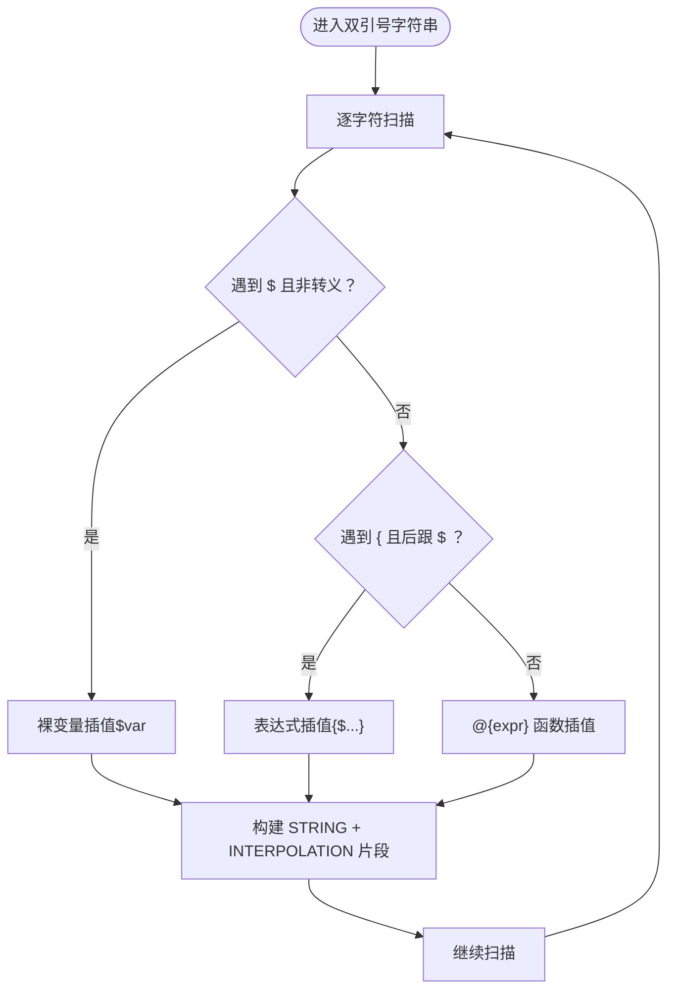
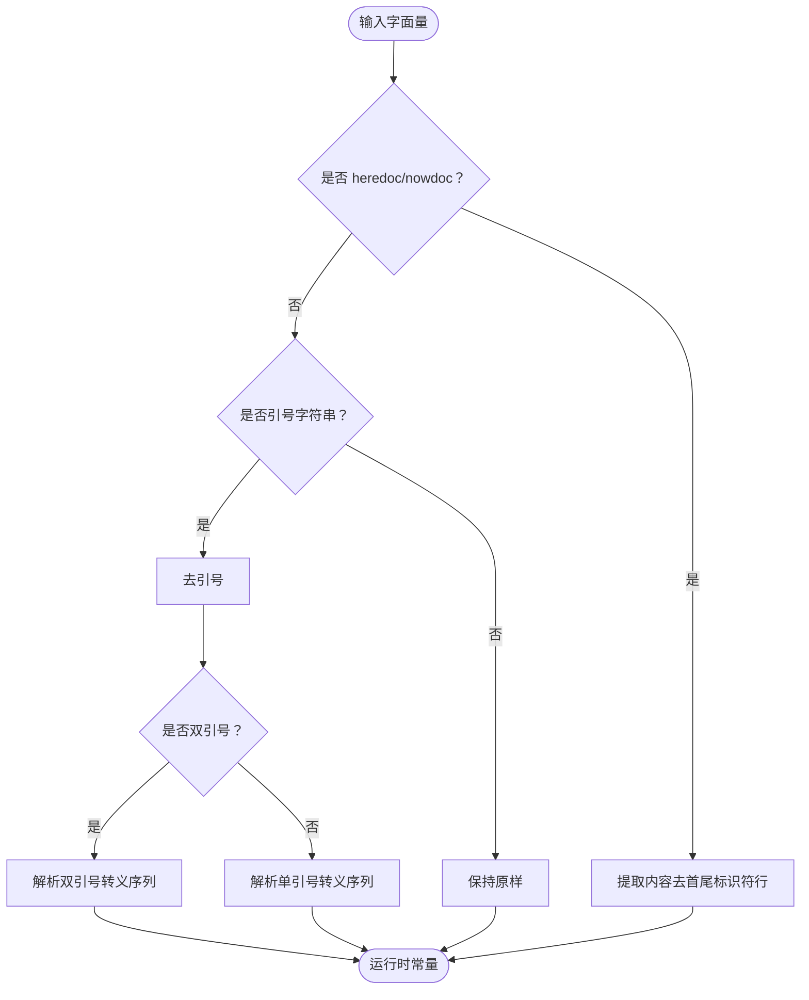
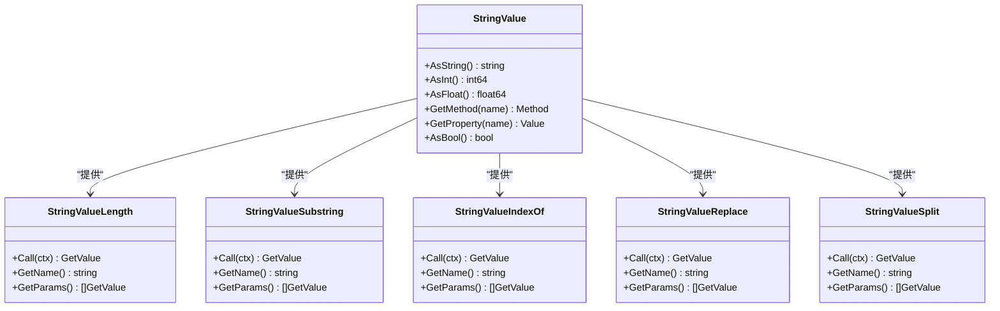
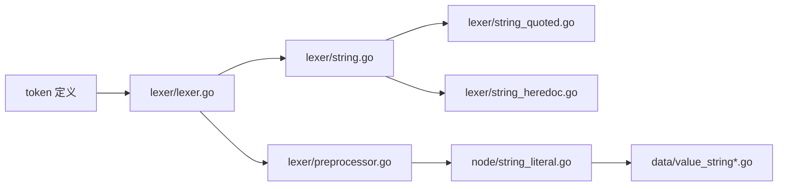

# 字符串处理

<cite>
**本文引用的文件**   
- [lexer/string.go](file://lexer/string.go)
- [lexer/string_heredoc.go](file://lexer/string_heredoc.go)
- [lexer/string_quoted.go](file://lexer/string_quoted.go)
- [lexer/preprocessor.go](file://lexer/preprocessor.go)
- [lexer/lexer.go](file://lexer/lexer.go)
- [node/string_literal.go](file://node/string_literal.go)
- [data/value_string.go](file://data/value_string.go)
- [data/value_string_length.go](file://data/value_string_length.go)
- [data/value_string_substring.go](file://data/value_string_substring.go)
- [data/value_string_index_of.go](file://data/value_string_index_of.go)
- [data/value_string_replace.go](file://data/value_string_replace.go)
- [data/value_string_split.go](file://data/value_string_split.go)
- [tests/php/double_quote_interpolation_test.php](file://tests/php/double_quote_interpolation_test.php)
- [docs/strings.md](file://docs/strings.md)
</cite>

## 目录
1. [简介](#简介)
2. [项目结构](#项目结构)
3. [核心组件](#核心组件)
4. [架构总览](#架构总览)
5. [详细组件分析](#详细组件分析)
6. [依赖分析](#依赖分析)
7. [性能考量](#性能考量)
8. [故障排查指南](#故障排查指南)
9. [结论](#结论)
10. [附录](#附录)

## 简介
本文件面向开发者，系统化阐述该代码库中字符串处理的完整技术方案，覆盖词法分析阶段对字符串字面量的识别与拆分、转义序列解析、插值（变量与表达式）处理、多行 heredoc/nowdoc 的识别与闭合匹配、以及运行时字符串值的表示与常用方法。文档同时给出性能优化建议与扩展自定义字符串语法的实践指南。

## 项目结构
围绕字符串处理的关键模块分布如下：
- 词法分析层：负责识别字符串字面量、插值片段与转义序列，生成基础 token 流
- 预处理器层：将双引号字符串切分为普通字符串片段与插值片段，构建插值树
- AST 节点层：对字符串字面量进行去引号与转义解析，形成运行时常量
- 数据模型与方法层：提供字符串值及其方法（长度、截取、查找、替换、分割、大小写、修剪等）

图表来源
- [lexer/lexer.go:88-248](file://lexer/lexer.go#L88-L248)
- [lexer/string.go:44-68](file://lexer/string.go#L44-L68)
- [lexer/string_quoted.go:7-79](file://lexer/string_quoted.go#L7-L79)
- [lexer/string_heredoc.go:9-66](file://lexer/string_heredoc.go#L9-L66)
- [lexer/preprocessor.go:470-669](file://lexer/preprocessor.go#L470-L669)
- [node/string_literal.go:103-141](file://node/string_literal.go#L103-L141)
- [data/value_string.go:8-86](file://data/value_string.go#L8-L86)

章节来源
- [lexer/lexer.go:88-248](file://lexer/lexer.go#L88-L248)
- [lexer/string.go:44-68](file://lexer/string.go#L44-L68)
- [lexer/string_quoted.go:7-79](file://lexer/string_quoted.go#L7-L79)
- [lexer/string_heredoc.go:9-66](file://lexer/string_heredoc.go#L9-L66)
- [lexer/preprocessor.go:470-669](file://lexer/preprocessor.go#L470-L669)
- [node/string_literal.go:103-141](file://node/string_literal.go#L103-L141)
- [data/value_string.go:8-86](file://data/value_string.go#L8-L86)

## 核心组件
- 字符串识别入口：统一入口根据首字符判定单引号、双引号、反引号或 heredoc/nowdoc，并委派对应处理函数
- 引号字符串处理：分别处理单引号（最小转义）、双引号（广泛转义序列与插值）、反引号（命令字符串）
- Heredoc/Nowdoc：基于标识符的多行字符串，支持前导空白与闭合标识符定位
- 预处理器插值：在双引号内识别裸变量插值与花括号表达式插值，构建插值树
- 字面量节点：去引号与转义解析，形成运行时常量
- 数据模型与方法：提供 length、substring、indexOf、replace、split、startsWith、endsWith、trim 等

章节来源
- [lexer/string.go:44-68](file://lexer/string.go#L44-L68)
- [lexer/string_quoted.go:7-79](file://lexer/string_quoted.go#L7-L79)
- [lexer/string_heredoc.go:9-66](file://lexer/string_heredoc.go#L9-L66)
- [lexer/preprocessor.go:470-669](file://lexer/preprocessor.go#L470-L669)
- [node/string_literal.go:103-141](file://node/string_literal.go#L103-L141)
- [data/value_string_length.go:3-35](file://data/value_string_length.go#L3-L35)
- [data/value_string_substring.go:7-130](file://data/value_string_substring.go#L7-L130)
- [data/value_string_index_of.go:7-77](file://data/value_string_index_of.go#L7-L77)
- [data/value_string_replace.go:5-102](file://data/value_string_replace.go#L5-L102)
- [data/value_string_split.go:7-91](file://data/value_string_split.go#L7-L91)

## 架构总览
从输入到运行时字符串值的处理流程如下：

图表来源
- [lexer/lexer.go:88-248](file://lexer/lexer.go#L88-L248)
- [lexer/string.go:44-68](file://lexer/string.go#L44-L68)
- [lexer/preprocessor.go:470-669](file://lexer/preprocessor.go#L470-L669)
- [node/string_literal.go:103-141](file://node/string_literal.go#L103-L141)
- [data/value_string.go:8-86](file://data/value_string.go#L8-L86)

## 详细组件分析

### 词法分析器与字符串识别
- 字符串开始检测：支持单引号、双引号、反引号与 heredoc/nowdoc（以 <<< 开头）
- heredoc/nowdoc 识别：先解析标识符（支持带单引号的 nowdoc），再定位内容起止与闭合标识符
- 引号字符串处理：单引号最小转义（仅对内部引号做转义），双引号支持广泛转义序列，反引号为命令字符串

图表来源
- [lexer/string.go:4-42](file://lexer/string.go#L4-L42)
- [lexer/string_quoted.go:7-79](file://lexer/string_quoted.go#L7-L79)
- [lexer/string_heredoc.go:9-66](file://lexer/string_heredoc.go#L9-L66)

章节来源
- [lexer/string.go:4-42](file://lexer/string.go#L4-L42)
- [lexer/string_quoted.go:7-79](file://lexer/string_quoted.go#L7-L79)
- [lexer/string_heredoc.go:9-66](file://lexer/string_heredoc.go#L9-L66)

### Heredoc/Nowdoc 识别与闭合匹配
- 标识符解析：支持带单引号的 nowdoc 与裸标识符 heredoc
- 内容定位：跳过起始换行后，扫描内容区域，逐行查找闭合标识符（允许前导空白/制表符）
- 闭合判断：匹配到完整标识符即闭合，返回完整字面量

图表来源
- [lexer/string_heredoc.go:9-66](file://lexer/string_heredoc.go#L9-L66)

章节来源
- [lexer/string_heredoc.go:9-66](file://lexer/string_heredoc.go#L9-L66)

### 预处理器：双引号插值与转义
- 裸变量插值：识别 $var/$var_name（无花括号），注意被反斜杠转义的 $ 不触发插值
- 花括号表达式插值：{$expr}，支持括号与中括号/圆括号嵌套计数，提取完整表达式并重新分词
- 函数插值：@{expr} 作为函数插值入口
- 插值片段与普通字符串片段交替，形成插值树，便于后续 AST 构建与求值

图表来源
- [lexer/preprocessor.go:470-669](file://lexer/preprocessor.go#L470-L669)

章节来源
- [lexer/preprocessor.go:470-669](file://lexer/preprocessor.go#L470-L669)

### 字面量节点：去引号与转义解析
- heredoc/nowdoc：提取内容部分（去掉首尾标识符行），保留换行
- 普通引号字符串：区分双引号与单引号，去引号后按规则解析转义
  - 双引号：支持 \n、\r、\t、\"、\'、\$、\\、\e、八进制（\0-\377）、十六进制（\xHH）
  - 单引号：仅解析 \\ 与 \'

图表来源
- [node/string_literal.go:103-141](file://node/string_literal.go#L103-L141)

章节来源
- [node/string_literal.go:103-141](file://node/string_literal.go#L103-L141)

### 数据模型与字符串方法
- 字符串值：封装底层字符串，提供方法与属性访问
- 常用方法：
  - length：返回字节数（当前实现）
  - substring(start, end?)：按索引截取
  - indexOf(search)：查找子串位置
  - replace(search, replace)：替换全部匹配
  - split(separator?)：按分隔符分割
  - startsWith/endsWith：前后缀检查
  - trim：去除首尾空白

图表来源
- [data/value_string.go:8-86](file://data/value_string.go#L8-L86)
- [data/value_string_length.go:3-35](file://data/value_string_length.go#L3-L35)
- [data/value_string_substring.go:7-130](file://data/value_string_substring.go#L7-L130)
- [data/value_string_index_of.go:7-77](file://data/value_string_index_of.go#L7-L77)
- [data/value_string_replace.go:5-102](file://data/value_string_replace.go#L5-L102)
- [data/value_string_split.go:7-91](file://data/value_string_split.go#L7-L91)

章节来源
- [data/value_string.go:8-86](file://data/value_string.go#L8-L86)
- [data/value_string_length.go:3-35](file://data/value_string_length.go#L3-L35)
- [data/value_string_substring.go:7-130](file://data/value_string_substring.go#L7-L130)
- [data/value_string_index_of.go:7-77](file://data/value_string_index_of.go#L7-L77)
- [data/value_string_replace.go:5-102](file://data/value_string_replace.go#L5-L102)
- [data/value_string_split.go:7-91](file://data/value_string_split.go#L7-L91)

### 字符串边界检测、嵌套引号与混合解析策略
- 边界检测：引号字符串以相同引号闭合；heredoc/nowdoc 以独立行的标识符闭合
- 嵌套引号：单引号字符串内部的单引号需转义；双引号字符串内部的双引号需转义；反引号字符串内部的反引号需转义
- 与代码混合：预处理器在双引号内识别插值，将普通字符串与插值片段分离，确保语法正确性与安全性

章节来源
- [lexer/string_quoted.go:7-79](file://lexer/string_quoted.go#L7-L79)
- [lexer/string_heredoc.go:9-66](file://lexer/string_heredoc.go#L9-L66)
- [lexer/preprocessor.go:470-669](file://lexer/preprocessor.go#L470-L669)

### 字符串长度计算与字符编码处理
- 长度计算：当前实现返回字节数（len(s)）。若需按 Unicode 码点计数，应在上层逻辑或方法中转换为 rune 切片后再计数
- 编码处理：词法分析器使用 UTF-8 解码，确保多字节字符正确处理；转义解析遵循 PHP 规则，兼容八进制与十六进制

章节来源
- [lexer/lexer.go:180-194](file://lexer/lexer.go#L180-L194)
- [node/string_literal.go:10-88](file://node/string_literal.go#L10-L88)

### 字符串插值处理与转义序列解析
- 插值策略：
  - 裸变量：$var/$var_name（无花括号），需满足变量命名规则
  - 表达式：{$expr}，支持括号嵌套计数，提取完整表达式并重新分词
  - 函数插值：@{expr}
- 转义序列：
  - 双引号：\n、\r、\t、\"、\'、\$、\\、\e、八进制（\0-\377）、十六进制（\xHH）
  - 单引号：\\、\'

章节来源
- [lexer/preprocessor.go:470-669](file://lexer/preprocessor.go#L470-L669)
- [node/string_literal.go:10-88](file://node/string_literal.go#L10-L88)

### 多行字符串识别算法
- heredoc/nowdoc：先解析标识符，再扫描内容区，逐行查找闭合标识符（允许前导空白/制表符）
- 算法要点：避免误判、支持 nowdoc 单引号标识符、定位完整字面量范围

章节来源
- [lexer/string_heredoc.go:9-66](file://lexer/string_heredoc.go#L9-L66)

## 依赖分析
- 词法分析器依赖 token 定义与 UTF-8 解码
- 字符串识别依赖预处理器进行插值拆分
- AST 字面量节点依赖数据模型进行运行时值管理
- 字符串方法通过数据模型暴露给运行时调用

图表来源
- [lexer/lexer.go:88-248](file://lexer/lexer.go#L88-L248)
- [lexer/string.go:44-68](file://lexer/string.go#L44-L68)
- [lexer/string_quoted.go:7-79](file://lexer/string_quoted.go#L7-L79)
- [lexer/string_heredoc.go:9-66](file://lexer/string_heredoc.go#L9-L66)
- [lexer/preprocessor.go:470-669](file://lexer/preprocessor.go#L470-L669)
- [node/string_literal.go:103-141](file://node/string_literal.go#L103-L141)
- [data/value_string.go:8-86](file://data/value_string.go#L8-L86)

章节来源
- [lexer/lexer.go:88-248](file://lexer/lexer.go#L88-L248)
- [lexer/string.go:44-68](file://lexer/string.go#L44-L68)
- [lexer/string_quoted.go:7-79](file://lexer/string_quoted.go#L7-L79)
- [lexer/string_heredoc.go:9-66](file://lexer/string_heredoc.go#L9-L66)
- [lexer/preprocessor.go:470-669](file://lexer/preprocessor.go#L470-L669)
- [node/string_literal.go:103-141](file://node/string_literal.go#L103-L141)
- [data/value_string.go:8-86](file://data/value_string.go#L8-L86)

## 性能考量
- 字符串扫描：引号字符串与 heredoc/nowdoc 的扫描为线性复杂度 O(n)，注意避免重复扫描
- 转义解析：双引号转义解析为一次遍历，建议复用缓冲区（strings.Builder）减少分配
- 插值处理：@{expr} 与 {$expr} 需要重新分词，建议缓存常见表达式或限制插值复杂度
- 多行匹配：heredoc/nowdoc 的闭合匹配应尽早短路（如找不到换行立即失败）

## 故障排查指南
- heredoc/nowdoc 未闭合：检查是否存在前导空白导致闭合标识符未对齐，确认标识符大小写与引号使用
- 插值未生效：确认 $ 前无反斜杠转义；裸变量需满足变量命名规则；花括号表达式需闭合
- 转义异常：核对转义序列是否符合 PHP 规范（八进制/十六进制位数限制）
- 长度不一致：当前 length 返回字节数，若需按字符计数请转换为 rune 切片

章节来源
- [lexer/string_heredoc.go:9-66](file://lexer/string_heredoc.go#L9-L66)
- [lexer/preprocessor.go:470-669](file://lexer/preprocessor.go#L470-L669)
- [node/string_literal.go:10-88](file://node/string_literal.go#L10-L88)
- [data/value_string_length.go:3-35](file://data/value_string_length.go#L3-L35)

## 结论
该字符串处理体系在词法与预处理阶段实现了对多种字符串语法的稳健支持，包括引号字符串、heredoc/nowdoc、以及双引号插值。运行时通过统一的数据模型与方法集合，提供完整的字符串操作能力。建议在实际工程中结合性能考量与安全策略，谨慎使用复杂插值与多行字符串，确保可维护性与可读性。

## 附录
- 示例与用法参考：双引号插值测试与字符串操作文档

章节来源
- [tests/php/double_quote_interpolation_test.php:1-17](file://tests/php/double_quote_interpolation_test.php#L1-L17)
- [docs/strings.md:1-424](file://docs/strings.md#L1-L424)