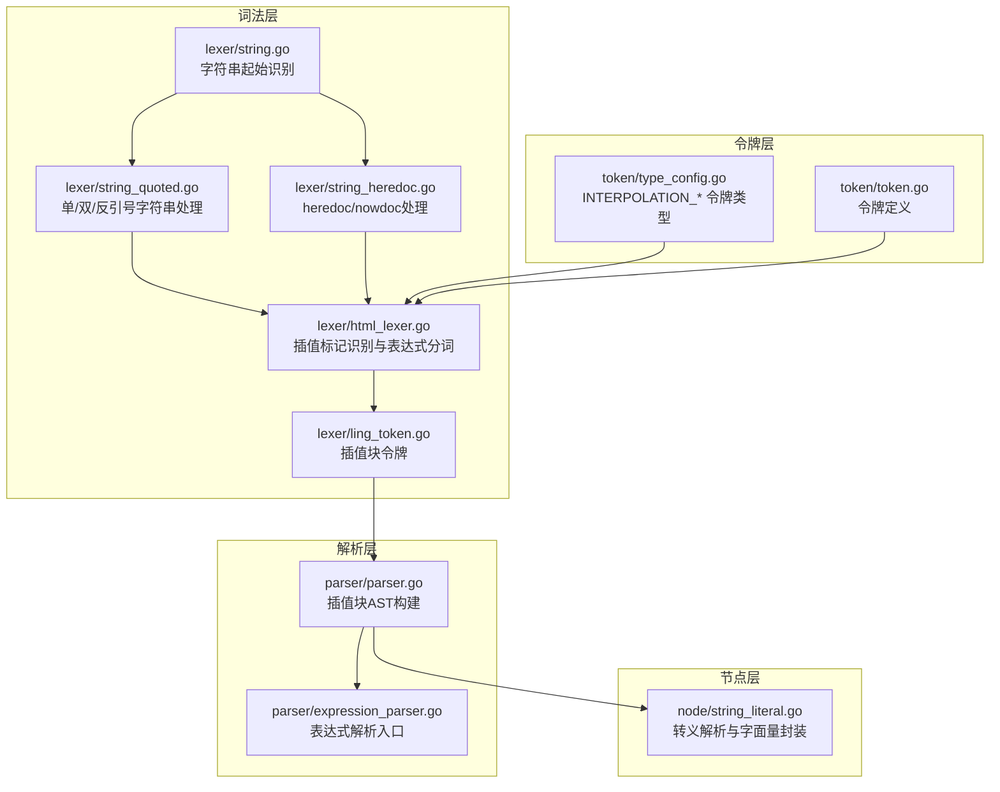
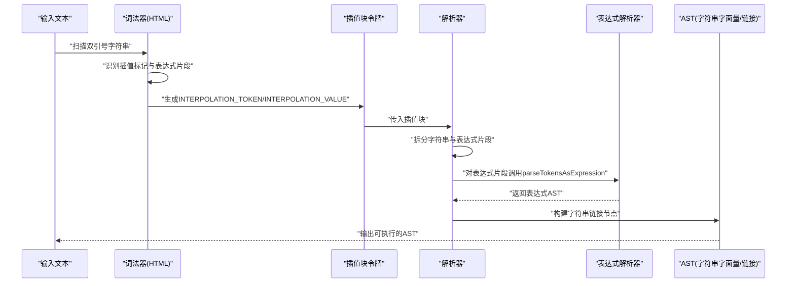
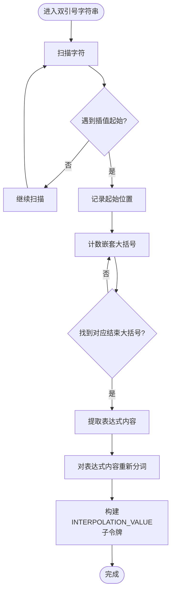
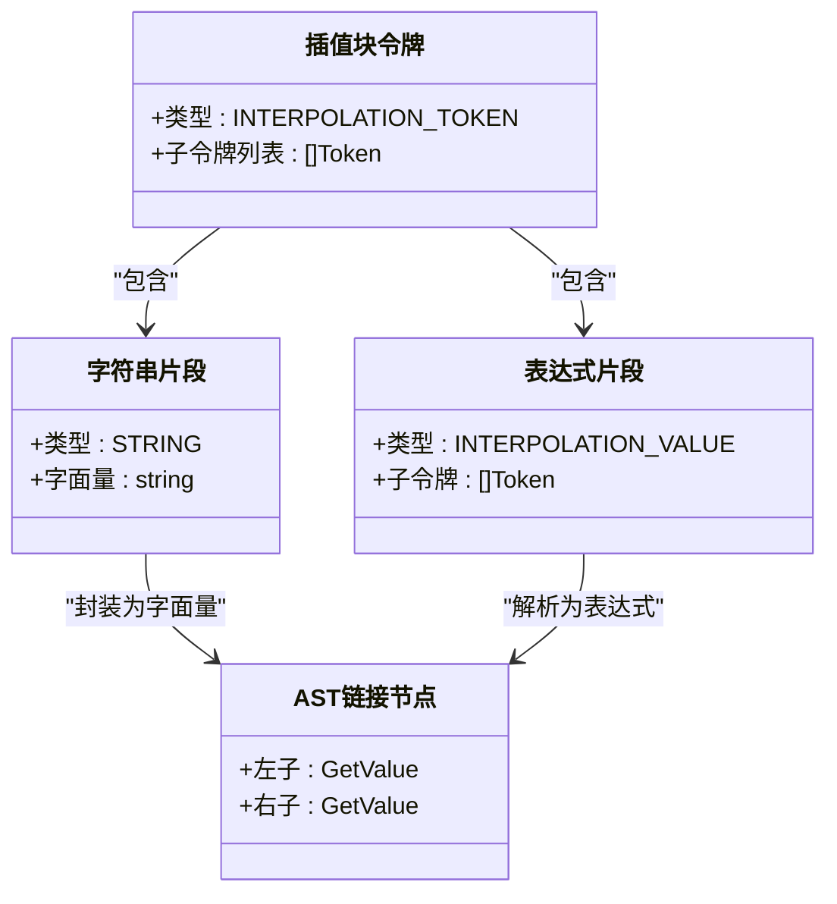
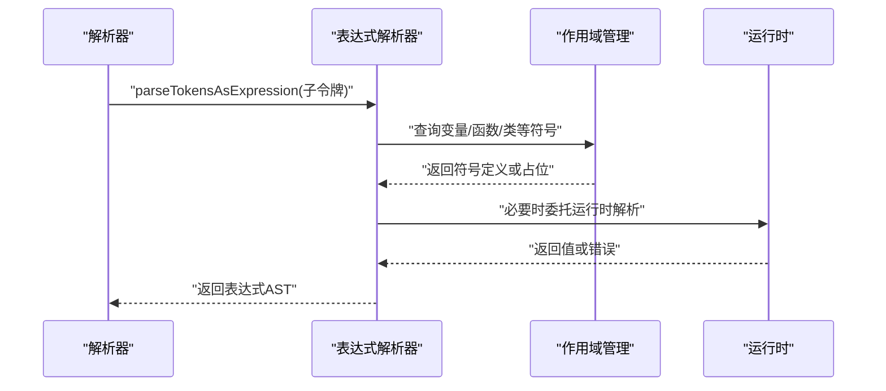
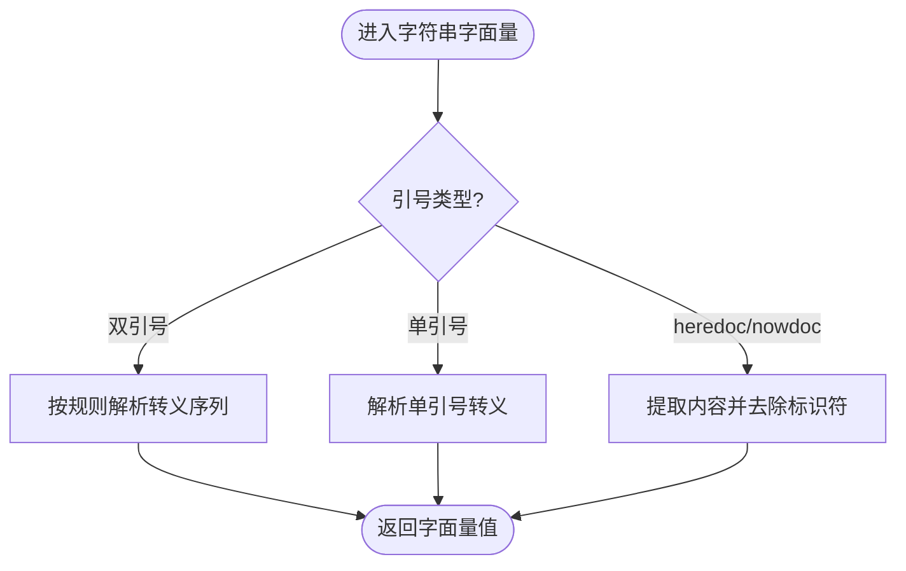
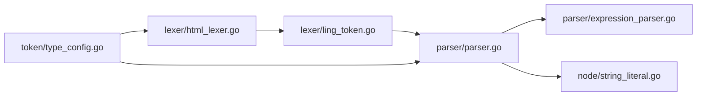

# 字符串插值处理

<cite>
**本文引用的文件**
- [lexer/string.go](file://lexer/string.go)
- [lexer/string_quoted.go](file://lexer/string_quoted.go)
- [lexer/string_heredoc.go](file://lexer/string_heredoc.go)
- [lexer/html_lexer.go](file://lexer/html_lexer.go)
- [lexer/ling_token.go](file://lexer/ling_token.go)
- [parser/parser.go](file://parser/parser.go)
- [parser/expression_parser.go](file://parser/expression_parser.go)
- [node/string_literal.go](file://node/string_literal.go)
- [token/type_config.go](file://token/type_config.go)
- [token/token.go](file://token/token.go)
</cite>

## 目录
1. [简介](#简介)
2. [项目结构](#项目结构)
3. [核心组件](#核心组件)
4. [架构总览](#架构总览)
5. [详细组件分析](#详细组件分析)
6. [依赖分析](#依赖分析)
7. [性能考虑](#性能考虑)
8. [故障排查指南](#故障排查指南)
9. [结论](#结论)
10. [附录](#附录)

## 简介
本文件系统性阐述代码库中“双引号字符串中的变量插值、表达式求值与代码片段处理”的实现机制，覆盖以下关键主题：
- 插值标记识别算法与边界检测
- 变量名解析与作用域查找
- 嵌套表达式处理与转义序列解析
- 复杂表达式插值、函数调用插值、数组访问插值
- 性能优化策略与扩展方法

目标读者包括希望深入理解字符串插值工作原理的工程师，以及需要扩展或自定义插值语法的高级用户。

## 项目结构
围绕字符串插值的关键模块分布如下：
- 词法层：负责识别字符串边界、heredoc/nowdoc、插值标记与表达式片段
- 解析层：将插值块拆分为字符串片段与表达式片段，并构建 AST
- 节点层：提供转义解析与字符串字面量封装
- 令牌层：定义插值相关令牌类型

图表来源
- [lexer/string.go:1-69](file://lexer/string.go#L1-L69)
- [lexer/string_quoted.go:1-80](file://lexer/string_quoted.go#L1-L80)
- [lexer/string_heredoc.go:1-67](file://lexer/string_heredoc.go#L1-L67)
- [lexer/html_lexer.go:1000-1200](file://lexer/html_lexer.go#L1000-L1200)
- [lexer/ling_token.go:1-62](file://lexer/ling_token.go#L1-L62)
- [parser/parser.go:686-730](file://parser/parser.go#L686-L730)
- [parser/expression_parser.go:605-639](file://parser/expression_parser.go#L605-L639)
- [node/string_literal.go:1-155](file://node/string_literal.go#L1-L155)
- [token/type_config.go:163-166](file://token/type_config.go#L163-L166)
- [token/token.go:179-181](file://token/token.go#L179-L181)

章节来源
- [lexer/string.go:1-69](file://lexer/string.go#L1-L69)
- [lexer/string_quoted.go:1-80](file://lexer/string_quoted.go#L1-L80)
- [lexer/string_heredoc.go:1-67](file://lexer/string_heredoc.go#L1-L67)
- [lexer/html_lexer.go:1000-1200](file://lexer/html_lexer.go#L1000-L1200)
- [lexer/ling_token.go:1-62](file://lexer/ling_token.go#L1-L62)
- [parser/parser.go:686-730](file://parser/parser.go#L686-L730)
- [parser/expression_parser.go:605-639](file://parser/expression_parser.go#L605-L639)
- [node/string_literal.go:1-155](file://node/string_literal.go#L1-L155)
- [token/type_config.go:163-166](file://token/type_config.go#L163-L166)
- [token/token.go:179-181](file://token/token.go#L179-L181)

## 核心组件
- 字符串识别与边界检测
  - 通过统一入口识别字符串起始，区分单引号、双引号、反引号与 heredoc/nowdoc
  - 双引号字符串支持转义解析；heredoc/nowdoc支持结束标识符定位
- 插值标记识别与表达式分词
  - 在双引号字符串内识别插值起始与结束，将表达式内容交由独立词法器重新分词
  - 支持复杂表达式与函数调用插值
- 插值块构建与表达式解析
  - 将字符串片段与表达式片段组合为插值块令牌，解析为 AST 链接节点
- 转义序列解析
  - 双引号字符串支持多类转义（换行、制表、八进制、十六进制、转义字符本身等）
  - 单引号字符串仅支持双写转义与单引号转义

章节来源
- [lexer/string.go:44-68](file://lexer/string.go#L44-L68)
- [lexer/string_quoted.go:35-79](file://lexer/string_quoted.go#L35-L79)
- [lexer/string_heredoc.go:9-66](file://lexer/string_heredoc.go#L9-L66)
- [lexer/html_lexer.go:1000-1200](file://lexer/html_lexer.go#L1000-L1200)
- [lexer/ling_token.go:16-27](file://lexer/ling_token.go#L16-L27)
- [parser/parser.go:686-730](file://parser/parser.go#L686-L730)
- [node/string_literal.go:9-88](file://node/string_literal.go#L9-L88)

## 架构总览
下图展示从输入文本到插值表达式 AST 的端到端流程：

图表来源
- [lexer/html_lexer.go:1000-1200](file://lexer/html_lexer.go#L1000-L1200)
- [parser/parser.go:686-730](file://parser/parser.go#L686-L730)
- [parser/parser.go:801-820](file://parser/parser.go#L801-L820)
- [parser/expression_parser.go:605-639](file://parser/expression_parser.go#L605-L639)

## 详细组件分析

### 组件A：插值标记识别与表达式分词
- 识别算法
  - 在双引号字符串内扫描字符，遇到插值起始标记时，记录起始位置
  - 通过计数器匹配嵌套的大括号，直至找到对应的结束大括号
  - 对表达式内容进行二次分词，以获得精确的令牌流
- 边界检测
  - 严格区分字符串边界与插值边界，避免将字符串内的大括号误判为插值结束
  - 支持跨行插值与嵌套结构，通过相对/绝对位置信息修正令牌坐标
- 表达式分词
  - 将表达式内容作为独立字符串送入词法器，得到标准令牌序列
  - 将每个令牌的行列信息映射回原始文件位置，保证调试与错误定位准确

图表来源
- [lexer/html_lexer.go:1000-1140](file://lexer/html_lexer.go#L1000-L1140)

章节来源
- [lexer/html_lexer.go:1000-1140](file://lexer/html_lexer.go#L1000-L1140)
- [lexer/html_lexer.go:1141-1160](file://lexer/html_lexer.go#L1141-L1160)
- [lexer/html_lexer.go:1161-1190](file://lexer/html_lexer.go#L1161-L1190)

### 组件B：插值块构建与AST生成
- 插值块结构
  - 插值块由若干子令牌组成：字符串片段与表达式片段交替出现
  - 表达式片段以 INTERPOLATION_VALUE 表示，内部包含其自身的令牌序列
- AST生成
  - 解析器遍历子令牌，字符串片段封装为字符串字面量节点
  - 表达式片段通过独立的表达式解析流程生成表达式节点
  - 使用显式的链接节点将各部分从左到右拼接，形成最终的插值表达式

图表来源
- [lexer/ling_token.go:16-27](file://lexer/ling_token.go#L16-L27)
- [parser/parser.go:686-730](file://parser/parser.go#L686-L730)

章节来源
- [lexer/ling_token.go:16-27](file://lexer/ling_token.go#L16-L27)
- [parser/parser.go:686-730](file://parser/parser.go#L686-L730)

### 组件C：表达式解析与作用域查找
- 表达式解析入口
  - 对 INTERPOLATION_VALUE 的子令牌序列，使用表达式解析器进行解析
  - 通过克隆解析器上下文，共享作用域与命名空间信息，确保变量解析一致
- 作用域与变量解析
  - 解析器在解析过程中维护作用域栈，支持局部变量、全局变量与静态变量
  - 对变量名进行作用域查找，必要时回退至运行时动态解析
- 复杂表达式支持
  - 支持嵌套表达式、函数调用、数组访问、对象访问等复合结构
  - 通过表达式优先级与结合性规则，确保运算顺序正确

图表来源
- [parser/parser.go:801-820](file://parser/parser.go#L801-L820)
- [parser/expression_parser.go:605-639](file://parser/expression_parser.go#L605-L639)

章节来源
- [parser/parser.go:801-820](file://parser/parser.go#L801-L820)
- [parser/expression_parser.go:605-639](file://parser/expression_parser.go#L605-L639)

### 组件D：转义序列处理与字符串字面量
- 双引号转义规则
  - 支持换行、回车、制表、双引号、单引号、美元、转义、八进制与十六进制等
  - 八进制最多三位，十六进制最多两位；遇非法字符按原样处理
- 单引号转义规则
  - 仅支持双写反斜杠与单引号转义
- heredoc/nowdoc
  - heredoc 解析内容，nowdoc 原样保留
  - 通过结束标识符定位内容边界，去除起止引号与换行

图表来源
- [node/string_literal.go:9-88](file://node/string_literal.go#L9-L88)
- [node/string_literal.go:104-141](file://node/string_literal.go#L104-L141)

章节来源
- [node/string_literal.go:9-88](file://node/string_literal.go#L9-L88)
- [node/string_literal.go:104-141](file://node/string_literal.go#L104-L141)

### 组件E：令牌类型与边界
- 令牌类型
  - INTERPOLATION_TOKEN：插值块令牌
  - INTERPOLATION_VALUE：插值块内的表达式片段
  - STRING：普通字符串片段
- 边界判定
  - 通过词法器在字符串内扫描插值标记，严格区分字符串边界与插值边界
  - 对函数调用插值与复杂表达式插值分别处理，确保嵌套结构正确

章节来源
- [token/type_config.go:163-166](file://token/type_config.go#L163-L166)
- [token/token.go:179-181](file://token/token.go#L179-L181)
- [lexer/html_lexer.go:1058-1140](file://lexer/html_lexer.go#L1058-L1140)

## 依赖分析
- 低耦合高内聚
  - 词法层仅负责识别与分词，不关心语义；解析层负责语义与AST构建
  - 插值块令牌作为中间表示，降低词法与语法之间的耦合
- 关键依赖链
  - 词法器 → 插值块令牌 → 解析器 → 表达式解析器 → AST
  - 转义解析位于节点层，供字符串字面量使用

图表来源
- [lexer/html_lexer.go:1000-1200](file://lexer/html_lexer.go#L1000-L1200)
- [lexer/ling_token.go:16-27](file://lexer/ling_token.go#L16-L27)
- [parser/parser.go:686-730](file://parser/parser.go#L686-L730)
- [parser/expression_parser.go:605-639](file://parser/expression_parser.go#L605-L639)
- [node/string_literal.go:104-141](file://node/string_literal.go#L104-L141)
- [token/type_config.go:163-166](file://token/type_config.go#L163-L166)

章节来源
- [lexer/html_lexer.go:1000-1200](file://lexer/html_lexer.go#L1000-L1200)
- [lexer/ling_token.go:16-27](file://lexer/ling_token.go#L16-L27)
- [parser/parser.go:686-730](file://parser/parser.go#L686-L730)
- [parser/expression_parser.go:605-639](file://parser/expression_parser.go#L605-L639)
- [node/string_literal.go:104-141](file://node/string_literal.go#L104-L141)
- [token/type_config.go:163-166](file://token/type_config.go#L163-L166)

## 性能考虑
- 词法阶段尽量减少回溯
  - 通过计数器匹配嵌套大括号，避免多次扫描
  - 对表达式内容采用一次性分词，避免重复解析
- 解析阶段的优化
  - 共享解析器上下文，减少重复初始化
  - 对简单字符串片段直接封装为字面量，避免不必要的AST构建
- 内存与时间权衡
  - 插值块令牌持有子令牌序列，便于后续解析；在高频插值场景中建议缓存常用表达式结果
  - 转义解析使用字符串构建器扩容策略，减少内存拷贝

## 故障排查指南
- 常见问题
  - 插值未生效：检查插值起始与结束标记是否正确匹配，确认字符串边界未被提前截断
  - 嵌套表达式错误：核对大括号计数逻辑，确保最内层匹配正确
  - 转义异常：确认转义序列符合规则，特别是八进制与十六进制位数限制
- 定位手段
  - 使用调试输出查看插值块令牌的子令牌序列
  - 对表达式片段单独进行表达式解析测试，验证作用域与符号解析
- 修复建议
  - 在词法阶段增加边界校验与错误提示
  - 在解析阶段对非法表达式片段给出明确的错误位置信息

章节来源
- [lexer/html_lexer.go:1000-1140](file://lexer/html_lexer.go#L1000-L1140)
- [parser/parser.go:801-820](file://parser/parser.go#L801-L820)
- [node/string_literal.go:9-88](file://node/string_literal.go#L9-L88)

## 结论
本系统通过清晰的分层设计实现了高效的字符串插值处理：词法层专注边界识别与表达式分词，解析层负责语义构建与AST生成，节点层提供可靠的转义解析。该架构既满足复杂表达式与函数调用插值的需求，又具备良好的扩展性与可维护性。

## 附录
- 扩展与自定义插值语法指南
  - 新增插值标记：在词法器中添加识别逻辑，生成新的令牌类型并在解析层处理
  - 自定义表达式求值：在解析层扩展表达式解析器，支持新的运算符或内置函数
  - 作用域与符号：通过作用域管理器注册新符号，确保变量解析一致性
- 复杂表达式插值示例
  - 支持嵌套函数调用、数组访问与对象属性访问
  - 通过表达式优先级与结合性规则保证计算顺序
- 性能优化建议
  - 对热点插值表达式进行缓存
  - 合理使用字符串构建器，减少内存分配
  - 在词法阶段尽早失败，避免无效解析