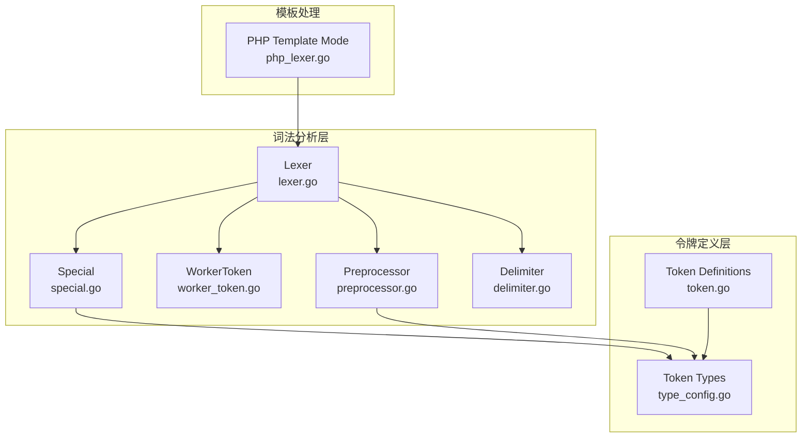
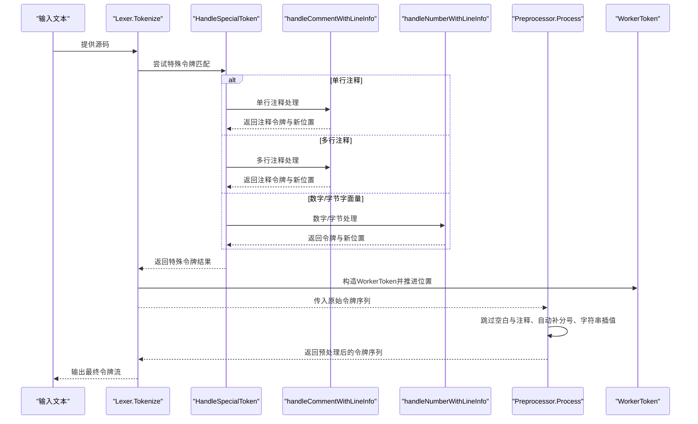
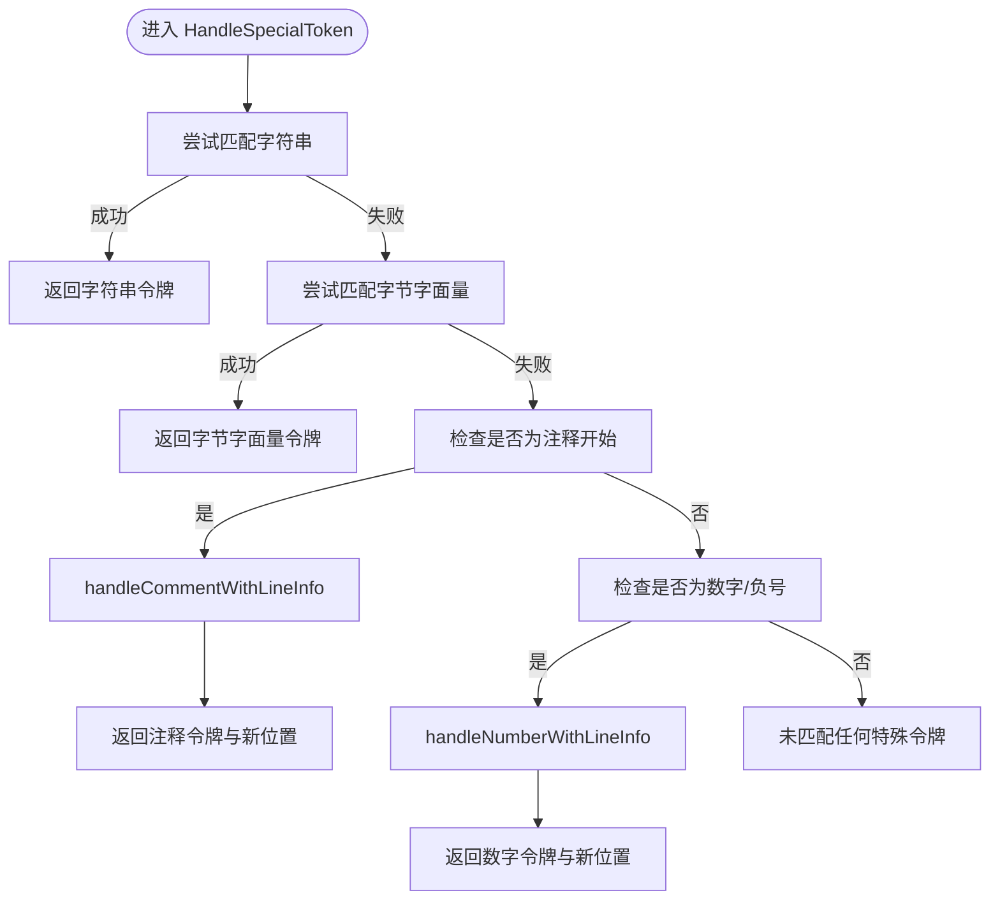
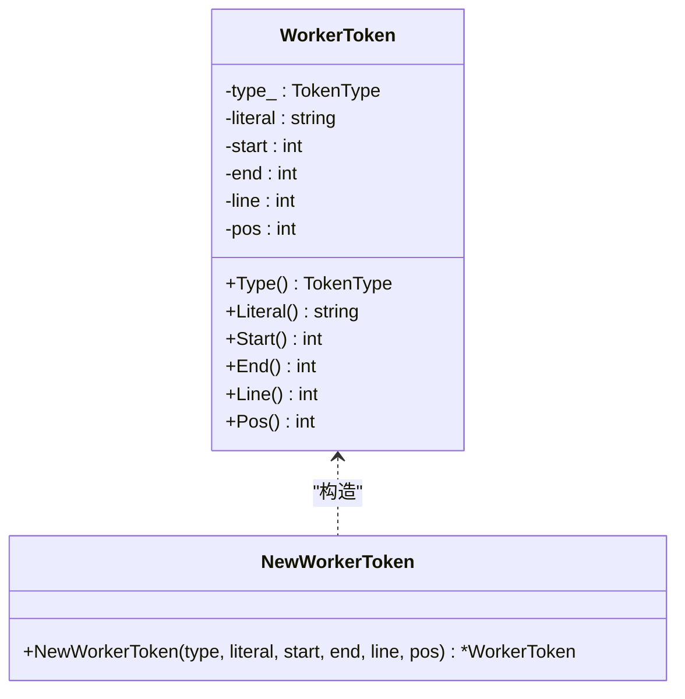
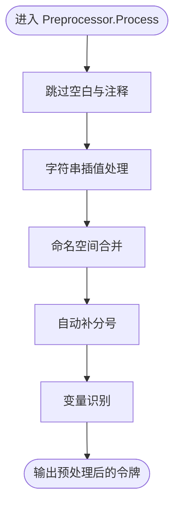
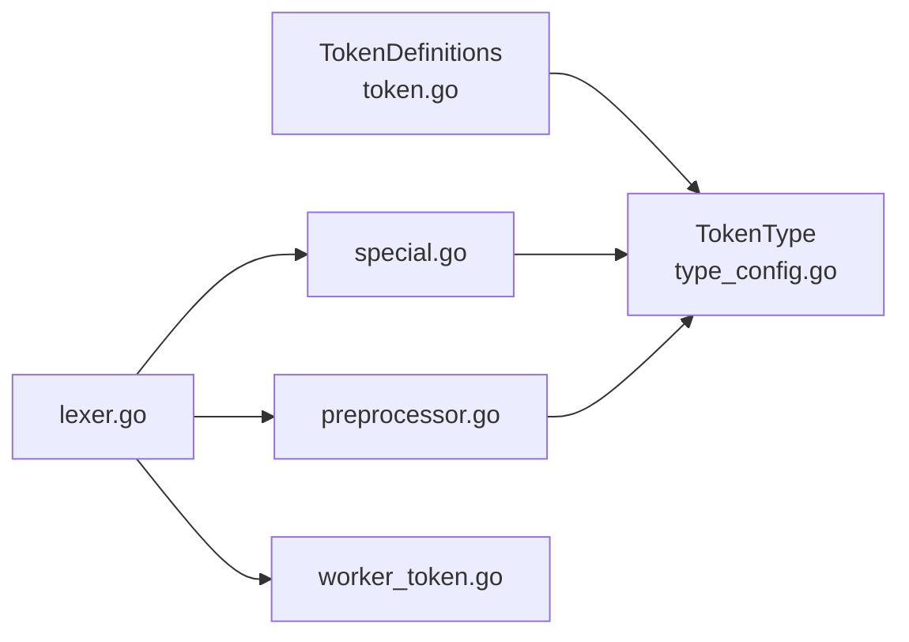

# 特殊令牌处理

<cite>
**本文引用的文件**
- [special.go](file://lexer/special.go)
- [worker_token.go](file://lexer/worker_token.go)
- [preprocessor.go](file://lexer/preprocessor.go)
- [lexer.go](file://lexer/lexer.go)
- [php_lexer.go](file://lexer/php_lexer.go)
- [delimiter.go](file://lexer/delimiter.go)
- [token.go](file://token/token.go)
- [type_config.go](file://token/type_config.go)
- [special_test.go](file://lexer/special_test.go)
- [preprocessor_test.go](file://lexer/preprocessor_test.go)
</cite>

## 目录
1. [简介](#简介)
2. [项目结构](#项目结构)
3. [核心组件](#核心组件)
4. [架构总览](#架构总览)
5. [详细组件分析](#详细组件分析)
6. [依赖分析](#依赖分析)
7. [性能考量](#性能考量)
8. [故障排查指南](#故障排查指南)
9. [结论](#结论)
10. [附录](#附录)

## 简介
本文件面向编译器开发者，系统化阐述词法分析器中“特殊令牌”的识别与处理机制，覆盖以下主题：
- 注释（单行注释//、多行注释/* */）的识别、嵌套检测与内容提取
- 预处理器指令与Shebang行的处理
- WorkerToken的设计理念与实现要点（位置跟踪、类型转换、内存优化）
- 特殊令牌对后续语法分析的影响及错误处理
- 扩展方法与自定义令牌类型的实现指南

## 项目结构
围绕“特殊令牌处理”，本仓库中与之直接相关的模块主要位于 lexer 目录，关键文件如下：
- special.go：特殊令牌识别与处理（注释、数字、字节字面量）
- worker_token.go：WorkerToken数据结构与方法
- preprocessor.go：预处理器（跳过空白与注释、自动补分号、字符串插值、变量识别）
- lexer.go：主词法分析器（Shebang处理、特殊令牌优先级、位置跟踪）
- php_lexer.go：模板模式（<?php ... ?>）下的词法处理
- delimiter.go：分隔符判定（影响标识符/数字的边界）
- token.go、type_config.go：令牌类型定义与常量

图表来源
- [lexer.go:88-248](file://lexer/lexer.go#L88-L248)
- [special.go:311-366](file://lexer/special.go#L311-L366)
- [worker_token.go:15-56](file://lexer/worker_token.go#L15-L56)
- [preprocessor.go:191-350](file://lexer/preprocessor.go#L191-L350)
- [delimiter.go:10-70](file://lexer/delimiter.go#L10-L70)
- [token.go:34-181](file://token/token.go#L34-L181)
- [type_config.go:6-198](file://token/type_config.go#L6-L198)
- [php_lexer.go:11-199](file://lexer/php_lexer.go#L11-L199)

章节来源
- [lexer.go:88-248](file://lexer/lexer.go#L88-L248)
- [special.go:311-366](file://lexer/special.go#L311-L366)
- [worker_token.go:15-56](file://lexer/worker_token.go#L15-L56)
- [preprocessor.go:191-350](file://lexer/preprocessor.go#L191-L350)
- [delimiter.go:10-70](file://lexer/delimiter.go#L10-L70)
- [token.go:34-181](file://token/token.go#L34-L181)
- [type_config.go:6-198](file://token/type_config.go#L6-L198)
- [php_lexer.go:11-199](file://lexer/php_lexer.go#L11-L199)

## 核心组件
- 特殊令牌识别器（HandleSpecialToken）：统一入口，按优先级识别注释、数字、字节字面量等
- WorkerToken：承载令牌类型、字面值与位置信息的轻量结构体
- 预处理器（Preprocessor）：过滤空白与注释、自动补分号、字符串插值、变量识别
- 主词法分析器（Lexer）：Shebang行处理、特殊令牌优先级、位置跟踪
- 分隔符判定（IsDelimiter）：决定标识符/数字的边界，间接影响特殊令牌匹配

章节来源
- [special.go:311-366](file://lexer/special.go#L311-L366)
- [worker_token.go:15-56](file://lexer/worker_token.go#L15-L56)
- [preprocessor.go:191-350](file://lexer/preprocessor.go#L191-L350)
- [lexer.go:88-248](file://lexer/lexer.go#L88-L248)
- [delimiter.go:10-70](file://lexer/delimiter.go#L10-L70)

## 架构总览
下图展示从输入到最终令牌流的关键路径，突出“特殊令牌优先级”和“位置信息传递”。

图表来源
- [lexer.go:147-162](file://lexer/lexer.go#L147-L162)
- [special.go:311-366](file://lexer/special.go#L311-L366)
- [special.go:368-454](file://lexer/special.go#L368-L454)
- [special.go:456-469](file://lexer/special.go#L456-L469)
- [preprocessor.go:191-350](file://lexer/preprocessor.go#L191-L350)
- [worker_token.go:15-56](file://lexer/worker_token.go#L15-L56)

## 详细组件分析

### 特殊令牌识别与处理（special.go）
- 识别优先级
  - 字符串优先：若能匹配字符串，则优先返回字符串令牌
  - 字节字面量：以 b' 开头的字节字面量
  - 注释：以 “//” 或 “/*” 开头的注释
  - 数字：以数字或负号开头的数字字面量
- 注释处理
  - 单行注释：从 “//” 开始，直到遇到换行符为止
  - 多行注释：从 “/*” 开始，直到遇到 “*/” 结束，支持跨行
  - 嵌套检测：多行注释内部不递归匹配 “/*”（不会误认为嵌套注释开始）
- 数字处理
  - 支持整数、浮点数、科学计数法、十六进制、二进制、八进制
  - 通过分隔符判定终止匹配，避免将标识符误判为数字
- 字节字面量
  - 以 b' 开头，直到遇到同侧引号结束，支持转义

图表来源
- [special.go:311-366](file://lexer/special.go#L311-L366)
- [special.go:368-454](file://lexer/special.go#L368-L454)
- [special.go:456-469](file://lexer/special.go#L456-L469)

章节来源
- [special.go:25-77](file://lexer/special.go#L25-L77)
- [special.go:38-77](file://lexer/special.go#L38-L77)
- [special.go:79-280](file://lexer/special.go#L79-L280)
- [special.go:282-309](file://lexer/special.go#L282-L309)
- [special.go:311-366](file://lexer/special.go#L311-L366)
- [special.go:368-454](file://lexer/special.go#L368-L454)
- [special.go:456-469](file://lexer/special.go#L456-L469)

### WorkerToken 设计与实现（worker_token.go）
- 数据结构
  - type_：令牌类型（枚举）
  - literal：原始字面值（不进行换行替换）
  - start/end：字节偏移范围
  - line/pos：行号与行内位置
- 方法族
  - Type/Literal/Start/End/Line/Pos：提供只读访问
- 设计理念
  - 轻量封装：仅承载必要字段，便于后续语法分析器使用
  - 位置跟踪：支持精确的行列定位，利于报错与调试
  - 类型转换：通过 NewWorkerToken 统一构造，保证一致性

图表来源
- [worker_token.go:5-56](file://lexer/worker_token.go#L5-L56)

章节来源
- [worker_token.go:5-56](file://lexer/worker_token.go#L5-L56)

### 预处理器（preprocessor.go）
- 功能清单
  - 跳过空白与注释（包括单行与多行注释）
  - 字符串插值：支持裸变量、花括号表达式、函数插值等
  - 变量识别：将 $ 与标识符合并为变量令牌
  - 自动补分号：基于 TS 风格的换行补分号规则
  - 命名空间合并：将 \ 与标识符合并为完整命名空间标识符
- 分号补全规则
  - 前后均不可插入分号的场景：运算符、括号、分隔符等
  - 换行符前后满足条件时，替换为分号令牌
- 字符串插值
  - 处理裸变量、花括号表达式、函数插值
  - 对复杂表达式进行二次分词并调整位置信息

图表来源
- [preprocessor.go:191-350](file://lexer/preprocessor.go#L191-L350)

章节来源
- [preprocessor.go:19-187](file://lexer/preprocessor.go#L19-L187)
- [preprocessor.go:191-350](file://lexer/preprocessor.go#L191-L350)
- [preprocessor.go:352-800](file://lexer/preprocessor.go#L352-L800)

### 主词法分析器（lexer.go）
- Shebang 行处理
  - 若输入以 “#!” 开头，定位换行符并跳过整行，然后继续处理
- 特殊令牌优先级
  - 优先调用 HandleSpecialToken，若返回成功则构造 WorkerToken 并推进位置
- 位置跟踪
  - 通过 SpecialTokenResult 返回新位置（NewPos/NewLine/NewLinePos），确保后续扫描准确
- 模板模式
  - php_lexer.go 提供模板模式下的 TokenizeTemplate，支持在 HTML 中嵌入 PHP 代码段

章节来源
- [lexer.go:88-102](file://lexer/lexer.go#L88-L102)
- [lexer.go:147-162](file://lexer/lexer.go#L147-L162)
- [lexer.go:164-177](file://lexer/lexer.go#L164-L177)
- [lexer.go:179-245](file://lexer/lexer.go#L179-L245)
- [php_lexer.go:11-199](file://lexer/php_lexer.go#L11-L199)

### 分隔符判定（delimiter.go）
- 作用
  - 判定字符是否为分隔符，从而决定标识符/数字的边界
  - 影响 HandleSpecialToken 对数字的匹配终止条件
- 关键点
  - 空白字符、括号、运算符、标点符号、点号等均视为分隔符
  - 反斜杠（命名空间分隔符）不在分隔符列表中，允许出现在标识符中

章节来源
- [delimiter.go:10-70](file://lexer/delimiter.go#L10-L70)

## 依赖分析
- 令牌类型与定义
  - token.go 定义了所有 TokenDefinition 与 GetTokenDefinitions
  - type_config.go 定义了 TokenType 常量集合，包括 COMMENT、MULTILINE_COMMENT、NUMBER、INT、FLOAT、BYTE 等
- 特殊令牌与令牌类型
  - special.go 使用 token.COMMENT、token.MULTILINE_COMMENT、token.NUMBER、token.INT、token.FLOAT、token.BYTE
  - preprocessor.go 使用 token.WHITESPACE、token.COMMENT、token.MULTILINE_COMMENT、token.STRING、token.VARIABLE、token.IDENTIFIER、token.SEMICOLON 等
- 词法与预处理协作
  - Lexer 将原始令牌交给 Preprocessor，后者产出最终令牌流
  - WorkerToken 作为中间载体，贯穿词法与预处理阶段

图表来源
- [token.go:34-181](file://token/token.go#L34-L181)
- [type_config.go:6-198](file://token/type_config.go#L6-L198)
- [special.go:10-15](file://lexer/special.go#L10-L15)
- [preprocessor.go:9-19](file://lexer/preprocessor.go#L9-L19)
- [lexer.go:88-248](file://lexer/lexer.go#L88-L248)
- [worker_token.go:3](file://lexer/worker_token.go#L3)

章节来源
- [token.go:34-181](file://token/token.go#L34-L181)
- [type_config.go:6-198](file://token/type_config.go#L6-L198)
- [special.go:10-15](file://lexer/special.go#L10-L15)
- [preprocessor.go:9-19](file://lexer/preprocessor.go#L9-L19)
- [lexer.go:88-248](file://lexer/lexer.go#L88-L248)
- [worker_token.go:3](file://lexer/worker_token.go#L3)

## 性能考量
- 特殊令牌优先级
  - 通过优先调用 HandleSpecialToken，减少对 DAG 的回溯，提高整体吞吐
- 位置信息复用
  - SpecialTokenResult 直接携带新位置，避免重复计算
- 预处理阶段的批量处理
  - 跳过空白与注释、一次性补分号、字符串插值的批量处理，降低后续语法分析成本
- 分隔符判定
  - 使用 IsDelimiter 精确终止数字/标识符匹配，避免误判导致的回溯

[本节为通用性能讨论，无需具体文件来源]

## 故障排查指南
- 注释未正确结束
  - 现象：多行注释未匹配到 “*/”
  - 排查：确认输入中是否存在未闭合的 “/*”，或是否存在嵌套注释（当前实现不支持嵌套）
- 数字识别异常
  - 现象：数字被误判为标识符或字符串
  - 排查：检查分隔符判定是否正确，确认数字末尾是否被分隔符截断
- 字符串插值未生效
  - 现象：花括号表达式未被识别为插值
  - 排查：确认变量名是否以有效字符开头，表达式是否正确闭合
- 自动补分号不符合预期
  - 现象：某些换行处未补分号或错误补分号
  - 排查：检查前后令牌类型是否在不可插入分号列表中

章节来源
- [special.go:407-451](file://lexer/special.go#L407-L451)
- [delimiter.go:16-70](file://lexer/delimiter.go#L16-L70)
- [preprocessor.go:191-350](file://lexer/preprocessor.go#L191-L350)

## 结论
本系统通过“特殊令牌优先级 + 精准位置跟踪 + 预处理阶段的批量优化”，实现了对注释、数字、字节字面量等特殊令牌的高效识别与处理。WorkerToken 作为统一的数据载体，既保证了位置信息的准确性，也为后续语法分析提供了便利。预处理器进一步提升了令牌流的质量，使语法分析阶段能够专注于结构化解析。

[本节为总结性内容，无需具体文件来源]

## 附录

### 特殊令牌对语法分析的影响
- 注释
  - 预处理阶段直接丢弃，不影响语法树构建
- 数字
  - 作为字面量令牌进入语法分析，类型区分有助于类型推断
- 字节字面量
  - 作为字面量令牌进入语法分析，便于后续类型检查
- 字符串插值
  - 转换为 LingToken/INTERPOLATION_TOKEN，便于语法分析器按子令牌逐步解析

章节来源
- [preprocessor.go:191-350](file://lexer/preprocessor.go#L191-L350)
- [preprocessor.go:352-800](file://lexer/preprocessor.go#L352-L800)

### 错误处理机制
- 无效 UTF-8 序列
  - 词法分析器捕获 utf8.RuneError，生成 UNKNOWN 令牌
- 未匹配的特殊令牌
  - 返回空结果，交由常规匹配流程处理
- 未闭合的注释
  - 多行注释匹配到输入末尾时，视为未闭合，交由上层处理

章节来源
- [lexer.go:180-194](file://lexer/lexer.go#L180-L194)
- [special.go:453](file://lexer/special.go#L453)

### 扩展方法与自定义令牌类型实现指南
- 新增令牌类型
  - 在 token/type_config.go 中新增 TokenType 常量
  - 在 token/token.go 中注册 TokenDefinition
- 新增特殊令牌识别
  - 在 special.go 中新增处理函数，并在 HandleSpecialToken 中接入优先级
  - 确保返回 SpecialTokenResult 并正确更新位置信息
- 预处理阶段适配
  - 在 preprocessor.go 中增加对新令牌类型的处理逻辑（如跳过、转换、插值等）
- 测试验证
  - 参考 special_test.go 与 preprocessor_test.go 的测试模式，编写针对性测试用例

章节来源
- [type_config.go:6-198](file://token/type_config.go#L6-L198)
- [token.go:34-181](file://token/token.go#L34-L181)
- [special.go:311-366](file://lexer/special.go#L311-L366)
- [preprocessor.go:191-350](file://lexer/preprocessor.go#L191-L350)
- [special_test.go:10-198](file://lexer/special_test.go#L10-L198)
- [preprocessor_test.go:9-255](file://lexer/preprocessor_test.go#L9-L255)