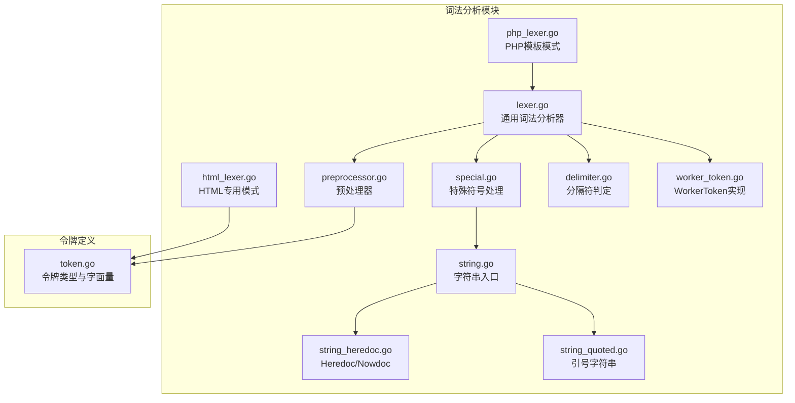
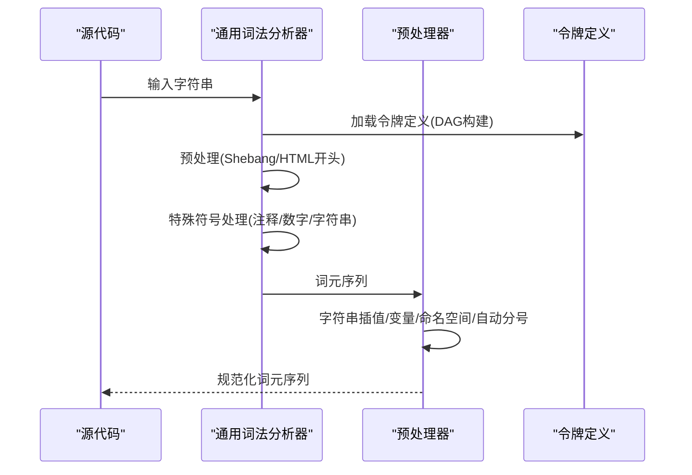
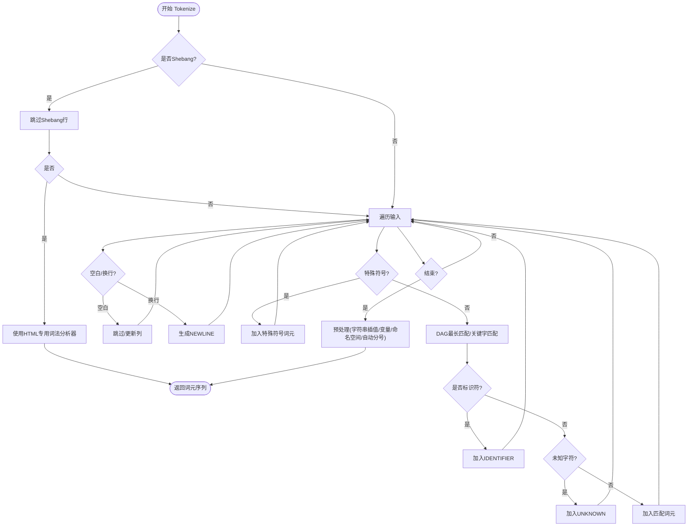
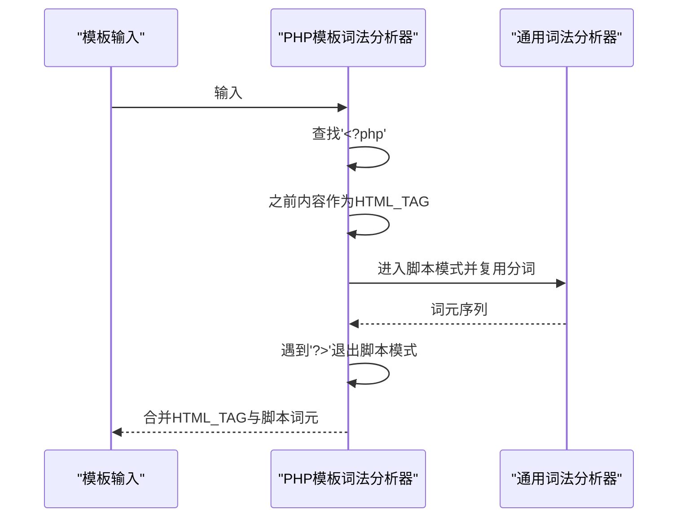
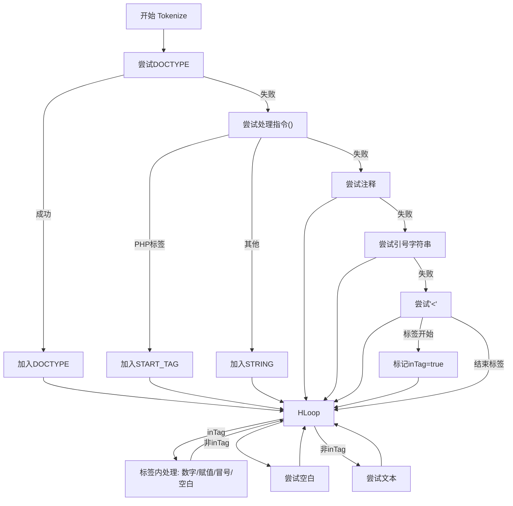
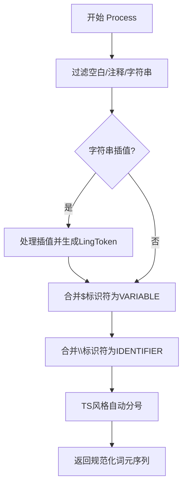
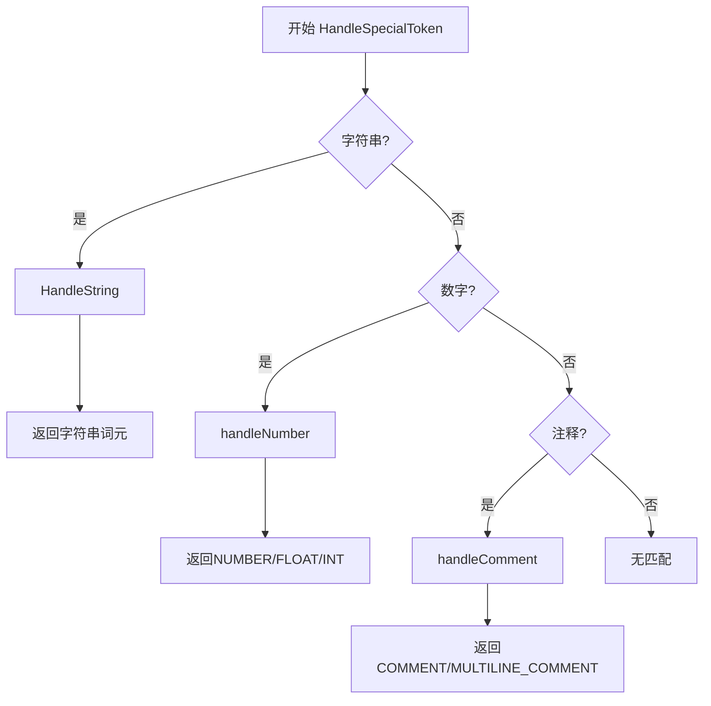
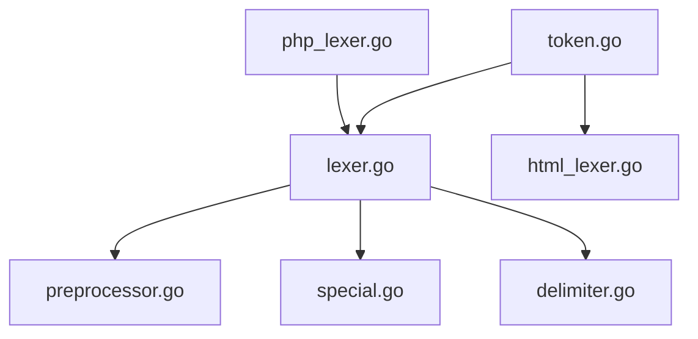

# 词法分析器

<cite>
**本文档引用的文件**
- [lexer.go](file://lexer/lexer.go)
- [php_lexer.go](file://lexer/php_lexer.go)
- [html_lexer.go](file://lexer/html_lexer.go)
- [preprocessor.go](file://lexer/preprocessor.go)
- [special.go](file://lexer/special.go)
- [string.go](file://lexer/string.go)
- [string_heredoc.go](file://lexer/string_heredoc.go)
- [string_quoted.go](file://lexer/string_quoted.go)
- [delimiter.go](file://lexer/delimiter.go)
- [worker_token.go](file://lexer/worker_token.go)
- [token.go](file://token/token.go)
- [lexer_test.go](file://lexer/lexer_test.go)
- [preprocessor_test.go](file://lexer/preprocessor_test.go)
- [special_test.go](file://lexer/special_test.go)
</cite>

## 目录
1. [简介](#简介)
2. [项目结构](#项目结构)
3. [核心组件](#核心组件)
4. [架构总览](#架构总览)
5. [详细组件分析](#详细组件分析)
6. [依赖分析](#依赖分析)
7. [性能考量](#性能考量)
8. [故障排除指南](#故障排除指南)
9. [结论](#结论)
10. [附录](#附录)

## 简介
本文件面向编译器开发者，系统化阐述词法分析器的设计与实现。内容涵盖令牌识别算法、特殊字符处理、PHP模式与原生语法模式差异、HTML混合模式、令牌类型定义、字符串插值与Herdoc语法支持、位置跟踪与预处理流程，并提供扩展指南与最佳实践。

## 项目结构
词法分析器位于 `lexer/` 目录，核心文件包括：
- 通用词法分析器：lexer.go
- PHP模板模式：php_lexer.go
- HTML专用词法分析器：html_lexer.go
- 预处理器：preprocessor.go
- 特殊符号处理：special.go
- 字符串处理：string.go、string_heredoc.go、string_quoted.go
- 分隔符判定：delimiter.go
- 词元接口与实现：worker_token.go
- 令牌类型定义：token.go
- 测试：lexer_test.go、preprocessor_test.go、special_test.go

**图表来源**
- [lexer.go:1-350](file://lexer/lexer.go#L1-L350)
- [php_lexer.go:1-200](file://lexer/php_lexer.go#L1-L200)
- [html_lexer.go:1-800](file://lexer/html_lexer.go#L1-L800)
- [preprocessor.go:1-800](file://lexer/preprocessor.go#L1-L800)
- [special.go:1-470](file://lexer/special.go#L1-L470)
- [string.go:1-69](file://lexer/string.go#L1-L69)
- [string_heredoc.go:1-67](file://lexer/string_heredoc.go#L1-L67)
- [string_quoted.go:1-80](file://lexer/string_quoted.go#L1-L80)
- [delimiter.go:1-95](file://lexer/delimiter.go#L1-L95)
- [worker_token.go:1-56](file://lexer/worker_token.go#L1-L56)
- [token.go:1-213](file://token/token.go#L1-L213)

**章节来源**
- [lexer.go:1-350](file://lexer/lexer.go#L1-L350)
- [token.go:1-213](file://token/token.go#L1-L213)

## 核心组件
- 词元接口与实现
  - Token 接口：统一暴露类型、字面值、位置信息。
  - WorkerToken：标准词元实现，保存起止位置、行列坐标。
- 通用词法分析器
  - DAG字典树：基于令牌字面量构建，支持最长匹配与关键字识别。
  - 预处理：Shebang跳过、HTML开头识别、空白与换行处理、特殊符号处理。
  - 标识符识别：支持Unicode中文字符与命名空间反斜杠。
- PHP模板模式
  - 混合HTML与PHP：识别 `<?php ... ?>` 边界，脚本模式复用通用分词逻辑。
- HTML专用模式
  - 严格保留所有字符：DOCTYPE、CDATA、注释、引号字符串、标签、属性等。
- 预处理器
  - 字符串插值：支持 `{$var}`、`@{...}`、`$.SERVER(...)` 等。
  - 变量识别：`$identifier` 合并为 VARIABLE。
  - 命名空间合并：`\App\Class` 合并为单一 IDENTIFIER。
  - 自动分号：TS风格换行补分号，遵循不可插入规则。
- 特殊符号处理
  - 注释：单行与多行注释识别与位置计算。
  - 数字：整数、浮点、科学计数法、十六进制、二进制、八进制统一识别。
  - 字符串：单引号、双引号、反引号、Heredoc/Nowdoc。
- 分隔符判定
  - 明确哪些字符会打断标识符/数字解析，确保精确切分。

**章节来源**
- [worker_token.go:1-56](file://lexer/worker_token.go#L1-L56)
- [lexer.go:19-350](file://lexer/lexer.go#L19-L350)
- [php_lexer.go:11-200](file://lexer/php_lexer.go#L11-L200)
- [html_lexer.go:10-800](file://lexer/html_lexer.go#L10-L800)
- [preprocessor.go:9-350](file://lexer/preprocessor.go#L9-L350)
- [special.go:10-470](file://lexer/special.go#L10-L470)
- [delimiter.go:10-95](file://lexer/delimiter.go#L10-L95)

## 架构总览
词法分析器采用“通用分词 + 预处理”的两阶段设计：
- 第一阶段：通用词法分析器将输入流切分为基础词元序列。
- 第二阶段：预处理器对词元进行语义增强与规范化（插值、变量、命名空间、分号）。

**图表来源**
- [lexer.go:88-248](file://lexer/lexer.go#L88-L248)
- [preprocessor.go:189-350](file://lexer/preprocessor.go#L189-L350)
- [token.go:33-201](file://token/token.go#L33-L201)

## 详细组件分析

### 通用词法分析器（Lexer）
- 数据结构
  - Position：行、列、字节偏移。
  - Node/DAG：按令牌字面量构建前缀树，加速最长匹配与关键字识别。
- 主流程
  - 预处理：Shebang跳过；HTML开头识别交由HTML专用词法分析器。
  - 空白与换行：保留换行生成NEWLINE，跳过普通空白。
  - 特殊符号：优先交由特殊符号处理模块。
  - 最长匹配：DAG匹配或关键字匹配，避免错误截断。
  - 标识符：Unicode中文字符与命名空间反斜杠支持。
  - 未知字符：UNKNOWN词元。
  - 预处理：交由预处理器统一规范化。
- 关键算法
  - DAG最长匹配：沿字符边前进，记录最后出现的令牌定义。
  - 关键字匹配：仅当关键字后无标识符字符时才视为关键字。

**图表来源**
- [lexer.go:88-248](file://lexer/lexer.go#L88-L248)
- [lexer.go:250-350](file://lexer/lexer.go#L250-L350)

**章节来源**
- [lexer.go:41-350](file://lexer/lexer.go#L41-L350)

### PHP模板模式（TokenizeTemplate）
- 混合模式
  - 查找 `<?php`，之前内容作为HTML_TAG，之后进入脚本模式。
  - 脚本模式复用通用分词逻辑，直到遇到 `?>`。
- 位置跟踪
  - 特殊符号处理模块返回新行号与行内位置，保证跨模式位置一致性。

**图表来源**
- [php_lexer.go:11-200](file://lexer/php_lexer.go#L11-L200)

**章节来源**
- [php_lexer.go:11-200](file://lexer/php_lexer.go#L11-L200)

### HTML专用模式（HtmlLexer）
- 设计目标
  - 严格保留所有字符，包括空格、制表符、换行符，便于HTML渲染。
- 处理优先级
  - DOCTYPE、CDATA、处理指令（含PHP标签）、注释、引号字符串、标签、属性、标识符、空白与文本。
- 状态机
  - inTag 标志区分标签内外，影响空白处理与标识符解析策略。

**图表来源**
- [html_lexer.go:25-147](file://lexer/html_lexer.go#L25-L147)
- [html_lexer.go:149-800](file://lexer/html_lexer.go#L149-L800)

**章节来源**
- [html_lexer.go:10-800](file://lexer/html_lexer.go#L10-L800)

### 预处理器（Preprocessor）
- 功能清单
  - 跳过空白与注释；处理字符串插值；识别 `$identifier` 为变量；合并 `\App\Class` 为 IDENTIFIER；TS风格自动分号。
- 字符串插值
  - 支持 `{$var}`、`@{...}`、`$.SERVER(...)`，并递归对表达式进行词法分析，生成嵌套子词元。
- 变量与命名空间
  - `$identifier` 合并为 VARIABLE；`\` 后可连续跟随多个标识符片段，合并为单一 IDENTIFIER。
- 自动分号
  - NEWLINE前后根据不可插入集合判断是否插入分号。

**图表来源**
- [preprocessor.go:189-350](file://lexer/preprocessor.go#L189-L350)
- [preprocessor.go:352-800](file://lexer/preprocessor.go#L352-L800)

**章节来源**
- [preprocessor.go:9-350](file://lexer/preprocessor.go#L9-L350)
- [preprocessor.go:352-800](file://lexer/preprocessor.go#L352-L800)

### 特殊符号处理（Special）
- 注释
  - 单行与多行注释识别，返回 COMMENT/MULTILINE_COMMENT，并计算新行号与行内位置。
- 数字
  - 整数、浮点、科学计数法、十六进制、二进制、八进制统一识别；带分隔符的数字按分隔符停止。
- 字符串
  - 引号字符串与Heredoc/Nowdoc识别；Heredoc支持前导空格与单引号标识符。

**图表来源**
- [special.go:311-470](file://lexer/special.go#L311-L470)
- [string.go:44-69](file://lexer/string.go#L44-L69)
- [string_heredoc.go:9-67](file://lexer/string_heredoc.go#L9-L67)
- [string_quoted.go:7-80](file://lexer/string_quoted.go#L7-L80)

**章节来源**
- [special.go:10-470](file://lexer/special.go#L10-L470)
- [string.go:1-69](file://lexer/string.go#L1-L69)
- [string_heredoc.go:1-67](file://lexer/string_heredoc.go#L1-L67)
- [string_quoted.go:1-80](file://lexer/string_quoted.go#L1-L80)

### 分隔符判定（IsDelimiter）
- 目的：明确哪些字符会打断标识符/数字解析，避免误切分。
- 覆盖：括号、运算符、标点、空白字符、点号等。

**章节来源**
- [delimiter.go:10-95](file://lexer/delimiter.go#L10-L95)

### 令牌类型定义（TokenDefinition）
- 关键字、运算符、符号、字面量、HTML标签等类型统一定义。
- 提供按类型查询字面量的能力，供分隔符判定与DAG匹配使用。

**章节来源**
- [token.go:23-213](file://token/token.go#L23-L213)

## 依赖分析
- 组件耦合
  - 通用词法分析器依赖令牌定义（DAG构建）、特殊符号处理、分隔符判定、预处理器。
  - PHP模板模式依赖通用词法分析器。
  - HTML专用模式独立于通用词法分析器，直接依赖令牌定义。
  - 预处理器依赖通用词法分析器产出的词元序列。
- 外部依赖
  - 令牌定义模块提供统一的类型与字面量映射。

**图表来源**
- [token.go:187-213](file://token/token.go#L187-L213)
- [lexer.go:62-81](file://lexer/lexer.go#L62-L81)
- [html_lexer.go:7-8](file://lexer/html_lexer.go#L7-L8)

**章节来源**
- [token.go:187-213](file://token/token.go#L187-L213)
- [lexer.go:62-81](file://lexer/lexer.go#L62-L81)

## 性能考量
- DAG匹配
  - 通过前缀树实现O(k)匹配（k为令牌字面量长度），优于线性扫描。
- UTF-8解码
  - 使用 `utf8.DecodeRuneInString`，逐字符处理，时间复杂度O(n)。
- 预处理阶段
  - 字符串插值涉及二次分词，建议在高频场景下缓存中间结果或限制插值复杂度。
- 内存占用
  - WorkerToken保存完整位置信息，适合静态分析；若追求内存效率，可考虑压缩位置字段。

[本节为通用指导，无需特定文件来源]

## 故障排除指南
- 位置信息异常
  - 确认特殊符号处理模块返回的行号与列号计算正确；检查换行符处理分支。
- 字符串插值未生效
  - 检查插值边界（`{}`、`@{}`、`$.SERVER`）与变量名合法性；确认未被转义。
- 命名空间合并失败
  - 确保 `\` 后跟随合法标识符片段；检查连续合并逻辑。
- 自动分号误插
  - 核对不可插入集合；确认NEWLINE前后上下文。

**章节来源**
- [lexer_test.go:27-144](file://lexer/lexer_test.go#L27-L144)
- [preprocessor_test.go:9-213](file://lexer/preprocessor_test.go#L9-L213)
- [special_test.go:10-198](file://lexer/special_test.go#L10-L198)

## 结论
本词法分析器通过“通用分词 + 预处理”架构，实现了对PHP语法、HTML混合模式与字符串插值的全面支持。DAG匹配与严格的分隔符判定确保了高精度与高性能。预处理器进一步增强了语义理解能力，为上层解析器提供稳定、一致的词元序列。

[本节为总结，无需特定文件来源]

## 附录

### 令牌类型与字面量概览
- 关键字：if、else、for、function、class、namespace、use、include、require、echo、try、catch、match、enum 等。
- 运算符：+, -, *, /, %, =, ==, ===, &&, ||, &, |, ^, <<, >>, ->, =>, ?:, ??, **, +=, -=, 等。
- 符号：$, ,, ;, (, ), {, }, [, ], :, ?, \, ., …, .., 等。
- 字面量：null、true、false、数字、字符串、换行符、DOCTYPE、PHP开始/结束标签等。

**章节来源**
- [token.go:33-181](file://token/token.go#L33-L181)

### 扩展指南
- 新增令牌类型
  - 在令牌定义中添加新条目，确保字面量与类型一致。
  - 若为关键字，需在DAG匹配中避免与标识符混淆。
- 新增特殊符号
  - 在特殊符号处理模块中实现识别与位置计算。
- 新增字符串变体
  - 在字符串处理模块中扩展入口与解析逻辑。
- 性能优化
  - 对热点路径（DAG匹配、UTF-8解码、插值）进行基准测试与缓存优化。

**章节来源**
- [token.go:33-213](file://token/token.go#L33-L213)
- [special.go:311-470](file://lexer/special.go#L311-L470)
- [string.go:44-69](file://lexer/string.go#L44-L69)