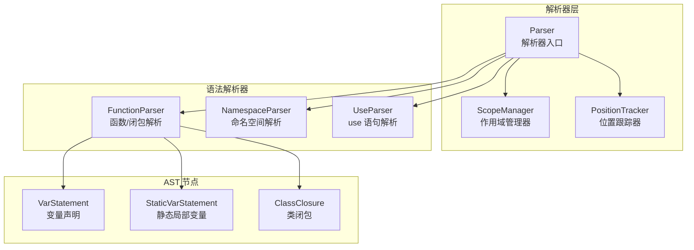
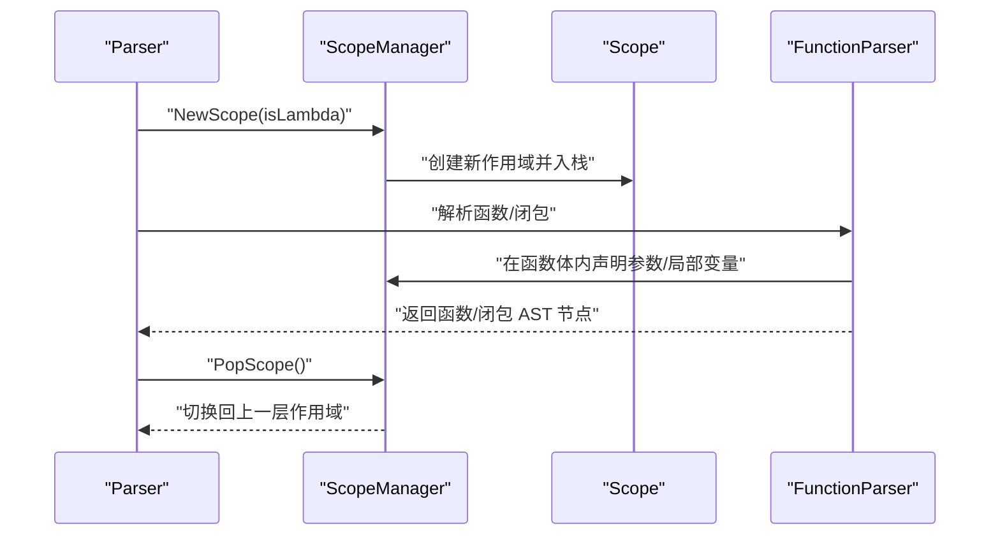
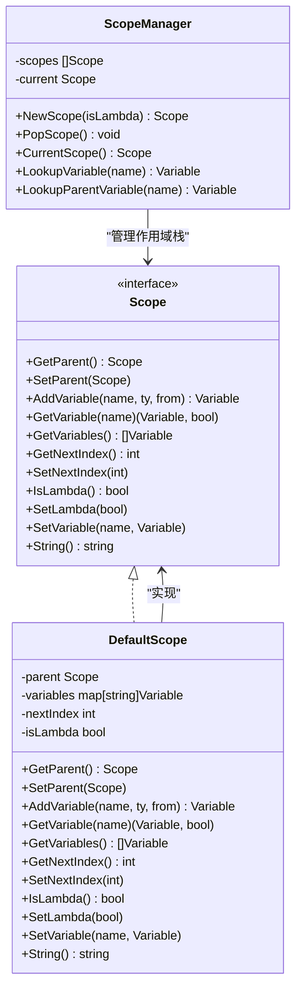
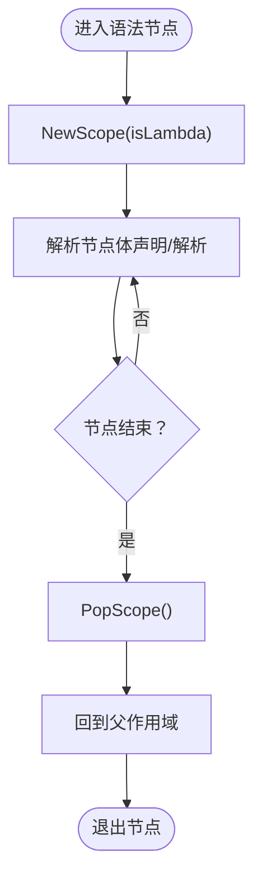
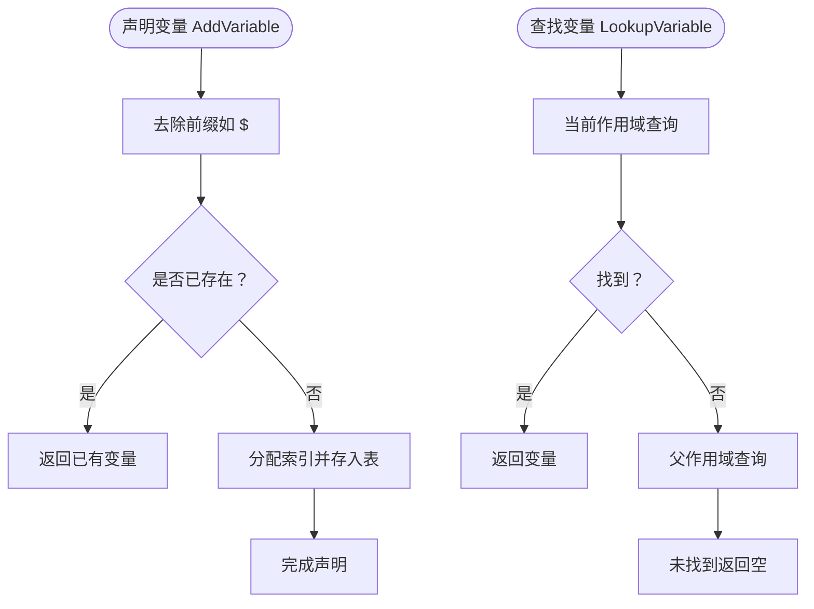
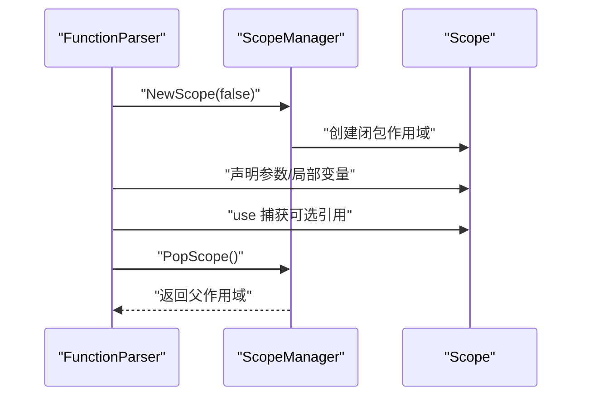
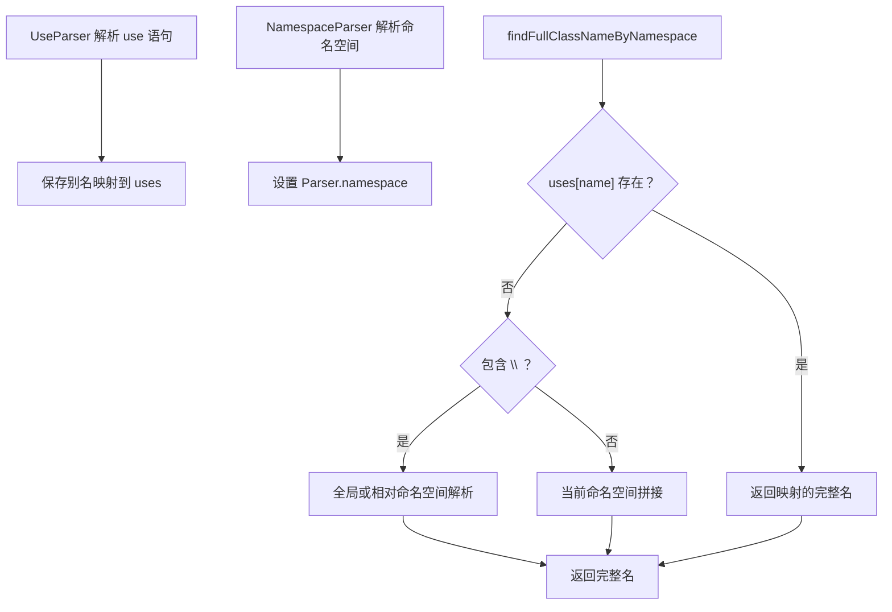
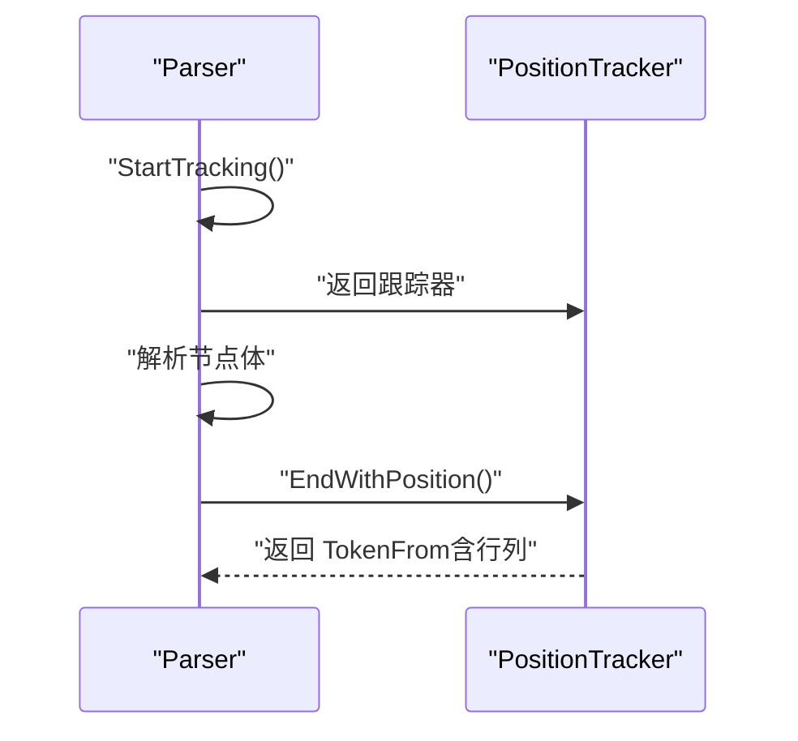
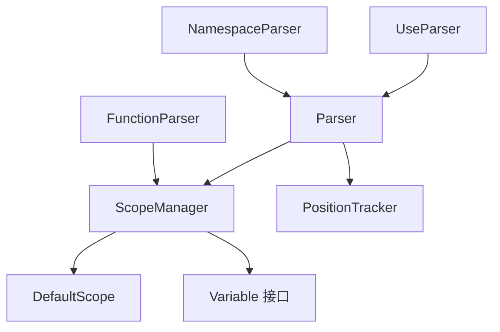

# 作用域管理器

<cite>
**本文档引用的文件**
- [scope_manager.go](file://parser/scope_manager.go)
- [position_tracker.go](file://parser/position_tracker.go)
- [parser.go](file://parser/parser.go)
- [function_parser.go](file://parser/function_parser.go)
- [use_parser.go](file://parser/use_parser.go)
- [namespace_parser.go](file://parser/namespace_parser.go)
- [closure.go](file://node/closure.go)
- [var.go](file://node/var.go)
</cite>

## 目录
1. [简介](#简介)
2. [项目结构](#项目结构)
3. [核心组件](#核心组件)
4. [架构总览](#架构总览)
5. [详细组件分析](#详细组件分析)
6. [依赖分析](#依赖分析)
7. [性能考虑](#性能考虑)
8. [故障排查指南](#故障排查指南)
9. [结论](#结论)
10. [附录](#附录)

## 简介
本文件面向编译器开发者，系统化阐述作用域管理器的设计与实现，覆盖作用域栈管理、变量声明跟踪、名称解析机制、命名空间与 use 语句处理、lambda/闭包作用域、位置跟踪与错误定位等主题。文档通过代码级图示与流程图，帮助读者快速掌握作用域管理器在解析阶段的关键职责与最佳实践。

## 项目结构
作用域管理器位于解析器模块内，与词法分析、AST 节点、类型系统协同工作。关键文件与职责如下：
- 解析器入口与上下文：parser.go
- 作用域管理器：scope_manager.go
- 位置跟踪器：position_tracker.go
- 函数/闭包解析：function_parser.go
- 命名空间与 use 语句解析：namespace_parser.go、use_parser.go
- 闭包与变量节点：closure.go、var.go

图表来源
- [parser.go:36-50](file://parser/parser.go#L36-L50)
- [scope_manager.go:64-78](file://parser/scope_manager.go#L64-L78)
- [position_tracker.go:7-14](file://parser/position_tracker.go#L7-L14)
- [function_parser.go:24-155](file://parser/function_parser.go#L24-L155)
- [namespace_parser.go:24-67](file://parser/namespace_parser.go#L24-L67)
- [use_parser.go:25-72](file://parser/use_parser.go#L25-L72)
- [closure.go:22-49](file://node/closure.go#L22-L49)
- [var.go:10-46](file://node/var.go#L10-L46)

章节来源
- [parser.go:36-50](file://parser/parser.go#L36-L50)
- [scope_manager.go:64-78](file://parser/scope_manager.go#L64-L78)

## 核心组件
- 作用域接口与默认实现：Scope、DefaultScope
- 作用域管理器：ScopeManager，维护作用域栈与当前作用域
- 变量信息：Variable（含名称、索引、参数/全局标记）
- 位置跟踪器：PositionTracker，用于从词法单元范围生成精确的 From 位置信息
- 解析器集成：Parser 持有 ScopeManager 与 PositionTracker，并在解析过程中驱动作用域创建/弹出

章节来源
- [scope_manager.go:10-42](file://parser/scope_manager.go#L10-L42)
- [scope_manager.go:44-68](file://parser/scope_manager.go#L44-L68)
- [scope_manager.go:103-113](file://parser/scope_manager.go#L103-L113)
- [position_tracker.go:7-14](file://parser/position_tracker.go#L7-L14)
- [parser.go:17-34](file://parser/parser.go#L17-L34)

## 架构总览
作用域管理器与解析器的交互遵循“进入作用域—声明变量—解析表达式—弹出作用域”的模式。解析器在遇到函数、闭包、命名空间等语法节点时，创建新的作用域；在离开节点时弹出作用域，保证变量可见性与生命周期的正确性。

图表来源
- [parser.go:36-50](file://parser/parser.go#L36-L50)
- [scope_manager.go:80-95](file://parser/scope_manager.go#L80-L95)
- [function_parser.go:119-139](file://parser/function_parser.go#L119-L139)

## 详细组件分析

### 作用域接口与默认实现
- 接口职责：提供父作用域访问、变量增删改查、索引管理、lambda 标记与字符串化等能力
- 默认实现：持有父作用域指针、变量映射表、下一个变量索引、lambda 标识
- 工厂函数：支持自定义作用域实现（通过 SetGlobalScopeFactory 注入）

图表来源
- [scope_manager.go:18-42](file://parser/scope_manager.go#L18-L42)
- [scope_manager.go:44-50](file://parser/scope_manager.go#L44-L50)
- [scope_manager.go:64-68](file://parser/scope_manager.go#L64-L68)

章节来源
- [scope_manager.go:18-68](file://parser/scope_manager.go#L18-L68)

### 作用域栈管理与生命周期
- 创建：NewScope(isLambda) 基于当前作用域创建子作用域并入栈
- 进入：解析函数/闭包/命名空间等节点时创建新作用域
- 退出：PopScope() 弹出当前作用域，恢复父作用域
- 当前作用域：CurrentScope() 提供变量查询与声明入口

图表来源
- [scope_manager.go:80-95](file://parser/scope_manager.go#L80-L95)
- [function_parser.go:119-139](file://parser/function_parser.go#L119-L139)

章节来源
- [scope_manager.go:80-95](file://parser/scope_manager.go#L80-L95)
- [function_parser.go:119-139](file://parser/function_parser.go#L119-L139)

### 变量声明跟踪与名称解析
- 变量声明：AddVariable(name, ty, from) 自动去前缀、去重、分配索引
- 名称解析：LookupVariable(name) 从当前作用域向上游父作用域查找
- 变量集合：GetVariables() 按索引顺序返回当前作用域变量数组
- 参数/全局标记：Variable 结构体包含 IsParam、IsGlobal 标志位，便于运行时区分

图表来源
- [scope_manager.go:103-113](file://parser/scope_manager.go#L103-L113)
- [scope_manager.go:115-135](file://parser/scope_manager.go#L115-L135)
- [scope_manager.go:137-144](file://parser/scope_manager.go#L137-L144)

章节来源
- [scope_manager.go:103-144](file://parser/scope_manager.go#L103-L144)

### 闭包与 lambda 作用域
- 闭包解析：FunctionParser 在解析闭包时创建新作用域，解析参数与 use 捕获列表
- 引用捕获：use (&$var) 将变量替换为引用包装，形成闭包对外部变量的引用映射
- 作用域弹出：解析完成后弹出闭包作用域，保留必要的变量索引映射

图表来源
- [function_parser.go:32-80](file://parser/function_parser.go#L32-L80)
- [function_parser.go:174-213](file://parser/function_parser.go#L174-L213)
- [scope_manager.go:80-95](file://parser/scope_manager.go#L80-L95)

章节来源
- [function_parser.go:32-80](file://parser/function_parser.go#L32-L80)
- [function_parser.go:174-213](file://parser/function_parser.go#L174-L213)

### 命名空间与 use 语句解析
- 命名空间：NamespaceParser 记录当前命名空间，影响类名/函数名解析
- use 语句：UseParser 解析 use 别名映射，Parser 维护 uses 映射表，用于类名/函数名解析
- 解析策略：findFullClassNameByNamespace/findFullFunNameByNamespace 依据 use 别名与当前命名空间推导完整名称

图表来源
- [use_parser.go:25-72](file://parser/use_parser.go#L25-L72)
- [namespace_parser.go:24-67](file://parser/namespace_parser.go#L24-L67)
- [parser.go:478-568](file://parser/parser.go#L478-L568)

章节来源
- [use_parser.go:25-72](file://parser/use_parser.go#L25-L72)
- [namespace_parser.go:24-67](file://parser/namespace_parser.go#L24-L67)
- [parser.go:478-568](file://parser/parser.go#L478-L568)

### 位置跟踪器与错误定位
- 功能：StartTracking/StartTrackingAt 开启跟踪；End/EndWithPosition 结束并生成 From 位置信息
- 精确性：EndWithPosition 可基于起止 token 精确设置行列位置，提升错误提示可读性
- 使用：解析器在各节点构造 PositionTracker，结束时生成 From 用于错误与调试信息

图表来源
- [position_tracker.go:16-72](file://parser/position_tracker.go#L16-L72)
- [parser.go:382-424](file://parser/parser.go#L382-L424)

章节来源
- [position_tracker.go:16-179](file://parser/position_tracker.go#L16-L179)
- [parser.go:382-424](file://parser/parser.go#L382-L424)

### 作用域规则与变量类型
- 局部变量：在函数/闭包作用域内声明，生命周期随作用域
- 全局变量：IsGlobal 标记，通常在全局作用域声明
- 静态局部变量：通过 StaticVarStatement 声明，生命周期跨调用但作用域仍为当前函数
- 参数：IsParam 标记，由函数参数解析阶段注入

章节来源
- [scope_manager.go:11-16](file://parser/scope_manager.go#L11-L16)
- [var.go:26-46](file://node/var.go#L26-L46)
- [function_parser.go:158-161](file://parser/function_parser.go#L158-L161)

## 依赖分析
- ScopeManager 依赖 DefaultScope 实现与 Variable 接口
- Parser 持有 ScopeManager 与 PositionTracker，并在解析过程中调用作用域操作
- FunctionParser 在函数/闭包解析中直接操作作用域栈
- UseParser/NamespaceParser 影响类名/函数名解析，间接影响作用域内符号解析

图表来源
- [scope_manager.go:64-78](file://parser/scope_manager.go#L64-L78)
- [parser.go:36-50](file://parser/parser.go#L36-L50)
- [function_parser.go:24-155](file://parser/function_parser.go#L24-L155)
- [use_parser.go:25-72](file://parser/use_parser.go#L25-L72)
- [namespace_parser.go:24-67](file://parser/namespace_parser.go#L24-L67)

章节来源
- [scope_manager.go:64-78](file://parser/scope_manager.go#L64-L78)
- [parser.go:36-50](file://parser/parser.go#L36-L50)

## 性能考虑
- 作用域栈操作：NewScope/PopScope 为 O(1)，建议在解析器中尽量减少不必要的作用域嵌套
- 变量查询：LookupVariable 逐层向上遍历父作用域，建议控制作用域深度，避免深层嵌套导致的线性查找开销
- 变量表：DefaultScope 使用 map[string]Variable，查找平均 O(1)，注意键名规范化（去前缀、统一大小写）以减少冲突
- 位置跟踪：EndWithPosition 需要访问 tokens 数组，建议在高频路径中缓存必要位置信息，避免重复计算

## 故障排查指南
- 变量未定义：检查作用域创建/弹出时机，确认变量声明在使用前的作用域内
- 命名空间解析失败：核对 uses 映射与当前命名空间设置，验证 findFullClassNameByNamespace 的返回值
- 闭包引用问题：确认 use 捕获列表与引用捕获（&）的处理逻辑，确保变量索引映射正确
- 错误定位不准确：使用 EndWithPosition 生成精确行列位置，结合 Parser.ShowControl 输出堆栈信息

章节来源
- [parser.go:251-298](file://parser/parser.go#L251-L298)
- [position_tracker.go:46-112](file://parser/position_tracker.go#L46-L112)

## 结论
作用域管理器通过简洁的接口与默认实现，为解析器提供了稳定的作用域栈管理能力。配合位置跟踪器与命名空间/闭包解析器，能够准确地追踪变量声明、解析名称并生成高质量的错误信息。遵循本文的最佳实践与性能建议，可在复杂语法场景下保持解析器的稳定性与可维护性。

## 附录
- 术语
  - 作用域：变量可见性与生命周期的区域
  - 符号解析：根据名称在作用域链中查找对应变量/函数/类的过程
  - From 位置：AST 节点携带的源码位置信息，用于错误与调试
- 相关实现参考
  - 作用域接口与默认实现：[scope_manager.go:18-68](file://parser/scope_manager.go#L18-L68)
  - 作用域栈操作：[scope_manager.go:80-95](file://parser/scope_manager.go#L80-L95)
  - 变量声明与查询：[scope_manager.go:103-144](file://parser/scope_manager.go#L103-L144)
  - 位置跟踪器：[position_tracker.go:16-179](file://parser/position_tracker.go#L16-L179)
  - 函数/闭包解析：[function_parser.go:24-155](file://parser/function_parser.go#L24-L155)
  - 命名空间与 use 解析：[namespace_parser.go:24-67](file://parser/namespace_parser.go#L24-L67)、[use_parser.go:25-72](file://parser/use_parser.go#L25-L72)
  - 闭包与变量节点：[closure.go:22-49](file://node/closure.go#L22-L49)、[var.go:10-46](file://node/var.go#L10-L46)