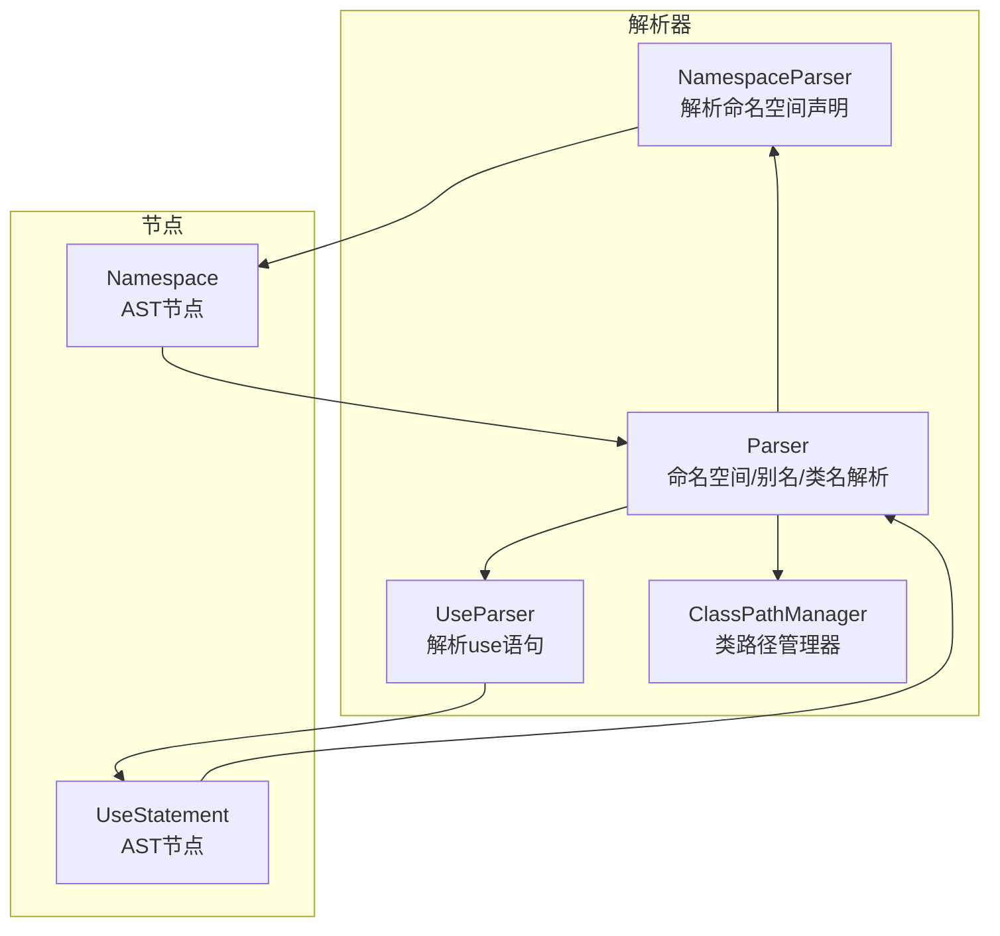
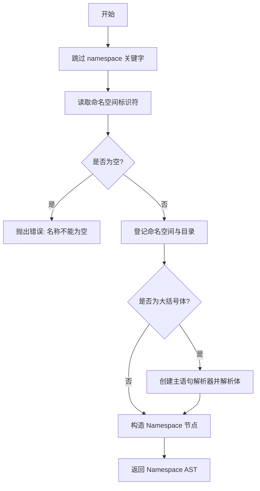
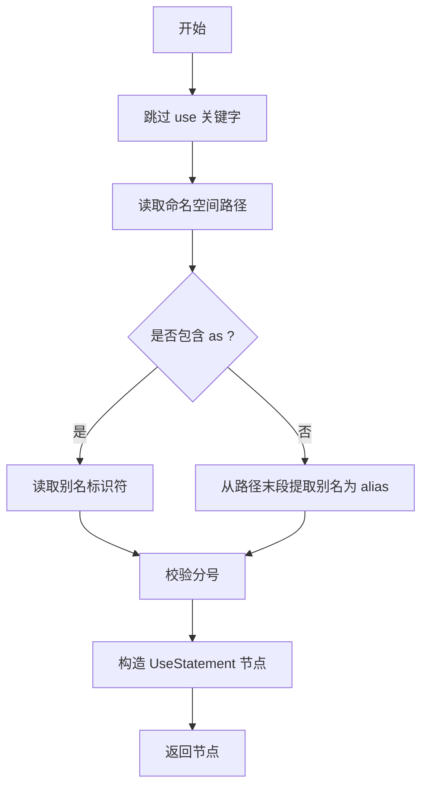
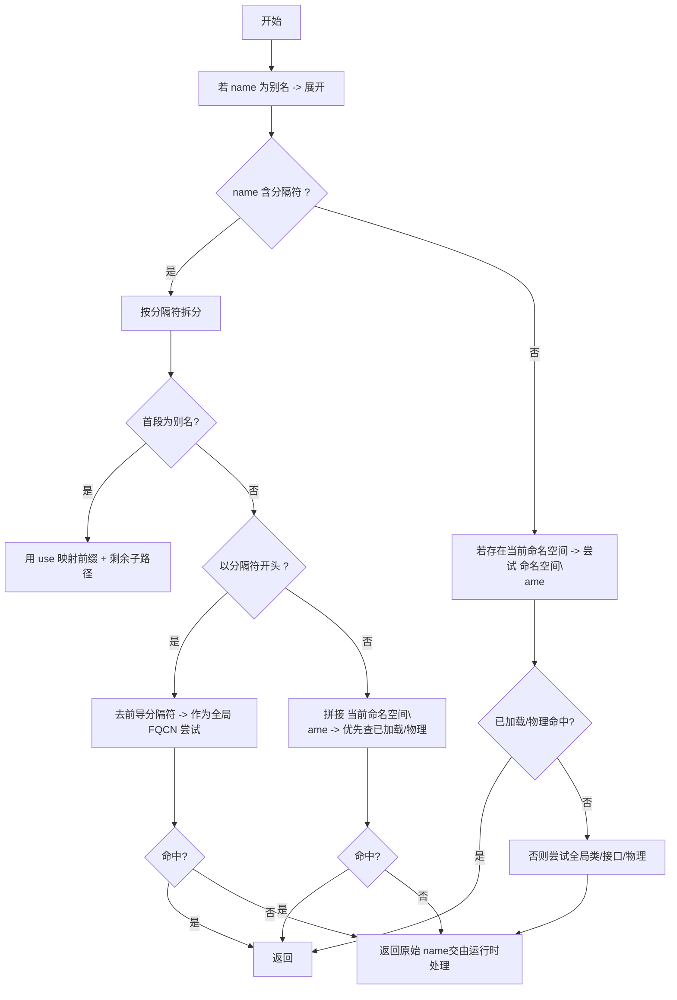
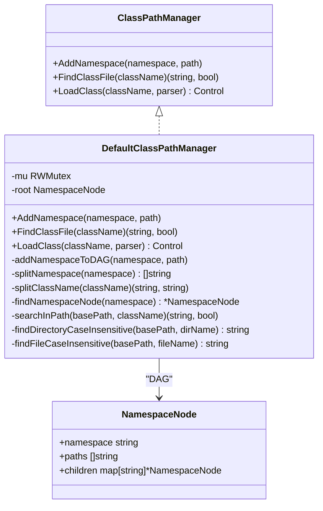
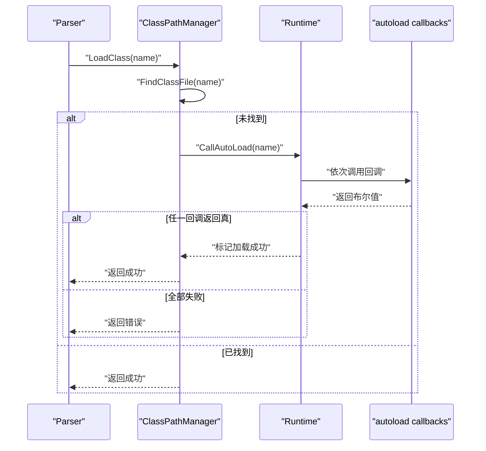
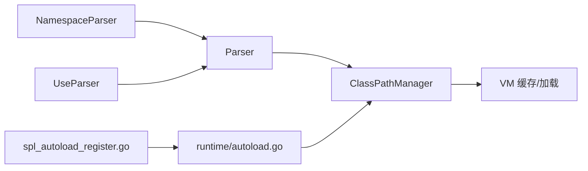

# 命名空间解析器

<cite>
**本文引用的文件**
- [parser/namespace_parser.go](file://parser/namespace_parser.go)
- [node/namespace.go](file://node/namespace.go)
- [parser/use_parser.go](file://parser/use_parser.go)
- [node/use.go](file://node/use.go)
- [parser/parser.go](file://parser/parser.go)
- [parser/class_path_manager.go](file://parser/class_path_manager.go)
- [runtime/autoload.go](file://runtime/autoload.go)
- [std/php/core/spl_autoload_register.go](file://std/php/core/spl_autoload_register.go)
- [parser/scope_manager.go](file://parser/scope_manager.go)
</cite>

## 目录
1. [简介](#简介)
2. [项目结构](#项目结构)
3. [核心组件](#核心组件)
4. [架构总览](#架构总览)
5. [详细组件分析](#详细组件分析)
6. [依赖分析](#依赖分析)
7. [性能考量](#性能考量)
8. [故障排查指南](#故障排查指南)
9. [结论](#结论)
10. [附录](#附录)

## 简介
本文件面向编译器与语言实现开发者，系统化阐述命名空间解析器的设计与实现细节，覆盖以下关键能力：
- 命名空间声明解析与作用域传播
- use 语句解析与别名映射
- 类名解析算法（含别名展开、FQCN、相对类名、混合命名空间）
- 类路径管理器（类文件查找、自动加载、命名空间映射表）
- 错误处理、冲突检测与性能优化策略
- 扩展接口与最佳实践

## 项目结构
命名空间解析相关代码主要分布在解析器层与节点层：
- 解析器层负责词法/语法层面的解析与命名空间/别名状态维护
- 节点层负责命名空间与 use 语句的 AST 表达与运行时行为
- 类路径管理器负责命名空间到文件系统的映射与类加载



图表来源
- [parser/namespace_parser.go:1-68](file://parser/namespace_parser.go#L1-L68)
- [parser/use_parser.go:1-73](file://parser/use_parser.go#L1-L73)
- [parser/parser.go:472-595](file://parser/parser.go#L472-L595)
- [parser/class_path_manager.go:13-428](file://parser/class_path_manager.go#L13-L428)
- [node/namespace.go:1-105](file://node/namespace.go#L1-L105)
- [node/use.go:1-38](file://node/use.go#L1-L38)

章节来源
- [parser/namespace_parser.go:1-68](file://parser/namespace_parser.go#L1-L68)
- [parser/use_parser.go:1-73](file://parser/use_parser.go#L1-L73)
- [parser/parser.go:472-595](file://parser/parser.go#L472-L595)
- [parser/class_path_manager.go:13-428](file://parser/class_path_manager.go#L13-L428)
- [node/namespace.go:1-105](file://node/namespace.go#L1-L105)
- [node/use.go:1-38](file://node/use.go#L1-L38)

## 核心组件
- 命名空间解析器：解析 namespace 声明，建立命名空间作用域，扫描并登记命名空间到文件夹映射
- use 语句解析器：解析 use 导入与别名，生成 AST 节点
- Parser：维护当前命名空间、use 别名映射、类名解析算法
- ClassPathManager：命名空间到物理路径的映射、类文件查找、自动加载回调
- 节点模型：Namespace、UseStatement，承载运行时行为

章节来源
- [parser/namespace_parser.go:11-21](file://parser/namespace_parser.go#L11-L21)
- [parser/use_parser.go:12-22](file://parser/use_parser.go#L12-L22)
- [parser/parser.go:478-568](file://parser/parser.go#L478-L568)
- [parser/class_path_manager.go:13-45](file://parser/class_path_manager.go#L13-L45)
- [node/namespace.go:5-19](file://node/namespace.go#L5-L19)
- [node/use.go:5-19](file://node/use.go#L5-L19)

## 架构总览
命名空间解析贯穿“声明期”和“运行期”：
- 声明期：解析命名空间与 use，登记命名空间路径，建立别名映射
- 运行期：类名解析时依据别名、当前命名空间、FQCN 规则与类路径管理器进行解析与加载

```mermaid
sequenceDiagram
participant L as "Lexer"
participant NP as "NamespaceParser"
participant UP as "UseParser"
participant P as "Parser"
participant CM as "ClassPathManager"
participant VM as "VM"
L->>NP : "namespace Foo\\Bar { ... }"
NP->>P : "登记命名空间并扫描路径"
L->>UP : "use A\\B as C;"
UP->>P : "登记别名映射"
Note over P : "findFullClassNameByNamespace(name)"
P->>CM : "FindClassFile(尝试名)"
CM-->>P : "命中/未命中"
P->>VM : "LoadClass(未命中时触发自动加载)"
VM-->>P : "加载完成/错误"
```

图表来源
- [parser/namespace_parser.go:24-66](file://parser/namespace_parser.go#L24-L66)
- [parser/use_parser.go:25-71](file://parser/use_parser.go#L25-L71)
- [parser/parser.go:478-568](file://parser/parser.go#L478-L568)
- [parser/class_path_manager.go:327-382](file://parser/class_path_manager.go#L327-L382)

## 详细组件分析

### 命名空间声明解析
- 跳过关键字，读取命名空间标识符，校验非空
- 登记命名空间与源文件所在目录的关系
- 若大括号体存在，递归解析内部语句，构建 Namespace AST 节点
- 运行时执行时设置上下文命名空间并顺序执行语句



图表来源
- [parser/namespace_parser.go:24-66](file://parser/namespace_parser.go#L24-L66)
- [node/namespace.go:32-46](file://node/namespace.go#L32-L46)

章节来源
- [parser/namespace_parser.go:24-66](file://parser/namespace_parser.go#L24-L66)
- [node/namespace.go:32-46](file://node/namespace.go#L32-L46)

### use 语句处理与别名解析
- 解析 use 关键字后的命名空间路径
- 支持可选别名（as），否则从路径末段提取别名
- 校验分号结尾
- 生成 UseStatement AST 节点（运行时仅建立别名映射，不立即引入文件）



图表来源
- [parser/use_parser.go:25-71](file://parser/use_parser.go#L25-L71)
- [node/use.go:32-37](file://node/use.go#L32-L37)

章节来源
- [parser/use_parser.go:25-71](file://parser/use_parser.go#L25-L71)
- [node/use.go:5-29](file://node/use.go#L5-L29)

### 类名解析算法（别名、FQCN、相对类名）
Parser 维护当前命名空间与 use 别名映射，提供 findFullClassNameByNamespace 算法：
- 若 name 本身就是别名，直接展开为完整命名空间前缀
- 若 name 包含分隔符：
  - 尝试按“别名 + 子路径”展开
  - 若以分隔符开头，视为全局 FQCN，去前导分隔符后尝试解析
  - 否则视为当前命名空间下的相对类名，拼接后优先查已加载类/接口，再查物理文件
- 若 name 不含分隔符：
  - 若存在当前命名空间，先尝试“命名空间\name”，命中则返回
  - 否则尝试全局类/接口，再查物理文件
- 若仍不可得，返回原始 name，交由运行时自动加载或报错



图表来源
- [parser/parser.go:478-568](file://parser/parser.go#L478-L568)

章节来源
- [parser/parser.go:478-568](file://parser/parser.go#L478-L568)

### 类路径管理器（命名空间映射与类加载）
职责与数据结构：
- 接口：AddNamespace、FindClassFile、LoadClass
- 默认实现采用带路径数组的有向无环图（DAG）存储命名空间到物理路径的映射
- 并发安全：读写锁保护

工作流程：
- AddNamespace：校验路径存在性与绝对路径有效性，按命名空间片段逐级插入 DAG，并在叶子节点维护多路径集合
- FindClassFile：按命名空间拆分，定位 DAG 节点，遍历其路径集合尝试精确匹配与大小写不敏感匹配
- LoadClass：先查缓存，再尝试自动加载回调，最后加载文件并确保相关接口/父接口已加载



图表来源
- [parser/class_path_manager.go:13-45](file://parser/class_path_manager.go#L13-L45)
- [parser/class_path_manager.go:30-118](file://parser/class_path_manager.go#L30-L118)
- [parser/class_path_manager.go:147-183](file://parser/class_path_manager.go#L147-L183)
- [parser/class_path_manager.go:327-382](file://parser/class_path_manager.go#L327-L382)

章节来源
- [parser/class_path_manager.go:13-45](file://parser/class_path_manager.go#L13-L45)
- [parser/class_path_manager.go:30-118](file://parser/class_path_manager.go#L30-L118)
- [parser/class_path_manager.go:147-183](file://parser/class_path_manager.go#L147-L183)
- [parser/class_path_manager.go:327-382](file://parser/class_path_manager.go#L327-L382)

### 自动加载机制
- 运行时注册自动加载回调（支持函数与类静态方法）
- 加载失败时依次调用注册的回调，传入类名，若回调返回真值则视为加载成功
- 加载成功后缓存类文件路径，避免重复解析



图表来源
- [parser/class_path_manager.go:327-382](file://parser/class_path_manager.go#L327-L382)
- [parser/class_path_manager.go:403-427](file://parser/class_path_manager.go#L403-L427)
- [runtime/autoload.go:8-14](file://runtime/autoload.go#L8-L14)
- [std/php/core/spl_autoload_register.go:68-72](file://std/php/core/spl_autoload_register.go#L68-L72)

章节来源
- [parser/class_path_manager.go:327-382](file://parser/class_path_manager.go#L327-L382)
- [parser/class_path_manager.go:403-427](file://parser/class_path_manager.go#L403-L427)
- [runtime/autoload.go:8-14](file://runtime/autoload.go#L8-L14)
- [std/php/core/spl_autoload_register.go:68-72](file://std/php/core/spl_autoload_register.go#L68-L72)

### 运行时命名空间传播与作用域
- Namespace 节点在执行时设置上下文命名空间，随后顺序执行内部语句
- 作用域管理器提供变量作用域栈，支持 Lambda 作用域与变量索引分配

章节来源
- [node/namespace.go:32-46](file://node/namespace.go#L32-L46)
- [parser/scope_manager.go:64-100](file://parser/scope_manager.go#L64-L100)

## 依赖分析
- 命名空间解析器依赖 Parser 的命名空间状态与 use 映射
- use 解析器依赖 Token 与节点模型
- Parser 依赖 ClassPathManager 进行类文件查找与加载
- ClassPathManager 依赖 VM 缓存与自动加载回调
- 运行时通过 runtime/autoload.go 与标准库 spl_autoload_register.go 注册自动加载



图表来源
- [parser/namespace_parser.go:11-21](file://parser/namespace_parser.go#L11-L21)
- [parser/use_parser.go:12-22](file://parser/use_parser.go#L12-L22)
- [parser/parser.go:472-595](file://parser/parser.go#L472-L595)
- [parser/class_path_manager.go:327-382](file://parser/class_path_manager.go#L327-L382)
- [runtime/autoload.go:8-14](file://runtime/autoload.go#L8-L14)
- [std/php/core/spl_autoload_register.go:68-72](file://std/php/core/spl_autoload_register.go#L68-L72)

章节来源
- [parser/namespace_parser.go:11-21](file://parser/namespace_parser.go#L11-L21)
- [parser/use_parser.go:12-22](file://parser/use_parser.go#L12-L22)
- [parser/parser.go:472-595](file://parser/parser.go#L472-L595)
- [parser/class_path_manager.go:327-382](file://parser/class_path_manager.go#L327-L382)
- [runtime/autoload.go:8-14](file://runtime/autoload.go#L8-L14)
- [std/php/core/spl_autoload_register.go:68-72](file://std/php/core/spl_autoload_register.go#L68-L72)

## 性能考量
- 命名空间映射采用 DAG 结构，支持多路径与动态子目录发现，减少不必要的磁盘扫描
- 大小写不敏感匹配仅在精确匹配失败后启用，降低跨平台兼容成本
- 类路径缓存避免重复解析相同类文件
- 并发安全的读写锁保护命名空间路径表更新
- 自动加载回调按序尝试，首个成功即短路返回

章节来源
- [parser/class_path_manager.go:30-45](file://parser/class_path_manager.go#L30-L45)
- [parser/class_path_manager.go:147-183](file://parser/class_path_manager.go#L147-L183)
- [parser/class_path_manager.go:327-382](file://parser/class_path_manager.go#L327-L382)

## 故障排查指南
常见问题与定位要点：
- 命名空间名称为空：命名空间解析器会在解析时直接抛出错误
- use 语句语法错误：缺少分号、别名无效等会在解析阶段报错
- 类文件未找到：LoadClass 会尝试自动加载，若均失败则报错；可通过检查命名空间路径登记与类文件存在性定位
- 重复加载类：若同一类文件已被记录，再次加载会报重复加载错误
- 跨平台大小写：在大小写不敏感文件系统上，类路径管理器提供大小写不敏感匹配辅助

章节来源
- [parser/namespace_parser.go:31-33](file://parser/namespace_parser.go#L31-L33)
- [parser/use_parser.go:35-62](file://parser/use_parser.go#L35-L62)
- [parser/class_path_manager.go:52-79](file://parser/class_path_manager.go#L52-L79)
- [parser/class_path_manager.go:339-351](file://parser/class_path_manager.go#L339-L351)

## 结论
该命名空间解析器以清晰的解析器-节点模型为基础，结合类路径管理器与自动加载机制，实现了对 PHP 命名空间规范的完整支持。通过 DAG 映射、缓存与并发控制，兼顾正确性与性能。对于扩展与定制，建议遵循现有接口契约，确保别名映射、路径登记与自动加载回调的一致性。

## 附录

### PHP 命名空间解析规则（实现对应）
- 绝对命名空间（FQCN）：以分隔符开头，去前导分隔符后直接作为全局类名解析
- 相对命名空间：在当前命名空间下拼接
- 混合命名空间：use 别名前缀 + 子路径展开
- 未命中时：保留原始名称交由运行时自动加载或报错

章节来源
- [parser/parser.go:478-568](file://parser/parser.go#L478-L568)