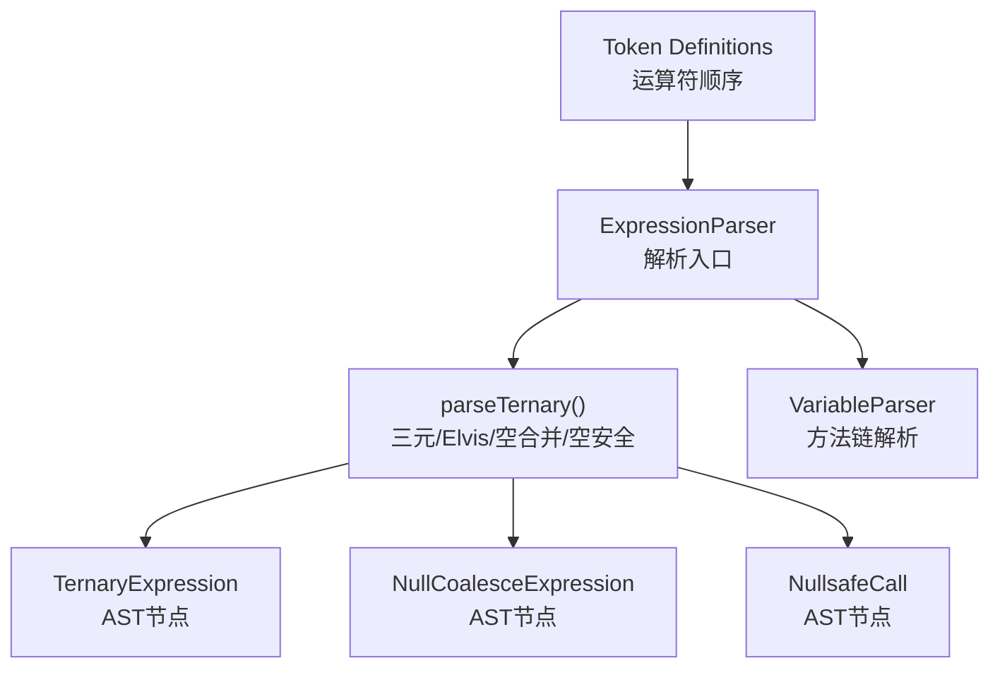
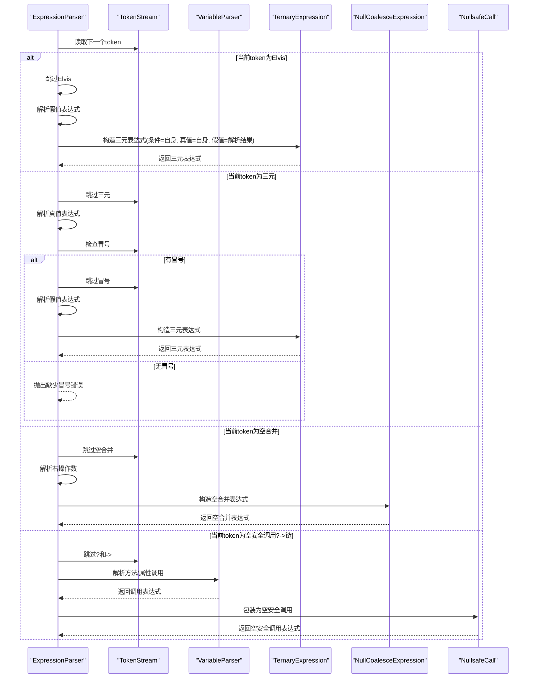
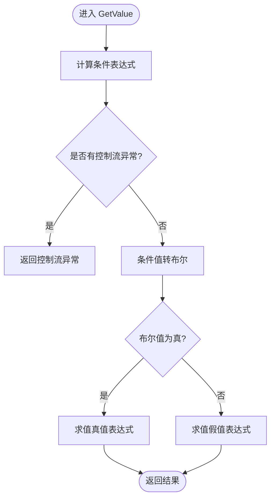
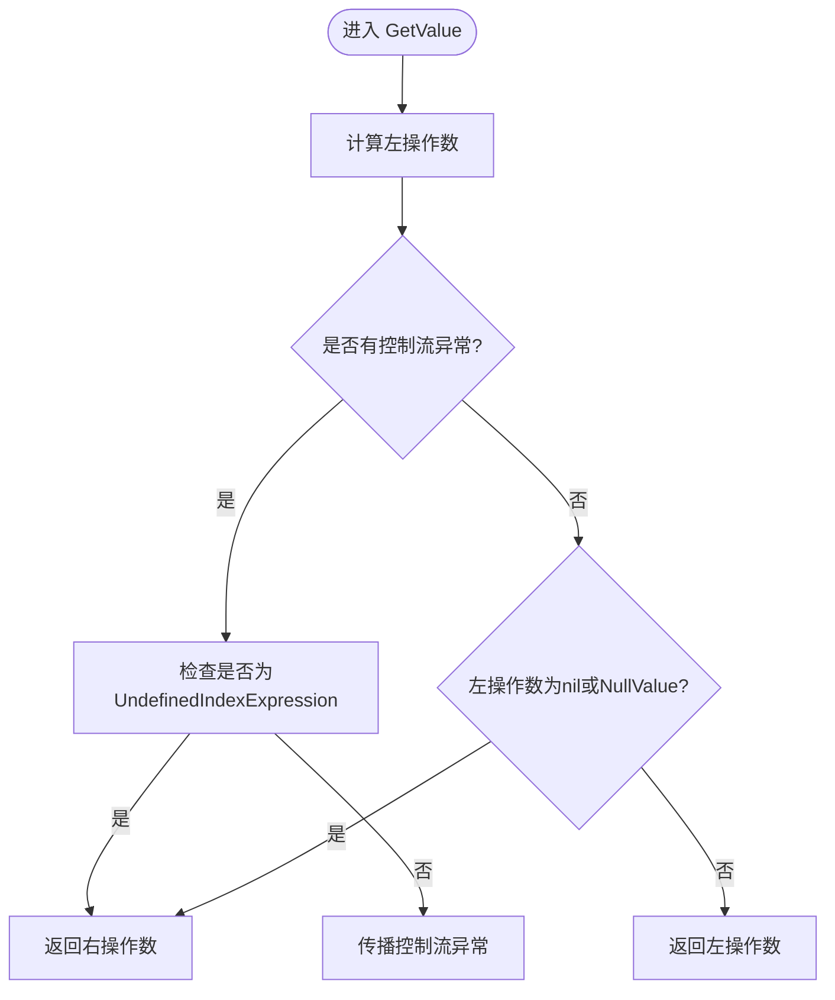
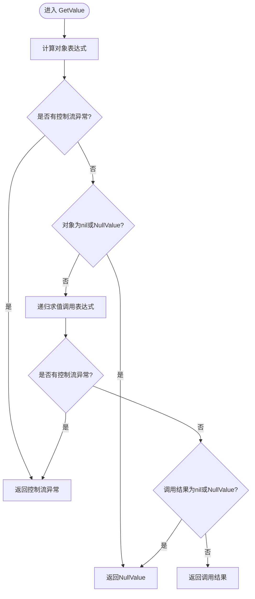
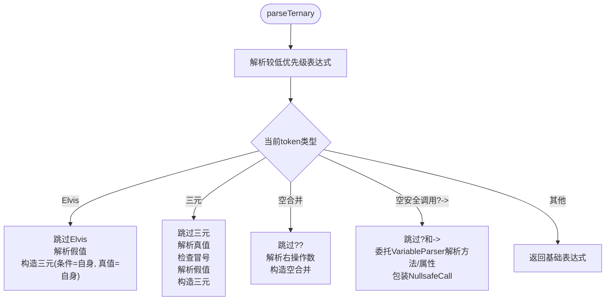
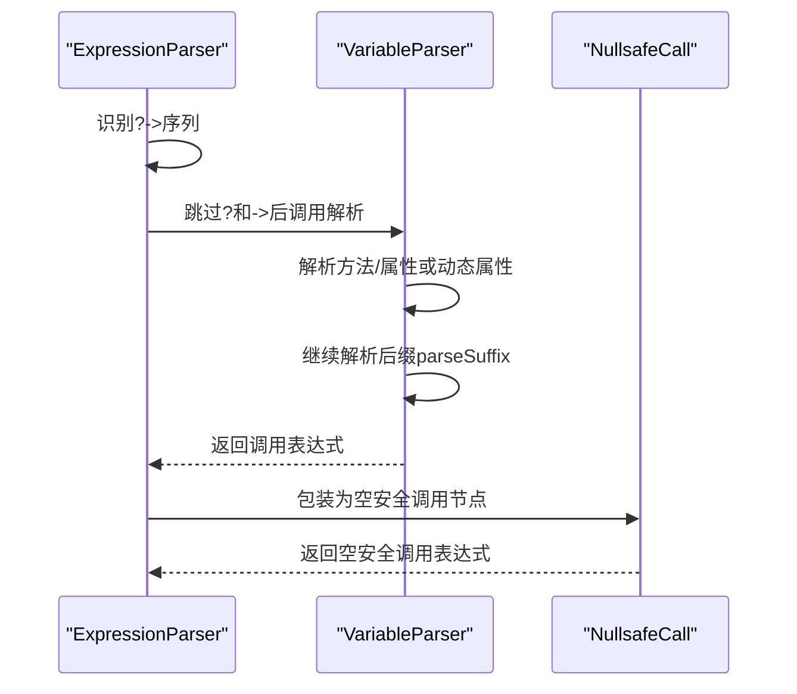
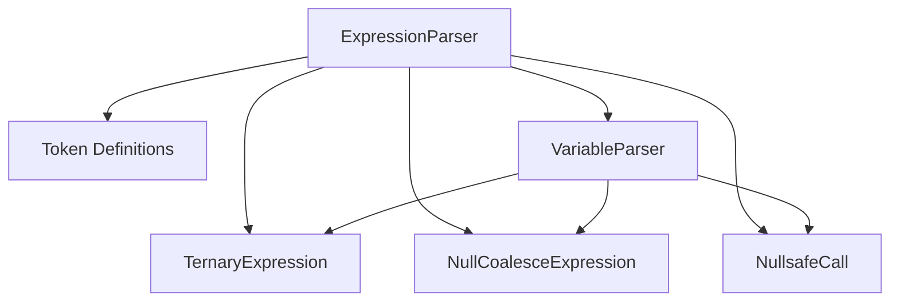

# 三元表达式解析

<cite>
**本文档引用的文件**
- [node/ternary.go](file://node/ternary.go)
- [parser/expression_parser.go](file://parser/expression_parser.go)
- [node/null_coalesce.go](file://node/null_coalesce.go)
- [node/call_nullsafe.go](file://node/call_nullsafe.go)
- [parser/variable_parser.go](file://parser/variable_parser.go)
- [token/token.go](file://token/token.go)
- [tests/php/ternary_and_precedence_test.php](file://tests/php/ternary_and_precedence_test.php)
- [tests/basic/nullsafe_call.zy](file://tests/basic/nullsafe_call.zy)
- [docs/operators.md](file://docs/operators.md)
</cite>

## 目录
1. [简介](#简介)
2. [项目结构](#项目结构)
3. [核心组件](#核心组件)
4. [架构总览](#架构总览)
5. [详细组件分析](#详细组件分析)
6. [依赖关系分析](#依赖关系分析)
7. [性能考虑](#性能考虑)
8. [故障排除指南](#故障排除指南)
9. [结论](#结论)

## 简介
本文件系统化阐述三元表达式解析器的设计与实现，覆盖标准三元运算符(?:)、Elvis运算符(?:)简写形式、空合并运算符(??)以及空安全调用操作符(?->)的解析机制。重点说明：
- 三元表达式的AST节点构建与求值流程
- 与变量解析器的协作机制
- PHP语法中的特殊语义：优先级处理、类型推断与布尔转换
- 方法链式调用在空安全调用中的处理

## 项目结构
围绕三元表达式解析的关键模块分布如下：
- 解析器层：表达式解析器负责运算符优先级与三元/Elvis/空合并/空安全调用的识别与分派
- 节点层：三元表达式、空合并表达式、空安全调用节点提供求值逻辑
- 词法层：运算符定义与顺序控制（如Elvis必须在三元与冒号之前）
- 测试层：验证优先级、空安全链式调用等行为

图表来源
- [parser/expression_parser.go:99-198](file://parser/expression_parser.go#L99-L198)
- [node/ternary.go:7-23](file://node/ternary.go#L7-L23)
- [node/null_coalesce.go:7-21](file://node/null_coalesce.go#L7-L21)
- [node/call_nullsafe.go:7-22](file://node/call_nullsafe.go#L7-L22)
- [parser/variable_parser.go:105-177](file://parser/variable_parser.go#L105-L177)
- [token/token.go:134-152](file://token/token.go#L134-L152)

章节来源
- [parser/expression_parser.go:99-198](file://parser/expression_parser.go#L99-L198)
- [token/token.go:134-152](file://token/token.go#L134-L152)

## 核心组件
- 三元表达式节点：封装条件、真值、假值三个子表达式，并在运行时进行布尔转换与分支求值
- 空合并表达式节点：短路逻辑，左操作数为nil或null时返回右操作数
- 空安全调用节点：对象为null时短路返回null，否则执行调用；支持链式调用
- 表达式解析器：根据运算符优先级与词法顺序，识别三元、Elvis、空合并与空安全调用
- 变量解析器：在空安全调用场景下解析方法/属性调用与后缀操作，支持链式调用

章节来源
- [node/ternary.go:7-72](file://node/ternary.go#L7-L72)
- [node/null_coalesce.go:7-54](file://node/null_coalesce.go#L7-L54)
- [node/call_nullsafe.go:7-67](file://node/call_nullsafe.go#L7-L67)
- [parser/expression_parser.go:99-198](file://parser/expression_parser.go#L99-L198)
- [parser/variable_parser.go:105-177](file://parser/variable_parser.go#L105-L177)

## 架构总览
三元表达式解析的整体流程如下：
- 表达式解析器从较低优先级向上推进，遇到三元相关运算符时进入parseTernary
- parseTernary根据当前token类型区分Elvis、三元、空合并三种情形
- Elvis与三元均构造TernaryExpression；空合并构造NullCoalesceExpression
- 空安全调用?->由表达式解析器识别，随后委托给变量解析器完成方法/属性解析与链式调用
- AST节点在GetValue阶段执行求值，遵循PHP的布尔转换规则与短路策略

图表来源
- [parser/expression_parser.go:99-198](file://parser/expression_parser.go#L99-L198)
- [parser/variable_parser.go:129-177](file://parser/variable_parser.go#L129-L177)
- [node/ternary.go:15-23](file://node/ternary.go#L15-L23)
- [node/null_coalesce.go:14-21](file://node/null_coalesce.go#L14-L21)
- [node/call_nullsafe.go:15-22](file://node/call_nullsafe.go#L15-L22)

## 详细组件分析

### 三元表达式节点（TernaryExpression）
- 数据结构：包含条件、真值、假值三个子表达式
- 求值流程：
  - 计算条件表达式的值
  - 将条件值转换为布尔（整/浮非零、字符串非空、数组非空、null为false；其他类型尝试AsBool）
  - 根据布尔结果选择真值或假值表达式求值并返回
- 适用场景：标准三元(?:)与Elvis(?:)简写形式

图表来源
- [node/ternary.go:25-67](file://node/ternary.go#L25-L67)

章节来源
- [node/ternary.go:7-72](file://node/ternary.go#L7-L72)

### 空合并表达式（NullCoalesceExpression）
- 数据结构：左、右两个操作数
- 求值流程：
  - 计算左操作数
  - 若为nil或NullValue，返回右操作数
  - 否则返回左操作数
- 适用场景：??运算符

图表来源
- [node/null_coalesce.go:23-49](file://node/null_coalesce.go#L23-L49)

章节来源
- [node/null_coalesce.go:7-54](file://node/null_coalesce.go#L7-L54)

### 空安全调用（NullsafeCall）
- 数据结构：对象表达式与调用表达式（方法/属性）
- 求值流程：
  - 计算对象值
  - 若对象为nil或NullValue，直接返回null
  - 否则递归求值调用表达式，若结果为null则返回null，否则返回结果
- 适用场景：?->链式调用，支持嵌套空安全调用

图表来源
- [node/call_nullsafe.go:24-62](file://node/call_nullsafe.go#L24-L62)

章节来源
- [node/call_nullsafe.go:7-67](file://node/call_nullsafe.go#L7-L67)

### 表达式解析器与三元/Elvis/空合并/空安全调用
- parseTernary入口：
  - 先解析较低优先级表达式（如拼接、逻辑或等）
  - 根据当前token类型分派：
    - Elvis：$a ?: $b 等价于 $a ? $a : $b
    - 三元：$a ? $b : $c
    - 空合并：$a ?? $b
    - 空安全调用：?->（需检查?与->紧邻且后续为对象操作符）
- 优先级与结合性：
  - PHP中&&优先级高于?:，解析器在处理&&时使用parseBitwiseOr而非parseAssignment，确保(a && b) ? c : d的正确性
- 词法顺序：
  - Elvis必须在三元与冒号之前定义，避免Elvis被误判为三元

图表来源
- [parser/expression_parser.go:99-198](file://parser/expression_parser.go#L99-L198)
- [token/token.go:134-152](file://token/token.go#L134-L152)

章节来源
- [parser/expression_parser.go:99-198](file://parser/expression_parser.go#L99-L198)
- [token/token.go:134-152](file://token/token.go#L134-L152)

### 变量解析器与方法链式调用
- 在空安全调用场景下，表达式解析器识别?->后，委托变量解析器：
  - 解析方法或属性（支持动态属性${expr}与变量属性）
  - 继续解析后缀（函数调用、数组访问、对象操作符等）
  - 支持链式调用：?->method()?->property
- 与表达式解析器协作：
  - 表达式解析器负责识别?->并跳过?与->，变量解析器负责解析具体调用细节

图表来源
- [parser/expression_parser.go:125-144](file://parser/expression_parser.go#L125-L144)
- [parser/variable_parser.go:129-177](file://parser/variable_parser.go#L129-L177)
- [node/call_nullsafe.go:15-22](file://node/call_nullsafe.go#L15-L22)

章节来源
- [parser/expression_parser.go:125-144](file://parser/expression_parser.go#L125-L144)
- [parser/variable_parser.go:105-177](file://parser/variable_parser.go#L105-L177)

### PHP语法特殊语义与类型推断
- 优先级：
  - &&优先级高于?:，解析器在处理&&时使用parseBitwiseOr，避免(a && b) ? c : d被错误解析为a && (b ? c : d)
  - 运算符优先级表中，??与?:位于最低优先级
- 类型推断与布尔转换：
  - 三元表达式在求值前将条件值转换为布尔：整/浮非零、字符串非空、数组非空、null为false；其他类型尝试AsBool
  - 空合并表达式在左操作数为nil或NullValue时短路返回右操作数
- 空安全调用：
  - 对象为null时短路返回null；调用结果为null也返回null
  - 支持链式调用，中间任一环节为null则整体为null

章节来源
- [parser/expression_parser.go:265-277](file://parser/expression_parser.go#L265-L277)
- [docs/operators.md:310-313](file://docs/operators.md#L310-L313)
- [node/ternary.go:33-59](file://node/ternary.go#L33-L59)
- [node/null_coalesce.go:23-49](file://node/null_coalesce.go#L23-L49)
- [node/call_nullsafe.go:24-62](file://node/call_nullsafe.go#L24-L62)

## 依赖关系分析
- 表达式解析器依赖词法定义顺序，确保Elvis优先于三元与冒号被识别
- 表达式解析器在识别?->后，委托变量解析器完成方法/属性解析与后缀处理
- AST节点在GetValue阶段执行求值，彼此独立，便于扩展与维护

图表来源
- [parser/expression_parser.go:99-198](file://parser/expression_parser.go#L99-L198)
- [parser/variable_parser.go:105-177](file://parser/variable_parser.go#L105-L177)
- [token/token.go:134-152](file://token/token.go#L134-L152)

章节来源
- [parser/expression_parser.go:99-198](file://parser/expression_parser.go#L99-L198)
- [parser/variable_parser.go:105-177](file://parser/variable_parser.go#L105-L177)
- [token/token.go:134-152](file://token/token.go#L134-L152)

## 性能考虑
- 三元表达式求值采用短路策略：条件求值后根据布尔值决定真值或假值表达式求值，避免不必要的计算
- 空合并与空安全调用在左/对象为null时直接短路，减少后续求值开销
- 变量解析器在空安全调用链中逐级求值，一旦出现null即终止，降低复杂度

## 故障排除指南
- 三元运算符缺少冒号：当识别到三元但未找到冒号时，解析器抛出错误
- Elvis简写形式误判：确保Elvis定义顺序在三元与冒号之前，避免被当作三元处理
- 空安全调用链解析失败：检查?->后是否跟随合法标识符或变量，以及是否正确解析动态属性
- 优先级问题：确认&&优先级高于?:，避免(a && b) ? c : d被错误解析

章节来源
- [parser/expression_parser.go:178-180](file://parser/expression_parser.go#L178-L180)
- [token/token.go:134-152](file://token/token.go#L134-L152)
- [tests/php/ternary_and_precedence_test.php:6-18](file://tests/php/ternary_and_precedence_test.php#L6-L18)

## 结论
本解析器完整实现了三元表达式、Elvis简写、空合并与空安全调用的解析与求值，遵循PHP语法的优先级与布尔转换规则，并通过表达式解析器与变量解析器的协作，支持复杂的链式调用场景。AST节点的职责清晰，便于扩展与维护，满足实际应用需求。