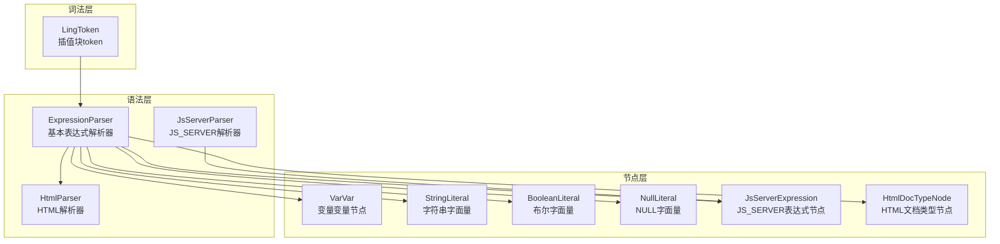
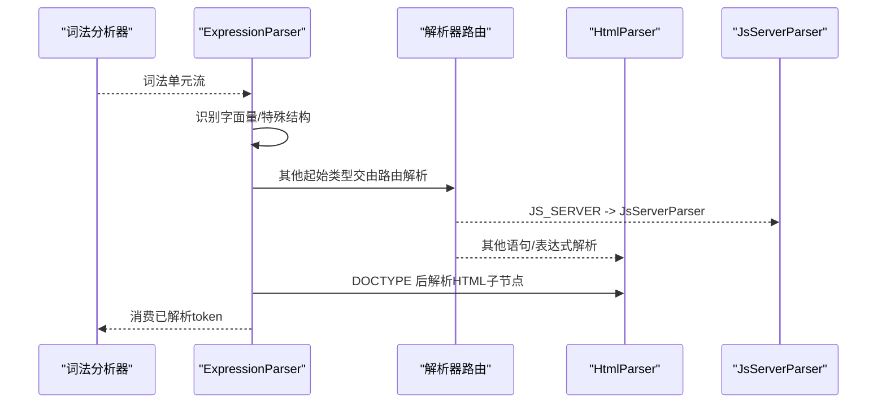
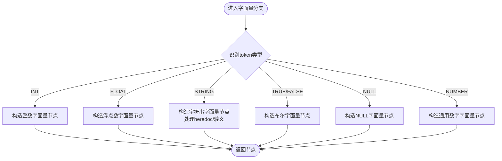
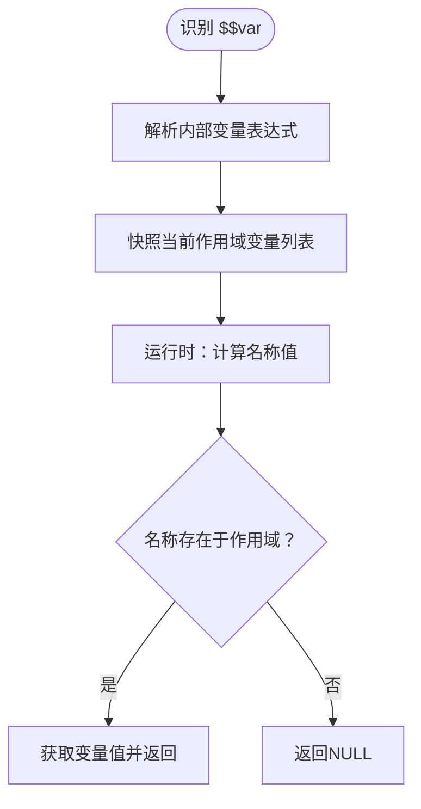
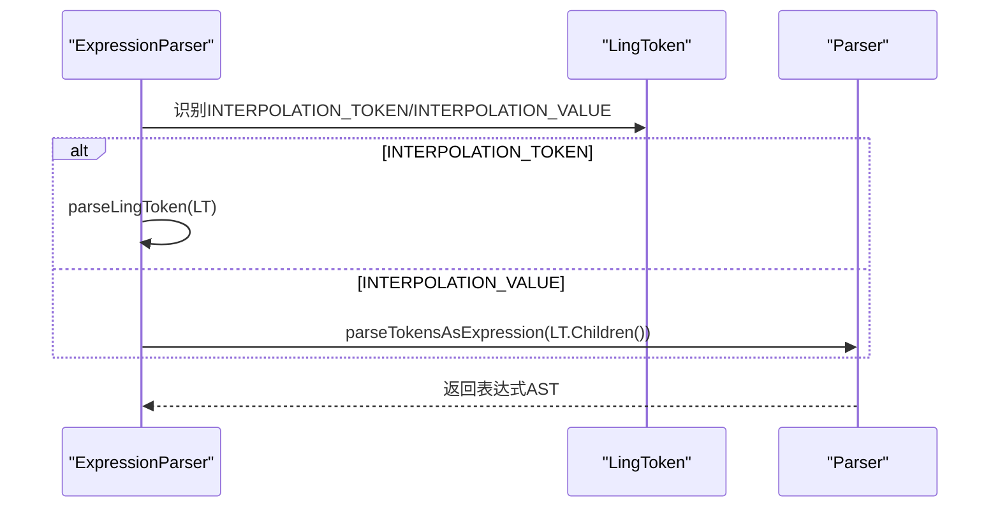
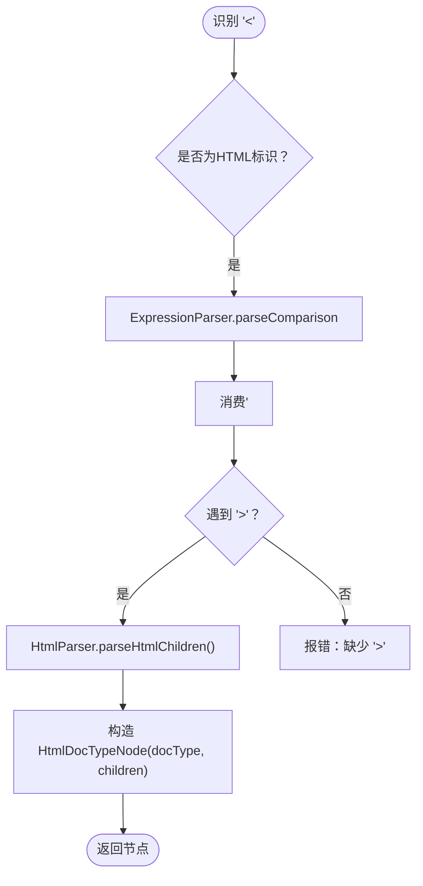
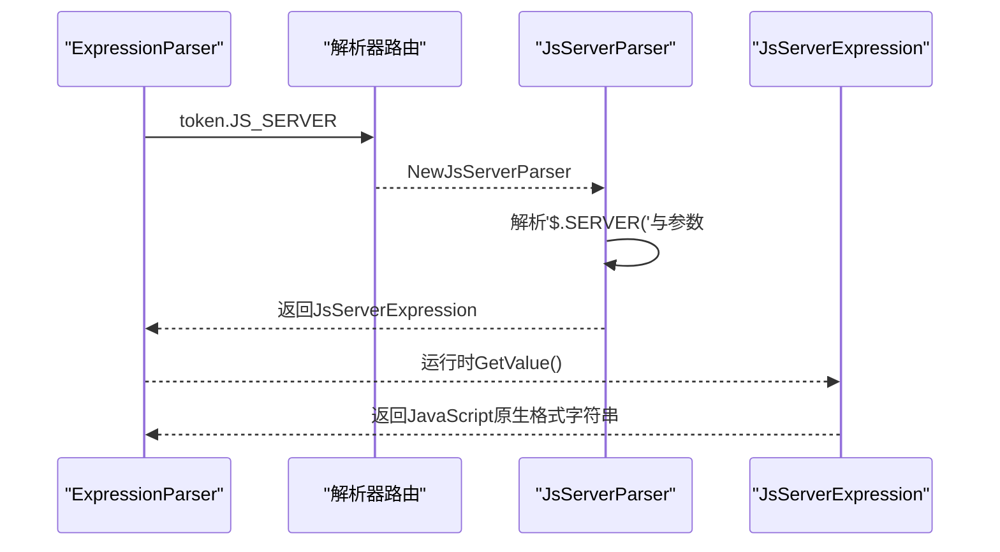
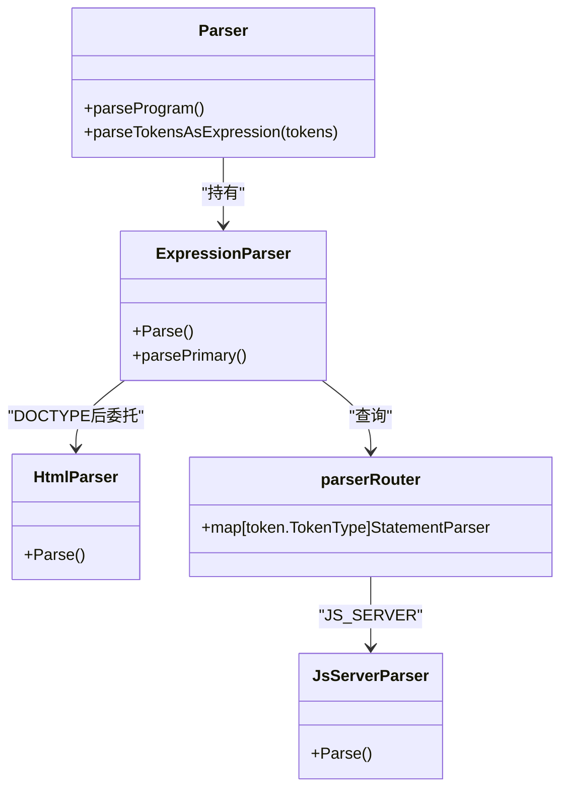
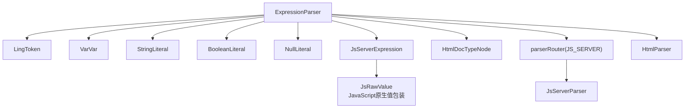

# 基本表达式解析

<cite>
**本文档引用的文件**
- [expression_parser.go](file://parser/expression_parser.go)
- [ling_token.go](file://lexer/ling_token.go)
- [var_var.go](file://node/var_var.go)
- [js_server.go](file://node/js_server.go)
- [js_server_parser.go](file://parser/js_server_parser.go)
- [string_literal.go](file://node/string_literal.go)
- [boolean_literal.go](file://node/boolean_literal.go)
- [null_literal.go](file://node/null_literal.go)
- [number_literal.go](file://node/number_literal.go)
- [html.go](file://node/html.go)
- [html_parser.go](file://parser/html_parser.go)
- [all_parser.go](file://parser/all_parser.go)
- [parser.go](file://parser/parser.go)
</cite>

## 目录
1. [简介](#简介)
2. [项目结构](#项目结构)
3. [核心组件](#核心组件)
4. [架构总览](#架构总览)
5. [详细组件分析](#详细组件分析)
6. [依赖分析](#依赖分析)
7. [性能考虑](#性能考虑)
8. [故障排查指南](#故障排查指南)
9. [结论](#结论)

## 简介
本文件聚焦“基本表达式解析”的技术细节，系统阐述表达式解析器如何处理各类字面量（整数、浮点数、字符串、布尔值、NULL）、变量变量（$$var）、插值字符串（LingToken）的解析流程；解释 DOCTYPE 标签的特殊处理（HTML 文档类型与后续内容解析）；说明 JS_SERVER 全局变量表达式的处理机制；并梳理基本表达式与各解析器之间的协作关系及语法解析中的作用与限制。

## 项目结构
围绕“基本表达式解析”，涉及的关键模块如下：
- 词法层：提供插值块 LingToken 的封装与访问接口
- 语法层：表达式解析器负责字面量、变量变量、插值字符串、DOCTYPE、JS_SERVER 等的解析
- 节点层：为每种字面量与特殊结构生成 AST 节点，并在运行时提供求值能力
- HTML 解析器：与表达式解析器配合，处理 DOCTYPE 后的 HTML 内容

**图表来源**
- [expression_parser.go:604-755](file://parser/expression_parser.go#L604-L755)
- [ling_token.go:5-63](file://lexer/ling_token.go#L5-L63)
- [js_server_parser.go:21-49](file://parser/js_server_parser.go#L21-L49)
- [js_server.go:9-63](file://node/js_server.go#L9-L63)
- [html.go:190-225](file://node/html.go#L190-L225)
- [html_parser.go:32-34](file://parser/html_parser.go#L32-L34)

**章节来源**
- [expression_parser.go:1-755](file://parser/expression_parser.go#L1-L755)
- [ling_token.go:1-63](file://lexer/ling_token.go#L1-L63)
- [html_parser.go:1-200](file://parser/html_parser.go#L1-L200)

## 核心组件
- 表达式解析器（ExpressionParser）：负责从词法单元流中识别并构造表达式 AST，涵盖字面量、变量变量、插值字符串、DOCTYPE、JS_SERVER 等
- 插值块（LingToken）：承载插值字符串的子 token 列表，供表达式解析器进一步解析
- 节点层（AST 节点）：为字面量与特殊结构提供运行时求值逻辑
- HTML 解析器（HtmlParser）：与表达式解析器协作，解析 DOCTYPE 后的 HTML 子树
- JS_SERVER 解析器（JsServerParser）：将 $.SERVER(...) 解析为表达式节点

**章节来源**
- [expression_parser.go:14-24](file://parser/expression_parser.go#L14-L24)
- [ling_token.go:5-63](file://lexer/ling_token.go#L5-L63)
- [html_parser.go:16-20](file://parser/html_parser.go#L16-L20)
- [js_server_parser.go:9-19](file://parser/js_server_parser.go#L9-L19)

## 架构总览
表达式解析器在解析过程中，依据当前词法单元类型进行分支处理：
- 字面量：整数、浮点数、字符串、布尔、NULL、NUMBER
- 特殊结构：变量变量（$$var）、插值字符串（INTERPOLATION_TOKEN/INTERPOLATION_VALUE）、DOCTYPE、JS_SERVER
- 其他：委托给解析器路由（parserRouter）对应的解析器

**图表来源**
- [expression_parser.go:604-755](file://parser/expression_parser.go#L604-L755)
- [all_parser.go:13-75](file://parser/all_parser.go#L13-L75)
- [html_parser.go:32-34](file://parser/html_parser.go#L32-L34)
- [js_server_parser.go:21-49](file://parser/js_server_parser.go#L21-L49)

## 详细组件分析

### 字面量解析
- 整数（INT）：直接消费 token，构造整数字面量节点
- 浮点数（FLOAT）：直接消费 token，构造浮点数字面量节点
- 字符串（STRING）：直接消费 token，构造字符串字面量节点；支持 heredoc/nowdoc 与转义规则
- 布尔（TRUE/FALSE）：构造布尔字面量节点
- NULL（NULL）：构造 NULL 字面量节点
- NUMBER（NUMBER）：构造通用数字字面量节点

**图表来源**
- [expression_parser.go:620-704](file://parser/expression_parser.go#L620-L704)
- [string_literal.go:97-155](file://node/string_literal.go#L97-L155)
- [boolean_literal.go:5-23](file://node/boolean_literal.go#L5-L23)
- [null_literal.go:5-20](file://node/null_literal.go#L5-L20)
- [number_literal.go:56-128](file://node/number_literal.go#L56-L128)

**章节来源**
- [expression_parser.go:620-704](file://parser/expression_parser.go#L620-L704)
- [string_literal.go:97-155](file://node/string_literal.go#L97-L155)
- [boolean_literal.go:5-23](file://node/boolean_literal.go#L5-L23)
- [null_literal.go:5-20](file://node/null_literal.go#L5-L20)
- [number_literal.go:56-128](file://node/number_literal.go#L56-L128)

### 变量变量（$$var）
- 语法：以 $ 开头，后跟变量标识符，表示“动态变量名”——即变量名本身由另一个表达式计算得到
- 解析：捕获当前作用域变量列表，运行时根据名称在作用域中查找对应变量的值
- 语义：若名称为空或未找到变量，返回 NULL

**图表来源**
- [expression_parser.go:607-619](file://parser/expression_parser.go#L607-L619)
- [var_var.go:30-64](file://node/var_var.go#L30-L64)

**章节来源**
- [expression_parser.go:607-619](file://parser/expression_parser.go#L607-L619)
- [var_var.go:30-64](file://node/var_var.go#L30-L64)

### 插值字符串（LingToken）
- 词法层：LingToken 携带子 token 列表，表达式解析器可直接消费
- 两种插值形式：
  - INTERPOLATION_TOKEN：作为整体 token 消费，交由表达式解析器进一步解析
  - INTERPOLATION_VALUE：其 Children() 直接作为表达式解析输入
- 解析策略：将子 token 列表交由表达式解析器，按从左到右顺序连接为字符串拼接表达式

**图表来源**
- [expression_parser.go:633-643](file://parser/expression_parser.go#L633-L643)
- [expression_parser.go:751-754](file://parser/expression_parser.go#L751-L754)
- [parser.go:801-820](file://parser/parser.go#L801-L820)
- [ling_token.go:59-62](file://lexer/ling_token.go#L59-L62)

**章节来源**
- [expression_parser.go:633-643](file://parser/expression_parser.go#L633-L643)
- [expression_parser.go:751-754](file://parser/expression_parser.go#L751-L754)
- [parser.go:801-820](file://parser/parser.go#L801-L820)
- [ling_token.go:59-62](file://lexer/ling_token.go#L59-L62)

### DOCTYPE 标签的特殊处理
- 识别：在比较运算符阶段（parseComparison）检测到 “<” 后，若后续为 HTML 标识，交由表达式解析器处理
- 解析流程：
  - 跳过 “<!DOCTYPE”
  - 收集直到 “>” 的字面量，拼接为文档类型字符串
  - 使用 HtmlParser 解析后续 HTML 子节点，直至 EOF
  - 生成 HtmlDocTypeNode 作为文档根容器，包含 DOCTYPE 字符串与子节点列表

**图表来源**
- [expression_parser.go:403-408](file://parser/expression_parser.go#L403-L408)
- [expression_parser.go:644-675](file://parser/expression_parser.go#L644-L675)
- [html_parser.go:423-460](file://parser/html_parser.go#L423-L460)
- [html.go:190-225](file://node/html.go#L190-L225)

**章节来源**
- [expression_parser.go:403-408](file://parser/expression_parser.go#L403-L408)
- [expression_parser.go:644-675](file://parser/expression_parser.go#L644-L675)
- [html_parser.go:423-460](file://parser/html_parser.go#L423-L460)
- [html.go:190-225](file://node/html.go#L190-L225)

### JS_SERVER 全局变量的特殊处理
- 识别：当词法单元类型为 JS_SERVER 时，表达式解析器委托给解析器路由
- 解析器：JsServerParser 负责解析 $.SERVER(...)，要求必须为函数调用形式，参数为一个变量
- 运行时：JsServerExpression.GetValue 将参数值转换为 JavaScript 原生格式字符串，遵循类型判定与转义规则

**图表来源**
- [expression_parser.go:687-695](file://parser/expression_parser.go#L687-L695)
- [all_parser.go:63-63](file://parser/all_parser.go#L63-L63)
- [js_server_parser.go:21-49](file://parser/js_server_parser.go#L21-L49)
- [js_server.go:24-63](file://node/js_server.go#L24-L63)

**章节来源**
- [expression_parser.go:687-695](file://parser/expression_parser.go#L687-L695)
- [all_parser.go:63-63](file://parser/all_parser.go#L63-L63)
- [js_server_parser.go:21-49](file://parser/js_server_parser.go#L21-L49)
- [js_server.go:24-63](file://node/js_server.go#L24-L63)

### 基本表达式与解析器协作机制
- 解析器路由（parserRouter）：将特定起始 token 映射到对应解析器（如 JS_SERVER -> JsServerParser）
- 表达式解析器在默认分支中，若当前 token 未被显式处理，则尝试通过解析器路由委派给相应解析器
- 后缀自增/自减：仅在非语句关键字起始的表达式末尾生效，避免与语句级语法冲突

**图表来源**
- [parser.go:17-50](file://parser/parser.go#L17-L50)
- [expression_parser.go:706-747](file://parser/expression_parser.go#L706-L747)
- [all_parser.go:13-75](file://parser/all_parser.go#L13-L75)
- [html_parser.go:32-34](file://parser/html_parser.go#L32-L34)

**章节来源**
- [parser.go:17-50](file://parser/parser.go#L17-L50)
- [expression_parser.go:706-747](file://parser/expression_parser.go#L706-L747)
- [all_parser.go:13-75](file://parser/all_parser.go#L13-L75)
- [html_parser.go:32-34](file://parser/html_parser.go#L32-L34)

## 依赖分析
- 表达式解析器依赖：
  - 词法层：LingToken 提供插值块子 token
  - 节点层：VarVar、StringLiteral、BooleanLiteral、NullLiteral、JsServerExpression、HtmlDocTypeNode
  - 解析器路由：JS_SERVER 委派给 JsServerParser
  - HTML 解析器：DOCTYPE 后续内容解析
- JS_SERVER 运行时依赖：
  - 类型判定与格式化工具：将 Go/数据类型转换为 JavaScript 原生格式字符串

**图表来源**
- [expression_parser.go:604-755](file://parser/expression_parser.go#L604-L755)
- [ling_token.go:5-63](file://lexer/ling_token.go#L5-L63)
- [js_server.go:313-398](file://node/js_server.go#L313-L398)
- [js_server_parser.go:21-49](file://parser/js_server_parser.go#L21-L49)
- [html.go:190-225](file://node/html.go#L190-L225)
- [all_parser.go:63-63](file://parser/all_parser.go#L63-L63)

**章节来源**
- [expression_parser.go:604-755](file://parser/expression_parser.go#L604-L755)
- [js_server.go:313-398](file://node/js_server.go#L313-L398)
- [js_server_parser.go:21-49](file://parser/js_server_parser.go#L21-L49)
- [html.go:190-225](file://node/html.go#L190-L225)
- [all_parser.go:63-63](file://parser/all_parser.go#L63-L63)

## 性能考虑
- 字面量解析为 O(1)，开销极低
- 变量变量运行时需遍历作用域变量列表，复杂度与作用域大小线性相关
- 插值字符串解析将子 token 列表交由表达式解析器，整体复杂度取决于子 token 数量与连接次数
- DOCTYPE 后 HTML 解析受后续内容规模影响，建议在模板中合理组织结构
- JS_SERVER 运行时格式化遵循类型判定，字符串转义与对象/数组格式检测存在常数级额外开销

## 故障排查指南
- DOCTYPE 缺少 “>” 结束符：表达式解析器会在消费过程中报错，检查模板中 DOCTYPE 标签是否正确闭合
- JS_SERVER 参数数量不符：JsServerParser 期望唯一参数（变量），否则抛出错误
- 变量变量名称非法：名称必须可转换为字符串，空名称返回 NULL；未找到变量亦返回 NULL
- 插值字符串解析异常：确认 LingToken 的 Children() 是否有效，以及子 token 列表是否可被表达式解析器正确消费

**章节来源**
- [expression_parser.go:658-661](file://parser/expression_parser.go#L658-L661)
- [js_server_parser.go:28-36](file://parser/js_server_parser.go#L28-L36)
- [var_var.go:38-46](file://node/var_var.go#L38-L46)
- [parser.go:801-820](file://parser/parser.go#L801-L820)

## 结论
基本表达式解析器在语法解析中承担“字面量与特殊结构”的识别职责，通过与解析器路由、HTML 解析器、节点层的协同，实现了对变量变量、插值字符串、DOCTYPE 与 JS_SERVER 的完整支持。其设计在保证与 PHP 语义对齐的同时，兼顾了解析效率与运行时行为的可预测性。对于复杂模板场景，建议规范使用插值与 DOCTYPE 结构，以获得稳定且高效的解析体验。