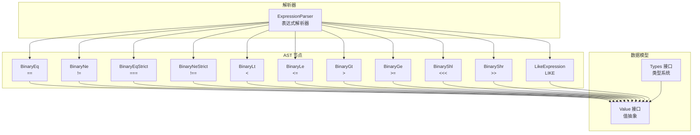
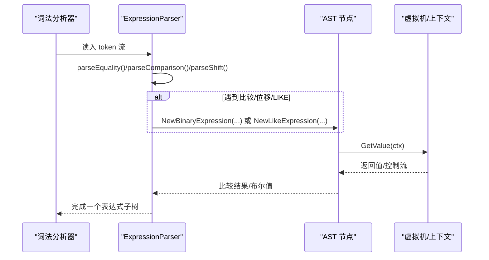
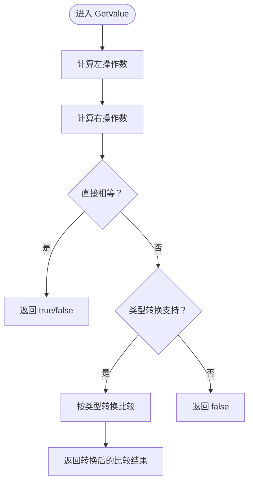
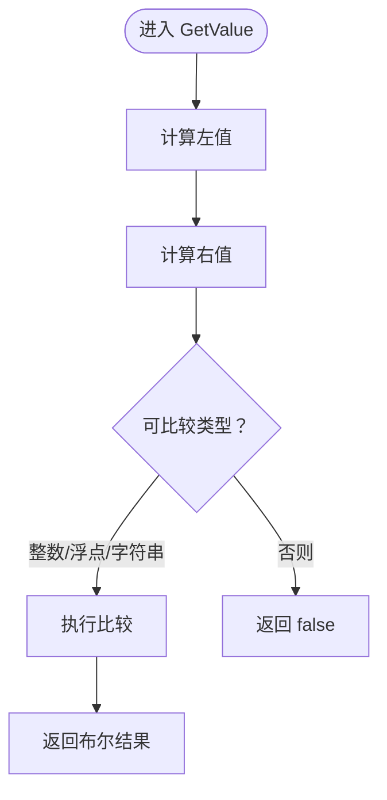
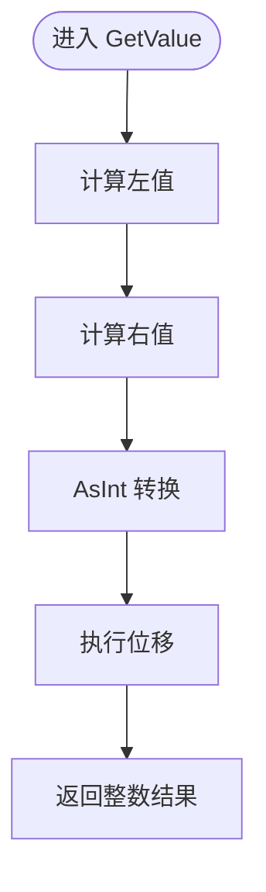
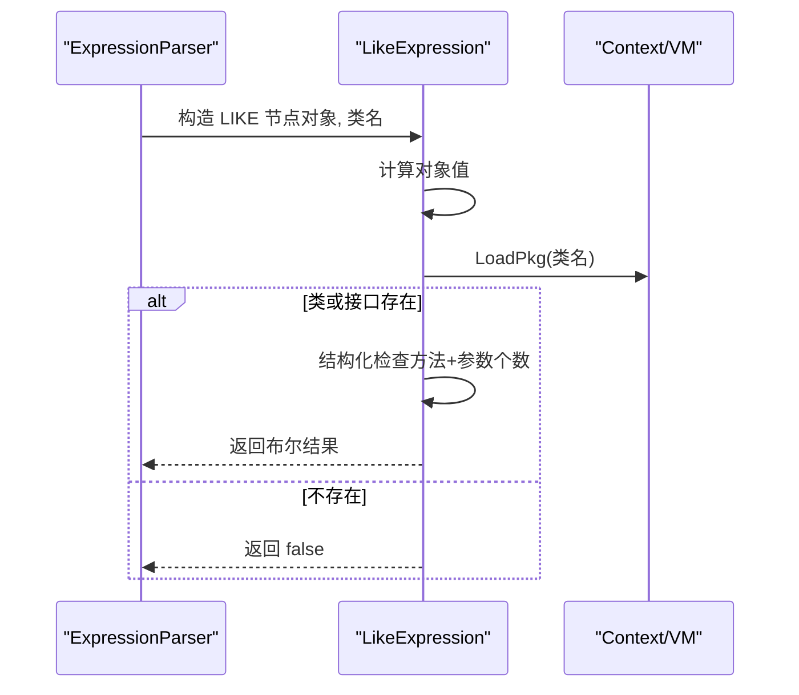
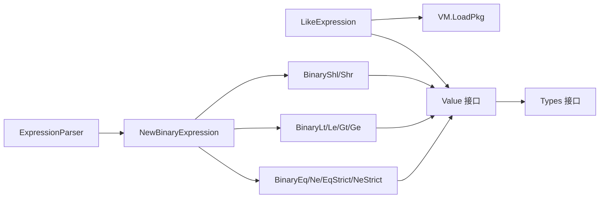

# 比较表达式解析

<cite>
**本文档引用的文件**
- [binary_eq.go](file://node/binary_eq.go)
- [binary_ne.go](file://node/binary_ne.go)
- [binary_eq_strict.go](file://node/binary_eq_strict.go)
- [binary_ne_strict.go](file://node/binary_ne_strict.go)
- [binary_lt.go](file://node/binary_lt.go)
- [binary_le.go](file://node/binary_le.go)
- [binary_gt.go](file://node/binary_gt.go)
- [binary_ge.go](file://node/binary_ge.go)
- [binary_shift.go](file://node/binary_shift.go)
- [like.go](file://node/like.go)
- [expression_parser.go](file://parser/expression_parser.go)
- [binary.go](file://node/binary.go)
- [types.go](file://data/types.go)
- [value.go](file://data/value.go)
</cite>

## 目录
1. [简介](#简介)
2. [项目结构](#项目结构)
3. [核心组件](#核心组件)
4. [架构总览](#架构总览)
5. [详细组件分析](#详细组件分析)
6. [依赖分析](#依赖分析)
7. [性能考虑](#性能考虑)
8. [故障排查指南](#故障排查指南)
9. [结论](#结论)

## 简介
本文件聚焦于比较表达式解析器的技术实现，系统阐述以下内容：
- 相等比较（==、!=、===、!==）的解析与执行机制
- 比较运算符（<、<=、>、>=）的解析与执行机制
- 位移运算符（<<、>>）的解析与执行机制
- LIKE 关键字的特殊处理流程，包括类型检查与类名解析
- 比较表达式在 PHP 语法中的特殊语义：类型转换与严格比较的区别
- 比较表达式的 AST 节点构建与语义分析
- 比较表达式与位移表达式的优先级关系

## 项目结构
围绕比较表达式解析的关键代码分布在如下模块：
- 解析器层：负责词法与语法层面的优先级与结合性控制
- AST 节点层：针对不同比较/位移/类型检查操作生成具体节点
- 数据类型与值层：提供统一的值接口与类型系统支撑比较与转换

图表来源
- [expression_parser.go:282-452](file://parser/expression_parser.go#L282-L452)
- [binary_eq.go:13-88](file://node/binary_eq.go#L13-L88)
- [binary_ne.go:13-84](file://node/binary_ne.go#L13-L84)
- [binary_eq_strict.go:14-117](file://node/binary_eq_strict.go#L14-L117)
- [binary_ne_strict.go:14-40](file://node/binary_ne_strict.go#L14-L40)
- [binary_lt.go:13-66](file://node/binary_lt.go#L13-L66)
- [binary_le.go:13-66](file://node/binary_le.go#L13-L66)
- [binary_gt.go:13-66](file://node/binary_gt.go#L13-L66)
- [binary_ge.go:13-66](file://node/binary_ge.go#L13-L66)
- [binary_shift.go:14-83](file://node/binary_shift.go#L14-L83)
- [like.go:14-98](file://node/like.go#L14-L98)
- [types.go:5-262](file://data/types.go#L5-L262)
- [value.go:3-39](file://data/value.go#L3-L39)

章节来源
- [expression_parser.go:282-452](file://parser/expression_parser.go#L282-L452)

## 核心组件
本节概述比较表达式解析涉及的核心组件及其职责：
- 表达式解析器：负责根据 PHP 语法优先级与结合性，将词法单元组织为 AST，并在必要时插入 LIKE 节点
- 比较节点族：分别处理宽松相等、严格相等、不等、比较运算符与位移运算符
- LIKE 节点：处理类型检查与类名解析，判断对象是否满足指定类或接口的结构要求
- 类型系统与值接口：为比较与转换提供统一抽象，支撑类型转换与严格比较

章节来源
- [expression_parser.go:282-452](file://parser/expression_parser.go#L282-L452)
- [binary.go:13-57](file://node/binary.go#L13-L57)
- [like.go:14-98](file://node/like.go#L14-L98)
- [types.go:5-262](file://data/types.go#L5-L262)
- [value.go:3-39](file://data/value.go#L3-L39)

## 架构总览
下图展示比较表达式解析的整体流程：解析器按优先级逐步降级，遇到比较/位移/LIKE 时构造对应 AST 节点；运行期节点计算时依据 PHP 语义执行类型转换或严格比较。

图表来源
- [expression_parser.go:282-452](file://parser/expression_parser.go#L282-L452)
- [binary.go:13-57](file://node/binary.go#L13-L57)
- [like.go:24-51](file://node/like.go#L24-L51)

## 详细组件分析

### 相等比较（==、!=、===、!==）
- 宽松相等（==）与不等（!=）
  - 执行顺序：先尝试直接相等，再进行类型转换比较
  - 类型转换：整数、浮点、字符串、布尔均可参与转换比较；空值与特定类型有特殊规则
  - 错误处理：类型转换过程中若出现异常，返回错误控制
- 严格相等（===）与严格不等（!==）
  - 严格比较：类型与值均需一致；数组与对象采用递归比较其元素/属性
  - 严格不等：对严格相等结果取反

图表来源
- [binary_eq.go:21-88](file://node/binary_eq.go#L21-L88)
- [binary_ne.go:21-84](file://node/binary_ne.go#L21-L84)
- [binary_eq_strict.go:24-117](file://node/binary_eq_strict.go#L24-L117)
- [binary_ne_strict.go:24-40](file://node/binary_ne_strict.go#L24-L40)

章节来源
- [binary_eq.go:21-88](file://node/binary_eq.go#L21-L88)
- [binary_ne.go:21-84](file://node/binary_ne.go#L21-L84)
- [binary_eq_strict.go:24-117](file://node/binary_eq_strict.go#L24-L117)
- [binary_ne_strict.go:24-40](file://node/binary_ne_strict.go#L24-L40)

### 比较运算符（<、<=、>、>=）
- 执行策略：与宽松相等类似，但比较结果为布尔
- 类型支持：整数、浮点、字符串可参与字典序或数值比较
- 错误处理：类型转换失败时返回错误控制

图表来源
- [binary_lt.go:21-66](file://node/binary_lt.go#L21-L66)
- [binary_le.go:21-66](file://node/binary_le.go#L21-L66)
- [binary_gt.go:21-66](file://node/binary_gt.go#L21-L66)
- [binary_ge.go:21-66](file://node/binary_ge.go#L21-L66)

章节来源
- [binary_lt.go:21-66](file://node/binary_lt.go#L21-L66)
- [binary_le.go:21-66](file://node/binary_le.go#L21-L66)
- [binary_gt.go:21-66](file://node/binary_gt.go#L21-L66)
- [binary_ge.go:21-66](file://node/binary_ge.go#L21-L66)

### 位移运算符（<<、>>）
- 执行策略：左右操作数均转换为整数后执行位移
- 错误处理：转换失败返回错误控制
- 优先级：位移运算优先级高于比较运算符，低于乘除加减

图表来源
- [binary_shift.go:22-83](file://node/binary_shift.go#L22-L83)

章节来源
- [binary_shift.go:22-83](file://node/binary_shift.go#L22-L83)

### LIKE 关键字的特殊处理
- 语义：判断对象值是否满足指定类或接口的“结构化”要求（方法存在且参数个数匹配）
- 类名解析：通过上下文加载包，解析类或接口定义
- 类型检查：仅当对象值为类实例时进行结构检查，否则返回 false

图表来源
- [expression_parser.go:305-317](file://parser/expression_parser.go#L305-L317)
- [like.go:24-51](file://node/like.go#L24-L51)
- [like.go:54-98](file://node/like.go#L54-L98)

章节来源
- [expression_parser.go:305-317](file://parser/expression_parser.go#L305-L317)
- [like.go:24-51](file://node/like.go#L24-L51)
- [like.go:54-98](file://node/like.go#L54-L98)

### PHP 语法特殊语义与类型系统支撑
- 类型转换与严格比较
  - 宽松比较：允许不同类型间进行转换后再比较
  - 严格比较：要求类型完全一致，数组/对象采用递归结构比较
- 类型系统
  - 值接口统一抽象，支持 AsInt/AsFloat/AsString/AsBool 等转换能力
  - 类型系统提供基础类型、联合类型、可空类型等，支撑运行期类型判定

章节来源
- [binary_eq.go:37-85](file://node/binary_eq.go#L37-L85)
- [binary_eq_strict.go:44-117](file://node/binary_eq_strict.go#L44-L117)
- [value.go:3-39](file://data/value.go#L3-L39)
- [types.go:5-262](file://data/types.go#L5-L262)

### AST 节点构建与语义分析
- 解析器在各优先级阶段调用 NewBinaryExpression 构建二元节点
- LIKE 关键字在相等性解析阶段被识别并替换为 LikeExpression 节点
- 严格相等/不等复用 isStrictEqual 工具函数，保证一致性

章节来源
- [expression_parser.go:282-320](file://parser/expression_parser.go#L282-L320)
- [expression_parser.go:396-426](file://parser/expression_parser.go#L396-L426)
- [expression_parser.go:428-452](file://parser/expression_parser.go#L428-L452)
- [binary.go:13-57](file://node/binary.go#L13-L57)

### 优先级关系
- 位移运算（<<、>>）优先级高于比较运算符（<、<=、>、>=）
- 解析器中 parseShift 在 parseComparison 之前被调用，从而保证正确优先级
- 与赋值/逻辑运算的优先级关系由解析器层级划分明确

章节来源
- [expression_parser.go:396-452](file://parser/expression_parser.go#L396-L452)

## 依赖分析
- 解析器依赖 AST 节点工厂：NewBinaryExpression 根据操作符类型选择具体节点
- AST 节点依赖数据类型与值接口：GetValue 中调用 AsInt/AsFloat/AsString/AsBool 等
- LIKE 节点依赖上下文 VM：通过 LoadPkg 加载类或接口定义
- 类型系统为严格比较与 LIKE 结构化检查提供基础

图表来源
- [binary.go:13-57](file://node/binary.go#L13-L57)
- [like.go:24-51](file://node/like.go#L24-L51)
- [types.go:5-262](file://data/types.go#L5-L262)
- [value.go:3-39](file://data/value.go#L3-L39)

章节来源
- [binary.go:13-57](file://node/binary.go#L13-L57)
- [like.go:24-51](file://node/like.go#L24-L51)
- [types.go:5-262](file://data/types.go#L5-L262)
- [value.go:3-39](file://data/value.go#L3-L39)

## 性能考虑
- 类型转换与严格比较均为 O(n) 级别，其中 n 为数组/对象元素或属性数量
- 字符串比较在宽松比较中按字典序进行，注意长字符串场景下的性能
- 位移运算为 O(1)，但需要两次 AsInt 转换
- 优化建议：
  - 尽量避免在热路径中频繁进行数组/对象的严格比较
  - 对字符串比较进行预处理（如标准化大小写/编码），减少重复转换
  - 对 LIKE 结构化检查缓存类/接口方法签名，降低重复解析成本

## 故障排查指南
- 类型转换错误
  - 现象：比较过程中抛出错误控制
  - 排查：确认左右操作数是否具备 AsInt/AsFloat/AsString/AsBool 能力
- LIKE 解析失败
  - 现象：返回 false 或错误控制
  - 排查：确认类名是否正确、上下文是否可加载该包、对象值是否为类实例
- 严格比较结果异常
  - 现象：数组/对象比较结果不符合预期
  - 排查：核对元素/属性数量与类型，确认 isStrictEqual 的递归比较逻辑

章节来源
- [binary_eq.go:41-48](file://node/binary_eq.go#L41-L48)
- [binary_ne.go:42-49](file://node/binary_ne.go#L42-L49)
- [binary_eq_strict.go:77-83](file://node/binary_eq_strict.go#L77-L83)
- [like.go:34-47](file://node/like.go#L34-L47)

## 结论
本解析器通过清晰的优先级划分与统一的值/类型抽象，完整覆盖了 PHP 比较表达式的常见需求：
- 宽松与严格相等、不等的双轨实现，满足不同语义场景
- 比较与位移运算符的正确优先级与类型转换
- LIKE 关键字的结构化类型检查，便于面向接口编程
- AST 节点与解析器的解耦设计，便于扩展与维护