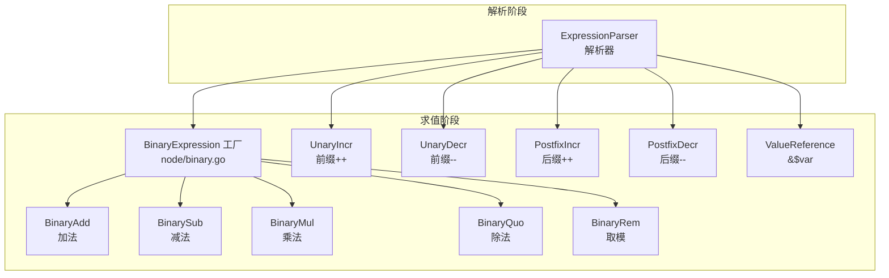
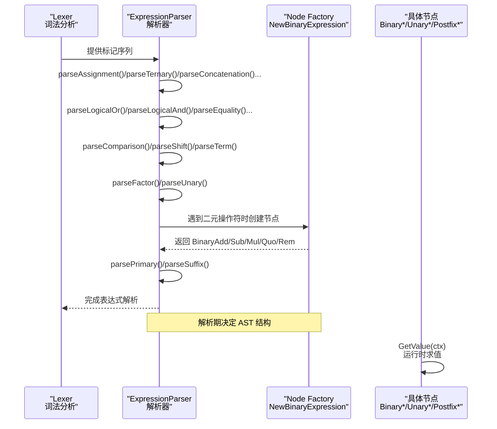
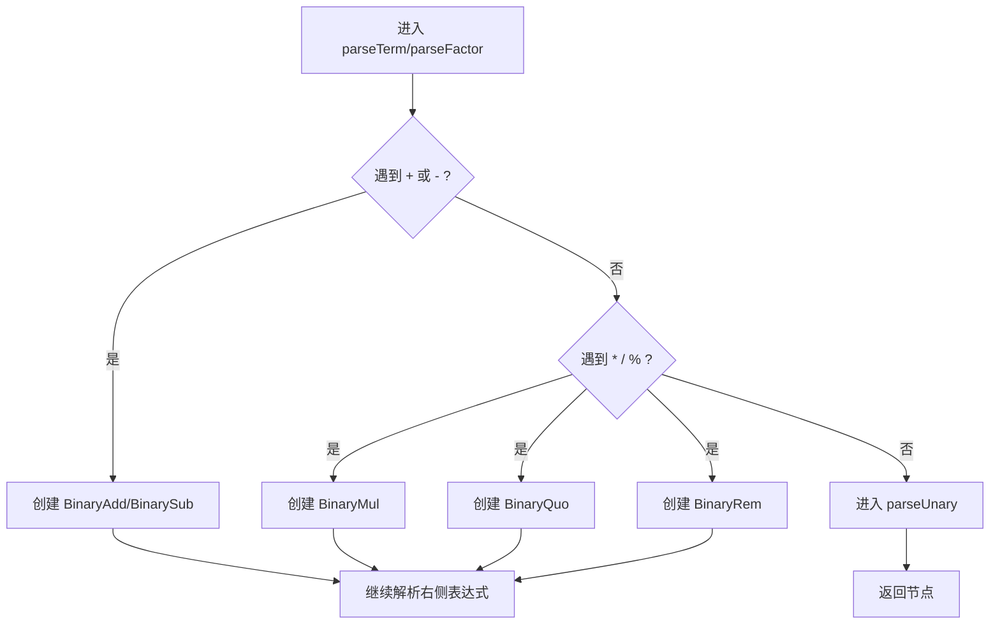
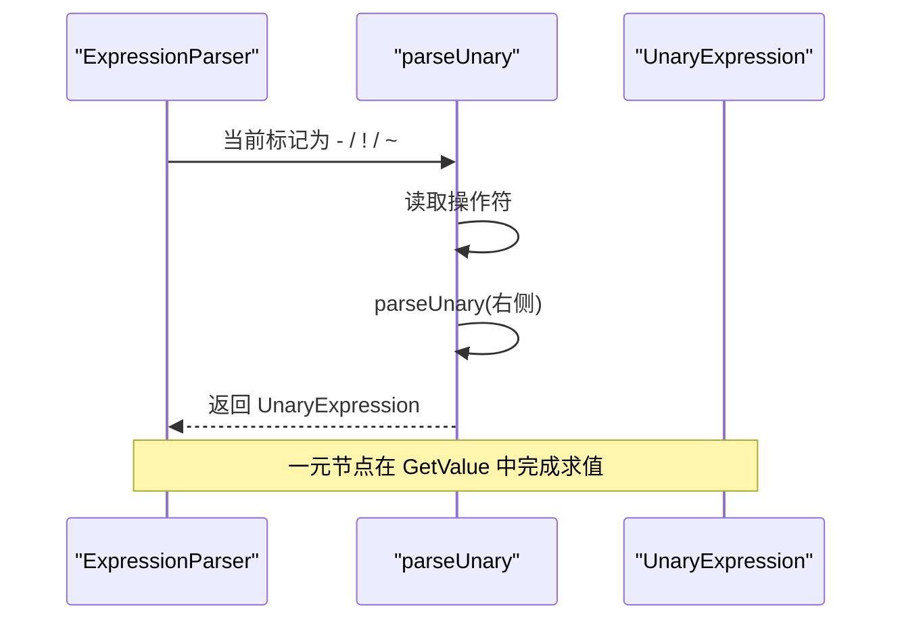
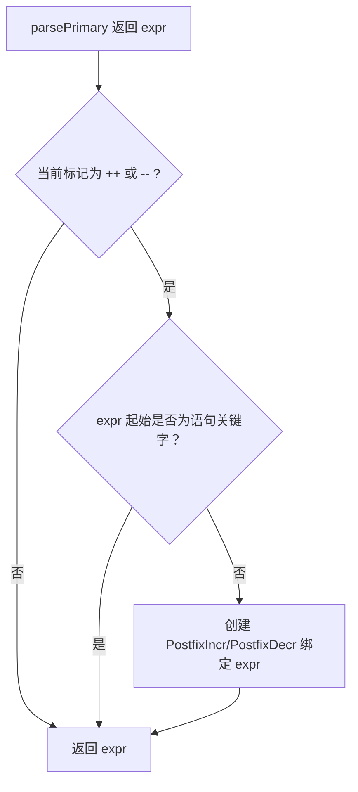
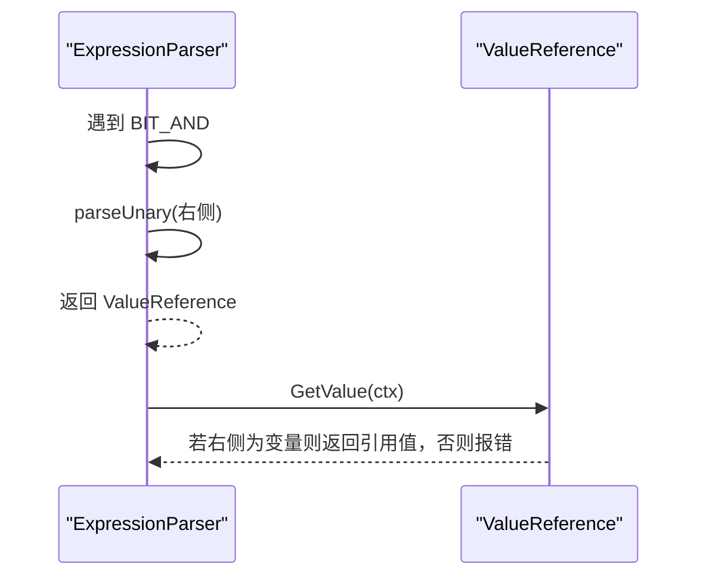
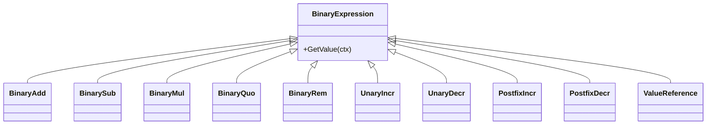
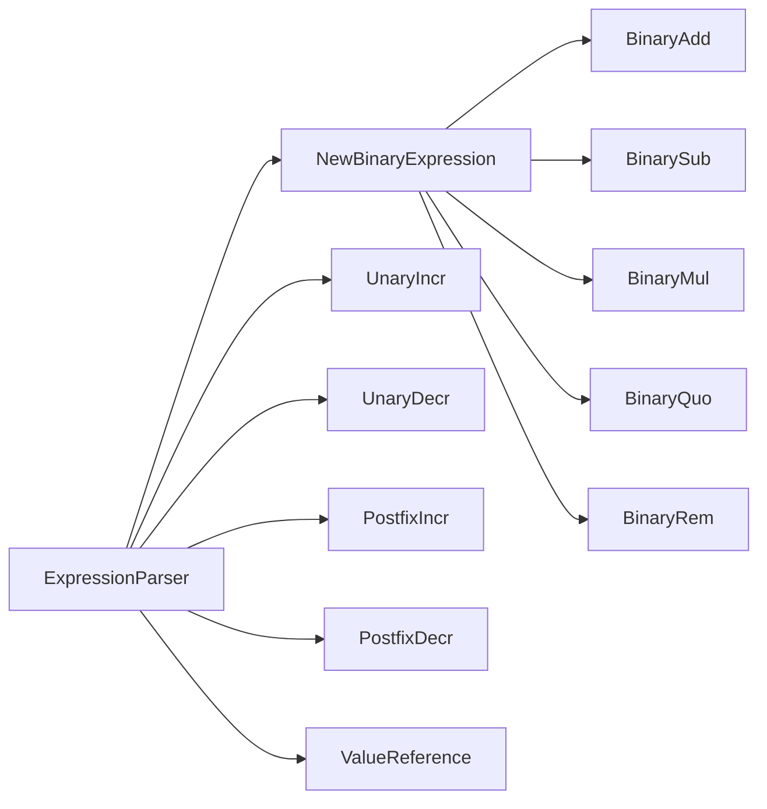

# 算术表达式解析

<cite>
**本文引用的文件**
- [expression_parser.go](file://parser/expression_parser.go)
- [binary.go](file://node/binary.go)
- [binary_add.go](file://node/binary_add.go)
- [binary_sub.go](file://node/binary_sub.go)
- [binary_mul.go](file://node/binary_mul.go)
- [binary_quo.go](file://node/binary_quo.go)
- [binary_rem.go](file://node/binary_rem.go)
- [unary_incr.go](file://node/unary_incr.go)
- [unary_decr.go](file://node/unary_decr.go)
- [postfix_incr.go](file://node/postfix_incr.go)
- [postfix_decr.go](file://node/postfix_decr.go)
- [value_reference.go](file://node/value_reference.go)
</cite>

## 目录
1. [引言](#引言)
2. [项目结构](#项目结构)
3. [核心组件](#核心组件)
4. [架构总览](#架构总览)
5. [详细组件分析](#详细组件分析)
6. [依赖分析](#依赖分析)
7. [性能考量](#性能考量)
8. [故障排查指南](#故障排查指南)
9. [结论](#结论)

## 引言
本文件面向“算术表达式解析器”的技术文档，系统阐述以下内容：
- 加法（+）、减法（-）、乘法（*）、除法（/）与取模（%）的解析与求值机制
- 一元运算符（负号 -、逻辑非 !、按位非 ~）的解析与求值
- 前缀与后缀自增/自减（++/--）的解析差异及与语句关键字的冲突处理
- 引用取值运算符（&$var）的特殊处理
- 算术表达式在 AST 中的表示方式与数据流

## 项目结构
围绕算术表达式解析的关键代码分布在两处：
- 解析阶段：位于解析器模块，负责词法标记到 AST 的转换
- 求值阶段：位于节点模块，负责 AST 节点的运行时求值

图表来源
- [expression_parser.go:507-602](file://parser/expression_parser.go#L507-L602)
- [binary.go:13-95](file://node/binary.go#L13-L95)

章节来源
- [expression_parser.go:507-602](file://parser/expression_parser.go#L507-L602)
- [binary.go:13-95](file://node/binary.go#L13-L95)

## 核心组件
- 表达式解析器（ExpressionParser）：按优先级逐步降解，从赋值表达式到三元、字符串连接、逻辑或、逻辑与、相等性、比较、位移、加减、乘除、取模、一元、后缀自增/自减、前缀自增/自减、引用取值等。
- 二元表达式工厂（NewBinaryExpression）：根据操作符类型选择具体的二元节点（如加法、减法、乘法、除法、取模等）。
- 一元与自增/自减节点：分别处理前缀与后缀的自增/自减，以及引用取值。
- 求值流程：每个节点的 GetValue 方法在运行时计算结果，并处理类型转换与错误。

章节来源
- [expression_parser.go:507-602](file://parser/expression_parser.go#L507-L602)
- [binary.go:13-95](file://node/binary.go#L13-L95)

## 架构总览
下图展示算术表达式解析与求值的整体流程，从解析器到具体节点的映射关系。

图表来源
- [expression_parser.go:507-602](file://parser/expression_parser.go#L507-L602)
- [binary.go:13-95](file://node/binary.go#L13-L95)

## 详细组件分析

### 算术运算符解析与求值
- 加法（+）
  - 解析：在加减表达式阶段识别加号，递归解析因子后生成二元加法节点。
  - 求值：覆盖字符串拼接、数值加法、数组与对象合并等多种行为，详见节点实现。
- 减法（-）
  - 解析：同加法，但生成减法节点。
  - 求值：支持整型、浮点、空值与字符串的减法运算。
- 乘法（*）
  - 解析：在乘除表达式阶段识别乘号，生成乘法节点。
  - 求值：整型与浮点乘法。
- 除法（/）
  - 解析：在乘除表达式阶段识别除号，生成除法节点。
  - 求值：整型与浮点除法，包含除零错误处理。
- 取模（%）
  - 解析：在乘除表达式阶段识别取模，生成取模节点。
  - 求值：整型与浮点取模，包含除零错误处理。

图表来源
- [expression_parser.go:454-505](file://parser/expression_parser.go#L454-L505)
- [binary.go:13-95](file://node/binary.go#L13-L95)

章节来源
- [expression_parser.go:454-505](file://parser/expression_parser.go#L454-L505)
- [binary_add.go:81-231](file://node/binary_add.go#L81-L231)
- [binary_sub.go:22-82](file://node/binary_sub.go#L22-L82)
- [binary_mul.go:23-61](file://node/binary_mul.go#L23-L61)
- [binary_quo.go:23-81](file://node/binary_quo.go#L23-L81)
- [binary_rem.go:22-68](file://node/binary_rem.go#L22-L68)

### 一元运算符解析与求值
- 负号（-）、逻辑非（!）、按位非（~）
  - 解析：在 parseUnary 中识别一元操作符，递归解析右侧表达式后创建一元节点。
  - 求值：由对应的一元节点实现（如前缀自增/自减节点体现一元思想）。

图表来源
- [expression_parser.go:507-533](file://parser/expression_parser.go#L507-L533)

章节来源
- [expression_parser.go:507-533](file://parser/expression_parser.go#L507-L533)

### 前缀与后缀自增/自减解析差异
- 前缀（++/--）
  - 解析：在 parseUnary 中识别前缀 ++/--，随后解析右侧表达式，创建前缀自增/自减节点。
  - 求值：先对右操作数求值并自增/自减，再返回新值。
- 后缀（++/--）
  - 解析：在 parsePrimary 后检查后缀 ++/--，并根据起始标记是否为语句关键字决定是否绑定到当前表达式。
  - 冲突处理：若表达式由 if/else/for/foreach/while/switch/try/catch/finally 等关键字起始，则跳过后缀，交由语句级解析处理。
  - 求值：先返回原值，再对左操作数自增/自减。

图表来源
- [expression_parser.go:706-742](file://parser/expression_parser.go#L706-L742)

章节来源
- [expression_parser.go:706-742](file://parser/expression_parser.go#L706-L742)
- [unary_incr.go:21-87](file://node/unary_incr.go#L21-L87)
- [unary_decr.go:21-66](file://node/unary_decr.go#L21-L66)
- [postfix_incr.go:26-99](file://node/postfix_incr.go#L26-L99)
- [postfix_decr.go:21-71](file://node/postfix_decr.go#L21-L71)

### 引用取值运算符（&$var）的特殊处理
- 解析：在 parseUnary 中识别按位与（&），随后解析右侧表达式，创建引用取值节点。
- 求值：要求右侧必须是变量，返回对该变量的引用值；否则抛出错误。

图表来源
- [expression_parser.go:525-533](file://parser/expression_parser.go#L525-L533)
- [value_reference.go:24-31](file://node/value_reference.go#L24-L31)

章节来源
- [expression_parser.go:525-533](file://parser/expression_parser.go#L525-L533)
- [value_reference.go:24-31](file://node/value_reference.go#L24-L31)

### 算术表达式在 AST 中的表示方式
- 二元表达式统一通过工厂方法创建具体节点，包括加法、减法、乘法、除法、取模等。
- 一元与自增/自减表达式分别对应不同的节点类型，前缀与后缀节点在求值时具有不同副作用顺序。
- 引用取值表达式封装变量引用，用于运行时按引用传递。

图表来源
- [binary.go:13-95](file://node/binary.go#L13-L95)
- [binary_add.go:9-21](file://node/binary_add.go#L9-L21)
- [binary_sub.go:8-20](file://node/binary_sub.go#L8-L20)
- [binary_mul.go:9-20](file://node/binary_mul.go#L9-L20)
- [binary_quo.go:9-20](file://node/binary_quo.go#L9-L20)
- [binary_rem.go:8-19](file://node/binary_rem.go#L8-L19)
- [unary_incr.go:9-19](file://node/unary_incr.go#L9-L19)
- [unary_decr.go:9-19](file://node/unary_decr.go#L9-L19)
- [postfix_incr.go:10-24](file://node/postfix_incr.go#L10-L24)
- [postfix_decr.go:9-19](file://node/postfix_decr.go#L9-L19)
- [value_reference.go:9-21](file://node/value_reference.go#L9-L21)

## 依赖分析
- 解析器对节点工厂的依赖：解析器在遇到二元操作符时委托工厂创建具体节点，保证语法树节点类型与操作符一致。
- 节点内部的类型分支：各二元节点在 GetValue 中根据左右操作数类型进行分支处理，覆盖常见数值与字符串、数组、对象等场景。
- 自增/自减节点对变量的依赖：前缀与后缀节点均要求右侧/左侧为变量，以便在求值时更新其值。

图表来源
- [binary.go:13-95](file://node/binary.go#L13-L95)
- [expression_parser.go:507-602](file://parser/expression_parser.go#L507-L602)

章节来源
- [binary.go:13-95](file://node/binary.go#L13-L95)
- [expression_parser.go:507-602](file://parser/expression_parser.go#L507-L602)

## 性能考量
- 优先级递归下降：解析器采用自顶向下的递归下降，每层仅扫描一次当前操作符，整体时间复杂度与表达式长度线性相关。
- 节点求值的类型判断：二元节点在 GetValue 中进行类型判断与转换，避免重复分配，减少内存开销。
- 错误早返回：除零等错误在求值阶段尽早检测并返回，避免无效计算。

## 故障排查指南
- 除零错误
  - 触发点：除法（/）与取模（%）节点在右侧为零时抛出错误。
  - 排查建议：在调用前校验右侧操作数，或在外层捕获错误并给出提示。
- 引用取值失败
  - 触发点：&$var 的右侧不是变量时抛出错误。
  - 排查建议：确认右侧为可寻址变量，而非常量或表达式结果。
- 自增/自减类型不支持
  - 触发点：对不支持的类型执行自增/自减。
  - 排查建议：确保目标为数值或可转换为整数的类型；必要时显式转换。

章节来源
- [binary_quo.go:46-76](file://node/binary_quo.go#L46-L76)
- [binary_rem.go:44-63](file://node/binary_rem.go#L44-L63)
- [value_reference.go:26-30](file://node/value_reference.go#L26-L30)
- [unary_incr.go:85](file://node/unary_incr.go#L85)
- [postfix_incr.go:97](file://node/postfix_incr.go#L97)

## 结论
本解析器通过清晰的优先级划分与节点工厂模式，完整覆盖了加减乘除取模、一元与自增/自减、引用取值等算术表达式特性。解析期与求值期职责明确，既保证了解析的正确性，也便于扩展新的运算符与节点类型。对于与语句关键字的冲突，解析器通过起始标记判断避免误绑定，确保语法一致性。