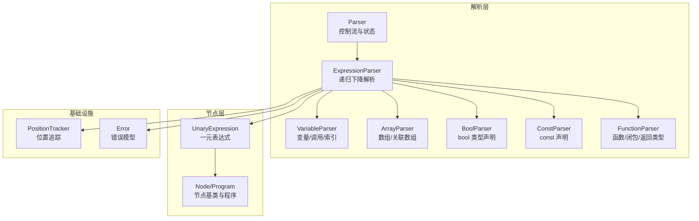
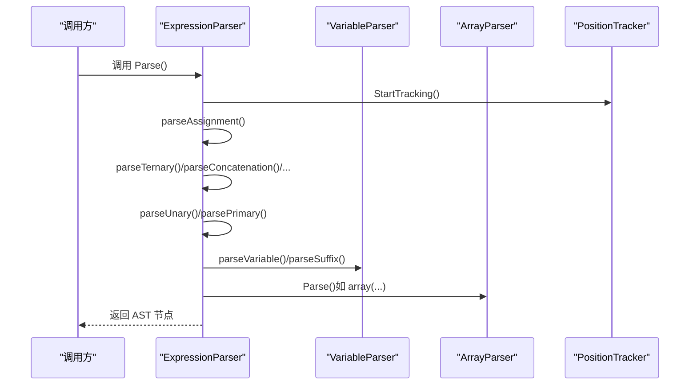
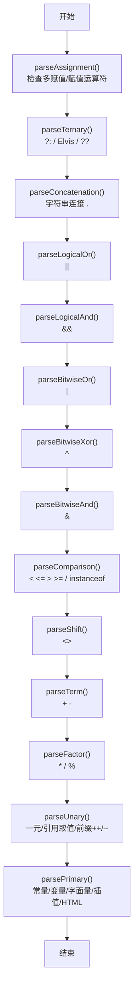
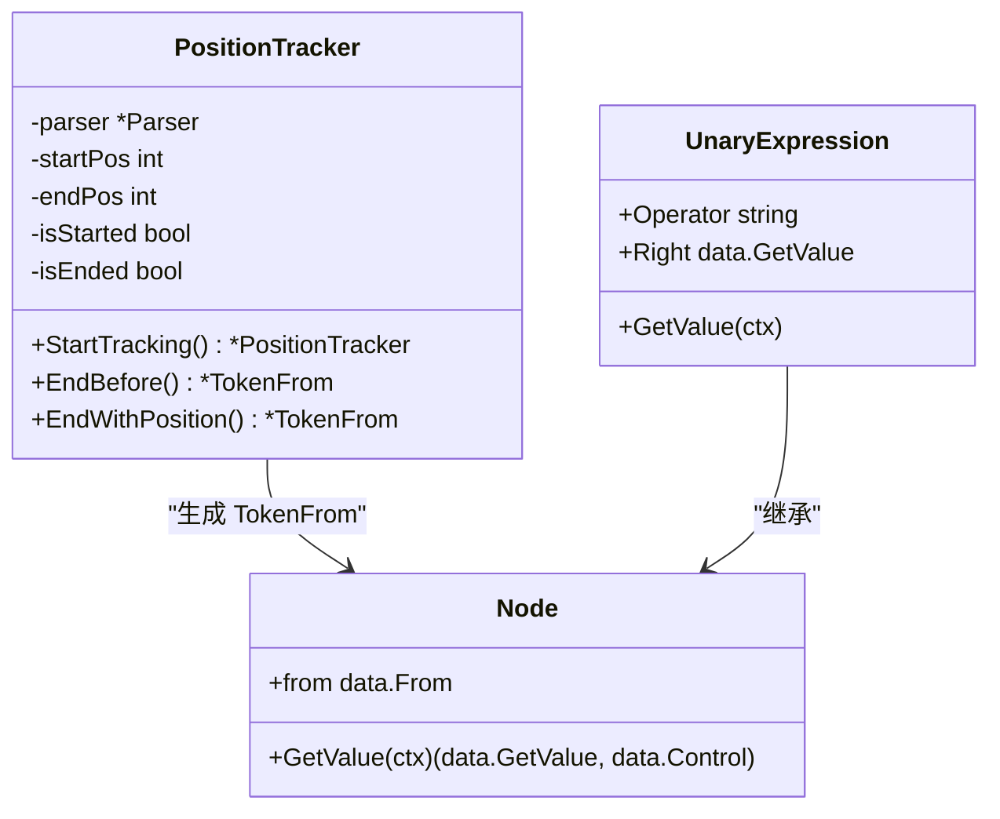
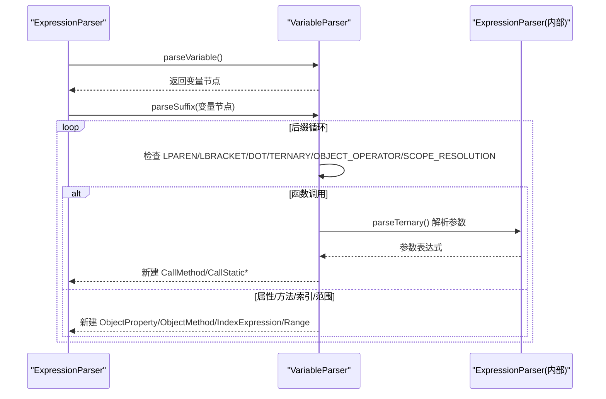
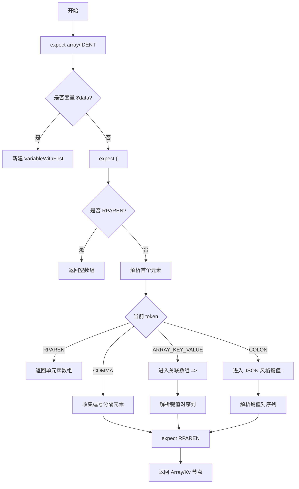
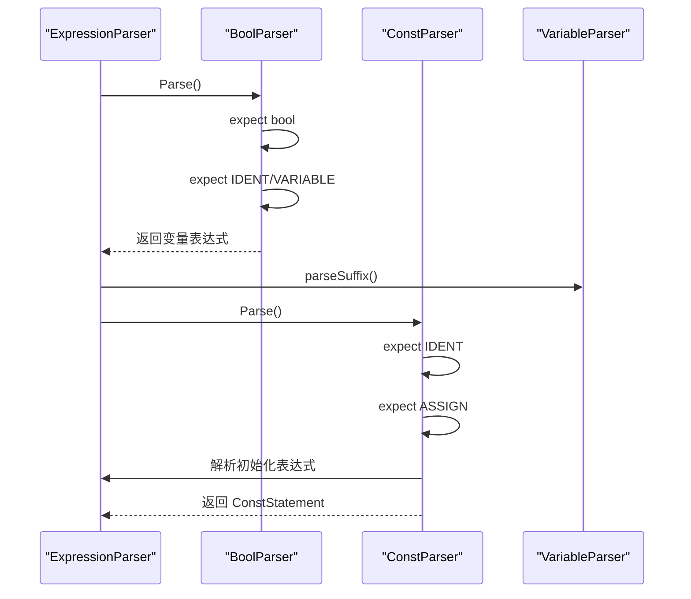
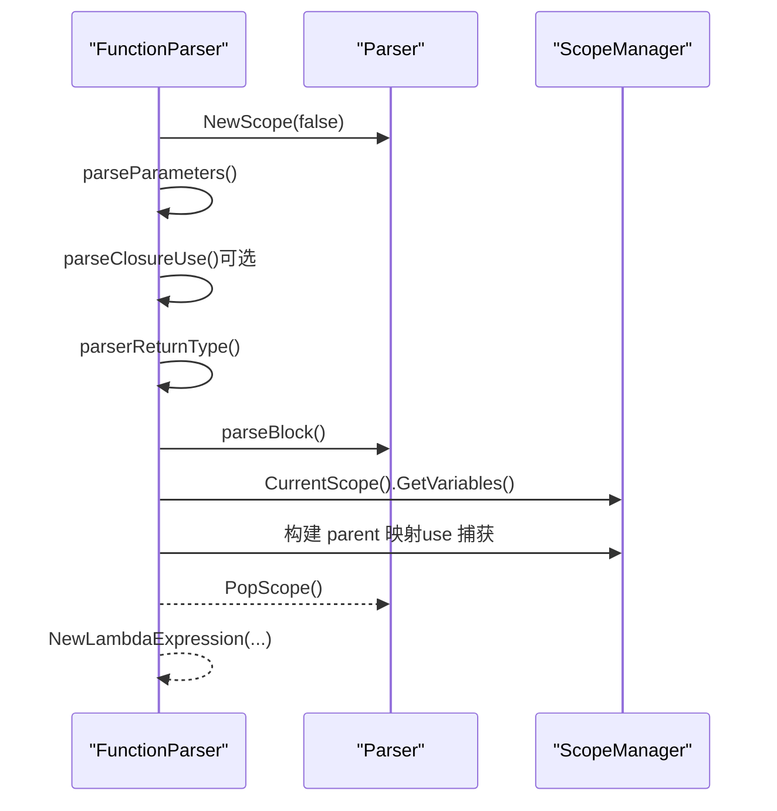
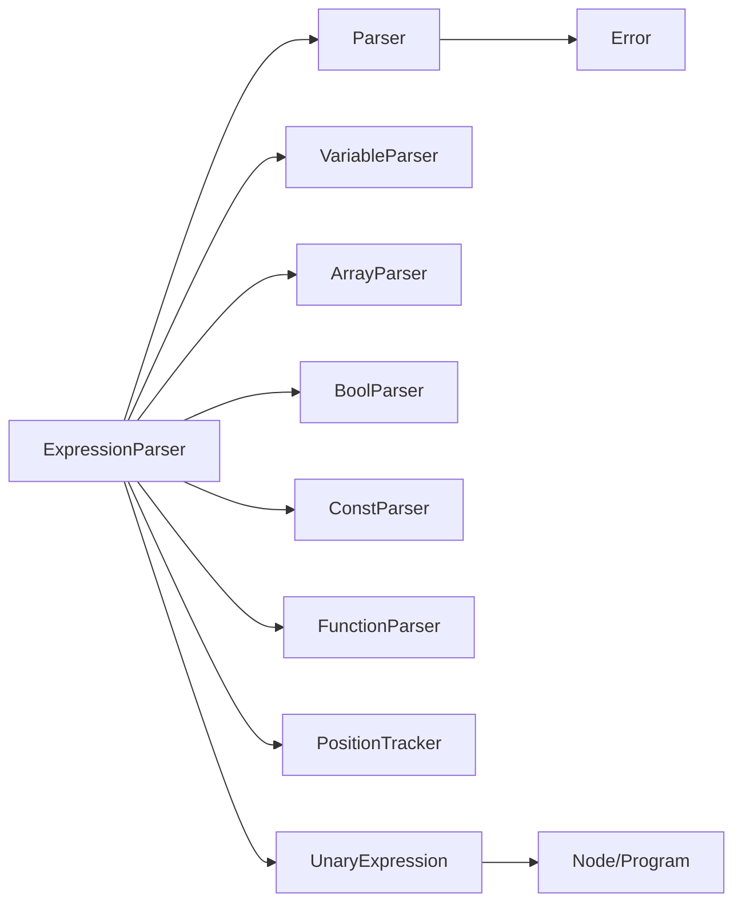

# 表达式解析器

<cite>
**本文引用的文件**
- [expression_parser.go](file://parser/expression_parser.go)
- [variable_parser.go](file://parser/variable_parser.go)
- [array_parser.go](file://parser/array_parser.go)
- [bool_parser.go](file://parser/bool_parser.go)
- [const_parser.go](file://parser/const_parser.go)
- [function_parser.go](file://parser/function_parser.go)
- [position_tracker.go](file://parser/position_tracker.go)
- [expression.go](file://node/expression.go)
- [node.go](file://node/node.go)
- [error.go](file://data/error.go)
</cite>

## 目录
1. [简介](#简介)
2. [项目结构](#项目结构)
3. [核心组件](#核心组件)
4. [架构总览](#架构总览)
5. [详细组件分析](#详细组件分析)
6. [依赖分析](#依赖分析)
7. [性能考量](#性能考量)
8. [故障排查指南](#故障排查指南)
9. [结论](#结论)
10. [附录](#附录)

## 简介
本文件面向编译器开发者，系统化阐述表达式解析器的设计与实现，覆盖以下主题：
- 递归下降解析算法与优先级处理
- 操作符重载与二元/一元/后缀表达式节点
- 各类表达式解析流程：数组、布尔、常量、变量、函数调用
- 错误恢复策略、位置信息追踪与 AST 节点构建
- 与词法分析器的协作机制
- PHP 语法兼容性要点
- 扩展接口与性能优化建议

## 项目结构
表达式解析器位于 parser 子模块，围绕 Parser 与 ExpressionParser 协作完成解析；AST 节点位于 node 子模块；位置信息与错误模型分别由 position_tracker 与 data 子模块提供。

**图表来源**
- [expression_parser.go:1-755](file://parser/expression_parser.go#L1-L755)
- [variable_parser.go:1-515](file://parser/variable_parser.go#L1-L515)
- [array_parser.go:1-132](file://parser/array_parser.go#L1-L132)
- [bool_parser.go:1-52](file://parser/bool_parser.go#L1-L52)
- [const_parser.go:1-59](file://parser/const_parser.go#L1-L59)
- [function_parser.go:1-322](file://parser/function_parser.go#L1-L322)
- [position_tracker.go:1-179](file://parser/position_tracker.go#L1-L179)
- [expression.go:1-57](file://node/expression.go#L1-L57)
- [node.go:1-99](file://node/node.go#L1-L99)
- [error.go:1-50](file://data/error.go#L1-L50)

**章节来源**
- [expression_parser.go:1-755](file://parser/expression_parser.go#L1-L755)
- [position_tracker.go:1-179](file://parser/position_tracker.go#L1-L179)

## 核心组件
- 表达式解析器（ExpressionParser）：实现递归下降解析，按优先级组织各语法层级，统一通过位置跟踪器生成 AST 节点。
- 变量解析器（VariableParser）：负责变量、方法调用、属性访问、静态成员、空安全调用、数组索引与范围切片等后缀表达式。
- 数组解析器（ArrayParser）：支持 array(...) 语法、逗号分隔列表、关联数组（=>）、JSON 风格键值（:）。
- 布尔类型声明解析器（BoolParser）：解析 bool 类型声明并接入变量后缀解析。
- 常量解析器（ConstParser）：解析 const 语句及其初始化表达式。
- 函数解析器（FunctionParser）：解析函数/闭包声明、参数、use 捕获、返回类型（含联合/可空/多返回值）。
- 位置跟踪器（PositionTracker）：在解析过程中记录起止位置，生成精确的 From 信息。
- AST 节点与执行：一元表达式节点、程序节点等，提供 GetValue 执行入口与错误传播。

**章节来源**
- [expression_parser.go:14-24](file://parser/expression_parser.go#L14-L24)
- [variable_parser.go:11-21](file://parser/variable_parser.go#L11-L21)
- [array_parser.go:11-18](file://parser/array_parser.go#L11-L18)
- [bool_parser.go:9-19](file://parser/bool_parser.go#L9-L19)
- [const_parser.go:10-20](file://parser/const_parser.go#L10-L20)
- [function_parser.go:11-21](file://parser/function_parser.go#L11-L21)
- [position_tracker.go:7-23](file://parser/position_tracker.go#L7-L23)
- [expression.go:5-19](file://node/expression.go#L5-L19)
- [node.go:7-34](file://node/node.go#L7-L34)

## 架构总览
表达式解析采用“自顶向下”的递归下降范式，按运算符优先级逐层下降：
- 最高层：赋值表达式（Assignment）
- 中间层：三元/空合并/ Elvis、逻辑或、逻辑与、按位或/异或/与、比较（含 instanceof）、位移、加减、乘除、取余、幂、一元（含引用取值、前缀自增/自减）、后缀（函数调用、属性/方法、静态成员、索引/范围）
- 最底层：常量/字面量/变量/插值字符串/HTML DOCTYPE 等 primary 表达式

**图表来源**
- [expression_parser.go:26-33](file://parser/expression_parser.go#L26-L33)
- [variable_parser.go:23-30](file://parser/variable_parser.go#L23-L30)
- [array_parser.go:20-43](file://parser/array_parser.go#L20-L43)
- [position_tracker.go:16-23](file://parser/position_tracker.go#L16-L23)

## 详细组件分析

### 递归下降解析与优先级处理
- 优先级层次（从高到低）：幂、乘除取余、加减、位移、比较、按位与/异或/或、逻辑与、逻辑或、三元/Elvis/空合并、赋值（含复合赋值与空合并赋值）。
- 每一层使用“循环匹配同一优先级”的方式，保证左结合性；不同优先级通过函数调用链实现下降。
- instanceof 优先级高于一元运算符，解析时在 parsePrimary 后立即处理，确保 !$x instanceof Foo 的正确结合。

**图表来源**
- [expression_parser.go:35-755](file://parser/expression_parser.go#L35-L755)

**章节来源**
- [expression_parser.go:35-198](file://parser/expression_parser.go#L35-L198)
- [expression_parser.go:200-505](file://parser/expression_parser.go#L200-L505)
- [expression_parser.go:507-602](file://parser/expression_parser.go#L507-L602)
- [expression_parser.go:604-749](file://parser/expression_parser.go#L604-L749)

### 位置信息追踪与 AST 节点构建
- 位置跟踪器在进入每个解析阶段时启动，结束时根据“开始/结束/之前”策略生成精确的 From 信息，用于错误定位与调试。
- 所有二元/一元/后缀表达式节点均携带 From，确保执行期错误可回溯到源码位置。

**图表来源**
- [position_tracker.go:7-143](file://parser/position_tracker.go#L7-L143)
- [expression.go:5-19](file://node/expression.go#L5-L19)
- [node.go:7-24](file://node/node.go#L7-L24)

**章节来源**
- [position_tracker.go:16-143](file://parser/position_tracker.go#L16-L143)
- [expression.go:12-56](file://node/expression.go#L12-L56)
- [node.go:21-24](file://node/node.go#L21-L24)

### 变量表达式与后缀操作
- 变量解析器负责变量名解析、超全局变量特例、作用域查找与创建、后缀链式解析。
- 支持函数调用（命名参数、展开参数 ...expr）、属性/方法访问（含动态属性）、静态成员（::）、空安全调用 ?->、数组索引与范围切片。

**图表来源**
- [variable_parser.go:23-30](file://parser/variable_parser.go#L23-L30)
- [variable_parser.go:105-210](file://parser/variable_parser.go#L105-L210)
- [variable_parser.go:212-288](file://parser/variable_parser.go#L212-L288)
- [variable_parser.go:289-386](file://parser/variable_parser.go#L289-L386)
- [variable_parser.go:387-515](file://parser/variable_parser.go#L387-L515)

**章节来源**
- [variable_parser.go:32-103](file://parser/variable_parser.go#L32-L103)
- [variable_parser.go:105-210](file://parser/variable_parser.go#L105-L210)
- [variable_parser.go:212-288](file://parser/variable_parser.go#L212-L288)
- [variable_parser.go:289-386](file://parser/variable_parser.go#L289-L386)
- [variable_parser.go:387-515](file://parser/variable_parser.go#L387-L515)

### 数组表达式解析
- 支持 array(...) 语法：空数组、单元素、逗号分隔列表、关联数组（=>）、JSON 风格键值（:）。
- 解析时严格消费括号与分隔符，并在末尾生成 Array/Kv 节点。

**图表来源**
- [array_parser.go:20-131](file://parser/array_parser.go#L20-L131)

**章节来源**
- [array_parser.go:20-131](file://parser/array_parser.go#L20-L131)

### 布尔类型声明与常量表达式
- 布尔类型声明解析器：解析 bool 变量声明，创建带类型的变量表达式，并继续解析后缀。
- 常量解析器：解析 const 名称与初始化表达式，必要时支持“const 类型 变量 = 初始化”。

**图表来源**
- [bool_parser.go:21-51](file://parser/bool_parser.go#L21-L51)
- [const_parser.go:22-58](file://parser/const_parser.go#L22-L58)
- [variable_parser.go:48-50](file://parser/variable_parser.go#L48-L50)

**章节来源**
- [bool_parser.go:21-51](file://parser/bool_parser.go#L21-L51)
- [const_parser.go:22-58](file://parser/const_parser.go#L22-L58)

### 函数/闭包与返回类型
- 函数解析器支持普通函数与匿名函数（闭包）：参数列表、use 捕获（含引用捕获）、返回类型（基础/联合/可空/多返回值）。
- 闭包内部作用域管理与父变量映射，确保捕获变量在运行时可见。

**图表来源**
- [function_parser.go:23-155](file://parser/function_parser.go#L23-L155)
- [function_parser.go:170-213](file://parser/function_parser.go#L170-L213)
- [function_parser.go:215-321](file://parser/function_parser.go#L215-L321)

**章节来源**
- [function_parser.go:23-155](file://parser/function_parser.go#L23-L155)
- [function_parser.go:170-213](file://parser/function_parser.go#L170-L213)
- [function_parser.go:215-321](file://parser/function_parser.go#L215-L321)

### PHP 语法兼容性要点
- instanceof 优先级高于一元运算符，解析器在 parsePrimary 后立即处理，确保 !$x instanceof Foo 的正确结合。
- Elvis 运算符（?:）与空合并（??）的特殊处理，Elvis 真值分支复用条件表达式本身。
- 空安全调用 ?-> 的链式支持，动态属性与方法调用的统一处理。
- 三元运算符 ?: 的冒号校验与链式空安全调用的识别。
- 位移、按位与/异或/或、逻辑与/或的优先级顺序与结合性。
- 前缀自增/自减与后缀自增/自减的绑定规则，避免与语句关键字冲突。

**章节来源**
- [expression_parser.go:560-582](file://parser/expression_parser.go#L560-L582)
- [expression_parser.go:106-197](file://parser/expression_parser.go#L106-L197)
- [variable_parser.go:129-174](file://parser/variable_parser.go#L129-L174)

### 错误恢复策略与位置信息
- 位置跟踪器提供 EndBefore/EndWithPosition 等策略，确保错误定位到最小有效范围。
- 解析器在遇到不匹配或非法 token 时，构造 data.Error 并携带 From 信息，便于上层 VM 或 LSP 使用。
- 程序节点在执行期对控制流（如 return/goto/label）进行处理，并在非预期控制流时将错误加入调用栈。

**章节来源**
- [position_tracker.go:34-143](file://parser/position_tracker.go#L34-L143)
- [error.go:11-49](file://data/error.go#L11-L49)
- [node.go:44-98](file://node/node.go#L44-L98)

## 依赖分析
- 表达式解析器依赖 Parser 的状态（token 流、作用域、位置跟踪）与路由表（parserRouter）以分发到具体解析器。
- VariableParser 依赖 ExpressionParser（解析参数与后缀）、ScopeManager（变量查找/创建）。
- ArrayParser/BoolParser/ConstParser/FunctionParser 依赖 Parser 的通用能力（consume、check、scope 管理）。
- AST 节点依赖 data.GetValue 接口与运行时上下文，统一通过 GetValue 执行。

**图表来源**
- [expression_parser.go:1-12](file://parser/expression_parser.go#L1-L12)
- [variable_parser.go:1-9](file://parser/variable_parser.go#L1-L9)
- [array_parser.go:1-9](file://parser/array_parser.go#L1-L9)
- [bool_parser.go:1-7](file://parser/bool_parser.go#L1-L7)
- [const_parser.go:1-8](file://parser/const_parser.go#L1-L8)
- [function_parser.go:1-9](file://parser/function_parser.go#L1-L9)
- [position_tracker.go:1-5](file://parser/position_tracker.go#L1-L5)
- [expression.go:1-3](file://node/expression.go#L1-L3)
- [node.go:1-5](file://node/node.go#L1-L5)
- [error.go:1-3](file://data/error.go#L1-L3)

**章节来源**
- [expression_parser.go:1-12](file://parser/expression_parser.go#L1-L12)
- [variable_parser.go:1-9](file://parser/variable_parser.go#L1-L9)
- [array_parser.go:1-9](file://parser/array_parser.go#L1-L9)
- [bool_parser.go:1-7](file://parser/bool_parser.go#L1-L7)
- [const_parser.go:1-8](file://parser/const_parser.go#L1-L8)
- [function_parser.go:1-9](file://parser/function_parser.go#L1-L9)
- [position_tracker.go:1-5](file://parser/position_tracker.go#L1-L5)
- [expression.go:1-3](file://node/expression.go#L1-L3)
- [node.go:1-5](file://node/node.go#L1-L5)
- [error.go:1-3](file://data/error.go#L1-L3)

## 性能考量
- 递归深度与栈开销：优先级层次较多时，深度与内存占用线性相关。建议在复杂表达式场景下评估最大递归深度。
- 位置追踪成本：频繁 StartTracking/EndBefore 会产生额外对象分配。可在热点路径减少不必要的追踪，或批量合并追踪区间。
- 词法/语法错误早返回：解析器在遇到非法 token 时尽早返回错误，避免无效递归。
- 作用域查询：变量解析涉及作用域查找，建议在大规模作用域中缓存最近查找结果或使用索引加速。
- AST 节点复用：对常量/字面量节点尽量复用，减少 GC 压力。

## 故障排查指南
- 三元/Elvis/空合并语法错误：检查 ?: 冒号缺失、?-> 后需跟随合法符号、?? 右侧表达式缺失。
- instanceof 优先级问题：确认 instanceof 未被错误地绑定到一元运算符左侧。
- 变量后缀解析异常：核对 LPAREN/LBRACKET/DOT/TOKEN/OBJECT_OPERATOR/SCOPE_RESOLUTION 分支是否正确消费 token。
- 数组语法错误：核对 array(...) 的括号、逗号、=>/: 使用是否符合预期。
- 闭包 use 捕获：确认 use (&$a, $b) 语法与引用捕获标志位正确处理。
- 错误定位：利用 From 信息查看报错位置，结合 PositionTracker 的 EndBefore/EndWithPosition 精确定位。

**章节来源**
- [expression_parser.go:106-197](file://parser/expression_parser.go#L106-L197)
- [expression_parser.go:560-582](file://parser/expression_parser.go#L560-L582)
- [variable_parser.go:129-174](file://parser/variable_parser.go#L129-L174)
- [array_parser.go:74-130](file://parser/array_parser.go#L74-L130)
- [function_parser.go:170-213](file://parser/function_parser.go#L170-L213)
- [position_tracker.go:114-143](file://parser/position_tracker.go#L114-L143)

## 结论
表达式解析器以清晰的递归下降结构实现了 PHP 风格的表达式语法，兼顾优先级、后缀链式操作与 PHP 语法特性。通过位置跟踪与统一的错误模型，解析器具备良好的可维护性与可诊断性。对于扩展与性能优化，建议从解析器分层、作用域查询与追踪策略入手，逐步提升在复杂表达式场景下的稳定性与吞吐。

## 附录
- 扩展接口建议
  - 新增运算符：在对应优先级层级增加解析分支，并在节点层新增相应二元/一元节点。
  - 新增表达式类型：在 parserRouter 中注册新类型的起始 token，交由专用解析器处理。
  - 作用域与变量：通过 ScopeManager 提供的接口扩展变量生命周期与捕获语义。
- 与词法分析器协作
  - 解析器通过 Parser 的 current/next/peek 系列方法消费 token，确保与词法分析器的 token 流保持一致。
  - 插值字符串（INTERPOLATION_TOKEN/VALUE）通过 ExpressionParser 的 parseLingToken 与解析器路由协同处理。