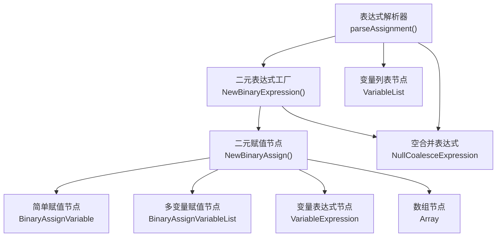
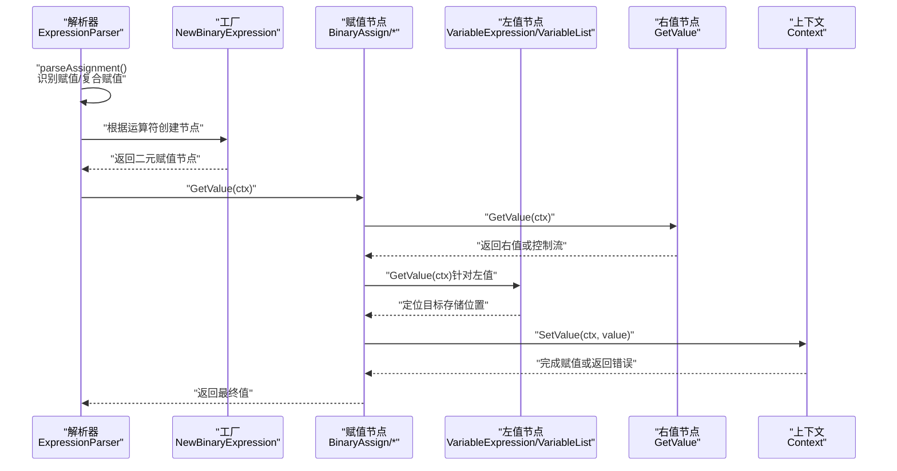
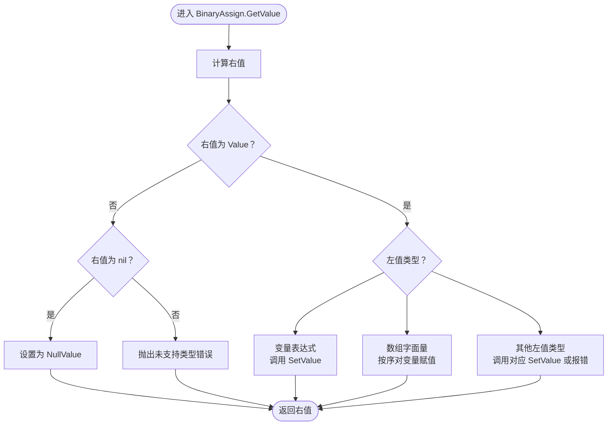
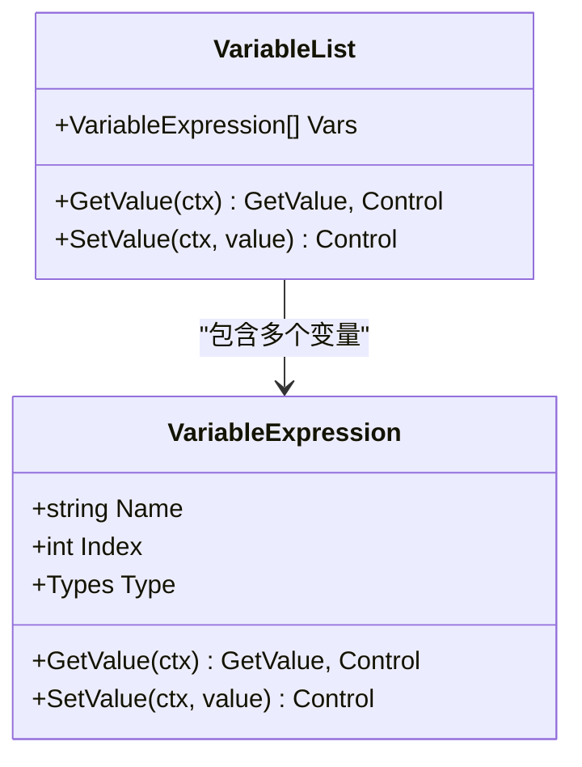
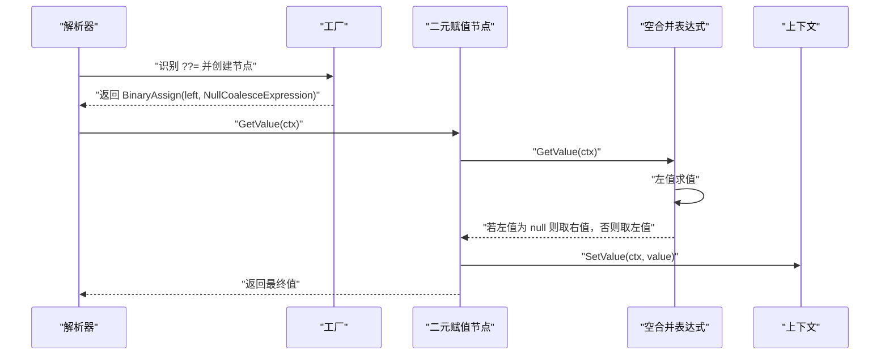
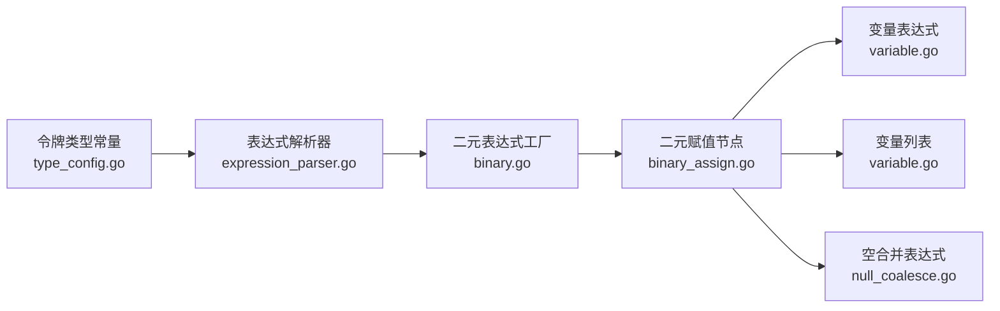

# 赋值表达式解析

<cite>
**本文档引用的文件**
- [binary_assign.go](file://node/binary_assign.go)
- [expression_parser.go](file://parser/expression_parser.go)
- [binary.go](file://node/binary.go)
- [variable.go](file://node/variable.go)
- [array.go](file://node/array.go)
- [null_coalesce.go](file://node/null_coalesce.go)
- [type_config.go](file://token/type_config.go)
- [token.go](file://token/token.go)
</cite>

## 目录
1. [简介](#简介)
2. [项目结构](#项目结构)
3. [核心组件](#核心组件)
4. [架构总览](#架构总览)
5. [详细组件分析](#详细组件分析)
6. [依赖关系分析](#依赖关系分析)
7. [性能考量](#性能考量)
8. [故障排查指南](#故障排查指南)
9. [结论](#结论)

## 简介
本文件系统性阐述赋值表达式的解析与执行机制，覆盖以下要点：
- 简单赋值与复合赋值运算符（+=、-=、*=、/=、%=、.=、??=、|=、&=、^=、<<=、>>=、**=）的解析与执行路径
- 多变量赋值（列表解包）的解析逻辑、变量列表构建与类型验证
- 赋值表达式在语法树中的表示方式及与变量表达式的关系
- PHP 语法兼容性（含空合并赋值、幂运算赋值等）的实现策略
- 错误处理与边界情况的处理策略

## 项目结构
围绕赋值表达式的解析与执行，涉及的关键模块如下：
- 解析器层：负责词法/语法层面的赋值表达式识别与AST构造
- 节点层：提供赋值表达式节点、变量表达式节点、数组节点、空合并表达式节点等
- 令牌层：定义赋值与复合赋值运算符的类型常量

**图表来源**
- [expression_parser.go:35-96](file://parser/expression_parser.go#L35-L96)
- [binary.go:13-95](file://node/binary.go#L13-L95)
- [binary_assign.go:16-37](file://node/binary_assign.go#L16-L37)
- [variable.go:72-142](file://node/variable.go#L72-L142)
- [null_coalesce.go:15-21](file://node/null_coalesce.go#L15-L21)

**章节来源**
- [expression_parser.go:35-96](file://parser/expression_parser.go#L35-L96)
- [binary.go:13-95](file://node/binary.go#L13-L95)
- [binary_assign.go:16-37](file://node/binary_assign.go#L16-L37)
- [variable.go:72-142](file://node/variable.go#L72-L142)
- [null_coalesce.go:15-21](file://node/null_coalesce.go#L15-L21)

## 核心组件
- 表达式解析器：负责识别赋值与复合赋值运算符，并构造对应的二元表达式节点
- 二元表达式工厂：根据运算符类型创建具体节点（含复合赋值转简单赋值的等价替换）
- 二元赋值节点族：包含简单赋值与多变量赋值两类实现
- 变量表达式与变量列表：前者用于单变量赋值，后者用于多变量解包赋值
- 空合并表达式：为 ??= 提供惰性求值的右操作数计算

**章节来源**
- [expression_parser.go:35-96](file://parser/expression_parser.go#L35-L96)
- [binary.go:13-95](file://node/binary.go#L13-L95)
- [binary_assign.go:16-37](file://node/binary_assign.go#L16-L37)
- [variable.go:72-142](file://node/variable.go#L72-L142)
- [null_coalesce.go:15-21](file://node/null_coalesce.go#L15-L21)

## 架构总览
下图展示赋值表达式从解析到执行的整体流程，包括复合赋值的等价转换与多变量赋值的解包过程。

**图表来源**
- [expression_parser.go:35-96](file://parser/expression_parser.go#L35-L96)
- [binary.go:13-95](file://node/binary.go#L13-L95)
- [binary_assign.go:148-164](file://node/binary_assign.go#L148-L164)
- [variable.go:56-68](file://node/variable.go#L56-L68)

## 详细组件分析

### 表达式解析器与赋值运算符识别
- 解析入口：解析器在顶层调用 assignment 解析，随后在多个层级上持续扫描赋值与复合赋值运算符
- 复合赋值等价转换：解析器将复合赋值（如 +=、-=、*=、/=、%=、.=、??=、|=、&=、^=、<<=、>>=、**=）转换为“a = a OP b”的等价形式，再交由二元赋值节点处理
- 多变量赋值检测：在 assignment 解析早期，若检测到形如“$a, $b, ...”的逗号序列且紧随赋值运算符，则将其包装为变量列表节点，用于后续的解包赋值

关键实现位置：
- 赋值与复合赋值识别与等价转换：[expression_parser.go:79-94](file://parser/expression_parser.go#L79-L94)
- 复合赋值到简单赋值的转换：[binary.go:60-91](file://node/binary.go#L60-L91)
- 多变量赋值检测与变量列表构建：[expression_parser.go:43-77](file://parser/expression_parser.go#L43-L77)

**章节来源**
- [expression_parser.go:43-77](file://parser/expression_parser.go#L43-L77)
- [expression_parser.go:79-94](file://parser/expression_parser.go#L79-L94)
- [binary.go:60-91](file://node/binary.go#L60-L91)

### 二元赋值节点与执行流程
- 节点工厂：根据左值类型自动选择具体实现（单变量或变量列表）
- 执行流程：
  - 计算右值
  - 针对不同左值类型（变量、数组、静态属性、对象属性、索引表达式等）进行相应赋值
  - 对于比较表达式作为左值的情况，抛出明确的错误提示
  - 对于数组字面量作为左值，按索引顺序对变量进行赋值
  - 对于变量列表，委托给列表节点的 SetValue 完成解包赋值

关键实现位置：
- 节点工厂与类型分派：[binary_assign.go:16-37](file://node/binary_assign.go#L16-L37)
- 简单赋值执行：[binary_assign.go:148-164](file://node/binary_assign.go#L148-L164)
- 多变量赋值执行：[binary_assign.go:172-201](file://node/binary_assign.go#L172-L201)
- 左值类型分支与错误处理：[binary_assign.go:39-140](file://node/binary_assign.go#L39-L140)

**图表来源**
- [binary_assign.go:39-164](file://node/binary_assign.go#L39-L164)

**章节来源**
- [binary_assign.go:16-37](file://node/binary_assign.go#L16-L37)
- [binary_assign.go:39-164](file://node/binary_assign.go#L39-L164)

### 变量表达式与变量列表
- 变量表达式：提供 GetValue 读取值、SetValue 写入值；支持类型约束与类型不匹配时的错误处理
- 变量列表：支持多变量解包赋值，将数组元素逐个分配给对应变量；若数组长度不足，缺失位置视为 null

关键实现位置：
- 变量表达式读写与类型校验：[variable.go:42-68](file://node/variable.go#L42-L68)
- 变量列表读取与解包赋值：[variable.go:80-142](file://node/variable.go#L80-L142)

**图表来源**
- [variable.go:10-68](file://node/variable.go#L10-L68)
- [variable.go:72-142](file://node/variable.go#L72-L142)

**章节来源**
- [variable.go:10-68](file://node/variable.go#L10-L68)
- [variable.go:72-142](file://node/variable.go#L72-L142)

### 空合并赋值（??=）与幂赋值（**=）
- 空合并赋值（??=）：解析器将其转换为“a = a ?? b”的形式，其中右操作数由空合并表达式惰性计算，仅在左值为 null 时生效
- 幂赋值（**=）：解析器将其转换为“a = a ** b”的形式，保持与幂运算一致的求值语义

关键实现位置：
- 空合并赋值转换与空合并表达式创建：[binary.go:80-91](file://node/binary.go#L80-L91)
- 幂赋值转换：[binary.go:60-91](file://node/binary.go#L60-L91)
- 空合并表达式求值：[null_coalesce.go:24-49](file://node/null_coalesce.go#L24-L49)

**图表来源**
- [binary.go:80-91](file://node/binary.go#L80-L91)
- [null_coalesce.go:24-49](file://node/null_coalesce.go#L24-L49)

**章节来源**
- [binary.go:80-91](file://node/binary.go#L80-L91)
- [null_coalesce.go:24-49](file://node/null_coalesce.go#L24-L49)

### 复合赋值运算符一览与等价转换
- 支持的复合赋值运算符：+=、-=、*=、/=、%=、.=、??=、|=、&=、^=、<<=、>>=、**=
- 等价转换规则：将“a OP= b”转换为“a = a OP b”，从而复用简单赋值的执行逻辑

关键实现位置：
- 复合赋值到简单赋值的映射：[binary.go:60-91](file://node/binary.go#L60-L91)
- 令牌类型常量定义（含复合赋值与空合并赋值）：[type_config.go:144-156](file://token/type_config.go#L144-L156), [token.go:151](file://token/token.go#L151)

**章节来源**
- [binary.go:60-91](file://node/binary.go#L60-L91)
- [type_config.go:144-156](file://token/type_config.go#L144-L156)
- [token.go:151](file://token/token.go#L151)

### 多变量赋值解析与类型验证
- 解析阶段：在 assignment 解析早期，检测逗号分隔的变量序列并确认其后紧跟赋值运算符，随后将这些变量封装为变量列表节点
- 类型验证：变量列表自身不强制类型约束；变量表达式在 SetValue 时依据类型约束进行校验，若类型不匹配则抛出错误
- 边界处理：若右侧为数组，按顺序分配；若右侧为单值，仅对首个变量赋值；若数组长度不足，缺失位置以 null 填充

关键实现位置：
- 多变量赋值检测与变量列表构建：[expression_parser.go:43-77](file://parser/expression_parser.go#L43-L77)
- 变量列表解包赋值：[variable.go:121-142](file://node/variable.go#L121-L142)
- 变量类型约束与错误处理：[variable.go:56-68](file://node/variable.go#L56-L68)

**章节来源**
- [expression_parser.go:43-77](file://parser/expression_parser.go#L43-L77)
- [variable.go:56-68](file://node/variable.go#L56-L68)
- [variable.go:121-142](file://node/variable.go#L121-L142)

## 依赖关系分析
- 解析器依赖令牌类型常量以识别赋值与复合赋值运算符
- 二元表达式工厂依赖解析器提供的运算符类型，创建相应的赋值节点
- 赋值节点依赖变量表达式与变量列表节点完成左值定位与写入
- 空合并赋值依赖空合并表达式节点实现惰性求值

**图表来源**
- [type_config.go:144-156](file://token/type_config.go#L144-L156)
- [expression_parser.go:79-94](file://parser/expression_parser.go#L79-L94)
- [binary.go:13-95](file://node/binary.go#L13-L95)
- [binary_assign.go:16-37](file://node/binary_assign.go#L16-L37)
- [variable.go:72-142](file://node/variable.go#L72-L142)
- [null_coalesce.go:15-21](file://node/null_coalesce.go#L15-L21)

**章节来源**
- [type_config.go:144-156](file://token/type_config.go#L144-L156)
- [expression_parser.go:79-94](file://parser/expression_parser.go#L79-L94)
- [binary.go:13-95](file://node/binary.go#L13-L95)
- [binary_assign.go:16-37](file://node/binary_assign.go#L16-L37)
- [variable.go:72-142](file://node/variable.go#L72-L142)
- [null_coalesce.go:15-21](file://node/null_coalesce.go#L15-L21)

## 性能考量
- 复合赋值的等价转换避免了重复的运算符解析逻辑，提升一致性与可维护性
- 多变量赋值在运行时按顺序解包，时间复杂度为 O(n)，其中 n 为变量数量
- 空合并赋值通过空合并表达式实现惰性求值，避免不必要的右操作数计算
- 变量表达式的类型校验在赋值时进行，有助于提前发现类型不匹配问题

## 故障排查指南
- 赋值表达式左侧为比较表达式：解析器会在执行阶段检测并提示需使用括号包裹
  - 参考：[binary_assign.go:114-118](file://node/binary_assign.go#L114-L118)
- 多变量赋值右侧非数组且长度不足：缺失位置将以 null 填充；若右侧为单值，仅对首个变量赋值
  - 参考：[variable.go:121-142](file://node/variable.go#L121-L142)
- 变量类型不匹配：变量表达式在 SetValue 时进行类型校验，不匹配时抛出错误
  - 参考：[variable.go:56-68](file://node/variable.go#L56-L68)
- 空合并赋值右值未被计算：仅当左值为 null 时才会计算右值
  - 参考：[null_coalesce.go:24-49](file://node/null_coalesce.go#L24-L49)

**章节来源**
- [binary_assign.go:114-118](file://node/binary_assign.go#L114-L118)
- [variable.go:56-68](file://node/variable.go#L56-L68)
- [variable.go:121-142](file://node/variable.go#L121-L142)
- [null_coalesce.go:24-49](file://node/null_coalesce.go#L24-L49)

## 结论
本解析器通过“复合赋值等价转换 + 二元赋值节点 + 变量表达式/列表”的架构，实现了对 PHP 赋值语法的全面支持，包括简单赋值、复合赋值（含 ??= 与 **=）、多变量解包赋值与空合并赋值。解析器在语法层面保证了正确的优先级与结合性，节点层在运行时提供了类型校验与错误处理，整体具备良好的扩展性与可维护性。