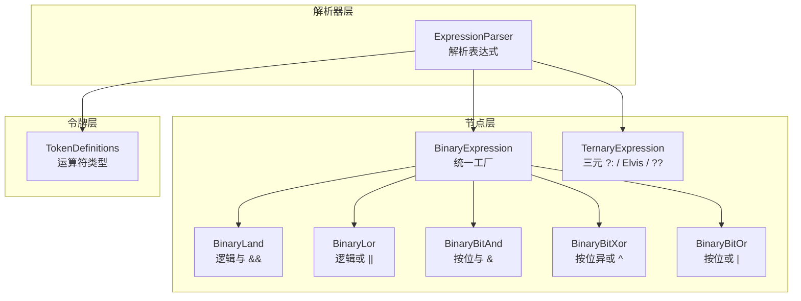
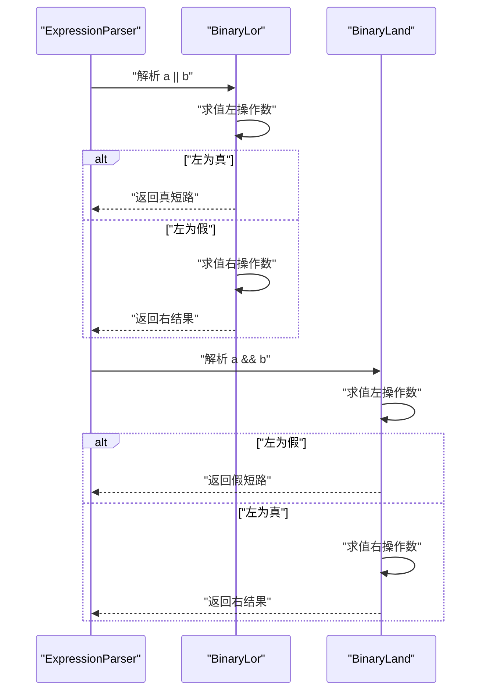
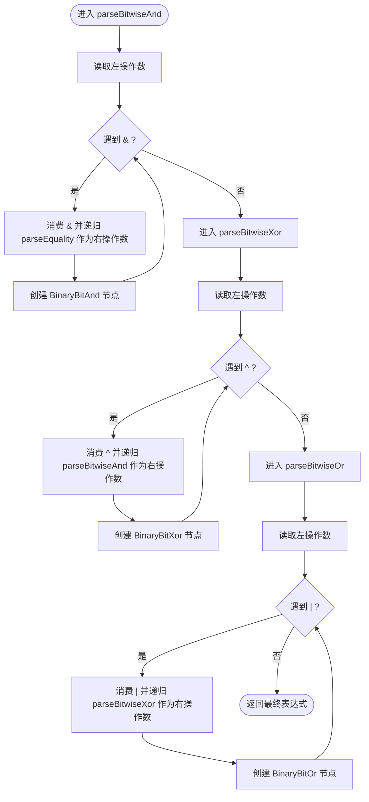
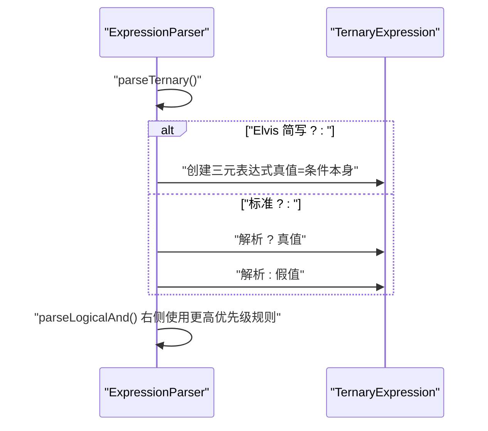
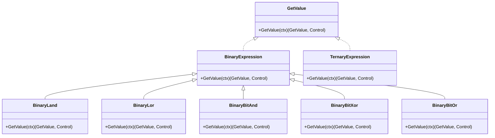
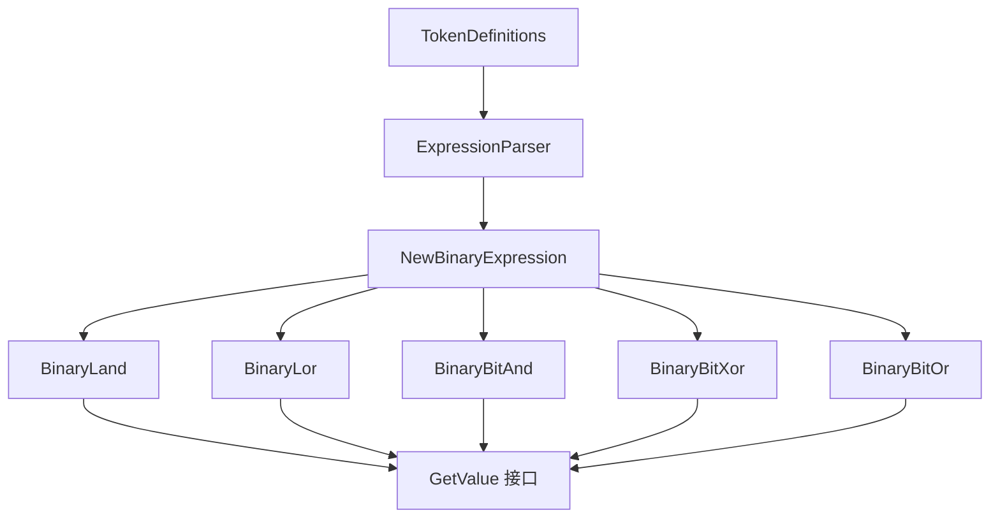

# 逻辑表达式解析

<cite>
**本文档引用的文件**
- [expression_parser.go](file://parser/expression_parser.go)
- [binary_land.go](file://node/binary_land.go)
- [binary_lor.go](file://node/binary_lor.go)
- [binary_bitwise.go](file://node/binary_bitwise.go)
- [binary.go](file://node/binary.go)
- [ternary.go](file://node/ternary.go)
- [token.go](file://token/token.go)
- [node.go](file://data/node.go)
</cite>

## 目录
1. [引言](#引言)
2. [项目结构](#项目结构)
3. [核心组件](#核心组件)
4. [架构总览](#架构总览)
5. [详细组件分析](#详细组件分析)
6. [依赖分析](#依赖分析)
7. [性能考虑](#性能考虑)
8. [故障排查指南](#故障排查指南)
9. [结论](#结论)

## 引言
本文件面向“逻辑表达式解析器”的技术文档，系统阐述以下内容：
- 逻辑运算符（逻辑或 ||、逻辑与 &&）与按位运算符（&、^、|）的解析顺序与优先级处理机制
- 短路求值的实现原理与行为边界
- 逻辑运算符与三元运算符（?:、??、Elvis）的优先级关系
- 按位运算符的解析流程与 AST 表示
- 逻辑表达式在 AST 中的表示方式，以及与比较表达式的优先级关系

## 项目结构
围绕逻辑表达式解析的关键代码分布在如下模块：
- 解析器层：负责词法标记识别与语法树构建
- 节点层：负责表达式节点的求值与短路控制
- 令牌层：提供运算符类型与字面量映射

**图表来源**
- [expression_parser.go:226-280](file://parser/expression_parser.go#L226-L280)
- [binary.go:13-95](file://node/binary.go#L13-L95)
- [binary_land.go:21-48](file://node/binary_land.go#L21-L48)
- [binary_lor.go:21-48](file://node/binary_lor.go#L21-L48)
- [binary_bitwise.go:24-145](file://node/binary_bitwise.go#L24-L145)
- [ternary.go:25-67](file://node/ternary.go#L25-L67)
- [token.go:106-167](file://token/token.go#L106-L167)

**章节来源**
- [expression_parser.go:226-280](file://parser/expression_parser.go#L226-L280)
- [binary.go:13-95](file://node/binary.go#L13-L95)
- [binary_land.go:21-48](file://node/binary_land.go#L21-L48)
- [binary_lor.go:21-48](file://node/binary_lor.go#L21-L48)
- [binary_bitwise.go:24-145](file://node/binary_bitwise.go#L24-L145)
- [ternary.go:25-67](file://node/ternary.go#L25-L67)
- [token.go:106-167](file://token/token.go#L106-L167)

## 核心组件
- 表达式解析器（ExpressionParser）：按优先级逐步下降的方式解析表达式，维护跟踪器以生成 AST 节点位置信息。
- 二元表达式工厂（NewBinaryExpression）：根据运算符类型创建具体节点（逻辑与/或、按位与/异或/或等）。
- 逻辑与/或节点（BinaryLand、BinaryLor）：实现短路求值。
- 按位与/异或/或节点（BinaryBitAnd、BinaryBitXor、BinaryBitOr）：严格要求整型操作数。
- 三元表达式节点（TernaryExpression）：支持 ?:、Elvis（?:）与 ??。

**章节来源**
- [expression_parser.go:226-280](file://parser/expression_parser.go#L226-L280)
- [binary.go:13-95](file://node/binary.go#L13-L95)
- [binary_land.go:21-48](file://node/binary_land.go#L21-L48)
- [binary_lor.go:21-48](file://node/binary_lor.go#L21-L48)
- [binary_bitwise.go:24-145](file://node/binary_bitwise.go#L24-L145)
- [ternary.go:25-67](file://node/ternary.go#L25-L67)

## 架构总览
解析器采用递归下降子程序风格，优先级由高到低依次为：
- 比较表达式（<、<=、>、>=）与相等性（==、!=、===、!==、like）
- 位移（<<、>>）
- 加减（+、-）
- 乘除模（*、/、%）
- 按位与（&）、按位异或（^）、按位或（|）
- 逻辑与（&&）
- 逻辑或（||）
- 字符串连接（.）
- 三元运算符（?:、Elvis、??）
- 赋值（=、+=、-=、*=、/=、%=、.=、<<=、>>=、&=、^=、|=、??=、**=）

其中：
- 逻辑与（&&）优先级高于三元运算符（?:），解析右侧时使用更高优先级的表达式子规则，避免误解析为“先三元再逻辑与”。
- 按位与/异或/或与逻辑与/或之间存在明确优先级分界，保证“比较 < 按位 < 逻辑与 < 逻辑或”。

**图表来源**
- [expression_parser.go:396-454](file://parser/expression_parser.go#L396-L454)
- [expression_parser.go:322-394](file://parser/expression_parser.go#L322-L394)
- [expression_parser.go:226-280](file://parser/expression_parser.go#L226-L280)
- [expression_parser.go:200-224](file://parser/expression_parser.go#L200-L224)
- [expression_parser.go:35-97](file://parser/expression_parser.go#L35-L97)

**章节来源**
- [expression_parser.go:396-454](file://parser/expression_parser.go#L396-L454)
- [expression_parser.go:322-394](file://parser/expression_parser.go#L322-L394)
- [expression_parser.go:226-280](file://parser/expression_parser.go#L226-L280)
- [expression_parser.go:200-224](file://parser/expression_parser.go#L200-L224)
- [expression_parser.go:35-97](file://parser/expression_parser.go#L35-L97)

## 详细组件分析

### 逻辑或（||）与逻辑与（&&）解析与短路求值
- 解析顺序：parseLogicalOr -> parseLogicalAnd -> 更高层级表达式；逻辑或在循环中消费连续的 ||，每个连接点右侧再次进入 parseLogicalAnd，从而保证“与”的优先级更高。
- 短路求值：
  - 逻辑或（||）：若左侧为真，直接返回真，不再计算右侧。
  - 逻辑与（&&）：若左侧为假，直接返回假，不再计算右侧。
- 与三元运算符的优先级关系：解析 && 时，右侧使用更高优先级的表达式规则（如 parseBitwiseOr），确保“a && b ? c : d”被解析为“(a && b) ? c : d”，而非“a && (b ? c : d)”。

**图表来源**
- [expression_parser.go:226-280](file://parser/expression_parser.go#L226-L280)
- [binary_lor.go:21-48](file://node/binary_lor.go#L21-L48)
- [binary_land.go:21-48](file://node/binary_land.go#L21-L48)

**章节来源**
- [expression_parser.go:226-280](file://parser/expression_parser.go#L226-L280)
- [binary_lor.go:21-48](file://node/binary_lor.go#L21-L48)
- [binary_land.go:21-48](file://node/binary_land.go#L21-L48)

### 按位运算符（&、^、|）解析流程
- 优先级分层：按位与（&）在“比较/相等性”之后，“按位异或（^）”之后，“按位或（|）”之后，再进入“逻辑与（&&）”。解析器通过 parseBitwiseAnd -> parseBitwiseXor -> parseBitwiseOr 的顺序实现。
- 求值约束：
  - 按位与（&）、按位异或（^）、按位或（|）均要求左右操作数为整数类型，否则抛出类型错误。
- AST 表示：统一通过 NewBinaryExpression 工厂创建对应节点。

**图表来源**
- [expression_parser.go:322-394](file://parser/expression_parser.go#L322-L394)
- [binary_bitwise.go:24-145](file://node/binary_bitwise.go#L24-L145)
- [binary.go:13-95](file://node/binary.go#L13-L95)

**章节来源**
- [expression_parser.go:322-394](file://parser/expression_parser.go#L322-L394)
- [binary_bitwise.go:24-145](file://node/binary_bitwise.go#L24-L145)
- [binary.go:13-95](file://node/binary.go#L13-L95)

### 三元运算符（?:、Elvis、??）与逻辑运算符优先级
- 三元运算符（?:）：解析时先消费“?”，再分别解析真值与假值子表达式；若出现“Elvis（?:）”简写，则将真值替换为条件表达式本身。
- 空合并（??）：解析时消费“??”，再解析右操作数。
- 与逻辑与（&&）的优先级关系：解析 && 的右侧时，使用更高优先级的表达式规则（如 parseBitwiseOr），确保“a && b ? c : d”不被误解析为“a && (b ? c : d)”。
- 三元运算符（?:）与字符串连接（.）：三元运算符优先级低于字符串连接，因此“a . b ? c : d”会被解析为“(a . b) ? c : d”。

**图表来源**
- [expression_parser.go:99-198](file://parser/expression_parser.go#L99-L198)
- [ternary.go:25-67](file://node/ternary.go#L25-L67)

**章节来源**
- [expression_parser.go:99-198](file://parser/expression_parser.go#L99-L198)
- [ternary.go:25-67](file://node/ternary.go#L25-L67)

### AST 表示与数据流
- 统一接口：所有可求值节点实现 GetValue(ctx) 接口。
- 二元表达式工厂：根据运算符类型创建具体节点，如逻辑与/或、按位与/异或/或、字符串连接等。
- 数据流：节点 GetValue 先求值左子树，再根据运算符类型决定是否求值右子树（短路场景）。

**图表来源**
- [node.go:3-7](file://data/node.go#L3-L7)
- [binary.go:13-95](file://node/binary.go#L13-L95)
- [binary_land.go:21-48](file://node/binary_land.go#L21-L48)
- [binary_lor.go:21-48](file://node/binary_lor.go#L21-L48)
- [binary_bitwise.go:24-145](file://node/binary_bitwise.go#L24-L145)
- [ternary.go:25-67](file://node/ternary.go#L25-L67)

**章节来源**
- [node.go:3-7](file://data/node.go#L3-L7)
- [binary.go:13-95](file://node/binary.go#L13-L95)
- [binary_land.go:21-48](file://node/binary_land.go#L21-L48)
- [binary_lor.go:21-48](file://node/binary_lor.go#L21-L48)
- [binary_bitwise.go:24-145](file://node/binary_bitwise.go#L24-L145)
- [ternary.go:25-67](file://node/ternary.go#L25-L67)

## 依赖分析
- 解析器依赖令牌定义以识别运算符类型，并据此选择对应的解析子程序。
- 二元表达式工厂依赖令牌类型映射，将具体运算符映射到相应节点类型。
- 节点求值依赖 GetValue 接口，形成统一的数据访问与控制流返回机制。

**图表来源**
- [token.go:106-167](file://token/token.go#L106-L167)
- [expression_parser.go:226-280](file://parser/expression_parser.go#L226-L280)
- [binary.go:13-95](file://node/binary.go#L13-L95)
- [binary_land.go:21-48](file://node/binary_land.go#L21-L48)
- [binary_lor.go:21-48](file://node/binary_lor.go#L21-L48)
- [binary_bitwise.go:24-145](file://node/binary_bitwise.go#L24-L145)
- [node.go:3-7](file://data/node.go#L3-L7)

**章节来源**
- [token.go:106-167](file://token/token.go#L106-L167)
- [expression_parser.go:226-280](file://parser/expression_parser.go#L226-L280)
- [binary.go:13-95](file://node/binary.go#L13-L95)
- [binary_land.go:21-48](file://node/binary_land.go#L21-L48)
- [binary_lor.go:21-48](file://node/binary_lor.go#L21-L48)
- [binary_bitwise.go:24-145](file://node/binary_bitwise.go#L24-L145)
- [node.go:3-7](file://data/node.go#L3-L7)

## 性能考虑
- 递归下降解析的时间复杂度通常与表达式长度线性相关；短路求值可显著减少不必要的子表达式求值，降低整体开销。
- 按位运算要求整型输入，类型检查在节点求值阶段进行，避免在解析阶段引入额外分支成本。
- 三元运算符右侧使用更高优先级规则，有助于减少回溯与歧义处理。

## 故障排查指南
- 类型错误：按位运算符节点要求整型操作数，若类型不符将抛出错误。请确认左右操作数均为整数类型。
- 三元运算符缺失冒号：解析 ?: 时若缺少冒号，将报错提示缺少冒号。
- 优先级误判：若表达式出现“a && b ? c : d”被误解析为“a && (b ? c : d)”，请检查解析器右侧是否使用更高优先级规则（已内置）。
- 短路未生效：若期望短路但实际仍计算右侧，请检查左侧操作数的布尔化逻辑是否符合预期。

**章节来源**
- [binary_bitwise.go:34-41](file://node/binary_bitwise.go#L34-L41)
- [expression_parser.go:178-180](file://parser/expression_parser.go#L178-L180)
- [expression_parser.go:265-267](file://parser/expression_parser.go#L265-L267)

## 结论
本解析器通过清晰的优先级分层与短路求值策略，实现了对逻辑与/或、按位与/异或/或以及三元运算符的正确解析与求值。统一的二元表达式工厂与 GetValue 接口，使得新增运算符或扩展求值行为具备良好的可维护性与一致性。