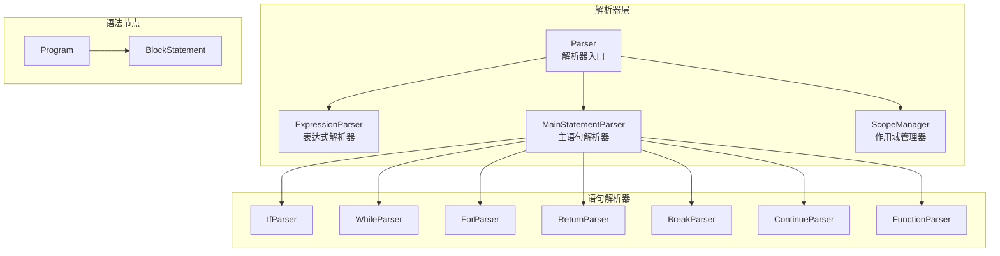
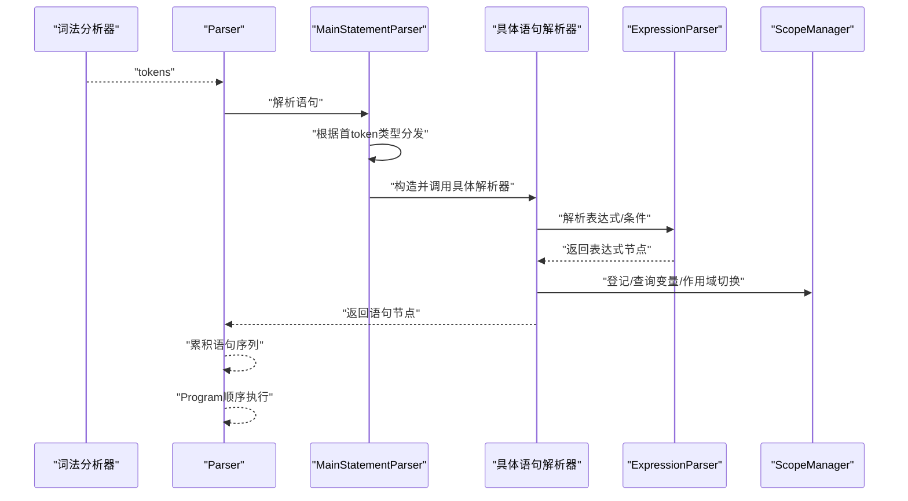
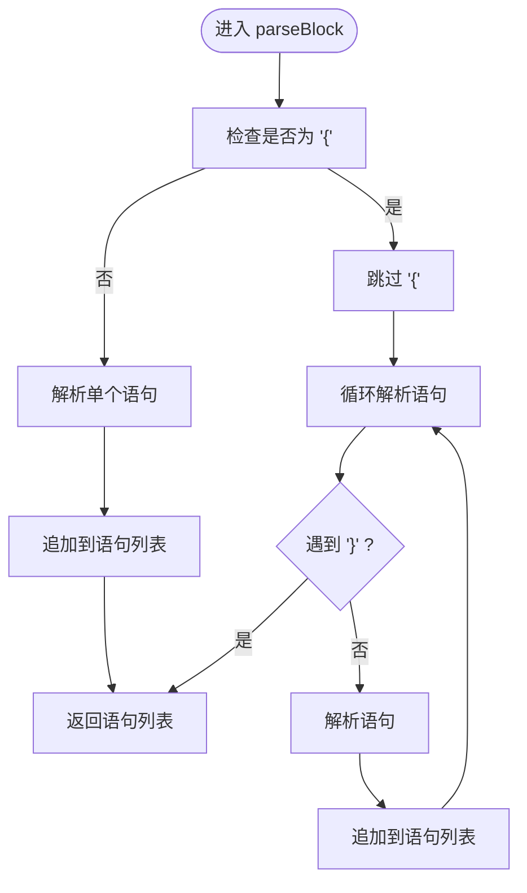
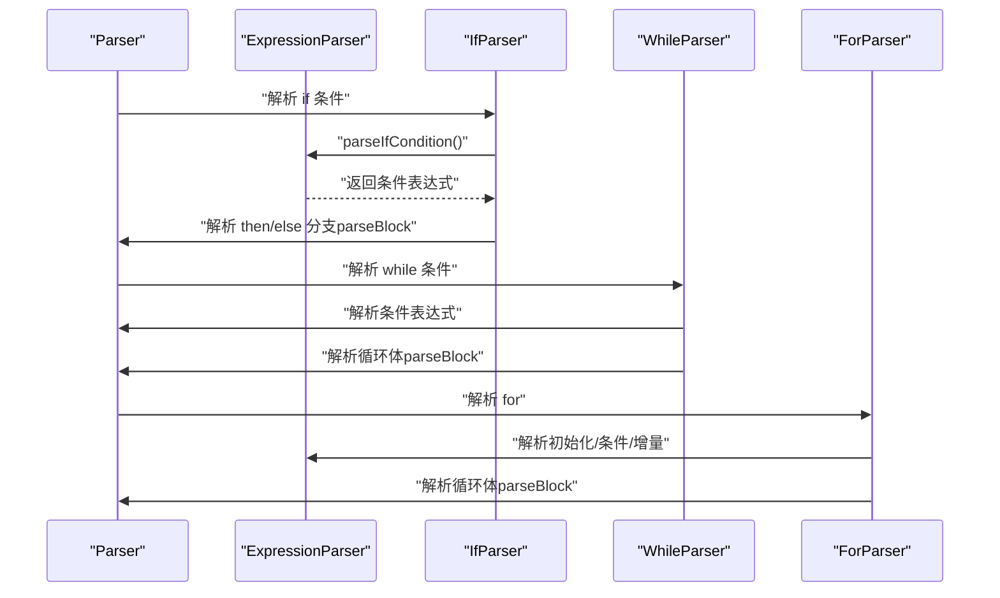
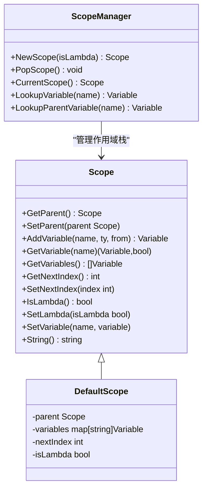
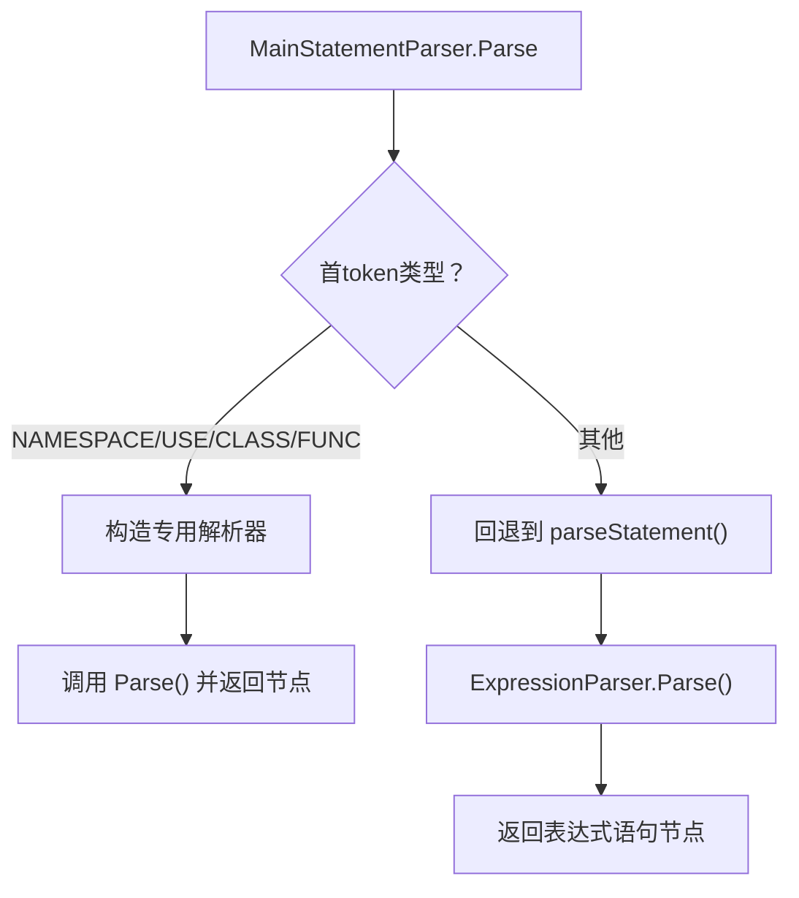
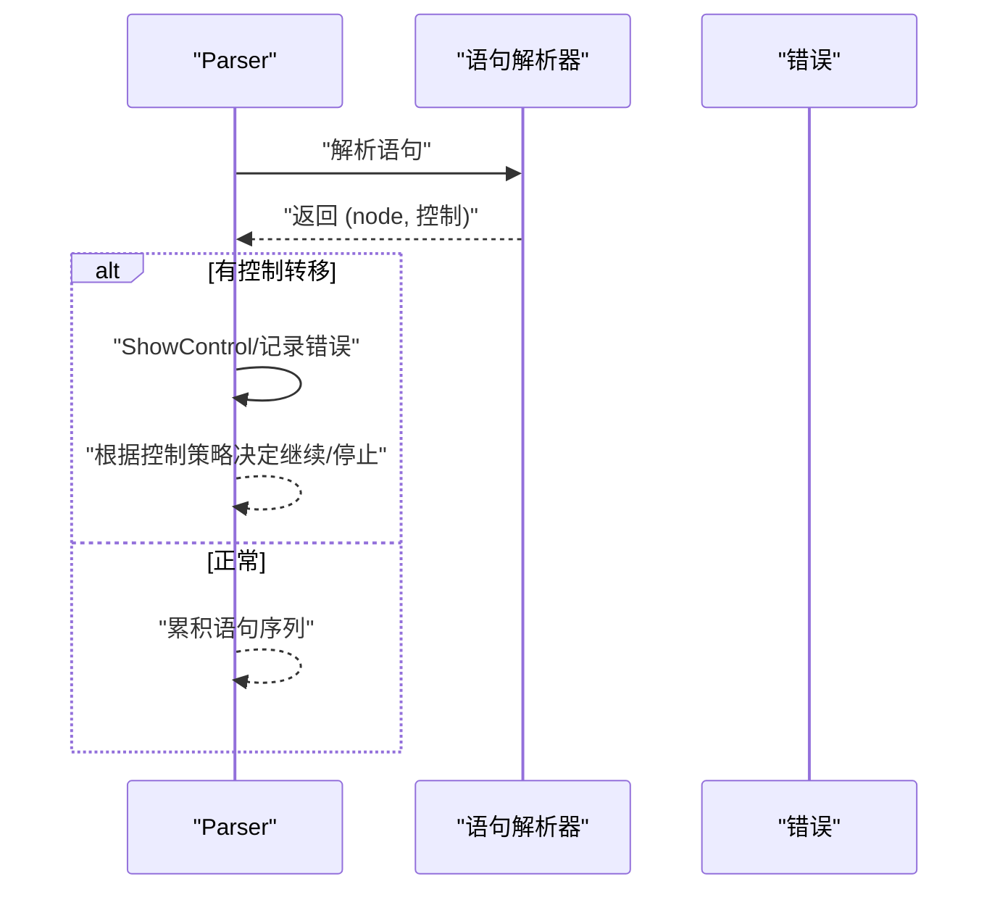
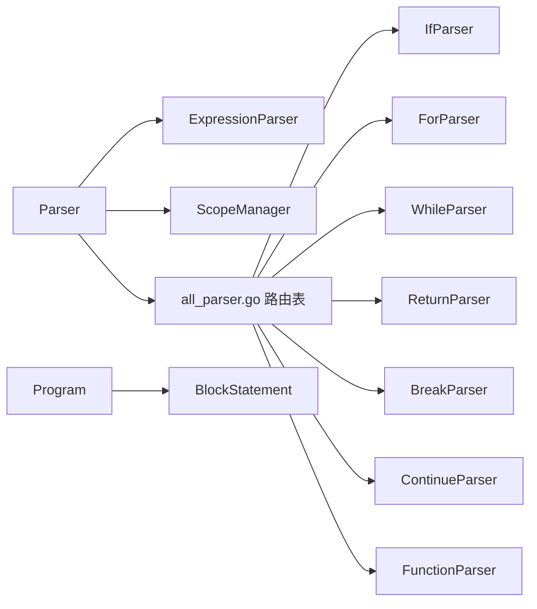

# 复合语句解析器

<cite>
**本文档引用的文件**
- [parser.go](file://parser/parser.go)
- [statement.go](file://parser/statement.go)
- [expression_parser.go](file://parser/expression_parser.go)
- [scope_manager.go](file://parser/scope_manager.go)
- [all_parser.go](file://parser/all_parser.go)
- [block.go](file://node/block.go)
- [node.go](file://node/node.go)
- [if_parser.go](file://parser/if_parser.go)
- [for_parser.go](file://parser/for_parser.go)
- [while_parser.go](file://parser/while_parser.go)
- [return_parser.go](file://parser/return_parser.go)
- [continue_parser.go](file://parser/continue_parser.go)
- [break_parser.go](file://parser/break_parser.go)
- [function_parser.go](file://parser/function_parser.go)
</cite>

## 目录
1. [简介](#简介)
2. [项目结构](#项目结构)
3. [核心组件](#核心组件)
4. [架构总览](#架构总览)
5. [详细组件分析](#详细组件分析)
6. [依赖分析](#依赖分析)
7. [性能考量](#性能考量)
8. [故障排查指南](#故障排查指南)
9. [结论](#结论)
10. [附录](#附录)

## 简介
本文件面向编译器开发者，系统化阐述复合语句解析器的设计与实现，覆盖以下主题：
- 语句块（block）的解析与执行边界
- 表达式语句与语句序列的处理机制
- 复合语句的嵌套解析与作用域边界管理
- 语句解析器的调度机制、错误传播与恢复策略
- 复合语句在不同上下文中的行为差异与性能考虑
- 扩展接口与自定义语句类型的实现方法

目标是帮助读者快速理解并扩展复合语句解析能力，同时在工程实践中获得可操作的优化建议。

## 项目结构
复合语句解析位于解析器模块（parser）与语法节点模块（node）之间，采用“解析器路由 + 语句解析器”的分发模式，结合作用域管理器完成变量作用域与捕获的维护。

图表来源
- [parser.go:17-50](file://parser/parser.go#L17-L50)
- [statement.go:8-45](file://parser/statement.go#L8-L45)
- [expression_parser.go:14-24](file://parser/expression_parser.go#L14-L24)
- [scope_manager.go:64-100](file://parser/scope_manager.go#L64-L100)
- [all_parser.go:13-79](file://parser/all_parser.go#L13-L79)
- [block.go:5-17](file://node/block.go#L5-L17)
- [node.go:30-42](file://node/node.go#L30-L42)

章节来源
- [parser.go:17-50](file://parser/parser.go#L17-L50)
- [statement.go:8-45](file://parser/statement.go#L8-L45)
- [all_parser.go:13-79](file://parser/all_parser.go#L13-L79)

## 核心组件
- 解析器入口与调度
  - Parser：持有词法单元流、作用域管理器、表达式解析器，负责整体解析流程与错误收集。
  - MainStatementParser：根据当前词法单元类型分发到具体语句解析器。
  - StatementParser 接口与解析器路由表：统一调度不同语句类型（if/for/while/return/...）。
- 语句块与程序执行
  - BlockStatement：承载语句序列，作为复合语句的基本容器。
  - Program：顶层程序节点，顺序执行语句序列并处理控制转移。
- 表达式解析与语句边界
  - ExpressionParser：表达式优先级解析链，支撑表达式语句与条件判断。
- 作用域管理
  - ScopeManager：作用域栈、变量登记与查询，支持闭包捕获与lambda作用域标记。

章节来源
- [parser.go:17-50](file://parser/parser.go#L17-L50)
- [statement.go:8-45](file://parser/statement.go#L8-L45)
- [all_parser.go:8-79](file://parser/all_parser.go#L8-L79)
- [block.go:5-22](file://node/block.go#L5-L22)
- [node.go:30-98](file://node/node.go#L30-L98)
- [scope_manager.go:64-100](file://parser/scope_manager.go#L64-L100)

## 架构总览
复合语句解析遵循“词法 -> 语句 -> 作用域 -> 节点”的流水线：
- 词法分析完成后，Parser 逐个消费 token。
- MainStatementParser 根据首 token 类型选择对应语句解析器。
- 语句解析器内部可递归调用 parseBlock 或 parseStatement，形成嵌套复合结构。
- 作用域管理器贯穿函数、闭包、循环、条件等复合结构，维护变量可见性与捕获映射。
- Program 负责顺序执行语句序列，处理 return/goto/continue/break 等控制转移。

图表来源
- [parser.go:368-378](file://parser/parser.go#L368-L378)
- [statement.go:20-45](file://parser/statement.go#L20-L45)
- [expression_parser.go:26-33](file://parser/expression_parser.go#L26-L33)
- [scope_manager.go:80-95](file://parser/scope_manager.go#L80-L95)

## 详细组件分析

### 语句块（BlockStatement）与语句序列
- 语句块解析
  - parseBlock：遇到左花括号即进入块解析；否则解析单个语句。
  - 块内循环解析每个语句，跳过分号分隔符；遇到右花括号结束。
- 语句序列
  - parseProgram：遍历 tokens，逐条调用 parseStatement，累积到 Program。
  - Program.GetValue：顺序执行每条语句，处理 return/goto/continue/break 等控制转移。

图表来源
- [parser.go:426-470](file://parser/parser.go#L426-L470)

章节来源
- [parser.go:426-470](file://parser/parser.go#L426-L470)
- [node.go:44-98](file://node/node.go#L44-L98)

### 表达式语句与条件处理
- 表达式语句
  - parseStatement：默认委托给 ExpressionParser.Parse，从而支持表达式语句（如赋值、函数调用等）。
- 表达式解析优先级链
  - ExpressionParser 提供从高到低的解析链：赋值、三元/空合并、字符串连接、逻辑或、逻辑与、比较、位移、加减、乘除、一元、primary 等。
  - 通过 StartTracking/EndBefore 维护节点位置信息，保证 AST 精确映射源码范围。
- 条件解析（if/while/for）
  - IfParser：支持括号形式与分号分隔形式（类似 for 的 init; condition; increment）。
  - WhileParser：解析条件与循环体。
  - ForParser：既支持传统 for，也支持“for $k,$v in $arr”语法，内部转换为 foreach 语义。

图表来源
- [expression_parser.go:26-96](file://parser/expression_parser.go#L26-L96)
- [if_parser.go:96-167](file://parser/if_parser.go#L96-L167)
- [while_parser.go:21-52](file://parser/while_parser.go#L21-L52)
- [for_parser.go:23-199](file://parser/for_parser.go#L23-L199)

章节来源
- [parser.go:368-378](file://parser/parser.go#L368-L378)
- [expression_parser.go:26-96](file://parser/expression_parser.go#L26-L96)
- [if_parser.go:23-94](file://parser/if_parser.go#L23-L94)
- [while_parser.go:21-52](file://parser/while_parser.go#L21-L52)
- [for_parser.go:23-199](file://parser/for_parser.go#L23-L199)

### 嵌套解析与作用域边界管理
- 嵌套解析
  - 语句解析器在解析过程中可再次调用 parseBlock 或 parseStatement，形成任意深度的嵌套复合结构。
- 作用域边界
  - ScopeManager.NewScope/PopScope：在函数、闭包、循环、条件等结构中创建/弹出作用域。
  - 函数解析（FunctionParser）：创建新作用域，解析参数与函数体；闭包支持 use 捕获列表，按引用捕获时将变量替换为引用包装。
  - 闭包捕获映射：根据 use 列表建立子作用域变量到父作用域变量的索引映射，用于运行时变量捕获。

图表来源
- [scope_manager.go:64-100](file://parser/scope_manager.go#L64-L100)
- [scope_manager.go:102-144](file://parser/scope_manager.go#L102-L144)
- [function_parser.go:32-106](file://parser/function_parser.go#L32-L106)

章节来源
- [scope_manager.go:64-100](file://parser/scope_manager.go#L64-L100)
- [function_parser.go:32-106](file://parser/function_parser.go#L32-L106)

### 语句解析器调度机制
- 路由表
  - all_parser.go 定义了 token 类型到语句解析器构造函数的映射，支持 if/for/while/return/break/continue/goto/echo/try/throw/yield/match/switch/namespace/use/class/trait/interface/enum/abstract/final/new/clone/isset/unset/compact/fn/declare/include/… 等。
- 主语句解析
  - MainStatementParser.Parse：根据首 token 类型选择对应解析器；对于普通表达式语句，回退到通用解析路径。

图表来源
- [statement.go:20-45](file://parser/statement.go#L20-L45)
- [all_parser.go:13-79](file://parser/all_parser.go#L13-L79)

章节来源
- [statement.go:20-45](file://parser/statement.go#L20-L45)
- [all_parser.go:13-79](file://parser/all_parser.go#L13-L79)

### 错误传播与恢复策略
- 错误收集与展示
  - Parser.ShowControl：区分 ThrowValue 与普通节点错误，打印详细错误与堆栈；记录到 errors 列表。
  - parseProgram：遇到无法识别语句时返回错误；parseBlock：遇到无法识别的语句项返回错误。
- 恢复策略
  - 解析器在遇到错误时返回控制对象（data.Control），上层可选择继续推进或终止；Program 在执行阶段遇到控制转移时中断后续语句执行。

图表来源
- [parser.go:251-298](file://parser/parser.go#L251-L298)
- [parser.go:124-158](file://parser/parser.go#L124-L158)
- [parser.go:426-470](file://parser/parser.go#L426-L470)

章节来源
- [parser.go:251-298](file://parser/parser.go#L251-L298)
- [parser.go:124-158](file://parser/parser.go#L124-L158)
- [parser.go:426-470](file://parser/parser.go#L426-L470)

### 不同上下文中的行为差异
- 表达式语句 vs 语句块
  - 表达式语句在语句边界处被解析为表达式节点；语句块则强制以花括号界定，内部允许零个或多个语句。
- 条件上下文
  - if/while/for 的条件解析支持括号与分号分隔两种形式；for 的“for $k,$v in $arr”语法会被转换为 foreach 语义。
- 作用域上下文
  - 函数与闭包创建独立作用域；闭包 use 按引用捕获时，变量会被替换为引用包装，影响运行时读写行为。

章节来源
- [parser.go:368-378](file://parser/parser.go#L368-L378)
- [if_parser.go:96-167](file://parser/if_parser.go#L96-L167)
- [for_parser.go:28-108](file://parser/for_parser.go#L28-L108)
- [function_parser.go:32-106](file://parser/function_parser.go#L32-L106)

### 扩展接口与自定义语句类型实现
- 扩展步骤
  - 定义语句解析器：实现 StatementParser 接口（Parse 返回节点与控制）。
  - 注册路由：在 all_parser.go 的 parserRouter 中添加新 token 类型到解析器构造函数的映射。
  - 解析实现：在 Parse 中完成词法消费、子解析（如 parseBlock/parseStatement/ExpressionParser）与节点构造。
  - 作用域管理：如需新增作用域，使用 ScopeManager.NewScope/PopScope 管理变量登记与捕获。
- 示例参考
  - return/continue/break：最小实现，直接构造节点并返回。
  - if/for/while：复杂条件解析与块解析，体现嵌套与组合规则。
  - function：创建作用域、解析参数与函数体、处理闭包捕获映射。

章节来源
- [all_parser.go:8-79](file://parser/all_parser.go#L8-L79)
- [return_parser.go:21-59](file://parser/return_parser.go#L21-L59)
- [continue_parser.go:21-29](file://parser/continue_parser.go#L21-L29)
- [break_parser.go:21-29](file://parser/break_parser.go#L21-L29)
- [if_parser.go:23-94](file://parser/if_parser.go#L23-L94)
- [for_parser.go:23-199](file://parser/for_parser.go#L23-L199)
- [while_parser.go:21-52](file://parser/while_parser.go#L21-L52)
- [function_parser.go:23-155](file://parser/function_parser.go#L23-L155)

## 依赖分析
- 组件耦合
  - Parser 依赖 ExpressionParser、ScopeManager、路由表；语句解析器依赖 Parser 以复用工具方法与作用域。
  - Node 层（Program/BlockStatement）与 Parser 解析结果强关联，Program.GetValue 顺序执行语句。
- 外部依赖
  - 词法分析器（lexer）与 token 类型（token）为输入依赖。
  - 运行时 VM（data.VM）在错误展示与类/函数查找中参与。

图表来源
- [parser.go:17-50](file://parser/parser.go#L17-L50)
- [all_parser.go:13-79](file://parser/all_parser.go#L13-L79)
- [node.go:30-42](file://node/node.go#L30-L42)

章节来源
- [parser.go:17-50](file://parser/parser.go#L17-L50)
- [all_parser.go:13-79](file://parser/all_parser.go#L13-L79)
- [node.go:30-42](file://node/node.go#L30-L42)

## 性能考量
- 优先级解析链
  - ExpressionParser 的多层解析函数以“尾递归式”组合，避免重复扫描；合理利用 StartTracking/EndBefore 可减少不必要的回溯。
- 作用域管理
  - ScopeManager 使用 map 存储变量，查找与插入均为平均 O(1)；变量索引顺序化存储便于闭包捕获映射。
- 语句块解析
  - parseBlock 在遇到右花括号时提前结束，避免多余 token 消费；分号跳过逻辑减少无效节点生成。
- 错误处理
  - 错误以控制对象返回，上层可选择短路，避免无谓的后续解析；Parser.ShowControl 统一格式化输出，利于定位问题。

## 故障排查指南
- 常见错误场景
  - if/while/for 缺少括号或分号：检查对应解析器的括号/分号校验逻辑。
  - 无法识别语句：parseProgram 会在无法识别时抛出错误；检查路由表是否遗漏新 token 类型。
  - 语句块无法识别：parseBlock 对空语句块与非法 token 有明确错误提示。
- 定位手段
  - 使用 Parser.ShowControl 输出详细错误与堆栈；结合 Program 的顺序执行定位控制转移点。
  - 检查 ScopeManager 的作用域栈是否正确平衡（NewScope/PopScope 成对出现）。

章节来源
- [parser.go:251-298](file://parser/parser.go#L251-L298)
- [parser.go:124-158](file://parser/parser.go#L124-L158)
- [parser.go:426-470](file://parser/parser.go#L426-L470)

## 结论
复合语句解析器通过“解析器路由 + 语句解析器 + 作用域管理 + 表达式优先级链”的协作，实现了对 PHP 风格复合语句的稳健解析。其设计具备良好的扩展性：新增语句类型只需实现 StatementParser 并注册路由；作用域管理与错误处理机制保障了解析与执行阶段的可控性。在工程实践中，应重视嵌套解析的边界管理、作用域的生命周期与错误的快速定位，以获得更高的稳定性与可维护性。

## 附录
- 关键流程图与类图已在相应章节中给出，便于对照源码理解实现细节。
- 如需进一步扩展，建议从“语句解析器接口 + 路由表 + 作用域管理”的最小可行实现入手，逐步引入更复杂的嵌套与控制流。