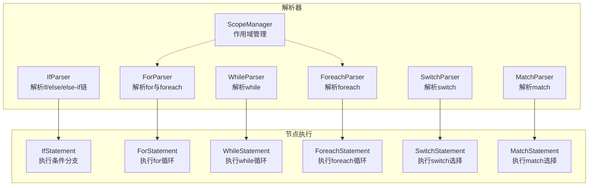
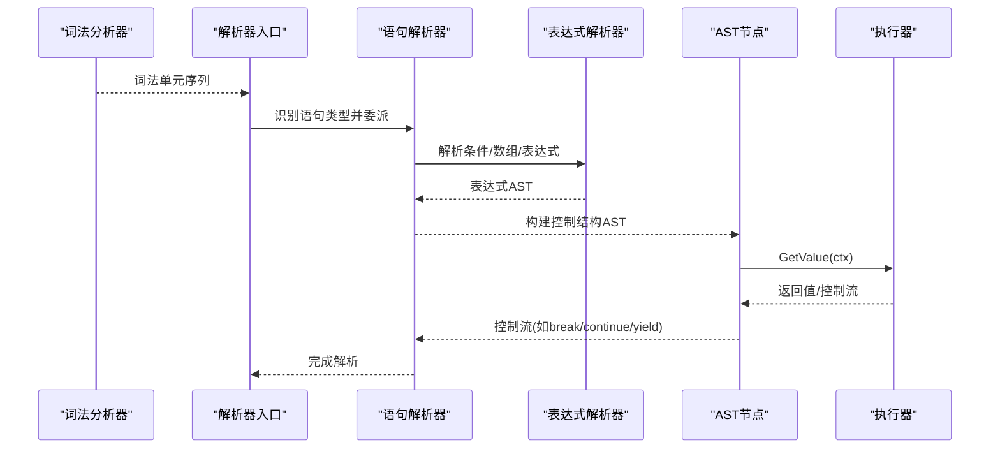
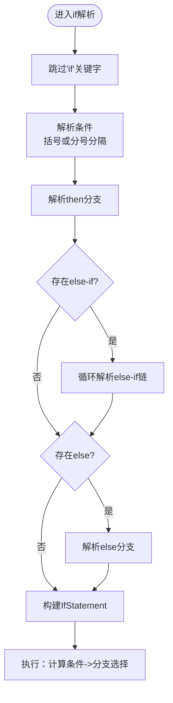
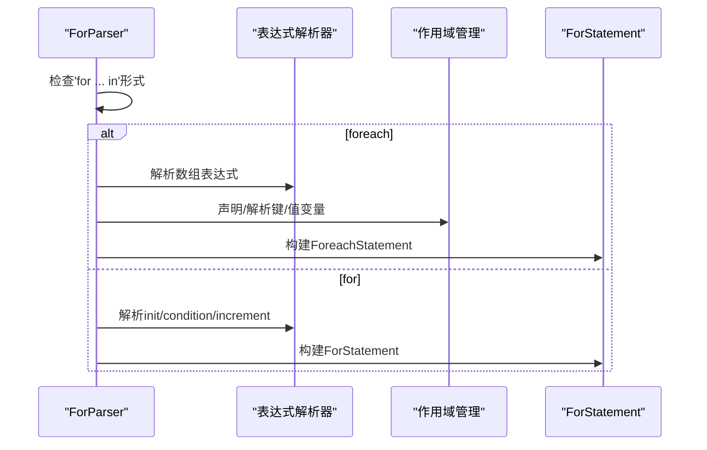
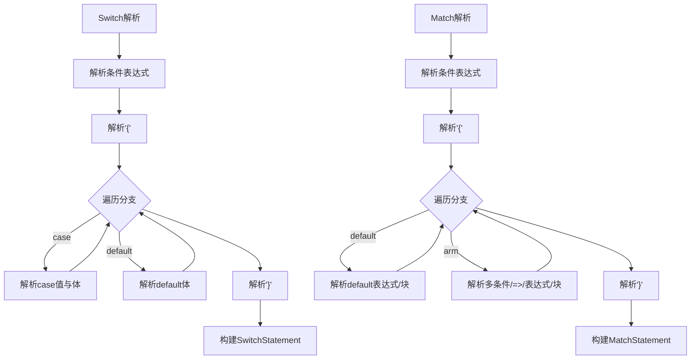
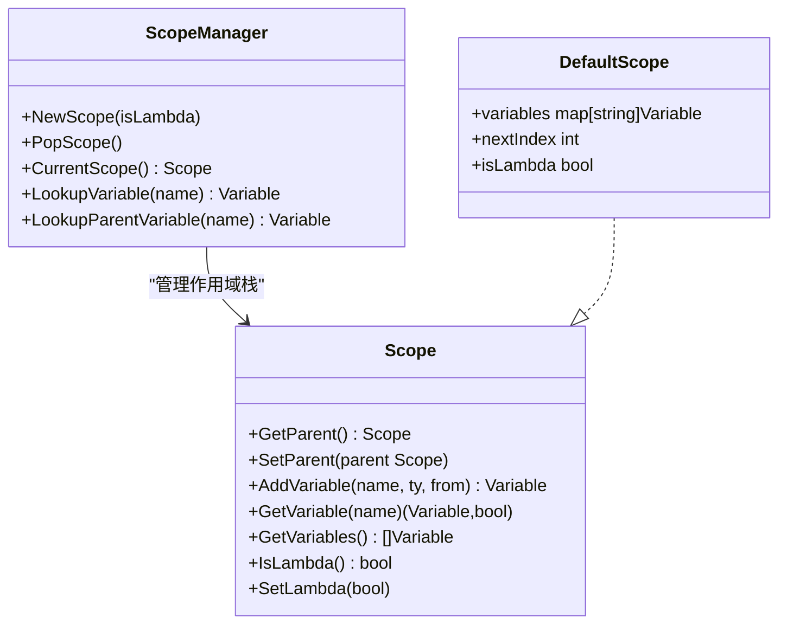
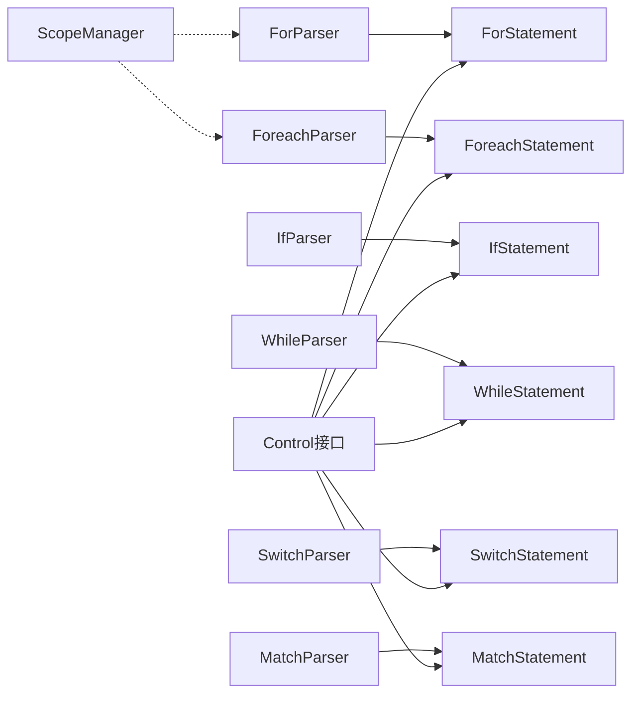

# 控制结构解析器

<cite>
**本文档引用的文件**
- [parser/if_parser.go](file://parser/if_parser.go)
- [parser/for_parser.go](file://parser/for_parser.go)
- [parser/foreach_parser.go](file://parser/foreach_parser.go)
- [parser/while_parser.go](file://parser/while_parser.go)
- [parser/switch_parser.go](file://parser/switch_parser.go)
- [parser/match_parser.go](file://parser/match_parser.go)
- [node/if.go](file://node/if.go)
- [node/for.go](file://node/for.go)
- [node/foreach.go](file://node/foreach.go)
- [node/while.go](file://node/while.go)
- [node/switch.go](file://node/switch.go)
- [node/match.go](file://node/match.go)
- [parser/scope_manager.go](file://parser/scope_manager.go)
- [data/control.go](file://data/control.go)
- [parser/statement.go](file://parser/statement.go)
- [parser/parser.go](file://parser/parser.go)
</cite>

## 目录
1. [简介](#简介)
2. [项目结构](#项目结构)
3. [核心组件](#核心组件)
4. [架构总览](#架构总览)
5. [详细组件分析](#详细组件分析)
6. [依赖关系分析](#依赖关系分析)
7. [性能考量](#性能考量)
8. [故障排查指南](#故障排查指南)
9. [结论](#结论)
10. [附录](#附录)

## 简介
本文件面向编译器开发者，系统化阐述控制结构解析器的设计与实现，覆盖条件语句（if/else/if-else链）、循环语句（for/while/foreach）、选择语句（switch/match）的解析流程、AST节点构建、作用域管理、嵌套处理、标签支持与错误恢复策略，并说明与表达式解析器的协作方式及PHP语法兼容性要点。

## 项目结构
控制结构解析位于解析器子模块，运行期执行位于节点子模块。解析阶段负责词法/语法分析与AST构建，运行阶段负责按AST执行控制流与求值。

**图表来源**
- [parser/if_parser.go:24-94](file://parser/if_parser.go#L24-L94)
- [parser/for_parser.go:24-198](file://parser/for_parser.go#L24-L198)
- [parser/foreach_parser.go:24-138](file://parser/foreach_parser.go#L24-L138)
- [parser/while_parser.go:22-51](file://parser/while_parser.go#L22-L51)
- [parser/switch_parser.go:24-72](file://parser/switch_parser.go#L24-L72)
- [parser/match_parser.go:25-87](file://parser/match_parser.go#L25-L87)
- [node/if.go:103-111](file://node/if.go#L103-L111)
- [node/for.go:88-96](file://node/for.go#L88-L96)
- [node/foreach.go:309-317](file://node/foreach.go#L309-L317)
- [node/while.go:60-66](file://node/while.go#L60-L66)
- [node/switch.go:44-51](file://node/switch.go#L44-L51)
- [node/match.go:43-50](file://node/match.go#L43-L50)

**章节来源**
- [parser/if_parser.go:1-167](file://parser/if_parser.go#L1-L167)
- [parser/for_parser.go:1-199](file://parser/for_parser.go#L1-L199)
- [parser/foreach_parser.go:1-139](file://parser/foreach_parser.go#L1-L139)
- [parser/while_parser.go:1-52](file://parser/while_parser.go#L1-L52)
- [parser/switch_parser.go:1-220](file://parser/switch_parser.go#L1-L220)
- [parser/match_parser.go:1-215](file://parser/match_parser.go#L1-L215)

## 核心组件
- 条件语句解析器：解析if/else/else-if链，支持括号与分号分隔两种条件形式。
- 循环语句解析器：解析for与foreach，支持多初始化/增量表达式、数组/迭代器遍历、生成器yield集成。
- 选择语句解析器：解析switch与match，支持case/default与多条件匹配、默认分支。
- 作用域管理器：维护变量声明、查找与lambda作用域隔离。
- 控制流接口：统一break/continue/goto/yield/exit等控制流语义。

**章节来源**
- [parser/if_parser.go:16-21](file://parser/if_parser.go#L16-L21)
- [parser/for_parser.go:16-21](file://parser/for_parser.go#L16-L21)
- [parser/foreach_parser.go:16-21](file://parser/foreach_parser.go#L16-L21)
- [parser/while_parser.go:14-19](file://parser/while_parser.go#L14-L19)
- [parser/switch_parser.go:16-21](file://parser/switch_parser.go#L16-L21)
- [parser/match_parser.go:18-22](file://parser/match_parser.go#L18-L22)
- [parser/scope_manager.go:64-100](file://parser/scope_manager.go#L64-L100)
- [data/control.go:12-61](file://data/control.go#L12-L61)

## 架构总览
解析器通过统一入口识别语句类型并委派至对应解析器；解析器在完成语法校验与AST构建后，交由节点执行器按控制流规则运行。

**图表来源**
- [parser/statement.go:20-45](file://parser/statement.go#L20-L45)
- [parser/if_parser.go:24-94](file://parser/if_parser.go#L24-L94)
- [parser/for_parser.go:24-198](file://parser/for_parser.go#L24-L198)
- [parser/foreach_parser.go:24-138](file://parser/foreach_parser.go#L24-L138)
- [parser/switch_parser.go:24-72](file://parser/switch_parser.go#L24-L72)
- [parser/match_parser.go:25-87](file://parser/match_parser.go#L25-L87)

## 详细组件分析

### 条件语句解析器（if/else/if-else链）
- 语法模式
  - 括号形式：if (condition) { ... }
  - 分号分隔形式：if init; condition; increment { ... }（兼容for风格）
- 解析流程
  - 跳过关键字，解析条件（括号或分号分隔）
  - 解析then分支为语句块
  - 循环解析else-if链，直至非else-if
  - 若存在else，解析else分支
  - 构建IfStatement AST节点
- AST节点执行
  - 计算条件值并转换为布尔
  - 优先执行then，否则依次尝试else-if，最后执行else（若存在）

**图表来源**
- [parser/if_parser.go:24-94](file://parser/if_parser.go#L24-L94)
- [parser/if_parser.go:96-166](file://parser/if_parser.go#L96-L166)
- [node/if.go:20-100](file://node/if.go#L20-L100)

**章节来源**
- [parser/if_parser.go:24-166](file://parser/if_parser.go#L24-L166)
- [node/if.go:103-111](file://node/if.go#L103-L111)

### 循环语句解析器（for/while/foreach）
- for解析
  - 识别是否为“for $v in $arr”形式并转为foreach解析
  - 否则解析三段式：init, condition, increment，均支持逗号分隔的多个表达式
  - 构建ForStatement AST节点
- while解析
  - 可选括号包裹条件
  - 构建WhileStatement AST节点
- foreach解析
  - 支持 as 与键值对（key => value），支持引用与解构目标
  - 支持数组、对象（属性遍历）、Iterator接口对象三种遍历路径
  - 构建ForeachStatement AST节点

**图表来源**
- [parser/for_parser.go:24-198](file://parser/for_parser.go#L24-L198)
- [parser/foreach_parser.go:24-138](file://parser/foreach_parser.go#L24-L138)
- [parser/while_parser.go:22-51](file://parser/while_parser.go#L22-L51)

**章节来源**
- [parser/for_parser.go:24-198](file://parser/for_parser.go#L24-L198)
- [parser/foreach_parser.go:24-138](file://parser/foreach_parser.go#L24-L138)
- [parser/while_parser.go:22-51](file://parser/while_parser.go#L22-L51)
- [node/for.go:5-76](file://node/for.go#L5-L76)
- [node/foreach.go:61-306](file://node/foreach.go#L61-L306)
- [node/while.go:5-50](file://node/while.go#L5-L50)

### 选择语句解析器（switch/match）
- switch解析
  - 支持括号条件或直接表达式
  - 解析{...}内case/default分支，支持冒号与代码块
  - 构建SwitchStatement AST节点
- match解析
  - 支持括号条件或直接表达式
  - 支持多条件组合（逗号分隔）、instanceof条件、default分支
  - 构建MatchStatement AST节点

**图表来源**
- [parser/switch_parser.go:24-72](file://parser/switch_parser.go#L24-L72)
- [parser/switch_parser.go:96-220](file://parser/switch_parser.go#L96-L220)
- [parser/match_parser.go:25-87](file://parser/match_parser.go#L25-L87)
- [parser/match_parser.go:112-215](file://parser/match_parser.go#L112-L215)

**章节来源**
- [parser/switch_parser.go:24-220](file://parser/switch_parser.go#L24-L220)
- [parser/match_parser.go:25-215](file://parser/match_parser.go#L25-L215)
- [node/switch.go:54-108](file://node/switch.go#L54-L108)
- [node/match.go:53-100](file://node/match.go#L53-L100)

### 作用域管理与变量解析
- 作用域栈：支持父子作用域与lambda作用域标记
- 变量声明：在当前作用域注册变量，返回变量索引与名称映射
- 变量查找：自底向上查找，支持父作用域回溯
- foreach/for中的变量解析：支持标识符、引用、解构目标等

**图表来源**
- [parser/scope_manager.go:64-100](file://parser/scope_manager.go#L64-L100)
- [parser/scope_manager.go:103-124](file://parser/scope_manager.go#L103-L124)
- [parser/scope_manager.go:116-135](file://parser/scope_manager.go#L116-L135)

**章节来源**
- [parser/scope_manager.go:64-203](file://parser/scope_manager.go#L64-L203)

### 与表达式解析器的协作
- 条件/数组/表达式解析统一由表达式解析器完成
- 语句解析器仅负责语法结构与边界识别（括号/分号/大括号）
- foreach/for中对变量的声明与解析通过作用域管理器与变量解析器配合

**章节来源**
- [parser/if_parser.go:121-166](file://parser/if_parser.go#L121-L166)
- [parser/for_parser.go:116-198](file://parser/for_parser.go#L116-L198)
- [parser/foreach_parser.go:36-138](file://parser/foreach_parser.go#L36-L138)

### PHP语法兼容性与扩展建议
- if/else-if/else链：完全支持
- for三段式：支持多init/多increment
- foreach：支持数组、对象、Iterator对象；支持引用与解构目标
- switch：支持case/default与冒号/块体
- match：支持多条件、instanceof、default
- 扩展点：新增控制结构时，遵循“语句解析器 -> AST节点 -> 执行器”的模式，确保作用域与控制流接口一致

**章节来源**
- [parser/if_parser.go:45-82](file://parser/if_parser.go#L45-L82)
- [parser/for_parser.go:110-198](file://parser/for_parser.go#L110-L198)
- [parser/foreach_parser.go:51-138](file://parser/foreach_parser.go#L51-L138)
- [parser/switch_parser.go:42-71](file://parser/switch_parser.go#L42-L71)
- [parser/match_parser.go:42-87](file://parser/match_parser.go#L42-L87)

## 依赖关系分析

**图表来源**
- [parser/if_parser.go:87-93](file://parser/if_parser.go#L87-L93)
- [parser/for_parser.go:190-196](file://parser/for_parser.go#L190-L196)
- [parser/foreach_parser.go:131-137](file://parser/foreach_parser.go#L131-L137)
- [parser/while_parser.go:46-50](file://parser/while_parser.go#L46-L50)
- [parser/switch_parser.go:66-71](file://parser/switch_parser.go#L66-L71)
- [parser/match_parser.go:81-86](file://parser/match_parser.go#L81-L86)
- [data/control.go:12-61](file://data/control.go#L12-L61)

**章节来源**
- [data/control.go:12-61](file://data/control.go#L12-L61)

## 性能考量
- 解析阶段避免重复扫描：三段式for解析中一次性读取逗号分隔的多个表达式，减少回溯成本。
- foreach执行优化：数组与Iterator路径分别处理，尽量减少反射调用次数。
- 控制流短路：条件判断与布尔转换在节点执行阶段统一处理，避免冗余计算。
- 作用域查找：变量表采用map存储，查找复杂度近似O(1)，建议保持变量名规范化以提升命中率。

## 故障排查指南
- 常见错误类型
  - 缺少括号：if/switch/match/foreach等缺少必要括号时抛出错误
  - 语法不匹配：分号/逗号/大括号位置错误
  - 变量非法：foreach中非变量/引用/解构目标
- 错误恢复策略
  - 解析器在检测到不匹配时返回错误控制，上层可选择继续或停止
  - 节点执行阶段遇到异常控制流（如throw）会中断当前执行并交由上层处理
- 调试技巧
  - 使用位置跟踪器定位错误范围
  - 在语句解析器中打印当前token类型与字面量，辅助定位问题
  - 对复杂表达式分步解析，逐步缩小问题范围

**章节来源**
- [parser/if_parser.go:98-117](file://parser/if_parser.go#L98-L117)
- [parser/switch_parser.go:75-94](file://parser/switch_parser.go#L75-L94)
- [parser/match_parser.go:89-109](file://parser/match_parser.go#L89-L109)
- [parser/foreach_parser.go:30-43](file://parser/foreach_parser.go#L30-L43)
- [parser/for_parser.go:112-140](file://parser/for_parser.go#L112-L140)
- [parser/parser.go:226-239](file://parser/parser.go#L226-L239)

## 结论
控制结构解析器通过清晰的职责划分与统一的AST/控制流接口，实现了对PHP控制结构的完整支持。解析器专注于语法与结构，节点执行器专注语义与控制流，二者协同保证了可扩展性与可维护性。开发者可在现有框架上便捷地扩展新的控制结构，并保持一致的错误处理与性能表现。

## 附录
- 与标签语句的支持
  - 控制流接口包含BreakControl/ContinueControl/GotoControl，可与标签配合实现跳转
  - 节点执行器在遇到break/continue时根据当前循环上下文决定行为
- 与生成器的集成
  - for/foreach在循环体内遇到yield时，会封装为对应的YieldControl并交由生成器状态机恢复执行

**章节来源**
- [data/control.go:12-61](file://data/control.go#L12-L61)
- [node/for.go:98-232](file://node/for.go#L98-L232)
- [node/foreach.go:319-431](file://node/foreach.go#L319-L431)