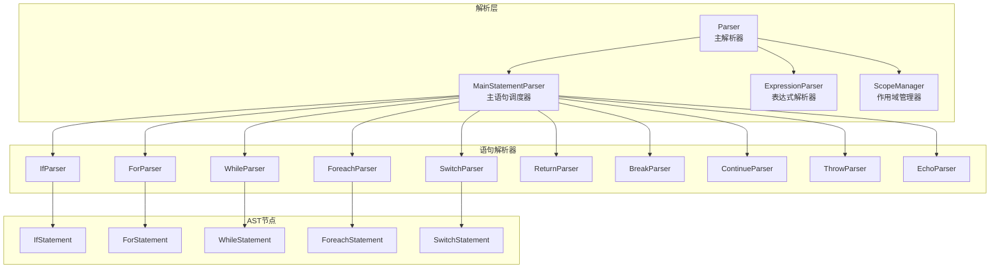
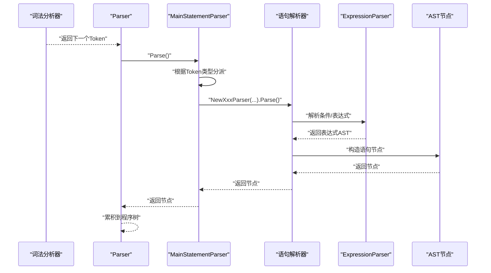
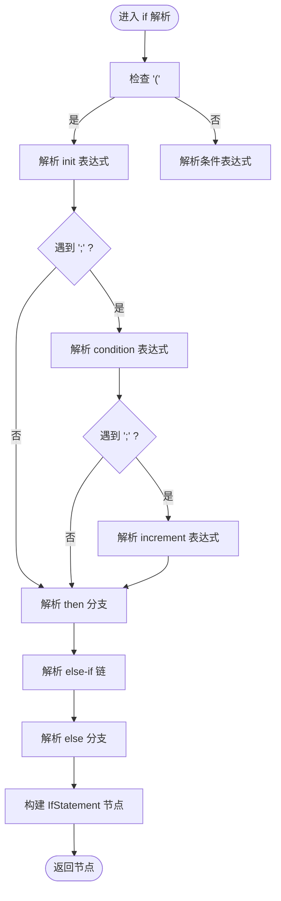
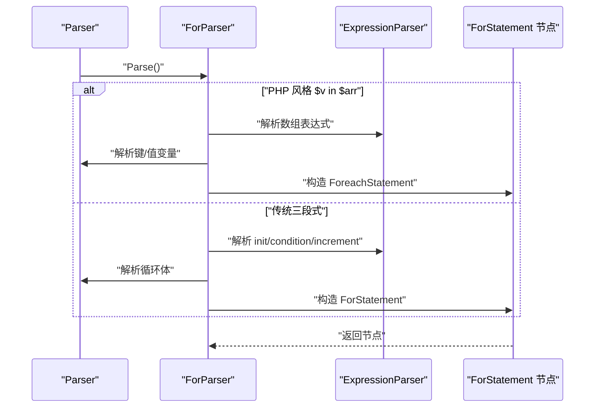
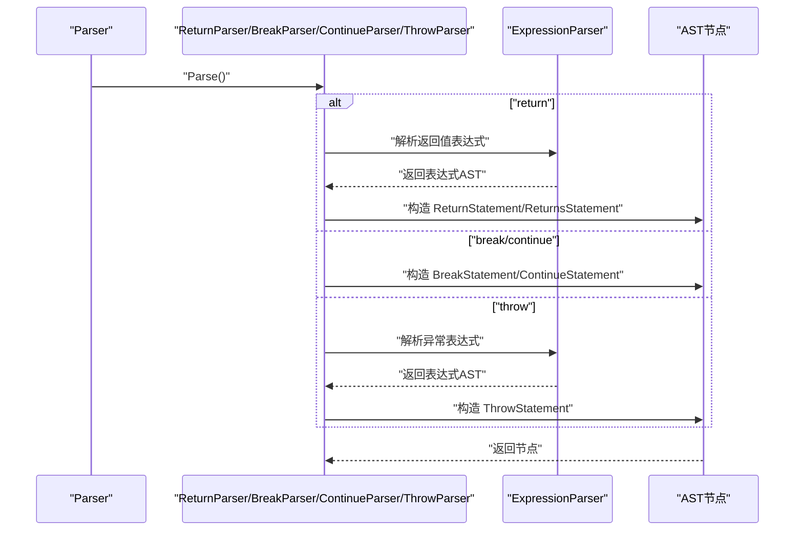
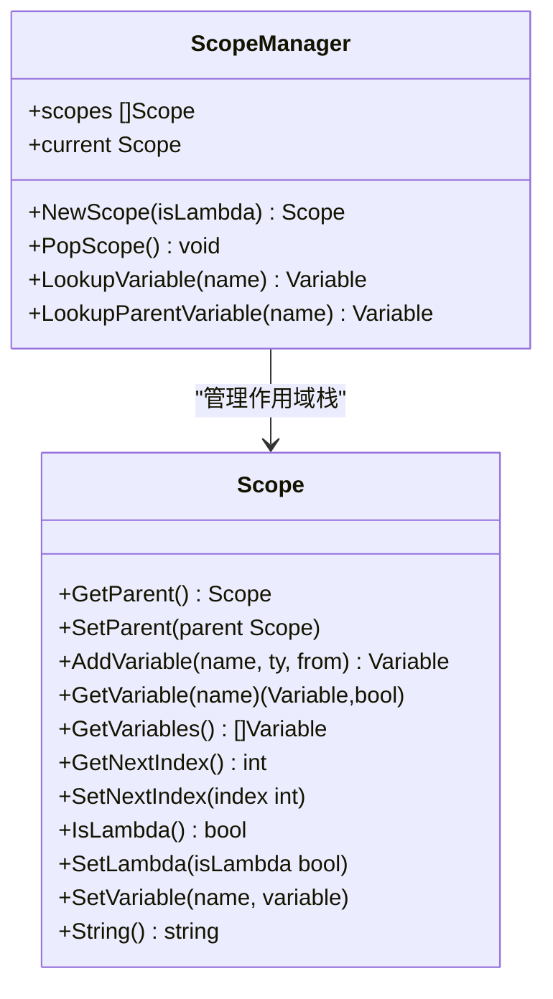
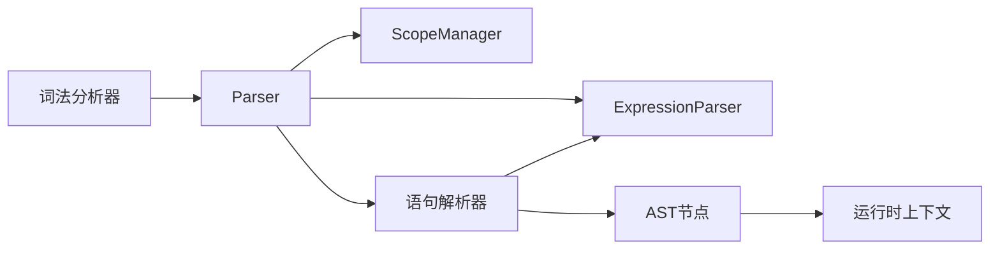

# 语句解析器

<cite>
**本文档引用的文件**
- [statement.go](file://parser/statement.go)
- [parser.go](file://parser/parser.go)
- [scope_manager.go](file://parser/scope_manager.go)
- [expression_parser.go](file://parser/expression_parser.go)
- [if_parser.go](file://parser/if_parser.go)
- [for_parser.go](file://parser/for_parser.go)
- [while_parser.go](file://parser/while_parser.go)
- [foreach_parser.go](file://parser/foreach_parser.go)
- [switch_parser.go](file://parser/switch_parser.go)
- [return_parser.go](file://parser/return_parser.go)
- [break_parser.go](file://parser/break_parser.go)
- [continue_parser.go](file://parser/continue_parser.go)
- [throw_parser.go](file://parser/throw_parser.go)
- [echo_parser.go](file://parser/echo_parser.go)
- [if.go](file://node/if.go)
- [for.go](file://node/for.go)
- [while.go](file://node/while.go)
- [foreach.go](file://node/foreach.go)
- [switch.go](file://node/switch.go)
</cite>

## 目录
1. [简介](#简介)
2. [项目结构](#项目结构)
3. [核心组件](#核心组件)
4. [架构总览](#架构总览)
5. [详细组件分析](#详细组件分析)
6. [依赖关系分析](#依赖关系分析)
7. [性能考虑](#性能考虑)
8. [故障排除指南](#故障排除指南)
9. [结论](#结论)
10. [附录](#附录)

## 简介
本文件系统化阐述语句解析器的设计与实现，覆盖控制结构解析、声明语句处理与复合语句构建。文档重点说明以下语句类型的解析流程：条件语句（if/else）、循环语句（for/while/foreach）、选择语句（switch/case）、跳转语句（return/break/continue/throw）与输出语句（echo/print）。同时，文档解释作用域管理、嵌套处理与错误恢复机制，给出与表达式解析器的协作方式，并提供扩展机制与调试技巧，帮助编译器开发者高效扩展与维护。

## 项目结构
语句解析器位于 parser 目录，采用“主解析器 + 语句专用解析器”的分层设计：
- 主解析器负责顶层语句调度与程序入口
- 语句专用解析器（如 if/for/while/switch/echo 等）各自处理特定语法
- 表达式解析器与语句解析器协同，语句内部的条件、数组、表达式均委托表达式解析器
- 作用域管理器贯穿语句解析，用于变量声明、查找与嵌套作用域维护



**图表来源**
- [statement.go:1-46](file://parser/statement.go#L1-L46)
- [parser.go:1-821](file://parser/parser.go#L1-L821)
- [expression_parser.go:1-755](file://parser/expression_parser.go#L1-L755)
- [scope_manager.go:1-203](file://parser/scope_manager.go#L1-L203)
- [if_parser.go:1-167](file://parser/if_parser.go#L1-L167)
- [for_parser.go:1-199](file://parser/for_parser.go#L1-L199)
- [while_parser.go:1-52](file://parser/while_parser.go#L1-L52)
- [foreach_parser.go:1-139](file://parser/foreach_parser.go#L1-L139)
- [switch_parser.go:1-220](file://parser/switch_parser.go#L1-L220)
- [return_parser.go:1-60](file://parser/return_parser.go#L1-L60)
- [break_parser.go:1-30](file://parser/break_parser.go#L1-L30)
- [continue_parser.go:1-30](file://parser/continue_parser.go#L1-L30)
- [throw_parser.go:1-48](file://parser/throw_parser.go#L1-L48)
- [echo_parser.go:1-46](file://parser/echo_parser.go#L1-L46)

**章节来源**
- [statement.go:1-46](file://parser/statement.go#L1-L46)
- [parser.go:1-821](file://parser/parser.go#L1-L821)

## 核心组件
- 主语句解析器（MainStatementParser）
  - 根据当前词法单元类型分派到具体语句解析器，或回退到通用表达式解析
- 主解析器（Parser）
  - 管理词法流、错误收集、作用域栈、表达式解析器实例
  - 提供 parseProgram、parseStatement、parseBlock 等高层解析入口
- 作用域管理器（ScopeManager）
  - 维护作用域栈，提供变量声明、查找与索引分配
- 表达式解析器（ExpressionParser）
  - 实现表达式优先级与语法特性（三元、空合并、instanceof、后缀++/--等）
  - 与语句解析器紧密协作，解析语句内的条件、数组、调用等

**章节来源**
- [statement.go:1-46](file://parser/statement.go#L1-L46)
- [parser.go:1-821](file://parser/parser.go#L1-L821)
- [scope_manager.go:1-203](file://parser/scope_manager.go#L1-L203)
- [expression_parser.go:1-755](file://parser/expression_parser.go#L1-L755)

## 架构总览
语句解析的整体流程如下：
- 主解析器读取词法单元，驱动主语句调度器
- 主语句调度器根据首词类型选择对应语句解析器
- 语句解析器内部调用表达式解析器解析条件、数组、返回值等
- 语句解析器构建 AST 节点并返回给上层
- 上层将语句节点组织为程序树



**图表来源**
- [statement.go:20-45](file://parser/statement.go#L20-L45)
- [parser.go:368-378](file://parser/parser.go#L368-L378)
- [expression_parser.go:26-33](file://parser/expression_parser.go#L26-L33)

**章节来源**
- [statement.go:20-45](file://parser/statement.go#L20-L45)
- [parser.go:368-378](file://parser/parser.go#L368-L378)

## 详细组件分析

### 条件语句解析（if/else）
- 语法支持
  - 标准 if (condition) {...}
  - else if / else 分支链
  - 分号分隔形式 if init; condition; increment {}
- 解析要点
  - 条件解析支持括号与分号分隔两种形式
  - then/else-if/else 分支均解析为语句块
  - 通过表达式解析器解析条件与表达式
- 运行时行为
  - 条件值转换为布尔后决定分支
  - else-if 链逐个求值，首个真值分支执行
  - 无匹配时执行 else 分支（若有）



**图表来源**
- [if_parser.go:23-94](file://parser/if_parser.go#L23-L94)
- [if_parser.go:96-167](file://parser/if_parser.go#L96-L167)

**章节来源**
- [if_parser.go:1-167](file://parser/if_parser.go#L1-L167)
- [if.go:1-112](file://node/if.go#L1-L112)

### 循环语句解析（for/while/foreach）
- for 循环
  - 支持传统三段式 for(init; condition; increment) body
  - 支持 PHP 风格 for ($v in $arr) 语法，内部转为 foreach
  - 初始化、条件、增量均支持逗号分隔的多表达式
- while 循环
  - 支持 while (condition) body
  - 条件解析由表达式解析器完成
- foreach 循环
  - 支持 foreach ($arr as $v) 与 foreach ($arr as $k => $v)
  - 支持引用传参与数组解构目标
  - 运行时支持数组、对象与 Iterator 接口



**图表来源**
- [for_parser.go:23-199](file://parser/for_parser.go#L23-L199)
- [foreach_parser.go:23-139](file://parser/foreach_parser.go#L23-L139)
- [while_parser.go:21-52](file://parser/while_parser.go#L21-L52)

**章节来源**
- [for_parser.go:1-199](file://parser/for_parser.go#L1-L199)
- [foreach_parser.go:1-139](file://parser/foreach_parser.go#L1-L139)
- [while_parser.go:1-52](file://parser/while_parser.go#L1-L52)
- [for.go:5-76](file://node/for.go#L5-L76)
- [foreach.go:52-306](file://node/foreach.go#L52-L306)
- [while.go:5-50](file://node/while.go#L5-L50)

### 选择语句解析（switch/case）
- 语法支持
  - switch (expr) { case expr: ...; ... default: ...; }
  - 支持 case 块与语句列表
- 解析要点
  - 条件表达式可带括号或直接表达式
  - 每个 case 解析其值与语句列表，遇到 break 时提前结束
  - default 分支可选
- 运行时行为
  - 依次计算 case 值，匹配成功后执行其语句列表
  - 未匹配且存在 default 时执行 default

```mermaid
flowchart TD
S(["进入 switch 解析"]) --> ParseCond["解析条件表达式"]
ParseCond --> ExpectBrace["期望 '{'"]
ExpectBrace --> LoopCases{"扫描 token"}
LoopCases --> |case| ParseCase["解析 case 值与语句"]
LoopCases --> |default| ParseDefault["解析 default 语句"]
LoopCases --> |'}'| BuildSW["构建 SwitchStatement"]
ParseCase --> LoopCases
ParseDefault --> LoopCases
BuildSW --> End(["返回节点"])
```

**图表来源**
- [switch_parser.go:23-72](file://parser/switch_parser.go#L23-L72)
- [switch_parser.go:96-163](file://parser/switch_parser.go#L96-L163)
- [switch_parser.go:165-220](file://parser/switch_parser.go#L165-L220)

**章节来源**
- [switch_parser.go:1-220](file://parser/switch_parser.go#L1-L220)
- [switch.go:35-108](file://node/switch.go#L35-L108)

### 跳转语句解析（return/break/continue/throw）
- return
  - 可选返回值表达式，支持多值返回（逗号分隔）
- break/continue
  - 简单标记语句，运行时由循环节点处理控制转移
- throw
  - 解析异常表达式，缺省时生成默认异常类型



**图表来源**
- [return_parser.go:21-59](file://parser/return_parser.go#L21-L59)
- [break_parser.go:20-29](file://parser/break_parser.go#L20-L29)
- [continue_parser.go:20-29](file://parser/continue_parser.go#L20-L29)
- [throw_parser.go:21-47](file://parser/throw_parser.go#L21-L47)

**章节来源**
- [return_parser.go:1-60](file://parser/return_parser.go#L1-L60)
- [break_parser.go:1-30](file://parser/break_parser.go#L1-L30)
- [continue_parser.go:1-30](file://parser/continue_parser.go#L1-L30)
- [throw_parser.go:1-48](file://parser/throw_parser.go#L1-L48)

### 输出语句解析（echo/print）
- echo
  - 支持逗号分隔的多个表达式，解析为 EchoStatement
- print
  - 作为表达式解析器中的关键字被处理，最终也归入表达式解析流程

**章节来源**
- [echo_parser.go:1-46](file://parser/echo_parser.go#L1-L46)
- [expression_parser.go:705-749](file://parser/expression_parser.go#L705-L749)

### 作用域管理与嵌套处理
- 作用域栈
  - 每个语句解析器在进入复合语句（如循环、if/else）时可创建新作用域
  - 变量声明通过作用域管理器登记，支持父子作用域查找
- 嵌套处理
  - 作用域栈深度与语句嵌套一一对应
  - 变量查找遵循“当前作用域优先，逐级向上”的规则
- 与语句解析的协作
  - foreach/for 等循环会声明临时变量，这些变量在循环结束后弹出作用域



**图表来源**
- [scope_manager.go:64-101](file://parser/scope_manager.go#L64-L101)
- [scope_manager.go:102-144](file://parser/scope_manager.go#L102-L144)

**章节来源**
- [scope_manager.go:1-203](file://parser/scope_manager.go#L1-L203)

### 与表达式解析器的协调
- 表达式解析器负责：
  - 三元运算符、空合并、instanceof、后缀++/-- 等语法特性
  - 插值字符串、JS_SERVER 等特殊表达式
- 语句解析器在以下场景调用表达式解析器：
  - if/while/switch 条件
  - for 循环 init/condition/increment
  - foreach 数组与键/值变量
  - return 多值返回
  - throw 异常表达式
- 位置信息与错误传播
  - 通过 StartTracking/FromCurrentToken 等工具确保错误定位精确
  - 表达式解析器返回的错误会透传至主解析器统一处理

**章节来源**
- [expression_parser.go:26-33](file://parser/expression_parser.go#L26-L33)
- [parser.go:588-590](file://parser/parser.go#L588-L590)

## 依赖关系分析
- 主解析器依赖
  - 词法分析器：提供 Token 流
  - 表达式解析器：解析语句内表达式
  - 作用域管理器：维护变量与作用域
- 语句解析器依赖
  - 主解析器：获取 Token、调用表达式解析器、维护位置信息
  - 表达式解析器：解析条件与数组
- AST 节点依赖
  - 运行时上下文：GetValue 执行语句节点
  - 控制转移：break/continue/return/throw 的控制对象



**图表来源**
- [parser.go:17-34](file://parser/parser.go#L17-L34)
- [statement.go:3-6](file://parser/statement.go#L3-L6)
- [expression_parser.go:14-24](file://parser/expression_parser.go#L14-L24)

**章节来源**
- [parser.go:1-821](file://parser/parser.go#L1-L821)

## 性能考虑
- 词法与语法分离
  - 词法分析器一次性生成 Token 列表，解析阶段只需顺序消费，减少重复扫描
- 递归下降解析
  - 语法规则清晰，便于优化与缓存中间结果
- 表达式优先级与短路
  - 三元、逻辑与/或、空合并等运算符的解析顺序与短路行为减少不必要的求值
- 作用域局部化
  - 变量索引与查找集中在当前作用域，降低全局查找开销

## 故障排除指南
- 常见错误类型
  - 缺少括号/分号：如 if/switch/foreach 缺少括号或冒号
  - 语法不匹配：如 for 循环三段式格式错误
  - 变量未定义：作用域查找失败
- 错误定位与报告
  - 使用 StartTracking/FromCurrentToken 获取精确位置
  - 错误统一通过 ShowControl 输出，包含堆栈信息
- 调试建议
  - 在语句解析器入口与关键分支处打印 Token 类型与位置
  - 对表达式解析器返回的 ACL 进行显式检查
  - 使用最小可复现样例逐步缩小问题范围

**章节来源**
- [parser.go:251-298](file://parser/parser.go#L251-L298)
- [parser.go:368-378](file://parser/parser.go#L368-L378)

## 结论
本语句解析器以主解析器为核心，通过语句专用解析器实现对各类控制结构与声明语句的细粒度处理，并与表达式解析器紧密协作，确保复杂表达式在语句上下文中的正确解析。作用域管理器贯穿始终，保障变量声明与查找的准确性。整体设计具备良好的扩展性与可维护性，适合进一步引入更多语句类型与语法特性。

## 附录
- 扩展机制
  - 新增语句类型：新增语句解析器，注册到主语句调度器
  - 新增关键字：在表达式解析器中扩展关键字路由
  - 新增作用域需求：在相应语句解析器中调用 NewScope/PopScope
- 调试技巧
  - 在 parseStatement/parseBlock 中打印当前 Token 类型
  - 对每个语句解析器的 Parse 方法增加日志，记录进入/退出与关键分支
  - 使用测试用例覆盖边界情况（空循环体、多值 return、嵌套 switch 等）