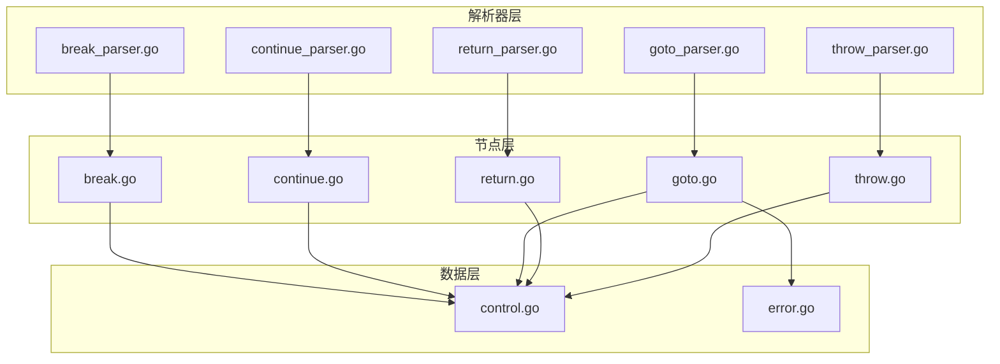
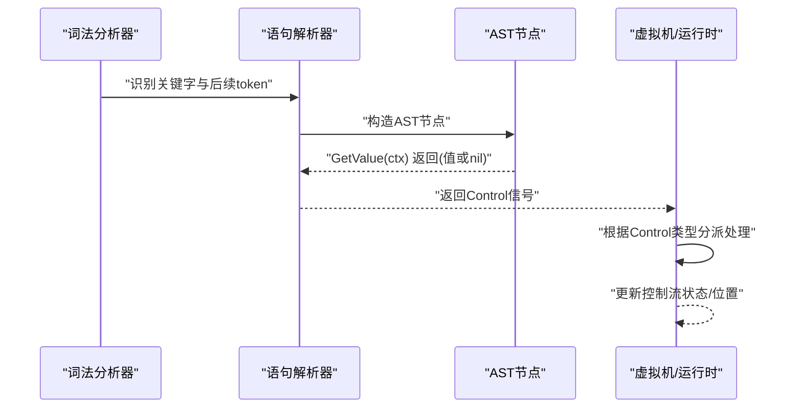
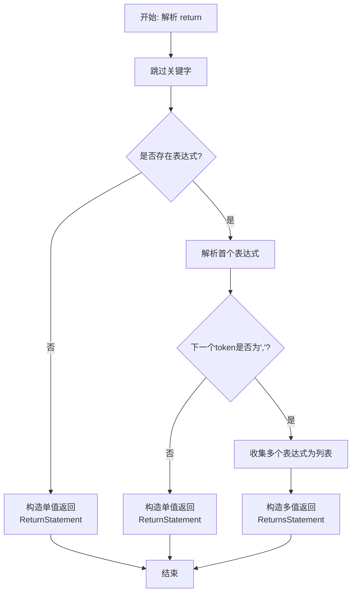
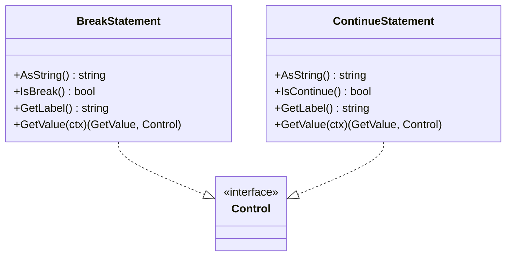
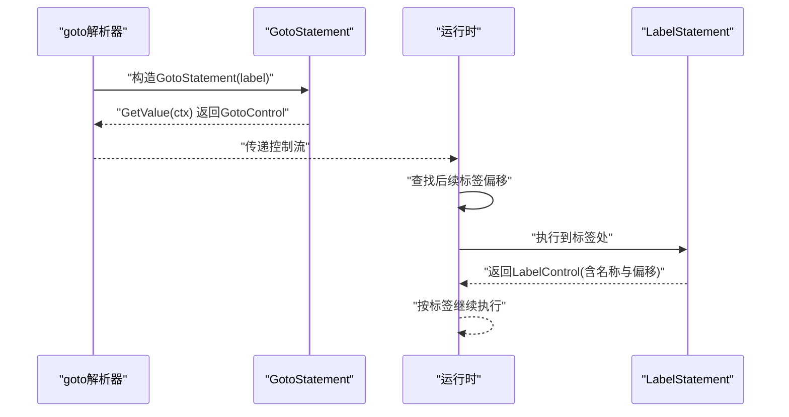
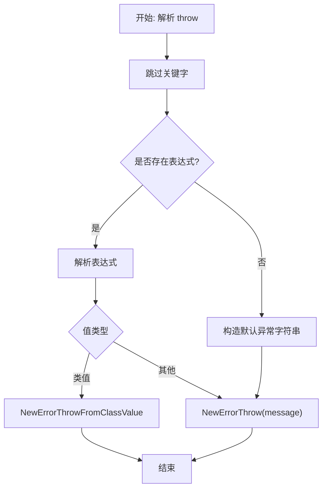
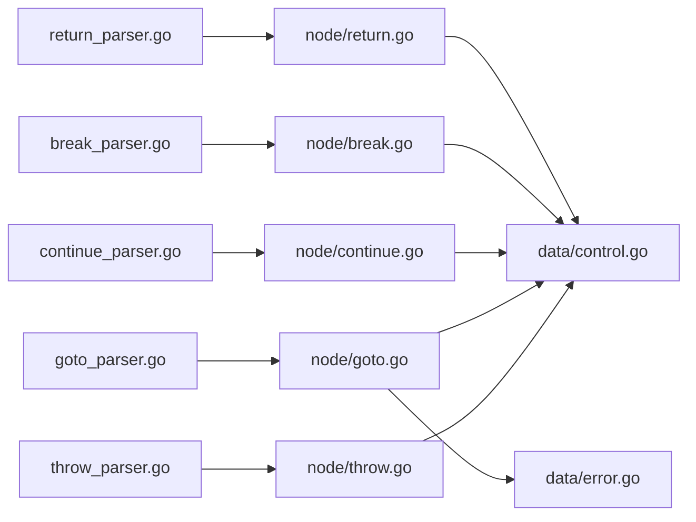

# 跳转语句解析器

<cite>
**本文引用的文件**
- [parser/break_parser.go](file://parser/break_parser.go)
- [parser/continue_parser.go](file://parser/continue_parser.go)
- [parser/goto_parser.go](file://parser/goto_parser.go)
- [parser/return_parser.go](file://parser/return_parser.go)
- [parser/throw_parser.go](file://parser/throw_parser.go)
- [node/break.go](file://node/break.go)
- [node/continue.go](file://node/continue.go)
- [node/goto.go](file://node/goto.go)
- [node/return.go](file://node/return.go)
- [node/throw.go](file://node/throw.go)
- [data/control.go](file://data/control.go)
- [data/error.go](file://data/error.go)
- [node/node.go](file://node/node.go)
- [parser/scope_manager.go](file://parser/scope_manager.go)
</cite>

## 目录
1. [简介](#简介)
2. [项目结构](#项目结构)
3. [核心组件](#核心组件)
4. [架构总览](#架构总览)
5. [详细组件分析](#详细组件分析)
6. [依赖分析](#依赖分析)
7. [性能考虑](#性能考虑)
8. [故障排查指南](#故障排查指南)
9. [结论](#结论)
10. [附录](#附录)

## 简介
本文件面向编译器开发者，系统化阐述跳转语句解析器的技术实现，覆盖以下四类控制流语句：
- 返回语句（return）
- 中断语句（break/continue）
- 跳转语句（goto）
- 异常抛出（throw）

内容包括：语法约束、作用域检查、AST节点构建、目标解析与标签验证、控制流分析、PHP语法兼容性以及与编译器控制流图生成的关系，并提供扩展机制与优化策略。

## 项目结构
跳转语句解析相关的核心文件分布于解析器与节点层：
- 解析器层：分别针对各类跳转语句提供独立解析器，负责词法识别、语法校验与AST节点构造。
- 节点层：定义对应AST节点及控制流接口，承载运行时控制流传递。
- 数据层：统一的控制流接口与错误模型，支撑解析期与运行期的控制流传递与错误传播。

**图表来源**
- [parser/break_parser.go:1-30](file://parser/break_parser.go#L1-L30)
- [parser/continue_parser.go:1-30](file://parser/continue_parser.go#L1-L30)
- [parser/goto_parser.go:1-35](file://parser/goto_parser.go#L1-L35)
- [parser/return_parser.go:1-60](file://parser/return_parser.go#L1-L60)
- [parser/throw_parser.go:1-48](file://parser/throw_parser.go#L1-L48)
- [node/break.go:1-34](file://node/break.go#L1-L34)
- [node/continue.go:1-34](file://node/continue.go#L1-L34)
- [node/goto.go:1-75](file://node/goto.go#L1-L75)
- [node/return.go:1-63](file://node/return.go#L1-L63)
- [node/throw.go:1-37](file://node/throw.go#L1-L37)
- [data/control.go:1-61](file://data/control.go#L1-L61)
- [data/error.go:1-50](file://data/error.go#L1-L50)

**章节来源**
- [parser/break_parser.go:1-30](file://parser/break_parser.go#L1-L30)
- [parser/continue_parser.go:1-30](file://parser/continue_parser.go#L1-L30)
- [parser/goto_parser.go:1-35](file://parser/goto_parser.go#L1-L35)
- [parser/return_parser.go:1-60](file://parser/return_parser.go#L1-L60)
- [parser/throw_parser.go:1-48](file://parser/throw_parser.go#L1-L48)
- [node/break.go:1-34](file://node/break.go#L1-L34)
- [node/continue.go:1-34](file://node/continue.go#L1-L34)
- [node/goto.go:1-75](file://node/goto.go#L1-L75)
- [node/return.go:1-63](file://node/return.go#L1-L63)
- [node/throw.go:1-37](file://node/throw.go#L1-L37)
- [data/control.go:1-61](file://data/control.go#L1-L61)
- [data/error.go:1-50](file://data/error.go#L1-L50)

## 核心组件
- 解析器接口与工厂
  - 所有跳转语句解析器均实现统一的 StatementParser 接口，通过 NewXxxParser 工厂函数创建实例，遵循一致的解析签名 Parse() -> (GetValue, Control)。
- AST节点与控制流接口
  - 各语句节点实现 GetValue(ctx) -> (GetValue, Control)，其中 Control 用于向运行时传递控制流信号。
  - 控制流接口定义了 BreakControl、ContinueControl、GotoControl 等，统一了不同控制流的识别与处理。

**章节来源**
- [parser/break_parser.go:13-18](file://parser/break_parser.go#L13-L18)
- [parser/continue_parser.go:13-18](file://parser/continue_parser.go#L13-L18)
- [parser/goto_parser.go:16-18](file://parser/goto_parser.go#L16-L18)
- [parser/return_parser.go:14-19](file://parser/return_parser.go#L14-L19)
- [parser/throw_parser.go:14-19](file://parser/throw_parser.go#L14-L19)
- [data/control.go:12-46](file://data/control.go#L12-L46)

## 架构总览
下图展示跳转语句从解析到运行时控制流传递的整体流程：

**图表来源**
- [parser/break_parser.go:20-29](file://parser/break_parser.go#L20-L29)
- [parser/continue_parser.go:20-29](file://parser/continue_parser.go#L20-L29)
- [parser/goto_parser.go:20-34](file://parser/goto_parser.go#L20-L34)
- [parser/return_parser.go:21-59](file://parser/return_parser.go#L21-L59)
- [parser/throw_parser.go:21-47](file://parser/throw_parser.go#L21-L47)
- [node/break.go:23-26](file://node/break.go#L23-L26)
- [node/continue.go:5-8](file://node/continue.go#L5-L8)
- [node/goto.go:67-70](file://node/goto.go#L67-L70)
- [node/return.go:5-17](file://node/return.go#L5-L17)
- [node/throw.go:24-36](file://node/throw.go#L24-L36)
- [data/control.go:3-6](file://data/control.go#L3-L6)

## 详细组件分析

### 返回语句（return）
- 语法约束
  - 可选返回值表达式；若存在逗号分隔的多个表达式，则构造多值返回节点。
  - 解析器使用表达式解析器逐个解析表达式，遇到逗号则聚合为多值返回。
- 作用域检查
  - 表达式解析在当前作用域内进行，受作用域管理器约束。
- AST节点构建
  - 单值返回：ReturnStatement，持有 Value。
  - 多值返回：ReturnsStatement，持有 Values 列表。
- 运行时控制流
  - GetValue 将返回值包装为 ReturnControl，交由调用方处理。

**图表来源**
- [parser/return_parser.go:21-59](file://parser/return_parser.go#L21-L59)
- [node/return.go:19-31](file://node/return.go#L19-L31)
- [node/return.go:33-46](file://node/return.go#L33-L46)
- [node/return.go:5-17](file://node/return.go#L5-L17)
- [node/return.go:48-62](file://node/return.go#L48-L62)

**章节来源**
- [parser/return_parser.go:21-59](file://parser/return_parser.go#L21-L59)
- [node/return.go:19-63](file://node/return.go#L19-L63)
- [parser/scope_manager.go:102-124](file://parser/scope_manager.go#L102-L124)

### 中断语句（break/continue）
- 语法约束
  - break/continue 关键字后通常可带可选层级（在支持层级的场景），但当前解析器未实现层级解析，仅消费关键字。
- 作用域检查
  - 语句节点本身不携带表达式，无需作用域解析。
- AST节点构建
  - BreakStatement/ContinueStatement 分别实现 IsBreak/IsContinue 标记，便于运行时识别。
- 运行时控制流
  - GetValue 返回自身作为控制流信号，交由上层循环/块处理逻辑决定中断行为。

**图表来源**
- [node/break.go:5-33](file://node/break.go#L5-L33)
- [node/continue.go:10-33](file://node/continue.go#L10-L33)
- [data/control.go:12-28](file://data/control.go#L12-L28)

**章节来源**
- [parser/break_parser.go:20-29](file://parser/break_parser.go#L20-L29)
- [parser/continue_parser.go:20-29](file://parser/continue_parser.go#L20-L29)
- [node/break.go:5-33](file://node/break.go#L5-L33)
- [node/continue.go:10-33](file://node/continue.go#L10-L33)

### 跳转语句（goto）
- 语法约束
  - goto 关键字后必须跟随标识符作为标签名；否则抛出解析期错误。
- 标签验证与目标解析
  - 解析阶段仅记录标签名，不进行跨作用域或跨文件的标签解析；标签的实际绑定与验证在运行时完成。
- AST节点构建
  - GotoStatement 持有 Label 字段，实现 GotoControl 接口，GetValue 直接返回自身作为控制信号。
  - LabelStatement 定义标签节点，GetValue 返回 LabelControl，供运行时定位标签偏移。
- 运行时控制流
  - 运行时遍历语句序列，遇到 LabelControl 更新偏移；遇到 GotoControl 比对标签名，命中则切换至对应标签继续执行。

**图表来源**
- [parser/goto_parser.go:20-34](file://parser/goto_parser.go#L20-L34)
- [node/goto.go:41-75](file://node/goto.go#L41-L75)
- [node/node.go:72-98](file://node/node.go#L72-L98)
- [data/control.go:39-46](file://data/control.go#L39-L46)

**章节来源**
- [parser/goto_parser.go:20-34](file://parser/goto_parser.go#L20-L34)
- [node/goto.go:41-75](file://node/goto.go#L41-L75)
- [node/node.go:72-98](file://node/node.go#L72-L98)

### 异常抛出（throw）
- 语法约束
  - throw 关键字后可跟任意表达式；若省略表达式，解析器会构造默认异常类型字符串。
- 类型与错误模型
  - 表达式求值后，若为类值则以类值抛出；否则以字符串值构造错误对象。
- AST节点构建
  - ThrowStatement 持有 Value，在 GetValue 中完成求值与错误包装。
- 运行时控制流
  - GetValue 返回 ErrorThrow 控制信号，交由虚拟机统一处理异常传播。

**图表来源**
- [parser/throw_parser.go:21-47](file://parser/throw_parser.go#L21-L47)
- [node/throw.go:9-37](file://node/throw.go#L9-L37)
- [data/error.go:1-50](file://data/error.go#L1-L50)

**章节来源**
- [parser/throw_parser.go:21-47](file://parser/throw_parser.go#L21-L47)
- [node/throw.go:9-37](file://node/throw.go#L9-L37)
- [data/error.go:1-50](file://data/error.go#L1-L50)

## 依赖分析
- 解析器与节点
  - 各解析器依赖统一的表达式解析器（用于 return/throw 的值解析）与节点工厂函数，构造对应 AST 节点。
- 控制流接口
  - 节点通过实现 Control 接口的不同子接口（BreakControl/ContinueControl/GotoControl）向运行时传递控制信号。
- 错误模型
  - 解析期错误通过 data.NewErrorThrow 抛出；运行时错误通过 data.Error 结构体链路化管理。

**图表来源**
- [parser/return_parser.go:1-60](file://parser/return_parser.go#L1-L60)
- [parser/break_parser.go:1-30](file://parser/break_parser.go#L1-L30)
- [parser/continue_parser.go:1-30](file://parser/continue_parser.go#L1-L30)
- [parser/goto_parser.go:1-35](file://parser/goto_parser.go#L1-L35)
- [parser/throw_parser.go:1-48](file://parser/throw_parser.go#L1-L48)
- [node/return.go:1-63](file://node/return.go#L1-L63)
- [node/break.go:1-34](file://node/break.go#L1-L34)
- [node/continue.go:1-34](file://node/continue.go#L1-L34)
- [node/goto.go:1-75](file://node/goto.go#L1-L75)
- [node/throw.go:1-37](file://node/throw.go#L1-L37)
- [data/control.go:1-61](file://data/control.go#L1-L61)
- [data/error.go:1-50](file://data/error.go#L1-L50)

**章节来源**
- [data/control.go:1-61](file://data/control.go#L1-L61)
- [data/error.go:1-50](file://data/error.go#L1-L50)

## 性能考虑
- 解析阶段
  - goto 解析仅做词法校验，避免复杂的作用域扫描；标签解析延迟到运行时，降低解析成本。
  - return 的多值收集采用线性扫描与追加，时间复杂度 O(n)。
- 运行时阶段
  - goto 标签匹配通过顺序扫描实现，建议在大规模标签场景引入符号表与索引以优化查找效率。
  - throw 的值求值与类型判断为 O(1)，整体开销较小。

[本节为通用性能讨论，不直接分析具体文件]

## 故障排查指南
- goto 语法错误
  - 现象：goto 后缺少标识符。
  - 处理：解析器返回解析期错误，提示“goto 语句后面需要跟随标签名”。
- throw 值类型问题
  - 现象：抛出非类值或字符串值。
  - 处理：运行时根据值类型选择不同的错误抛出路径，确保错误信息可读。
- 标签未找到
  - 现象：运行时无法匹配 goto 标签名。
  - 处理：当前实现将标签控制权交由运行时统一调度，建议在运行时增加标签缺失的诊断与回退策略。

**章节来源**
- [parser/goto_parser.go:25-27](file://parser/goto_parser.go#L25-L27)
- [node/throw.go:31-36](file://node/throw.go#L31-L36)
- [node/node.go:72-98](file://node/node.go#L72-L98)

## 结论
该跳转语句解析器以轻量的解析策略与清晰的控制流接口实现了对 return、break、continue、goto、throw 的统一建模。解析期聚焦语法与基本类型校验，运行时承担标签解析与控制流调度。建议在运行时引入标签索引与更完善的控制流图生成，以提升大规模程序的可维护性与性能。

## 附录
- PHP语法兼容性要点
  - return 支持单值与多值返回；throw 支持省略表达式时的默认异常；goto 严格要求标识符作为标签名。
- 扩展机制
  - 新增跳转语句：实现 StatementParser 接口与对应 AST 节点，节点需实现相应 Control 接口。
  - 运行时扩展：在运行时控制流分派处新增分支，处理新的控制信号类型。
- 优化策略
  - goto 标签：建立符号表与偏移映射，减少顺序扫描成本。
  - 控制流图：基于 AST 生成控制流图，辅助静态分析与优化。