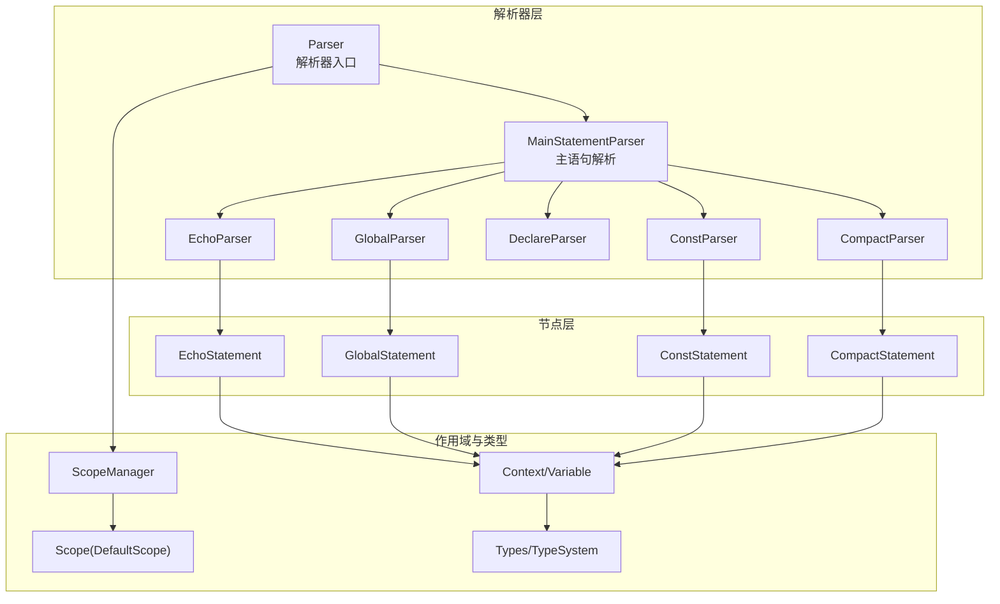
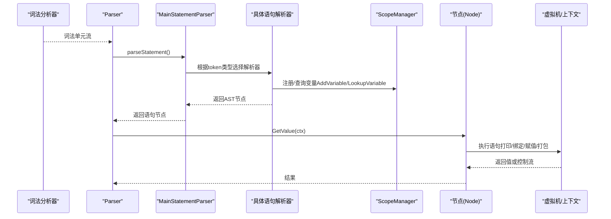
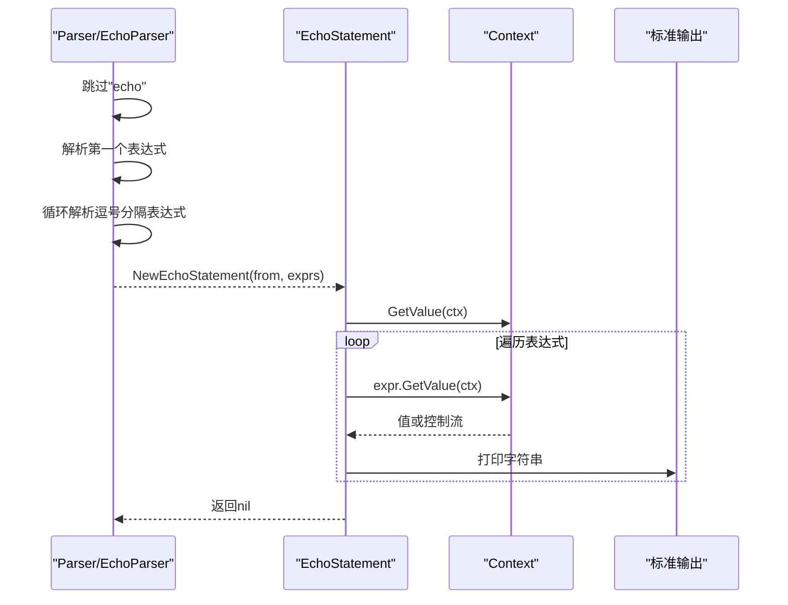
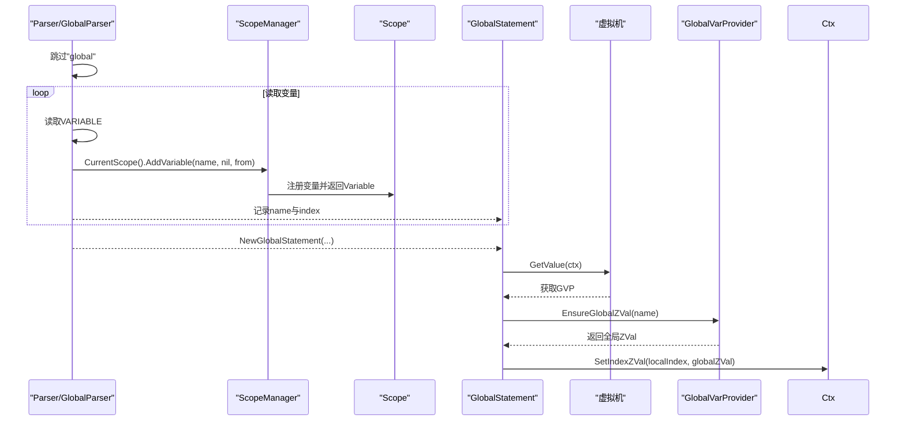
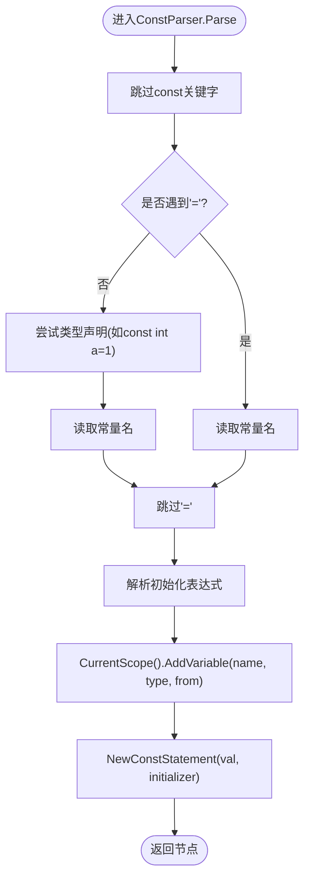
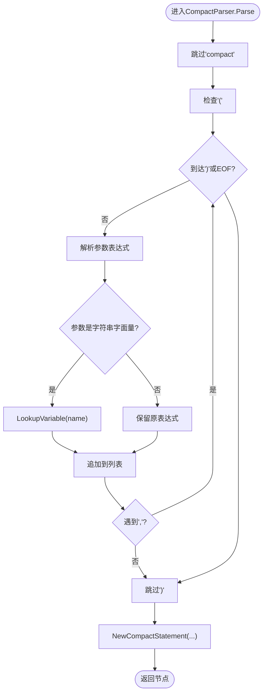
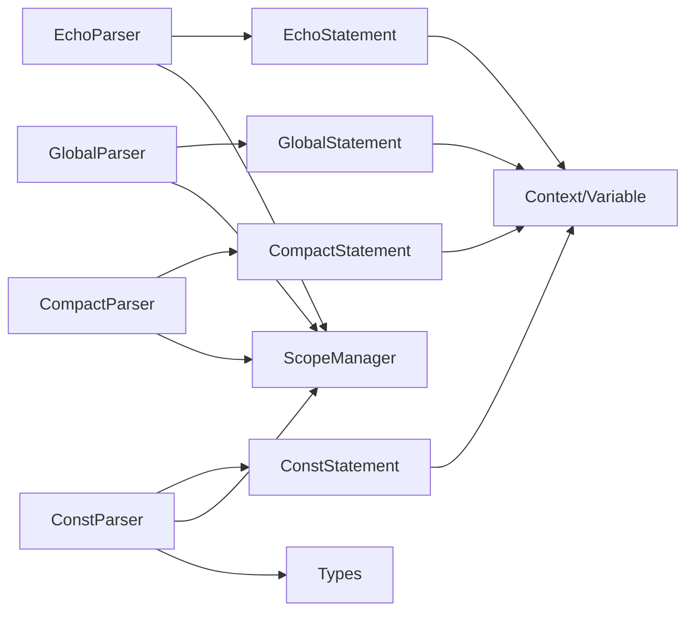

# 输出和声明解析器

<cite>
**本文档引用的文件**
- [echo_parser.go](file://parser/echo_parser.go)
- [global_parser.go](file://parser/global_parser.go)
- [const_parser.go](file://parser/const_parser.go)
- [declare_parser.go](file://parser/declare_parser.go)
- [compact_parser.go](file://parser/compact_parser.go)
- [echo.go](file://node/echo.go)
- [global.go](file://node/global.go)
- [const.go](file://node/const.go)
- [compact.go](file://node/compact.go)
- [scope_manager.go](file://parser/scope_manager.go)
- [parser.go](file://parser/parser.go)
- [statement.go](file://parser/statement.go)
- [all_parser.go](file://parser/all_parser.go)
- [types.go](file://data/types.go)
- [context.go](file://data/context.go)
</cite>

## 目录
1. [简介](#简介)
2. [项目结构](#项目结构)
3. [核心组件](#核心组件)
4. [架构总览](#架构总览)
5. [详细组件分析](#详细组件分析)
6. [依赖分析](#依赖分析)
7. [性能考虑](#性能考虑)
8. [故障排查指南](#故障排查指南)
9. [结论](#结论)
10. [附录](#附录)

## 简介
本文件聚焦于“输出和声明解析器”的技术实现，覆盖以下主题：
- 输出语句解析：echo/print 的语法模式、AST 构建与执行行为
- 声明语句解析：global、const、declare 的语法模式、作用域声明与符号表更新
- 变量打包（compact）解析：参数解析、变量查找与关联数组生成
- 与作用域管理系统（ScopeManager）的集成方式
- PHP 语法兼容性与扩展点建议
- 针对编译器开发者的扩展方法与性能优化技巧

## 项目结构
输出与声明解析器位于解析器子系统（parser）与节点子系统（node）中，并通过作用域管理器（ScopeManager）与上下文（Context）进行符号表与运行时交互。

图表来源
- [parser.go:17-50](file://parser/parser.go#L17-L50)
- [statement.go:21-45](file://parser/statement.go#L21-L45)
- [echo_parser.go:14-46](file://parser/echo_parser.go#L14-L46)
- [global_parser.go:17-64](file://parser/global_parser.go#L17-L64)
- [const_parser.go:15-59](file://parser/const_parser.go#L15-L59)
- [declare_parser.go:14-39](file://parser/declare_parser.go#L14-L39)
- [compact_parser.go:14-67](file://parser/compact_parser.go#L14-L67)
- [scope_manager.go:64-100](file://parser/scope_manager.go#L64-L100)
- [types.go:142-188](file://data/types.go#L142-L188)
- [context.go:157-220](file://data/context.go#L157-L220)

章节来源
- [parser.go:17-50](file://parser/parser.go#L17-L50)
- [statement.go:21-45](file://parser/statement.go#L21-L45)
- [scope_manager.go:64-100](file://parser/scope_manager.go#L64-L100)

## 核心组件
- 输出解析器（EchoParser）：解析 echo 语句，支持逗号分隔的多个表达式，构建 EchoStatement 并在运行时顺序打印。
- 声明解析器（GlobalParser）：解析 global 语句，维护变量名与索引映射，运行时将本地槽位替换为全局 ZVal。
- 常量解析器（ConstParser）：解析 const 语句，要求显式初始化；支持类型声明（如 const int a = 1），构建 ConstStatement 并写入符号表。
- 声明解析器（DeclareParser）：解析 declare(...) 语句，当前仅做词法跳过，返回占位节点（Todo）。
- 变量打包解析器（CompactParser）：解析 compact('var1','var2',...)，将变量名与值打包为关联数组，支持字符串字面量与变量表达式两种输入形式。

章节来源
- [echo_parser.go:14-46](file://parser/echo_parser.go#L14-L46)
- [global_parser.go:17-64](file://parser/global_parser.go#L17-L64)
- [const_parser.go:15-59](file://parser/const_parser.go#L15-L59)
- [declare_parser.go:14-39](file://parser/declare_parser.go#L14-L39)
- [compact_parser.go:14-67](file://parser/compact_parser.go#L14-L67)

## 架构总览
解析流程从主语句解析器开始，根据当前词法单元类型路由到具体语句解析器；解析器在当前作用域中登记变量、构建 AST 节点，并在运行时由节点 GetValue 执行相应行为。

图表来源
- [statement.go:21-45](file://parser/statement.go#L21-L45)
- [all_parser.go:13-54](file://parser/all_parser.go#L13-L54)
- [scope_manager.go:102-124](file://parser/scope_manager.go#L102-L124)
- [echo.go:23-39](file://node/echo.go#L23-L39)
- [global.go:29-50](file://node/global.go#L29-L50)
- [const.go:5-14](file://node/const.go#L5-L14)
- [compact.go:21-81](file://node/compact.go#L21-L81)

## 详细组件分析

### 输出语句解析（echo）
- 语法模式
  - echo 表达式列表：支持逗号分隔的多个表达式，例如 echo $a, $b, "text";
- 解析逻辑
  - 跳过关键字后，逐个解析表达式，收集到表达式切片。
  - 构造 EchoStatement，记录起始位置与表达式列表。
- AST 节点构建
  - 节点包含表达式数组，运行时依次求值并打印。
- 运行时行为
  - GetValue 顺序遍历表达式，将值转为字符串并输出。

图表来源
- [echo_parser.go:19-45](file://parser/echo_parser.go#L19-L45)
- [echo.go:23-39](file://node/echo.go#L23-L39)

章节来源
- [echo_parser.go:19-45](file://parser/echo_parser.go#L19-L45)
- [echo.go:9-39](file://node/echo.go#L9-L39)

### 声明语句解析（global）
- 语法模式
  - global $var1, $var2, ...; 支持多变量声明。
- 解析逻辑
  - 跳过关键字后，循环读取变量名（去除 $ 前缀），在当前作用域中添加或查找变量，记录变量名与索引。
  - 构造 GlobalStatement，保存名称与索引列表。
- AST 节点构建
  - 节点包含 Names 与 Indexes 列表。
- 运行时行为
  - GetValue 通过 VM 提供的 GlobalVarProvider 接口确保全局 ZVal，并将本地槽位替换为全局 ZVal，实现共享。

图表来源
- [global_parser.go:22-62](file://parser/global_parser.go#L22-L62)
- [global.go:29-50](file://node/global.go#L29-L50)
- [scope_manager.go:102-113](file://parser/scope_manager.go#L102-L113)

章节来源
- [global_parser.go:22-62](file://parser/global_parser.go#L22-L62)
- [global.go:5-50](file://node/global.go#L5-L50)
- [scope_manager.go:102-113](file://parser/scope_manager.go#L102-L113)

### 声明语句解析（const）
- 语法模式
  - 支持带类型声明与不带类型声明两种：const NAME = expr; 或 const type NAME = expr;。
- 解析逻辑
  - 跳过关键字后，解析常量名；若未发现赋值操作符，则尝试识别类型声明并回退到常量名。
  - 跳过赋值符后解析初始化表达式。
  - 在当前作用域中注册变量（类型为 Const），构造 ConstStatement。
- AST 节点构建
  - 节点包含变量引用与初始化表达式。
- 运行时行为
  - GetValue 求值初始化表达式，将值写入符号表（跳过类型检查）。

图表来源
- [const_parser.go:22-58](file://parser/const_parser.go#L22-L58)
- [const.go:5-30](file://node/const.go#L5-L30)
- [types.go:142-188](file://data/types.go#L142-L188)

章节来源
- [const_parser.go:22-58](file://parser/const_parser.go#L22-L58)
- [const.go:16-30](file://node/const.go#L16-L30)
- [types.go:142-188](file://data/types.go#L142-L188)

### 声明语句解析（declare）
- 语法模式
  - declare(strict_types=1); 当前解析器仅跳过括号内内容，不做语义处理。
- 解析逻辑
  - 跳过 declare，匹配左括号，向前扫描直到右括号，再跳过分号（如有）。
  - 返回 Todo 节点，表示暂不实现。
- AST 节点构建
  - 构造 Todo 节点，便于后续扩展。

章节来源
- [declare_parser.go:18-38](file://parser/declare_parser.go#L18-L38)

### 变量打包解析（compact）
- 语法模式
  - compact('var1','var2',...); 参数为字符串字面量或变量表达式。
- 解析逻辑
  - 跳过关键字后，解析左括号；循环解析参数，遇到逗号则继续；遇到右括号结束。
  - 若参数为字符串字面量，尝试在作用域中查找对应变量表达式；否则直接使用变量表达式。
- AST 节点构建
  - 节点包含参数表达式列表。
- 运行时行为
  - GetValue 遍历参数表达式，将值转为字符串作为变量名；若参数为变量表达式，直接取其值；否则通过变量名查找变量值，过滤 null 后加入结果对象。

图表来源
- [compact_parser.go:19-66](file://parser/compact_parser.go#L19-L66)
- [compact.go:21-81](file://node/compact.go#L21-L81)
- [scope_manager.go:115-124](file://parser/scope_manager.go#L115-L124)

章节来源
- [compact_parser.go:19-66](file://parser/compact_parser.go#L19-L66)
- [compact.go:7-81](file://node/compact.go#L7-L81)
- [scope_manager.go:115-124](file://parser/scope_manager.go#L115-L124)

## 依赖分析
- 解析器到节点
  - EchoParser → EchoStatement
  - GlobalParser → GlobalStatement
  - ConstParser → ConstStatement
  - CompactParser → CompactStatement
- 解析器到作用域管理
  - 所有声明解析器均调用 CurrentScope().AddVariable/LookupVariable 更新/查询符号表
- 节点到运行时
  - EchoStatement/GlobalStatement/ConstStatement/CompactStatement 的 GetValue 依赖 Context/VM 接口
- 类型系统
  - ConstParser 支持类型声明，通过 NewBaseType 构造类型对象

图表来源
- [echo_parser.go:14-46](file://parser/echo_parser.go#L14-L46)
- [global_parser.go:17-64](file://parser/global_parser.go#L17-L64)
- [const_parser.go:15-59](file://parser/const_parser.go#L15-L59)
- [compact_parser.go:14-67](file://parser/compact_parser.go#L14-L67)
- [scope_manager.go:102-124](file://parser/scope_manager.go#L102-L124)
- [types.go:142-188](file://data/types.go#L142-L188)

章节来源
- [all_parser.go:13-54](file://parser/all_parser.go#L13-L54)
- [scope_manager.go:102-124](file://parser/scope_manager.go#L102-L124)
- [types.go:142-188](file://data/types.go#L142-L188)

## 性能考虑
- 词法与语法跳过
  - DeclareParser 采用“向前扫描直到右括号”的策略，时间复杂度 O(n)，适合短声明体；对于大型声明体可考虑预读优化。
- 变量注册与查找
  - ScopeManager 使用哈希表存储变量，AddVariable/LookupVariable 均摊 O(1)；注意避免重复注册与频繁跨作用域查找。
- 运行时打印
  - EchoStatement 顺序打印，建议批量缓冲输出以减少系统调用开销。
- 类型检查
  - ConstParser 当前跳过类型检查，有利于快速执行；若需增强类型安全，可在 GetValue 前增加类型验证。
- 作用域栈管理
  - NewScope/PopScope 频繁创建/销毁作用域会带来分配成本；可通过作用域池化或复用策略降低 GC 压力。

## 故障排查指南
- global 语法错误
  - 现象：报错提示 global 后需要变量名
  - 定位：GlobalParser 在非 VARIABLE 令牌处返回错误
  - 处理：检查语法是否为 global $a, $b;，确保变量名前缀正确
- const 初始化缺失
  - 现象：报错提示常量必须初始化
  - 定位：ConstParser 在未检测到赋值符时返回错误
  - 处理：确保 const 语句包含赋值表达式；或使用类型声明形式 const int a = 1
- compact 参数非法
  - 现象：报错提示 compact 后必须跟括号
  - 定位：CompactParser 在缺少 '(' 时返回错误
  - 处理：确认 compact('var1','var2') 形式正确
- 运行时全局变量不可用
  - 现象：GlobalStatement GetValue 忽略执行
  - 定位：VM 不满足 GlobalVarProvider 接口
  - 处理：实现 GlobalVarProvider 并注入 VM

章节来源
- [global_parser.go:32-34](file://parser/global_parser.go#L32-L34)
- [const_parser.go:38-42](file://parser/const_parser.go#L38-L42)
- [compact_parser.go:27-29](file://parser/compact_parser.go#L27-L29)
- [global.go:32-36](file://node/global.go#L32-L36)

## 结论
本解析器体系以“语句解析器 + AST 节点 + 作用域管理 + 上下文运行时”为核心，实现了对输出与声明语句的完整解析与执行路径。通过统一的 ScopeManager 与类型系统，既保证了 PHP 语法兼容性，也为后续扩展（如 declare 语义落地、const 类型检查强化、compact 更丰富的输入形式）提供了清晰的接入点。

## 附录
- 作用域管理要点
  - AddVariable 自动去除变量名前缀 $，避免重复注册
  - LookupVariable/LookupParentVariable 支持父子作用域链查找
- 类型系统要点
  - NewBaseType 支持基本类型、联合类型、可空类型与泛型包装
- 扩展建议
  - 为 DeclareParser 增加 strict_types 等选项的语义处理
  - 在 ConstParser 中引入类型检查与常量折叠
  - 在 CompactStatement 中支持更多输入形式（如数组键名映射）