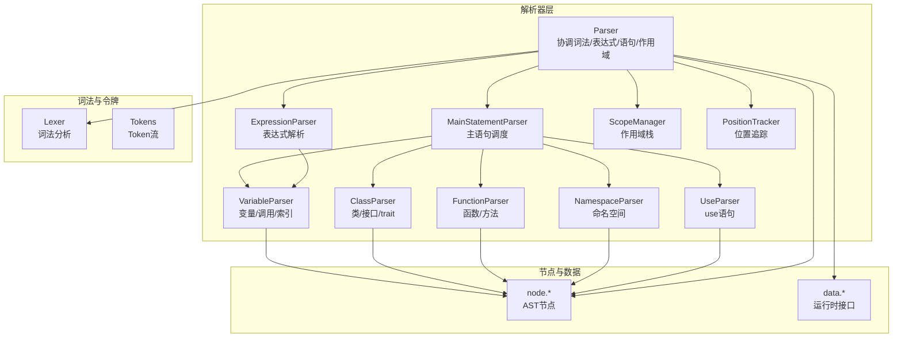
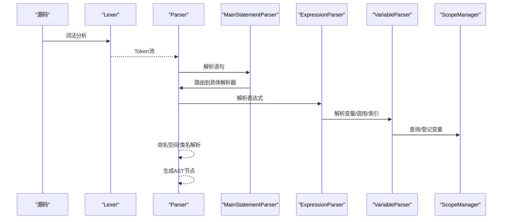
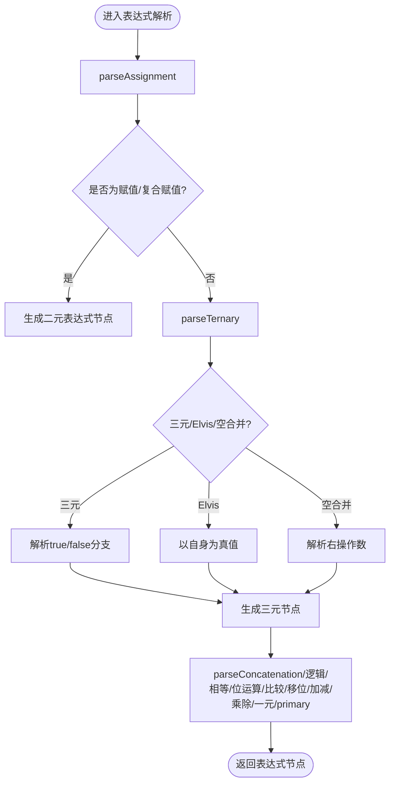
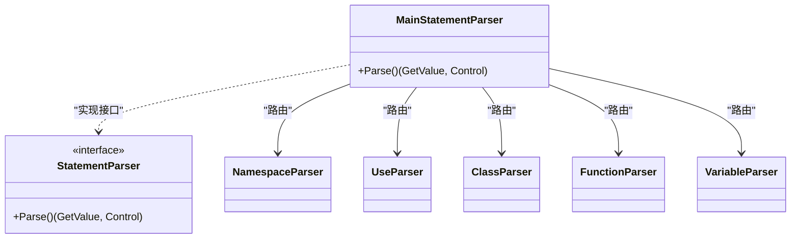
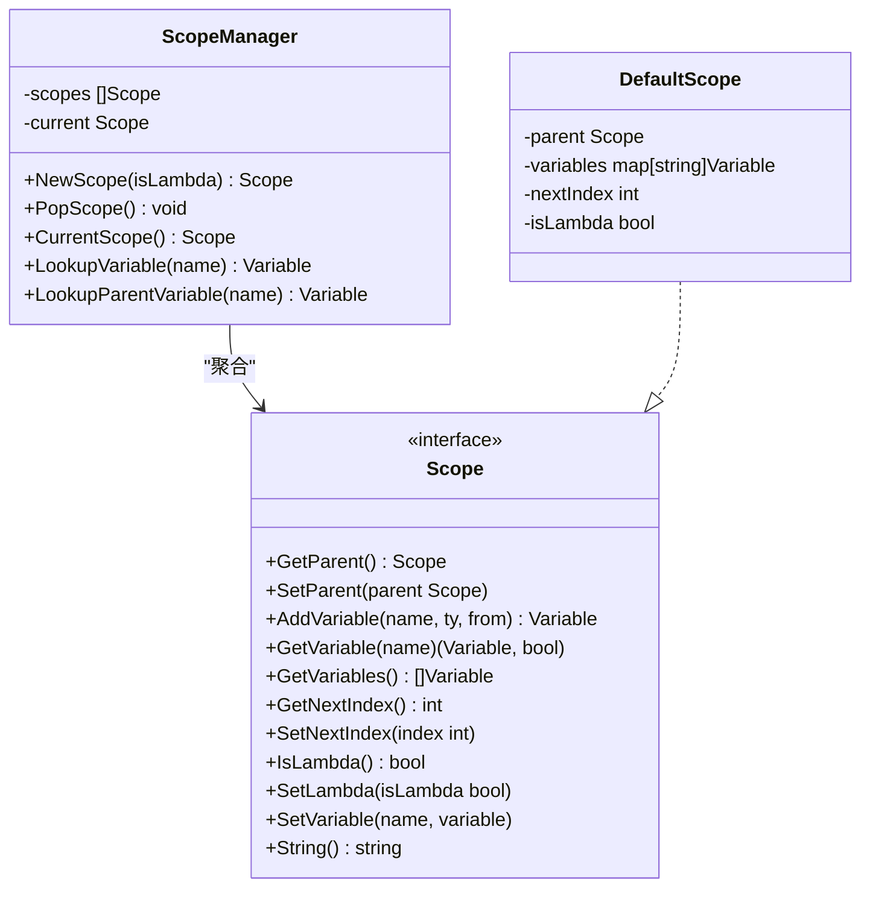
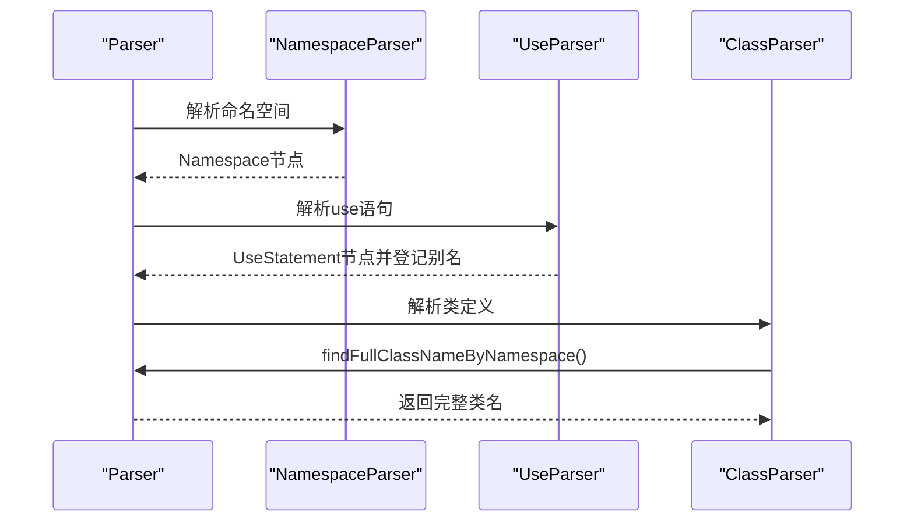
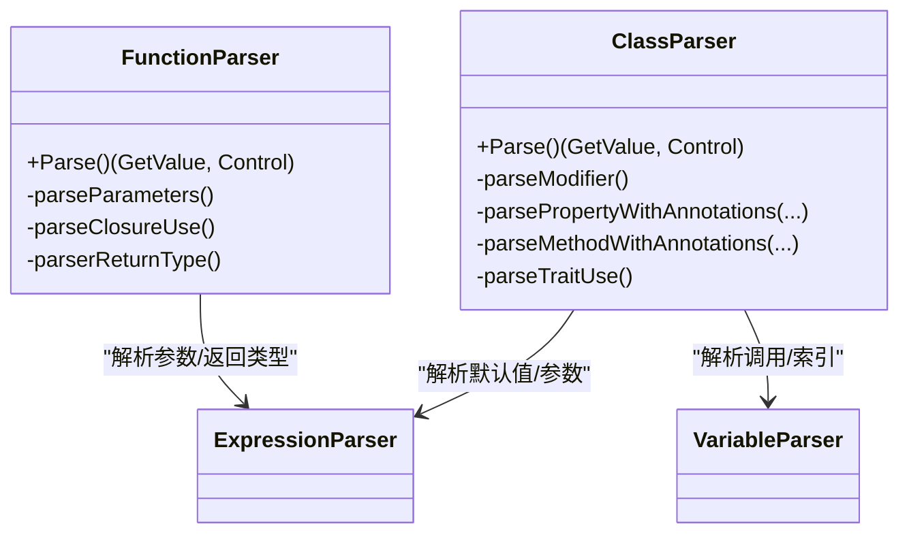
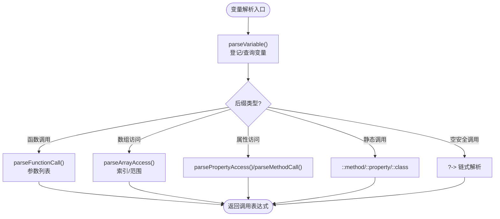
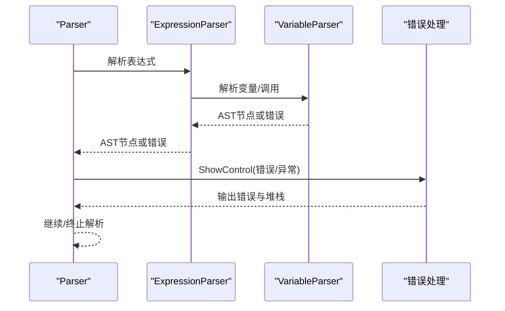
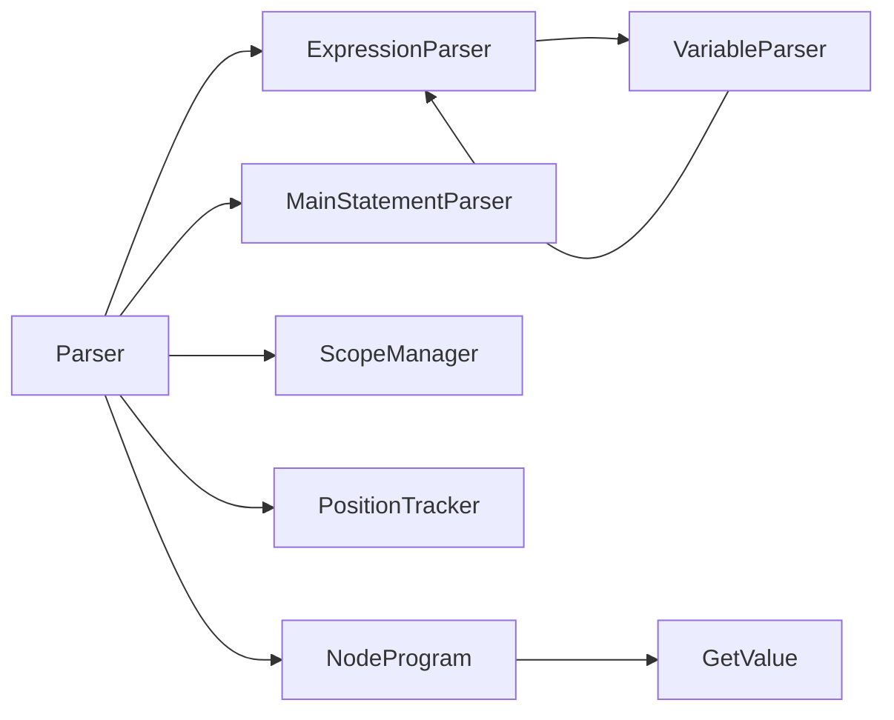

# 语法分析器

<cite>
**本文引用的文件**
- [parser.go](file://parser/parser.go)
- [expression_parser.go](file://parser/expression_parser.go)
- [statement.go](file://parser/statement.go)
- [scope_manager.go](file://parser/scope_manager.go)
- [all_parser.go](file://parser/all_parser.go)
- [namespace_parser.go](file://parser/namespace_parser.go)
- [use_parser.go](file://parser/use_parser.go)
- [class_parser.go](file://parser/class_parser.go)
- [function_parser.go](file://parser/function_parser.go)
- [variable_parser.go](file://parser/variable_parser.go)
- [position_tracker.go](file://parser/position_tracker.go)
- [config.go](file://parser/config.go)
- [node.go](file://node/node.go)
- [node.go](file://data/node.go)
</cite>

## 目录
1. [简介](#简介)
2. [项目结构](#项目结构)
3. [核心组件](#核心组件)
4. [架构总览](#架构总览)
5. [详细组件分析](#详细组件分析)
6. [依赖分析](#依赖分析)
7. [性能考虑](#性能考虑)
8. [故障排查指南](#故障排查指南)
9. [结论](#结论)
10. [附录](#附录)

## 简介
本文件面向编译器开发者，系统化阐述语法分析器的架构与实现细节，覆盖表达式解析、语句解析、作用域管理、命名空间与use语句处理、PHP语法兼容性、错误恢复与位置追踪等主题。文档同时给出扩展机制与性能优化建议，帮助读者在现有框架上进行二次开发与性能调优。

## 项目结构
语法分析器位于 parser 目录，围绕 Parser 核心协调词法分析器、表达式解析器、语句解析器、作用域管理器与各类专用解析器（命名空间、use、类、函数、变量等）。位置追踪器负责为AST节点提供精确的源码位置信息；节点与数据接口定义了AST节点与运行时交互的契约。

图示来源
- [parser.go:17-50](file://parser/parser.go#L17-L50)
- [expression_parser.go:14-24](file://parser/expression_parser.go#L14-L24)
- [statement.go:8-45](file://parser/statement.go#L8-L45)
- [scope_manager.go:64-100](file://parser/scope_manager.go#L64-L100)
- [position_tracker.go:7-23](file://parser/position_tracker.go#L7-L23)

章节来源
- [parser.go:17-50](file://parser/parser.go#L17-L50)
- [expression_parser.go:14-24](file://parser/expression_parser.go#L14-L24)
- [statement.go:8-45](file://parser/statement.go#L8-L45)
- [scope_manager.go:64-100](file://parser/scope_manager.go#L64-L100)
- [position_tracker.go:7-23](file://parser/position_tracker.go#L7-L23)

## 核心组件
- Parser：持有词法分析器、令牌流、错误收集、作用域管理器、表达式解析器与类路径管理器，提供文件解析入口与通用辅助方法（前进、检查、位置追踪、错误展示等）。
- ExpressionParser：基于递归下降的表达式解析器，按优先级组织各运算符，支持三元、空合并、instanceof、赋值、一元、后缀自增/减等。
- MainStatementParser：根据当前token类型路由到具体语句解析器（命名空间、use、类、函数、控制结构等）。
- ScopeManager：作用域栈与变量表，支持父子作用域、lambda标记、变量索引分配与查询。
- PositionTracker：自动记录解析起点与终点，生成精确的TokenFrom位置信息。
- 专用解析器：命名空间、use、类/接口/trait、函数/方法、变量/调用/索引等。

章节来源
- [parser.go:17-50](file://parser/parser.go#L17-L50)
- [expression_parser.go:14-24](file://parser/expression_parser.go#L14-L24)
- [statement.go:8-45](file://parser/statement.go#L8-L45)
- [scope_manager.go:64-100](file://parser/scope_manager.go#L64-L100)
- [position_tracker.go:7-23](file://parser/position_tracker.go#L7-L23)

## 架构总览
语法分析流程自上而下：Parser接收源码，交由Lexer生成Token流；Parser驱动ExpressionParser与MainStatementParser分别处理表达式与语句；在解析过程中，通过ScopeManager维护变量作用域，通过PositionTracker记录AST节点位置；命名空间与use语句影响类名解析与符号解析；最终生成Program与各类AST节点，供运行时VM执行。

图示来源
- [parser.go:86-122](file://parser/parser.go#L86-L122)
- [statement.go:20-45](file://parser/statement.go#L20-L45)
- [expression_parser.go:26-33](file://parser/expression_parser.go#L26-L33)
- [variable_parser.go:23-30](file://parser/variable_parser.go#L23-L30)
- [scope_manager.go:102-113](file://parser/scope_manager.go#L102-L113)

## 详细组件分析

### 表达式解析器（ExpressionParser）
- 采用递归下降与优先级驱动：parseAssignment → parseTernary → parseConcatenation → parseLogicalOr → parseLogicalAnd → parseEquality → parseBitwiseOr/Xor/And → parseComparison → parseShift → parseTerm → parseFactor → parseUnary → parsePrimary。
- 支持三元运算符（?:）、Elvis（?: 简写）、空合并（??）、instanceof、赋值与复合赋值、一元运算（-、!、~、&）、后缀自增/减、引用取值（&$var）。
- parsePrimary中处理变量变量（$$var）、插值字符串（LingToken）、DOCTYPE、JS_SERVER等特殊表达式。
- 位置追踪：通过StartTracking/EndBefore组合，保证AST节点的From信息精确。

图示来源
- [expression_parser.go:26-97](file://parser/expression_parser.go#L26-L97)
- [expression_parser.go:99-198](file://parser/expression_parser.go#L99-L198)
- [expression_parser.go:200-224](file://parser/expression_parser.go#L200-L224)
- [expression_parser.go:226-280](file://parser/expression_parser.go#L226-L280)
- [expression_parser.go:282-320](file://parser/expression_parser.go#L282-L320)
- [expression_parser.go:322-394](file://parser/expression_parser.go#L322-L394)
- [expression_parser.go:396-426](file://parser/expression_parser.go#L396-L426)
- [expression_parser.go:428-452](file://parser/expression_parser.go#L428-L452)
- [expression_parser.go:454-478](file://parser/expression_parser.go#L454-L478)
- [expression_parser.go:480-505](file://parser/expression_parser.go#L480-L505)
- [expression_parser.go:507-602](file://parser/expression_parser.go#L507-L602)
- [expression_parser.go:604-749](file://parser/expression_parser.go#L604-L749)

章节来源
- [expression_parser.go:26-97](file://parser/expression_parser.go#L26-L97)
- [expression_parser.go:99-198](file://parser/expression_parser.go#L99-L198)
- [expression_parser.go:200-224](file://parser/expression_parser.go#L200-L224)
- [expression_parser.go:226-280](file://parser/expression_parser.go#L226-L280)
- [expression_parser.go:282-320](file://parser/expression_parser.go#L282-L320)
- [expression_parser.go:322-394](file://parser/expression_parser.go#L322-L394)
- [expression_parser.go:396-426](file://parser/expression_parser.go#L396-L426)
- [expression_parser.go:428-452](file://parser/expression_parser.go#L428-L452)
- [expression_parser.go:454-478](file://parser/expression_parser.go#L454-L478)
- [expression_parser.go:480-505](file://parser/expression_parser.go#L480-L505)
- [expression_parser.go:507-602](file://parser/expression_parser.go#L507-L602)
- [expression_parser.go:604-749](file://parser/expression_parser.go#L604-L749)

### 语句解析器与主调度
- MainStatementParser根据当前token类型路由到具体解析器（命名空间、use、类、函数、控制结构、表达式等）。
- 语句解析器接口StatementParser统一入口，all_parser.go维护token到解析器的映射表，支持扩展新增解析器。

图示来源
- [statement.go:8-45](file://parser/statement.go#L8-L45)
- [all_parser.go:8-79](file://parser/all_parser.go#L8-L79)

章节来源
- [statement.go:8-45](file://parser/statement.go#L8-L45)
- [all_parser.go:8-79](file://parser/all_parser.go#L8-L79)

### 作用域管理器（ScopeManager）
- 提供作用域栈，支持新增作用域、弹出作用域、当前作用域查询、变量登记与查找（含父作用域）。
- 变量结构包含名称、索引、是否参数/全局等元信息，便于运行时变量定位与闭包捕获。

图示来源
- [scope_manager.go:64-100](file://parser/scope_manager.go#L64-L100)
- [scope_manager.go:102-144](file://parser/scope_manager.go#L102-L144)
- [scope_manager.go:153-192](file://parser/scope_manager.go#L153-L192)

章节来源
- [scope_manager.go:64-100](file://parser/scope_manager.go#L64-L100)
- [scope_manager.go:102-144](file://parser/scope_manager.go#L102-L144)
- [scope_manager.go:153-192](file://parser/scope_manager.go#L153-L192)

### 命名空间与use语句解析
- 命名空间解析：记录当前命名空间，解析命名空间体内的语句；支持扫描命名空间目录以便类路径查找。
- use语句解析：支持函数/常量/类的use导入，支持别名（as），生成UseStatement节点并登记到uses映射。
- 类名解析：findFullClassNameByNamespace综合use别名、当前命名空间、全局完全限定名与类路径管理器，返回完整类名或回退原始名。

图示来源
- [namespace_parser.go:23-67](file://parser/namespace_parser.go#L23-L67)
- [use_parser.go:24-72](file://parser/use_parser.go#L24-L72)
- [parser.go:478-568](file://parser/parser.go#L478-L568)

章节来源
- [namespace_parser.go:23-67](file://parser/namespace_parser.go#L23-L67)
- [use_parser.go:24-72](file://parser/use_parser.go#L24-L72)
- [parser.go:478-568](file://parser/parser.go#L478-L568)

### 函数与类解析
- 函数解析：支持普通函数与闭包，解析参数、返回类型（含联合/可空）、use捕获列表（按引用捕获需转换为VariableReference），构建Lambda或FunctionStatement。
- 类解析：支持注解、泛型、extends/implements、trait use、属性（含readonly/const）、方法（含abstract/static）、构造函数参数中声明属性等；解析完成后合并trait并处理父类构造函数。

图示来源
- [function_parser.go:23-155](file://parser/function_parser.go#L23-L155)
- [function_parser.go:157-213](file://parser/function_parser.go#L157-L213)
- [function_parser.go:215-321](file://parser/function_parser.go#L215-L321)
- [class_parser.go:28-343](file://parser/class_parser.go#L28-L343)
- [class_parser.go:521-779](file://parser/class_parser.go#L521-L779)
- [class_parser.go:781-800](file://parser/class_parser.go#L781-L800)

章节来源
- [function_parser.go:23-155](file://parser/function_parser.go#L23-L155)
- [function_parser.go:157-213](file://parser/function_parser.go#L157-L213)
- [function_parser.go:215-321](file://parser/function_parser.go#L215-L321)
- [class_parser.go:28-343](file://parser/class_parser.go#L28-L343)
- [class_parser.go:521-779](file://parser/class_parser.go#L521-L779)
- [class_parser.go:781-800](file://parser/class_parser.go#L781-L800)

### 变量解析与后缀操作
- 变量解析：支持超全局变量、普通变量登记与查询、变量表达式包装；后缀操作包括函数调用、数组访问、属性访问/动态属性、静态调用（::）、空安全调用（?->）。
- 参数解析：支持命名参数、可变参数（...expr）、位置参数；函数调用后缀链式解析。

图示来源
- [variable_parser.go:23-30](file://parser/variable_parser.go#L23-L30)
- [variable_parser.go:32-103](file://parser/variable_parser.go#L32-L103)
- [variable_parser.go:105-210](file://parser/variable_parser.go#L105-L210)
- [variable_parser.go:212-288](file://parser/variable_parser.go#L212-L288)
- [variable_parser.go:290-386](file://parser/variable_parser.go#L290-L386)
- [variable_parser.go:388-436](file://parser/variable_parser.go#L388-L436)
- [variable_parser.go:438-515](file://parser/variable_parser.go#L438-L515)

章节来源
- [variable_parser.go:23-30](file://parser/variable_parser.go#L23-L30)
- [variable_parser.go:32-103](file://parser/variable_parser.go#L32-L103)
- [variable_parser.go:105-210](file://parser/variable_parser.go#L105-L210)
- [variable_parser.go:212-288](file://parser/variable_parser.go#L212-L288)
- [variable_parser.go:290-386](file://parser/variable_parser.go#L290-L386)
- [variable_parser.go:388-436](file://parser/variable_parser.go#L388-L436)
- [variable_parser.go:438-515](file://parser/variable_parser.go#L438-L515)

### 语法树构建、语义分析与错误恢复
- 语法树构建：Parser与各解析器在解析过程中即时构造AST节点，利用PositionTracker提供From信息，确保节点具备精确的源码位置。
- 语义分析：在解析阶段完成类名解析（命名空间/别名/完全限定名）、变量登记、作用域嵌套、返回类型与参数类型推断（在函数/方法解析中体现）。
- 错误恢复：Parser.ShowControl统一处理错误与运行时异常，打印详细错误与堆栈；遇到不可恢复错误时停止解析并返回Control；遇到可恢复错误（如语法块无法识别）返回nil并提示。

图示来源
- [parser.go:251-298](file://parser/parser.go#L251-L298)
- [expression_parser.go:26-33](file://parser/expression_parser.go#L26-L33)
- [variable_parser.go:23-30](file://parser/variable_parser.go#L23-L30)

章节来源
- [parser.go:251-298](file://parser/parser.go#L251-L298)
- [expression_parser.go:26-33](file://parser/expression_parser.go#L26-L33)
- [variable_parser.go:23-30](file://parser/variable_parser.go#L23-L30)

### PHP语法兼容性与扩展机制
- PHP语法兼容：支持instanceof优先级、三元/Elvis/空合并、空安全调用（?->）、可空类型声明（?type $var）、联合返回类型、闭包use按引用捕获、动态属性与方法（$obj->{$name}、$obj->$name()）、范围操作符（arr[1..n]）等。
- 扩展机制：通过all_parser.go的parserRouter注册新token类型与解析器；Parser提供AddScanNamespace与SetClassPathManager扩展类路径扫描与解析行为；ScopeManager支持自定义ScopeFactory以适配特殊作用域需求。

章节来源
- [expression_parser.go:507-602](file://parser/expression_parser.go#L507-L602)
- [expression_parser.go:124-198](file://parser/expression_parser.go#L124-L198)
- [variable_parser.go:129-176](file://parser/variable_parser.go#L129-L176)
- [variable_parser.go:438-515](file://parser/variable_parser.go#L438-L515)
- [all_parser.go:13-79](file://parser/all_parser.go#L13-L79)
- [parser.go:472-600](file://parser/parser.go#L472-L600)
- [scope_manager.go:194-202](file://parser/scope_manager.go#L194-L202)

## 依赖分析
- Parser聚合ExpressionParser、MainStatementParser、ScopeManager、PositionTracker，并持有Lexer与类路径管理器。
- 各解析器之间存在依赖：ExpressionParser依赖VariableParser；VariableParser在解析调用/索引时再次依赖ExpressionParser形成递归。
- 节点与数据接口：AST节点实现data.GetValue接口，Program遍历执行语句并处理控制转移。

图示来源
- [parser.go:17-50](file://parser/parser.go#L17-L50)
- [expression_parser.go:14-24](file://parser/expression_parser.go#L14-L24)
- [statement.go:8-45](file://parser/statement.go#L8-L45)
- [scope_manager.go:64-100](file://parser/scope_manager.go#L64-L100)
- [node.go:30-42](file://node/node.go#L30-L42)
- [node.go:3-7](file://data/node.go#L3-L7)

章节来源
- [parser.go:17-50](file://parser/parser.go#L17-L50)
- [expression_parser.go:14-24](file://parser/expression_parser.go#L14-L24)
- [statement.go:8-45](file://parser/statement.go#L8-L45)
- [scope_manager.go:64-100](file://parser/scope_manager.go#L64-L100)
- [node.go:30-42](file://node/node.go#L30-L42)
- [node.go:3-7](file://data/node.go#L3-L7)

## 性能考虑
- 递归下降解析：表达式解析器深度递归，建议在复杂表达式场景下评估栈深与中间节点数量，必要时引入惰性求值或延迟计算。
- 作用域查询：变量登记与查找为哈希表操作，注意避免在热路径频繁创建作用域；合理复用ScopeManager。
- Token位置追踪：PositionTracker在解析过程中持续更新位置，建议在批量解析场景中减少不必要的EndBefore调用。
- 类名解析：findFullClassNameByNamespace涉及use映射、命名空间拼接与类路径管理器查找，建议缓存常用映射以降低重复解析成本。
- 闭包捕获：use按引用捕获需转换Variable为VariableReference，注意在大闭包场景下避免重复转换与拷贝。

## 故障排查指南
- 常见错误类型：语法块无法识别、三目运算符缺少冒号、instanceof后缺少类名、use语句缺少分号、类名解析失败等。
- 错误输出：Parser.ShowControl统一输出错误信息与堆栈，优先处理运行时异常（ThrowValue）并打印调用栈；对于可恢复错误，返回nil并提示具体位置。
- 诊断技巧：启用InLSP环境变量（config.go）以适配语言服务；利用PositionTracker提供的From信息定位问题token区间；逐步缩小到具体解析器（如ExpressionParser、VariableParser）以准确定位。

章节来源
- [parser.go:251-298](file://parser/parser.go#L251-L298)
- [parser.go:478-568](file://parser/parser.go#L478-L568)
- [config.go:3-4](file://parser/config.go#L3-L4)

## 结论
该语法分析器以清晰的职责分离与模块化设计实现了对PHP语法的高兼容解析，涵盖表达式、语句、作用域、命名空间与use语句、类与函数等核心能力。通过位置追踪与统一错误处理，为后续语义分析与运行时执行提供了坚实基础。开发者可在parserRouter与ScopeFactory等扩展点上进行定制，以满足特定编译器需求。

## 附录
- 位置追踪器：支持StartTracking、End、EndBefore、EndAtWithPosition等多种结束方式，确保AST节点From信息精确。
- 节点契约：AST节点实现data.GetValue接口，Program遍历执行并处理返回/标签/goto等控制转移。

章节来源
- [position_tracker.go:16-179](file://parser/position_tracker.go#L16-L179)
- [node.go:30-42](file://node/node.go#L30-L42)
- [node.go:3-7](file://data/node.go#L3-L7)