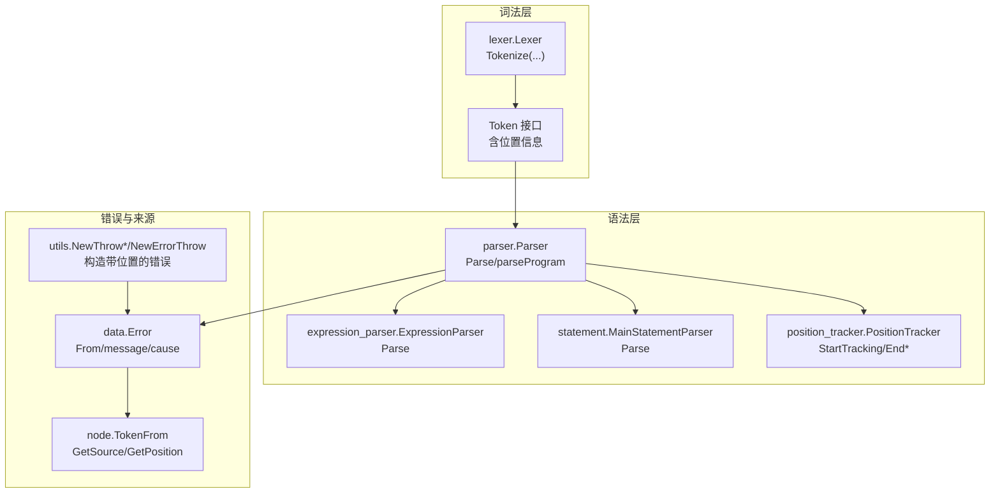
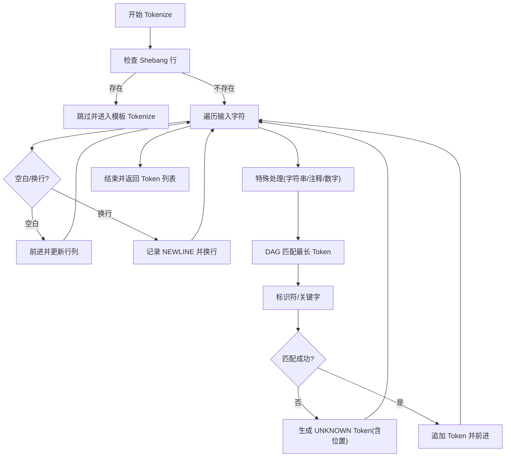
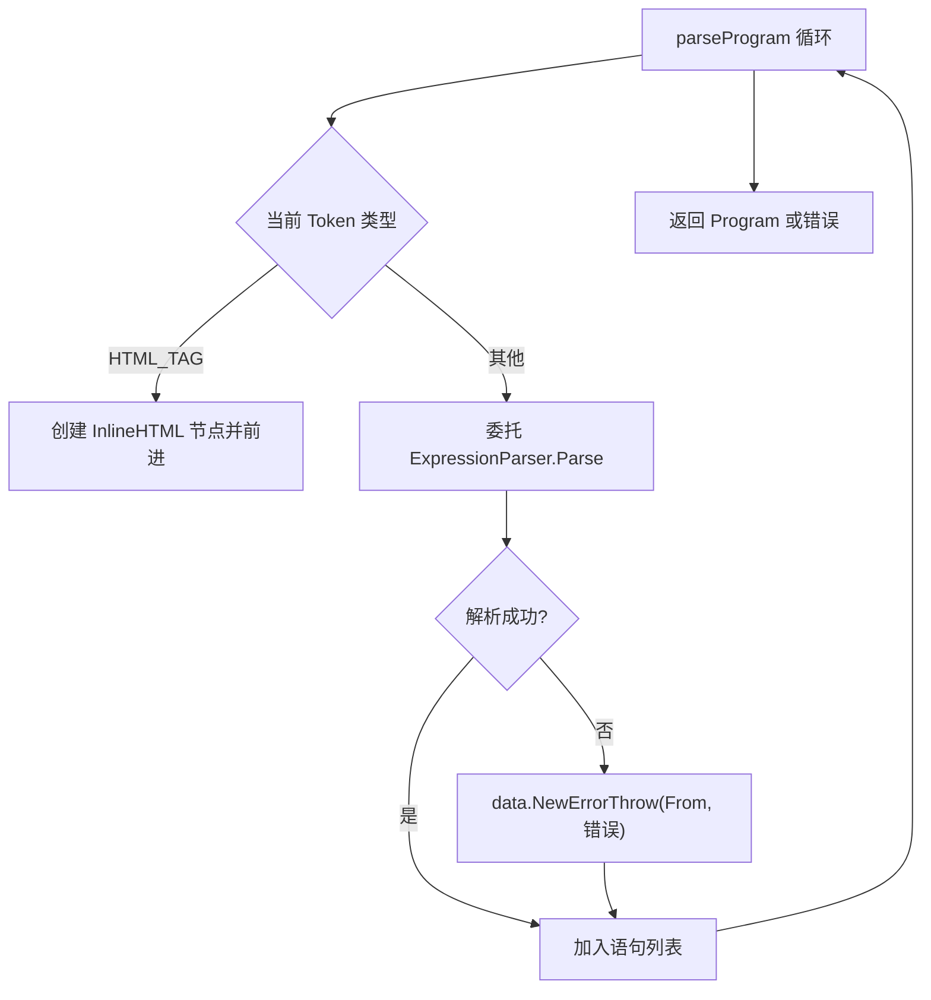
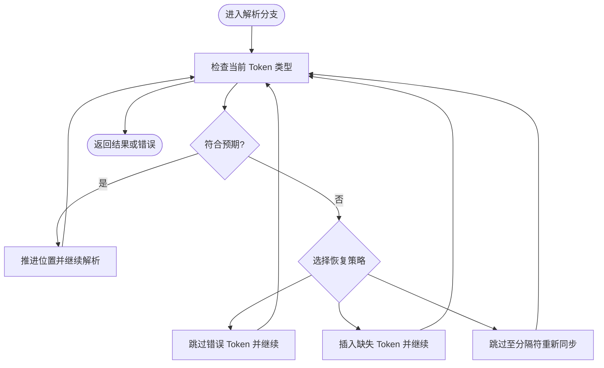
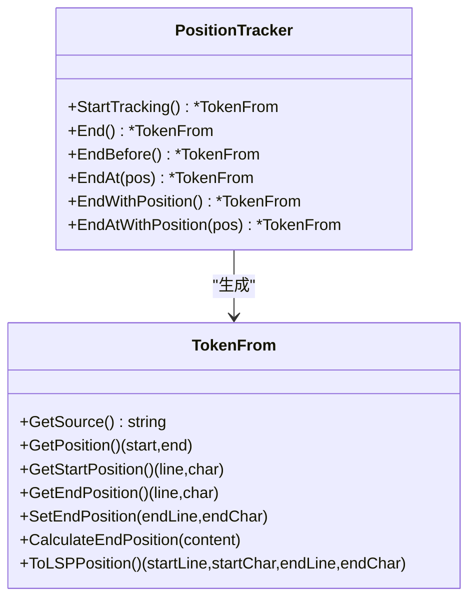
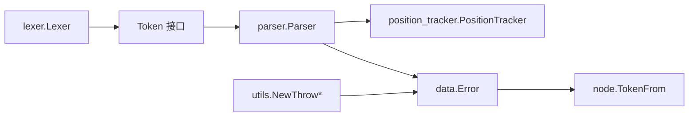

# 错误恢复机制

<cite>
**本文档引用的文件**
- [parser.go](file://parser/parser.go)
- [expression_parser.go](file://parser/expression_parser.go)
- [statement.go](file://parser/statement.go)
- [position_tracker.go](file://parser/position_tracker.go)
- [parser_print.go](file://parser/parser_print.go)
- [lexer.go](file://lexer/lexer.go)
- [special.go](file://lexer/special.go)
- [from.go](file://node/from.go)
- [err.go](file://node/err.go)
- [error_wrap.go](file://utils/error_wrap.go)
- [error.go](file://data/error.go)
</cite>

## 目录
1. [引言](#引言)
2. [项目结构](#项目结构)
3. [核心组件](#核心组件)
4. [架构总览](#架构总览)
5. [详细组件分析](#详细组件分析)
6. [依赖分析](#依赖分析)
7. [性能考量](#性能考量)
8. [故障排查指南](#故障排查指南)
9. [结论](#结论)
10. [附录](#附录)

## 引言
本文件系统性阐述该编译器的错误恢复机制，覆盖语法分析器的错误收集、错误报告与错误恢复策略。重点包括：
- 错误定位与分类：基于词法单元位置信息的精确来源追踪
- 错误传播：从词法/语法解析到运行时的统一错误对象与堆栈
- 错误恢复算法：跳过错误令牌、插入缺失令牌、重新同步等策略
- 与运行时的集成：位置信息传递、调试信息生成与可点击堆栈
- 性能与最佳实践：错误收集与报告的成本控制
- 扩展接口：为开发者提供自定义错误处理策略的入口

## 项目结构
围绕错误恢复的关键模块如下：
- 词法分析器：负责将源码切分为词法单元，记录行/列/偏移等位置信息
- 语法分析器：驱动解析流程，集中收集与传播错误，生成 AST
- 位置跟踪器：自动维护解析范围，生成 TokenFrom 来源信息
- 错误包装与运行时：统一错误对象、堆栈帧与可点击的诊断输出
- 节点来源接口：提供统一的来源信息访问能力



图表来源
- [lexer.go:88-248](file://lexer/lexer.go#L88-L248)
- [parser.go:86-158](file://parser/parser.go#L86-L158)
- [expression_parser.go:26-33](file://parser/expression_parser.go#L26-L33)
- [statement.go:20-45](file://parser/statement.go#L20-L45)
- [position_tracker.go:16-72](file://parser/position_tracker.go#L16-L72)
- [from.go:18-53](file://node/from.go#L18-L53)
- [error_wrap.go:10-34](file://utils/error_wrap.go#L10-L34)
- [error.go:11-49](file://data/error.go#L11-L49)

章节来源
- [lexer.go:88-248](file://lexer/lexer.go#L88-L248)
- [parser.go:86-158](file://parser/parser.go#L86-L158)
- [position_tracker.go:16-72](file://parser/position_tracker.go#L16-L72)
- [from.go:18-53](file://node/from.go#L18-L53)
- [error_wrap.go:10-34](file://utils/error_wrap.go#L10-L34)
- [error.go:11-49](file://data/error.go#L11-L49)

## 核心组件
- 词法分析器 Lexer：将输入字符串切分为 Token，记录起止偏移、行号、列号，遇到未知字符产生 UNKNOWN 类型 Token，便于后续错误定位
- 语法分析器 Parser：集中管理错误列表、位置跟踪、错误传播与显示；提供错误收集与运行时堆栈输出
- 位置跟踪器 PositionTracker：自动记录解析起点与终点，生成 TokenFrom 用于错误来源标注
- 错误包装工具 NewThrow/NewErrorThrow：基于调用点生成 From，封装为统一的错误控制对象
- 来源接口 TokenFrom：提供 GetSource/GetPosition/ToLSPPosition 等能力，支撑可点击的诊断输出

章节来源
- [lexer.go:88-248](file://lexer/lexer.go#L88-L248)
- [parser.go:18-50](file://parser/parser.go#L18-L50)
- [position_tracker.go:16-72](file://parser/position_tracker.go#L16-L72)
- [error_wrap.go:10-34](file://utils/error_wrap.go#L10-L34)
- [from.go:18-53](file://node/from.go#L18-L53)

## 架构总览
错误恢复贯穿“词法 -> 语法 -> 运行时”三阶段，形成闭环：
- 词法阶段：对无法识别的字符生成 UNKNOWN Token，携带位置信息
- 语法阶段：在解析失败处收集错误，必要时进行跳过/插入/重新同步，尽量恢复后续解析
- 运行时阶段：将错误与堆栈帧组合，输出可点击的堆栈与上下文

```mermaid
sequenceDiagram
participant SRC as "源码"
participant LEX as "词法分析器"
participant TOK as "Token 列表"
participant PAR as "语法分析器"
participant AST as "AST/错误列表"
participant RUN as "运行时"
SRC->>LEX : 输入字符串
LEX->>TOK : Tokenize(...) 生成 Token(含位置)
TOK->>PAR : 逐 Token 解析
PAR->>AST : 解析成功/失败
PAR->>RUN : 发生运行时错误时传递错误与堆栈
RUN-->>PAR : 返回 ThrowValue/错误控制
PAR-->>SRC : 输出错误消息与堆栈(可点击)
```

图表来源
- [lexer.go:88-248](file://lexer/lexer.go#L88-L248)
- [parser.go:86-158](file://parser/parser.go#L86-L158)
- [parser_print.go:48-68](file://parser/parser_print.go#L48-L68)

## 详细组件分析

### 词法分析与错误定位
- 词法分析器在无法匹配任何规则时，生成 UNKNOWN Token，并记录起止偏移与行列信息，保证后续错误定位的准确性
- 特殊处理：Shebang 行被跳过；HTML 模板使用专用 HTML 词法器；字符串/注释等复杂结构通过特殊处理函数维护换行与行列信息



图表来源
- [lexer.go:88-248](file://lexer/lexer.go#L88-L248)
- [special.go:317-366](file://lexer/special.go#L317-L366)

章节来源
- [lexer.go:88-248](file://lexer/lexer.go#L88-L248)
- [special.go:317-366](file://lexer/special.go#L317-L366)

### 语法解析与错误收集
- 解析器集中维护错误列表，遇到无法识别的语句或语法块时，生成带来源的错误并继续推进解析
- 位置信息由 TokenFrom 提供，支持从当前位置或范围区间生成精确来源



图表来源
- [parser.go:86-158](file://parser/parser.go#L86-L158)
- [statement.go:20-45](file://parser/statement.go#L20-L45)
- [expression_parser.go:26-33](file://parser/expression_parser.go#L26-L33)

章节来源
- [parser.go:86-158](file://parser/parser.go#L86-L158)
- [statement.go:20-45](file://parser/statement.go#L20-L45)
- [expression_parser.go:26-33](file://parser/expression_parser.go#L26-L33)

### 错误恢复策略与算法
- 跳过错误令牌：当解析失败但仍有可识别的后续 Token 时，解析器通过推进位置继续解析，避免中断
- 插入缺失令牌：在某些上下文中，解析器可根据上下文推断应存在的令牌并“插入”，以恢复语法一致性
- 重新同步：当遇到严重错误时，解析器通过跳过直到分隔符（如分号、右大括号）来重新同步，恢复后续解析
- 位置回填：若运行时错误缺少来源信息，解析器会使用当前位置回填 TokenFrom，保证错误可定位



图表来源
- [parser.go:226-239](file://parser/parser.go#L226-L239)
- [parser.go:426-470](file://parser/parser.go#L426-L470)

章节来源
- [parser.go:226-239](file://parser/parser.go#L226-L239)
- [parser.go:426-470](file://parser/parser.go#L426-L470)

### 错误报告与堆栈生成
- 错误包装：通过 NewThrow/NewErrorThrow 基于调用点生成 From，封装为统一错误控制对象
- 运行时错误：ShowControl 优先处理 ThrowValue，输出“致命错误”消息与可点击堆栈；若无来源则回填当前位置
- 上下文输出：printContext 打印前后若干 Token，帮助定位问题

```mermaid
sequenceDiagram
participant PAR as "Parser.ShowControl"
participant ACL as "错误控制"
participant RUN as "运行时错误"
participant OUT as "标准错误"
PAR->>ACL : AsString()
alt ThrowValue
PAR->>RUN : 读取 StackFrames
RUN-->>PAR : 堆栈帧列表
PAR->>OUT : 打印运行时错误(含来源)
PAR->>OUT : 打印堆栈(可点击 path : line : col)
else 其他错误
PAR->>OUT : 打印详细错误(含来源)
end
```

图表来源
- [parser.go:251-298](file://parser/parser.go#L251-L298)
- [parser_print.go:48-68](file://parser/parser_print.go#L48-L68)
- [error_wrap.go:10-34](file://utils/error_wrap.go#L10-L34)

章节来源
- [parser.go:251-298](file://parser/parser.go#L251-L298)
- [parser_print.go:48-68](file://parser/parser_print.go#L48-L68)
- [error_wrap.go:10-34](file://utils/error_wrap.go#L10-L34)

### 位置信息与来源追踪
- TokenFrom：统一的来源接口，支持获取文件路径、偏移范围、行列范围，并可转换为 LSP 位置
- 位置跟踪器：StartTracking/EndBefore 等方法自动维护解析范围，生成精确的 TokenFrom
- 回退与补全：当运行时错误缺少来源时，解析器使用当前位置创建 TokenFrom，确保错误可定位



图表来源
- [from.go:18-115](file://node/from.go#L18-L115)
- [position_tracker.go:16-179](file://parser/position_tracker.go#L16-L179)

章节来源
- [from.go:18-115](file://node/from.go#L18-L115)
- [position_tracker.go:16-179](file://parser/position_tracker.go#L16-L179)

### 与运行时的集成
- 错误传播：运行时抛出的 ThrowValue 会被解析器捕获，统一记录到错误列表并输出堆栈
- 来源补全：若 ThrowValue 中的 Error.From 为空，解析器使用当前位置回填，保证可点击的“thrown at”位置
- 节点层辅助：checkThrowControlFrom 在节点执行时检查并补充来源信息，减少运行时遗漏

章节来源
- [parser.go:251-298](file://parser/parser.go#L251-L298)
- [err.go:6-17](file://node/err.go#L6-L17)

## 依赖分析
- 词法层依赖 token 定义与预处理，生成 Token 列表
- 语法层依赖词法 Token 与位置跟踪器，生成 AST 与错误
- 错误层依赖统一的错误对象与来源接口，提供可点击的诊断输出



图表来源
- [lexer.go:88-248](file://lexer/lexer.go#L88-L248)
- [parser.go:18-50](file://parser/parser.go#L18-L50)
- [position_tracker.go:16-72](file://parser/position_tracker.go#L16-L72)
- [from.go:18-53](file://node/from.go#L18-L53)
- [error_wrap.go:10-34](file://utils/error_wrap.go#L10-L34)
- [error.go:11-49](file://data/error.go#L11-L49)

章节来源
- [lexer.go:88-248](file://lexer/lexer.go#L88-L248)
- [parser.go:18-50](file://parser/parser.go#L18-L50)
- [position_tracker.go:16-72](file://parser/position_tracker.go#L16-L72)
- [from.go:18-53](file://node/from.go#L18-L53)
- [error_wrap.go:10-34](file://utils/error_wrap.go#L10-L34)
- [error.go:11-49](file://data/error.go#L11-L49)

## 性能考量
- 位置信息开销：TokenFrom 仅保存偏移与行列，避免冗余拷贝；PositionTracker 在 EndBefore 等场景下精确计算结束位置，减少不必要的范围扩展
- 错误收集成本：集中维护错误列表，避免频繁分配；仅在必要时生成堆栈帧，降低运行时开销
- 词法阶段优化：DAG 匹配与最长优先策略减少回溯；UNKNOWN Token 的生成有助于快速定位问题字符
- 恢复策略权衡：跳过/插入/重新同步的选择需平衡恢复效果与性能；建议在常见错误点采用更高效的跳过策略

## 故障排查指南
- 无法识别语句：检查当前 Token 类型与解析器分支，确认是否遗漏分隔符或缺少必需 Token
- 三目运算符错误：确认“?”与“:”成对出现，避免缺省分支导致的解析失败
- 上下文定位：使用 printContext 查看前后若干 Token，结合 TokenFrom 的行列信息精确定位
- 堆栈不可点击：若“thrown at”位置异常，检查运行时错误是否缺少来源，解析器会自动回填当前位置

章节来源
- [parser.go:124-158](file://parser/parser.go#L124-L158)
- [expression_parser.go:178-180](file://parser/expression_parser.go#L178-L180)
- [parser_print.go:70-85](file://parser/parser_print.go#L70-L85)

## 结论
该编译器的错误恢复机制以“精确来源 + 统一错误对象 + 可点击堆栈”为核心，结合跳过、插入与重新同步策略，在保证解析连续性的同时最大化用户体验。通过位置跟踪器与 TokenFrom 的配合，实现了从词法到运行时的无缝溯源；通过集中错误收集与格式化输出，提供了清晰的诊断信息。

## 附录
- 扩展接口建议
  - 自定义错误处理策略：在解析器中增加策略注册点，允许按语法上下文选择不同的恢复策略
  - 来源增强：在 TokenFrom 中扩展更多元信息（如符号表索引、作用域链），辅助静态分析
  - LSP 集成：利用 TokenFrom.ToLSPPosition，为语言服务器提供精准的诊断与跳转支持
- 最佳实践
  - 在关键解析点使用 StartTracking/EndBefore 精确标注来源
  - 对常见错误（如分号缺失、括号不匹配）采用跳过策略快速恢复
  - 对复杂语法（如三目运算符）在插入缺失 Token 前进行上下文判断，提高成功率