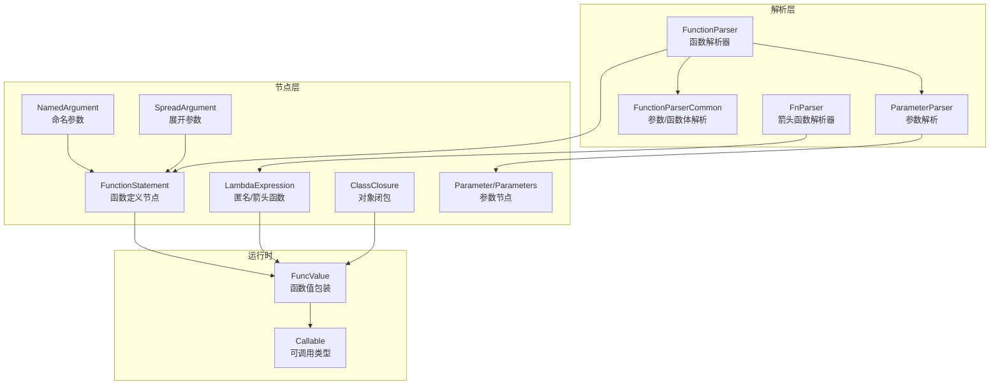
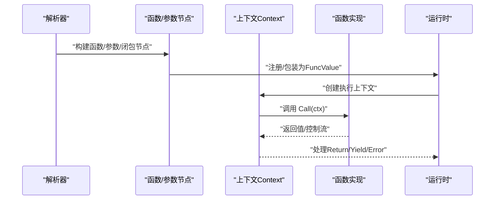
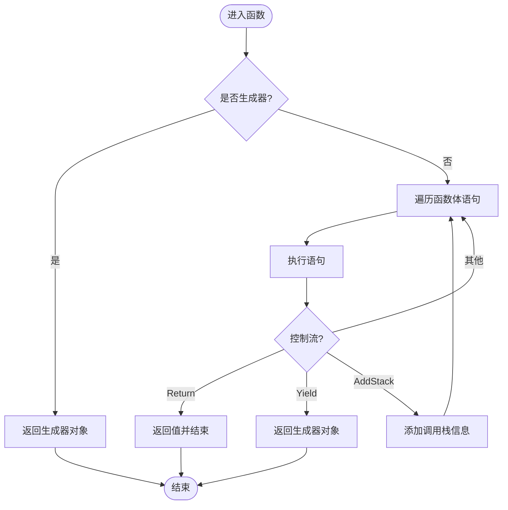
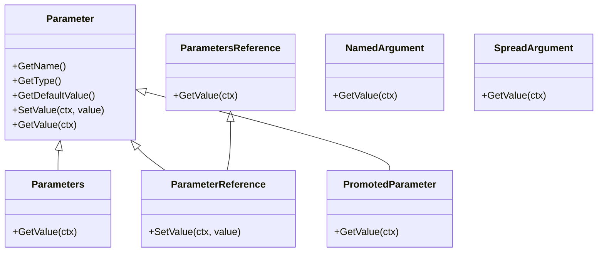
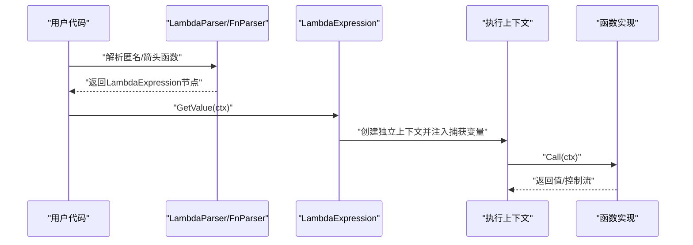
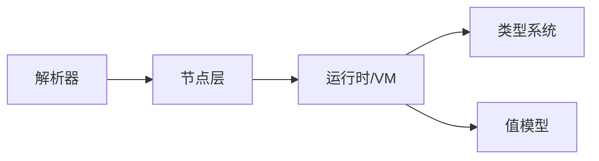

# 函数系统

<cite>
**本文引用的文件**
- [node/function.go](file://node/function.go)
- [parser/function_parser.go](file://parser/function_parser.go)
- [parser/function_parser_common.go](file://parser/function_parser_common.go)
- [parser/parameter_parser.go](file://parser/parameter_parser.go)
- [node/lambda.go](file://node/lambda.go)
- [node/closure.go](file://node/closure.go)
- [parser/fn_parser.go](file://parser/fn_parser.go)
- [node/name_argument.go](file://node/name_argument.go)
- [node/spread_argument.go](file://node/spread_argument.go)
- [node/func_get_args.go](file://node/func_get_args.go)
- [data/value_call.go](file://data/value_call.go)
- [data/type_callable.go](file://data/type_callable.go)
- [tests/func/001.zy](file://tests/func/001.zy)
- [tests/func/002.zy](file://tests/func/002.zy)
- [tests/func/003.zy](file://tests/func/003.zy)
- [tests/func/004.zy](file://tests/func/004.zy)
- [tests/func/005.zy](file://tests/func/005.zy)
- [tests/func/006.zy](file://tests/func/006.zy)
</cite>

## 目录
1. [简介](#简介)
2. [项目结构](#项目结构)
3. [核心组件](#核心组件)
4. [架构总览](#架构总览)
5. [详细组件分析](#详细组件分析)
6. [依赖分析](#依赖分析)
7. [性能考量](#性能考量)
8. [故障排查指南](#故障排查指南)
9. [结论](#结论)
10. [附录](#附录)

## 简介
本章节面向Origami语言的函数系统，提供从语法到运行时的完整参考文档。内容覆盖函数定义、参数处理（位置参数、命名参数、可变参数、引用参数、默认值）、返回值与多返回值、闭包与匿名函数（含箭头函数）、以及调用时的控制流与错误处理。文档同时给出关键流程的可视化图示，并通过测试样例定位具体行为。

## 项目结构
函数系统涉及的代码主要分布在以下模块：
- 语法解析：parser目录下的函数解析器、参数解析器、箭头函数解析器
- 语法树节点：node目录下的函数、参数、闭包、lambda、命名参数、展开参数等节点
- 类型与调用：data目录下的函数值包装、可调用类型判断
- 测试与示例：tests/func目录下的用例

图表来源
- [parser/function_parser.go:24-155](file://parser/function_parser.go#L24-L155)
- [parser/function_parser_common.go:48-86](file://parser/function_parser_common.go#L48-L86)
- [parser/parameter_parser.go:12-213](file://parser/parameter_parser.go#L12-L213)
- [parser/fn_parser.go:48-121](file://parser/fn_parser.go#L48-L121)
- [node/function.go:10-150](file://node/function.go#L10-L150)
- [node/lambda.go:7-103](file://node/lambda.go#L7-L103)
- [node/closure.go:10-49](file://node/closure.go#L10-L49)
- [data/value_call.go:5-30](file://data/value_call.go#L5-L30)
- [data/type_callable.go:3-19](file://data/type_callable.go#L3-L19)

章节来源
- [parser/function_parser.go:24-155](file://parser/function_parser.go#L24-L155)
- [parser/function_parser_common.go:48-86](file://parser/function_parser_common.go#L48-L86)
- [parser/parameter_parser.go:12-213](file://parser/parameter_parser.go#L12-L213)
- [parser/fn_parser.go:48-121](file://parser/fn_parser.go#L48-L121)
- [node/function.go:10-150](file://node/function.go#L10-L150)
- [node/lambda.go:7-103](file://node/lambda.go#L7-L103)
- [node/closure.go:10-49](file://node/closure.go#L10-L49)
- [data/value_call.go:5-30](file://data/value_call.go#L5-L30)
- [data/type_callable.go:3-19](file://data/type_callable.go#L3-L19)

## 核心组件
- 函数定义节点：封装函数名、参数、函数体、符号表、返回类型、是否生成器等信息；负责函数体执行与返回值类型校验。
- 参数节点族：位置参数、默认值、引用参数、可变参数、属性提升参数、命名参数、展开参数、原始AST参数等。
- 匿名/箭头函数：LambdaExpression，支持use捕获、按值/按引用捕获、独立执行上下文。
- 对象闭包：ClassClosure，将对象方法包装为闭包，保持this语义。
- 函数值包装与可调用类型：FuncValue包装任意函数实现，Callable类型判断支持函数、数组、字符串形式的可调用。

章节来源
- [node/function.go:10-150](file://node/function.go#L10-L150)
- [node/function.go:152-395](file://node/function.go#L152-L395)
- [node/lambda.go:7-103](file://node/lambda.go#L7-L103)
- [node/closure.go:10-49](file://node/closure.go#L10-L49)
- [data/value_call.go:5-30](file://data/value_call.go#L5-L30)
- [data/type_callable.go:3-19](file://data/type_callable.go#L3-L19)

## 架构总览
函数系统从词法/语法解析开始，构建AST节点，再在运行时通过Context进行变量绑定与执行。调用时统一由FuncValue转发至具体函数实现，支持返回值类型校验、yield生成器、错误栈记录等。

图表来源
- [parser/function_parser.go:141-154](file://parser/function_parser.go#L141-L154)
- [node/function.go:103-150](file://node/function.go#L103-L150)
- [data/value_call.go:19-21](file://data/value_call.go#L19-L21)

## 详细组件分析

### 函数定义与执行
- 定义语法：function name(...) [returns ...] { ... }，支持命名空间拼接、返回类型（含联合/多返回值）、生成器检测。
- 执行语义：若为生成器，调用即返回生成器对象；否则顺序执行函数体，遇到return/yield时中断并返回结果或生成器。
- 返回值类型校验：若声明了返回类型且实际返回值不匹配，抛出类型错误。

图表来源
- [node/function.go:103-150](file://node/function.go#L103-L150)

章节来源
- [node/function.go:10-150](file://node/function.go#L10-L150)
- [parser/function_parser.go:24-155](file://parser/function_parser.go#L24-L155)

### 参数系统
- 位置参数：支持类型声明（含联合类型、可空类型、self）、默认值、引用传递（&...$vars）。
- 命名参数：调用时以 name: value 形式传入，解析为NamedArgument节点。
- 展开参数：调用时以 ...expr 形式传入，解析为SpreadArgument节点，具体展开语义由调用处处理。
- 参数默认值：当变量值为空时，优先使用默认值表达式求值并写回。
- 引用参数：use (&$var) 或参数声明时 &...$vars，按引用捕获/传递。
- 属性提升：构造函数参数可提升为属性，支持readonly与注解。

图表来源
- [node/function.go:152-395](file://node/function.go#L152-L395)
- [node/name_argument.go:5-23](file://node/name_argument.go#L5-L23)
- [node/spread_argument.go:7-34](file://node/spread_argument.go#L7-L34)

章节来源
- [parser/parameter_parser.go:12-213](file://parser/parameter_parser.go#L12-L213)
- [parser/function_parser_common.go:48-86](file://parser/function_parser_common.go#L48-L86)
- [node/function.go:152-395](file://node/function.go#L152-L395)
- [node/name_argument.go:5-23](file://node/name_argument.go#L5-L23)
- [node/spread_argument.go:7-34](file://node/spread_argument.go#L7-L34)

### 闭包与匿名函数
- 匿名函数（Lambda）：支持use捕获，区分按值与按引用捕获；执行时创建独立上下文，避免污染调用方环境。
- 对象闭包（ClassClosure）：将对象方法包装为闭包，保持this语义，参数槽位复制自对象上下文。
- 箭头函数（fn）：语法糖，自动捕获外部变量（按值），函数体为单表达式，不绑定$this。

图表来源
- [parser/fn_parser.go:48-121](file://parser/fn_parser.go#L48-L121)
- [node/lambda.go:27-103](file://node/lambda.go#L27-L103)
- [node/closure.go:10-49](file://node/closure.go#L10-L49)

章节来源
- [parser/fn_parser.go:48-121](file://parser/fn_parser.go#L48-L121)
- [node/lambda.go:27-103](file://node/lambda.go#L27-L103)
- [node/closure.go:10-49](file://node/closure.go#L10-L49)

### 返回值与多返回值
- 单返回值：按声明类型进行类型校验。
- 多返回值：返回类型可声明为逗号分隔的多个类型，调用侧可同时接收多个值。
- 生成器：函数体含yield时，调用返回生成器对象而非执行函数体。

章节来源
- [node/function.go:103-150](file://node/function.go#L103-L150)
- [parser/function_parser.go:215-321](file://parser/function_parser.go#L215-L321)
- [tests/func/006.zy:1-20](file://tests/func/006.zy#L1-L20)

### 调用与可调用类型
- 函数值包装：FuncValue统一承载函数实现，调用时转发至具体实现。
- 可调用类型：Callable支持函数、数组、字符串形式的可调用。

章节来源
- [data/value_call.go:5-30](file://data/value_call.go#L5-L30)
- [data/type_callable.go:3-19](file://data/type_callable.go#L3-L19)

### 特殊参数与工具
- func_get_args：在函数内获取所有实参表达式求值后的数组。
- 命名参数与展开参数：分别对应NamedArgument与SpreadArgument节点，调用时按需处理。

章节来源
- [node/func_get_args.go:19-42](file://node/func_get_args.go#L19-L42)
- [node/name_argument.go:19-23](file://node/name_argument.go#L19-L23)
- [node/spread_argument.go:22-34](file://node/spread_argument.go#L22-L34)

## 依赖分析
- 解析层依赖作用域管理器与类型解析器，生成函数/参数/闭包节点。
- 节点层依赖数据层的类型系统与值模型，完成变量绑定、默认值求值、引用传递等。
- 运行时通过FuncValue桥接节点与VM，统一处理调用、返回、错误与栈信息。

图表来源
- [parser/function_parser.go:24-155](file://parser/function_parser.go#L24-L155)
- [node/function.go:10-150](file://node/function.go#L10-L150)
- [data/value_call.go:5-30](file://data/value_call.go#L5-L30)

## 性能考量
- 闭包捕获：use按值捕获会产生额外的值拷贝；按引用捕获避免拷贝但需注意生命周期与副作用。
- 默认值求值：默认值表达式在参数为空时才求值，避免不必要的计算。
- 生成器：延迟执行，减少一次性内存占用，适合大数据流处理。
- 类型校验：返回值类型校验在每次返回时进行，建议在热点路径中谨慎使用复杂联合类型。

## 故障排查指南
- 返回值类型不匹配：当函数声明了返回类型而实际返回值不满足类型约束时，会抛出类型错误。请检查返回值类型与声明是否一致。
- 生成器未执行：若函数含yield，调用将返回生成器对象而非执行函数体。请使用迭代方式消费生成器。
- 命名参数与展开参数：命名参数需与形参名严格匹配；展开参数的展开语义由调用处实现，注意边界情况。
- 引用参数与默认值：引用参数不支持默认值（解析阶段可能报错）。请移除默认值或改用按值传递。
- 错误栈信息：函数体执行过程中产生的AddStack控制流会叠加调用栈信息，便于定位问题。

章节来源
- [node/function.go:116-145](file://node/function.go#L116-L145)
- [parser/parameter_parser.go:204-206](file://parser/parameter_parser.go#L204-L206)

## 结论
Origami语言的函数系统提供了完善的函数定义、参数处理、返回值与闭包能力。通过解析器与节点层的清晰分离，配合运行时的上下文与类型系统，既保证了语法灵活性，又确保了执行效率与可维护性。建议在复杂场景中合理使用多返回值、生成器与闭包，并结合测试用例验证行为一致性。

## 附录

### 语法与用例速览
- 基本函数与返回值：见测试用例
  - [tests/func/001.zy:1-7](file://tests/func/001.zy#L1-L7)
  - [tests/func/002.zy:1-22](file://tests/func/002.zy#L1-L22)
- 默认参数与混合默认值：见测试用例
  - [tests/func/003.zy:1-13](file://tests/func/003.zy#L1-L13)
  - [tests/func/004.zy:1-25](file://tests/func/004.zy#L1-L25)
- 类型与默认值混合、返回值类型校验：见测试用例
  - [tests/func/005.zy:1-32](file://tests/func/005.zy#L1-L32)
- 多返回值：见测试用例
  - [tests/func/006.zy:1-20](file://tests/func/006.zy#L1-L20)