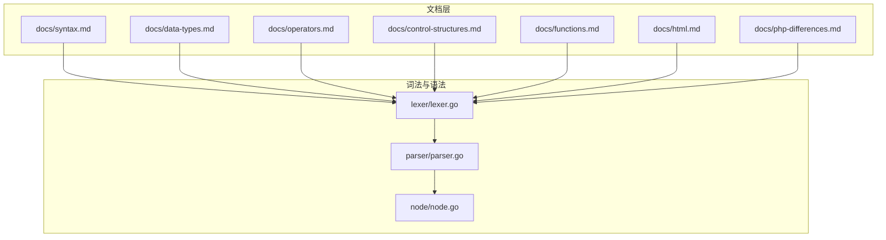
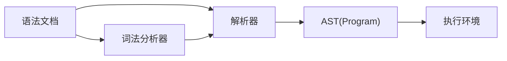

# 基础语法

<cite>
**本文引用的文件**
- [docs/syntax.md](file://docs/syntax.md)
- [docs/data-types.md](file://docs/data-types.md)
- [docs/operators.md](file://docs/operators.md)
- [docs/control-structures.md](file://docs/control-structures.md)
- [docs/functions.md](file://docs/functions.md)
- [docs/html.md](file://docs/html.md)
- [docs/php-differences.md](file://docs/php-differences.md)
- [lexer/lexer.go](file://lexer/lexer.go)
- [parser/parser.go](file://parser/parser.go)
- [node/node.go](file://node/node.go)
</cite>

## 目录
1. [简介](#简介)
2. [项目结构](#项目结构)
3. [核心组件](#核心组件)
4. [架构总览](#架构总览)
5. [详细组件分析](#详细组件分析)
6. [依赖分析](#依赖分析)
7. [性能考量](#性能考量)
8. [故障排查指南](#故障排查指南)
9. [结论](#结论)
10. [附录](#附录)

## 简介
本文件为 Origami 语言的基础语法参考，覆盖文件结构、变量与数据类型、运算符、控制结构、函数、类与对象、异常处理、字符串与数组、命名空间与注释、以及 HTML 内嵌与模板等核心语法要素。同时，文档总结了与 PHP 的语法差异，帮助开发者在迁移与对比中准确理解语言特性。

## 项目结构
- 语法文档位于 docs 目录，涵盖语法、数据类型、运算符、控制结构、函数、HTML 渲染与模板、以及与 PHP 的差异。
- 词法与语法解析分别位于 lexer 与 parser 目录，node 目录提供 AST 节点与执行框架。
- 以上模块共同构成从“源码”到“AST”再到“执行”的完整链路。



图表来源
- [lexer/lexer.go:1-350](file://lexer/lexer.go#L1-L350)
- [parser/parser.go:1-821](file://parser/parser.go#L1-L821)
- [node/node.go:1-99](file://node/node.go#L1-L99)

章节来源
- [docs/syntax.md:1-602](file://docs/syntax.md#L1-L602)
- [docs/data-types.md:1-385](file://docs/data-types.md#L1-L385)
- [docs/operators.md:1-465](file://docs/operators.md#L1-L465)
- [docs/control-structures.md:1-560](file://docs/control-structures.md#L1-L560)
- [docs/functions.md:1-694](file://docs/functions.md#L1-L694)
- [docs/html.md:1-222](file://docs/html.md#L1-L222)
- [docs/php-differences.md:1-17](file://docs/php-differences.md#L1-L17)
- [lexer/lexer.go:1-350](file://lexer/lexer.go#L1-L350)
- [parser/parser.go:1-821](file://parser/parser.go#L1-L821)
- [node/node.go:1-99](file://node/node.go#L1-L99)

## 核心组件
- 词法分析器：负责将源码切分为 token，支持 PHP 兼容模式、Shebang 忽略、HTML 模式、标识符与关键字识别、特殊符号与插值字符串等。
- 解析器：将 token 转换为 AST（抽象语法树），支持命名空间、use 引入、类名解析、表达式解析、语句块解析等。
- AST 节点与执行：Program 节点承载语句序列，按顺序执行，支持返回、标签与跳转等控制流。

章节来源
- [lexer/lexer.go:88-248](file://lexer/lexer.go#L88-L248)
- [parser/parser.go:86-122](file://parser/parser.go#L86-L122)
- [node/node.go:30-99](file://node/node.go#L30-L99)

## 架构总览
从源码到执行的典型流程如下：

```mermaid
sequenceDiagram
participant Src as "源码(.zy/.php)"
participant Lex as "词法分析器(Lexer)"
participant Tok as "Token流"
participant Par as "解析器(Parser)"
participant AST as "AST(Program)"
participant VM as "执行环境(VM)"
Src->>Lex : 读取并切分为Token
Lex-->>Tok : 返回Token序列
Tok->>Par : 逐个消费Token
Par-->>AST : 构建AST(Program)
AST->>VM : 顺序执行语句
VM-->>Src : 输出结果/异常
```

图表来源
- [lexer/lexer.go:88-248](file://lexer/lexer.go#L88-L248)
- [parser/parser.go:124-158](file://parser/parser.go#L124-L158)
- [node/node.go:44-70](file://node/node.go#L44-L70)

## 详细组件分析

### 文件结构与扩展名
- 扩展名
  - .zy：Origami 脚本文件
  - .php：PHP 兼容脚本文件（解析时会忽略 Shebang）
- 基本结构
  - 可选命名空间声明
  - 可选 use 引入
  - 代码主体（函数、类、语句等）

章节来源
- [docs/syntax.md:5-21](file://docs/syntax.md#L5-L21)
- [parser/parser.go:86-122](file://parser/parser.go#L86-L122)

### 变量与数据类型
- 变量声明
  - 基本声明与类型声明（支持 string/int/bool/float/array/object/null/void 等）
  - 可空类型（?T）
- 数据类型体系
  - 基本类型：int、string、bool、float、null
  - 复合类型：array、object
  - 类型转换：自动与显式
  - 类型检查与断言
- 类型声明与最佳实践
  - 函数参数与返回值类型声明
  - 混合类型（mixed）的使用场景与风险

章节来源
- [docs/syntax.md:23-64](file://docs/syntax.md#L23-L64)
- [docs/data-types.md:5-385](file://docs/data-types.md#L5-L385)

### 运算符
- 算术、比较、逻辑、赋值、位运算、空合并、三元、instanceof 等
- 运算符优先级与短路求值
- 字符串连接与对象方法调用的符号约定

章节来源
- [docs/syntax.md:66-132](file://docs/syntax.md#L66-L132)
- [docs/operators.md:5-465](file://docs/operators.md#L5-L465)

### 控制结构
- 条件语句：if/elseif/else、三元表达式
- 循环语句：for、while、do-while、foreach
- 分支语句：switch、match
- 跳转语句：break、continue、return
- 异常处理：try-catch-finally

章节来源
- [docs/syntax.md:133-261](file://docs/syntax.md#L133-L261)
- [docs/control-structures.md:5-560](file://docs/control-structures.md#L5-L560)

### 函数
- 定义与调用、参数与返回值类型
- 默认参数、可变参数
- 匿名函数、箭头函数
- 递归、高阶函数、作用域与静态变量
- 多返回值（逗号分隔返回与多变量接收）

章节来源
- [docs/syntax.md:262-304](file://docs/syntax.md#L262-L304)
- [docs/functions.md:5-694](file://docs/functions.md#L5-L694)

### 类与对象
- 类定义、构造函数、方法、Getter/Setter
- 继承、接口实现、类型检查（instanceof 与 like）
- 对象创建与使用

章节来源
- [docs/syntax.md:305-397](file://docs/syntax.md#L305-L397)

### 异常处理
- try-catch 与 finally
- 抛出异常与错误处理

章节来源
- [docs/syntax.md:398-423](file://docs/syntax.md#L398-L423)
- [docs/control-structures.md:289-348](file://docs/control-structures.md#L289-L348)

### 字符串与数组
- 字符串字面量、插值、常用方法
- 数组字面量、索引/关联、常用方法

章节来源
- [docs/syntax.md:424-500](file://docs/syntax.md#L424-L500)
- [docs/data-types.md:48-183](file://docs/data-types.md#L48-L183)

### 命名空间与注释
- 命名空间声明与 use 引入
- 单行与多行注释

章节来源
- [docs/syntax.md:501-541](file://docs/syntax.md#L501-L541)

### 特殊语法：HTML 内嵌与模板
- 模板语法：表达式插值、for/if/elseif/else、动态属性（:attr）、内嵌脚本块
- 服务端 JavaScript 值输出（$.SERVER）
- 路由与静态资源映射

章节来源
- [docs/syntax.md:541-561](file://docs/syntax.md#L541-L561)
- [docs/html.md:46-222](file://docs/html.md#L46-L222)

### PHP 兼容语法与差异
- 符号 . 与 -> 的等价使用
- + 在 Origami 中用于字符串连接
- 数组与对象字面量区分（[] 与 {}）
- 注解与宏注解使用 @
- 允许无 <?php ?> 的 PHP 代码
- 变量声明可省略 $ 前缀
- if/for 等控制结构括号可省略
- 类型声明（string $x 与 $x: string）
- 函数多返回值
- spawn 协程关键字

章节来源
- [docs/php-differences.md:1-17](file://docs/php-differences.md#L1-L17)

### 词法与语法实现要点
- 词法分析
  - 支持 Shebang 忽略（兼容 .php）
  - HTML 模式识别（<!DOCTYPE）
  - DAG 匹配关键字与最长 token
  - 标识符与中文字符支持
- 语法解析
  - 程序解析与命名空间/uses收集
  - 表达式解析与语句块解析
  - 类名解析与命名空间展开
  - LingToken（插值字符串）解析与连接

章节来源
- [lexer/lexer.go:88-350](file://lexer/lexer.go#L88-L350)
- [parser/parser.go:86-158](file://parser/parser.go#L86-L158)
- [parser/parser.go:368-470](file://parser/parser.go#L368-L470)
- [parser/parser.go:681-730](file://parser/parser.go#L681-L730)

## 依赖分析
- 文档层依赖于语言特性与实现细节，形成“规范—实现—示例”的闭环。
- 词法与语法解析器之间为“Token 流”耦合，解析器依赖词法分析器的输出。
- AST 节点承载语义信息，执行阶段依赖 VM 完成求值与控制流。



图表来源
- [lexer/lexer.go:88-248](file://lexer/lexer.go#L88-L248)
- [parser/parser.go:124-158](file://parser/parser.go#L124-L158)
- [node/node.go:30-99](file://node/node.go#L30-L99)

章节来源
- [lexer/lexer.go:88-248](file://lexer/lexer.go#L88-L248)
- [parser/parser.go:124-158](file://parser/parser.go#L124-L158)
- [node/node.go:30-99](file://node/node.go#L30-L99)

## 性能考量
- 词法分析采用 DAG 匹配，提高关键字与最长 token 的识别效率。
- 解析器在遇到 HTML 开头时切换到 HTML 模式，避免误判与多余处理。
- 插值字符串（LingToken）在解析阶段即拆分为片段并连接，减少运行时开销。
- 控制结构与函数调用建议遵循“单一职责、参数校验、返回值一致性”的最佳实践，降低运行时错误与回溯成本。

## 故障排查指南
- 语法错误定位
  - 解析器在遇到无法识别的语句时会返回带来源位置的错误，可通过 Stack Trace 定位。
- 常见问题
  - 无限循环：检查循环变量更新与边界条件
  - 类型不匹配：核对参数与返回值类型声明
  - 空值处理：使用空合并运算符与严格比较
  - 字符串与数字比较：注意松散与严格比较差异
- HTML 模板
  - $.SERVER 输出需在 HTML 文本或 <script> 中使用
  - 动态属性以冒号前缀表示表达式求值

章节来源
- [parser/parser.go:251-298](file://parser/parser.go#L251-L298)
- [docs/control-structures.md:491-542](file://docs/control-structures.md#L491-L542)
- [docs/operators.md:404-447](file://docs/operators.md#L404-L447)
- [docs/html.md:201-207](file://docs/html.md#L201-L207)

## 结论
Origami 语言在保持与 PHP 语法高度兼容的同时，引入了更清晰的字符串连接、对象方法调用、HTML 模板与多返回值等特性。通过词法与语法解析的清晰分层，开发者可以基于本文档快速掌握语言基础，并结合最佳实践与故障排查指南提升开发效率与代码质量。

## 附录
- 进一步阅读
  - 标准库与 Go 集成
  - API 参考与示例工程
- 示例工程
  - HTML 示例、HTTP 示例、团队导航示例等