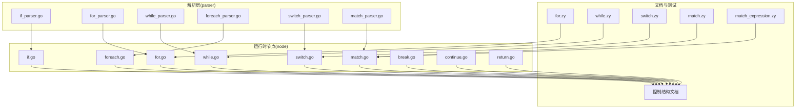
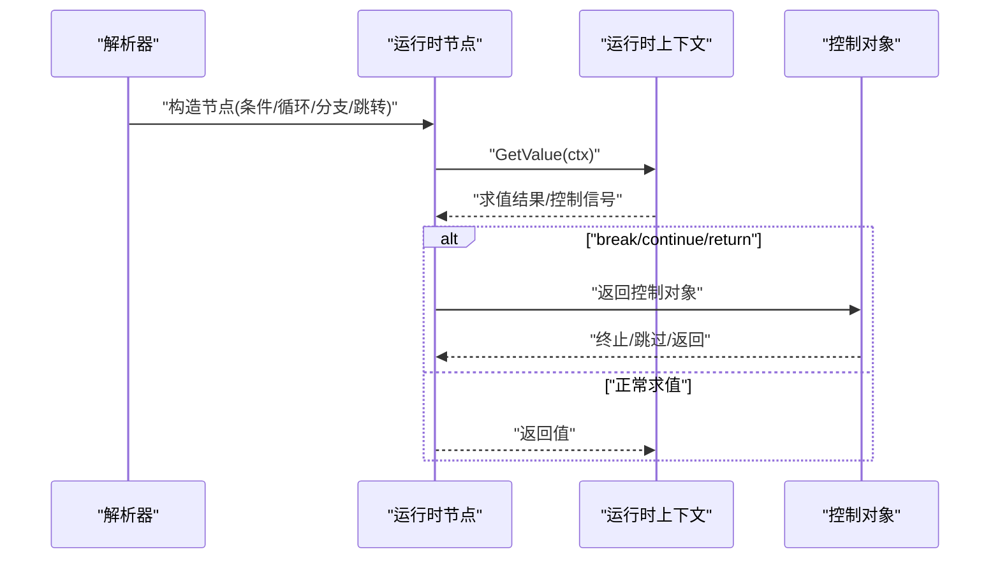
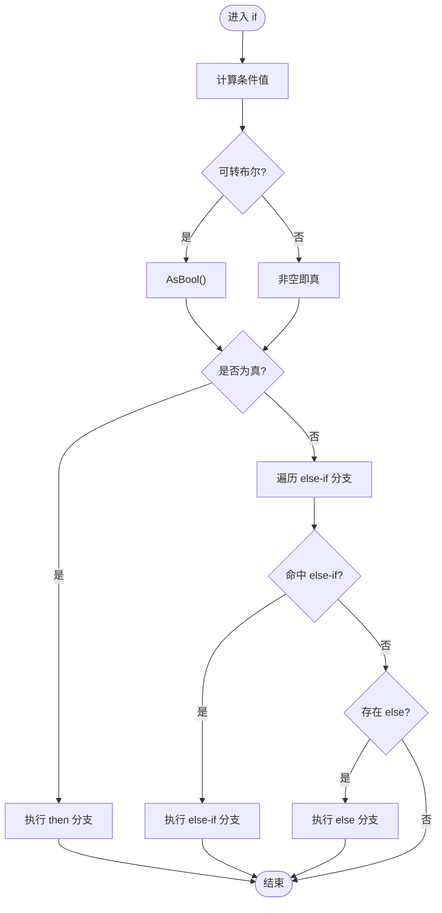
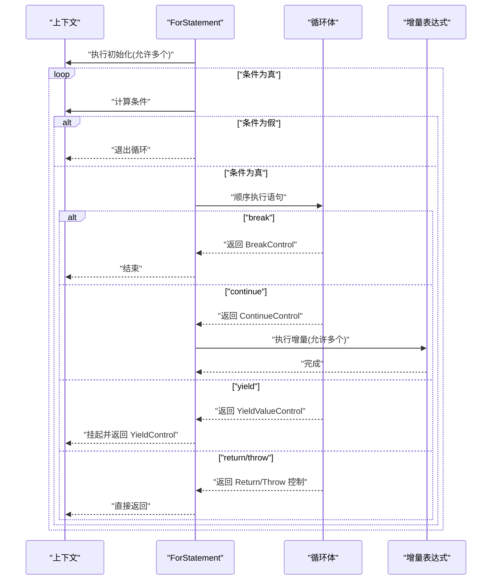
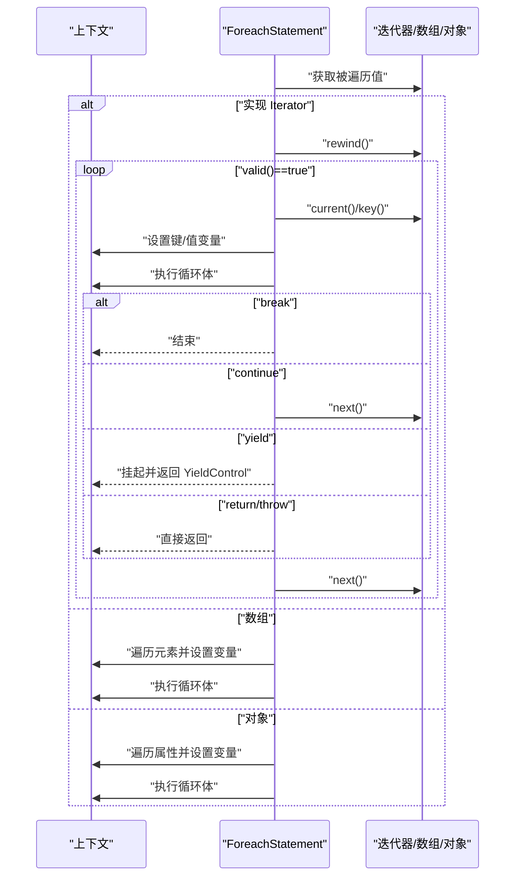
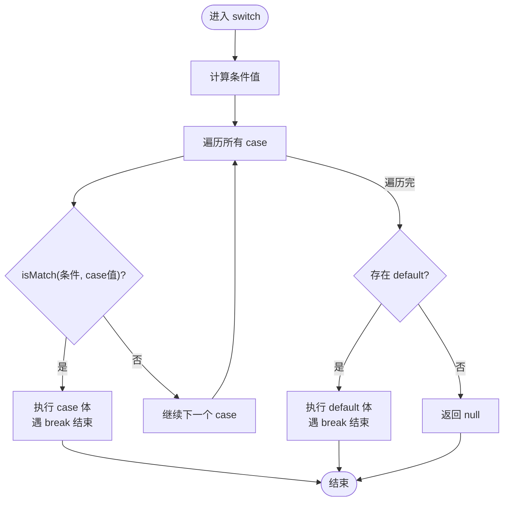
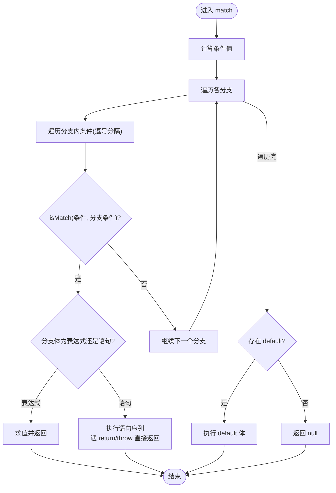
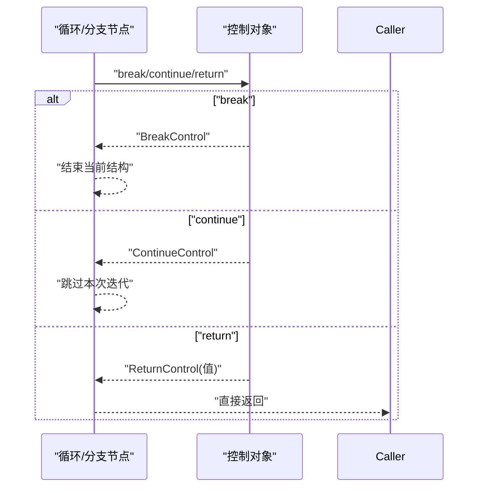
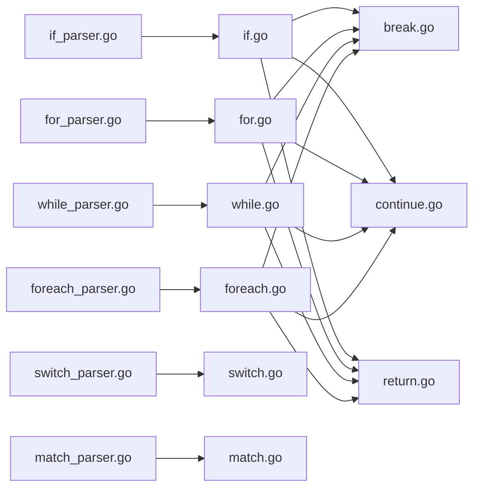

# 控制结构

<cite>
**本文引用的文件**
- [控制结构文档](file://docs/control-structures.md)
- [if.go](file://node/if.go)
- [for.go](file://node/for.go)
- [while.go](file://node/while.go)
- [foreach.go](file://node/foreach.go)
- [switch.go](file://node/switch.go)
- [match.go](file://node/match.go)
- [break.go](file://node/break.go)
- [continue.go](file://node/continue.go)
- [return.go](file://node/return.go)
- [if_parser.go](file://parser/if_parser.go)
- [for_parser.go](file://parser/for_parser.go)
- [while_parser.go](file://parser/while_parser.go)
- [foreach_parser.go](file://parser/foreach_parser.go)
- [switch_parser.go](file://parser/switch_parser.go)
- [match_parser.go](file://parser/match_parser.go)
- [for.zy](file://tests/basic/for.zy)
- [while.zy](file://tests/basic/while.zy)
- [switch.zy](file://tests/basic/switch.zy)
- [match.zy](file://tests/basic/match.zy)
- [match_expression.zy](file://tests/basic/match_expression.zy)
- [types.go](file://data/types.go)
- [type_int.go](file://data/type_int.go)
- [type_floath.go](file://data/type_floath.go)
- [type_bool.go](file://data/type_bool.go)
- [value_int.go](file://data/value_int.go)
- [value_float.go](file://data/value_float.go)
- [value_bool.go](file://data/value_bool.go)
- [value_string.go](file://data/value_string.go)
</cite>

## 更新摘要
**所做更改**
- 更新了 match 语句章节，反映了增强的功能支持
- 新增了多种数据类型模式匹配的详细说明
- 添加了整数、浮点数和布尔值比较的具体实现细节
- 更新了 match 语句的语法规范和使用场景
- 增强了最佳实践和常见错误提示

## 目录
1. [简介](#简介)
2. [项目结构](#项目结构)
3. [核心组件](#核心组件)
4. [架构总览](#架构总览)
5. [详细组件分析](#详细组件分析)
6. [依赖关系分析](#依赖关系分析)
7. [性能考量](#性能考量)
8. [故障排查指南](#故障排查指南)
9. [结论](#结论)
10. [附录](#附录)

## 简介
本文件为 Origami 语言控制结构的权威参考，覆盖条件语句（if/else）、循环语句（for/while/foreach）、分支语句（switch/match）以及跳转语句（break/continue/return）。文档基于仓库中的实现与测试用例，系统阐述语法规范、运行机制、数据流与控制流，并提供最佳实践与常见错误提示，帮助开发者编写清晰、高效、可维护的控制逻辑。

**更新** 本版本特别增强了 match 语句的功能说明，详细介绍了其支持的多种数据类型模式匹配能力。

## 项目结构
- 语法解析层（parser）：负责将源码解析为 AST 节点，构建控制结构的语法树节点。
- 运行时节点层（node）：定义各类控制结构节点及其执行逻辑，包括条件判断、循环、分支与跳转。
- 文档与测试：文档提供规范说明与示例，测试用例验证行为一致性。

**图表来源**
- [if_parser.go:24-94](file://parser/if_parser.go#L24-L94)
- [for_parser.go:24-198](file://parser/for_parser.go#L24-L198)
- [while_parser.go:22-51](file://parser/while_parser.go#L22-L51)
- [foreach_parser.go:24-138](file://parser/foreach_parser.go#L24-L138)
- [switch_parser.go:24-72](file://parser/switch_parser.go#L24-L72)
- [match_parser.go:25-87](file://parser/match_parser.go#L25-L87)
- [if.go:20-100](file://node/if.go#L20-L100)
- [for.go:5-76](file://node/for.go#L5-L76)
- [while.go:5-50](file://node/while.go#L5-L50)
- [foreach.go:61-306](file://node/foreach.go#L61-L306)
- [switch.go:54-96](file://node/switch.go#L54-L96)
- [match.go:53-88](file://node/match.go#L53-L88)
- [break.go:23-26](file://node/break.go#L23-L26)
- [continue.go:5-8](file://node/continue.go#L5-L8)
- [return.go:5-17](file://node/return.go#L5-L17)
- [控制结构文档:1-560](file://docs/control-structures.md#L1-L560)
- [for.zy:1-44](file://tests/basic/for.zy#L1-L44)
- [while.zy:1-11](file://tests/basic/while.zy#L1-L11)
- [switch.zy:1-51](file://tests/basic/switch.zy#L1-L51)
- [match.zy:1-41](file://tests/basic/match.zy#L1-L41)
- [match_expression.zy:1-88](file://tests/basic/match_expression.zy#L1-L88)

**章节来源**
- [控制结构文档:1-560](file://docs/control-structures.md#L1-L560)

## 核心组件
- 条件语句：if/elseif/else 分支与布尔条件求值。
- 循环语句：for（含 for in）、while、do-while（由 for/while 模拟）、foreach。
- 分支语句：switch（case/default）与 match（表达式分支）。
- 跳转语句：break、continue、return（含多值返回）。

**章节来源**
- [if.go:11-18](file://node/if.go#L11-L18)
- [for.go:79-85](file://node/for.go#L79-L85)
- [while.go:52-57](file://node/while.go#L52-L57)
- [foreach.go:52-59](file://node/foreach.go#L52-L59)
- [switch.go:35-41](file://node/switch.go#L35-L41)
- [match.go:34-40](file://node/match.go#L34-L40)
- [break.go:6-8](file://node/break.go#L6-L8)
- [continue.go:10-13](file://node/continue.go#L10-L13)
- [return.go:19-31](file://node/return.go#L19-L31)

## 架构总览
控制结构的执行路径遵循"解析 → AST 节点 → 求值与控制转移"的模式。解析器将源码片段转换为具体节点，节点在运行时上下文中逐条求值，遇到 break/continue/return 等控制对象时触发相应行为。

**图表来源**
- [if_parser.go:24-94](file://parser/if_parser.go#L24-L94)
- [for_parser.go:24-198](file://parser/for_parser.go#L24-L198)
- [while_parser.go:22-51](file://parser/while_parser.go#L22-L51)
- [foreach_parser.go:24-138](file://parser/foreach_parser.go#L24-L138)
- [switch_parser.go:24-72](file://parser/switch_parser.go#L24-L72)
- [match_parser.go:25-87](file://parser/match_parser.go#L25-L87)
- [if.go:20-100](file://node/if.go#L20-L100)
- [for.go:5-76](file://node/for.go#L5-L76)
- [while.go:5-50](file://node/while.go#L5-L50)
- [foreach.go:61-306](file://node/foreach.go#L61-L306)
- [switch.go:54-96](file://node/switch.go#L54-L96)
- [match.go:53-88](file://node/match.go#L53-L88)
- [break.go:23-26](file://node/break.go#L23-L26)
- [continue.go:5-8](file://node/continue.go#L5-L8)
- [return.go:5-17](file://node/return.go#L5-L17)

## 详细组件分析

### 条件语句 if/else
- 语法要点
  - 支持 if/elseif/else 分支链。
  - 条件可为表达式或分号分隔的三段式（形似 for 的 init; condition; increment）。
  - else if 可连续出现，最终可选 else 分支。
- 求值与控制流
  - 计算条件值并转换为布尔；若为非布尔可按"非空即真"判定。
  - 若 then 分支命中，顺序执行；否则依次尝试 else-if 分支，命中后执行对应体。
  - 若未命中任何分支且存在 else，则执行 else 体。
- 最佳实践
  - 优先使用 else-if 链而非深层嵌套 if。
  - 明确条件类型，避免隐式类型转换导致的歧义。
- 示例与测试
  - 文档示例与测试覆盖基本 if/else 分支与嵌套 if。

**图表来源**
- [if.go:20-100](file://node/if.go#L20-L100)
- [if_parser.go:24-94](file://parser/if_parser.go#L24-L94)

**章节来源**
- [if.go:11-18](file://node/if.go#L11-L18)
- [if.go:20-100](file://node/if.go#L20-L100)
- [if_parser.go:24-94](file://parser/if_parser.go#L24-L94)
- [控制结构文档:7-53](file://docs/control-structures.md#L7-L53)

### 循环语句 for/while/foreach
- for 循环
  - 支持初始化、条件、增量三段式；可多初始化/多增量。
  - 在每次迭代中先判断条件，再执行循环体，最后执行增量。
  - 支持 break/continue/yield/return 的即时控制。
- while 循环
  - 先判断条件，满足则执行循环体；continue 直接跳回条件判断。
- foreach 循环
  - 支持数组、实现 Iterator 接口的对象与原生迭代器。
  - 对数组：按索引顺序遍历，可同时提供键变量与值变量。
  - 对对象：遍历属性（保持插入顺序），可选键变量。
  - 对迭代器：调用 rewind/valid/current/key/next 方法推进迭代。
  - 支持 break/continue/yield/return 的即时控制。
- 测试验证
  - for 循环计数、for in 简化语法、无限循环与 break。
  - while 通过 for 模拟 while 行为。
  - foreach 覆盖数组、对象与迭代器三种形态。

**图表来源**
- [for.go:5-76](file://node/for.go#L5-L76)
- [for_parser.go:24-198](file://parser/for_parser.go#L24-L198)

**图表来源**
- [foreach.go:61-306](file://node/foreach.go#L61-L306)
- [foreach_parser.go:24-138](file://parser/foreach_parser.go#L24-L138)

**章节来源**
- [for.go:79-85](file://node/for.go#L79-L85)
- [for.go:5-76](file://node/for.go#L5-L76)
- [for_parser.go:24-198](file://parser/for_parser.go#L24-L198)
- [while.go:52-57](file://node/while.go#L52-L57)
- [while.go:5-50](file://node/while.go#L5-L50)
- [while_parser.go:22-51](file://parser/while_parser.go#L22-L51)
- [foreach.go:52-59](file://node/foreach.go#L52-L59)
- [foreach.go:61-306](file://node/foreach.go#L61-L306)
- [foreach_parser.go:24-138](file://parser/foreach_parser.go#L24-L138)
- [for.zy:1-44](file://tests/basic/for.zy#L1-L44)
- [while.zy:1-11](file://tests/basic/while.zy#L1-L11)

### 分支语句 switch/match
- switch
  - 支持 case/default 分支；每个 case 体可包含若干语句。
  - 匹配采用简单相等比较（字符串比较）。
  - 遇到 break 即结束当前 case，默认无穿透。
- match
  - **增强功能**：表达式分支风格，支持多种数据类型的模式匹配。
  - **数据类型支持**：整数、浮点数、布尔值和字符串的精确比较。
  - **表达式支持**：支持复杂的表达式条件，包括变量、函数调用、算术运算等。
  - **多条件组合**：同一分支可包含多个条件表达式（逗号分隔）。
  - **默认值处理**：未命中任何分支时返回空值或指定的默认表达式。
  - **类型安全**：根据值的实际类型选择相应的比较策略，避免类型不匹配问题。
- 测试验证
  - switch 正确分支与 default 执行。
  - match 正确匹配与默认值处理，包括表达式条件和多条件组合。

**更新** match 语句现已支持多种数据类型的模式匹配，包括整数、浮点数和布尔值的精确比较，大大增强了其灵活性和实用性。

**图表来源**
- [switch.go:54-96](file://node/switch.go#L54-L96)
- [switch_parser.go:24-72](file://parser/switch_parser.go#L24-L72)

**图表来源**
- [match.go:53-88](file://node/match.go#L53-L88)
- [match_parser.go:25-87](file://parser/match_parser.go#L25-L87)

**章节来源**
- [switch.go:35-41](file://node/switch.go#L35-L41)
- [switch.go:54-96](file://node/switch.go#L54-L96)
- [switch_parser.go:24-72](file://parser/switch_parser.go#L24-L72)
- [match.go:34-40](file://node/match.go#L34-L40)
- [match.go:53-88](file://node/match.go#L53-L88)
- [match.go:90-134](file://node/match.go#L90-L134)
- [match_parser.go:25-87](file://parser/match_parser.go#L25-L87)
- [match_parser.go:111-216](file://parser/match_parser.go#L111-L216)
- [switch.zy:1-51](file://tests/basic/switch.zy#L1-L51)
- [match.zy:1-41](file://tests/basic/match.zy#L1-L41)
- [match_expression.zy:1-88](file://tests/basic/match_expression.zy#L1-L88)

### 跳转语句 break/continue/return
- break
  - 用于跳出最近的循环或 switch。
  - 节点返回 BreakControl，驱动上层循环/分支节点提前结束。
- continue
  - 用于跳过本次循环迭代，回到循环控制点（for 的增量或 while 的条件）。
  - 节点返回 ContinueControl。
- return
  - 从函数返回；支持单值与多值返回（返回数组包装）。
  - 节点返回 ReturnControl，携带返回值或空值。
- 测试验证
  - for/while 中 break/continue 的正确行为。
  - match/switch 中 break 的作用域行为。

**图表来源**
- [break.go:23-26](file://node/break.go#L23-L26)
- [continue.go:5-8](file://node/continue.go#L5-L8)
- [return.go:5-17](file://node/return.go#L5-L17)
- [for.go:44-61](file://node/for.go#L44-L61)
- [while.go:35-46](file://node/while.go#L35-L46)
- [switch.go:27-32](file://node/switch.go#L27-L32)

**章节来源**
- [break.go:6-8](file://node/break.go#L6-L8)
- [break.go:23-26](file://node/break.go#L23-L26)
- [continue.go:10-13](file://node/continue.go#L10-L13)
- [continue.go:5-8](file://node/continue.go#L5-L8)
- [return.go:19-31](file://node/return.go#L19-L31)
- [return.go:48-62](file://node/return.go#L48-L62)
- [for.zy:36-44](file://tests/basic/for.zy#L36-L44)
- [switch.zy:5-15](file://tests/basic/switch.zy#L5-L15)

## 依赖关系分析
- 解析器到节点：解析器将源码映射为具体节点，节点持有 TokenFrom 位置信息以便错误定位。
- 节点到运行时：节点在上下文中求值，可能返回普通值或控制对象。
- 控制对象到上层：break/continue/return 控制上层循环/分支/函数的执行流。

**图表来源**
- [if_parser.go:24-94](file://parser/if_parser.go#L24-L94)
- [for_parser.go:24-198](file://parser/for_parser.go#L24-L198)
- [while_parser.go:22-51](file://parser/while_parser.go#L22-L51)
- [foreach_parser.go:24-138](file://parser/foreach_parser.go#L24-L138)
- [switch_parser.go:24-72](file://parser/switch_parser.go#L24-L72)
- [match_parser.go:25-87](file://parser/match_parser.go#L25-L87)
- [if.go:20-100](file://node/if.go#L20-L100)
- [for.go:5-76](file://node/for.go#L5-L76)
- [while.go:5-50](file://node/while.go#L5-L50)
- [foreach.go:61-306](file://node/foreach.go#L61-L306)
- [switch.go:54-96](file://node/switch.go#L54-L96)
- [match.go:53-88](file://node/match.go#L53-L88)
- [break.go:23-26](file://node/break.go#L23-L26)
- [continue.go:5-8](file://node/continue.go#L5-L8)
- [return.go:5-17](file://node/return.go#L5-L17)

**章节来源**
- [if_parser.go:24-94](file://parser/if_parser.go#L24-L94)
- [for_parser.go:24-198](file://parser/for_parser.go#L24-L198)
- [while_parser.go:22-51](file://parser/while_parser.go#L22-L51)
- [foreach_parser.go:24-138](file://parser/foreach_parser.go#L24-L138)
- [switch_parser.go:24-72](file://parser/switch_parser.go#L24-L72)
- [match_parser.go:25-87](file://parser/match_parser.go#L25-L87)

## 性能考量
- 循环优化
  - 使用 foreach 遍历数组优于 for + count() 的方式，减少重复计算与边界检查成本。
  - 在已知长度的数组上，优先使用索引访问以降低间接开销。
- 条件判断
  - 将高概率为真的条件前置，有助于短路与分支预测。
  - 避免在循环内进行昂贵的条件计算，尽量缓存或预计算。
- 跳转语句
  - break/continue 应谨慎使用，避免破坏循环局部性；必要时尽早退出可减少无效迭代。
- 迭代器与对象遍历
  - 对实现 Iterator 的对象，注意 next/rewind/valid 的调用次数与实现效率。
- 生成器与 yield
  - 在循环体内遇到 yield 时，节点会封装为 YieldControl 并挂起，注意避免深层嵌套 yield 导致的状态栈膨胀。
- **match 语句优化**
  - **类型匹配优化**：match 语句根据值的实际类型选择相应的比较策略，避免不必要的类型转换。
  - **表达式求值**：复杂表达式的条件会在运行时求值，建议避免在热路径中使用昂贵的表达式。
  - **多条件处理**：同一分支的多个条件会按顺序求值，注意条件的执行顺序和性能影响。

**更新** 新增了 match 语句的性能考量，包括类型匹配优化和表达式求值的性能影响。

## 故障排查指南
- 无限循环
  - 症状：while/for 无法退出。
  - 原因：循环变量未更新或条件永远为真。
  - 处理：确保循环体内对循环变量进行修改，或在合适位置使用 break。
- 条件判断错误
  - 症状：if 条件恒真/恒假。
  - 原因：误用赋值运算符（=）而非比较运算符（==）。
  - 处理：统一使用严格比较，或启用静态检查工具。
- 数组越界
  - 症状：遍历时访问不存在的索引。
  - 原因：循环边界使用 <= 而非 <。
  - 处理：使用正确的边界条件，或在访问前做存在性检查。
- switch 匹配问题
  - 症状：未命中任何 case 且未执行 default。
  - 原因：条件类型与 case 值类型不匹配（当前实现为字符串相等）。
  - 处理：确保比较双方类型一致，或显式转换。
- match 默认值
  - 症状：未命中任何分支返回空值。
  - 处理：为 match 提供 default 分支，或在调用处处理空值。
- **match 类型匹配问题**
  - **症状**：match 条件与值类型不匹配导致无法匹配。
  - **原因**：match 语句会根据值的实际类型选择相应的比较策略，不同类型的值不会相互匹配。
  - **处理**：确保条件表达式与值的类型一致，或在条件中进行适当的类型转换。
- **match 表达式求值错误**
  - **症状**：match 条件表达式求值异常。
  - **原因**：表达式中包含未定义的变量或非法的操作。
  - **处理**：检查表达式的语法和变量定义，确保所有引用的变量都已正确定义。

**更新** 新增了 match 语句相关的故障排查指南，包括类型匹配问题和表达式求值错误的诊断和处理方法。

## 结论
Origami 的控制结构在语法层面贴近 PHP 习惯，在运行时通过节点与控制对象实现了清晰的执行模型。**最新版本的 match 语句功能得到了显著增强，现在支持多种数据类型的模式匹配，包括整数、浮点数和布尔值的精确比较，大大提升了其灵活性和实用性。**遵循本文的语法规范、最佳实践与故障排查建议，可在保证正确性的前提下提升代码性能与可维护性。建议在团队内统一条件书写风格、循环遍历方式与错误处理策略，以减少潜在陷阱。

## 附录
- 语法速查
  - if/elseif/else：支持 else-if 链与 else 分支。
  - for：支持三段式与 for in 简化语法；支持多初始化/多增量。
  - while/do-while：通过 for/while 模拟；do-while 可用 for/while 组合实现。
  - foreach：数组、对象、实现 Iterator 的对象与原生迭代器。
  - switch/match：case/default 与表达式分支；match 支持多条件组合与 default。
  - **增强的 match 功能**：支持多种数据类型的模式匹配，包括整数、浮点数、布尔值和字符串的精确比较。
  - break/continue：在循环与 switch 中使用；return 支持单值与多值返回。
- 示例参考
  - 条件语句：参见文档示例与测试用例。
  - 循环语句：参见 for.zy、while.zy。
  - 分支语句：参见 switch.zy、match.zy、match_expression.zy。
- **数据类型支持详情**
  - **整数类型**：支持精确的整数比较，适用于数值判断场景。
  - **浮点数类型**：支持浮点数的精确比较，适用于科学计算和数值处理。
  - **布尔类型**：支持布尔值的精确比较，适用于逻辑判断场景。
  - **字符串类型**：保持原有的字符串相等比较，适用于文本处理场景。

**更新** 新增了数据类型支持详情，详细说明了 match 语句支持的各种数据类型的比较特性。

**章节来源**
- [控制结构文档:1-560](file://docs/control-structures.md#L1-L560)
- [for.zy:1-44](file://tests/basic/for.zy#L1-L44)
- [while.zy:1-11](file://tests/basic/while.zy#L1-L11)
- [switch.zy:1-51](file://tests/basic/switch.zy#L1-L51)
- [match.zy:1-41](file://tests/basic/match.zy#L1-L41)
- [match_expression.zy:1-88](file://tests/basic/match_expression.zy#L1-L88)
- [types.go:142-188](file://data/types.go#L142-L188)
- [type_int.go:1-17](file://data/type_int.go#L1-L17)
- [type_floath.go:1-16](file://data/type_floath.go#L1-L16)
- [type_bool.go:1-22](file://data/type_bool.go#L1-L22)
- [value_int.go:13-40](file://data/value_int.go#L13-L40)
- [value_float.go:13-50](file://data/value_float.go#L13-L50)
- [value_bool.go:13-34](file://data/value_bool.go#L13-L34)
- [value_string.go:12-73](file://data/value_string.go#L12-L73)