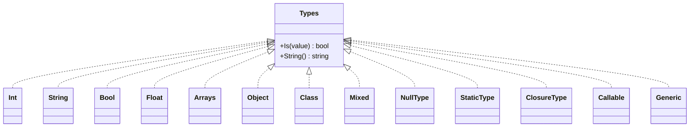
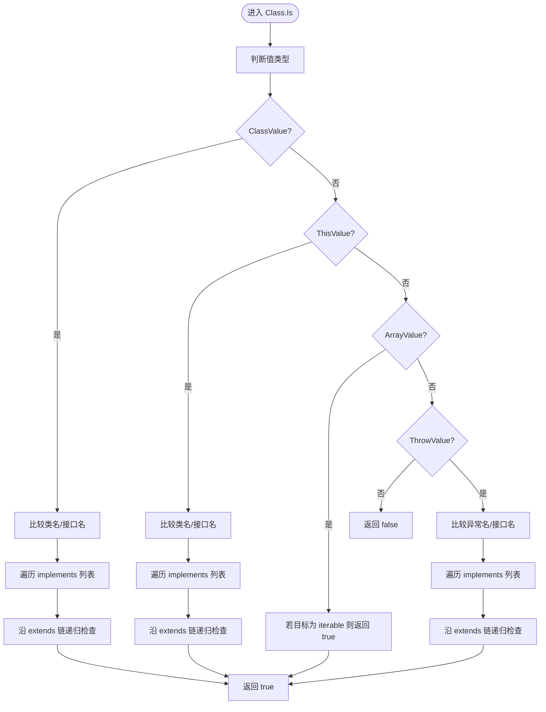
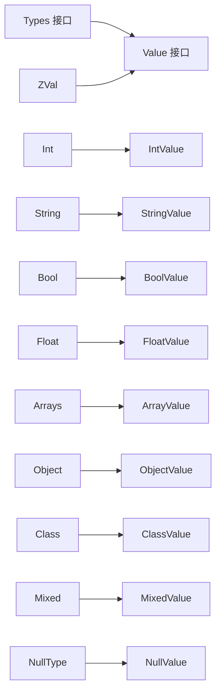

# 数据类型系统

<cite>
**本文引用的文件**
- [types.go](file://data/types.go)
- [type_int.go](file://data/type_int.go)
- [type_string.go](file://data/type_string.go)
- [type_bool.go](file://data/type_bool.go)
- [type_floath.go](file://data/type_floath.go)
- [type_array.go](file://data/type_array.go)
- [type_object.go](file://data/type_object.go)
- [type_class.go](file://data/type_class.go)
- [type_mixed.go](file://data/type_mixed.go)
- [type_callable.go](file://data/type_callable.go)
- [type_generic.go](file://data/type_generic.go)
- [type_const.go](file://data/type_const.go)
- [value.go](file://data/value.go)
- [zval.go](file://data/zval.go)
- [value_int.go](file://data/value_int.go)
- [value_string.go](file://data/value_string.go)
- [value_bool.go](file://data/value_bool.go)
- [value_float.go](file://data/value_float.go)
- [value_null.go](file://data/value_null.go)
- [value_array.go](file://data/value_array.go)
- [value_object.go](file://data/value_object.go)
- [value_class.go](file://data/value_class.go)
- [value_mixed.go](file://data/value_mixed.go)
- [value_zval.go](file://data/value_zval.go)
- [value_reference.go](file://data/value_reference.go)
- [value_this.go](file://data/value_this.go)
- [value_call.go](file://data/value_call.go)
- [value_generator.go](file://data/value_generator.go)
- [value_proxy.go](file://data/value_proxy.go)
- [value_return.go](file://data/value_return.go)
- [value_throw.go](file://data/value_throw.go)
- [value_yield.go](file://data/value_yield.go)
- [value_any.go](file://data/value_any.go)
- [value_array_concat.go](file://data/value_array_concat.go)
- [value_array_every.go](file://data/value_array_every.go)
- [value_array_filter.go](file://data/value_array_filter.go)
- [value_array_find.go](file://data/value_array_find.go)
- [value_array_find_index.go](file://data/value_array_find_index.go)
- [value_array_flat.go](file://data/value_array_flat.go)
- [value_array_flat_map.go](file://data/value_array_flat_map.go)
- [value_array_for_each.go](file://data/value_array_for_each.go)
- [value_array_includes.go](file://data/value_array_includes.go)
- [value_array_index_of.go](file://data/value_array_index_of.go)
- [value_array_join.go](file://data/value_array_join.go)
- [value_array_map.go](file://data/value_array_map.go)
- [value_array_pop.go](file://data/value_array_pop.go)
- [value_array_push.go](file://data/value_array_push.go)
- [value_array_reduce.go](file://data/value_array_reduce.go)
- [value_array_reverse.go](file://data/value_array_reverse.go)
- [value_array_shift.go](file://data/value_array_shift.go)
- [value_array_slice.go](file://data/value_array_slice.go)
- [value_array_some.go](file://data/value_array_some.go)
- [value_array_sort.go](file://data/value_array_sort.go)
- [value_array_splice.go](file://data/value_array_splice.go)
- [value_array_unshift.go](file://data/value_array_unshift.go)
- [value_string_ends_with.go](file://data/value_string_ends_with.go)
- [value_string_index_of.go](file://data/value_string_index_of.go)
- [value_string_length.go](file://data/value_string_length.go)
- [value_string_replace.go](file://data/value_string_replace.go)
- [value_string_split.go](file://data/value_string_split.go)
- [value_string_starts_with.go](file://data/value_string_starts_with.go)
- [value_string_substring.go](file://data/value_string_substring.go)
- [value_string_to_lower_case.go](file://data/value_string_to_lower_case.go)
- [value_string_to_upper_case.go](file://data/value_string_to_upper_case.go)
- [value_string_trim.go](file://data/value_string_trim.go)
- [value_ast.go](file://data/value_ast.go)
- [value_context.go](file://data/value_context.go)
- [value_control.go](file://data/value_control.go)
- [value_error.go](file://data/value_error.go)
- [value_from.go](file://data/value_from.go)
- [value_interface.go](file://data/value_interface.go)
- [value_node.go](file://data/value_node.go)
- [value_ordered_map.go](file://data/value_ordered_map.go)
- [value_serializer.go](file://data/value_serializer.go)
- [value_zval.go](file://data/value_zval.go)
- [value_any.go](file://data/value_any.go)
- [value_reference.go](file://data/value_reference.go)
- [value_this.go](file://data/value_this.go)
- [value_call.go](file://data/value_call.go)
- [value_generator.go](file://data/value_generator.go)
- [value_proxy.go](file://data/value_proxy.go)
- [value_return.go](file://data/value_return.go)
- [value_throw.go](file://data/value_throw.go)
- [value_yield.go](file://data/value_yield.go)
- [value_ast.go](file://data/value_ast.go)
- [value_context.go](file://data/value_context.go)
- [value_control.go](file://data/value_control.go)
- [value_error.go](file://data/value_error.go)
- [value_from.go](file://data/value_from.go)
- [value_interface.go](file://data/value_interface.go)
- [value_node.go](file://data/value_node.go)
- [value_ordered_map.go](file://data/value_ordered_map.go)
- [value_serializer.go](file://data/value_serializer.go)
- [value_zval.go](file://data/value_zval.go)
- [value_any.go](file://data/value_any.go)
- [value_reference.go](file://data/value_reference.go)
- [value_this.go](file://data/value_this.go)
- [value_call.go](file://data/value_call.go)
- [value_generator.go](file://data/value_generator.go)
- [value_proxy.go](file://data/value_proxy.go)
- [value_return.go](file://data/value_return.go)
- [value_throw.go](file://data/value_throw.go)
- [value_yield.go](file://data/value_yield.go)
- [value_ast.go](file://data/value_ast.go)
- [value_context.go](file://data/value_context.go)
- [value_control.go](file://data/value_control.go)
- [value_error.go](file://data/value_error.go)
- [value_from.go](file://data/value_from.go)
- [value_interface.go](file://data/value_interface.go)
- [value_node.go](file://data/value_node.go)
- [value_ordered_map.go](file://data/value_ordered_map.go)
- [value_serializer.go](file://data/value_serializer.go)
- [value_zval.go](file://data/value_zval.go)
- [value_any.go](file://data/value_any.go)
- [value_reference.go](file://data/value_reference.go)
- [value_this.go](file://data/value_this.go)
- [value_call.go](file://data/value_call.go)
- [value_generator.go](file://data/value_generator.go)
- [value_proxy.go](file://data/value_proxy.go)
- [value_return.go](file://data/value_return.go)
- [value_throw.go](file://data/value_throw.go)
- [value_yield.go](file://data/value_yield.go)
- [value_ast.go](file://data/value_ast.go)
- [value_context.go](file://data/value_context.go)
- [value_control.go](file://data/value_control.go)
- [value_error.go](file://data/value_error.go)
- [value_from.go](file://data/value_from.go)
- [value_interface.go](file://data/value_interface.go)
- [value_node.go](file://data/value_node.go)
- [value_ordered_map.go](file://data/value_ordered_map.go)
- [value_serializer.go](file://data/value_serializer.go)
- [value_zval.go](file://data/value_zval.go)
- [value_any.go](file://data/value_any.go)
- [value_reference.go](file://data/value_reference.go)
- [value_this.go](file://data/value_this.go)
- [value_call.go](file://data/value_call.go)
- [value_generator.go](file://data/value_generator.go)
- [value_proxy.go](file://data/value_proxy.go)
- [value_return.go](file://data/value_return.go)
- [value_throw.go](file://data/value_throw.go)
- [value_yield.go](file://data/value_yield.go)
- [value_ast.go](file://data/value_ast.go)
- [value_context.go](file://data/value_context.go)
- [value_control.go](file://data/value_control.go)
- [value_error.go](file://data/value_error.go)
- [value_from.go](file://data/value_from.go)
- [value_interface.go](file://data/value_interface.go)
- [value_node.go](file://data/value_node.go)
- [value_ordered_map.go](file://data/value_ordered_map.go)
- [value_serializer.go](file://data/value_serializer.go)
- [value_zval.go](file://data/value_zval.go)
- [value_any.go](file://data/value_any.go)
- [value_reference.go](file://data/value_reference.go)
- [value_this.go](file://data/value_this.go)
- [value_call.go](file://data/value_call.go)
- [value_generator.go](file://data/value_generator.go)
- [value_proxy.go](file://data/value_proxy.go)
- [value_return.go](file://data/value_return.go)
- [value_throw.go](file://data/value_throw.go)
- [value_yield.go](file://data/value_yield.go)
- [value_ast.go](file://data/value_ast.go)
- [value_context.go](file://data/value_context.go)
- [value_control.go](file://data/value_control.go)
- [value_error.go](file://data/value_error.go)
- [value_from.go](file://data/value_from.go)
- [value_interface.go](file://data/value_interface.go)
- [value_node.go](file://data/value_node.go)
- [value_ordered_map.go](file://data/value_ordered_map.go)
- [value_serializer.go](file://data/value_serializer.go)
- [value_zval.go](file://data/value_zval.go)
- [value_any.go](file://data/value_any.go)
- [value_reference.go](file://data/value_reference.go)
- [value_this.go](file://data/value_this.go)
- [value_call.go](file://data/value_call.go)
- [value_generator.go](file://data/value_generator.go)
- [value_proxy.go](file://data/value_proxy.go)
- [value_return.go](file://data/value_return.go)
- [value_throw.go](file://data/value_throw.go)
- [value_yield.go](file://data/value_yield.go)
- [value_ast.go](file://data/value_ast.go)
- [value_context.go](file://data/value_context.go)
- [value_control.go](file://data/value_control.go)
- [value_error.go](file://data/value_error.go)
- [value_from.go](file://data/value_from.go)
- [value_interface.go](file://data/value_interface.go)
- [value_node.go](file://data/value_node.go)
- [value_ordered_map.go](file://data/value_ordered_map.go)
- [value_serializer.go](file://data/value_serializer.go)
- [value_zval.go](file://data/value_zval.go)
- [value_any.go](file://data/value_any.go)
-......
</cite>

## 目录
1. [简介](#简介)
2. [项目结构](#项目结构)
3. [核心组件](#核心组件)
4. [架构总览](#架构总览)
5. [详细组件分析](#详细组件分析)
6. [依赖分析](#依赖分析)
7. [性能考虑](#性能考虑)
8. [故障排查指南](#故障排查指南)
9. [结论](#结论)
10. [附录](#附录)

## 简介
本文件为 Origami 语言的数据类型系统提供权威参考。内容覆盖基本类型（整数、字符串、布尔、浮点）、复合类型（数组、对象、类）、特殊类型（空、混合、静态、闭包、可调用）以及可空类型语法与用法。文档还解释类型声明、类型检查、类型转换与序列化机制，并给出类型安全最佳实践与常见问题排查建议。

## 项目结构
数据类型系统主要由两类模块构成：
- 类型描述与检查：位于 data/types.go 及其派生类型文件（如 type_int.go、type_string.go 等），定义了 Types 接口及各具体类型的 Is() 检查逻辑。
- 值实现与转换：位于 data/value*.go 文件，定义了 Value 接口及具体值类型（如 IntValue、StringValue 等），提供 AsXxx 转换能力与序列化支持。

下图展示类型层与值层的关系概览：

```mermaid
graph TB
subgraph "类型层Types"
TTypes["Types 接口"]
TInt["Int"]
TString["String"]
TBool["Bool"]
TFloat["Float"]
TArray["Arrays"]
TObject["Object"]
TClass["Class"]
TMixed["Mixed"]
TNull["NullType"]
TStatic["StaticType"]
TClosure["ClosureType"]
TCallable["Callable"]
TGeneric["Generic"]
end
subgraph "值层Value"
VValue["Value 接口"]
VInt["IntValue"]
VString["StringValue"]
VBool["BoolValue"]
VFloat["FloatValue"]
VArray["ArrayValue"]
VObject["ObjectValue"]
VClass["ClassValue"]
VNull["NullValue"]
VAny["AnyValue"]
VMixed["MixedValue"]
VZVal["ZVal"]
end
TTypes --> VValue
TInt --> VInt
TString --> VString
TBool --> VBool
TFloat --> VFloat
TArray --> VArray
TObject --> VObject
TClass --> VClass
TMixed --> VMixed
TNull --> VNull
TGeneric --> VAny
TStatic --> VAny
TClosure --> VAny
TCallable --> VAny
VZVal --> VValue
```

图表来源
- [types.go:5-262](file://data/types.go#L5-L262)
- [type_int.go:3-17](file://data/type_int.go#L3-L17)
- [type_string.go:3-17](file://data/type_string.go#L3-L17)
- [type_bool.go:3-22](file://data/type_bool.go#L3-L22)
- [type_floath.go:3-16](file://data/type_floath.go#L3-L16)
- [type_array.go:3-20](file://data/type_array.go#L3-L20)
- [type_object.go:3-19](file://data/type_object.go#L3-L19)
- [type_class.go:3-146](file://data/type_class.go#L3-L146)
- [type_mixed.go:3-12](file://data/type_mixed.go#L3-L12)
- [type_callable.go](file://data/type_callable.go)
- [type_generic.go](file://data/type_generic.go)
- [type_const.go](file://data/type_const.go)
- [value.go:3-39](file://data/value.go#L3-L39)
- [zval.go:3-18](file://data/zval.go#L3-L18)
- [value_int.go:18-52](file://data/value_int.go#L18-L52)
- [value_string.go:16-86](file://data/value_string.go#L16-L86)
- [value_bool.go:17-47](file://data/value_bool.go#L17-L47)
- [value_float.go:25-63](file://data/value_float.go#L25-L63)
- [value_null.go:11-45](file://data/value_null.go#L11-L45)

章节来源
- [types.go:5-262](file://data/types.go#L5-L262)
- [value.go:3-39](file://data/value.go#L3-L39)
- [zval.go:3-18](file://data/zval.go#L3-L18)

## 核心组件
- 类型接口与工厂
  - Types 接口：定义 Is(value) 类型检查与 String() 类型标识。
  - NewBaseType：根据字符串类型名构造具体类型，支持联合类型（|）、可空类型（?）与类名。
  - NewNullableType、NewUnionType、NewMultipleReturnType：构建可空、联合、多返回值类型。
- 值接口与包装
  - Value 接口：统一的值抽象，提供 GetValue 与 AsString。
  - ZVal：对 Value 的轻量包装，便于运行时传递与序列化。

章节来源
- [types.go:5-110](file://data/types.go#L5-L110)
- [types.go:142-198](file://data/types.go#L142-L198)
- [value.go:3-39](file://data/value.go#L3-L39)
- [zval.go:3-18](file://data/zval.go#L3-L18)

## 架构总览
类型系统采用“类型描述 + 值实现”的分层设计：
- 类型层负责声明与检查（Is），决定某值是否满足指定类型约束。
- 值层负责存储与转换（AsXxx），并在需要时执行弱类型到强类型的转换。

图表来源
- [types.go:5-262](file://data/types.go#L5-L262)
- [type_int.go:3-17](file://data/type_int.go#L3-L17)
- [type_string.go:3-17](file://data/type_string.go#L3-L17)
- [type_bool.go:3-22](file://data/type_bool.go#L3-L22)
- [type_floath.go:3-16](file://data/type_floath.go#L3-L16)
- [type_array.go:3-20](file://data/type_array.go#L3-L20)
- [type_object.go:3-19](file://data/type_object.go#L3-L19)
- [type_class.go:3-146](file://data/type_class.go#L3-L146)
- [type_mixed.go:3-12](file://data/type_mixed.go#L3-L12)
- [type_callable.go](file://data/type_callable.go)
- [type_generic.go](file://data/type_generic.go)

## 详细组件分析

### 基本类型
- 整数（int）
  - 类型检查：仅匹配 IntValue。
  - 转换：支持 AsInt、AsFloat、AsBool。
  - 场景：计数、索引、位运算、枚举值。
- 字符串（string）
  - 类型检查：仅匹配 StringValue。
  - 转换：支持 AsInt、AsFloat、AsBool；提供丰富字符串方法（长度、截取、替换、大小写转换、修剪等）。
  - 场景：文本处理、路径拼接、模板渲染。
- 布尔（bool）
  - 类型检查：匹配 BoolValue 或实现 AsBool 的值。
  - 转换：支持 AsBool、AsInt、AsFloat。
  - 场景：条件判断、开关控制。
- 浮点（float）
  - 类型检查：匹配实现 AsFloat 的值。
  - 转换：支持 AsInt、AsFloat、AsFloat32、AsBool。
  - 场景：科学计算、比例、坐标。

章节来源
- [type_int.go:3-17](file://data/type_int.go#L3-L17)
- [value_int.go:18-52](file://data/value_int.go#L18-L52)
- [type_string.go:3-17](file://data/type_string.go#L3-L17)
- [value_string.go:16-86](file://data/value_string.go#L16-L86)
- [type_bool.go:3-22](file://data/type_bool.go#L3-L22)
- [value_bool.go:17-47](file://data/value_bool.go#L17-L47)
- [type_floath.go:3-16](file://data/type_floath.go#L3-L16)
- [value_float.go:25-63](file://data/value_float.go#L25-L63)

### 复合类型
- 数组（array）
  - 类型检查：匹配 ArrayValue 或关联数组形式的 ObjectValue。
  - 场景：列表、映射、批处理。
- 对象（object）
  - 类型检查：匹配 ObjectValue 或 ClassValue。
  - 场景：面向对象封装、属性访问。
- 类（class）
  - 类型检查：Class.Is 支持类继承与接口实现判断，包含接口继承链扩展检查与类继承链遍历。
  - 场景：参数约束、返回值约束、多态。

图表来源
- [type_class.go:7-61](file://data/type_class.go#L7-L61)
- [type_class.go:67-84](file://data/type_class.go#L67-L84)
- [type_class.go:86-145](file://data/type_class.go#L86-L145)

章节来源
- [type_array.go:3-20](file://data/type_array.go#L3-L20)
- [type_object.go:3-19](file://data/type_object.go#L3-L19)
- [type_class.go:3-146](file://data/type_class.go#L3-L146)

### 特殊类型
- 空（null）
  - 类型检查：仅匹配 NullValue。
  - 转换：可转为 int/float/bool，字符串化为空串。
  - 场景：占位、未初始化、可选值缺省。
- 混合（mixed）
  - 类型检查：始终返回 true。
  - 场景：动态类型、兼容性接口。
- 静态（static）
  - 类型检查：总是通过，实际约束在方法调用时由调用方确定。
  - 场景：链式调用、方法返回当前类实例。
- 闭包（closure）
  - 类型检查：匹配函数值、数组值或字符串值。
  - 场景：回调、高阶函数。
- 可调用（callable）
  - 类型检查：与闭包类似，用于约束可被调用的实体。
  - 场景：事件处理器、策略模式。

章节来源
- [type_mixed.go:3-12](file://data/type_mixed.go#L3-L12)
- [types.go:221-248](file://data/types.go#L221-L248)
- [types.go:250-262](file://data/types.go#L250-L262)
- [type_callable.go](file://data/type_callable.go)

### 可空类型与联合类型
- 可空类型（?T）
  - 语法：NewNullableType(NewBaseType("T"))。
  - 语义：接受 NullValue 或 BaseType 的值。
  - 场景：可选参数、可选返回值。
- 联合类型（T1|T2|...）
  - 语法：NewUnionType([...])。
  - 语义：任一成员满足即通过。
  - 场景：多态返回、灵活参数。

章节来源
- [types.go:34-49](file://data/types.go#L34-L49)
- [types.go:83-106](file://data/types.go#L83-L106)
- [types.go:182-187](file://data/types.go#L182-L187)

### 类型声明与解析
- NewBaseType：解析字符串类型名，支持：
  - 基本类型：int、string、bool、float、array、object、null、mixed、void、callable。
  - 特殊类型：static、self、closure、\Closure。
  - 联合类型：以 | 分隔的组合。
  - 可空类型：以 ? 开头的包装。
  - 类名：默认按类类型处理。
- ISBaseType：判断是否为基础类型名。

章节来源
- [types.go:112-140](file://data/types.go#L112-L140)
- [types.go:142-198](file://data/types.go#L142-L198)

### 类型转换与序列化
- AsXxx 转换族：IntValue、StringValue、BoolValue、FloatValue 提供 AsInt、AsFloat、AsBool、AsString 等转换。
- 序列化：所有 Value 实现均支持 Marshal/Unmarshal，ZVal 作为统一载体参与序列化流程。
- 弱类型语义：Bool 类型检查允许实现 AsBool 的值通过，体现弱类型兼容。

章节来源
- [value_int.go:30-52](file://data/value_int.go#L30-L52)
- [value_string.go:28-86](file://data/value_string.go#L28-L86)
- [value_bool.go:32-47](file://data/value_bool.go#L32-L47)
- [value_float.go:37-63](file://data/value_float.go#L37-L63)
- [value_null.go:23-45](file://data/value_null.go#L23-L45)
- [zval.go:3-18](file://data/zval.go#L3-L18)

### 多返回值与 LSP 类型
- 多返回值类型（MultipleReturnType）：用于函数返回值元组的类型检查。
- LspTypes：多候选类型集合，供语言服务使用。

章节来源
- [types.go:51-81](file://data/types.go#L51-L81)
- [types.go:11-28](file://data/types.go#L11-L28)

## 依赖分析
类型系统内部耦合度低，类型层与值层通过接口解耦：
- Types 仅依赖 Value 抽象，不关心具体实现。
- 各 Value 实现独立，仅实现 Value 接口与必要的 AsXxx 能力。
- ZVal 作为桥接容器，贯穿序列化与运行时传递。

图表来源
- [types.go:5-262](file://data/types.go#L5-L262)
- [value.go:3-39](file://data/value.go#L3-L39)
- [zval.go:3-18](file://data/zval.go#L3-L18)

章节来源
- [types.go:5-262](file://data/types.go#L5-L262)
- [value.go:3-39](file://data/value.go#L3-L39)
- [zval.go:3-18](file://data/zval.go#L3-L18)

## 性能考虑
- 类型检查复杂度
  - 基本类型：O(1)，直接类型匹配。
  - Class 类型：受继承链与接口链长度影响，最坏情况下与类/接口数量线性相关。
  - 联合类型：最坏情况需尝试所有成员，复杂度为 O(n)。
- 转换成本
  - 基本转换（整数/浮点/布尔）为常数时间。
  - 字符串到数值转换涉及解析，通常为 O(k)，k 为字符串长度。
- 内存与序列化
  - ZVal 作为轻量包装，避免频繁装箱拆箱。
  - 建议在热路径中复用 Value 实例，减少分配。

## 故障排查指南
- 类型不匹配
  - 症状：运行时报类型错误或断言失败。
  - 排查：确认 NewBaseType 解析是否正确；联合/可空类型组合是否符合预期。
- 继承与接口判断失败
  - 症状：Class.Is 返回 false。
  - 排查：检查类/接口是否已加载；接口 extends 链是否完整；类继承链是否正确。
- 弱类型转换异常
  - 症状：字符串转数字失败或布尔值不符合预期。
  - 排查：确认值是否实现相应 AsXxx 接口；检查字符串格式与范围。
- 序列化问题
  - 症状：Marshal/Unmarshal 失败。
  - 排查：确保 Value 实现了对应序列化方法；检查序列化器配置。

章节来源
- [type_class.go:67-145](file://data/type_class.go#L67-L145)
- [value_string.go:28-34](file://data/value_string.go#L28-L34)
- [value_bool.go:32-34](file://data/value_bool.go#L32-L34)

## 结论
Origami 的数据类型系统以清晰的接口分层与灵活的类型组合（联合、可空、多返回值）为核心，既保证了静态约束的表达能力，又保留了弱类型语义下的兼容性。通过 ZVal 与 AsXxx 转换族，系统在性能与易用性之间取得平衡。建议在业务关键路径上优先使用明确的基本类型与类类型，配合联合/可空类型提升表达力，并遵循类型安全最佳实践以降低运行期风险。

## 附录
- 类型安全最佳实践
  - 明确区分 null 与空值语义，必要时使用可空类型。
  - 优先使用强类型（int/float/bool）而非字符串承载数值。
  - 在函数签名中使用明确的类类型或接口类型，避免 mixed。
  - 对外部输入进行显式转换与校验，避免隐式弱类型转换导致的歧义。
  - 使用联合类型表达多态返回，但保持组合简洁，避免过度复杂。
- 常见用法速查
  - 基本类型声明：int、string、bool、float。
  - 复合类型声明：array、object。
  - 特殊类型声明：null、mixed、void、static、self、closure、\Closure。
  - 组合语法：联合（T1|T2）、可空（?T）、多返回值（[T1,T2,...]）。