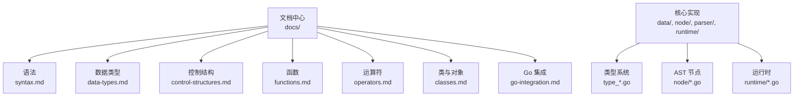
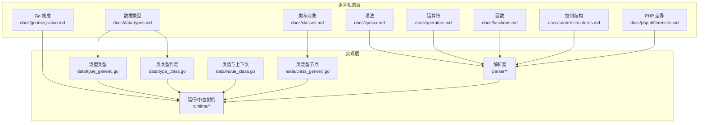
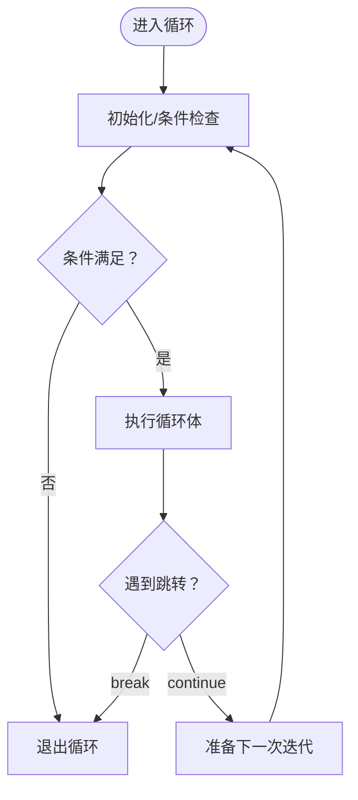
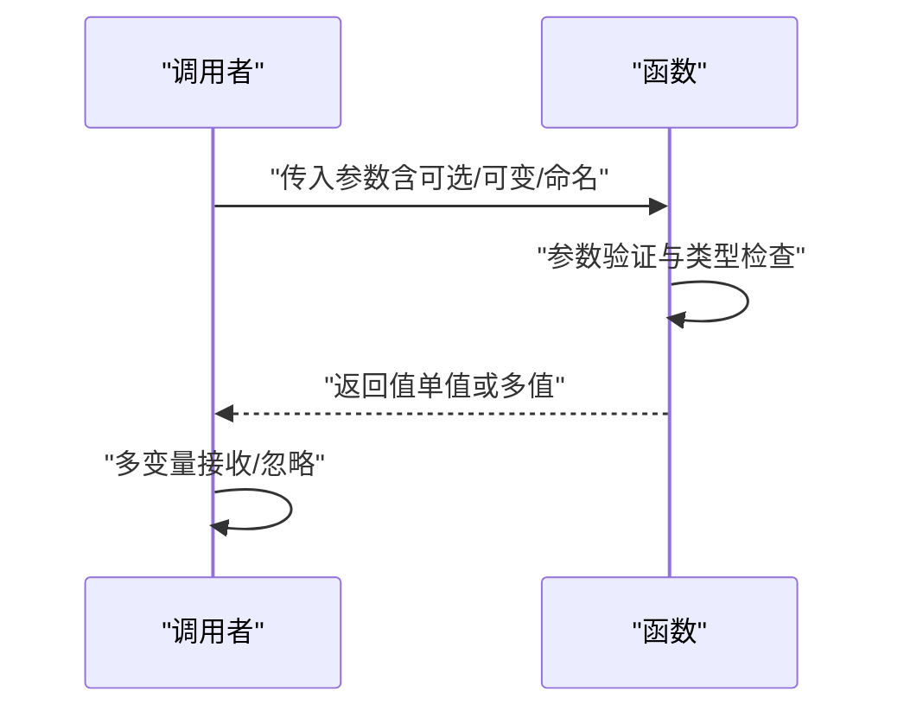
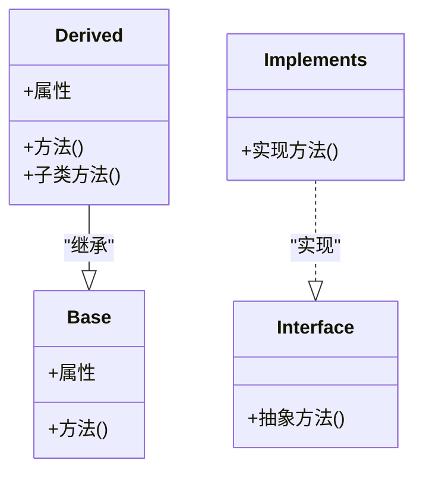
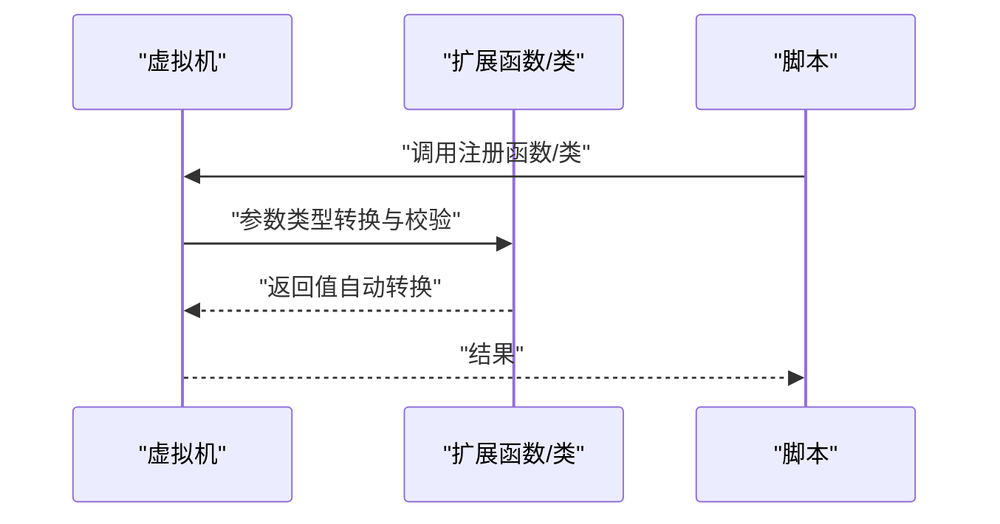
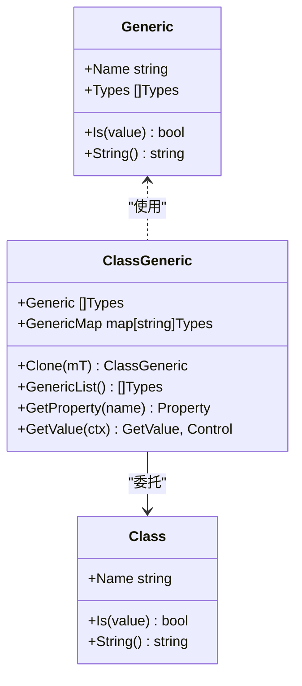
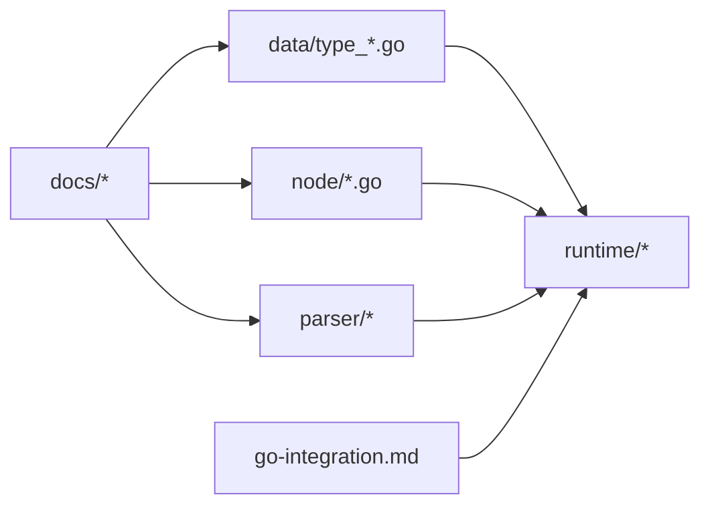

# 语言参考手册

<cite>
**本文档引用的文件**
- [README.md](file://README.md)
- [syntax.md](file://docs/syntax.md)
- [data-types.md](file://docs/data-types.md)
- [control-structures.md](file://docs/control-structures.md)
- [functions.md](file://docs/functions.md)
- [operators.md](file://docs/operators.md)
- [classes.md](file://docs/classes.md)
- [php-differences.md](file://docs/php-differences.md)
- [go-integration.md](file://docs/go-integration.md)
- [type_generic.go](file://data/type_generic.go)
- [type_class.go](file://data/type_class.go)
- [value_class.go](file://data/value_class.go)
- [class_generic.go](file://node/class_generic.go)
</cite>

## 目录
1. [简介](#简介)
2. [项目结构](#项目结构)
3. [核心组件](#核心组件)
4. [架构总览](#架构总览)
5. [详细组件分析](#详细组件分析)
6. [依赖分析](#依赖分析)
7. [性能考虑](#性能考虑)
8. [故障排查指南](#故障排查指南)
9. [结论](#结论)
10. [附录](#附录)

## 简介
本手册面向不同经验水平的开发者，系统梳理 Origami 语言的语法、数据类型、控制结构、函数与面向对象特性，以及与 PHP 的差异、Go 并发与泛型支持、类型系统与操作符优先级等技术细节。文档同时提供丰富的示例路径，帮助读者快速掌握语言特性并正确应用。

## 项目结构
- 文档中心位于 docs/，涵盖语法、数据类型、控制结构、函数、类与对象、运算符、Go 集成、数据库模块、标准库等主题。
- 语言核心实现位于 data/、node/、parser/、runtime/ 等目录，支撑类型系统、AST 节点、运行时与虚拟机。
- 示例与测试位于 examples/ 与 tests/，便于对照学习与验证。

**图表来源**
- [README.md:1-69](file://README.md#L1-L69)
- [syntax.md:1-602](file://docs/syntax.md#L1-L602)
- [data-types.md:1-385](file://docs/data-types.md#L1-L385)
- [control-structures.md:1-560](file://docs/control-structures.md#L1-L560)
- [functions.md:1-694](file://docs/functions.md#L1-L694)
- [operators.md:1-465](file://docs/operators.md#L1-L465)
- [classes.md:1-453](file://docs/classes.md#L1-L453)
- [go-integration.md:1-643](file://docs/go-integration.md#L1-L643)

**章节来源**
- [README.md:1-69](file://README.md#L1-L69)

## 核心组件
- 语法与基础：变量、数据类型、运算符、控制结构、函数、类与对象、字符串与数组、命名空间、注释、特殊语法（HTML 内嵌、模板字符串）。
- 类型系统：基本类型（int、float、string、bool、null）、复合类型（array、object）、类型转换、类型检查、类型声明。
- 控制结构：if/else、for/while/do-while/foreach、switch/match、break/continue/return、异常处理 try-catch-finally。
- 函数体系：参数类型、默认参数、可变参数、多返回值、匿名函数/箭头函数、作用域与静态变量、递归与高阶函数、错误处理。
- 面向对象：访问修饰符、构造/析构、继承、接口与抽象类、静态成员、魔术方法。
- 运算符与优先级：算术、比较、逻辑、赋值、位运算、空值合并、三元、instanceof、优先级表与最佳实践。
- 与 PHP 差异：符号使用、字符串连接、数组与对象字面量、注解与宏、语法简化、类型声明、多返回值、协程关键字等。
- Go 集成：函数与类注册、自动类型转换、命名参数、反射与注册机制、HTTP/数据库/文件系统集成示例。
- 泛型支持：类泛型、类型映射替换、泛型类型识别与实例化。

**章节来源**
- [syntax.md:1-602](file://docs/syntax.md#L1-L602)
- [data-types.md:1-385](file://docs/data-types.md#L1-L385)
- [control-structures.md:1-560](file://docs/control-structures.md#L1-L560)
- [functions.md:1-694](file://docs/functions.md#L1-L694)
- [operators.md:1-465](file://docs/operators.md#L1-L465)
- [classes.md:1-453](file://docs/classes.md#L1-L453)
- [php-differences.md:1-17](file://docs/php-differences.md#L1-L17)
- [go-integration.md:1-643](file://docs/go-integration.md#L1-L643)
- [type_generic.go:1-18](file://data/type_generic.go#L1-L18)
- [class_generic.go:1-67](file://node/class_generic.go#L1-L67)

## 架构总览
Origami 语言采用“文档驱动 + 类型系统 + AST 节点 + 运行时”的分层架构。文档中心提供语法与特性规范，类型系统与 AST 节点负责解析与类型判定，运行时负责执行与虚拟机调度。Go 集成为语言提供高性能扩展能力。

**图表来源**
- [syntax.md:1-602](file://docs/syntax.md#L1-L602)
- [data-types.md:1-385](file://docs/data-types.md#L1-L385)
- [operators.md:1-465](file://docs/operators.md#L1-L465)
- [classes.md:1-453](file://docs/classes.md#L1-L453)
- [functions.md:1-694](file://docs/functions.md#L1-L694)
- [control-structures.md:1-560](file://docs/control-structures.md#L1-L560)
- [php-differences.md:1-17](file://docs/php-differences.md#L1-L17)
- [go-integration.md:1-643](file://docs/go-integration.md#L1-L643)
- [type_generic.go:1-18](file://data/type_generic.go#L1-L18)
- [type_class.go:1-146](file://data/type_class.go#L1-L146)
- [value_class.go:1-295](file://data/value_class.go#L1-L295)
- [class_generic.go:1-67](file://node/class_generic.go#L1-L67)

## 详细组件分析

### 语法与基础
- 文件结构与扩展名：.zy（脚本）、.php（兼容）。
- 变量与类型声明：支持 string/int/bool/float/array/object/null/void，可空类型 ?T，类型声明与默认值。
- 运算符：算术、比较（含松散/严格）、逻辑、赋值、位运算、空值合并、三元、instanceof。
- 控制结构：if/else、for/while/do-while/foreach、switch/match、break/continue/return、try-catch-finally。
- 函数：参数类型、默认参数、可变参数、多返回值、匿名/箭头函数、作用域与静态变量、递归与高阶函数。
- 类与对象：访问修饰符、构造/析构、继承、接口/抽象类、静态成员、魔术方法。
- 字符串与数组：字面量、插值、方法链式调用。
- 命名空间与注释：use 与命名空间、单行/多行注释。
- 特殊语法：HTML 内嵌、模板字符串。

**章节来源**
- [syntax.md:1-602](file://docs/syntax.md#L1-L602)

### 数据类型系统
- 基本类型：int、float、string、bool、null；支持科学计数法、字符串连接、布尔转换规则。
- 复合类型：array（索引/关联/混合）、object（类实例）。
- 类型转换：自动与显式转换（类型断言与函数），类型检查函数与类型断言。
- 类型声明：变量与函数参数/返回值类型声明，提升可读性与安全性。
- 最佳实践：明确类型声明、类型检查、类型转换、避免类型混淆。

**章节来源**
- [data-types.md:1-385](file://docs/data-types.md#L1-L385)

### 控制结构
- 条件与循环：if/elseif/else、for/while/do-while/foreach、switch/match。
- 跳转与异常：break/continue/return、try-catch-finally。
- 高级控制：嵌套循环、循环标签、条件循环。
- 最佳实践：避免过度嵌套、使用 foreach、具体异常处理、及时退出循环。
- 常见错误：无限循环、条件判断错误、数组越界。

**图表来源**
- [control-structures.md:1-560](file://docs/control-structures.md#L1-L560)

**章节来源**
- [control-structures.md:1-560](file://docs/control-structures.md#L1-L560)

### 函数体系
- 定义与调用：参数类型、默认参数、可变参数、多返回值、命名参数调用。
- 类型与返回：基本类型返回、void、多返回值的接收与忽略。
- 函数类型：匿名函数与箭头函数、回调与高阶函数。
- 作用域与静态变量：局部/静态变量、作用域隔离。
- 递归与尾递归：阶乘与斐波那契示例。
- 错误处理：异常抛出与捕获、参数验证。

**图表来源**
- [functions.md:1-694](file://docs/functions.md#L1-L694)

**章节来源**
- [functions.md:1-694](file://docs/functions.md#L1-L694)

### 面向对象特性
- 类与继承：访问修饰符、构造/析构、继承链、父类调用。
- 接口与抽象类：接口实现、多重实现、抽象方法与具体方法。
- 静态成员：静态属性与方法、静态工厂与单例。
- 魔术方法：__get/__set/__call/__toString 等。
- 类型判定：instanceof 与 duck typing（like）。

**图表来源**
- [classes.md:1-453](file://docs/classes.md#L1-L453)

**章节来源**
- [classes.md:1-453](file://docs/classes.md#L1-L453)

### 运算符与优先级
- 运算符分类：算术、比较、逻辑、赋值、位运算、空值合并、三元、instanceof。
- 优先级表：从高到低的优先级顺序与示例。
- 最佳实践：使用括号明确意图、避免复杂表达式、注意类型转换。
- 常见错误：浮点数精度、字符串/数字比较、空值处理。

**章节来源**
- [operators.md:1-465](file://docs/operators.md#L1-L465)

### 与 PHP 的语法差异
- 符号 . 与 -> 均可访问对象成员。
- + 用于字符串连接（区别于 PHP 的数字相加）。
- 数组与对象字面量区分：[] 与 {}。
- @ 用于注解与宏，非错误抑制。
- 允许无标签的 PHP 代码、无 $ 前缀的变量声明、省略 if/for 的括号。
- 类型声明与多返回值、协程关键字 spawn。

**章节来源**
- [php-differences.md:1-17](file://docs/php-differences.md#L1-L17)

### Go 集成与并发
- 函数与类注册：实现接口、自动类型转换、命名参数。
- 注册到虚拟机：在 main 中加载标准库与自定义扩展。
- 高级示例：HTTP 客户端、数据库、文件系统集成。
- 最佳实践：错误处理、类型安全、性能优化、调试与参数验证。
- 并发特性：spawn 关键字用于协程（详见差异说明与示例）。

**图表来源**
- [go-integration.md:1-643](file://docs/go-integration.md#L1-L643)

**章节来源**
- [go-integration.md:1-643](file://docs/go-integration.md#L1-L643)

### 泛型支持
- 泛型类型：Generic 结构保存名称与类型列表。
- 类泛型：ClassGeneric 保存泛型参数映射，属性类型替换。
- 类型判定：Class 类型的 Is 方法支持类继承与接口实现判断。
- 类值与上下文：ClassValue 提供属性与方法的获取、继承属性合并、上下文创建等。

**图表来源**
- [type_generic.go:1-18](file://data/type_generic.go#L1-L18)
- [class_generic.go:1-67](file://node/class_generic.go#L1-L67)
- [type_class.go:1-146](file://data/type_class.go#L1-L146)
- [value_class.go:1-295](file://data/value_class.go#L1-L295)

**章节来源**
- [type_generic.go:1-18](file://data/type_generic.go#L1-L18)
- [class_generic.go:1-67](file://node/class_generic.go#L1-L67)
- [type_class.go:1-146](file://data/type_class.go#L1-L146)
- [value_class.go:1-295](file://data/value_class.go#L1-L295)

## 依赖分析
- 文档与实现耦合：语法与类型规范由 docs/* 定义，data/ 与 node/ 实现类型与节点，parser/ 解析，runtime/ 执行。
- 泛型依赖：Generic 与 ClassGeneric 依赖类型系统，Class 类型判定依赖 VM 中的类与接口注册。
- Go 集成：扩展通过接口实现与 VM 注册，实现自动类型转换与命名参数。

**图表来源**
- [syntax.md:1-602](file://docs/syntax.md#L1-L602)
- [data-types.md:1-385](file://docs/data-types.md#L1-L385)
- [operators.md:1-465](file://docs/operators.md#L1-L465)
- [classes.md:1-453](file://docs/classes.md#L1-L453)
- [functions.md:1-694](file://docs/functions.md#L1-L694)
- [control-structures.md:1-560](file://docs/control-structures.md#L1-L560)
- [php-differences.md:1-17](file://docs/php-differences.md#L1-L17)
- [go-integration.md:1-643](file://docs/go-integration.md#L1-L643)
- [type_generic.go:1-18](file://data/type_generic.go#L1-L18)
- [class_generic.go:1-67](file://node/class_generic.go#L1-L67)
- [type_class.go:1-146](file://data/type_class.go#L1-L146)
- [value_class.go:1-295](file://data/value_class.go#L1-L295)

**章节来源**
- [type_generic.go:1-18](file://data/type_generic.go#L1-L18)
- [class_generic.go:1-67](file://node/class_generic.go#L1-L67)
- [type_class.go:1-146](file://data/type_class.go#L1-L146)
- [value_class.go:1-295](file://data/value_class.go#L1-L295)

## 性能考虑
- 避免在循环中重复计算，优先缓存数组长度等结果。
- 使用 foreach 遍历数组，减少索引访问开销。
- 合理使用数据结构（如关联数组），避免深层嵌套。
- 在 Go 扩展中进行类型安全检查与错误处理，减少运行时异常。
- 利用协程（spawn）进行并发任务拆分，注意资源管理与同步。

## 故障排查指南
- 无限循环：确保循环变量更新与边界条件变化。
- 条件判断错误：使用严格比较（===）与空值检查（=== null）。
- 数组越界：使用正确的边界（< 而非 <=）。
- 类型转换：显式转换或类型断言，避免隐式转换导致的意外。
- 异常处理：捕获具体异常并提供恢复策略，避免空 catch 块。
- Go 扩展：参数验证、类型断言、资源清理与日志记录。

**章节来源**
- [control-structures.md:491-542](file://docs/control-structures.md#L491-L542)
- [operators.md:404-446](file://docs/operators.md#L404-L446)
- [go-integration.md:534-624](file://docs/go-integration.md#L534-L624)

## 结论
Origami 语言融合 PHP 的易用性与 Go 的高性能并发模型，提供清晰的语法规范、完善的类型系统、丰富的函数与面向对象特性，以及强大的 Go 集成能力。通过本文档，开发者可系统掌握语言特性并高效应用到实际项目中。

## 附录
- 快速上手：克隆仓库、编译与运行脚本。
- 文档导航：语法、数据类型、控制结构、函数、类与对象、运算符、Go 集成、数据库模块、标准库。
- 示例与测试：examples/ 与 tests/ 目录提供完整示例与用例验证。

**章节来源**
- [README.md:34-69](file://README.md#L34-L69)