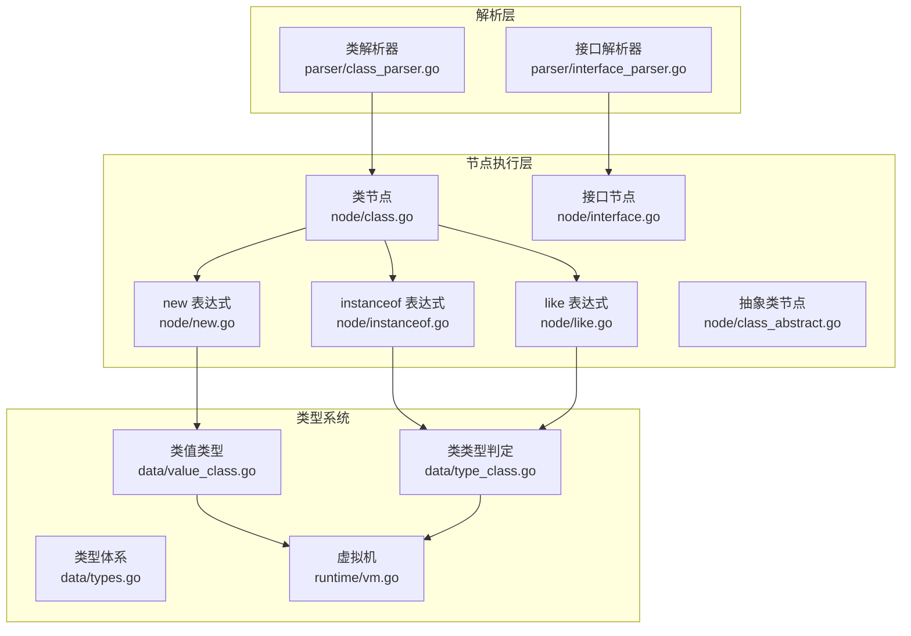
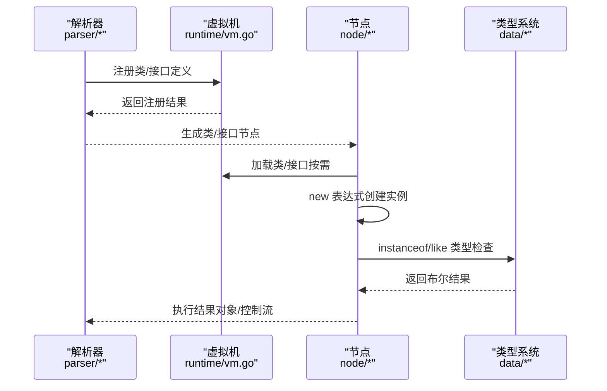
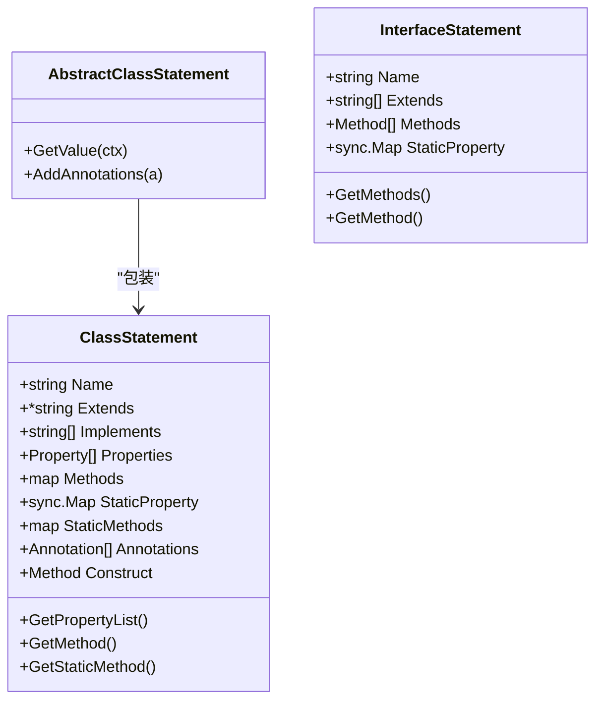
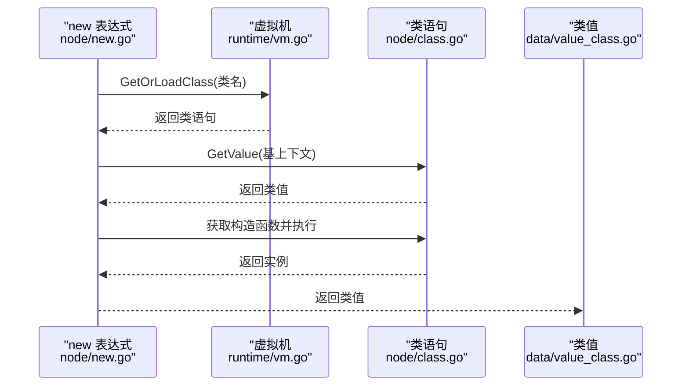
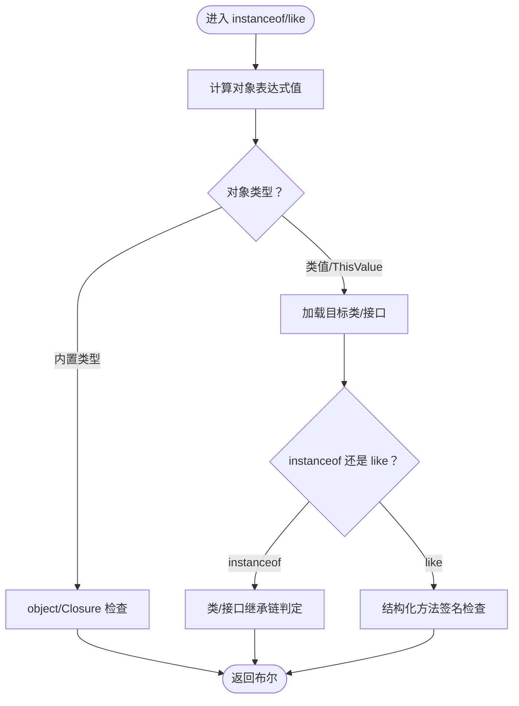
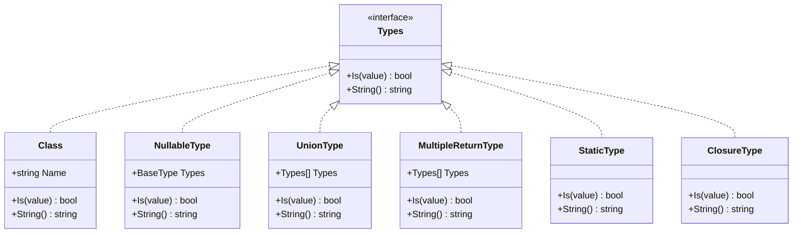
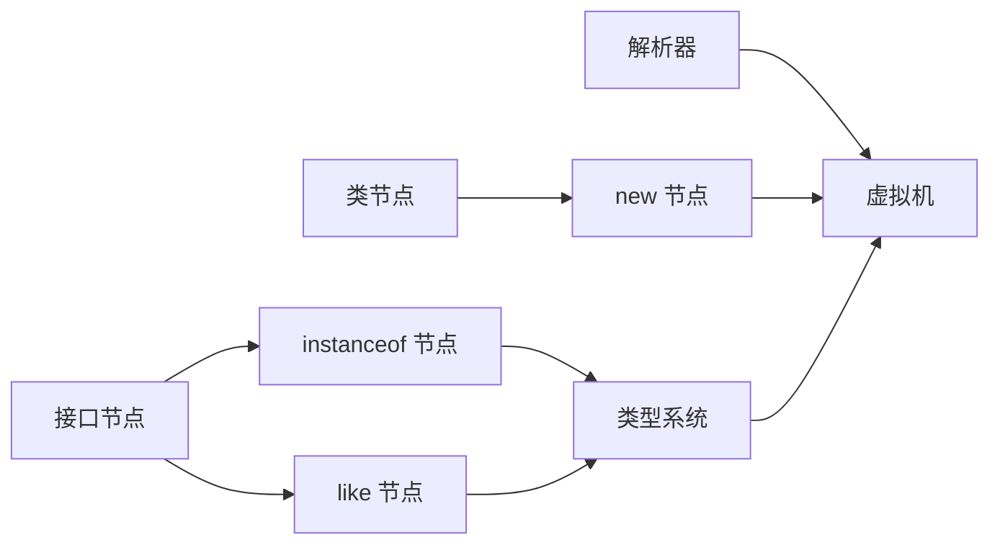

# 面向对象编程

<cite>
**本文档引用的文件**
- [node/class.go](file://node/class.go)
- [node/class_abstract.go](file://node/class_abstract.go)
- [node/interface.go](file://node/interface.go)
- [node/instanceof.go](file://node/instanceof.go)
- [node/like.go](file://node/like.go)
- [node/new.go](file://node/new.go)
- [parser/class_parser.go](file://parser/class_parser.go)
- [parser/interface_parser.go](file://parser/interface_parser.go)
- [data/value_class.go](file://data/value_class.go)
- [data/type_class.go](file://data/type_class.go)
- [data/types.go](file://data/types.go)
- [runtime/vm.go](file://runtime/vm.go)
- [docs/classes.md](file://docs/classes.md)
- [tests/php/interface_inheritance_test.php](file://tests/php/interface_inheritance_test.php)
</cite>

## 目录
1. [简介](#简介)
2. [项目结构](#项目结构)
3. [核心组件](#核心组件)
4. [架构总览](#架构总览)
5. [详细组件分析](#详细组件分析)
6. [依赖分析](#依赖分析)
7. [性能考虑](#性能考虑)
8. [故障排查指南](#故障排查指南)
9. [结论](#结论)
10. [附录](#附录)

## 简介
本文件为 Origami 语言的面向对象编程（OOP）参考文档，系统性阐述类定义、对象创建、继承机制、接口实现、类型检查（instanceof 与 like 关键字）、访问控制修饰符、构造函数与静态成员等核心特性，并提供类设计与实现示例路径，帮助开发者在 Origami 中构建健壮的面向对象程序。

## 项目结构
面向对象相关能力由“解析层”“运行时类型系统”“节点执行层”三部分协同实现：
- 解析层：负责从源码解析类与接口定义、参数与成员声明、访问修饰符与静态成员等。
- 类型系统：提供类型识别、可空/联合/多返回值类型、类与接口的运行时判定。
- 节点执行层：负责 new 表达式、instanceof/like 表达式、方法调用与属性访问等运行时行为。

图表来源
- [parser/class_parser.go:29-343](file://parser/class_parser.go#L29-L343)
- [parser/interface_parser.go:27-246](file://parser/interface_parser.go#L27-L246)
- [node/class.go:11-182](file://node/class.go#L11-L182)
- [node/class_abstract.go:8-29](file://node/class_abstract.go#L8-L29)
- [node/interface.go:9-57](file://node/interface.go#L9-L57)
- [node/new.go:9-75](file://node/new.go#L9-L75)
- [node/instanceof.go:7-99](file://node/instanceof.go#L7-L99)
- [node/like.go:7-99](file://node/like.go#L7-L99)
- [data/value_class.go:8-295](file://data/value_class.go#L8-L295)
- [data/type_class.go:3-146](file://data/type_class.go#L3-L146)
- [data/types.go:5-262](file://data/types.go#L5-L262)
- [runtime/vm.go:14-391](file://runtime/vm.go#L14-L391)

章节来源
- [parser/class_parser.go:29-343](file://parser/class_parser.go#L29-L343)
- [parser/interface_parser.go:27-246](file://parser/interface_parser.go#L27-L246)
- [node/class.go:11-182](file://node/class.go#L11-L182)
- [node/class_abstract.go:8-29](file://node/class_abstract.go#L8-L29)
- [node/interface.go:9-57](file://node/interface.go#L9-L57)
- [node/new.go:9-75](file://node/new.go#L9-L75)
- [node/instanceof.go:7-99](file://node/instanceof.go#L7-L99)
- [node/like.go:7-99](file://node/like.go#L7-L99)
- [data/value_class.go:8-295](file://data/value_class.go#L8-L295)
- [data/type_class.go:3-146](file://data/type_class.go#L3-L146)
- [data/types.go:5-262](file://data/types.go#L5-L262)
- [runtime/vm.go:14-391](file://runtime/vm.go#L14-L391)

## 核心组件
- 类定义与成员
  - 类节点承载类名、继承、实现接口、属性、方法、静态属性/方法、注解等信息。
  - 抽象类节点在类节点基础上提供抽象语义。
  - 接口节点承载接口名、继承链、方法列表、静态属性等。
- 对象创建与调用
  - new 表达式负责加载类、创建实例、调用构造函数、处理参数与属性提升。
- 类型检查
  - instanceof 表达式支持类与接口的运行时判定，以及特殊内置类型识别。
  - like 表达式进行结构化检查（方法签名数量匹配）。
- 类型系统
  - 类类型、可空类型、联合类型、多返回值类型、静态类型等。
  - 运行时基于 VM 注册的类/接口集合进行继承链与接口继承链判定。

章节来源
- [node/class.go:11-182](file://node/class.go#L11-L182)
- [node/class_abstract.go:8-29](file://node/class_abstract.go#L8-L29)
- [node/interface.go:9-57](file://node/interface.go#L9-L57)
- [node/new.go:9-75](file://node/new.go#L9-L75)
- [node/instanceof.go:7-99](file://node/instanceof.go#L7-L99)
- [node/like.go:7-99](file://node/like.go#L7-L99)
- [data/type_class.go:3-146](file://data/type_class.go#L3-L146)
- [data/types.go:5-262](file://data/types.go#L5-L262)
- [runtime/vm.go:118-243](file://runtime/vm.go#L118-L243)

## 架构总览
下面以“类定义—对象创建—类型检查”的主流程展示架构交互：

图表来源
- [parser/class_parser.go:332-343](file://parser/class_parser.go#L332-L343)
- [parser/interface_parser.go:214-246](file://parser/interface_parser.go#L214-L246)
- [runtime/vm.go:118-243](file://runtime/vm.go#L118-L243)
- [node/new.go:9-75](file://node/new.go#L9-L75)
- [node/instanceof.go:24-99](file://node/instanceof.go#L24-L99)
- [node/like.go:24-99](file://node/like.go#L24-L99)
- [data/type_class.go:7-61](file://data/type_class.go#L7-L61)

## 详细组件分析

### 类定义与继承
- 类解析
  - 支持类名、extends、implements、属性、方法、静态成员、注解、trait 使用、构造函数参数属性提升等。
  - 自动合并 trait 成员，处理构造函数缺失时沿继承链寻找父类构造函数。
- 类节点
  - 提供属性/方法索引、静态成员管理、注解挂载、构造函数获取等。
- 抽象类
  - 抽象类节点包装类节点，语义上仍为类，但解析阶段体现抽象语义。
- 接口解析
  - 支持接口名、extends 多接口、方法签名（含返回类型）、静态属性等。
- 接口节点
  - 提供方法查询、静态属性访问等。

图表来源
- [node/class.go:11-182](file://node/class.go#L11-L182)
- [node/class_abstract.go:8-29](file://node/class_abstract.go#L8-L29)
- [node/interface.go:9-57](file://node/interface.go#L9-L57)

章节来源
- [parser/class_parser.go:29-343](file://parser/class_parser.go#L29-L343)
- [parser/interface_parser.go:27-246](file://parser/interface_parser.go#L27-L246)
- [node/class.go:11-182](file://node/class.go#L11-L182)
- [node/class_abstract.go:8-29](file://node/class_abstract.go#L8-L29)
- [node/interface.go:9-57](file://node/interface.go#L9-L57)

### 对象创建与调用
- new 表达式
  - 加载类语句、创建实例、调用构造函数、处理命名参数、引用参数、可变参数、属性提升、默认值等。
  - 支持 new self/static（当前实现为当前类名，未来可增强为真正的 late static binding）。
- 实例值
  - 类值封装实例上下文、类语句、属性存储，提供属性/方法查询、上下文派生、序列化等。

图表来源
- [node/new.go:9-75](file://node/new.go#L9-L75)
- [runtime/vm.go:162-181](file://runtime/vm.go#L162-L181)
- [node/class.go:28-84](file://node/class.go#L28-L84)
- [data/value_class.go:8-33](file://data/value_class.go#L8-L33)

章节来源
- [node/new.go:9-75](file://node/new.go#L9-L75)
- [runtime/vm.go:162-181](file://runtime/vm.go#L162-L181)
- [node/class.go:28-84](file://node/class.go#L28-L84)
- [data/value_class.go:8-33](file://data/value_class.go#L8-L33)

### 类型检查：instanceof 与 like
- instanceof
  - 支持类与接口运行时判定，以及 object、Closure/closure 特殊内置类型识别。
  - 通过类/接口继承链与接口继承链进行判定。
- like
  - 结构化检查：要求源类具备目标类或接口的所有方法，且各方法参数数量一致。

图表来源
- [node/instanceof.go:24-99](file://node/instanceof.go#L24-L99)
- [node/like.go:24-99](file://node/like.go#L24-L99)
- [data/type_class.go:7-61](file://data/type_class.go#L7-L61)

章节来源
- [node/instanceof.go:24-99](file://node/instanceof.go#L24-L99)
- [node/like.go:24-99](file://node/like.go#L24-L99)
- [data/type_class.go:7-61](file://data/type_class.go#L7-L61)

### 类型系统与运行时判定
- 类型体系
  - 基础类型、可空类型、联合类型、多返回值类型、静态类型、闭包类型、泛型类型等。
- 类/接口运行时判定
  - 类型判定基于类继承链与接口继承链，接口继承链采用广度优先搜索。
- 虚拟机
  - 注册/查询类/接口、按需加载、异常处理回调、全局常量与变量管理等。

图表来源
- [data/types.go:5-262](file://data/types.go#L5-L262)
- [data/type_class.go:3-146](file://data/type_class.go#L3-L146)

章节来源
- [data/types.go:5-262](file://data/types.go#L5-L262)
- [data/type_class.go:3-146](file://data/type_class.go#L3-L146)
- [runtime/vm.go:118-243](file://runtime/vm.go#L118-L243)

### 访问控制修饰符、构造函数与静态成员
- 访问修饰符
  - 解析阶段支持 public、protected、private；接口方法默认 public。
- 构造函数
  - 支持参数默认值、引用参数、可变参数、属性提升（PHP 8 参数属性提升）。
- 静态成员
  - 类/接口支持静态属性与方法；类值提供静态属性读取与方法查询。
- 示例路径
  - 基本类定义与访问修饰符：[docs/classes.md:9-77](file://docs/classes.md#L9-L77)
  - 构造函数与静态构造函数：[docs/classes.md:83-146](file://docs/classes.md#L83-L146)
  - 静态成员：[docs/classes.md:378-410](file://docs/classes.md#L378-L410)

章节来源
- [parser/class_parser.go:186-251](file://parser/class_parser.go#L186-L251)
- [parser/interface_parser.go:258-273](file://parser/interface_parser.go#L258-L273)
- [node/class.go:184-196](file://node/class.go#L184-L196)
- [docs/classes.md:9-77](file://docs/classes.md#L9-L77)
- [docs/classes.md:83-146](file://docs/classes.md#L83-L146)
- [docs/classes.md:378-410](file://docs/classes.md#L378-L410)

### 接口实现与继承验证
- 接口继承链
  - instanceof 对接口继承链有效；接口类型提示支持子接口实例。
- 运行时判定
  - 通过接口继承链广度优先搜索实现。

章节来源
- [tests/php/interface_inheritance_test.php:1-54](file://tests/php/interface_inheritance_test.php#L1-L54)
- [node/instanceof.go:48-99](file://node/instanceof.go#L48-L99)
- [data/type_class.go:86-146](file://data/type_class.go#L86-L146)

## 依赖分析
- 解析层与运行时
  - 解析器将类/接口注册至 VM；节点执行层按需从 VM 加载类/接口。
- 节点与类型系统
  - instanceof/like 依赖类型系统进行类/接口判定；类值提供属性/方法查询。
- 继承与接口继承
  - 类/接口继承链与接口继承链在运行时判定中被广泛使用。

图表来源
- [parser/class_parser.go:332-343](file://parser/class_parser.go#L332-L343)
- [parser/interface_parser.go:214-246](file://parser/interface_parser.go#L214-L246)
- [runtime/vm.go:118-243](file://runtime/vm.go#L118-L243)
- [node/new.go:9-75](file://node/new.go#L9-L75)
- [node/instanceof.go:24-99](file://node/instanceof.go#L24-L99)
- [node/like.go:24-99](file://node/like.go#L24-L99)
- [data/type_class.go:7-61](file://data/type_class.go#L7-L61)

章节来源
- [parser/class_parser.go:332-343](file://parser/class_parser.go#L332-L343)
- [parser/interface_parser.go:214-246](file://parser/interface_parser.go#L214-L246)
- [runtime/vm.go:118-243](file://runtime/vm.go#L118-L243)
- [node/new.go:9-75](file://node/new.go#L9-L75)
- [node/instanceof.go:24-99](file://node/instanceof.go#L24-L99)
- [node/like.go:24-99](file://node/like.go#L24-L99)
- [data/type_class.go:7-61](file://data/type_class.go#L7-L61)

## 性能考虑
- 类/接口按需加载：VM 提供按名称缓存与加载机制，避免重复解析。
- 继承链判定：类/接口继承链与接口继承链采用线性/广度优先搜索，建议合理设计继承深度。
- 属性/方法查询：类值在继承链上逐层查找，尽量减少深层继承与大量动态属性访问。
- 参数处理：属性提升与默认值处理在构造函数阶段完成，避免运行期重复计算。

## 故障排查指南
- 类/接口重复定义
  - 症状：注册阶段报“已存在同名的类或接口”。
  - 排查：确认命名空间与文件名一致性，避免同名冲突。
- 找不到类/接口
  - 症状：加载阶段返回“找不到”错误。
  - 排查：确认类/接口定义文件名与类名一致，确保路径管理正确。
- instanceof/like 判定异常
  - 症状：判定结果与预期不符。
  - 排查：核对继承链与接口继承链，确认目标类/接口已注册；对于 like，确认方法签名数量一致。
- 构造函数参数问题
  - 症状：参数数量或类型不匹配。
  - 排查：检查属性提升、默认值、引用参数与可变参数的使用。

章节来源
- [runtime/vm.go:118-152](file://runtime/vm.go#L118-L152)
- [runtime/vm.go:162-181](file://runtime/vm.go#L162-L181)
- [node/instanceof.go:48-99](file://node/instanceof.go#L48-L99)
- [node/like.go:54-99](file://node/like.go#L54-L99)
- [node/new.go:77-190](file://node/new.go#L77-L190)

## 结论
Origami 的 OOP 能力以清晰的解析—类型—执行三层架构实现：解析层负责语义提取，类型系统提供运行时判定，节点执行层完成对象生命周期与类型检查。借助继承链与接口继承链的判定、属性提升与静态成员的支持，以及 instanceof/like 的灵活类型检查，开发者可在 Origami 中构建模块化、可维护的面向对象程序。

## 附录
- 示例路径
  - 基本类与访问修饰符：[docs/classes.md:9-77](file://docs/classes.md#L9-L77)
  - 构造函数与静态构造函数：[docs/classes.md:83-146](file://docs/classes.md#L83-L146)
  - 静态成员：[docs/classes.md:378-410](file://docs/classes.md#L378-L410)
  - 多重继承（接口）：[docs/classes.md:207-243](file://docs/classes.md#L207-L243)
  - 抽象类与接口：[docs/classes.md:249-305](file://docs/classes.md#L249-L305)
  - 魔术方法：[docs/classes.md:416-452](file://docs/classes.md#L416-L452)