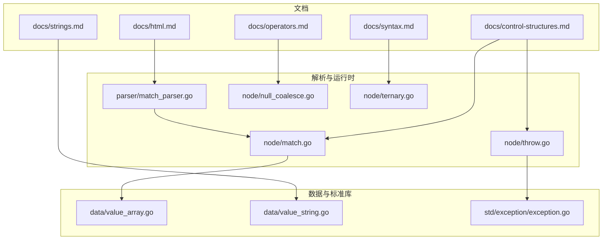
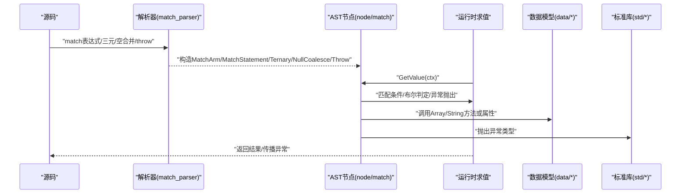
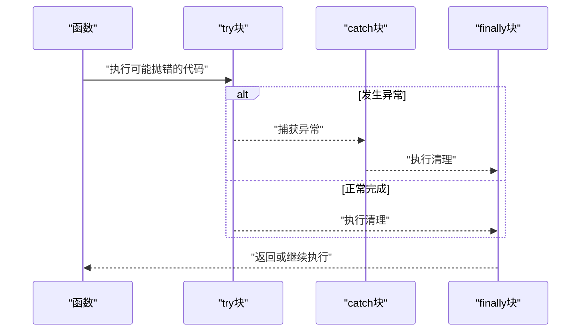
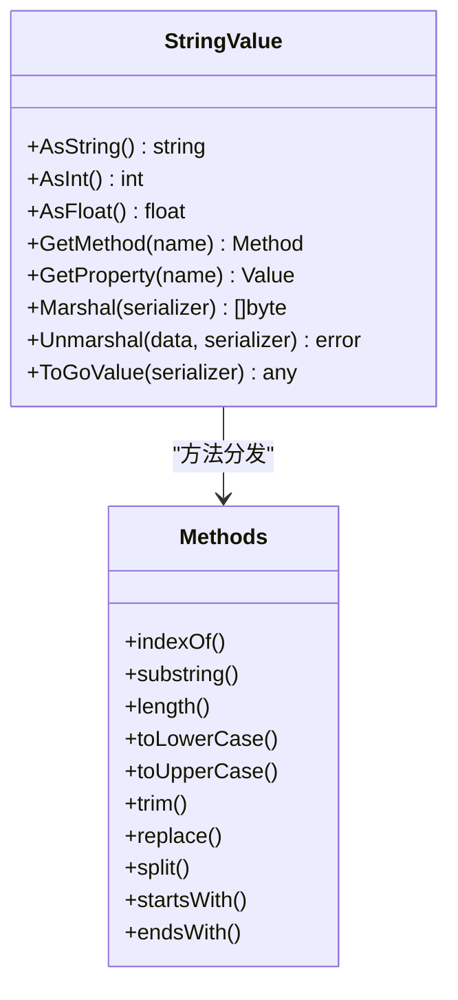
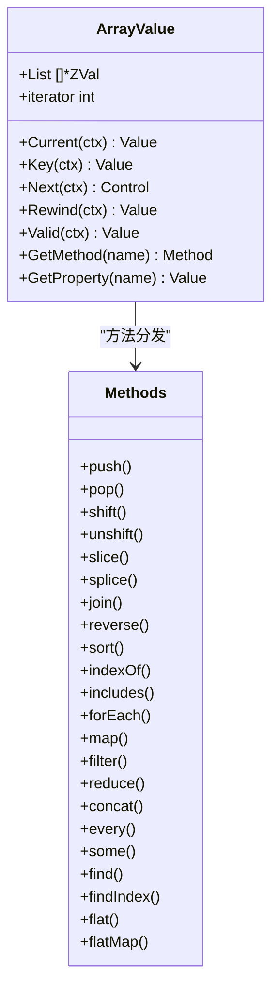
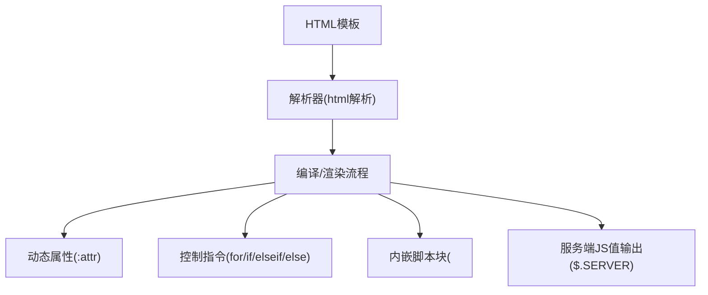
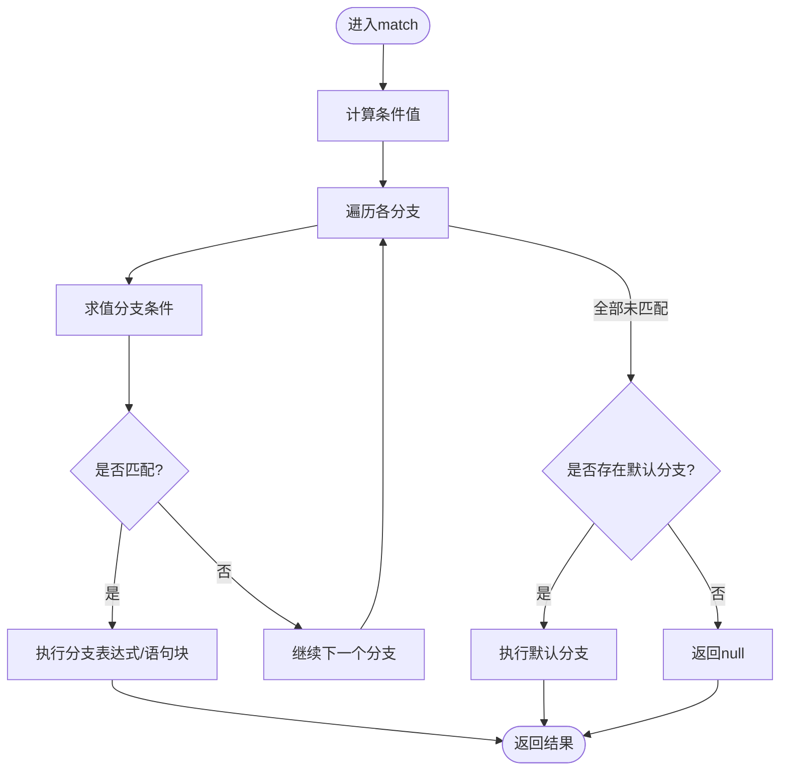
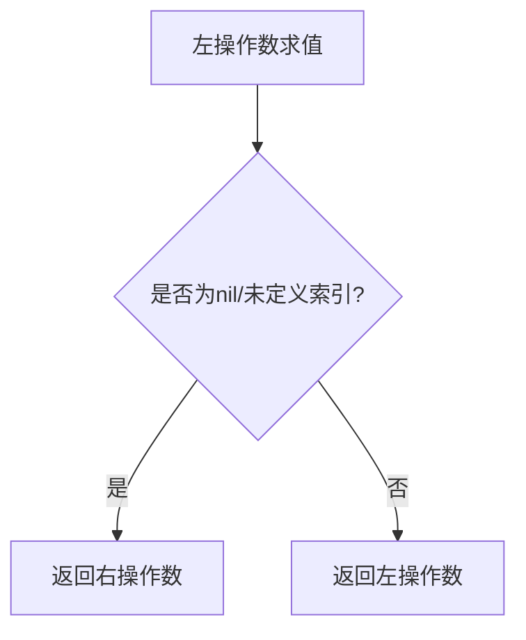
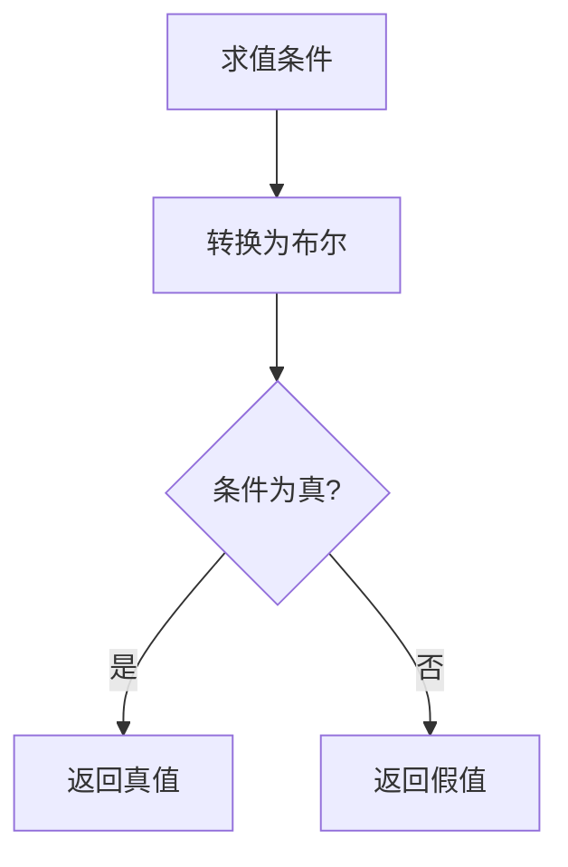
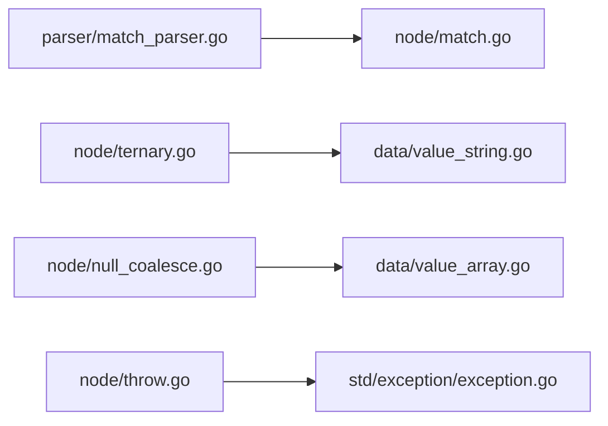

# 高级语言特性

<cite>
**本文引用的文件**   
- [operators.md](file://docs/operators.md)
- [control-structures.md](file://docs/control-structures.md)
- [strings.md](file://docs/strings.md)
- [html.md](file://docs/html.md)
- [syntax.md](file://docs/syntax.md)
- [match.go](file://node/match.go)
- [match_parser.go](file://parser/match_parser.go)
- [null_coalesce.go](file://node/null_coalesce.go)
- [ternary.go](file://node/ternary.go)
- [throw.go](file://node/throw.go)
- [exception.go](file://std/exception/exception.go)
- [value_array.go](file://data/value_array.go)
- [value_string.go](file://data/value_string.go)
</cite>

## 目录
1. [简介](#简介)
2. [项目结构](#项目结构)
3. [核心组件](#核心组件)
4. [架构总览](#架构总览)
5. [详细组件分析](#详细组件分析)
6. [依赖分析](#依赖分析)
7. [性能考虑](#性能考虑)
8. [故障排查指南](#故障排查指南)
9. [结论](#结论)
10. [附录](#附录)

## 简介
本文件面向Origami语言的高级语言特性，围绕异常处理机制、字符串处理方法、数组操作方法、模板字符串、HTML内嵌等主题，系统梳理现代语言特性（如match表达式、空合并运算符、三元运算符）的语义与实现，并提供性能优化建议与最佳实践，帮助读者高效、安全地构建高质量应用。

## 项目结构
- 文档侧：位于docs目录，覆盖运算符、控制结构、字符串、HTML渲染与模板、基础语法等主题，便于查阅高级特性的使用方式与示例。
- 语法解析与运行时：位于parser与node目录，负责将高级语法解析为AST节点，并在运行时执行。
- 数据模型与标准库：位于data与std目录，承载值类型、方法分发、异常类等基础设施。

**图示来源**
- [operators.md](file://docs/operators.md)
- [control-structures.md](file://docs/control-structures.md)
- [strings.md](file://docs/strings.md)
- [html.md](file://docs/html.md)
- [syntax.md](file://docs/syntax.md)
- [match_parser.go](file://parser/match_parser.go)
- [match.go](file://node/match.go)
- [null_coalesce.go](file://node/null_coalesce.go)
- [ternary.go](file://node/ternary.go)
- [throw.go](file://node/throw.go)
- [value_array.go](file://data/value_array.go)
- [value_string.go](file://data/value_string.go)
- [exception.go](file://std/exception/exception.go)

**章节来源**
- [operators.md](file://docs/operators.md)
- [control-structures.md](file://docs/control-structures.md)
- [strings.md](file://docs/strings.md)
- [html.md](file://docs/html.md)
- [syntax.md](file://docs/syntax.md)

## 核心组件
- 异常处理：通过throw语句与try-catch-finally控制结构实现，异常对象由标准库异常类提供基础能力。
- 字符串处理：字符串值类型提供丰富方法族，包括长度、查找、截取、替换、分割、前后缀检查、清理等。
- 数组操作：数组值类型提供push/pop/shift/unshift/slice/splice/join/reverse/sort/forEach/map/filter/reduce/concat/every/some/find/findIndex/flat/flatMap等方法。
- 模板字符串与HTML内嵌：语法层面支持模板字符串与HTML内嵌；HTML模板系统支持表达式插值、动态属性、控制指令、内嵌脚本块与服务端JS值输出。
- 现代语言特性：match表达式（表达式版本的多路分支）、空合并运算符、三元运算符。

**章节来源**
- [control-structures.md](file://docs/control-structures.md)
- [strings.md](file://docs/strings.md)
- [html.md](file://docs/html.md)
- [operators.md](file://docs/operators.md)
- [syntax.md](file://docs/syntax.md)

## 架构总览
下图展示了从源码到运行时的关键路径：解析器将高级语法解析为AST节点，运行时节点在上下文中求值，数据模型承载值与方法分发，标准库提供异常类型与工具。

**图示来源**
- [match_parser.go](file://parser/match_parser.go)
- [match.go](file://node/match.go)
- [null_coalesce.go](file://node/null_coalesce.go)
- [ternary.go](file://node/ternary.go)
- [throw.go](file://node/throw.go)
- [value_array.go](file://data/value_array.go)
- [value_string.go](file://data/value_string.go)
- [exception.go](file://std/exception/exception.go)

## 详细组件分析

### 异常处理机制
- 语义与用法：支持try-catch-finally结构，可在捕获块中处理不同类型的异常；finally块保证无论是否发生异常都会执行清理逻辑。
- 抛出异常：throw语句将值包装为异常并抛出；运行时根据值类型决定异常对象或消息。
- 标准库异常：异常类提供消息获取与堆栈跟踪等能力，便于调试与日志记录。

**图示来源**
- [control-structures.md](file://docs/control-structures.md)
- [throw.go](file://node/throw.go)
- [exception.go](file://std/exception/exception.go)

**章节来源**
- [control-structures.md](file://docs/control-structures.md)
- [throw.go](file://node/throw.go)
- [exception.go](file://std/exception/exception.go)

### 字符串处理方法
- 方法族：length、indexOf、substring、replace、split、startsWith、endsWith、trim、toLowerCase、toUpperCase。
- 属性：length属性提供只读长度。
- 使用建议：推荐链式调用以提升可读性；注意区分严格与松散比较；避免直接索引访问字符。

**图示来源**
- [value_string.go](file://data/value_string.go)
- [strings.md](file://docs/strings.md)

**章节来源**
- [strings.md](file://docs/strings.md)
- [value_string.go](file://data/value_string.go)

### 数组操作方法
- 方法族：push、pop、shift、unshift、slice、splice、join、reverse、sort、indexOf、includes、forEach、map、filter、reduce、concat、every、some、find、findIndex、flat、flatMap。
- 属性：length属性提供数组长度。
- 迭代器：数组值类型实现迭代器接口，支持foreach语义。

**图示来源**
- [value_array.go](file://data/value_array.go)

**章节来源**
- [value_array.go](file://data/value_array.go)

### 模板字符串与HTML内嵌
- 模板字符串：语法层面支持模板字符串与表达式插值。
- HTML内嵌：语法层面支持HTML内联标记，便于在代码中直接书写结构化内容。
- HTML模板系统：支持表达式插值、动态属性、控制指令（for/if/elseif/else）、内嵌脚本块、服务端JavaScript值输出（$.SERVER）。

**图示来源**
- [html.md](file://docs/html.md)
- [syntax.md](file://docs/syntax.md)

**章节来源**
- [html.md](file://docs/html.md)
- [syntax.md](file://docs/syntax.md)

### match表达式
- 语义：表达式版本的多路分支，支持多个条件组合与默认分支；可返回表达式或执行语句块。
- 解析：解析器支持括号形式条件与复杂表达式作为条件，支持instanceof枚举匹配等高级条件。
- 运行时：运行时节点对条件进行求值与比较，命中后返回对应分支结果，否则执行默认分支。

**图示来源**
- [match_parser.go](file://parser/match_parser.go)
- [match.go](file://node/match.go)

**章节来源**
- [match_parser.go](file://parser/match_parser.go)
- [match.go](file://node/match.go)

### 空合并运算符
- 语义：若左侧为null或未定义索引，则返回右侧；否则返回左侧。
- 运行时：对左侧求值，识别未定义索引错误或空值类型，按规则返回左右两侧的值。

**图示来源**
- [null_coalesce.go](file://node/null_coalesce.go)

**章节来源**
- [null_coalesce.go](file://node/null_coalesce.go)

### 三元运算符
- 语义：基于条件表达式的真假选择真值或假值。
- 运行时：将条件值转换为布尔，按布尔值选择相应分支。

**图示来源**
- [ternary.go](file://node/ternary.go)

**章节来源**
- [ternary.go](file://node/ternary.go)

## 依赖分析
- 解析器与运行时：match_parser.go依赖node/match.go生成AST节点；ternary.go与null_coalesce.go分别实现三元与空合并的运行时求值。
- 数据模型：value_string.go与value_array.go提供字符串与数组的方法分发；运行时节点通过GetValue(ctx)与方法分发调用具体实现。
- 异常：throw.go将值包装为异常并抛出，标准库exception.go提供异常类基础能力。

**图示来源**
- [match_parser.go](file://parser/match_parser.go)
- [match.go](file://node/match.go)
- [ternary.go](file://node/ternary.go)
- [null_coalesce.go](file://node/null_coalesce.go)
- [value_string.go](file://data/value_string.go)
- [value_array.go](file://data/value_array.go)
- [throw.go](file://node/throw.go)
- [exception.go](file://std/exception/exception.go)

**章节来源**
- [match_parser.go](file://parser/match_parser.go)
- [match.go](file://node/match.go)
- [ternary.go](file://node/ternary.go)
- [null_coalesce.go](file://node/null_coalesce.go)
- [value_string.go](file://data/value_string.go)
- [value_array.go](file://data/value_array.go)
- [throw.go](file://node/throw.go)
- [exception.go](file://std/exception/exception.go)

## 性能考虑
- 字符串与数组方法链：链式调用可减少中间变量，但需避免不必要的重复计算；对数组长度等昂贵操作建议缓存。
- 循环与查找：优先使用forEach/map/filter/reduce等函数式方法以提升可读性；在热点路径中注意避免重复查找与重复拼接。
- 空合并与三元：短路行为可减少无效计算，但应避免在条件中引入复杂表达式导致可读性下降。
- 异常成本：异常路径不应作为常规流程，尽量通过显式检查与空合并降低异常触发频率。

[本节为通用性能建议，不直接分析具体文件]

## 故障排查指南
- 字符串方法调用：确认使用正确的方法名与签名；避免对不存在的方法进行调用。
- 数组边界：注意索引越界与空数组访问；优先使用includes/includes等安全检查。
- 空合并与三元：检查条件类型转换是否符合预期；避免在三元中混用复杂表达式导致歧义。
- 异常处理：确保catch块中记录足够信息；避免吞掉异常而不做任何处理。
- HTML模板：动态属性与内嵌脚本需遵循模板语法规则；服务端JS值输出需确保变量已定义且类型兼容。

**章节来源**
- [strings.md](file://docs/strings.md)
- [value_string.go](file://data/value_string.go)
- [value_array.go](file://data/value_array.go)
- [null_coalesce.go](file://node/null_coalesce.go)
- [ternary.go](file://node/ternary.go)
- [throw.go](file://node/throw.go)
- [html.md](file://docs/html.md)

## 结论
Origami语言通过完善的解析器与运行时体系，为开发者提供了现代、安全且高性能的高级语言特性。借助match表达式、空合并运算符、三元运算符、异常处理、字符串与数组方法族，以及HTML模板与内嵌能力，可以在保持代码简洁的同时获得强大的表达力与可维护性。配合本文的最佳实践与性能建议，可进一步提升开发效率与系统稳定性。

[本节为总结性内容，不直接分析具体文件]

## 附录
- 运算符与控制结构：详见文档对应章节，涵盖优先级、短路求值、异常处理等。
- 字符串与数组：详见文档对应章节，涵盖方法族、属性与实用示例。
- HTML与模板：详见文档对应章节，涵盖模板语法、动态属性、内嵌脚本与服务端JS值输出。

**章节来源**
- [operators.md](file://docs/operators.md)
- [control-structures.md](file://docs/control-structures.md)
- [strings.md](file://docs/strings.md)
- [html.md](file://docs/html.md)
- [syntax.md](file://docs/syntax.md)