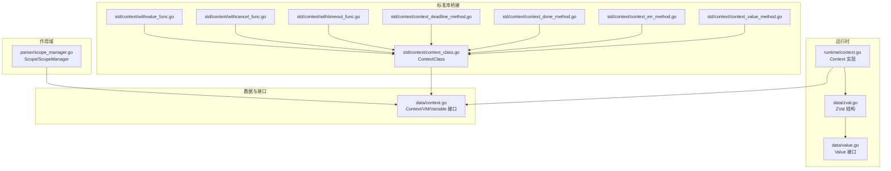
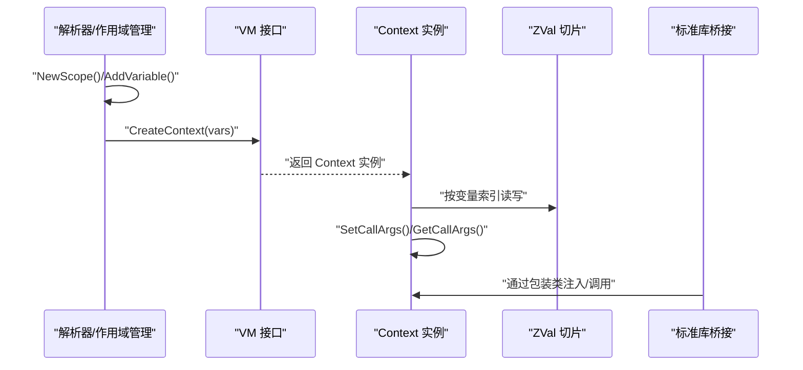
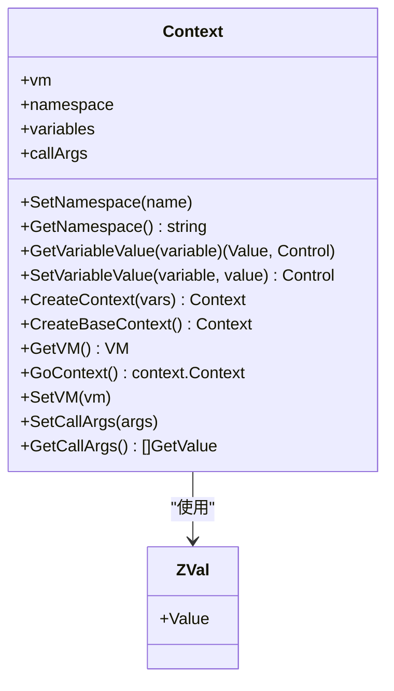
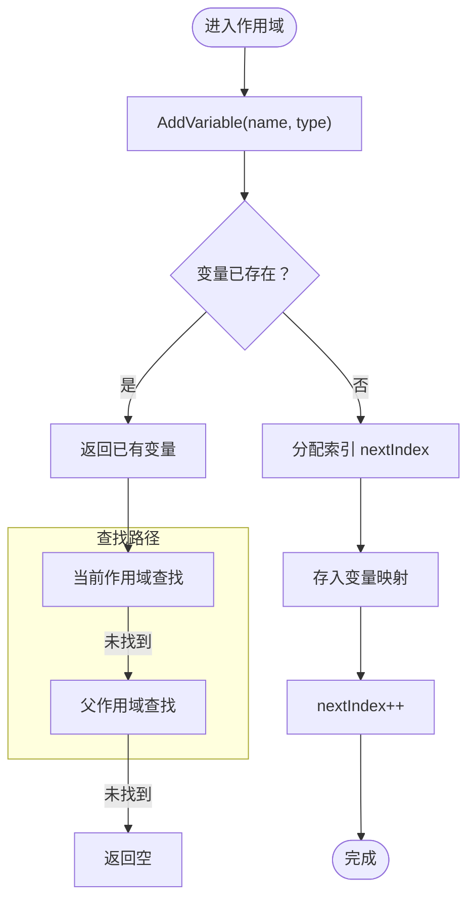
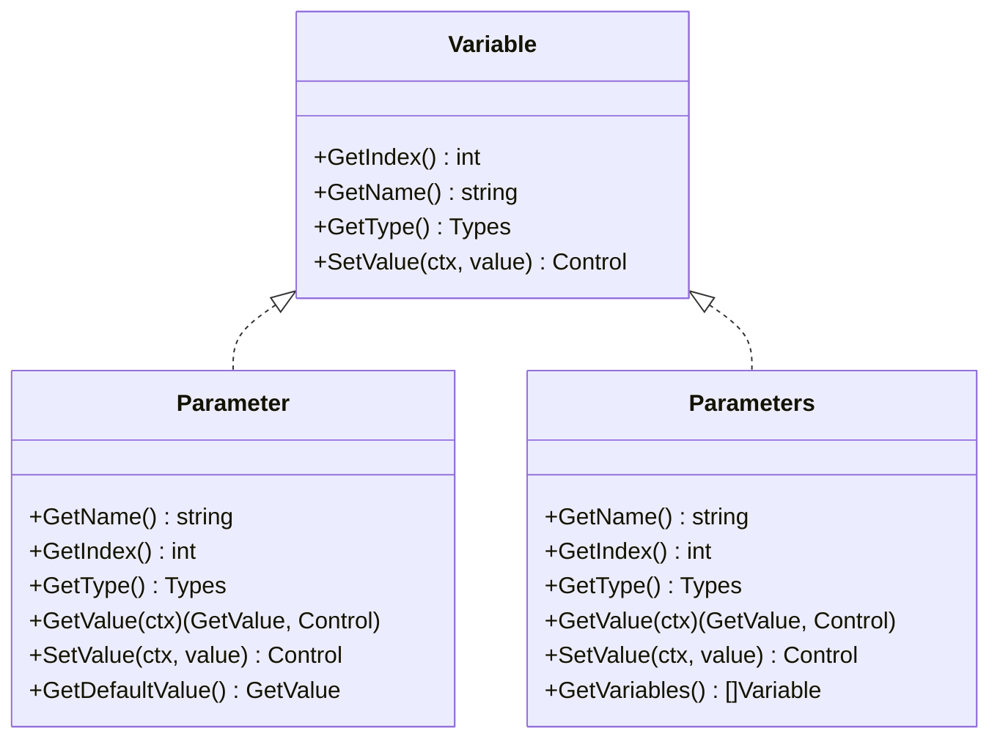
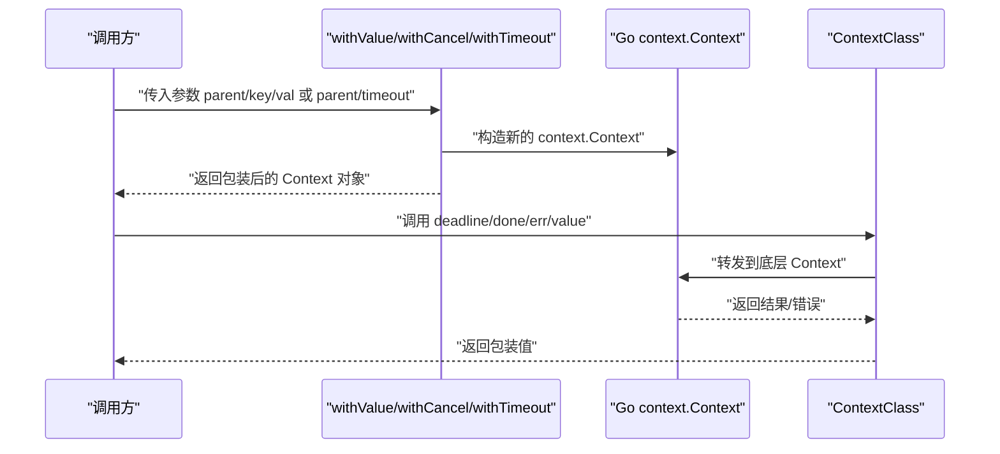
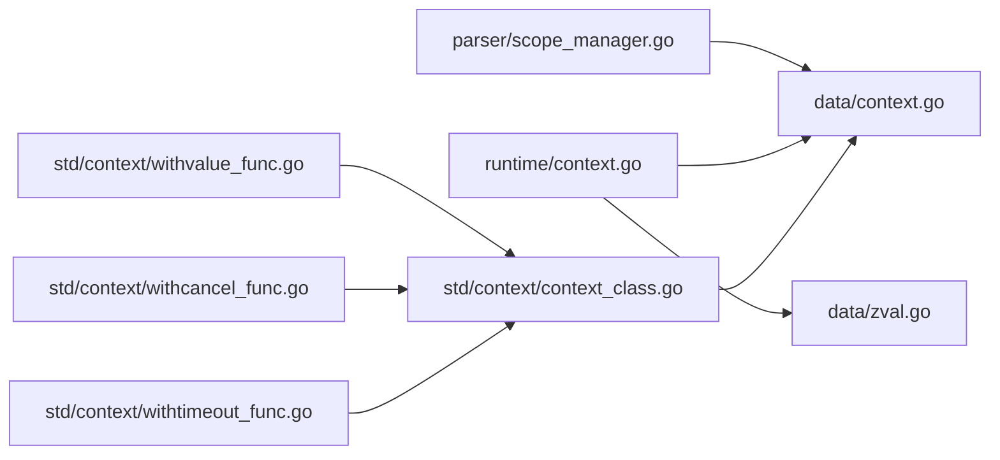

# 上下文管理

<cite>
**本文引用的文件**
- [runtime/context.go](file://runtime/context.go)
- [data/context.go](file://data/context.go)
- [data/zval.go](file://data/zval.go)
- [data/value.go](file://data/value.go)
- [parser/scope_manager.go](file://parser/scope_manager.go)
- [std/context/context_class.go](file://std/context/context_class.go)
- [std/context/withvalue_func.go](file://std/context/withvalue_func.go)
- [std/context/withcancel_func.go](file://std/context/withcancel_func.go)
- [std/context/withtimeout_func.go](file://std/context/withtimeout_func.go)
- [std/context/context_deadline_method.go](file://std/context/context_deadline_method.go)
- [std/context/context_done_method.go](file://std/context/context_done_method.go)
- [std/context/context_err_method.go](file://std/context/context_err_method.go)
- [std/context/context_value_method.go](file://std/context/context_value_method.go)
</cite>

## 目录
1. [简介](#简介)
2. [项目结构](#项目结构)
3. [核心组件](#核心组件)
4. [架构总览](#架构总览)
5. [详细组件分析](#详细组件分析)
6. [依赖分析](#依赖分析)
7. [性能考虑](#性能考虑)
8. [故障排查指南](#故障排查指南)
9. [结论](#结论)
10. [附录](#附录)

## 简介
本文件系统性阐述 Origami 的“上下文”（Context）管理机制，覆盖以下主题：
- 上下文的概念与作用域管理：变量查找算法、作用域链构建、变量生命周期管理
- 上下文的创建流程：变量注册、作用域隔离、内存管理
- 全局变量与局部变量的处理、参数传递机制
- 上下文切换、嵌套作用域与闭包支持的实现要点
- 最佳实践与性能优化建议

说明：Origami 的“上下文”既包含运行时执行上下文（用于变量存取、调用参数记录），也包含对 Go 标准库 context 的封装与桥接（std/context）。本文将分别解析这两部分。

## 项目结构
围绕上下文管理的关键模块如下：
- 运行时上下文：runtime/context.go 提供 Context 接口与实现，负责变量表、调用参数、VM 绑定与命名空间
- 数据模型与接口：data/context.go 定义 Context、VM、Variable、Method、FuncStmt 等核心接口
- 变量与值：data/zval.go、data/value.go 描述 ZVal 与 Value 抽象
- 作用域管理：parser/scope_manager.go 提供作用域栈、变量注册与查找
- 标准库上下文桥接：std/context/* 提供对 Go context 的封装与函数方法

图表来源
- [runtime/context.go:1-140](file://runtime/context.go#L1-L140)
- [data/context.go:1-349](file://data/context.go#L1-L349)
- [data/zval.go:1-18](file://data/zval.go#L1-L18)
- [data/value.go:1-39](file://data/value.go#L1-L39)
- [parser/scope_manager.go:1-203](file://parser/scope_manager.go#L1-L203)
- [std/context/context_class.go:1-64](file://std/context/context_class.go#L1-L64)
- [std/context/withvalue_func.go:1-108](file://std/context/withvalue_func.go#L1-L108)
- [std/context/withcancel_func.go:1-60](file://std/context/withcancel_func.go#L1-L60)
- [std/context/withtimeout_func.go:1-73](file://std/context/withtimeout_func.go#L1-L73)
- [std/context/context_deadline_method.go:1-30](file://std/context/context_deadline_method.go#L1-L30)
- [std/context/context_done_method.go:1-30](file://std/context/context_done_method.go#L1-L30)
- [std/context/context_err_method.go:1-34](file://std/context/context_err_method.go#L1-L34)
- [std/context/context_value_method.go:1-45](file://std/context/context_value_method.go#L1-L45)

章节来源
- [runtime/context.go:1-140](file://runtime/context.go#L1-L140)
- [data/context.go:1-349](file://data/context.go#L1-L349)
- [parser/scope_manager.go:1-203](file://parser/scope_manager.go#L1-L203)

## 核心组件
- 运行时上下文 Context
  - 负责变量表（ZVal 切片）、命名空间、调用参数记录、VM 绑定、GoContext 适配
  - 提供变量读写、索引访问、函数上下文创建、基础上下文创建等能力
- 数据接口 Context/VM/Variable/Method/FuncStmt
  - 规范了上下文、虚拟机、变量、方法、函数的统一抽象
  - 支持类型检查、默认参数、变量表创建、常量与全局变量管理
- 作用域 Scope/ScopeManager
  - 通过作用域栈维护变量注册与查找，支持父子作用域链、lambda 标记
  - 提供变量注册、变量表导出、作用域切换等能力
- 标准库上下文桥接
  - 将 Go context.Context 包装为 Origami 类型，并暴露 deadline/done/err/value 等方法
  - 提供 withValue/withCancel/withTimeout 等函数，返回包装后的 Context 对象

章节来源
- [runtime/context.go:12-140](file://runtime/context.go#L12-L140)
- [data/context.go:8-64](file://data/context.go#L8-L64)
- [parser/scope_manager.go:10-203](file://parser/scope_manager.go#L10-L203)
- [std/context/context_class.go:10-64](file://std/context/context_class.go#L10-L64)

## 架构总览
运行时上下文与作用域管理协同工作，形成“作用域注册 + 符号表 + 变量存取”的完整链路；同时通过 VM 接口与标准库桥接，实现与 Go context 的互操作。

图表来源
- [parser/scope_manager.go:80-100](file://parser/scope_manager.go#L80-L100)
- [data/context.go:49-52](file://data/context.go#L49-L52)
- [runtime/context.go:89-102](file://runtime/context.go#L89-L102)
- [runtime/context.go:117-125](file://runtime/context.go#L117-L125)

## 详细组件分析

### 运行时上下文 Context
- 设计要点
  - 变量表采用 ZVal 切片，按变量索引访问，避免哈希查找开销
  - 支持函数上下文创建（CreateContext）与基础上下文（CreateBaseContext）
  - 调用参数通过 SetCallArgs/GetCallArgs 记录，便于 func_get_args 等内建行为
  - 提供 SetVM/GetVM/GOContext 以适配 VM 切换与 Go 标准库集成
- 变量存取策略
  - GetVariableValue/SetVariableValue 支持普通值、引用值、数组/对象的深拷贝（按需）
  - 对数组与对象进行结构级克隆，避免共享状态导致的反向修改
- 生命周期与内存管理
  - 函数退出即释放其上下文（变量表切片随 GC 回收）
  - 通过 CreateBaseContext 可创建无变量表的上下文，用于特殊场景

图表来源
- [runtime/context.go:13-125](file://runtime/context.go#L13-L125)
- [data/zval.go:4-13](file://data/zval.go#L4-L13)

章节来源
- [runtime/context.go:12-140](file://runtime/context.go#L12-L140)
- [data/zval.go:1-18](file://data/zval.go#L1-L18)

### 作用域管理与变量注册
- 作用域链
  - ScopeManager 维护作用域栈，支持 NewScope/PopScope/CurrentScope
  - DefaultScope 保存父作用域、变量映射、下一个索引、lambda 标记
- 变量注册与查找
  - AddVariable 自动去除变量名前缀“$”，并分配连续索引
  - LookupVariable/LookupParentVariable 支持从当前作用域向上查找
  - GetVariables 导出变量表，按索引顺序排列，供上下文创建使用
- 作用域隔离与嵌套
  - 子作用域继承父作用域的变量可见性，但新增变量不影响父作用域
  - Lambda 标记用于区分闭包作用域（影响外部访问规则）

图表来源
- [parser/scope_manager.go:103-113](file://parser/scope_manager.go#L103-L113)
- [parser/scope_manager.go:115-135](file://parser/scope_manager.go#L115-L135)
- [parser/scope_manager.go:138-144](file://parser/scope_manager.go#L138-L144)

章节来源
- [parser/scope_manager.go:10-203](file://parser/scope_manager.go#L10-L203)

### 变量类型与参数处理
- Variable/Parameter/Parameters
  - Variable 提供索引、名称、类型与 SetValue 接口
  - Parameter 支持默认值、类型检查与 GetValue 流程（自动填充默认值）
  - Parameters 支持可变参数收集，确保返回数组类型
- 类型约束与错误处理
  - 当类型不匹配时抛出错误控制（Control），交由 VM 统一处理

图表来源
- [data/context.go:157-220](file://data/context.go#L157-L220)
- [data/context.go:244-349](file://data/context.go#L244-L349)

章节来源
- [data/context.go:157-349](file://data/context.go#L157-L349)

### 标准库上下文桥接
- ContextClass
  - 将 Go context.Context 包装为 Origami 类型，暴露 deadline/done/err/value 方法
  - 通过 GetSource 获取底层 context.Context，实现方法调用转发
- withValue/withCancel/withTimeout
  - withValue：从参数中提取 Context、key、val，调用 context.WithValue 并返回包装后的 Context 对象
  - withCancel：返回 Context 与取消函数的元组
  - withTimeout：将 timeout 转换为 duration 后调用 context.WithTimeout
- 方法实现
  - deadline/done/err/value 分别对应底层 Context 的同名方法，返回包装值或抛出异常

图表来源
- [std/context/withvalue_func.go:18-88](file://std/context/withvalue_func.go#L18-L88)
- [std/context/withcancel_func.go:18-44](file://std/context/withcancel_func.go#L18-L44)
- [std/context/withtimeout_func.go:19-55](file://std/context/withtimeout_func.go#L19-L55)
- [std/context/context_class.go:20-64](file://std/context/context_class.go#L20-L64)
- [std/context/context_deadline_method.go:12-16](file://std/context/context_deadline_method.go#L12-L16)
- [std/context/context_done_method.go:12-15](file://std/context/context_done_method.go#L12-L15)
- [std/context/context_err_method.go:14-20](file://std/context/context_err_method.go#L14-L20)
- [std/context/context_value_method.go:16-27](file://std/context/context_value_method.go#L16-L27)

章节来源
- [std/context/context_class.go:1-64](file://std/context/context_class.go#L1-L64)
- [std/context/withvalue_func.go:1-108](file://std/context/withvalue_func.go#L1-L108)
- [std/context/withcancel_func.go:1-60](file://std/context/withcancel_func.go#L1-L60)
- [std/context/withtimeout_func.go:1-73](file://std/context/withtimeout_func.go#L1-L73)
- [std/context/context_deadline_method.go:1-30](file://std/context/context_deadline_method.go#L1-L30)
- [std/context/context_done_method.go:1-30](file://std/context/context_done_method.go#L1-L30)
- [std/context/context_err_method.go:1-34](file://std/context/context_err_method.go#L1-L34)
- [std/context/context_value_method.go:1-45](file://std/context/context_value_method.go#L1-L45)

## 依赖分析
- 运行时上下文依赖数据接口与节点定义，通过 VM 注入执行环境
- 作用域管理独立于运行时，仅在编译期/解析期生成变量索引与符号表
- 标准库桥接依赖 Go context，并通过包装类与方法实现与 Origami 的统一接口

图表来源
- [parser/scope_manager.go:1-203](file://parser/scope_manager.go#L1-L203)
- [runtime/context.go:1-140](file://runtime/context.go#L1-L140)
- [data/context.go:1-349](file://data/context.go#L1-L349)
- [data/zval.go:1-18](file://data/zval.go#L1-L18)
- [std/context/context_class.go:1-64](file://std/context/context_class.go#L1-L64)
- [std/context/withvalue_func.go:1-108](file://std/context/withvalue_func.go#L1-L108)
- [std/context/withcancel_func.go:1-60](file://std/context/withcancel_func.go#L1-L60)
- [std/context/withtimeout_func.go:1-73](file://std/context/withtimeout_func.go#L1-L73)

章节来源
- [parser/scope_manager.go:1-203](file://parser/scope_manager.go#L1-L203)
- [runtime/context.go:1-140](file://runtime/context.go#L1-L140)
- [data/context.go:1-349](file://data/context.go#L1-L349)

## 性能考虑
- 变量访问优化
  - 使用整数索引直接访问 ZVal 切片，避免哈希查找，时间复杂度 O(1)
  - 数组/对象赋值时进行结构级克隆，防止共享状态带来的额外写时复制成本
- 作用域管理优化
  - 作用域栈按需扩展，变量注册与查找为 O(1) 哈希表操作
  - 通过 GetVariables 导出有序变量表，减少运行时排序开销
- 标准库桥接优化
  - ContextClass 仅包装底层 context.Context，方法调用直接转发，零拷贝
  - withValue/withCancel/withTimeout 仅在构造新 Context 时产生少量分配
- 内存管理
  - 函数上下文随调用结束释放；CreateBaseContext 可用于轻量上下文
  - 避免不必要的深层克隆，仅在必要时复制数组/对象

## 故障排查指南
- 变量不存在或越界
  - 现象：GetVariableValue 返回错误控制
  - 处理：确认变量是否在当前作用域注册，或索引是否超出变量表长度
- 类型不匹配
  - 现象：SetValue 抛出类型不一致错误
  - 处理：检查 Variable/Parameter 的类型约束，确保赋值类型满足要求
- 参数缺失
  - 现象：withValue/withCancel/withTimeout 返回“缺少参数”错误
  - 处理：确保传入正确的参数数量与类型（parent/key/val 或 parent/timeout）
- 标准库上下文错误
  - 现象：调用 err 方法时抛出底层错误
  - 处理：根据错误类型决定取消或重试策略

章节来源
- [runtime/context.go:43-57](file://runtime/context.go#L43-L57)
- [data/context.go:193-201](file://data/context.go#L193-L201)
- [std/context/withvalue_func.go:20-33](file://std/context/withvalue_func.go#L20-L33)
- [std/context/context_err_method.go:16-20](file://std/context/context_err_method.go#L16-L20)

## 结论
Origami 的上下文管理以“作用域 + 符号表 + 运行时上下文”为核心，结合 VM 接口与标准库桥接，实现了高效、可扩展且与 Go 生态兼容的执行环境。通过索引化变量访问、结构级克隆与作用域栈管理，系统在保证正确性的同时兼顾性能。标准库桥接进一步增强了上下文在并发与超时控制方面的可用性。

## 附录
- 最佳实践
  - 在函数入口使用 CreateContext 注册参数变量，确保类型安全与默认值处理
  - 使用 ScopeManager 在编译期完成变量注册，避免运行时动态查找
  - 对数组/对象赋值时优先考虑按需克隆，避免隐式共享
  - 在需要与 Go 并发生态协作时，优先使用标准库桥接函数与方法
- 性能优化建议
  - 控制变量数量与嵌套层级，减少作用域链深度
  - 避免频繁创建与销毁上下文，复用 CreateBaseContext
  - 对热点路径使用索引访问替代反射式属性/方法查找