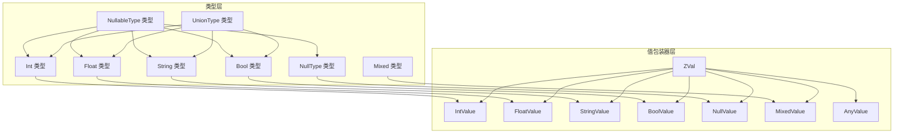
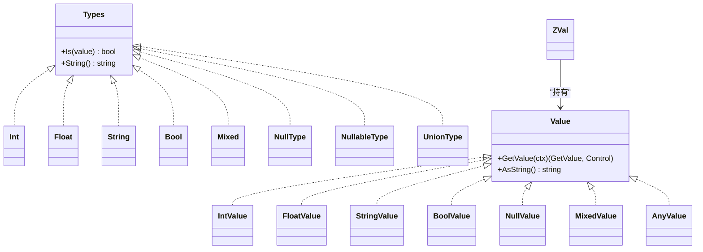
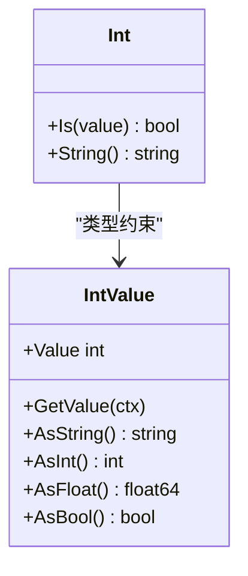
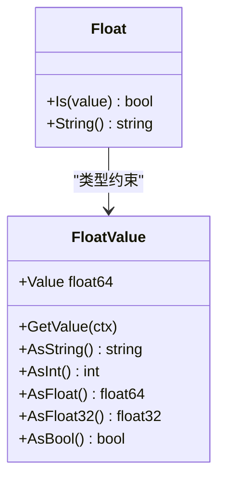
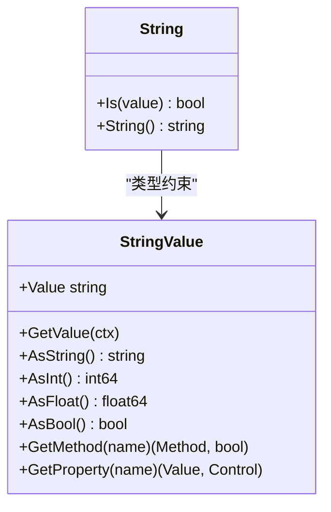
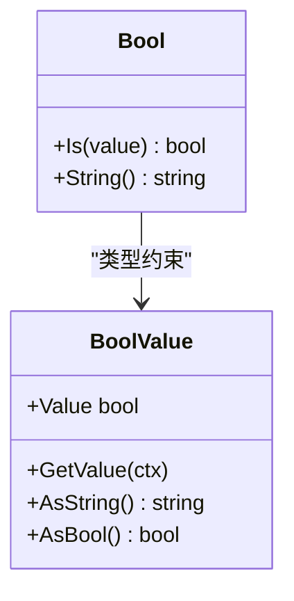
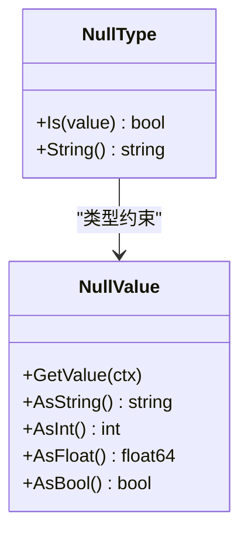
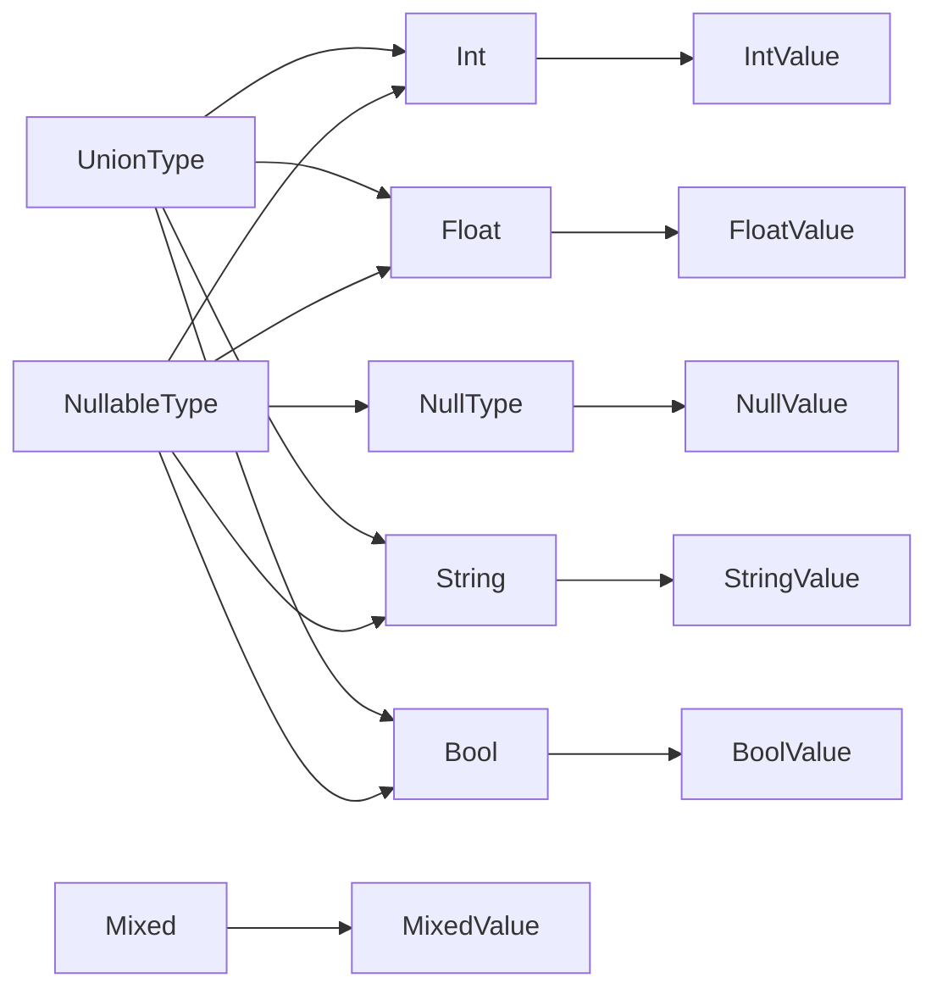

# 基础数据类型

<cite>
**本文引用的文件**
- [data/types.go](file://data/types.go)
- [data/type_int.go](file://data/type_int.go)
- [data/type_floath.go](file://data/type_floath.go)
- [data/type_string.go](file://data/type_string.go)
- [data/type_bool.go](file://data/type_bool.go)
- [data/type_mixed.go](file://data/type_mixed.go)
- [data/type_const.go](file://data/type_const.go)
- [data/value.go](file://data/value.go)
- [data/value_int.go](file://data/value_int.go)
- [data/value_float.go](file://data/value_float.go)
- [data/value_string.go](file://data/value_string.go)
- [data/value_bool.go](file://data/value_bool.go)
- [data/value_null.go](file://data/value_null.go)
- [data/value_mixed.go](file://data/value_mixed.go)
- [data/zval.go](file://data/zval.go)
- [data/value_any.go](file://data/value_any.go)
</cite>

## 目录
1. [引言](#引言)
2. [项目结构](#项目结构)
3. [核心组件](#核心组件)
4. [架构总览](#架构总览)
5. [详细组件分析](#详细组件分析)
6. [依赖分析](#依赖分析)
7. [性能考虑](#性能考虑)
8. [故障排查指南](#故障排查指南)
9. [结论](#结论)
10. [附录](#附录)

## 引言
本文件系统性梳理 Origami 的基础数据类型体系，聚焦标量类型（整数 Int、浮点数 Float、字符串 String、布尔 Bool、空 Null、混合 Mixed）的设计与实现，覆盖内部表示、值包装器、类型检查机制、转换规则、类型常量与构造函数、常用操作方法，以及在表达式计算与类型推断中的行为特征。文档同时给出可视化图示与分层讲解，帮助读者快速掌握从概念到实现的全貌。

## 项目结构
基础数据类型相关代码主要位于 data 目录，采用“类型定义 + 值包装器”的分层设计：
- 类型层：以 data/types.go 为核心，定义类型接口 Types 与若干具体类型（Int、Float、String、Bool、Mixed、NullType、NullableType、UnionType 等），负责类型判断与字符串化。
- 值层：以 data/value*.go 为系列，定义各标量类型的值包装器（如 IntValue、FloatValue、StringValue、BoolValue、NullValue、MixedValue、AnyValue），负责运行期值的存储与跨类型转换。
- 辅助层：data/zval.go 提供 ZVal 包装，便于与底层运行时交互；data/value.go 定义 Value 接口及可调用、属性访问等扩展接口。



图表来源
- [data/types.go:34-106](file://data/types.go#L34-L106)
- [data/type_int.go:3-16](file://data/type_int.go#L3-L16)
- [data/type_floath.go:3-15](file://data/type_floath.go#L3-L15)
- [data/type_string.go:3-16](file://data/type_string.go#L3-L16)
- [data/type_bool.go:3-21](file://data/type_bool.go#L3-L21)
- [data/type_mixed.go:3-11](file://data/type_mixed.go#L3-L11)
- [data/value_int.go:18-51](file://data/value_int.go#L18-L51)
- [data/value_float.go:25-62](file://data/value_float.go#L25-L62)
- [data/value_string.go:16-85](file://data/value_string.go#L16-L85)
- [data/value_bool.go:17-46](file://data/value_bool.go#L17-L46)
- [data/value_null.go:11-44](file://data/value_null.go#L11-L44)
- [data/value_mixed.go:11-33](file://data/value_mixed.go#L11-L33)
- [data/zval.go:4-17](file://data/zval.go#L4-L17)

章节来源
- [data/types.go:1-262](file://data/types.go#L1-L262)
- [data/value.go:3-38](file://data/value.go#L3-L38)
- [data/zval.go:1-18](file://data/zval.go#L1-L18)

## 核心组件
- 类型接口与工厂
  - Types 接口：定义 Is(value Value) bool 与 String() string，用于类型判断与字符串化。
  - NewBaseType：根据字符串类型名（如 "int"、"string"、"bool"、"float"、"null"、"mixed" 等）构建对应类型对象；支持联合类型（| 分隔）、可空类型（? 前缀）。
  - NullableType、UnionType、StaticType、ClosureType、NullType 等：分别表示可空、联合、静态返回、闭包、空类型。
- 值接口与包装器
  - Value 接口：统一的值抽象，提供 GetValue 与 AsString。
  - 各标量值包装器：IntValue、FloatValue、StringValue、BoolValue、NullValue、MixedValue、AnyValue，均实现 Value 接口，并提供 AsInt/AsFloat/AsBool/AsString 等转换能力。
  - ZVal：对 Value 的轻量封装，便于运行时传递与序列化。

章节来源
- [data/types.go:5-106](file://data/types.go#L5-L106)
- [data/value.go:3-38](file://data/value.go#L3-L38)
- [data/zval.go:1-18](file://data/zval.go#L1-L18)

## 架构总览
下图展示了类型层与值包装器层之间的映射关系，以及 ZVal 在运行时中的角色。



图表来源
- [data/types.go:3-106](file://data/types.go#L3-L106)
- [data/value_int.go:18-51](file://data/value_int.go#L18-L51)
- [data/value_float.go:25-62](file://data/value_float.go#L25-L62)
- [data/value_string.go:16-85](file://data/value_string.go#L16-L85)
- [data/value_bool.go:17-46](file://data/value_bool.go#L17-L46)
- [data/value_null.go:11-44](file://data/value_null.go#L11-L44)
- [data/value_mixed.go:11-33](file://data/value_mixed.go#L11-L33)
- [data/value_any.go:11-33](file://data/value_any.go#L11-L33)
- [data/zval.go:4-17](file://data/zval.go#L4-L17)

## 详细组件分析

### 整数类型（Int）
- 内部表示
  - 类型：Int 结构体，用于类型判断。
  - 值包装器：IntValue，内部保存 int 值。
- 类型检查
  - Int.Is 仅接受 *IntValue，严格匹配。
- 转换规则
  - AsInt：返回原值。
  - AsFloat：转换为 float64。
  - AsBool：大于 0 视为 true。
  - AsString：格式化为十进制字符串。
- 构造函数与常用方法
  - NewIntValue(int) -> Value
  - AsInt()/AsFloat()/AsBool()/AsString() 等。
- 表达式与类型推断
  - 在二元运算中，若参与方为 IntValue，结果通常保持整数域；与 FloatValue 混合时，可能触发浮点提升。



图表来源
- [data/type_int.go:3-16](file://data/type_int.go#L3-L16)
- [data/value_int.go:18-51](file://data/value_int.go#L18-L51)

章节来源
- [data/type_int.go:1-17](file://data/type_int.go#L1-L17)
- [data/value_int.go:1-52](file://data/value_int.go#L1-L52)

### 浮点数类型（Float）
- 内部表示
  - 类型：Float 结构体，用于类型判断。
  - 值包装器：FloatValue，内部保存 float64 值。
- 类型检查
  - Float.Is 通过 AsFloat 接口判定，允许实现 AsFloat 的值作为浮点使用。
- 转换规则
  - AsFloat/AsFloat32：返回原值或转换为 float32。
  - AsInt：向下截断为 int。
  - AsBool：大于 0 视为 true。
  - AsString：格式化为浮点字符串。
- 构造函数与常用方法
  - NewFloatValue(float64) -> Value
  - AsFloat()/AsFloat32()/AsInt()/AsBool()/AsString() 等。
- 表达式与类型推断
  - 与 IntValue 混合运算时，结果通常为浮点；参与比较时遵循弱类型语义。



图表来源
- [data/type_floath.go:3-15](file://data/type_floath.go#L3-L15)
- [data/value_float.go:25-62](file://data/value_float.go#L25-L62)

章节来源
- [data/type_floath.go:1-16](file://data/type_floath.go#L1-L16)
- [data/value_float.go:1-63](file://data/value_float.go#L1-L63)

### 字符串类型（String）
- 内部表示
  - 类型：String 结构体，用于类型判断。
  - 值包装器：StringValue，内部保存 string 值。
- 类型检查
  - String.Is 仅接受 *StringValue，严格匹配。
- 转换规则
  - AsInt/AsFloat：基于字符串解析为整数/浮点数。
  - AsBool：非空字符串视为 true。
  - AsString：返回原值。
- 方法与属性
  - GetMethod：支持 indexOf、substring、length、toLowerCase、toUpperCase、trim、replace、split、startsWith、endsWith 等。
  - GetProperty：支持 length 属性，返回整数值。
- 构造函数与常用方法
  - NewStringValue(string) -> Value
  - AsInt()/AsFloat()/AsBool()/AsString() 与各类字符串方法。
- 表达式与类型推断
  - 与数字类型拼接时，按弱类型语义进行隐式转换；参与比较时遵循 PHP 风格的弱类型规则。



图表来源
- [data/type_string.go:3-16](file://data/type_string.go#L3-L16)
- [data/value_string.go:16-85](file://data/value_string.go#L16-L85)

章节来源
- [data/type_string.go:1-17](file://data/type_string.go#L1-L17)
- [data/value_string.go:1-86](file://data/value_string.go#L1-L86)

### 布尔类型（Bool）
- 内部表示
  - 类型：Bool 结构体，用于类型判断。
  - 值包装器：BoolValue，内部保存 bool 值。
- 类型检查
  - Bool.Is 优先匹配 *BoolValue；其次允许实现 AsBool 的值作为布尔使用，体现弱类型语义。
- 转换规则
  - AsBool：返回原值。
  - AsInt：true 为 1，false 为 0。
  - AsFloat：true 为 1.0，false 为 0.0。
  - AsString：返回 "true"/"false"。
- 构造函数与常用方法
  - NewBoolValue(bool) -> Value
  - AsBool()/AsInt()/AsFloat()/AsString() 等。
- 表达式与类型推断
  - 在条件判断与逻辑运算中，遵循弱类型真值表；与其它标量类型混用时，按 PHP 语义进行隐式转换。



图表来源
- [data/type_bool.go:3-21](file://data/type_bool.go#L3-L21)
- [data/value_bool.go:17-46](file://data/value_bool.go#L17-L46)

章节来源
- [data/type_bool.go:1-22](file://data/type_bool.go#L1-L22)
- [data/value_bool.go:1-47](file://data/value_bool.go#L1-L47)

### 空类型（Null）
- 内部表示
  - 类型：NullType 结构体，用于类型判断。
  - 值包装器：NullValue，内部保存 Value（空值占位）。
- 类型检查
  - NullType.Is 仅接受 *NullValue。
- 转换规则
  - AsInt/AsFloat/AsBool：均返回对应的零值。
  - AsString：返回空字符串。
- 构造函数与常用方法
  - NewNullValue() -> Value
  - AsInt()/AsFloat()/AsBool()/AsString() 等。
- 表达式与类型推断
  - 在类型联合中常与其它类型组合形成 NullableType；在弱类型上下文中，空值可被视作 0/false/""。



图表来源
- [data/types.go:250-261](file://data/types.go#L250-L261)
- [data/value_null.go:11-44](file://data/value_null.go#L11-L44)

章节来源
- [data/types.go:250-262](file://data/types.go#L250-L262)
- [data/value_null.go:1-45](file://data/value_null.go#L1-L45)

### 混合类型（Mixed）
- 内部表示
  - 类型：Mixed 结构体，用于类型判断。
  - 值包装器：MixedValue，内部保存 interface{}。
- 类型检查
  - Mixed.Is 总是返回 true，表示“任意值”。
- 转换规则
  - AsInt/AsFloat/AsBool：返回对应零值（不进行强转）。
  - AsString：格式化输出。
- 构造函数与常用方法
  - NewMixedValue(interface{}) -> Value
  - AsString()/AsInt()/AsFloat()/AsBool() 等。
- 表达式与类型推断
  - 作为默认返回类型广泛使用；在需要放宽类型限制的场景中充当“兜底”。

```mermaid
classDiagram
class Mixed {
+Is(value) bool
+String() string
}
class MixedValue {
+Value interface{}
+GetValue(ctx)
+AsString() string
+AsInt() int
+AsFloat() float64
+AsBool() bool
}
Mixed --> MixedValue : "类型约束"
```

图表来源
- [data/type_mixed.go:3-11](file://data/type_mixed.go#L3-L11)
- [data/value_mixed.go:11-33](file://data/value_mixed.go#L11-L33)

章节来源
- [data/type_mixed.go:1-12](file://data/type_mixed.go#L1-L12)
- [data/value_mixed.go:1-34](file://data/value_mixed.go#L1-L34)

### 常量类型（Const）
- 设计意图
  - Const 类型用于保留常量类型标记，但 Is 永远返回 false，表示不允许赋值。
- 使用场景
  - 作为类型系统中的占位或标记，避免误赋值。

章节来源
- [data/type_const.go:1-16](file://data/type_const.go#L1-L16)

### ZVal 与 AnyValue
- ZVal
  - 对 Value 的轻量封装，便于运行时传递与序列化。
- AnyValue
  - 通用任意值包装器，内部保存 any，提供 Marshal/Unmarshal/ToGoValue 能力。

章节来源
- [data/zval.go:1-18](file://data/zval.go#L1-L18)
- [data/value_any.go:1-34](file://data/value_any.go#L1-L34)

## 依赖分析
- 类型与值的耦合
  - 每个具体类型（Int/Float/String/Bool/NullType/Mixed）与对应的值包装器（IntValue/FloatValue/StringValue/BoolValue/NullValue/MixedValue）一一对应，形成稳定的“类型-值”映射。
- 可空与联合类型
  - NullableType 将 NullType 与任意基础类型组合，实现可空语义；UnionType 支持多类型联合，用于更灵活的类型约束。
- 接口与多态
  - AsInt/AsFloat/AsBool/AsString 等接口使不同值包装器在运行时具备统一的转换能力，便于表达式计算与类型推断。



图表来源
- [data/types.go:34-106](file://data/types.go#L34-L106)
- [data/type_int.go:3-16](file://data/type_int.go#L3-L16)
- [data/type_floath.go:3-15](file://data/type_floath.go#L3-L15)
- [data/type_string.go:3-16](file://data/type_string.go#L3-L16)
- [data/type_bool.go:3-21](file://data/type_bool.go#L3-L21)
- [data/type_mixed.go:3-11](file://data/type_mixed.go#L3-L11)
- [data/value_int.go:18-51](file://data/value_int.go#L18-L51)
- [data/value_float.go:25-62](file://data/value_float.go#L25-L62)
- [data/value_string.go:16-85](file://data/value_string.go#L16-L85)
- [data/value_bool.go:17-46](file://data/value_bool.go#L17-L46)
- [data/value_null.go:11-44](file://data/value_null.go#L11-L44)
- [data/value_mixed.go:11-33](file://data/value_mixed.go#L11-L33)

章节来源
- [data/types.go:34-106](file://data/types.go#L34-L106)

## 性能考虑
- 类型检查开销
  - 基础类型（Int/Float/String/Bool/NullType）的 Is 判定为 O(1)，开销极低。
  - NullableType/UnionType 的 Is 会遍历组合类型，复杂度为 O(n)（n 为组合数量）。
- 转换成本
  - 数值与布尔之间的转换为纯内存拷贝与常数时间运算。
  - 字符串到数值的解析涉及字符串扫描与解析，成本与字符串长度相关。
- 序列化与反序列化
  - 各值包装器提供 Marshal/Unmarshal，序列化路径稳定，建议在批量处理时复用序列化器以减少分配。

## 故障排查指南
- 类型不匹配
  - 症状：调用某类型方法时报错或返回异常。
  - 排查：确认传入值是否为对应值包装器（如 IntValue、FloatValue 等）；必要时使用 AsInt/AsFloat/AsBool/AsString 进行显式转换。
- 可空类型误用
  - 症状：期望非空却传入 NullValue。
  - 排查：在调用前使用 NullableType.Is 或在上层逻辑中显式判空。
- 联合类型误判
  - 症状：联合类型 Is 返回 false。
  - 排查：确认值是否满足任一子类型；必要时拆解联合类型逐项验证。
- 字符串解析失败
  - 症状：AsInt/AsFloat 解析报错。
  - 排查：检查字符串内容是否符合目标数值格式；在调用前进行预校验或捕获错误。

章节来源
- [data/types.go:34-106](file://data/types.go#L34-L106)
- [data/value_string.go:28-34](file://data/value_string.go#L28-L34)

## 结论
Origami 的基础数据类型体系以清晰的“类型-值”分层实现，结合严格的类型检查与灵活的转换规则，既保证了运行时的高性能，又提供了与 PHP 语义一致的弱类型行为。通过 ZVal 与序列化接口，系统进一步增强了与运行时的互操作性。对于表达式计算与类型推断，建议优先使用显式转换与类型检查，确保在灵活性与安全性之间取得平衡。

## 附录
- 类型常量与构造函数
  - NewBaseType：根据字符串类型名创建类型对象（支持联合与可空）。
  - NewIntValue/NewFloatValue/NewStringValue/NewBoolValue/NewNullValue/NewMixedValue：创建对应值包装器。
  - NewZVal：创建 ZVal 包装。
- 常用操作方法
  - AsInt/AsFloat/AsBool/AsString：跨类型转换。
  - GetMethod/GetProperty：字符串方法与属性访问。
  - Marshal/Unmarshal/ToGoValue：序列化与互操作。

章节来源
- [data/types.go:142-188](file://data/types.go#L142-L188)
- [data/value_int.go:7-11](file://data/value_int.go#L7-L11)
- [data/value_float.go:7-11](file://data/value_float.go#L7-L11)
- [data/value_string.go:8-10](file://data/value_string.go#L8-L10)
- [data/value_bool.go:7-11](file://data/value_bool.go#L7-L11)
- [data/value_null.go:3-5](file://data/value_null.go#L3-L5)
- [data/value_mixed.go:5-9](file://data/value_mixed.go#L5-L9)
- [data/zval.go:8-13](file://data/zval.go#L8-L13)