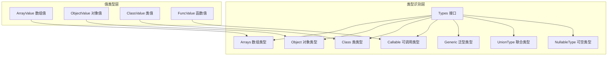
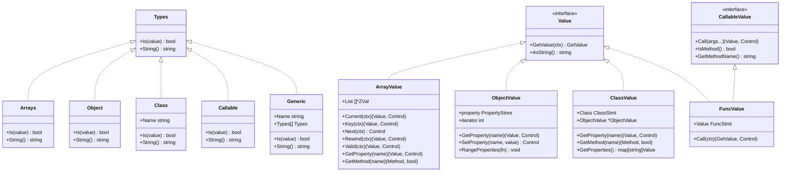
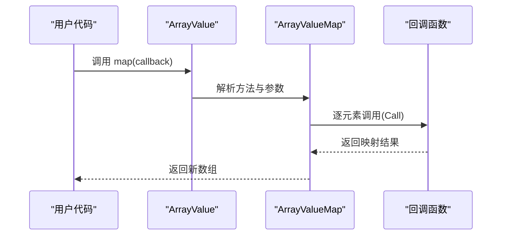
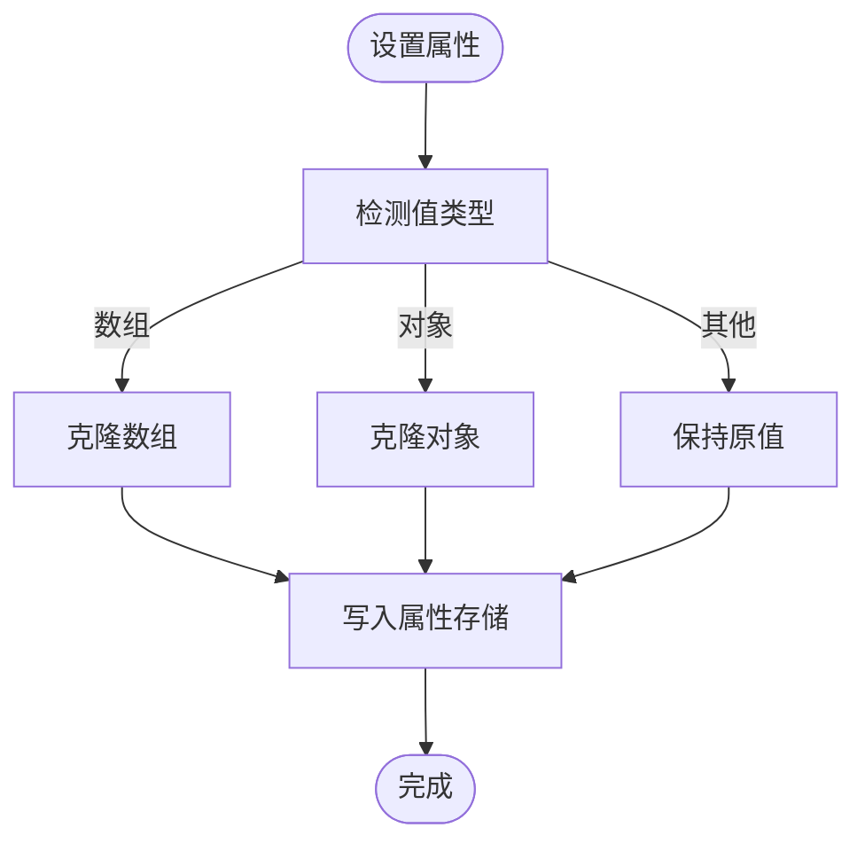
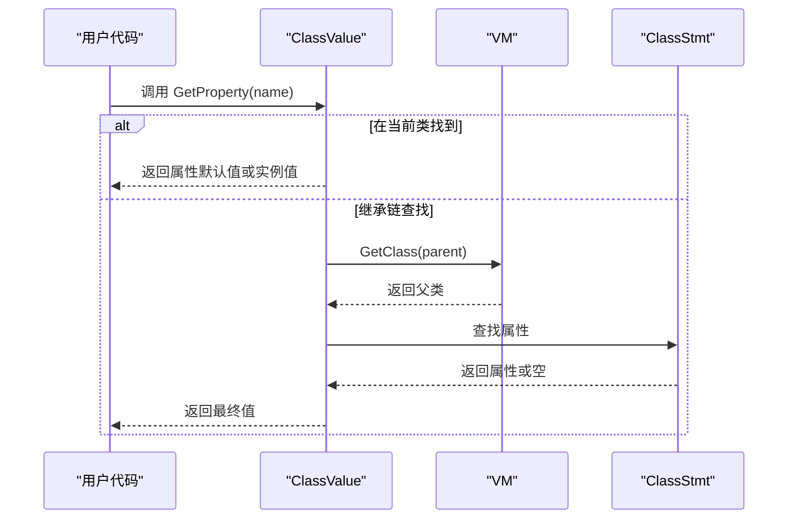
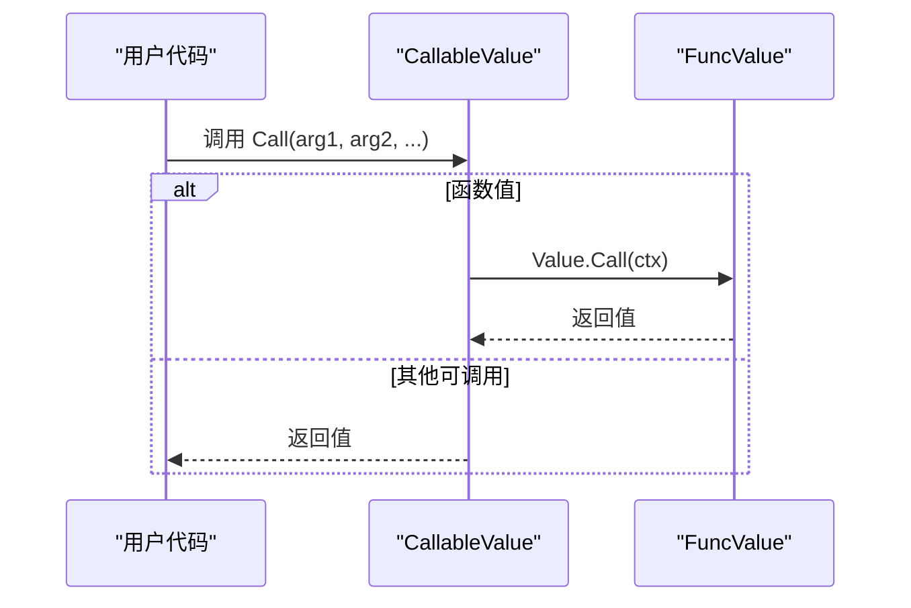
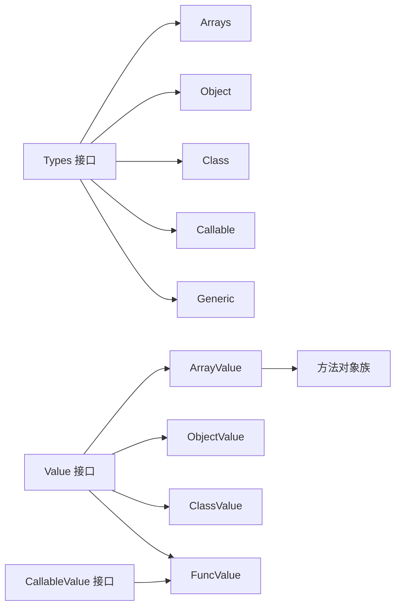

# 复合数据类型

<cite>
**本文引用的文件**
- [data/types.go](file://data/types.go)
- [data/type_array.go](file://data/type_array.go)
- [data/type_object.go](file://data/type_object.go)
- [data/type_class.go](file://data/type_class.go)
- [data/type_callable.go](file://data/type_callable.go)
- [data/type_generic.go](file://data/type_generic.go)
- [data/value.go](file://data/value.go)
- [data/value_array.go](file://data/value_array.go)
- [data/value_object.go](file://data/value_object.go)
- [data/value_class.go](file://data/value_class.go)
- [data/value_call.go](file://data/value_call.go)
- [data/value_array_push.go](file://data/value_array_push.go)
- [data/value_array_pop.go](file://data/value_array_pop.go)
- [data/value_array_map.go](file://data/value_array_map.go)
- [data/value_array_filter.go](file://data/value_array_filter.go)
- [data/value_array_reduce.go](file://data/value_array_reduce.go)
</cite>

## 目录
1. [简介](#简介)
2. [项目结构](#项目结构)
3. [核心组件](#核心组件)
4. [架构总览](#架构总览)
5. [详细组件分析](#详细组件分析)
6. [依赖分析](#依赖分析)
7. [性能考量](#性能考量)
8. [故障排查指南](#故障排查指南)
9. [结论](#结论)
10. [附录](#附录)

## 简介
本文件面向Origami语言运行时的复合数据类型，系统性阐述以下五类类型的设计原理与实现细节：
- 数组类型（Arrays）
- 对象类型（Object）
- 类类型（Class）
- 可调用类型（Callable）
- 泛型类型（Generic）

内容涵盖内部结构、嵌套支持、类型约束与访问模式；并给出数组索引机制、对象属性访问、类实例化流程、可调用对象的调用约定、泛型类型参数处理方式。同时提供复杂数据结构的创建、操作与遍历示例思路，以及类型安全性与性能优化建议。

## 项目结构
复合数据类型相关代码主要位于data目录下，围绕“类型识别接口”与“具体值类型”两条主线组织：
- 类型识别层：定义Types接口及若干具体类型（数组、对象、类、可调用、泛型、联合、可空等）
- 值类型层：实现具体值容器（ArrayValue、ObjectValue、ClassValue、FuncValue等），并提供迭代、属性访问、方法分发等能力

图表来源
- [data/types.go:5-262](file://data/types.go#L5-L262)
- [data/type_array.go:3-20](file://data/type_array.go#L3-L20)
- [data/type_object.go:3-19](file://data/type_object.go#L3-L19)
- [data/type_class.go:3-146](file://data/type_class.go#L3-L146)
- [data/type_callable.go:3-19](file://data/type_callable.go#L3-L19)
- [data/type_generic.go:6-18](file://data/type_generic.go#L6-L18)
- [data/value_array.go:32-162](file://data/value_array.go#L32-L162)
- [data/value_object.go:42-190](file://data/value_object.go#L42-L190)
- [data/value_class.go:21-295](file://data/value_class.go#L21-L295)
- [data/value_call.go:11-30](file://data/value_call.go#L11-L30)

章节来源
- [data/types.go:1-262](file://data/types.go#L1-L262)
- [data/value.go:3-39](file://data/value.go#L3-L39)

## 核心组件
- 类型识别接口与工厂
  - Types接口定义Is(value)与String()，用于类型判定与显示
  - NewBaseType根据字符串解析基础类型（int/string/bool/array/object/callable等）
  - NewNullableType与NewUnionType分别构造可空与联合类型
  - NewGenericType处理泛型名称与类型参数映射
- 值接口与可调用接口
  - Value接口统一值的取值与字符串化
  - CallableValue扩展Call(args...)、IsMethod、GetMethodName等，支撑可调用对象

章节来源
- [data/types.go:5-262](file://data/types.go#L5-L262)
- [data/value.go:3-39](file://data/value.go#L3-L39)

## 架构总览
复合数据类型的运行时架构由“类型识别”和“值容器”两部分协同构成：
- 类型识别：通过Is(value)判断值是否满足某类型约束，支持数组、对象、类、可调用、泛型、联合、可空等
- 值容器：ArrayValue/ObjectValue/ClassValue/FuncValue承载具体数据与行为，提供迭代、属性访问、方法分发、序列化等

图表来源
- [data/types.go:5-262](file://data/types.go#L5-L262)
- [data/value.go:3-39](file://data/value.go#L3-L39)
- [data/value_array.go:32-162](file://data/value_array.go#L32-L162)
- [data/value_object.go:42-190](file://data/value_object.go#L42-L190)
- [data/value_class.go:21-295](file://data/value_class.go#L21-L295)
- [data/value_call.go:11-30](file://data/value_call.go#L11-L30)

## 详细组件分析

### 数组类型（Arrays）
- 设计要点
  - 类型识别：Arrays.Is接受ArrayValue或ObjectValue（PHP关联数组在Origami中以ObjectValue表示，仍视为array）
  - 值容器：ArrayValue以ZVal切片存储元素，内置迭代器字段iterator控制遍历位置
  - 属性访问：提供length属性读取
  - 方法分发：通过GetMethod(name)返回具体方法对象（push/pop/slice/splice/join/reverse/sort/indexOf/includes/forEach/map/filter/reduce/concat/every/some/find/findIndex/flat/flatMap等）
- 内部结构与嵌套
  - ArrayValue.List为 []*ZVal，支持浅拷贝克隆（CloneArrayValue），避免共享同一底层切片导致的副作用
  - 嵌套数组/对象在赋值时采用copy-on-write策略（见对象与类章节）
- 访问模式与索引机制
  - 迭代器：Current/Key/Next/Rewind/Valid提供标准遍历
  - 索引访问：通过方法族（如indexOf/includes）与slice/splice等实现随机访问与片段操作
- 复杂数据结构示例思路
  - 创建：使用NewArrayValue传入一组Value
  - 操作：push/pop/slice/splice/join/reverse/sort/map/filter/reduce/concat/every/some/find/findIndex/flat/flatMap
  - 遍历：foreach或手动迭代器
- 性能与类型安全
  - 浅拷贝减少内存分配；按需深拷贝（数组/对象赋值时）
  - 方法调用遵循参数约定，回调函数通过上下文传递element/index/array三元组

图表来源
- [data/value_array.go:84-133](file://data/value_array.go#L84-L133)
- [data/value_array_map.go:11-61](file://data/value_array_map.go#L11-L61)

章节来源
- [data/type_array.go:3-20](file://data/type_array.go#L3-L20)
- [data/value_array.go:32-162](file://data/value_array.go#L32-L162)
- [data/value_array_push.go:7-26](file://data/value_array_push.go#L7-L26)
- [data/value_array_pop.go:7-19](file://data/value_array_pop.go#L7-L19)
- [data/value_array_map.go:5-90](file://data/value_array_map.go#L5-L90)
- [data/value_array_filter.go:5-95](file://data/value_array_filter.go#L5-L95)
- [data/value_array_reduce.go:5-133](file://data/value_array_reduce.go#L5-L133)

### 对象类型（Object）
- 设计要点
  - 类型识别：Object.Is接受ObjectValue或ClassValue
  - 值容器：ObjectValue内部使用有序属性存储（PropertyStore），保持插入顺序
  - 属性访问：GetProperty/SetProperty支持动态属性存取；length属性返回属性数量
  - 迭代：实现Iterator接口（Rewind/Valid/Current/Key/Next）
- 内部结构与嵌套
  - 属性存储：按插入顺序Range，避免Go map遍历随机性
  - 嵌套：数组/对象赋值时采用copy-on-write（CloneArrayValue/CloneObjectValue）
- 访问模式
  - 动态属性：SetProperty时对数组/对象值进行克隆，避免共享状态
  - 遍历：RangeProperties按插入顺序遍历
- 复杂数据结构示例思路
  - 创建：NewObjectValue
  - 属性设置：SetProperty(name, value)，value为数组/对象时自动克隆
  - 遍历：RangeProperties(fn)或迭代器
- 性能与类型安全
  - 有序存储避免遍历不确定性；克隆策略降低并发修改风险

图表来源
- [data/value_object.go:96-107](file://data/value_object.go#L96-L107)

章节来源
- [data/type_object.go:3-19](file://data/type_object.go#L3-L19)
- [data/value_object.go:42-190](file://data/value_object.go#L42-L190)

### 类类型（Class）
- 设计要点
  - 类型识别：Class.Is支持ClassValue/ThisValue/ThrowValue，以及特殊名称“iterable”的兼容
  - 继承与接口：支持类继承链与接口继承链的递归检查（extendISClass、interfaceExtends）
  - 值容器：ClassValue组合ObjectValue，承载实例属性与上下文；提供属性/方法查询（含父类继承）
- 实例化与访问
  - 实例化：NewClassValue(class, ctx)创建实例，内部持有ClassStmt与Context
  - 属性访问：优先类定义属性，其次父类继承属性；动态属性通过ObjectValue存储
  - 方法分发：GetMethod(name)沿继承链查找
- 复杂数据结构示例思路
  - 创建：NewClassValue(class, ctx)
  - 属性/方法：GetProperty/GetMethod，支持继承链回溯
  - 上下文：CreateContext为方法调用准备参数环境
- 性能与类型安全
  - 继承链查找使用VM缓存的类/接口信息，避免重复加载
  - 属性/方法访问遵循可见性规则（私有属性不外显）

图表来源
- [data/value_class.go:83-100](file://data/value_class.go#L83-L100)
- [data/type_class.go:67-84](file://data/type_class.go#L67-L84)

章节来源
- [data/type_class.go:3-146](file://data/type_class.go#L3-L146)
- [data/value_class.go:21-295](file://data/value_class.go#L21-L295)

### 可调用类型（Callable）
- 设计要点
  - 类型识别：Callable.Is接受FuncValue、ArrayValue、StringValue（字符串形式的可调用名）
  - 值容器：FuncValue封装FuncStmt，提供Call(ctx)执行
- 调用约定
  - CallableValue接口：Call(args...)返回值与控制流；IsMethod/GetMethodName用于方法形态识别
  - 数组可调用：ArrayValue.getMethod(name)返回具体方法对象，再由方法对象执行
- 复杂数据结构示例思路
  - 创建：FuncValue包装函数定义
  - 调用：CallableValue.Call或ArrayValue.getMethod(name).Call
- 性能与类型安全
  - 回调函数通过上下文传递element/index/array三元组，确保一致性

图表来源
- [data/type_callable.go:6-14](file://data/type_callable.go#L6-L14)
- [data/value_call.go:19-21](file://data/value_call.go#L19-L21)

章节来源
- [data/type_callable.go:3-19](file://data/type_callable.go#L3-L19)
- [data/value_call.go:11-30](file://data/value_call.go#L11-L30)

### 泛型类型（Generic）
- 设计要点
  - 类型识别：Generic.Is目前返回true（占位），字符串化输出名称
  - 参数处理：Generic.Name与Types[]保存类型参数列表
- 设计原则
  - 泛型在Origami中作为类型占位符存在，实际类型检查与替换发生在更高层（如方法签名、类型推断）
- 复杂数据结构示例思路
  - 创建：NewGenericType(name, types)生成Generic实例
  - 使用：结合NewUnionType/NewNullableType表达复杂约束
- 性能与类型安全
  - 当前实现为占位，后续完善时应引入类型参数绑定与约束校验

章节来源
- [data/type_generic.go:6-18](file://data/type_generic.go#L6-L18)
- [data/types.go:200-219](file://data/types.go#L200-L219)

## 依赖分析
- 类型识别与值容器的耦合
  - 类型识别（Types实现）与值容器（ArrayValue/ObjectValue/ClassValue/FuncValue）通过Is/GetValue接口解耦
  - 方法分发（ArrayValue.GetMethod）将调用转发至具体方法对象（如ArrayValueMap/ArrayValueFilter等）
- 继承与接口检查
  - Class.Is依赖VM中的类/接口注册信息，沿extends/implements链递归检查
- 可调用对象
  - CallableValue统一了函数与数组可调用的调用约定

图表来源
- [data/types.go:5-262](file://data/types.go#L5-L262)
- [data/value.go:3-39](file://data/value.go#L3-L39)
- [data/value_array.go:84-133](file://data/value_array.go#L84-L133)
- [data/value_class.go:111-137](file://data/value_class.go#L111-L137)
- [data/value_call.go:11-30](file://data/value_call.go#L11-L30)

章节来源
- [data/types.go:5-262](file://data/types.go#L5-L262)
- [data/value.go:3-39](file://data/value.go#L3-L39)

## 性能考量
- 浅拷贝与copy-on-write
  - ArrayValue/CloneArrayValue与ObjectValue/CloneObjectValue仅复制容器结构，避免深拷贝开销
  - 对数组/对象属性赋值时克隆，防止多处共享导致的原地修改副作用
- 迭代器与遍历
  - ArrayValue/ObjectValue内置iterator字段，遍历O(n)且无额外分配
- 方法分发
  - GetMethod(name)命中即返回具体方法对象，避免反射成本
- 类型检查
  - Class.Is通过VM缓存的类/接口信息快速判断，继承链检查使用队列与访问标记避免重复

## 故障排查指南
- 数组越界
  - 现象：迭代器越界或索引访问异常
  - 排查：确认ArrayValue.Valid与迭代器边界；使用slice/splice前检查长度
- 属性丢失或覆盖
  - 现象：对象属性在赋值后被意外修改
  - 排查：确认SetProperty路径是否触发克隆（数组/对象值）；避免共享底层结构
- 继承链查找失败
  - 现象：属性/方法在父类中不可见
  - 排查：确认类/接口已在VM中注册；检查extends/implements链是否正确
- 可调用对象错误
  - 现象：回调未按预期接收参数
  - 排查：核对CallableValue.Call的参数顺序（element/index/array）；确保上下文变量绑定正确

章节来源
- [data/value_array.go:37-61](file://data/value_array.go#L37-L61)
- [data/value_object.go:96-107](file://data/value_object.go#L96-L107)
- [data/value_class.go:83-100](file://data/value_class.go#L83-L100)
- [data/value_array_map.go:25-58](file://data/value_array_map.go#L25-L58)

## 结论
Origami的复合数据类型体系以“类型识别接口+值容器”为核心，兼顾PHP语义与Go运行时特性：
- 数组与对象提供稳定的索引/属性访问与迭代能力
- 类类型支持完整的继承与接口实现检查
- 可调用类型统一函数与数组可调用的调用约定
- 泛型类型作为占位，为后续类型系统增强预留空间

通过浅拷贝、copy-on-write与迭代器等设计，系统在类型安全与性能之间取得平衡。建议在实际工程中：
- 明确数组/对象的共享边界，必要时启用克隆
- 使用方法分发与上下文变量绑定，确保回调一致性
- 在复杂继承场景下，提前验证类/接口注册与继承链

## 附录
- 复杂数据结构示例思路（步骤化）
  - 数组
    - 创建：NewArrayValue([...])
    - 操作：push/pop/slice/splice/join/reverse/sort/map/filter/reduce/concat/every/some/find/findIndex/flat/flatMap
    - 遍历：foreach或迭代器
  - 对象
    - 创建：NewObjectValue()
    - 设置属性：SetProperty(name, value)，value为数组/对象时自动克隆
    - 遍历：RangeProperties(fn)或迭代器
  - 类
    - 实例化：NewClassValue(class, ctx)
    - 访问：GetProperty/GetMethod，支持继承链
    - 上下文：CreateContext为方法调用准备参数