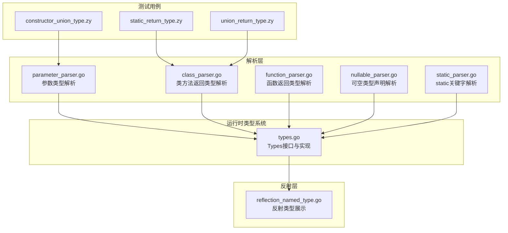
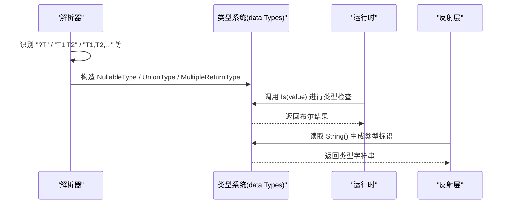
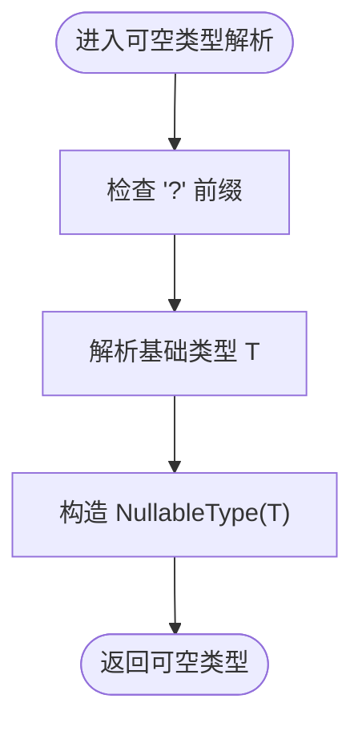
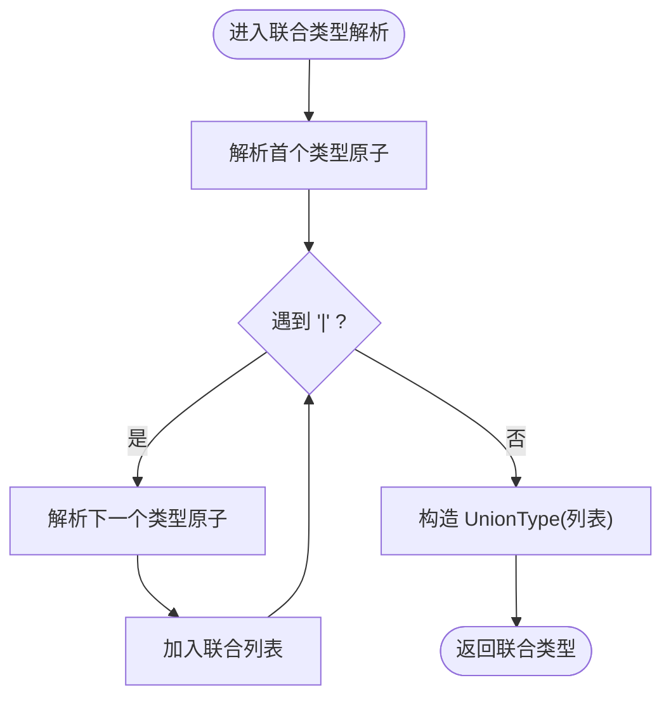
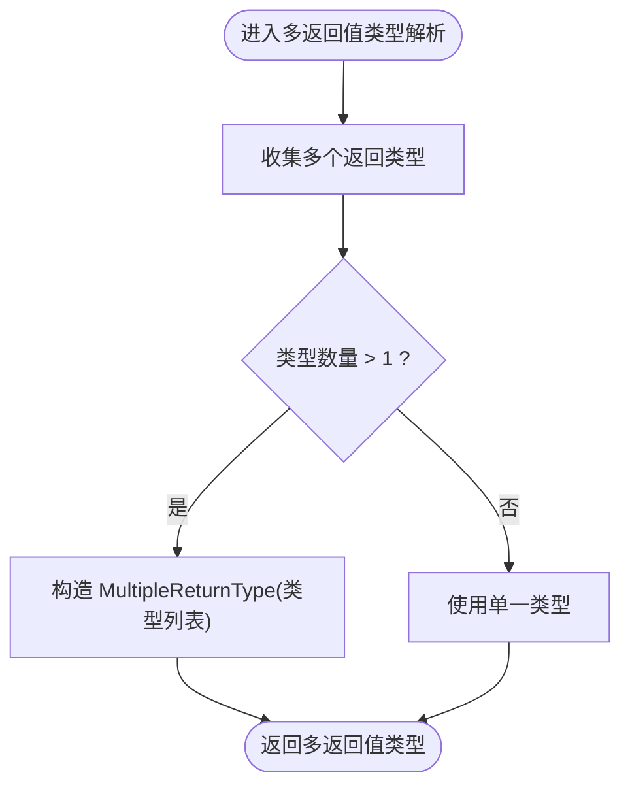
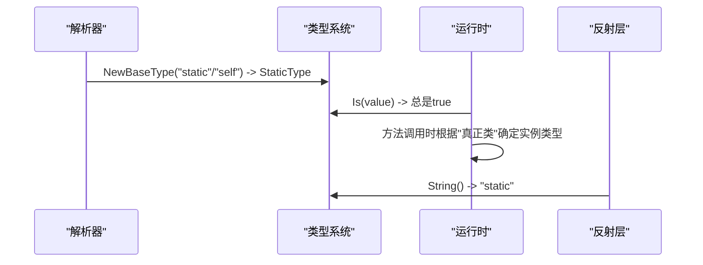
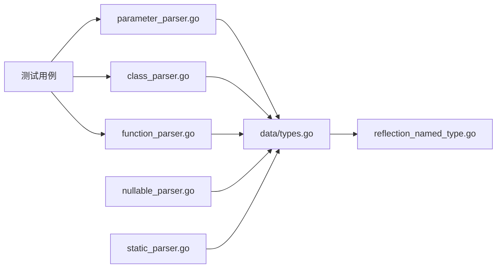

# 类型修饰符

<cite>
**本文引用的文件**
- [types.go](file://data/types.go)
- [parameter_parser.go](file://parser/parameter_parser.go)
- [class_parser.go](file://parser/class_parser.go)
- [function_parser.go](file://parser/function_parser.go)
- [nullable_parser.go](file://parser/nullable_parser.go)
- [static_parser.go](file://parser/static_parser.go)
- [reflection_named_type.go](file://std/php/reflection/reflection_named_type.go)
- [static_return_type.zy](file://tests/basic/static_return_type.zy)
- [constructor_union_type.zy](file://tests/basic/constructor_union_type.zy)
- [union_return_type.zy](file://tests/php/union_return_type.zy)
- [param-types-docs.md](file://.qwen/skills/param-types-docs.md)
</cite>

## 目录
1. [简介](#简介)
2. [项目结构](#项目结构)
3. [核心组件](#核心组件)
4. [架构总览](#架构总览)
5. [详细组件分析](#详细组件分析)
6. [依赖分析](#依赖分析)
7. [性能考虑](#性能考虑)
8. [故障排查指南](#故障排查指南)
9. [结论](#结论)
10. [附录](#附录)

## 简介
本文件聚焦Origami语言中“类型修饰符”的设计与实现，涵盖以下关键能力：
- 可空类型（NullableType）：以问号前缀“?T”表示，允许值为T或null。
- 联合类型（UnionType）：以管道符“T1|T2|...”表示，允许值属于任一成员类型。
- 多返回值类型（MultipleReturnType）：以逗号分隔的多个返回类型，表示函数返回数组，且各元素分别满足对应类型。
- 静态类型（StaticType）：以关键字“static”表示，返回调用该方法的“真正类”实例；同时支持在参数、返回值、属性提升等场景出现。

文档将系统阐述类型修饰符的解析流程、组合规则、优先级处理、类型检查算法，并提供复杂类型声明的解析过程、类型推断规则以及实际应用场景的测试用例路径。

## 项目结构
围绕类型修饰符的关键代码分布在以下模块：
- 解析层（parser）：负责词法/语法层面的类型声明解析，包括参数类型、返回类型、静态局部变量等。
- 运行时类型系统（data）：提供Types接口及具体类型实现（NullableType、UnionType、MultipleReturnType、StaticType等）。
- 反射层（std/php/reflection）：将类型信息暴露给运行时反射API，如ReflectionNamedType。
- 测试用例（tests）：覆盖静态返回类型、联合返回类型、构造函数联合类型等场景。

图表来源
- [parameter_parser.go:1-353](file://parser/parameter_parser.go#L1-L353)
- [class_parser.go:626-944](file://parser/class_parser.go#L626-L944)
- [function_parser.go:275-321](file://parser/function_parser.go#L275-L321)
- [nullable_parser.go:1-57](file://parser/nullable_parser.go#L1-L57)
- [static_parser.go:1-349](file://parser/static_parser.go#L1-L349)
- [types.go:1-262](file://data/types.go#L1-L262)
- [reflection_named_type.go:75-92](file://std/php/reflection/reflection_named_type.go#L75-L92)
- [static_return_type.zy:1-86](file://tests/basic/static_return_type.zy#L1-L86)
- [constructor_union_type.zy:1-21](file://tests/basic/constructor_union_type.zy#L1-L21)
- [union_return_type.zy:1-25](file://tests/php/union_return_type.zy#L1-L25)

章节来源
- [parameter_parser.go:1-353](file://parser/parameter_parser.go#L1-L353)
- [class_parser.go:626-944](file://parser/class_parser.go#L626-L944)
- [function_parser.go:275-321](file://parser/function_parser.go#L275-L321)
- [nullable_parser.go:1-57](file://parser/nullable_parser.go#L1-L57)
- [static_parser.go:1-349](file://parser/static_parser.go#L1-L349)
- [types.go:1-262](file://data/types.go#L1-L262)
- [reflection_named_type.go:75-92](file://std/php/reflection/reflection_named_type.go#L75-L92)
- [static_return_type.zy:1-86](file://tests/basic/static_return_type.zy#L1-L86)
- [constructor_union_type.zy:1-21](file://tests/basic/constructor_union_type.zy#L1-L21)
- [union_return_type.zy:1-25](file://tests/php/union_return_type.zy#L1-L25)

## 核心组件
- Types接口：统一的类型抽象，提供Is(value)判定与String()标识。
- NullableType：包装基础类型，允许null值。
- UnionType：由多个类型组成的联合集合，任一满足即通过。
- MultipleReturnType：多返回值类型，要求返回值为数组，且各元素分别满足对应类型。
- StaticType：静态类型，返回“真正类”实例；在NewBaseType中映射为static/self。
- NewBaseType：字符串到类型的工厂，支持联合（|）、可空（?）、基础类型、类名、static/self等。

章节来源
- [types.go:5-198](file://data/types.go#L5-L198)
- [types.go:142-188](file://data/types.go#L142-L188)

## 架构总览
类型修饰符的端到端流程分为“解析阶段”和“运行时检查阶段”：
- 解析阶段：解析器根据语法规则识别“?T”、“T1|T2”、“T1,T2,...”等模式，构造data.Types对象。
- 运行时检查阶段：Types.Is(value)对值进行类型判定；反射层将类型信息暴露给运行时API。

图表来源
- [parameter_parser.go:231-293](file://parser/parameter_parser.go#L231-L293)
- [class_parser.go:905-936](file://parser/class_parser.go#L905-L936)
- [function_parser.go:285-316](file://parser/function_parser.go#L285-L316)
- [types.go:34-198](file://data/types.go#L34-L198)
- [reflection_named_type.go:75-92](file://std/php/reflection/reflection_named_type.go#L75-L92)

## 详细组件分析

### 可空类型（NullableType）
- 语法支持
  - 参数类型：?string、?int、?User等。
  - 静态局部变量：static ?int $count。
  - 返回类型：在返回类型解析中支持可空。
- 解析流程
  - 参数解析：在parseConstructorParameterType中识别“?”前缀，构造可空类型。
  - 静态变量解析：在static_parser.go中识别“?T”并构造可空类型。
  - 反射展示：ReflectionNamedType::getName()返回基础类型名，allowsNull()为true。
- 类型检查
  - Is(value)：若value为null则通过；否则委托BaseType.Is(value)。

图表来源
- [parameter_parser.go:273-290](file://parser/parameter_parser.go#L273-L290)
- [static_parser.go:306-312](file://parser/static_parser.go#L306-L312)
- [types.go:34-49](file://data/types.go#L34-L49)
- [reflection_named_type.go:75-86](file://std/php/reflection/reflection_named_type.go#L75-L86)

章节来源
- [parameter_parser.go:273-290](file://parser/parameter_parser.go#L273-L290)
- [static_parser.go:306-312](file://parser/static_parser.go#L306-L312)
- [nullable_parser.go:24-57](file://parser/nullable_parser.go#L24-L57)
- [types.go:34-49](file://data/types.go#L34-L49)
- [reflection_named_type.go:75-92](file://std/php/reflection/reflection_named_type.go#L75-L92)

### 联合类型（UnionType）
- 语法支持
  - 参数类型：string|int|null、string|int|bool等。
  - 返回类型：int|string、array|string|false等。
  - 接口返回类型：支持联合返回类型解析。
- 解析流程
  - 参数解析：parseConstructorParameterType中循环解析“|”分隔的类型原子，最终构造UnionType。
  - 返回类型解析：class_parser.go与function_parser.go中类似逻辑，支持可空与联合组合。
  - 字符串工厂：NewBaseType在遇到“|”时拆分并构造联合类型。
- 类型检查
  - Is(value)：对每个成员类型逐一调用Is，任一为真即通过。

图表来源
- [parameter_parser.go:232-273](file://parser/parameter_parser.go#L232-L273)
- [class_parser.go:888-903](file://parser/class_parser.go#L888-L903)
- [function_parser.go:275-283](file://parser/function_parser.go#L275-L283)
- [types.go:174-187](file://data/types.go#L174-L187)

章节来源
- [parameter_parser.go:232-273](file://parser/parameter_parser.go#L232-L273)
- [class_parser.go:888-903](file://parser/class_parser.go#L888-L903)
- [function_parser.go:275-283](file://parser/function_parser.go#L275-L283)
- [types.go:83-106](file://data/types.go#L83-L106)

### 多返回值类型（MultipleReturnType）
- 语法支持
  - 返回类型中使用逗号分隔多个类型，如：int,string,bool。
- 解析流程
  - 返回类型解析：在class_parser.go与function_parser.go中，当存在多个返回类型时，构造MultipleReturnType。
- 类型检查
  - Is(value)：若value为数组且长度等于类型数量，且每个元素依次满足对应类型，则通过。

图表来源
- [class_parser.go:918-936](file://parser/class_parser.go#L918-L936)
- [function_parser.go:298-316](file://parser/function_parser.go#L298-L316)
- [types.go:51-81](file://data/types.go#L51-L81)

章节来源
- [class_parser.go:918-936](file://parser/class_parser.go#L918-L936)
- [function_parser.go:298-316](file://parser/function_parser.go#L298-L316)
- [types.go:51-81](file://data/types.go#L51-L81)

### 静态类型（StaticType）
- 语法支持
  - 返回类型：static、?static、static|string等。
  - 参数/属性提升：支持static作为类型或可空static。
- 解析与行为
  - NewBaseType中将"static"/"self"映射为StaticType。
  - StaticType.Is(value)总是返回true，实际类型约束在方法调用时由运行时上下文决定。
  - 反射层：ReflectionNamedType::getName()返回"static"，allowsNull()为false。
- 测试场景
  - 基本static返回类型、可空static、联合类型中的static等。

图表来源
- [types.go:165-170](file://data/types.go#L165-L170)
- [types.go:221-232](file://data/types.go#L221-L232)
- [reflection_named_type.go:75-92](file://std/php/reflection/reflection_named_type.go#L75-L92)
- [static_return_type.zy:7-82](file://tests/basic/static_return_type.zy#L7-L82)

章节来源
- [types.go:165-170](file://data/types.go#L165-L170)
- [types.go:221-232](file://data/types.go#L221-L232)
- [reflection_named_type.go:75-92](file://std/php/reflection/reflection_named_type.go#L75-L92)
- [static_return_type.zy:7-82](file://tests/basic/static_return_type.zy#L7-L82)

### 类型修饰符的组合规则与优先级
- 组合规则
  - 可空与联合：可空修饰符“?”作用于整个联合类型，如“?int|string”等价于“?(int|string)”。
  - 多返回值与联合：int|string,bool表示返回数组，元素分别为int|string与bool。
- 优先级处理
  - “|”优先级低于“,”（逗号分隔多返回值）。
  - “?”修饰最近的基础类型或联合类型。
- 工厂函数NewBaseType
  - 遇到“|”时拆分为多个类型并构造UnionType。
  - 遇到“?”时构造NullableType包裹基础类型。

章节来源
- [parameter_parser.go:273-290](file://parser/parameter_parser.go#L273-L290)
- [class_parser.go:905-916](file://parser/class_parser.go#L905-L916)
- [function_parser.go:285-296](file://parser/function_parser.go#L285-L296)
- [types.go:174-187](file://data/types.go#L174-L187)

### 类型检查算法
- 可空类型：若值为null则通过；否则委托基础类型检查。
- 联合类型：顺序遍历各成员类型，任一满足即通过。
- 多返回值类型：数组长度需一致，且逐元素满足对应类型。
- 静态类型：Is恒为true，实际约束在调用时生效。

章节来源
- [types.go:39-44](file://data/types.go#L39-L44)
- [types.go:88-94](file://data/types.go#L88-L94)
- [types.go:56-69](file://data/types.go#L56-L69)
- [types.go:225-228](file://data/types.go#L225-L228)

### 复杂类型声明的解析过程
- 参数类型解析（联合+可空）
  - 识别“?T”或“T1|T2”片段，构造[]Types后合并为UnionType或NullableType。
- 返回类型解析（多返回值+联合+可空）
  - 收集多个类型（逗号分隔），若>1则构造MultipleReturnType；若存在“?”则包裹整体。
- 反射展示
  - 可空类型：getName()返回基础类型，allowsNull()为true。
  - 联合类型：String()拼接“|”。
  - 多返回值类型：String()拼接“,”。
  - 静态类型：String()返回"static"。

章节来源
- [parameter_parser.go:161-168](file://parser/parameter_parser.go#L161-L168)
- [class_parser.go:905-936](file://parser/class_parser.go#L905-L936)
- [function_parser.go:285-316](file://parser/function_parser.go#L285-L316)
- [reflection_named_type.go:75-92](file://std/php/reflection/reflection_named_type.go#L75-L92)

### 类型推断规则
- 变量赋值时的类型推断：在某些节点中，右侧表达式的类型可用于推断左侧变量类型（辅助场景）。
- 参数类型回退：若解析到的varType非空，则回退构造基础类型，保证反射可用。

章节来源
- [parameter_parser.go:161-168](file://parser/parameter_parser.go#L161-L168)

### 实际应用场景与测试用例
- 静态返回类型
  - 基本static返回、可空static、联合类型中的static。
  - 路径参考：[static_return_type.zy:1-86](file://tests/basic/static_return_type.zy#L1-L86)
- 构造函数联合类型
  - 私有/公共参数的联合类型与可空类型。
  - 路径参考：[constructor_union_type.zy:1-21](file://tests/basic/constructor_union_type.zy#L1-L21)
- 接口返回类型联合
  - 验证接口方法返回值联合类型解析。
  - 路径参考：[union_return_type.zy:1-25](file://tests/php/union_return_type.zy#L1-L25)

章节来源
- [static_return_type.zy:1-86](file://tests/basic/static_return_type.zy#L1-L86)
- [constructor_union_type.zy:1-21](file://tests/basic/constructor_union_type.zy#L1-L21)
- [union_return_type.zy:1-25](file://tests/php/union_return_type.zy#L1-L25)

## 依赖分析
- 解析器依赖类型系统：参数/返回类型解析均依赖data.NewBaseType、NewUnionType、NewNullableType、NewMultipleReturnType。
- 类型系统依赖反射：反射层通过Types.String()与具体类型实现交互。
- 测试用例驱动：通过测试用例验证解析与运行时行为的一致性。

图表来源
- [parameter_parser.go:1-353](file://parser/parameter_parser.go#L1-L353)
- [class_parser.go:626-944](file://parser/class_parser.go#L626-L944)
- [function_parser.go:275-321](file://parser/function_parser.go#L275-L321)
- [nullable_parser.go:1-57](file://parser/nullable_parser.go#L1-L57)
- [static_parser.go:1-349](file://parser/static_parser.go#L1-L349)
- [types.go:1-262](file://data/types.go#L1-L262)
- [reflection_named_type.go:75-92](file://std/php/reflection/reflection_named_type.go#L75-L92)

章节来源
- [parameter_parser.go:1-353](file://parser/parameter_parser.go#L1-L353)
- [class_parser.go:626-944](file://parser/class_parser.go#L626-L944)
- [function_parser.go:275-321](file://parser/function_parser.go#L275-L321)
- [nullable_parser.go:1-57](file://parser/nullable_parser.go#L1-L57)
- [static_parser.go:1-349](file://parser/static_parser.go#L1-L349)
- [types.go:1-262](file://data/types.go#L1-L262)
- [reflection_named_type.go:75-92](file://std/php/reflection/reflection_named_type.go#L75-L92)

## 性能考虑
- 类型检查复杂度
  - 联合类型：O(k)，k为成员数量。
  - 多返回值类型：O(k)，k为返回类型数量；额外数组长度检查O(1)。
  - 可空类型：O(1)检查null，随后委托基础类型。
- 工厂函数NewBaseType
  - 字符串拆分与构造：对“|”和“?”的处理为线性时间。
- 建议
  - 控制联合类型成员数量，避免过长链导致检查开销增大。
  - 对频繁调用的方法，尽量减少不必要的可空/联合类型嵌套。

## 故障排查指南
- 常见错误
  - 参数缺少变量名：解析阶段报错。
  - static后缺少function/fn/变量：static解析器报错。
  - 返回类型逗号分隔错误：返回类型解析器报错。
- 定位方法
  - 检查参数/返回类型解析位置（parameter_parser.go、class_parser.go、function_parser.go）。
  - 检查可空/联合/多返回值构造位置（types.go）。
  - 使用测试用例定位问题范围（static_return_type.zy、constructor_union_type.zy、union_return_type.zy）。

章节来源
- [parameter_parser.go:148-150](file://parser/parameter_parser.go#L148-L150)
- [static_parser.go:104-106](file://parser/static_parser.go#L104-L106)
- [class_parser.go:924-926](file://parser/class_parser.go#L924-L926)
- [types.go:39-44](file://data/types.go#L39-L44)
- [types.go:88-94](file://data/types.go#L88-L94)
- [types.go:56-69](file://data/types.go#L56-L69)

## 结论
Origami对类型修饰符提供了完善的解析与运行时支持：
- 可空类型、联合类型、多返回值类型、静态类型在语法与运行时层面协同工作。
- 解析器遵循明确的组合规则与优先级，类型系统提供清晰的类型检查算法。
- 通过丰富的测试用例覆盖了典型与复杂场景，便于开发者理解与扩展。

## 附录
- 相关技能文档：参数类型与data.Types约束说明，涵盖语法解析与运行时类型系统要点。
- 参考路径：[param-types-docs.md:1-75](file://.qwen/skills/param-types-docs.md#L1-L75)