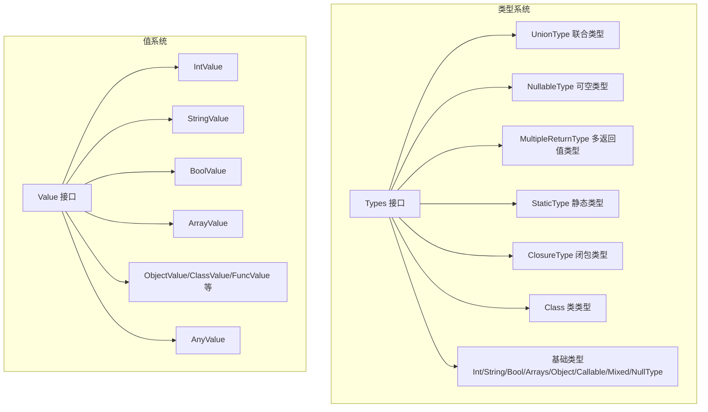
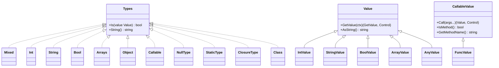
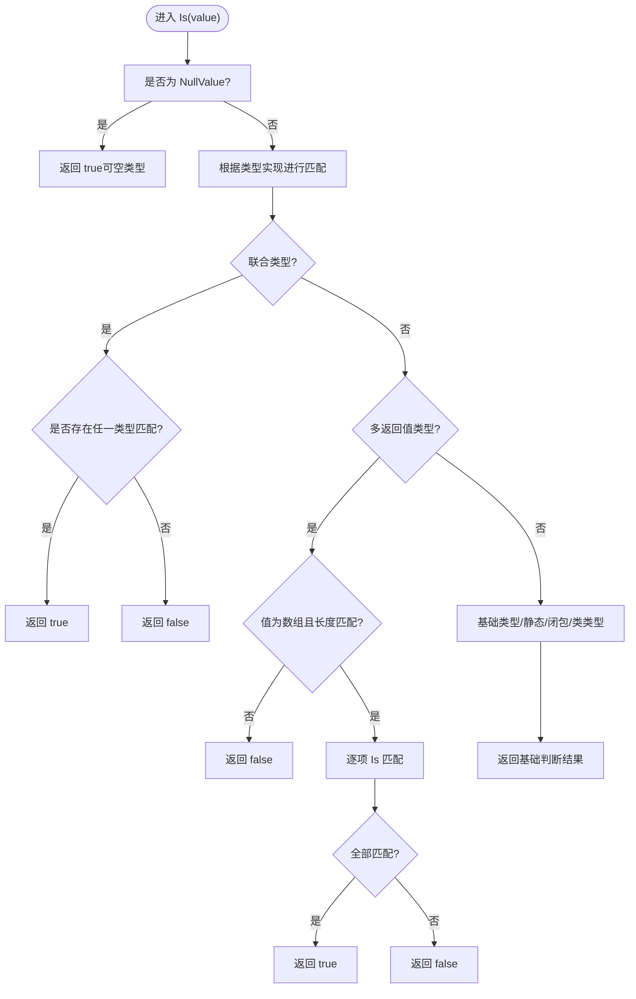
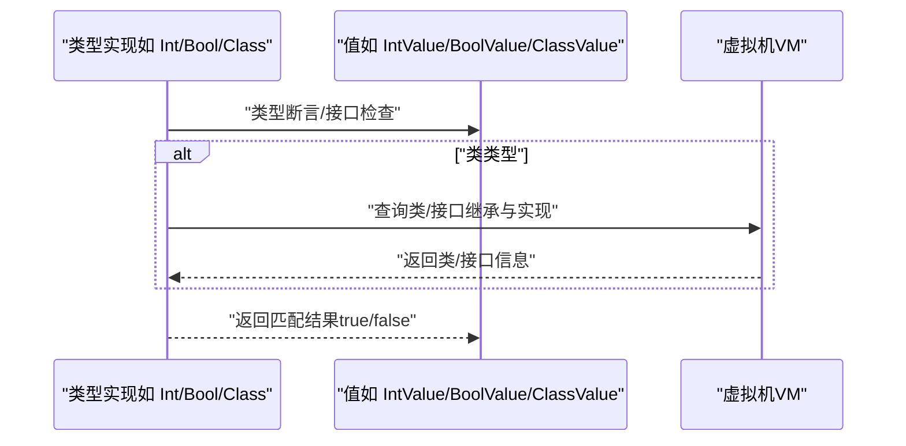
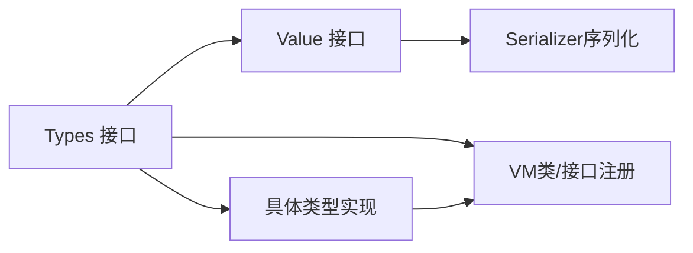

# 类型检查系统

<cite>
**本文引用的文件**
- [types.go](file://data/types.go)
- [value.go](file://data/value.go)
- [type_mixed.go](file://data/type_mixed.go)
- [type_int.go](file://data/type_int.go)
- [type_string.go](file://data/type_string.go)
- [type_bool.go](file://data/type_bool.go)
- [type_array.go](file://data/type_array.go)
- [type_object.go](file://data/type_object.go)
- [type_callable.go](file://data/type_callable.go)
- [type_class.go](file://data/type_class.go)
- [value_any.go](file://data/value_any.go)
- [value_int.go](file://data/value_int.go)
- [value_string.go](file://data/value_string.go)
- [value_bool.go](file://data/value_bool.go)
- [value_array.go](file://data/value_array.go)
</cite>

## 目录
1. [简介](#简介)
2. [项目结构](#项目结构)
3. [核心组件](#核心组件)
4. [架构总览](#架构总览)
5. [详细组件分析](#详细组件分析)
6. [依赖分析](#依赖分析)
7. [性能考虑](#性能考虑)
8. [故障排查指南](#故障排查指南)
9. [结论](#结论)
10. [附录](#附录)

## 简介
本文件系统性阐述 Origami 的类型检查系统，重点围绕类型接口（Types interface）与值接口（Value interface）的设计与实现，覆盖以下主题：
- Types 接口的职责与行为：Is 方法的类型判断逻辑、String 方法的类型描述生成。
- 类型匹配算法：基础类型、联合类型、可空类型、多返回值类型、静态类型、闭包类型、类类型等。
- 值包装器与类型系统的关系：类型标识、值存储、类型转换的协调机制。
- 性能优化与缓存策略：浅拷贝数组、延迟接口加载、避免重复计算。
- 错误处理机制：类型不匹配、接口未加载、异常传播。
- 编译时与运行时的应用场景：类型推断、参数校验、返回值约束、泛型展开。
- 扩展方法：自定义类型检查与新类型实现。

## 项目结构
类型检查系统主要位于 data 包中，由两类核心接口构成：
- Types 接口：抽象类型集合，提供 Is 判断与 String 描述。
- Value 接口：抽象值集合，提供 GetValue 与 AsString 等能力，并派生出可调用值、属性访问、方法访问等子接口。

图表来源
- [types.go:5-262](file://data/types.go#L5-L262)
- [value.go:3-39](file://data/value.go#L3-L39)

章节来源
- [types.go:1-262](file://data/types.go#L1-L262)
- [value.go:1-39](file://data/value.go#L1-L39)

## 核心组件
- Types 接口
  - Is(value Value) bool：对给定值执行类型判断，返回布尔结果。
  - String() string：生成类型的人类可读描述，用于日志、诊断与 LSP。
- 值接口 Value
  - GetValue：返回可进一步查询的 GetValue 对象。
  - AsString：将值转为字符串。
  - 可调用值 CallableValue：扩展 Call、IsMethod、GetMethodName。
  - 属性与方法访问：SetProperty、GetProperty、GetPropertyZVal、GetMethod。
- 基础类型实现
  - Mixed、Int、String、Bool、Arrays、Object、Callable、NullType、StaticType、ClosureType、Class 等。
- 组合类型
  - UnionType：多类型取或。
  - NullableType：可空包装。
  - MultipleReturnType：多返回值元组式匹配。
- 工具函数
  - NewBaseType、NewNullableType、NewUnionType、NewMultipleReturnType、NewGenericType。
  - ISBaseType：判断是否为基础类型标识符。

章节来源
- [types.go:5-262](file://data/types.go#L5-L262)
- [value.go:3-39](file://data/value.go#L3-L39)
- [type_mixed.go:1-12](file://data/type_mixed.go#L1-L12)
- [type_int.go:1-17](file://data/type_int.go#L1-L17)
- [type_string.go:1-17](file://data/type_string.go#L1-L17)
- [type_bool.go:1-22](file://data/type_bool.go#L1-L22)
- [type_array.go:1-20](file://data/type_array.go#L1-L20)
- [type_object.go:1-19](file://data/type_object.go#L1-L19)
- [type_callable.go:1-19](file://data/type_callable.go#L1-L19)
- [type_class.go:1-146](file://data/type_class.go#L1-L146)

## 架构总览
类型系统采用“接口 + 结构体”的组合模式，Types 作为类型抽象，具体类型通过 Is 实现差异化判断；Value 作为运行时值容器，承载真实数据并暴露统一的访问与转换接口。类型与值之间通过 Is 与 AsXxx 协作，形成“类型描述 + 值语义”的双层模型。

图表来源
- [types.go:5-262](file://data/types.go#L5-L262)
- [value.go:3-39](file://data/value.go#L3-L39)
- [value_int.go:1-52](file://data/value_int.go#L1-L52)
- [value_string.go:1-86](file://data/value_string.go#L1-L86)
- [value_bool.go:1-47](file://data/value_bool.go#L1-L47)
- [value_array.go:1-162](file://data/value_array.go#L1-L162)
- [value_any.go:1-34](file://data/value_any.go#L1-L34)

## 详细组件分析

### Types 接口与类型匹配算法
- 设计理念
  - 将“类型”抽象为可组合的判断单元，支持基础类型、联合类型、可空类型、多返回值类型、静态类型、闭包类型与类类型。
  - String 提供类型描述，便于调试与 LSP 显示。
- 关键算法
  - 基础类型映射：NewBaseType 根据字符串标识选择具体类型实现，支持联合类型拆分与可空类型包装。
  - 联合类型：UnionType.Is 遍历候选类型，任一匹配即成功。
  - 可空类型：NullableType.Is 先判定 NullValue，否则委托基础类型。
  - 多返回值：MultipleReturnType.Is 要求值为数组且长度相等，逐项匹配。
  - 静态类型：StaticType.Is 直接返回真，实际约束在方法调用时生效。
  - 闭包类型：ClosureType.Is 支持函数值、数组值与字符串值。
  - 类类型：Class.Is 支持 ClassValue、ThisValue、ArrayValue（当目标为 iterable）、ThrowValue；通过 extendISClass 与 interfaceExtends 完成继承与接口实现判断。
- 类型描述生成
  - String 用于生成类型描述，联合类型以“|”连接，可空类型以“?”前缀，静态类型输出“static”，闭包类型输出“closure”，类类型输出类名。

图表来源
- [types.go:39-106](file://data/types.go#L39-L106)
- [types.go:225-244](file://data/types.go#L225-L244)
- [types.go:6-106](file://data/types.go#L6-L106)

章节来源
- [types.go:5-262](file://data/types.go#L5-L262)

### 值接口与类型系统的关系
- 值接口 Value
  - GetValue：返回可进一步查询的对象（如迭代器、属性访问器等）。
  - AsString：统一字符串化。
  - CallableValue：扩展调用能力与方法标识。
  - 属性与方法访问：SetProperty、GetProperty、GetPropertyZVal、GetMethod。
- 值与类型的协作
  - 类型判断通过 Is(value) 完成，不同类型对 value 的类型断言不同（如 Int.Is 断言 IntValue，Bool.Is 支持 AsBool 接口）。
  - 类类型 Class.Is 在运行时结合 VM 查询类/接口的继承与实现关系，确保类型判断准确。
- 值包装器示例
  - IntValue/BoolValue/StringValue/ArrayValue 提供 AsInt/AsFloat/AsBool/AsArray 等转换能力，支撑类型系统在运行时的语义一致性。
  - AnyValue 作为通用包装，便于桥接 Go 值与 Origami 值系统。

图表来源
- [types.go:7-61](file://data/types.go#L7-L61)
- [type_class.go:67-84](file://data/type_class.go#L67-L84)
- [type_class.go:88-145](file://data/type_class.go#L88-L145)

章节来源
- [value.go:3-39](file://data/value.go#L3-L39)
- [value_int.go:1-52](file://data/value_int.go#L1-L52)
- [value_string.go:1-86](file://data/value_string.go#L1-L86)
- [value_bool.go:1-47](file://data/value_bool.go#L1-L47)
- [value_array.go:1-162](file://data/value_array.go#L1-L162)
- [value_any.go:1-34](file://data/value_any.go#L1-L34)

### 基础类型实现要点
- Mixed：始终匹配，用于“任意类型”占位。
- Int/String/Bool/Arrays/Object/Callable：通过类型断言或接口检查实现 Is。
- NullType：仅匹配 NullValue。
- StaticType/ClosureType：静态类型与闭包类型在 Is 中给出宽松规则，实际约束在调用点生效。
- Class：复杂继承与接口实现判断，使用 BFS 队列遍历接口 extends 链与类继承链。

章节来源
- [type_mixed.go:1-12](file://data/type_mixed.go#L1-L12)
- [type_int.go:1-17](file://data/type_int.go#L1-L17)
- [type_string.go:1-17](file://data/type_string.go#L1-L17)
- [type_bool.go:1-22](file://data/type_bool.go#L1-L22)
- [type_array.go:1-20](file://data/type_array.go#L1-L20)
- [type_object.go:1-19](file://data/type_object.go#L1-L19)
- [type_callable.go:1-19](file://data/type_callable.go#L1-L19)
- [type_class.go:1-146](file://data/type_class.go#L1-L146)

### 组合类型与工厂函数
- NewBaseType：解析字符串类型标识，支持联合类型拆分与可空类型包装。
- NewNullableType/NewUnionType/NewMultipleReturnType/NewGenericType：构建组合类型实例。
- LspTypes：多候选类型，仅 LSP 使用，Is 固定返回真，String 返回标识。

章节来源
- [types.go:112-219](file://data/types.go#L112-L219)
- [types.go:190-198](file://data/types.go#L190-L198)

## 依赖分析
- Types 与 Value 的耦合
  - Types 的 Is 依赖 Value 的具体类型断言或接口实现（如 AsBool、AsInt、AsFloat）。
  - 类类型 Class.Is 依赖 VM 的类/接口注册与加载能力。
- 组合类型的内聚
  - UnionType/NullableType/MultipleReturnType 内部持有 Types 列表，体现高内聚低耦合。
- 外部依赖
  - VM：用于类/接口的加载与继承链查询。
  - Serializer：用于值的序列化/反序列化，间接影响类型系统的 I/O 场景。

图表来源
- [types.go:5-262](file://data/types.go#L5-L262)
- [type_class.go:88-145](file://data/type_class.go#L88-L145)
- [value_array.go:143-149](file://data/value_array.go#L143-L149)

章节来源
- [types.go:5-262](file://data/types.go#L5-L262)
- [type_class.go:1-146](file://data/type_class.go#L1-L146)
- [value_array.go:1-162](file://data/value_array.go#L1-L162)

## 性能考虑
- 数组浅拷贝
  - CloneArrayValue 仅复制切片指针，避免重复分配 ZVal，降低内存与时间开销。
- 延迟接口加载
  - interfaceExtends 在找不到接口时尝试从 VM 加载，避免提前全量加载。
- 避免重复计算
  - 类型描述通过 String 生成，建议在需要频繁输出时缓存描述字符串。
- 类型判断短路
  - 联合类型与多返回值类型优先进行长度/数量检查，尽早失败。
- 运行时约束
  - StaticType/ClosureType 的宽松 Is 规则减少误判，实际约束在调用点执行，降低全局检查成本。

章节来源
- [value_array.go:17-30](file://data/value_array.go#L17-L30)
- [type_class.go:88-145](file://data/type_class.go#L88-L145)
- [types.go:88-106](file://data/types.go#L88-L106)

## 故障排查指南
- 类型不匹配
  - 症状：Is 返回 false 或运行时报错。
  - 排查：确认值类型与期望类型是否一致；对于联合类型，检查候选顺序；对于可空类型，确认是否传入了 NullValue。
- 接口未加载
  - 症状：Class.Is 无法识别接口实现。
  - 排查：确认 VM 中接口是否已注册；interfaceExtends 会在缺失时尝试加载，若仍失败，检查命名空间与路径。
- 运行时异常传播
  - 症状：类型判断过程中抛出异常。
  - 排查：定位到具体类型实现（如 Class.Is、ArrayValue.GetMethod 等），检查调用链与上下文控制对象（Control）。
- 序列化问题
  - 症状：值序列化/反序列化失败。
  - 排查：确认 Serializer 实现与值类型匹配；检查 Marshal/Unmarshal 的字节流格式。

章节来源
- [type_class.go:88-145](file://data/type_class.go#L88-L145)
- [value_array.go:135-141](file://data/value_array.go#L135-L141)

## 结论
Origami 的类型检查系统通过 Types 与 Value 的清晰分离，实现了强类型描述与灵活值语义的统一。其组合类型设计支持复杂类型表达，类类型判断结合 VM 提供了动态约束能力。配合浅拷贝、延迟加载与短路判断等优化策略，系统在性能与可维护性之间取得良好平衡。扩展方面，可通过新增类型实现与工厂函数快速接入新的类型语义。

## 附录
- 编译时与运行时应用
  - 编译时：类型推断、联合类型拆分、可空类型包装、泛型展开。
  - 运行时：参数类型校验、返回值类型约束、方法调用点的静态类型与闭包类型判断。
- 自定义类型检查扩展
  - 新增类型实现：实现 Types 接口，提供 Is 与 String。
  - 注册工厂：在 NewBaseType/工厂函数中加入新类型分支。
  - 值适配：为新类型提供对应的 Value 实现，确保 AsXxx 转换与序列化支持。