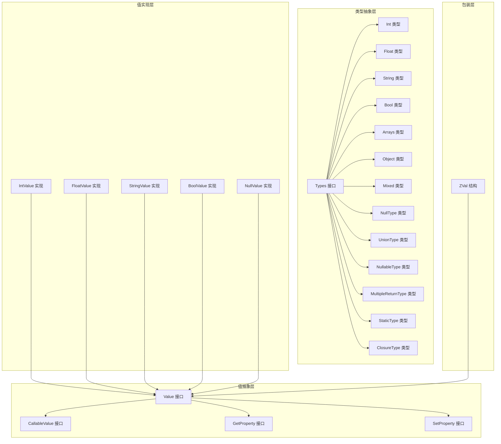
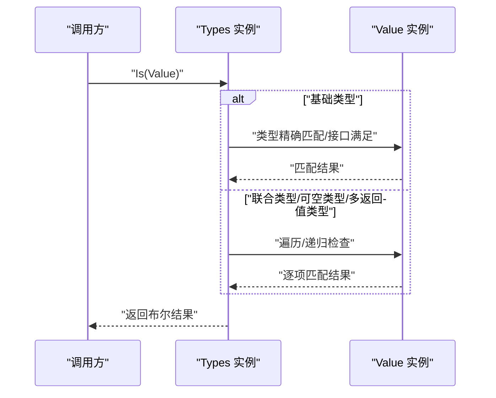
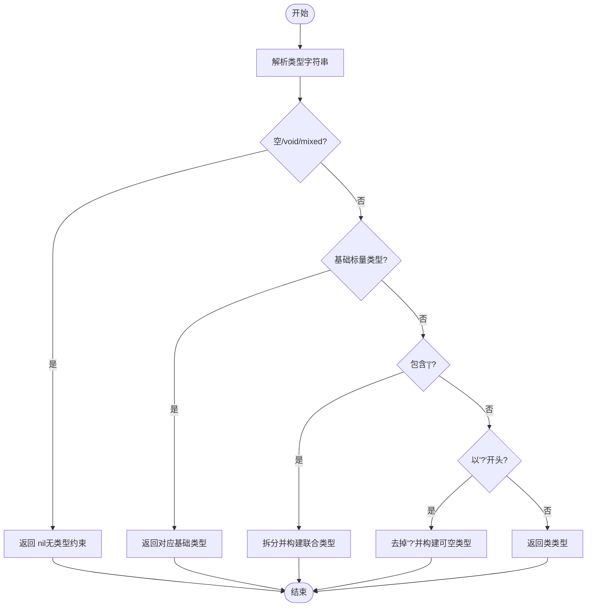
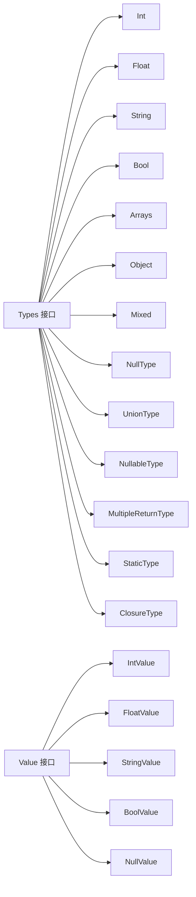

# 类型系统

<cite>
**本文引用的文件**
- [data/zval.go](file://data/zval.go)
- [data/value.go](file://data/value.go)
- [data/types.go](file://data/types.go)
- [data/type_int.go](file://data/type_int.go)
- [data/type_string.go](file://data/type_string.go)
- [data/type_bool.go](file://data/type_bool.go)
- [data/type_floath.go](file://data/type_floath.go)
- [data/type_array.go](file://data/type_array.go)
- [data/type_object.go](file://data/type_object.go)
- [data/type_mixed.go](file://data/type_mixed.go)
- [data/value_int.go](file://data/value_int.go)
- [data/value_string.go](file://data/value_string.go)
- [data/value_bool.go](file://data/value_bool.go)
- [data/value_float.go](file://data/value_float.go)
- [data/value_null.go](file://data/value_null.go)
</cite>

## 目录
1. [引言](#引言)
2. [项目结构](#项目结构)
3. [核心组件](#核心组件)
4. [架构总览](#架构总览)
5. [详细组件分析](#详细组件分析)
6. [依赖分析](#依赖分析)
7. [性能考量](#性能考量)
8. [故障排查指南](#故障排查指南)
9. [结论](#结论)
10. [附录](#附录)

## 引言
本文件系统性阐述 Origami 类型系统的设计与实现，重点围绕 ZVal 值包装器、类型标识、值存储与类型转换机制展开。文档覆盖标量类型（整数、浮点数、字符串、布尔值）、复合类型（数组、对象）以及特殊类型（null、mixed），并深入解析 Type 接口、Value 接口及各类具体类型的实现。同时给出类型检查、类型转换与类型推断的实现细节、使用示例与性能建议。

## 项目结构
类型系统位于 data 子目录，采用“接口 + 具体实现”的分层设计：
- 值抽象层：Value 接口及其扩展（CallableValue、GetProperty、SetProperty 等）
- 类型抽象层：Types 接口及其实现（基础类型 Int/Float/String/Bool/Arrays/Object/Mixed/NullType、联合类型 UnionType、可空类型 NullableType、多返回值类型 MultipleReturnType、静态类型 StaticType、闭包类型 ClosureType）
- 值实现层：各标量与特殊值的具体实现（IntValue、FloatValue、StringValue、BoolValue、NullValue 等）
- 包装层：ZVal 作为 Value 的轻量包装，提供统一访问入口

图表来源
- [data/value.go:3-39](file://data/value.go#L3-L39)
- [data/types.go:5-262](file://data/types.go#L5-L262)
- [data/value_int.go:18-52](file://data/value_int.go#L18-L52)
- [data/value_float.go:25-63](file://data/value_float.go#L25-L63)
- [data/value_string.go:16-86](file://data/value_string.go#L16-L86)
- [data/value_bool.go:17-47](file://data/value_bool.go#L17-L47)
- [data/value_null.go:11-45](file://data/value_null.go#L11-L45)
- [data/zval.go:4-13](file://data/zval.go#L4-L13)

章节来源
- [data/zval.go:1-18](file://data/zval.go#L1-L18)
- [data/value.go:1-39](file://data/value.go#L1-L39)
- [data/types.go:1-262](file://data/types.go#L1-L262)

## 核心组件
- ZVal：对 Value 的轻量封装，提供统一的取值入口与 Getter 接口。
- Value 接口：定义值的基本能力，如 GetValue、AsString；并扩展出可调用值、属性读写、方法获取等能力。
- Types 接口：定义类型识别与字符串化能力，配合具体类型实现完成类型检查与类型表达式生成。
- 基础类型实现：Int、Float、String、Bool、Arrays、Object、Mixed、NullType 等。
- 组合类型实现：UnionType（联合类型）、NullableType（可空类型）、MultipleReturnType（多返回值类型）、StaticType（静态类型）、ClosureType（闭包类型）。
- 值实现：IntValue、FloatValue、StringValue、BoolValue、NullValue 等，负责具体数据存储与类型转换。

章节来源
- [data/zval.go:3-17](file://data/zval.go#L3-L17)
- [data/value.go:3-39](file://data/value.go#L3-L39)
- [data/types.go:5-262](file://data/types.go#L5-L262)

## 架构总览
类型系统通过“类型识别 + 值实现”的双层抽象实现强健的类型检查与转换能力。ZVal 作为上层统一入口，内部持有 Value；Value 提供类型转换与运行时行为；Types 则用于编译期/运行期的类型约束与推断。

```mermaid
classDiagram
class ZVal {
+Value Value
+NewZVal(v Value) *ZVal
}
class Value {
<<interface>>
+GetValue(ctx) (GetValue, Control)
+AsString() string
}
class CallableValue {
<<interface>>
+Call(args...) (Value, Control)
+IsMethod() bool
+GetMethodName() string
}
class Types {
<<interface>>
+Is(value Value) bool
+String() string
}
class IntType {
+Is(value Value) bool
+String() string
}
class FloatType {
+Is(value Value) bool
+String() string
}
class StringType {
+Is(value Value) bool
+String() string
}
class BoolType {
+Is(value Value) bool
+String() string
}
class ArraysType {
+Is(value Value) bool
+String() string
}
class ObjectType {
+Is(value Value) bool
+String() string
}
class MixedType {
+Is(value Value) bool
+String() string
}
class NullType {
+Is(value Value) bool
+String() string
}
class UnionType {
+Types []Types
+Is(value Value) bool
+String() string
}
class NullableType {
+BaseType Types
+Is(value Value) bool
+String() string
}
class MultipleReturnType {
+Types []Types
+Is(value Value) bool
+String() string
}
class StaticType {
+Is(value Value) bool
+String() string
}
class ClosureType {
+Is(value Value) bool
+String() string
}
class IntValue {
+Value int
+GetValue(ctx) (GetValue, Control)
+AsString() string
+AsInt() (int, error)
+AsFloat() (float64, error)
+AsBool() (bool, error)
}
class FloatValue {
+Value float64
+GetValue(ctx) (GetValue, Control)
+AsString() string
+AsInt() (int, error)
+AsFloat() (float64, error)
+AsFloat32() (float32, error)
+AsBool() (bool, error)
}
class StringValue {
+Value string
+GetValue(ctx) (GetValue, Control)
+AsString() string
+AsInt() (int64, error)
+AsFloat() (float64, error)
+AsBool() (bool, error)
}
class BoolValue {
+Value bool
+GetValue(ctx) (GetValue, Control)
+AsString() string
+AsBool() (bool, error)
}
class NullValue {
+GetValue(ctx) (GetValue, Control)
+AsString() string
+AsInt() (int, error)
+AsFloat() (float64, error)
+AsBool() (bool, error)
}
ZVal --> Value : "持有"
Value <|.. IntValue
Value <|.. FloatValue
Value <|.. StringValue
Value <|.. BoolValue
Value <|.. NullValue
Types <|.. IntType
Types <|.. FloatType
Types <|.. StringType
Types <|.. BoolType
Types <|.. ArraysType
Types <|.. ObjectType
Types <|.. MixedType
Types <|.. NullType
Types <|.. UnionType
Types <|.. NullableType
Types <|.. MultipleReturnType
Types <|.. StaticType
Types <|.. ClosureType
CallableValue <|.. Value
```

图表来源
- [data/zval.go:4-13](file://data/zval.go#L4-L13)
- [data/value.go:4-39](file://data/value.go#L4-L39)
- [data/types.go:83-262](file://data/types.go#L83-L262)
- [data/value_int.go:18-52](file://data/value_int.go#L18-L52)
- [data/value_float.go:25-63](file://data/value_float.go#L25-L63)
- [data/value_string.go:16-86](file://data/value_string.go#L16-L86)
- [data/value_bool.go:17-47](file://data/value_bool.go#L17-L47)
- [data/value_null.go:11-45](file://data/value_null.go#L11-L45)

## 详细组件分析

### ZVal 值包装器
- 设计目标：以最小成本封装 Value，提供统一的取值入口与 Getter 接口，便于上层逻辑按需访问。
- 关键点：
  - ZVal 结构仅包含一个 Value 字段，NewZVal 提供构造函数。
  - ZValGetter 接口用于从变量中提取 ZVal，便于运行时动态访问。

章节来源
- [data/zval.go:3-17](file://data/zval.go#L3-L17)

### Value 接口与扩展
- Value 接口：定义 GetValue 与 AsString，是所有值类型的共同基线。
- 扩展接口：
  - CallableValue：支持函数调用、方法判定与方法名获取。
  - SetProperty/GetProperty：属性设置与获取。
  - GetMethod：方法查找。
  - GetSource：源信息获取。

章节来源
- [data/value.go:3-39](file://data/value.go#L3-L39)

### 类型系统核心：Types 接口与具体类型
- Types 接口：提供 Is(value Value) 与 String()，用于类型检查与类型字符串化。
- 基础类型：
  - Int/Float/String/Bool/Arrays/Object/Mixed/NullType：分别对相应值类型进行识别与字符串化。
- 组合类型：
  - UnionType：多个类型的“或”关系。
  - NullableType：基础类型 + null 的“或”关系。
  - MultipleReturnType：多返回值的元组式校验。
  - StaticType/ClosureType：语言特定类型。
- 工具函数：
  - NewBaseType：根据字符串类型名构建基础类型或组合类型。
  - NewNullableType/NewMultipleReturnType：便捷构造函数。
  - NewUnionType：联合类型构造。
  - NewGenericType：泛型类型构造（部分基础类型映射）。

章节来源
- [data/types.go:5-262](file://data/types.go#L5-L262)

### 标量类型实现与转换
- 整数类型（Int）：通过 Is 判断是否为 IntValue。
- 浮点类型（Float）：通过 AsFloat 接口判断是否可视为浮点。
- 字符串类型（String）：通过 Is 判断是否为 StringValue。
- 布尔类型（Bool）：对 BoolValue 精确匹配，对实现 AsBool 的值也视为可作为布尔使用。
- 转换能力：
  - 各 Value 实现均提供 AsInt/AsFloat/AsBool/AsString 等转换方法，用于跨类型转换与运行时计算。
  - 转换错误通过 error 返回，便于上层处理。

章节来源
- [data/type_int.go:1-17](file://data/type_int.go#L1-L17)
- [data/type_string.go:1-17](file://data/type_string.go#L1-L17)
- [data/type_bool.go:1-22](file://data/type_bool.go#L1-L22)
- [data/type_floath.go:1-16](file://data/type_floath.go#L1-L16)
- [data/value_int.go:30-40](file://data/value_int.go#L30-L40)
- [data/value_float.go:37-50](file://data/value_float.go#L37-L50)
- [data/value_string.go:28-34](file://data/value_string.go#L28-L34)
- [data/value_bool.go:32-34](file://data/value_bool.go#L32-L34)

### 复合类型：数组与对象
- 数组类型（Arrays）：识别 ArrayValue 与 ObjectValue（PHP 关联数组在实现中可能以对象值表示）。
- 对象类型（Object）：识别 ObjectValue 与 ClassValue。
- 这些类型在运行时用于区分“列表式数组”和“关联式数组/对象”。

章节来源
- [data/type_array.go:1-20](file://data/type_array.go#L1-L20)
- [data/type_object.go:1-19](file://data/type_object.go#L1-L19)

### 特殊类型：null 与 mixed
- null 类型（NullType）：仅匹配 NullValue。
- mixed 类型（Mixed）：总是返回 true，表示“任意类型”。

章节来源
- [data/type_mixed.go:1-12](file://data/type_mixed.go#L1-L12)
- [data/value_null.go:11-45](file://data/value_null.go#L11-L45)

### 类型检查流程（序列图）
以下序列图展示类型检查的关键步骤：由 Types.Is 驱动，结合具体值类型进行判定。

图表来源
- [data/types.go:88-106](file://data/types.go#L88-L106)
- [data/types.go:39-49](file://data/types.go#L39-L49)
- [data/types.go:56-81](file://data/types.go#L56-L81)

### 类型转换与类型推断（流程图）
以下流程图展示从字符串到具体类型的解析与推断过程，体现 NewBaseType 的决策路径。

图表来源
- [data/types.go:142-188](file://data/types.go#L142-L188)

### 使用示例（路径指引）
- 创建整数值并进行类型检查
  - 参考：[data/value_int.go:7-11](file://data/value_int.go#L7-L11)，[data/type_int.go:6-12](file://data/type_int.go#L6-L12)
- 创建字符串值并进行类型检查
  - 参考：[data/value_string.go:8-10](file://data/value_string.go#L8-L10)，[data/type_string.go:6-12](file://data/type_string.go#L6-L12)
- 创建布尔值并进行类型检查
  - 参考：[data/value_bool.go:7-11](file://data/value_bool.go#L7-L11)，[data/type_bool.go:6-17](file://data/type_bool.go#L6-L17)
- 创建浮点值并进行类型检查
  - 参考：[data/value_float.go:7-11](file://data/value_float.go#L7-L11)，[data/type_floath.go:6-11](file://data/type_floath.go#L6-L11)
- 创建 null 值并进行类型检查
  - 参考：[data/value_null.go:3-5](file://data/value_null.go#L3-L5)，[data/type_mixed.go:5-7](file://data/type_mixed.go#L5-L7)
- 构造联合类型与可空类型
  - 参考：[data/types.go:108-110](file://data/types.go#L108-L110)，[data/types.go:191-193](file://data/types.go#L191-L193)

## 依赖分析
- 内聚性：类型识别与值实现分离，Types 与 Value 各自职责清晰，内聚度高。
- 耦合性：Types 与 Value 通过接口耦合，避免对具体实现的直接依赖；组合类型（联合、可空、多返回值）对 Types 的依赖形成层次化耦合。
- 可扩展性：新增类型只需实现 Types 接口，并在 NewBaseType 中注册映射；新增值只需实现 Value 接口并提供必要的 AsXxx 转换能力。

图表来源
- [data/types.go:83-262](file://data/types.go#L83-L262)
- [data/value_int.go:18-52](file://data/value_int.go#L18-L52)
- [data/value_float.go:25-63](file://data/value_float.go#L25-L63)
- [data/value_string.go:16-86](file://data/value_string.go#L16-L86)
- [data/value_bool.go:17-47](file://data/value_bool.go#L17-L47)
- [data/value_null.go:11-45](file://data/value_null.go#L11-L45)

章节来源
- [data/types.go:83-262](file://data/types.go#L83-L262)
- [data/value_int.go:18-52](file://data/value_int.go#L18-L52)
- [data/value_float.go:25-63](file://data/value_float.go#L25-L63)
- [data/value_string.go:16-86](file://data/value_string.go#L16-L86)
- [data/value_bool.go:17-47](file://data/value_bool.go#L17-L47)
- [data/value_null.go:11-45](file://data/value_null.go#L11-L45)

## 性能考量
- 类型检查复杂度：
  - 基础类型：O(1)，通过类型断言或接口满足快速判定。
  - 联合类型：O(n)，需要逐一尝试，n 为联合成员数量。
  - 可空类型：O(1) + 子类型检查，先判空后判基础类型。
  - 多返回值类型：O(m)，m 为返回值个数，需逐项校验。
- 转换开销：
  - 各 Value 实现提供 AsXxx 方法，转换通常为常数时间；字符串到数字的解析存在额外开销，但仅在必要时发生。
- 内存占用：
  - ZVal 仅持有一个 Value 指针，内存开销小；具体值实现按数据类型存储，字符串与浮点数有额外字节对齐与分配成本。
- 建议：
  - 在高频路径尽量复用已知类型，避免重复构建 Types。
  - 对字符串到数值的转换进行缓存或批量处理，减少解析次数。

## 故障排查指南
- 类型不匹配：
  - 症状：Types.Is 返回 false 或运行时报错。
  - 排查：确认值类型是否为期望类型；对于 Bool 类型，检查是否实现了 AsBool 接口；对于 Float 类型，检查是否实现了 AsFloat 接口。
  - 参考：[data/type_bool.go:6-17](file://data/type_bool.go#L6-L17)，[data/type_floath.go:6-11](file://data/type_floath.go#L6-L11)
- 联合类型误判：
  - 症状：联合类型未正确匹配。
  - 排查：检查联合成员顺序与类型优先级；确保 NewBaseType 的解析路径正确。
  - 参考：[data/types.go:175-181](file://data/types.go#L175-L181)
- 可空类型误判：
  - 症状：null 值未被识别为可空类型。
  - 排查：确认使用了 NullableType 并正确构造；检查 NullValue 的实现。
  - 参考：[data/types.go:39-49](file://data/types.go#L39-L49)，[data/value_null.go:11-45](file://data/value_null.go#L11-L45)
- 多返回值类型长度不一致：
  - 症状：多返回值类型检查失败。
  - 排查：确认数组长度与类型列表长度一致；逐项核对类型。
  - 参考：[data/types.go:56-81](file://data/types.go#L56-L81)

章节来源
- [data/type_bool.go:6-17](file://data/type_bool.go#L6-L17)
- [data/type_floath.go:6-11](file://data/type_floath.go#L6-L11)
- [data/types.go:175-181](file://data/types.go#L175-L181)
- [data/types.go:39-49](file://data/types.go#L39-L49)
- [data/value_null.go:11-45](file://data/value_null.go#L11-L45)
- [data/types.go:56-81](file://data/types.go#L56-L81)

## 结论
Origami 类型系统通过清晰的接口分层与可扩展的类型实现，提供了稳定且高效的类型检查、转换与推断能力。ZVal 作为统一包装器，Value 作为运行时值载体，Types 作为类型约束工具，三者协同实现了与 PHP 语义相近的类型体系。在工程实践中，建议充分利用组合类型与 AsXxx 转换接口，以获得更好的性能与可维护性。

## 附录
- 类型字符串化：Types.String 提供类型名称输出，联合类型以“|”连接，可空类型以“?”前缀，多返回值类型以逗号分隔。
- 新增类型步骤：
  - 实现 Types 接口并注册到 NewBaseType。
  - 如需运行时行为，实现相应的 Value 接口与 AsXxx 转换。
- 最佳实践：
  - 将类型检查前置，减少运行时异常。
  - 对频繁使用的类型进行缓存或复用。
  - 在转换链路中明确错误处理策略。