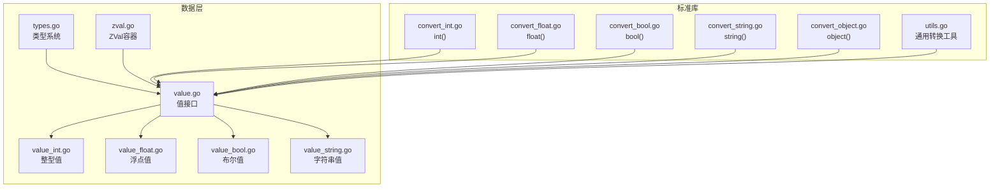
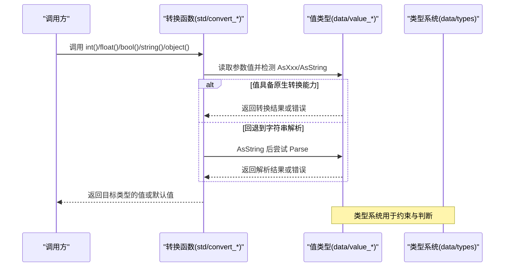
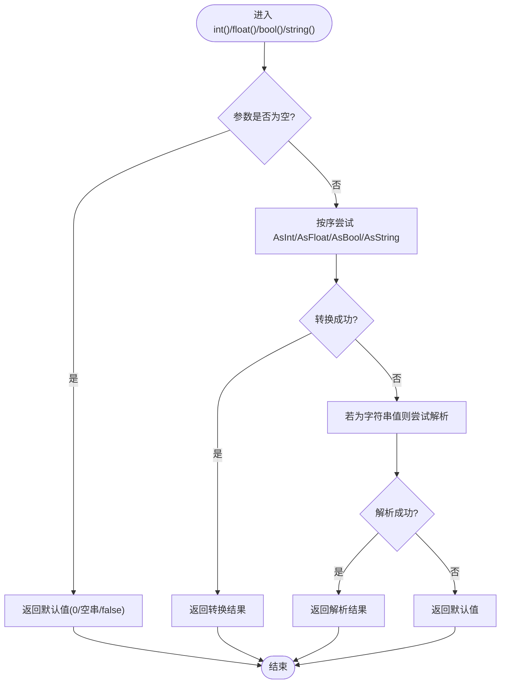
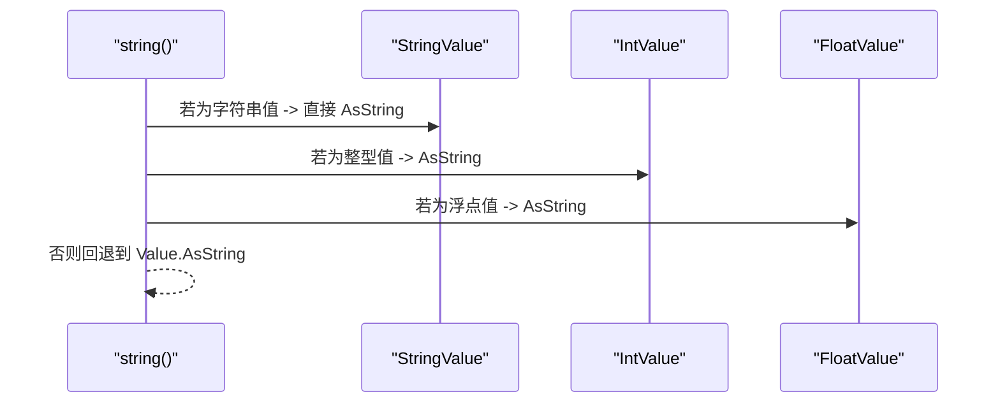
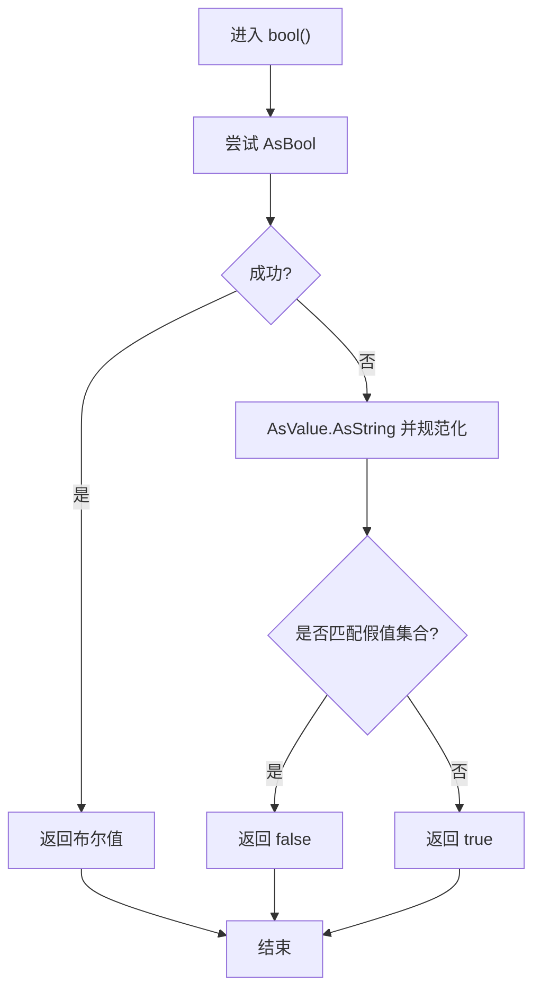
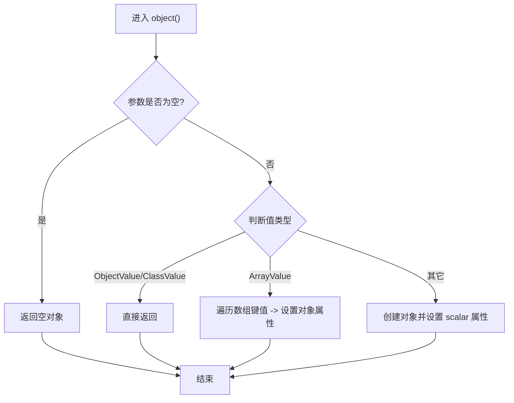
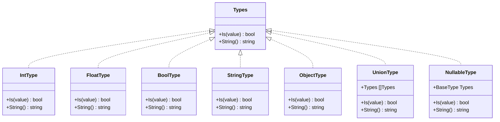
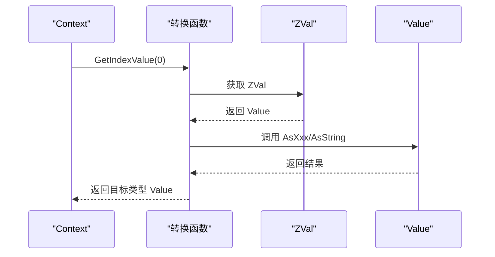
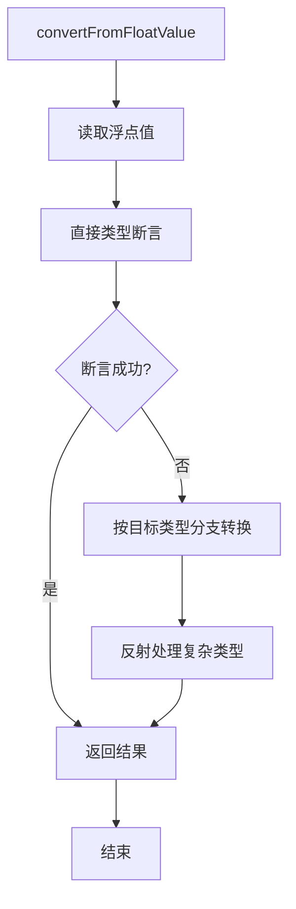
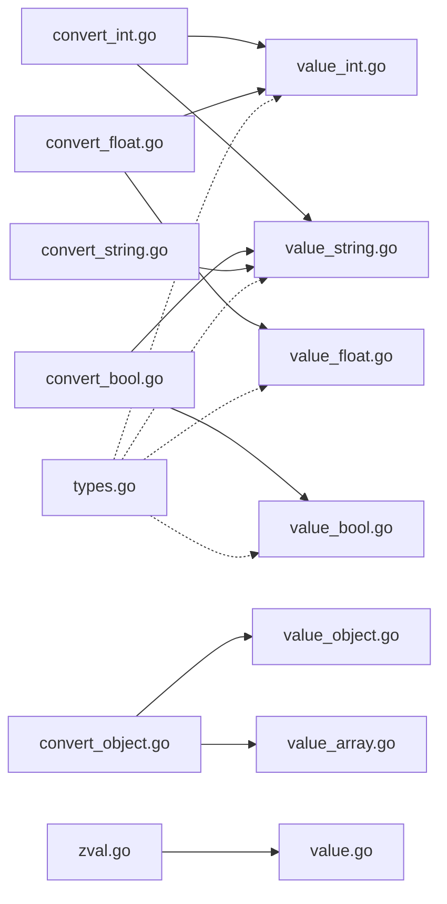

# 类型转换机制

<cite>
**本文引用的文件**
- [types.go](file://data/types.go)
- [convert_int.go](file://std/convert_int.go)
- [convert_float.go](file://std/convert_float.go)
- [convert_bool.go](file://std/convert_bool.go)
- [convert_string.go](file://std/convert_string.go)
- [convert_object.go](file://std/convert_object.go)
- [value.go](file://data/value.go)
- [value_int.go](file://data/value_int.go)
- [value_float.go](file://data/value_float.go)
- [value_bool.go](file://data/value_bool.go)
- [value_string.go](file://data/value_string.go)
- [zval.go](file://data/zval.go)
- [utils.go](file://utils/utils.go)
</cite>

## 目录
1. [引言](#引言)
2. [项目结构](#项目结构)
3. [核心组件](#核心组件)
4. [架构总览](#架构总览)
5. [详细组件分析](#详细组件分析)
6. [依赖分析](#依赖分析)
7. [性能考量](#性能考量)
8. [故障排查指南](#故障排查指南)
9. [结论](#结论)
10. [附录](#附录)

## 引言
本文件系统化阐述 Origami 的类型转换机制，覆盖隐式与显式转换、数值类型间转换、字符串与数值互转、布尔值转换规则以及对象类型转换。文档同时说明安全性检查、精度损失处理与异常处理策略，并给出性能与内存影响分析及典型转换场景的参考路径。

## 项目结构
围绕类型转换的核心代码主要分布在以下模块：
- 数据类型与类型系统：data/types.go
- 值类型与转换接口：data/value*.go
- 标准库转换函数：std/convert_*.go
- ZVal 容器：data/zval.go
- 通用转换工具：utils/utils.go

图表来源
- [types.go:1-262](file://data/types.go#L1-L262)
- [value.go:1-39](file://data/value.go#L1-L39)
- [value_int.go:1-51](file://data/value_int.go#L1-L51)
- [value_float.go:1-62](file://data/value_float.go#L1-L62)
- [value_bool.go:1-47](file://data/value_bool.go#L1-L47)
- [value_string.go:1-86](file://data/value_string.go#L1-L86)
- [zval.go:1-18](file://data/zval.go#L1-L18)
- [convert_int.go:1-65](file://std/convert_int.go#L1-L65)
- [convert_float.go:1-64](file://std/convert_float.go#L1-L64)
- [convert_bool.go:1-52](file://std/convert_bool.go#L1-L52)
- [convert_string.go:1-39](file://std/convert_string.go#L1-L39)
- [convert_object.go:1-67](file://std/convert_object.go#L1-L67)
- [utils.go:158-216](file://utils/utils.go#L158-L216)

章节来源
- [types.go:1-262](file://data/types.go#L1-L262)
- [value.go:1-39](file://data/value.go#L1-L39)
- [convert_int.go:1-65](file://std/convert_int.go#L1-L65)
- [convert_float.go:1-64](file://std/convert_float.go#L1-L64)
- [convert_bool.go:1-52](file://std/convert_bool.go#L1-L52)
- [convert_string.go:1-39](file://std/convert_string.go#L1-L39)
- [convert_object.go:1-67](file://std/convert_object.go#L1-L67)
- [value_int.go:1-51](file://data/value_int.go#L1-L51)
- [value_float.go:1-62](file://data/value_float.go#L1-L62)
- [value_bool.go:1-47](file://data/value_bool.go#L1-L47)
- [value_string.go:1-86](file://data/value_string.go#L1-L86)
- [zval.go:1-18](file://data/zval.go#L1-L18)
- [utils.go:158-216](file://utils/utils.go#L158-L216)

## 核心组件
- 类型系统与类型判断：通过 Types 接口族与具体类型结构（如 Int、Float、Bool、String、Object）实现类型识别与联合/可空类型组合。
- 值类型与转换接口：各类 Value 实现 AsString/AsInt/AsFloat/AsBool 等接口，统一提供“可转换”能力。
- 标准库转换函数：int()/float()/bool()/string()/object() 以函数形式暴露显式转换行为。
- ZVal 容器：封装 Value，便于运行时传递与存储。
- 通用转换工具：针对浮点/布尔值的通用转换逻辑，兼顾性能与类型兼容。

章节来源
- [types.go:5-106](file://data/types.go#L5-L106)
- [value.go:3-38](file://data/value.go#L3-L38)
- [convert_int.go:10-65](file://std/convert_int.go#L10-L65)
- [convert_float.go:10-64](file://std/convert_float.go#L10-L64)
- [convert_bool.go:10-52](file://std/convert_bool.go#L10-L52)
- [convert_string.go:8-39](file://std/convert_string.go#L8-L39)
- [convert_object.go:10-67](file://std/convert_object.go#L10-L67)
- [zval.go:3-17](file://data/zval.go#L3-L17)
- [utils.go:158-216](file://utils/utils.go#L158-L216)

## 架构总览
类型转换在 Origami 中遵循“值类型 + 接口 + 标准函数”的分层设计：
- 值类型负责自身可转换能力（AsXxx），并提供 AsString 统一输出。
- 类型系统用于静态/动态类型判断与约束。
- 标准库转换函数按顺序尝试值的原生转换能力，再回退到字符串解析或默认值。
- ZVal 作为统一承载容器参与运行时传递。

图表来源
- [convert_int.go:14-50](file://std/convert_int.go#L14-L50)
- [convert_float.go:14-48](file://std/convert_float.go#L14-L48)
- [convert_bool.go:14-37](file://std/convert_bool.go#L14-L37)
- [convert_string.go:12-24](file://std/convert_string.go#L12-L24)
- [convert_object.go:21-52](file://std/convert_object.go#L21-L52)
- [value_int.go:13-40](file://data/value_int.go#L13-L40)
- [value_float.go:13-50](file://data/value_float.go#L13-L50)
- [value_bool.go:13-34](file://data/value_bool.go#L13-L34)
- [value_string.go:12-34](file://data/value_string.go#L12-L34)
- [types.go:5-106](file://data/types.go#L5-L106)

## 详细组件分析

### 数值类型转换（int/float/bool/string）
- int() 转换优先尝试 AsInt/AsFloat/AsBool，最后回退到字符串解析；失败返回 0。
- float() 转换优先尝试 AsFloat/AsInt/AsBool，最后回退到字符串解析；失败返回 0。
- bool() 转换优先尝试 AsBool/AsString 规则（空白/“0”/“false”/“no”/“off”/“null”/“nil”为假，否则真），非 nil 默认真。
- string() 转换优先使用 AsString，否则回退到 Value.AsString 输出。

图表来源
- [convert_int.go:14-50](file://std/convert_int.go#L14-L50)
- [convert_float.go:14-48](file://std/convert_float.go#L14-L48)
- [convert_bool.go:14-37](file://std/convert_bool.go#L14-L37)
- [convert_string.go:12-24](file://std/convert_string.go#L12-L24)
- [value_int.go:13-40](file://data/value_int.go#L13-L40)
- [value_float.go:13-50](file://data/value_float.go#L13-L50)
- [value_bool.go:13-34](file://data/value_bool.go#L13-L34)
- [value_string.go:12-34](file://data/value_string.go#L12-L34)

章节来源
- [convert_int.go:14-50](file://std/convert_int.go#L14-L50)
- [convert_float.go:14-48](file://std/convert_float.go#L14-L48)
- [convert_bool.go:14-37](file://std/convert_bool.go#L14-L37)
- [convert_string.go:12-24](file://std/convert_string.go#L12-L24)
- [value_int.go:13-40](file://data/value_int.go#L13-L40)
- [value_float.go:13-50](file://data/value_float.go#L13-L50)
- [value_bool.go:13-34](file://data/value_bool.go#L13-L34)
- [value_string.go:12-34](file://data/value_string.go#L12-L34)

### 字符串与数值的相互转换
- 字符串到整数/浮点：优先使用 AsInt/AsFloat；字符串值也提供相应解析能力。
- 整数/浮点到字符串：统一通过 AsString 输出。
- 布尔到字符串：根据真假输出对应字符串表示。

图表来源
- [convert_string.go:12-24](file://std/convert_string.go#L12-L24)
- [value_string.go:24-26](file://data/value_string.go#L24-L26)
- [value_int.go:26-28](file://data/value_int.go#L26-L28)
- [value_float.go:33-35](file://data/value_float.go#L33-L35)

章节来源
- [convert_string.go:12-24](file://std/convert_string.go#L12-L24)
- [value_string.go:24-26](file://data/value_string.go#L24-L26)
- [value_int.go:26-28](file://data/value_int.go#L26-L28)
- [value_float.go:33-35](file://data/value_float.go#L33-L35)

### 布尔值转换规则
- 显式 bool()：支持 AsBool 与 AsString 规则（空白/“0”/“false”/“no”/“off”/“null”/“nil”为假，否则真）。
- 隐式布尔：类型系统中 Bool 类型接受实现 AsBool 的值，体现弱类型语义。

图表来源
- [convert_bool.go:14-37](file://std/convert_bool.go#L14-L37)
- [value_bool.go:25-30](file://data/value_bool.go#L25-L30)
- [type_bool.go:6-17](file://data/type_bool.go#L6-L17)

章节来源
- [convert_bool.go:14-37](file://std/convert_bool.go#L14-L37)
- [value_bool.go:25-30](file://data/value_bool.go#L25-L30)
- [type_bool.go:6-17](file://data/type_bool.go#L6-L17)

### 对象类型转换机制
- object() 支持：
  - 已是对象/类实例：直接返回。
  - 数组：转换为对象，数值键与字符串键均转为属性名（数值键转为字符串）。
  - 其他标量：包装为带 “scalar” 属性的对象。
- 与类型系统中的 Object 类型配合，用于判断对象/类实例。

图表来源
- [convert_object.go:21-52](file://std/convert_object.go#L21-L52)
- [type_object.go:6-14](file://data/type_object.go#L6-L14)

章节来源
- [convert_object.go:21-52](file://std/convert_object.go#L21-L52)
- [type_object.go:6-14](file://data/type_object.go#L6-L14)

### 类型系统与类型判断
- 基础类型映射：NewBaseType 将字符串类型映射为 Int/Float/String/Bool/Object/Callable 等。
- 联合类型/可空类型：UnionType/NullableType 提供多选与可空组合。
- 类型判断：各 Type 结构体的 Is 方法用于判定值是否满足类型约束。

图表来源
- [types.go:5-106](file://data/types.go#L5-L106)

章节来源
- [types.go:142-188](file://data/types.go#L142-L188)
- [types.go:83-106](file://data/types.go#L83-L106)
- [types.go:34-49](file://data/types.go#L34-L49)

### ZVal 与转换流程
- ZVal 作为 Value 的容器，贯穿运行时传递。
- 转换函数通过上下文获取参数值，最终返回目标类型的 Value。

图表来源
- [convert_int.go:14-18](file://std/convert_int.go#L14-L18)
- [convert_float.go:14-18](file://std/convert_float.go#L14-L18)
- [convert_bool.go:14-18](file://std/convert_bool.go#L14-L18)
- [convert_string.go:12-16](file://std/convert_string.go#L12-L16)
- [convert_object.go:21-25](file://std/convert_object.go#L21-L25)
- [zval.go:3-17](file://data/zval.go#L3-L17)

章节来源
- [zval.go:3-17](file://data/zval.go#L3-L17)
- [convert_int.go:14-18](file://std/convert_int.go#L14-L18)
- [convert_float.go:14-18](file://std/convert_float.go#L14-L18)
- [convert_bool.go:14-18](file://std/convert_bool.go#L14-L18)
- [convert_string.go:12-16](file://std/convert_string.go#L12-L16)
- [convert_object.go:21-25](file://std/convert_object.go#L21-L25)

### 通用转换工具（浮点/布尔）
- convertFromFloatValue：先尝试直接类型断言，再按目标类型分支转换，最后回退到反射处理。
- convertFromBoolValue：对布尔值进行类型断言与分支转换。

图表来源
- [utils.go:158-203](file://utils/utils.go#L158-L203)

章节来源
- [utils.go:158-203](file://utils/utils.go#L158-L203)
- [utils.go:205-216](file://utils/utils.go#L205-L216)

## 依赖分析
- 转换函数依赖值类型提供的 AsXxx/AsString 接口，形成“值类型能力 + 函数层策略”的解耦。
- 类型系统独立于转换函数，用于类型约束与判断。
- ZVal 仅作为容器，不改变转换逻辑。

图表来源
- [convert_int.go:14-50](file://std/convert_int.go#L14-L50)
- [convert_float.go:14-48](file://std/convert_float.go#L14-L48)
- [convert_bool.go:14-37](file://std/convert_bool.go#L14-L37)
- [convert_string.go:12-24](file://std/convert_string.go#L12-L24)
- [convert_object.go:21-52](file://std/convert_object.go#L21-L52)
- [value_int.go:13-40](file://data/value_int.go#L13-L40)
- [value_float.go:13-50](file://data/value_float.go#L13-L50)
- [value_bool.go:13-34](file://data/value_bool.go#L13-L34)
- [value_string.go:12-34](file://data/value_string.go#L12-L34)
- [types.go:5-106](file://data/types.go#L5-L106)
- [zval.go:3-17](file://data/zval.go#L3-L17)

章节来源
- [convert_int.go:14-50](file://std/convert_int.go#L14-L50)
- [convert_float.go:14-48](file://std/convert_float.go#L14-L48)
- [convert_bool.go:14-37](file://std/convert_bool.go#L14-L37)
- [convert_string.go:12-24](file://std/convert_string.go#L12-L24)
- [convert_object.go:21-52](file://std/convert_object.go#L21-L52)
- [value_int.go:13-40](file://data/value_int.go#L13-L40)
- [value_float.go:13-50](file://data/value_float.go#L13-L50)
- [value_bool.go:13-34](file://data/value_bool.go#L13-L34)
- [value_string.go:12-34](file://data/value_string.go#L12-L34)
- [types.go:5-106](file://data/types.go#L5-L106)
- [zval.go:3-17](file://data/zval.go#L3-L17)

## 性能考量
- 优先尝试值自身的 AsXxx 能力，避免额外解析成本。
- 字符串解析仅在必要时回退执行，减少不必要的 CPU 开销。
- 浮点/布尔通用转换采用“直接断言 + 分支 + 反射”的降级策略，平衡性能与兼容性。
- 内存与 GC 影响：
  - 转换通常产生新的 Value 实例（如 IntValue/FloatValue/StringValue/BoolValue），可能触发短期 GC 抖动。
  - 字符串拼接与格式化（如 AsString）会产生临时字符串，建议在高频路径避免重复转换。
  - 对象转换涉及属性设置，注意大数组转换带来的分配开销。

## 故障排查指南
- 转换失败的常见原因
  - 输入为 nil：多数转换函数返回默认值（0/空串/false/空对象），需确认业务期望。
  - 字符串无法解析：int()/float() 在解析失败时返回默认值，检查输入格式与编码。
  - 布尔规则不符合预期：bool() 对空白/“0”/“false”等视为假，确认输入是否符合规则。
  - 对象转换异常：数组键为 nil 时会设置为 null 属性；标量值包装为带 “scalar” 属性的对象。
- 定位建议
  - 使用 ZVal 承载值并在关键节点打印 AsString/类型信息辅助诊断。
  - 利用类型系统的 Is 方法快速验证值是否满足目标类型约束。
  - 对高频转换场景引入缓存或预解析策略，降低重复开销。

章节来源
- [convert_int.go:16-18](file://std/convert_int.go#L16-L18)
- [convert_float.go:16-18](file://std/convert_float.go#L16-L18)
- [convert_bool.go:16-18](file://std/convert_bool.go#L16-L18)
- [convert_string.go:14-16](file://std/convert_string.go#L14-L16)
- [convert_object.go:23-25](file://std/convert_object.go#L23-L25)
- [value_string.go:28-34](file://data/value_string.go#L28-L34)
- [value_int.go:37-40](file://data/value_int.go#L37-L40)
- [value_float.go:48-50](file://data/value_float.go#L48-L50)
- [zval.go:3-17](file://data/zval.go#L3-L17)
- [types.go:6-17](file://data/types.go#L6-L17)

## 结论
Origami 的类型转换机制以值类型能力为核心、以标准函数为入口、以类型系统为约束，形成了清晰、可扩展且兼顾性能的设计。通过 AsXxx/AsString 接口与回退解析策略，实现了稳健的隐式与显式转换；通过 ZVal 容器与类型判断，保证了运行时的灵活性与一致性。在工程实践中，应结合业务需求选择合适的转换方式，并关注字符串解析与对象转换的性能与内存影响。

## 附录
- 典型转换场景参考路径
  - 强制类型转换（int/float/bool/string/object）：[convert_int.go:14-50](file://std/convert_int.go#L14-L50)、[convert_float.go:14-48](file://std/convert_float.go#L14-L48)、[convert_bool.go:14-37](file://std/convert_bool.go#L14-L37)、[convert_string.go:12-24](file://std/convert_string.go#L12-24)、[convert_object.go:21-52](file://std/convert_object.go#L21-52)
  - 条件转换与回退：上述转换函数内部均包含回退到字符串解析的逻辑。
  - 转换失败处理：当解析失败或输入为 nil 时，返回默认值（0/空串/false/空对象）。
  - 通用转换工具：[utils.go:158-203](file://utils/utils.go#L158-L203)