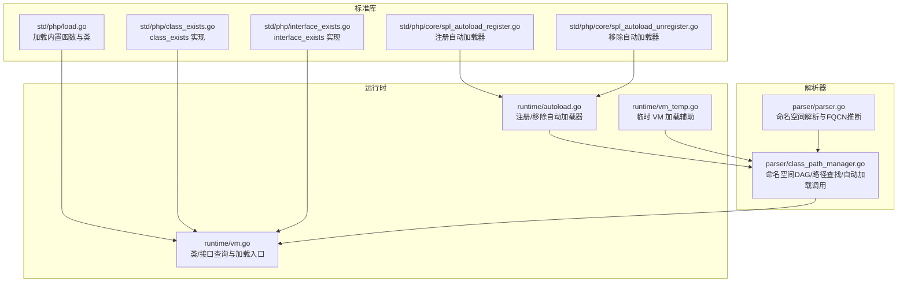
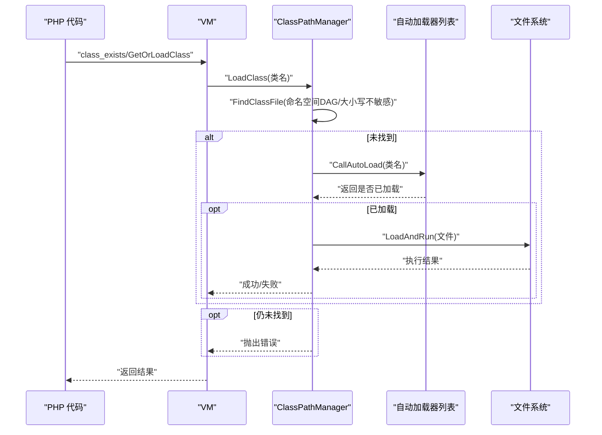
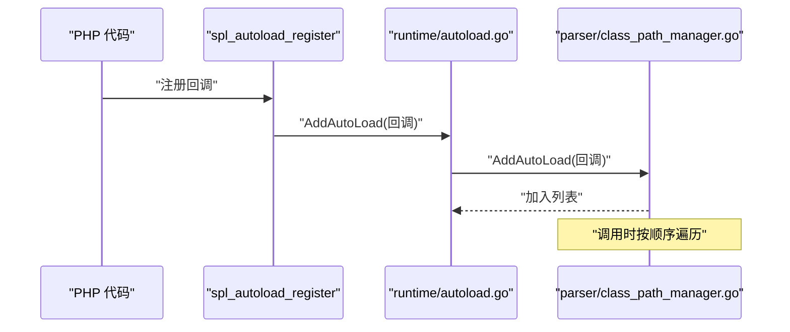
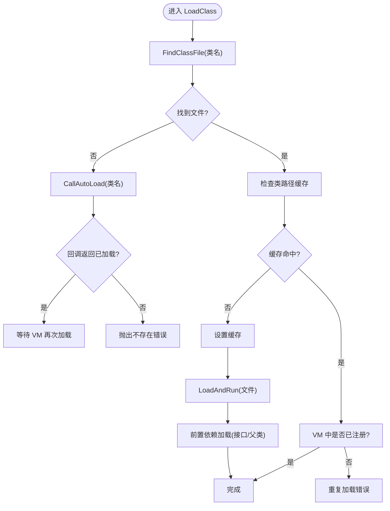
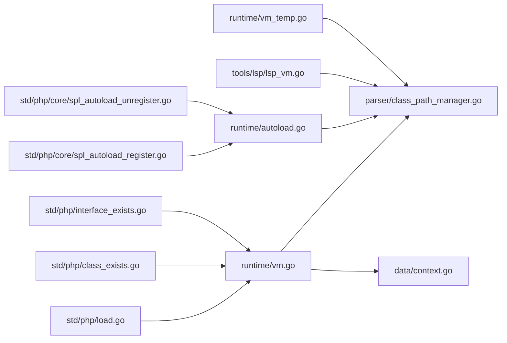

# 自动加载机制

<cite>
**本文引用的文件**   
- [runtime/autoload.go](file://runtime/autoload.go)
- [parser/class_path_manager.go](file://parser/class_path_manager.go)
- [std/php/class_exists.go](file://std/php/class_exists.go)
- [std/php/interface_exists.go](file://std/php/interface_exists.go)
- [std/php/core/spl_autoload_register.go](file://std/php/core/spl_autoload_register.go)
- [std/php/core/spl_autoload_unregister.go](file://std/php/core/spl_autoload_unregister.go)
- [std/php/load.go](file://std/php/load.go)
- [runtime/vm.go](file://runtime/vm.go)
- [data/context.go](file://data/context.go)
- [parser/parser.go](file://parser/parser.go)
- [runtime/vm_temp.go](file://runtime/vm_temp.go)
- [tools/lsp/lsp_vm.go](file://tools/lsp/lsp_vm.go)
</cite>

## 目录
1. [引言](#引言)
2. [项目结构](#项目结构)
3. [核心组件](#核心组件)
4. [架构总览](#架构总览)
5. [详细组件分析](#详细组件分析)
6. [依赖分析](#依赖分析)
7. [性能考虑](#性能考虑)
8. [故障排查指南](#故障排查指南)
9. [结论](#结论)
10. [附录](#附录)

## 引言
本文件系统性阐述 Origami 的自动加载机制，覆盖类与接口的自动加载策略、文件路径解析、命名空间映射、加载顺序控制、触发条件、执行流程、错误处理、类路径缓存、循环依赖检测与失败恢复策略，并提供自定义自动加载器的实现方法与性能优化建议。文档面向不同层次读者，既提供高层概览也包含代码级细节与可视化图表。

## 项目结构
自动加载相关能力横跨运行时、解析器与标准库三大部分：
- 运行时层负责类/接口的注册、查询与加载入口，以及自动加载器的注册与调用。
- 解析器层负责类路径管理（命名空间 DAG、文件查找、大小写不敏感匹配等）。
- 标准库层提供 PHP 侧 API（如 class_exists、interface_exists、spl_autoload_register/unregister），并与运行时交互。

**图表来源**
- [runtime/autoload.go:1-15](file://runtime/autoload.go#L1-L15)
- [parser/class_path_manager.go:1-428](file://parser/class_path_manager.go#L1-L428)
- [std/php/load.go:19-212](file://std/php/load.go#L19-L212)
- [std/php/class_exists.go:19-47](file://std/php/class_exists.go#L19-L47)
- [std/php/interface_exists.go:21-47](file://std/php/interface_exists.go#L21-L47)
- [std/php/core/spl_autoload_register.go:18-74](file://std/php/core/spl_autoload_register.go#L18-L74)
- [std/php/core/spl_autoload_unregister.go:17-57](file://std/php/core/spl_autoload_unregister.go#L17-L57)
- [runtime/vm.go:162-243](file://runtime/vm.go#L162-L243)
- [parser/parser.go:483-568](file://parser/parser.go#L483-L568)
- [runtime/vm_temp.go:121-149](file://runtime/vm_temp.go#L121-L149)

**章节来源**
- [runtime/autoload.go:1-15](file://runtime/autoload.go#L1-L15)
- [parser/class_path_manager.go:1-428](file://parser/class_path_manager.go#L1-L428)
- [std/php/load.go:19-212](file://std/php/load.go#L19-L212)
- [std/php/class_exists.go:19-47](file://std/php/class_exists.go#L19-L47)
- [std/php/interface_exists.go:21-47](file://std/php/interface_exists.go#L21-L47)
- [std/php/core/spl_autoload_register.go:18-74](file://std/php/core/spl_autoload_register.go#L18-L74)
- [std/php/core/spl_autoload_unregister.go:17-57](file://std/php/core/spl_autoload_unregister.go#L17-L57)
- [runtime/vm.go:162-243](file://runtime/vm.go#L162-L243)
- [parser/parser.go:483-568](file://parser/parser.go#L483-L568)
- [runtime/vm_temp.go:121-149](file://runtime/vm_temp.go#L121-L149)

## 核心组件
- 自动加载器注册与调用
  - 运行时包装器：runtime/autoload.go 提供 AddAutoLoad/RemoveAutoLoad，委托给解析器实现。
  - 解析器实现：parser/class_path_manager.go 维护 autoload 回调列表，提供 CallAutoLoad 顺序调用。
- 类/接口加载入口
  - runtime/vm.go 提供 GetOrLoadClass/GetOrLoadInterface，统一走 ClassPathManager.LoadClass。
- 类路径管理
  - parser/class_path_manager.go 实现命名空间 DAG、大小写不敏感查找、类路径缓存、重复加载检测。
- 命名空间解析
  - parser/parser.go 负责 use 别名展开、FQCN 推断、全局/相对命名空间处理。
- PHP API
  - std/php/class_exists.go、std/php/interface_exists.go 提供 PHP 侧判断与触发自动加载。
  - std/php/core/spl_autoload_register.go、std/php/core/spl_autoload_unregister.go 提供注册/移除自动加载器。
  - std/php/load.go 在初始化时注册这些函数。

**章节来源**
- [runtime/autoload.go:8-14](file://runtime/autoload.go#L8-L14)
- [parser/class_path_manager.go:384-427](file://parser/class_path_manager.go#L384-L427)
- [runtime/vm.go:162-243](file://runtime/vm.go#L162-L243)
- [parser/class_path_manager.go:147-382](file://parser/class_path_manager.go#L147-L382)
- [parser/parser.go:483-568](file://parser/parser.go#L483-L568)
- [std/php/class_exists.go:19-47](file://std/php/class_exists.go#L19-L47)
- [std/php/interface_exists.go:21-47](file://std/php/interface_exists.go#L21-L47)
- [std/php/core/spl_autoload_register.go:18-74](file://std/php/core/spl_autoload_register.go#L18-L74)
- [std/php/core/spl_autoload_unregister.go:17-57](file://std/php/core/spl_autoload_unregister.go#L17-L57)
- [std/php/load.go:19-212](file://std/php/load.go#L19-L212)

## 架构总览
自动加载的整体流程如下：
- PHP 代码调用 class_exists/interface_exists 或直接 new 类/接口，触发 VM 查询。
- VM 优先在内存中查找，未命中则委托 ClassPathManager.LoadClass。
- ClassPathManager 先在命名空间 DAG 中定位类文件，未找到则调用已注册的自动加载器。
- 自动加载器可自行决定是否加载目标类/接口文件；成功后 VM 再次尝试加载。
- 成功后进行前置依赖加载（类的 implements 接口、接口的 extends 接口）。

**图表来源**
- [runtime/vm.go:162-243](file://runtime/vm.go#L162-L243)
- [parser/class_path_manager.go:327-382](file://parser/class_path_manager.go#L327-L382)
- [parser/class_path_manager.go:403-427](file://parser/class_path_manager.go#L403-L427)
- [runtime/vm.go:275-289](file://runtime/vm.go#L275-L289)

## 详细组件分析

### 自动加载器注册与调用
- 注册入口
  - PHP 侧：spl_autoload_register 接受函数、闭包或类+方法数组形式，最终通过 runtime/AddAutoLoad 注册到解析器。
  - 解析器侧：维护 autoload 回调切片，按注册顺序依次调用。
- 调用流程
  - CallAutoLoad 为每个回调创建上下文，传入类名字符串参数，调用其返回值作为“是否已加载”的布尔信号。
  - 任一回调返回真即视为已加载，停止后续回调；若全部返回假或异常，继续后续逻辑。
- 移除
  - spl_autoload_unregister 支持函数与类+方法形式，最终通过 runtime/RemoveAutoLoad 从列表中剔除。

**图表来源**
- [std/php/core/spl_autoload_register.go:18-74](file://std/php/core/spl_autoload_register.go#L18-L74)
- [runtime/autoload.go:8-14](file://runtime/autoload.go#L8-L14)
- [parser/class_path_manager.go:384-401](file://parser/class_path_manager.go#L384-L401)

**章节来源**
- [std/php/core/spl_autoload_register.go:18-74](file://std/php/core/spl_autoload_register.go#L18-L74)
- [std/php/core/spl_autoload_unregister.go:17-57](file://std/php/core/spl_autoload_unregister.go#L17-L57)
- [runtime/autoload.go:8-14](file://runtime/autoload.go#L8-L14)
- [parser/class_path_manager.go:384-427](file://parser/class_path_manager.go#L384-L427)

### 类路径管理与命名空间映射
- 命名空间 DAG
  - DefaultClassPathManager 维护 NamespaceNode 树，支持多路径映射与动态子目录识别。
  - AddNamespace 将命名空间路径加入 DAG，支持绝对路径校验与去重。
- 文件查找策略
  - FindClassFile 先按类名拆分命名空间与简单类名，再在对应节点路径中查找 .zy/.php 文件。
  - 支持大小写不敏感的文件/目录查找，提升跨平台兼容性。
- 加载顺序控制
  - LoadClass 严格遵循“先查缓存，再查文件，再调用自动加载器，最后报错”的顺序。
  - 重复加载检测：若同一类已记录缓存路径且 VM 中仍未注册，直接报错，避免重复解析。
- 自动加载触发
  - LoadClass 在未找到文件时调用 CallAutoLoad，若回调返回真则不再报错，等待后续 VM 再次尝试加载。

**图表来源**
- [parser/class_path_manager.go:327-382](file://parser/class_path_manager.go#L327-L382)
- [parser/class_path_manager.go:147-183](file://parser/class_path_manager.go#L147-L183)
- [parser/class_path_manager.go:384-427](file://parser/class_path_manager.go#L384-L427)

**章节来源**
- [parser/class_path_manager.go:47-118](file://parser/class_path_manager.go#L47-L118)
- [parser/class_path_manager.go:147-382](file://parser/class_path_manager.go#L147-L382)

### 命名空间解析与 FQCN 推断
- use 别名展开：当出现 use A\B as P; 时，P\X 会被展开为 A\B\X。
- 完全限定名处理：以 "\" 开头的类名直接去除前导 "\" 并尝试查找。
- 相对命名空间：若当前命名空间存在，会先尝试 A\B\X，再回退到全局 FQCN。
- 未命中时返回原始名，交由 VM 在运行期尝试 autoload 或报错。

**章节来源**
- [parser/parser.go:483-568](file://parser/parser.go#L483-L568)

### PHP API 与触发条件
- class_exists
  - 第二个参数 $autoload 默认 true：若内存中不存在，会通过 VM.GetOrLoadClass 触发自动加载。
  - 返回 true/false，不抛出内部加载错误。
- interface_exists
  - 总是以 autoload=true 处理：若内存中不存在，通过 VM.GetOrLoadInterface 触发自动加载。
  - 返回 false 时不暴露内部错误。
- spl_autoload_register/unregister
  - 注册/移除回调，回调签名通常为 (string $class): bool，返回真表示已加载。

**章节来源**
- [std/php/class_exists.go:19-47](file://std/php/class_exists.go#L19-L47)
- [std/php/interface_exists.go:21-47](file://std/php/interface_exists.go#L21-L47)
- [std/php/core/spl_autoload_register.go:18-74](file://std/php/core/spl_autoload_register.go#L18-L74)
- [std/php/core/spl_autoload_unregister.go:17-57](file://std/php/core/spl_autoload_unregister.go#L17-L57)

### 类路径缓存与重复加载检测
- 缓存机制
  - VM 提供 SetClassPathCache/GetClassPathCache，ClassPathManager 在成功定位文件后写入缓存。
  - LSP VM 与 Temp VM 亦提供相应实现，保证不同场景一致性。
- 重复加载检测
  - 若同一类已记录缓存路径，但 VM 中仍未注册类/接口，直接报“重复加载”错误，避免重复解析。
- 作用
  - 降低重复解析成本，防止循环依赖导致的无限递归。

**章节来源**
- [data/context.go:54-56](file://data/context.go#L54-L56)
- [runtime/vm.go:57-66](file://runtime/vm.go#L57-L66)
- [parser/class_path_manager.go:342-351](file://parser/class_path_manager.go#L342-L351)
- [runtime/vm_temp.go:198-200](file://runtime/vm_temp.go#L198-L200)
- [tools/lsp/lsp_vm.go:30-96](file://tools/lsp/lsp_vm.go#L30-L96)

### 循环依赖检测与加载失败恢复
- 循环依赖检测
  - 通过类路径缓存与重复加载检测，避免同一类被重复解析。
  - 命名空间 DAG 的动态子目录识别与大小写不敏感查找，减少误判。
- 失败恢复
  - 自动加载器返回假时，继续后续 VM 加载；若仍失败，抛出明确错误。
  - LSP VM 在缓存加载失败时返回占位类，避免阻塞编辑器体验。

**章节来源**
- [parser/class_path_manager.go:342-351](file://parser/class_path_manager.go#L342-L351)
- [runtime/vm_temp.go:118-149](file://runtime/vm_temp.go#L118-L149)
- [tools/lsp/lsp_vm.go:108-127](file://tools/lsp/lsp_vm.go#L108-L127)

### 自定义自动加载器实现
- 回调签名
  - 接受一个字符串参数（类名），返回布尔值（是否已加载）。
- 注册方式
  - 通过 spl_autoload_register 注册函数、闭包或类+方法数组形式。
- 最佳实践
  - 在回调内尽量快速判定并加载，避免阻塞。
  - 与类路径缓存配合，避免重复工作。
  - 保持幂等性，多次调用不应产生副作用。

**章节来源**
- [std/php/core/spl_autoload_register.go:18-74](file://std/php/core/spl_autoload_register.go#L18-L74)
- [parser/class_path_manager.go:403-427](file://parser/class_path_manager.go#L403-L427)

## 依赖分析
- 运行时与解析器
  - VM 依赖 ClassPathManager 进行类/接口加载；ClassPathManager 依赖 VM 的缓存与加载能力。
- 标准库与运行时
  - class_exists/interface_exists 通过 VM 触发加载；spl_autoload_* 通过 runtime 包装器与解析器交互。
- 并发与一致性
  - ClassPathManager 使用互斥锁保护命名空间 DAG 的并发访问。
  - VM 与 LSP VM/Temps VM 提供一致的缓存接口，保障不同场景下的行为一致性。

**图表来源**
- [runtime/vm.go:162-243](file://runtime/vm.go#L162-L243)
- [parser/class_path_manager.go:327-382](file://parser/class_path_manager.go#L327-L382)
- [data/context.go:54-56](file://data/context.go#L54-L56)
- [std/php/load.go:19-212](file://std/php/load.go#L19-L212)
- [std/php/class_exists.go:19-47](file://std/php/class_exists.go#L19-L47)
- [std/php/interface_exists.go:21-47](file://std/php/interface_exists.go#L21-L47)
- [std/php/core/spl_autoload_register.go:18-74](file://std/php/core/spl_autoload_register.go#L18-L74)
- [std/php/core/spl_autoload_unregister.go:17-57](file://std/php/core/spl_autoload_unregister.go#L17-L57)
- [runtime/autoload.go:8-14](file://runtime/autoload.go#L8-L14)
- [tools/lsp/lsp_vm.go:446-489](file://tools/lsp/lsp_vm.go#L446-L489)
- [runtime/vm_temp.go:198-200](file://runtime/vm_temp.go#L198-L200)

**章节来源**
- [runtime/vm.go:162-243](file://runtime/vm.go#L162-L243)
- [parser/class_path_manager.go:327-382](file://parser/class_path_manager.go#L327-L382)
- [data/context.go:54-56](file://data/context.go#L54-L56)
- [std/php/load.go:19-212](file://std/php/load.go#L19-L212)
- [std/php/class_exists.go:19-47](file://std/php/class_exists.go#L19-L47)
- [std/php/interface_exists.go:21-47](file://std/php/interface_exists.go#L21-L47)
- [std/php/core/spl_autoload_register.go:18-74](file://std/php/core/spl_autoload_register.go#L18-L74)
- [std/php/core/spl_autoload_unregister.go:17-57](file://std/php/core/spl_autoload_unregister.go#L17-L57)
- [runtime/autoload.go:8-14](file://runtime/autoload.go#L8-L14)
- [tools/lsp/lsp_vm.go:446-489](file://tools/lsp/lsp_vm.go#L446-L489)
- [runtime/vm_temp.go:198-200](file://runtime/vm_temp.go#L198-L200)

## 性能考虑
- 命名空间 DAG 与缓存
  - 使用命名空间 DAG 与类路径缓存显著减少文件系统扫描次数。
  - 建议在应用启动阶段预热常用命名空间映射，降低首次加载延迟。
- 大小写不敏感查找
  - 仅在必要时启用，避免在已知大小写的生产环境造成额外开销。
- 自动加载器设计
  - 回调应尽量轻量，优先基于类名规则快速定位文件，避免复杂 IO。
  - 与缓存结合，避免重复解析同一类。
- 并发安全
  - ClassPathManager 的互斥锁保护了 DAG 更新过程，避免竞态；查询路径尽量短路，减少锁持有时间。

[本节为通用性能建议，无需特定文件来源]

## 故障排查指南
- “类不存在或无法加载”
  - 检查命名空间映射是否正确，确认 AddNamespace 路径有效且可读。
  - 确认类文件扩展名为 .zy 或 .php，且文件名与类名一致。
- “类重复加载”
  - 检查是否多次注册相同类/接口，或缓存路径与实际文件不一致。
- 自动加载器无效
  - 确认回调返回值语义：返回真表示已加载，返回假表示未加载。
  - 检查回调是否被正确注册（spl_autoload_register）且未被提前移除（spl_autoload_unregister）。
- LSP/临时 VM 行为差异
  - LSP VM 在缓存加载失败时返回占位类，属预期行为；生产环境请使用 VM 的严格模式。

**章节来源**
- [parser/class_path_manager.go:339-340](file://parser/class_path_manager.go#L339-L340)
- [parser/class_path_manager.go:350](file://parser/class_path_manager.go#L350)
- [std/php/core/spl_autoload_register.go:18-74](file://std/php/core/spl_autoload_register.go#L18-L74)
- [std/php/core/spl_autoload_unregister.go:17-57](file://std/php/core/spl_autoload_unregister.go#L17-L57)
- [runtime/vm_temp.go:118-149](file://runtime/vm_temp.go#L118-L149)

## 结论
Origami 的自动加载机制以“命名空间 DAG + 类路径缓存 + 顺序自动加载器”为核心，结合 VM 的统一加载入口与 PHP 侧 API，实现了灵活、可控且高性能的类/接口加载体系。通过合理的命名空间映射、严格的重复加载检测与大小写不敏感兼容，系统在开发与生产环境中均具备良好的稳定性与可维护性。建议在实际工程中配合缓存预热与轻量回调，进一步优化启动与运行时性能。

[本节为总结性内容，无需特定文件来源]

## 附录
- 配置选项与使用示例
  - 注册自动加载器：通过 spl_autoload_register 注册回调，回调需返回布尔值表示是否已加载。
  - 控制 autoload 行为：class_exists 支持 $autoload 参数，默认 true；interface_exists 总是按 autoload=true 处理。
  - 初始化加载：std/php/load.go 在启动时注册大量内置函数与类，确保自动加载生态可用。

**章节来源**
- [std/php/load.go:19-212](file://std/php/load.go#L19-L212)
- [std/php/class_exists.go:22-35](file://std/php/class_exists.go#L22-L35)
- [std/php/interface_exists.go:21-47](file://std/php/interface_exists.go#L21-L47)
- [std/php/core/spl_autoload_register.go:18-74](file://std/php/core/spl_autoload_register.go#L18-L74)