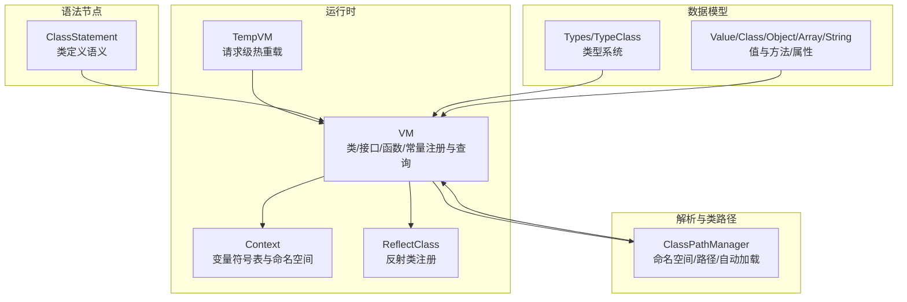
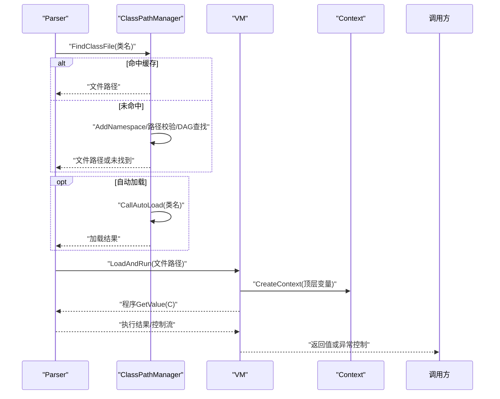
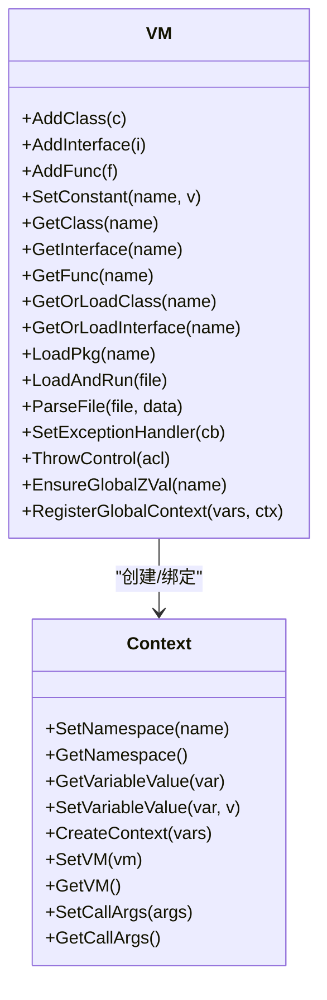
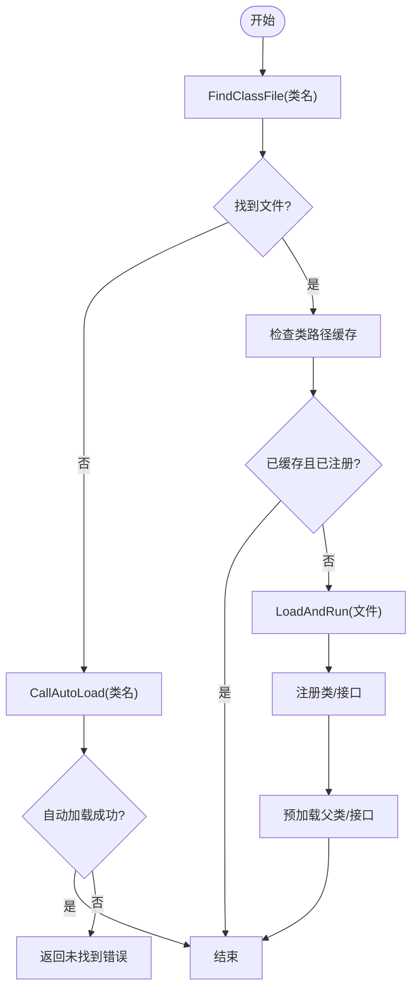
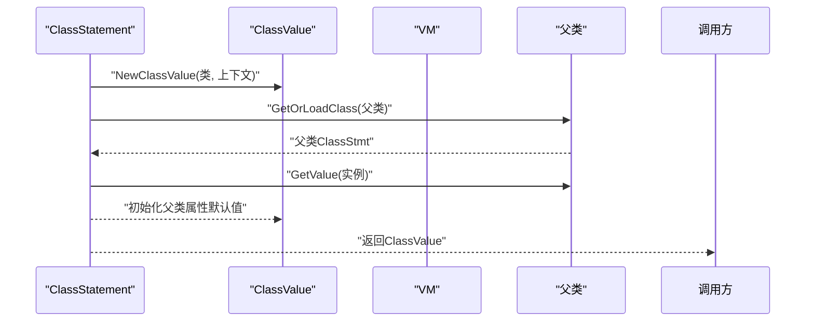
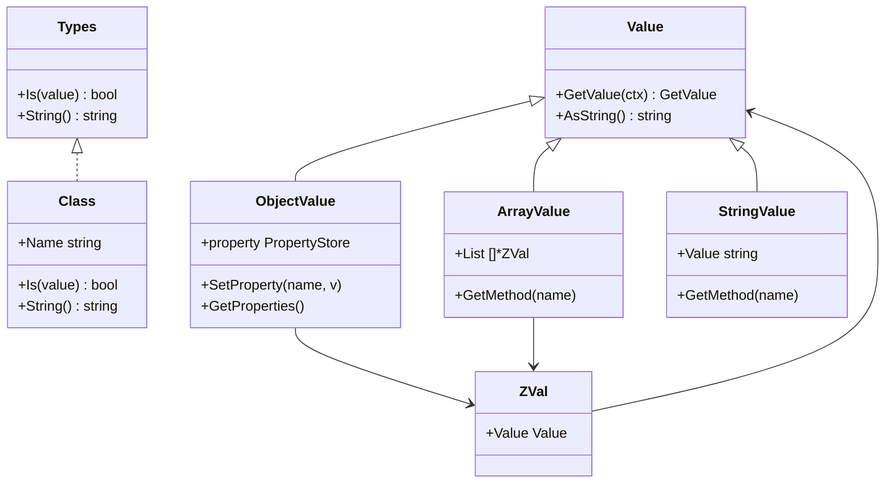
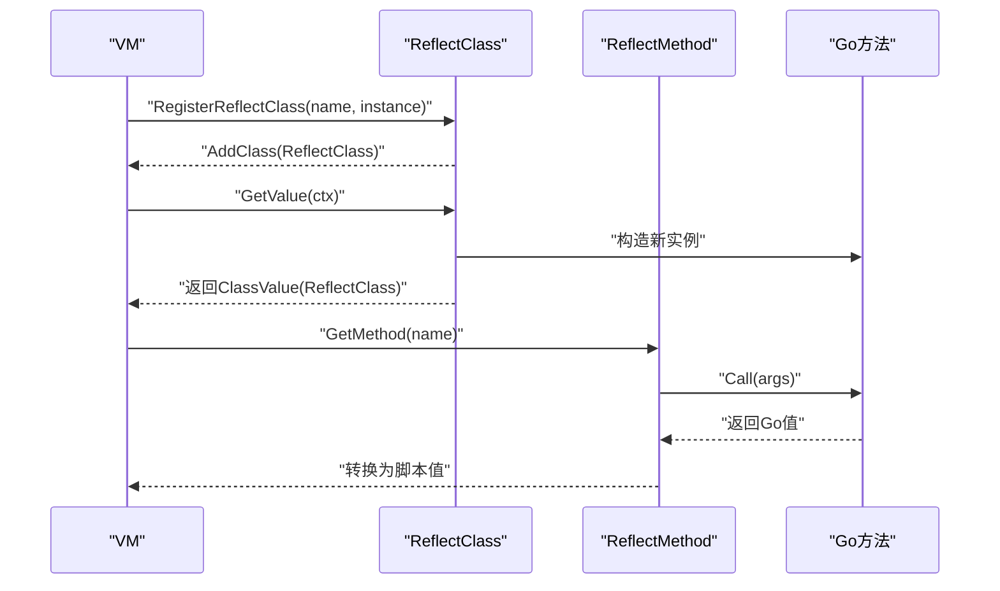
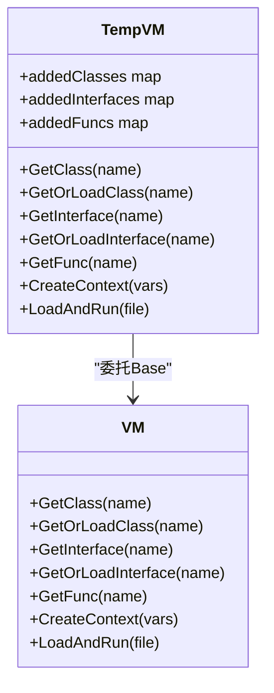
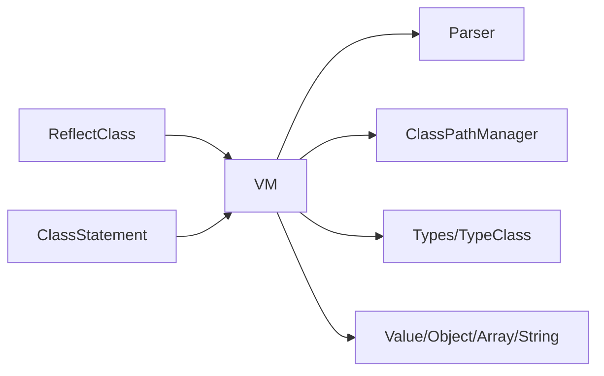

# 虚拟机实现

<cite>
**本文档引用的文件**
- [runtime/vm.go](file://runtime/vm.go)
- [runtime/vm_temp.go](file://runtime/vm_temp.go)
- [runtime/context.go](file://runtime/context.go)
- [runtime/reflect_class.go](file://runtime/reflect_class.go)
- [runtime/autoload.go](file://runtime/autoload.go)
- [parser/class_path_manager.go](file://parser/class_path_manager.go)
- [node/class.go](file://node/class.go)
- [data/types.go](file://data/types.go)
- [data/type_class.go](file://data/type_class.go)
- [data/value.go](file://data/value.go)
- [data/zval.go](file://data/zval.go)
- [data/value_class.go](file://data/value_class.go)
- [data/value_object.go](file://data/value_object.go)
- [data/value_array.go](file://data/value_array.go)
- [data/value_string.go](file://data/value_string.go)
</cite>

## 目录
1. [简介](#简介)
2. [项目结构](#项目结构)
3. [核心组件](#核心组件)
4. [架构总览](#架构总览)
5. [详细组件分析](#详细组件分析)
6. [依赖分析](#依赖分析)
7. [性能考量](#性能考量)
8. [故障排查指南](#故障排查指南)
9. [结论](#结论)
10. [附录](#附录)

## 简介
本文件面向Origami虚拟机实现，系统性阐述其栈式执行模型、指令集设计思路、操作数栈与上下文管理、类与接口注册、函数注册、常量管理、类加载机制（含自动加载、循环依赖与命名空间解析）、异常处理与控制流管理，以及性能优化与API使用建议。文档同时提供可视化图示帮助理解组件交互与执行流程。

## 项目结构
- 运行时层
  - 虚拟机与上下文：runtime/vm.go、runtime/context.go、runtime/vm_temp.go
  - 反射类注册：runtime/reflect_class.go
  - 自动加载：runtime/autoload.go
- 解析与类路径管理：parser/class_path_manager.go
- 语法节点与类语义：node/class.go
- 数据类型与值体系：data/types.go、data/type_class.go、data/value*.go、data/zval.go

**图表来源**
- [runtime/vm.go:14-391](file://runtime/vm.go#L14-L391)
- [runtime/context.go:12-140](file://runtime/context.go#L12-L140)
- [runtime/vm_temp.go:10-228](file://runtime/vm_temp.go#L10-L228)
- [runtime/reflect_class.go:12-524](file://runtime/reflect_class.go#L12-L524)
- [parser/class_path_manager.go:13-428](file://parser/class_path_manager.go#L13-L428)
- [node/class.go:11-528](file://node/class.go#L11-L528)
- [data/types.go:5-262](file://data/types.go#L5-L262)
- [data/type_class.go:3-146](file://data/type_class.go#L3-L146)
- [data/value.go:3-39](file://data/value.go#L3-L39)
- [data/value_class.go:8-295](file://data/value_class.go#L8-L295)
- [data/value_object.go:11-190](file://data/value_object.go#L11-L190)
- [data/value_array.go:7-162](file://data/value_array.go#L7-L162)
- [data/value_string.go:8-86](file://data/value_string.go#L8-L86)

**章节来源**
- [runtime/vm.go:14-391](file://runtime/vm.go#L14-L391)
- [runtime/context.go:12-140](file://runtime/context.go#L12-L140)
- [runtime/vm_temp.go:10-228](file://runtime/vm_temp.go#L10-L228)
- [runtime/reflect_class.go:12-524](file://runtime/reflect_class.go#L12-L524)
- [parser/class_path_manager.go:13-428](file://parser/class_path_manager.go#L13-L428)
- [node/class.go:11-528](file://node/class.go#L11-L528)
- [data/types.go:5-262](file://data/types.go#L5-L262)
- [data/type_class.go:3-146](file://data/type_class.go#L3-L146)
- [data/value.go:3-39](file://data/value.go#L3-L39)
- [data/value_class.go:8-295](file://data/value_class.go#L8-L295)
- [data/value_object.go:11-190](file://data/value_object.go#L11-L190)
- [data/value_array.go:7-162](file://data/value_array.go#L7-L162)
- [data/value_string.go:8-86](file://data/value_string.go#L8-L86)

## 核心组件
- 虚拟机VM：统一管理类/接口/函数/常量注册、全局变量、异常处理回调、类路径缓存、加载与运行入口。
- 上下文Context：维护变量符号表、命名空间、调用参数列表、与VM的绑定关系。
- 类路径管理器ClassPathManager：命名空间到物理路径映射、类文件查找、自动加载回调、重复加载检测。
- 语法节点ClassStatement：类定义的语义实现，包括继承链属性初始化、方法调用与生成器语义。
- 数据类型与值：类型系统（基础/联合/可空/泛型/类类型等）、值容器（ZVal）、对象/数组/字符串等具体值类型及方法集合。
- 反射类ReflectClass：将Go结构体代理为脚本类，支持构造与方法调用、类型转换。
- 临时VMTempVM：请求级隔离的VM视图，支持热重载与请求级新增类/接口/函数的优先可见性。

**章节来源**
- [runtime/vm.go:35-116](file://runtime/vm.go#L35-L116)
- [runtime/context.go:12-125](file://runtime/context.go#L12-L125)
- [parser/class_path_manager.go:13-118](file://parser/class_path_manager.go#L13-L118)
- [node/class.go:11-84](file://node/class.go#L11-L84)
- [data/types.go:5-262](file://data/types.go#L5-L262)
- [data/value.go:3-39](file://data/value.go#L3-L39)
- [runtime/reflect_class.go:12-131](file://runtime/reflect_class.go#L12-L131)
- [runtime/vm_temp.go:28-71](file://runtime/vm_temp.go#L28-L71)

## 架构总览
虚拟机采用“解析-注册-执行”的流水线模式：
- 解析阶段：Parser解析文件，生成语法节点。
- 注册阶段：VM注册类/接口/函数/常量，ClassPathManager负责类文件定位与自动加载。
- 执行阶段：Context维护变量符号表，节点GetValue驱动执行，控制流通过Control返回。

**图表来源**
- [parser/class_path_manager.go:147-382](file://parser/class_path_manager.go#L147-L382)
- [runtime/vm.go:275-332](file://runtime/vm.go#L275-L332)
- [runtime/context.go:26-106](file://runtime/context.go#L26-L106)

**章节来源**
- [parser/class_path_manager.go:147-382](file://parser/class_path_manager.go#L147-L382)
- [runtime/vm.go:275-332](file://runtime/vm.go#L275-L332)
- [runtime/context.go:26-106](file://runtime/context.go#L26-L106)

## 详细组件分析

### 虚拟机VM与上下文
- VM职责
  - 注册与查询：AddClass/AddInterface/AddFunc/SetConstant，GetClass/GetInterface/GetFunc/GetConstant。
  - 类加载：GetOrLoadClass/GetOrLoadInterface/LoadPkg，结合ClassPathManager与缓存。
  - 异常处理：SetExceptionHandler/ThrowControl，优先调用PHP侧set_exception_handler回调，否则底层处理。
  - 全局变量：EnsureGlobalZVal/RegisterGlobalContext，支持global语义。
  - 运行入口：LoadAndRun/ParseFile，克隆Parser并绑定VM，创建Context执行。
- Context职责
  - 符号表：variables []*ZVal，按变量索引存取。
  - 命名空间：SetNamespace/GetNamespace。
  - 调用参数：SetCallArgs/GetCallArgs，支持func_get_args等。
  - 与VM绑定：SetVM/GetVM，支持TempVM切换。

**图表来源**
- [runtime/vm.go:118-391](file://runtime/vm.go#L118-L391)
- [runtime/context.go:12-125](file://runtime/context.go#L12-L125)

**章节来源**
- [runtime/vm.go:118-391](file://runtime/vm.go#L118-L391)
- [runtime/context.go:12-125](file://runtime/context.go#L12-L125)

### 类路径管理与自动加载
- 命名空间解析
  - DAG树形结构存储命名空间到物理路径映射，支持多路径与动态子目录识别。
  - FindClassFile：先精确匹配，再大小写不敏感回退。
- 自动加载
  - CallAutoLoad：遍历注册的回调，传入类名，返回布尔决定是否已处理。
  - autoload全局切片维护回调列表。
- 类加载流程
  - LoadClass：若未找到，尝试自动加载；命中缓存则避免重复解析；成功后预加载直接依赖（父类/接口）。

**图表来源**
- [parser/class_path_manager.go:147-382](file://parser/class_path_manager.go#L147-L382)
- [runtime/autoload.go:8-15](file://runtime/autoload.go#L8-L15)

**章节来源**
- [parser/class_path_manager.go:147-382](file://parser/class_path_manager.go#L147-L382)
- [runtime/autoload.go:8-15](file://runtime/autoload.go#L8-L15)

### 类与接口语义（节点层）
- ClassStatement
  - GetValue：创建ClassValue，初始化继承链属性默认值，必要时触发父类初始化。
  - GetMethod/GetProperty：支持继承链查找。
- 方法调用语义
  - ClassMethod.Call：生成器方法立即返回Generator对象；普通方法按语句顺序执行，处理Return/Yield/YieldValue/AddStack等控制流。

**图表来源**
- [node/class.go:28-84](file://node/class.go#L28-L84)
- [data/value_class.go:8-295](file://data/value_class.go#L8-L295)

**章节来源**
- [node/class.go:28-84](file://node/class.go#L28-L84)
- [data/value_class.go:8-295](file://data/value_class.go#L8-L295)

### 数据类型与值体系
- 类型系统
  - 基础类型、联合类型、可空类型、多返回值类型、泛型类型、类类型等。
  - TypeClass.Is：支持类继承与接口实现判断，含接口继承链扩展。
- 值容器与语义
  - ZVal：统一的值容器，避免直接暴露底层值。
  - ObjectValue/ArrayValue/StringValue：各自实现迭代、方法集合与属性访问。
  - Copy-on-Write语义：数组与对象在赋值时克隆，避免共享导致的副作用。

**图表来源**
- [data/types.go:5-262](file://data/types.go#L5-L262)
- [data/type_class.go:3-146](file://data/type_class.go#L3-L146)
- [data/value.go:3-39](file://data/value.go#L3-L39)
- [data/zval.go:3-18](file://data/zval.go#L3-L18)
- [data/value_object.go:42-190](file://data/value_object.go#L42-L190)
- [data/value_array.go:32-162](file://data/value_array.go#L32-L162)
- [data/value_string.go:16-86](file://data/value_string.go#L16-L86)

**章节来源**
- [data/types.go:5-262](file://data/types.go#L5-L262)
- [data/type_class.go:3-146](file://data/type_class.go#L3-L146)
- [data/value.go:3-39](file://data/value.go#L3-L39)
- [data/zval.go:3-18](file://data/zval.go#L3-L18)
- [data/value_object.go:42-190](file://data/value_object.go#L42-L190)
- [data/value_array.go:32-162](file://data/value_array.go#L32-L162)
- [data/value_string.go:16-86](file://data/value_string.go#L16-L86)

### 反射类注册与调用
- ReflectClass
  - 通过RegisterReflectClass将Go实例代理为脚本类，支持构造函数与方法调用。
  - 方法调用时将脚本参数转换为Go类型，调用后将Go返回值转换回脚本值。
- 与VM集成
  - AddClass注册ReflectClass，后续GetClass/LoadPkg可发现。

**图表来源**
- [runtime/reflect_class.go:12-131](file://runtime/reflect_class.go#L12-L131)
- [runtime/reflect_class.go:230-274](file://runtime/reflect_class.go#L230-L274)
- [runtime/vm.go:520-523](file://runtime/vm.go#L520-L523)

**章节来源**
- [runtime/reflect_class.go:12-131](file://runtime/reflect_class.go#L12-L131)
- [runtime/reflect_class.go:230-274](file://runtime/reflect_class.go#L230-L274)
- [runtime/vm.go:520-523](file://runtime/vm.go#L520-L523)

### 临时VM与请求级热重载
- TempVM
  - 以Base VM为基础，新增addedClasses/addedInterfaces/addedFuncs，优先可见请求级新增项。
  - CreateContext/SetVM/LoadAndRun等均委托Base，但查询顺序优先TempVM。
  - 常量/全局变量/异常处理等保持全局一致性。

**图表来源**
- [runtime/vm_temp.go:28-228](file://runtime/vm_temp.go#L28-L228)

**章节来源**
- [runtime/vm_temp.go:28-228](file://runtime/vm_temp.go#L28-L228)

## 依赖分析
- 虚拟机与解析器
  - VM依赖Parser进行文件解析与Clone，依赖ClassPathManager进行类路径查找与自动加载。
- 类型系统与值
  - VM与节点层通过Type/Value接口交互，类型判断与值操作解耦。
- 反射类
  - ReflectClass通过VM注册为类，参与统一的类查询与加载流程。

**图表来源**
- [runtime/vm.go:14-33](file://runtime/vm.go#L14-L33)
- [parser/class_path_manager.go:13-21](file://parser/class_path_manager.go#L13-L21)
- [data/types.go:5-262](file://data/types.go#L5-L262)
- [data/type_class.go:3-146](file://data/type_class.go#L3-L146)
- [runtime/reflect_class.go:12-131](file://runtime/reflect_class.go#L12-L131)
- [node/class.go:11-84](file://node/class.go#L11-L84)

**章节来源**
- [runtime/vm.go:14-33](file://runtime/vm.go#L14-L33)
- [parser/class_path_manager.go:13-21](file://parser/class_path_manager.go#L13-L21)
- [data/types.go:5-262](file://data/types.go#L5-L262)
- [data/type_class.go:3-146](file://data/type_class.go#L3-L146)
- [runtime/reflect_class.go:12-131](file://runtime/reflect_class.go#L12-L131)
- [node/class.go:11-84](file://node/class.go#L11-L84)

## 性能考量
- 符号表与ZVal
  - Context使用连续索引的ZVal切片，减少哈希开销；变量赋值时对数组/对象执行结构级克隆，避免共享导致的额外检查成本。
- 类路径缓存
  - ClassPathManager缓存类到文件路径映射，避免重复解析；VM层也维护classPathMap，加速二次加载。
- 复制策略
  - ArrayValue浅拷贝切片，降低内存分配；ObjectValue/ArrayValue在赋值时克隆，兼顾性能与语义正确性。
- 并发安全
  - VM与ClassPathManager使用读写锁保护注册/查询，避免竞态；TempVM隔离请求级变更，减少全局锁竞争。

[本节为通用性能讨论，无需特定文件引用]

## 故障排查指南
- 类未找到/重复加载
  - 现象：LoadClass返回“类不存在”或“重复加载”。
  - 排查：确认命名空间路径是否正确添加；检查类文件名与类名是否一致；查看缓存是否命中。
- 自动加载无效
  - 现象：CallAutoLoad未触发或返回false。
  - 排查：确认AddAutoLoad已注册；回调函数签名与期望一致；回调内部未抛出未捕获异常。
- 异常处理回调递归
  - 现象：异常处理回调再次抛出异常导致递归。
  - 排查：VM在异常回调期间设置inExceptionHandler防止递归；确保回调内部不重复抛出相同异常。
- 类型不匹配
  - 现象：方法返回值类型检查失败。
  - 排查：核对方法声明的返回类型；注意字符串类型允许带__toString的对象自动转换。

**章节来源**
- [parser/class_path_manager.go:327-382](file://parser/class_path_manager.go#L327-L382)
- [runtime/vm.go:69-116](file://runtime/vm.go#L69-L116)
- [node/class.go:379-440](file://node/class.go#L379-L440)

## 结论
Origami虚拟机通过清晰的运行时层（VM/Context）、强健的类路径管理（DAG+自动加载）、完善的类型与值体系，以及可扩展的反射类机制，提供了高性能、可维护的栈式执行环境。其请求级TempVM支持热重载，常量/全局变量/异常处理等全局一致性设计确保了生产可用性。建议在工程实践中充分利用类路径缓存、类型系统与反射类能力，结合自动加载策略，构建稳定高效的运行时。

[本节为总结性内容，无需特定文件引用]

## 附录

### API使用示例与最佳实践
- 创建VM与运行脚本
  - 使用NewVM创建虚拟机，SetThrowControl自定义底层异常处理，SetExceptionHandler注册PHP级异常回调。
  - 使用LoadAndRun解析并执行文件，ParseFile支持注入对象/类属性到文件域。
- 注册反射类
  - RegisterReflectClass(name, instance)将Go实例注册为脚本类，随后可通过GetClass/LoadPkg发现。
- 类/接口/函数/常量管理
  - AddClass/AddInterface/AddFunc/SetConstant分别注册；GetOrLoadClass/GetOrLoadInterface/LoadPkg统一加载入口。
- 命名空间与自动加载
  - AddNamespace(namespace, path)注册命名空间到路径；ClassPathManager自动查找类文件；CallAutoLoad触发自定义加载逻辑。
- 最佳实践
  - 明确命名空间与文件布局，确保类名与文件名一致；利用缓存避免重复解析；在异常回调中谨慎处理控制流，避免递归。

**章节来源**
- [runtime/vm.go:14-33](file://runtime/vm.go#L14-L33)
- [runtime/vm.go:275-332](file://runtime/vm.go#L275-L332)
- [runtime/reflect_class.go:520-523](file://runtime/reflect_class.go#L520-L523)
- [parser/class_path_manager.go:48-118](file://parser/class_path_manager.go#L48-L118)
- [runtime/autoload.go:8-15](file://runtime/autoload.go#L8-L15)