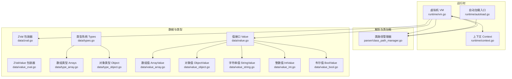
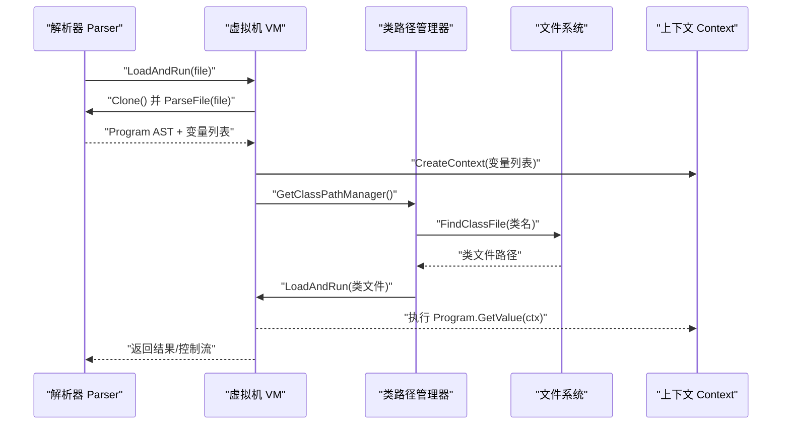
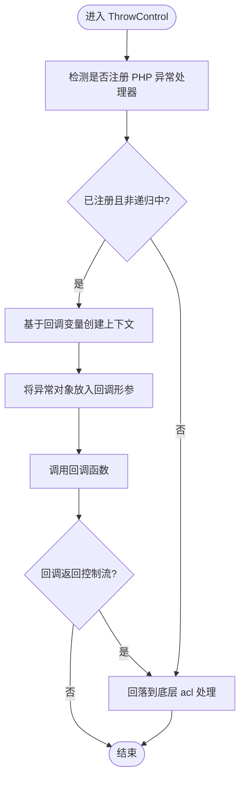
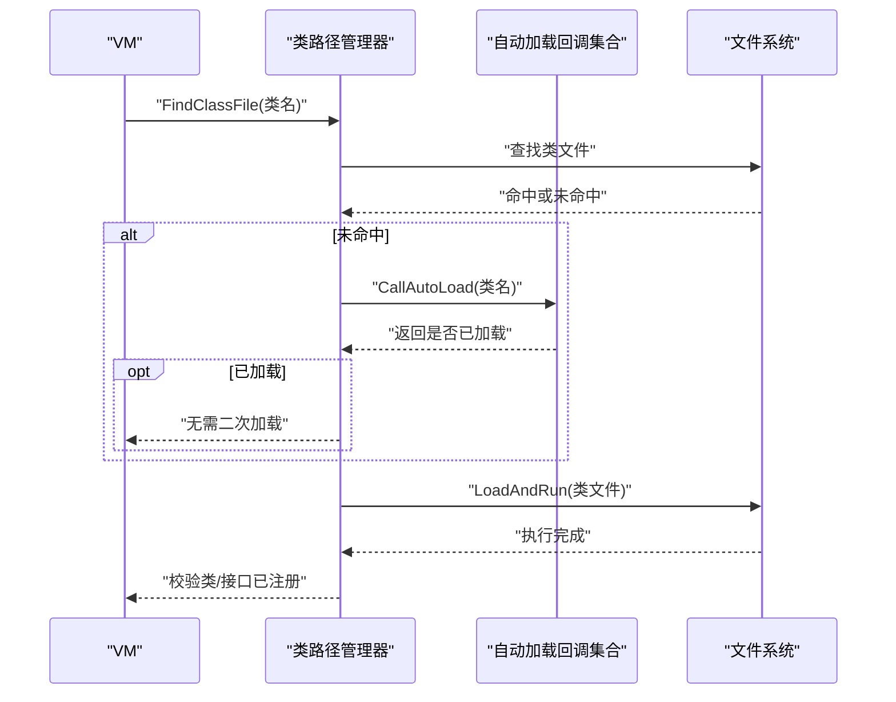
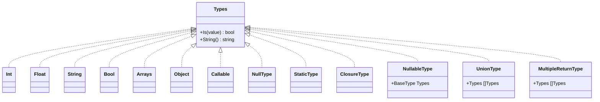
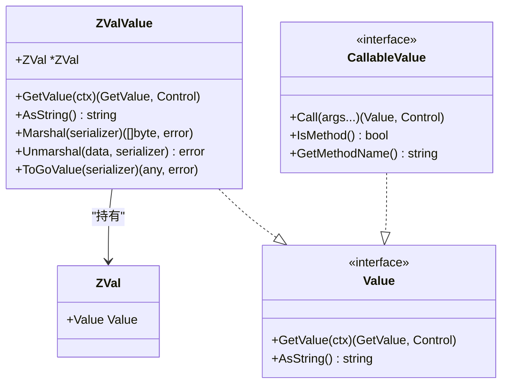
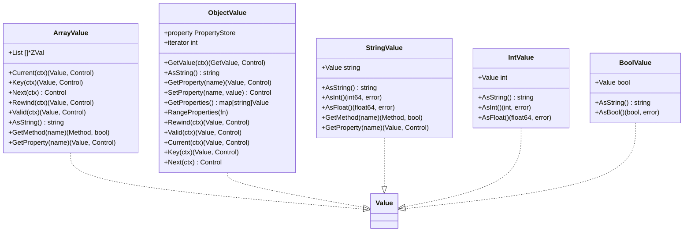
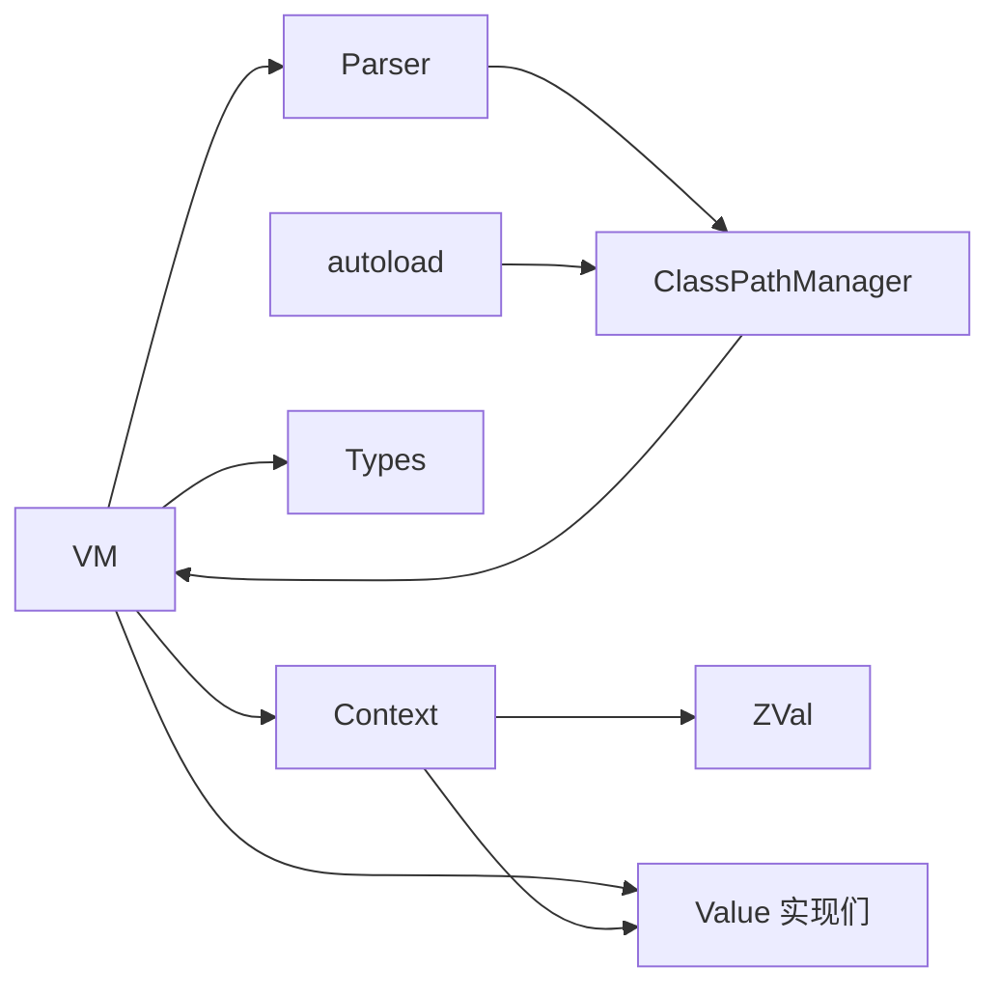

# 运行时系统

<cite>
**本文引用的文件**
- [runtime/vm.go](file://runtime/vm.go)
- [runtime/context.go](file://runtime/context.go)
- [runtime/autoload.go](file://runtime/autoload.go)
- [parser/class_path_manager.go](file://parser/class_path_manager.go)
- [data/zval.go](file://data/zval.go)
- [data/value_zval.go](file://data/value_zval.go)
- [data/value.go](file://data/value.go)
- [data/types.go](file://data/types.go)
- [data/type_array.go](file://data/type_array.go)
- [data/type_object.go](file://data/type_object.go)
- [data/value_array.go](file://data/value_array.go)
- [data/value_object.go](file://data/value_object.go)
- [data/value_string.go](file://data/value_string.go)
- [data/value_int.go](file://data/value_int.go)
- [data/value_bool.go](file://data/value_bool.go)
</cite>

## 目录
1. [简介](#简介)
2. [项目结构](#项目结构)
3. [核心组件](#核心组件)
4. [架构总览](#架构总览)
5. [详细组件分析](#详细组件分析)
6. [依赖分析](#依赖分析)
7. [性能考量](#性能考量)
8. [故障排查指南](#故障排查指南)
9. [结论](#结论)
10. [附录](#附录)

## 简介
本文件面向Origami运行时系统的开发者与维护者，系统性阐述虚拟机实现原理、类型系统设计、上下文与变量管理、自动加载与类加载策略，以及性能优化要点。文档以“自底向上”的方式组织，先给出整体架构，再逐层剖析关键模块，辅以多种可视化图示帮助理解。

## 项目结构
运行时相关的核心代码主要分布在以下模块：
- 运行时虚拟机与上下文：runtime/vm.go、runtime/context.go、runtime/autoload.go
- 类路径与自动加载：parser/class_path_manager.go
- 数据模型与类型系统：data/*.go（zval、值包装器、类型判定、数组/对象/字符串/整数/布尔等）

图表来源
- [runtime/vm.go:14-391](file://runtime/vm.go#L14-L391)
- [runtime/context.go:12-140](file://runtime/context.go#L12-L140)
- [runtime/autoload.go:1-15](file://runtime/autoload.go#L1-L15)
- [parser/class_path_manager.go:13-428](file://parser/class_path_manager.go#L13-L428)
- [data/zval.go:1-18](file://data/zval.go#L1-L18)
- [data/value_zval.go:1-41](file://data/value_zval.go#L1-L41)
- [data/value.go:1-39](file://data/value.go#L1-L39)
- [data/types.go:1-262](file://data/types.go#L1-L262)
- [data/type_array.go:1-20](file://data/type_array.go#L1-L20)
- [data/type_object.go:1-19](file://data/type_object.go#L1-L19)
- [data/value_array.go:1-162](file://data/value_array.go#L1-L162)
- [data/value_object.go:1-190](file://data/value_object.go#L1-L190)
- [data/value_string.go:1-86](file://data/value_string.go#L1-L86)
- [data/value_int.go:1-52](file://data/value_int.go#L1-L52)
- [data/value_bool.go:1-47](file://data/value_bool.go#L1-L47)

章节来源
- [runtime/vm.go:14-391](file://runtime/vm.go#L14-L391)
- [runtime/context.go:12-140](file://runtime/context.go#L12-L140)
- [runtime/autoload.go:1-15](file://runtime/autoload.go#L1-L15)
- [parser/class_path_manager.go:13-428](file://parser/class_path_manager.go#L13-L428)
- [data/zval.go:1-18](file://data/zval.go#L1-L18)
- [data/value_zval.go:1-41](file://data/value_zval.go#L1-L41)
- [data/value.go:1-39](file://data/value.go#L1-L39)
- [data/types.go:1-262](file://data/types.go#L1-L262)
- [data/type_array.go:1-20](file://data/type_array.go#L1-L20)
- [data/type_object.go:1-19](file://data/type_object.go#L1-L19)
- [data/value_array.go:1-162](file://data/value_array.go#L1-L162)
- [data/value_object.go:1-190](file://data/value_object.go#L1-L190)
- [data/value_string.go:1-86](file://data/value_string.go#L1-L86)
- [data/value_int.go:1-52](file://data/value_int.go#L1-L52)
- [data/value_bool.go:1-47](file://data/value_bool.go#L1-L47)

## 核心组件
- 虚拟机 VM：负责类/接口/函数/常量注册、全局变量与常量表、异常处理回调、文件解析与执行、上下文创建与传递。
- 上下文 Context：持有变量符号表、命名空间、调用实参列表，提供变量读写、函数上下文派生、VM绑定切换。
- 类路径管理器 ClassPathManager：维护命名空间到物理路径的映射，支持大小写不敏感查找、动态子目录识别、自动加载回调触发。
- 数据与类型系统：以ZVal为核心包装器，围绕Value接口扩展数组、对象、字符串、整数、布尔等具体值类型；类型系统提供基础类型、联合类型、可空类型、静态类型等判定能力。

章节来源
- [runtime/vm.go:14-391](file://runtime/vm.go#L14-L391)
- [runtime/context.go:12-140](file://runtime/context.go#L12-L140)
- [parser/class_path_manager.go:13-428](file://parser/class_path_manager.go#L13-L428)
- [data/zval.go:1-18](file://data/zval.go#L1-L18)
- [data/value_zval.go:1-41](file://data/value_zval.go#L1-L41)
- [data/value.go:1-39](file://data/value.go#L1-L39)
- [data/types.go:1-262](file://data/types.go#L1-L262)

## 架构总览
运行时采用“解析-加载-执行”三段式流程：解析器生成AST并交由VM执行；VM通过类路径管理器定位并加载类/接口；执行期间通过Context管理变量与调用栈；类型系统贯穿于值转换与运行时类型检查。

图表来源
- [runtime/vm.go:275-332](file://runtime/vm.go#L275-L332)
- [parser/class_path_manager.go:327-382](file://parser/class_path_manager.go#L327-L382)

## 详细组件分析

### 虚拟机 VM
职责与特性
- 注册与查询：类、接口、函数、常量、全局变量表；带并发安全的读写锁。
- 异常处理：优先调用PHP侧set_exception_handler回调，避免递归；否则回落至底层处理。
- 自动加载：委托给类路径管理器，支持自动加载回调链。
- 文件执行：克隆解析器、解析文件、创建上下文、注册全局变量、执行程序并返回值。

关键流程示意（异常处理优先级）

图表来源
- [runtime/vm.go:73-104](file://runtime/vm.go#L73-L104)

章节来源
- [runtime/vm.go:14-391](file://runtime/vm.go#L14-L391)

### 上下文 Context
职责与特性
- 符号表：按变量索引存取ZVal，提供Get/Set语义与拷贝策略（数组/对象按结构级克隆）。
- 函数上下文：按变量数量预分配切片，初始化为null。
- 调用参数：记录本次调用的实参表达式列表，供func_get_args等内置使用。
- VM绑定：支持替换绑定的VM，便于跨VM迁移或测试。

章节来源
- [runtime/context.go:12-140](file://runtime/context.go#L12-L140)

### 自动加载与类加载策略
- 自动加载：通过AddAutoLoad/RemoveAutoLoad注册回调；CallAutoLoad遍历回调，传入类名，根据返回值决定是否已加载。
- 类路径管理：命名空间-路径DAG，支持大小写不敏感的目录/文件查找；动态识别子目录；避免重复加载；提前加载接口依赖。
- 加载流程：FindClassFile定位文件；若未找到触发自动加载；成功后LoadAndRun执行文件并校验类/接口是否定义。

图表来源
- [parser/class_path_manager.go:327-382](file://parser/class_path_manager.go#L327-L382)
- [runtime/autoload.go:8-15](file://runtime/autoload.go#L8-L15)

章节来源
- [parser/class_path_manager.go:13-428](file://parser/class_path_manager.go#L13-L428)
- [runtime/autoload.go:1-15](file://runtime/autoload.go#L1-L15)

### 类型系统与运行时类型检查
- 基础类型：int、float、string、bool、array、object、callable、null、static/self、closure等。
- 组合类型：联合类型（|）、可空类型（?T）、多返回值类型（用于特定场景）。
- 类型判定：Types接口统一提供Is(value)判断；String()用于显示；NullableType/UnionType/MultipleReturnType分别实现组合规则。
- 运行时类型检查：在方法调用、属性访问、函数返回等位置进行类型约束验证（例如ClosureType允许FuncValue/ArrayValue/StringValue等）。

图表来源
- [data/types.go:5-262](file://data/types.go#L5-L262)
- [data/type_array.go:1-20](file://data/type_array.go#L1-L20)
- [data/type_object.go:1-19](file://data/type_object.go#L1-L19)

章节来源
- [data/types.go:1-262](file://data/types.go#L1-L262)
- [data/type_array.go:1-20](file://data/type_array.go#L1-L20)
- [data/type_object.go:1-19](file://data/type_object.go#L1-L19)

### 值包装器与ZVal
- ZVal：最小化包装器，保存一个Value接口，作为变量存储的基本单元。
- ZValValue：将ZVal作为Value暴露，支持序列化协议委托给内部Value实现。
- Value接口：统一GetValue与AsString；CallableValue扩展可调用语义；GetProperty/PropertyZVal/SetProperty等属性访问接口。

图表来源
- [data/zval.go:1-18](file://data/zval.go#L1-L18)
- [data/value_zval.go:1-41](file://data/value_zval.go#L1-L41)
- [data/value.go:1-39](file://data/value.go#L1-L39)

章节来源
- [data/zval.go:1-18](file://data/zval.go#L1-L18)
- [data/value_zval.go:1-41](file://data/value_zval.go#L1-L41)
- [data/value.go:1-39](file://data/value.go#L1-L39)

### 数组与对象值的内存管理策略
- 数组ArrayValue：迭代器游标、方法族（push/pop/shift/unshift/slice/splice/join/reverse/sort/...）；结构级浅拷贝（仅复制切片，元素仍按ZVal语义共享）。
- 对象ObjectValue：属性存储采用有序Map，提供按插入顺序遍历；属性赋值时对数组/对象值进行结构级克隆，避免多处共享导致的副作用。
- 字符串/整数/布尔：基础类型值，提供类型转换辅助方法（如字符串转数字、布尔转换等）。

图表来源
- [data/value_array.go:1-162](file://data/value_array.go#L1-L162)
- [data/value_object.go:1-190](file://data/value_object.go#L1-L190)
- [data/value_string.go:1-86](file://data/value_string.go#L1-L86)
- [data/value_int.go:1-52](file://data/value_int.go#L1-L52)
- [data/value_bool.go:1-47](file://data/value_bool.go#L1-L47)

章节来源
- [data/value_array.go:1-162](file://data/value_array.go#L1-L162)
- [data/value_object.go:1-190](file://data/value_object.go#L1-L190)
- [data/value_string.go:1-86](file://data/value_string.go#L1-L86)
- [data/value_int.go:1-52](file://data/value_int.go#L1-L52)
- [data/value_bool.go:1-47](file://data/value_bool.go#L1-L47)

## 依赖分析
- VM依赖Parser与Context，间接依赖各类Value与Types。
- Context依赖ZVal与Value接口，提供变量存取与上下文派生。
- 类路径管理器独立于VM，但通过VM的LoadAndRun与缓存机制参与类加载闭环。
- 自动加载通过回调函数与Parser交互，形成解耦的扩展点。

图表来源
- [runtime/vm.go:14-391](file://runtime/vm.go#L14-L391)
- [runtime/context.go:12-140](file://runtime/context.go#L12-L140)
- [parser/class_path_manager.go:13-428](file://parser/class_path_manager.go#L13-L428)
- [runtime/autoload.go:1-15](file://runtime/autoload.go#L1-L15)

章节来源
- [runtime/vm.go:14-391](file://runtime/vm.go#L14-L391)
- [runtime/context.go:12-140](file://runtime/context.go#L12-L140)
- [parser/class_path_manager.go:13-428](file://parser/class_path_manager.go#L13-L428)
- [runtime/autoload.go:1-15](file://runtime/autoload.go#L1-L15)

## 性能考量
- 变量存储与赋值
  - 数组与对象在赋值时进行结构级克隆，避免共享导致的写时复制复杂度与竞态问题，但需注意克隆成本；可通过减少深层嵌套与大对象频繁赋值降低开销。
- 并发安全
  - VM在类/接口/函数/常量/全局变量表操作上使用读写锁，建议批量注册与一次性加载策略，减少锁竞争。
- 自动加载与重复加载
  - 类路径管理器通过缓存类文件路径避免重复解析；自动加载回调应尽快返回，避免阻塞主执行路径。
- 序列化与类型检查
  - 类型判定与序列化均委托给具体Value实现，建议在高频路径中复用已判定类型或缓存序列化结果。

## 故障排查指南
- 类/接口未找到
  - 检查命名空间路径是否正确注册；确认文件名与类名一致；查看自动加载回调是否返回已加载。
- 重复加载类
  - 类路径管理器会检测重复加载并报错；请检查类文件是否被多次引入。
- 异常处理未生效
  - 确认PHP侧set_exception_handler是否注册；避免在回调内部再次抛出未捕获异常导致递归。
- 变量越界或未定义
  - 检查变量索引是否超出符号表长度；确认变量在当前作用域内已声明。

章节来源
- [parser/class_path_manager.go:327-382](file://parser/class_path_manager.go#L327-L382)
- [runtime/vm.go:73-116](file://runtime/vm.go#L73-L116)
- [runtime/context.go:43-87](file://runtime/context.go#L43-L87)

## 结论
Origami运行时以VM为中心，结合上下文、类型系统与类路径管理器，实现了可扩展、可调试、可优化的PHP语言运行环境。通过ZVal与Value接口抽象，运行时在保持类型安全的同时兼顾性能；自动加载与类路径管理器提供了灵活的模块化加载策略。开发者可在上述组件基础上进行二次开发与性能优化。

## 附录
- 术语说明
  - ZVal：变量存储的最小单元，封装具体值。
  - Value：值的统一接口，支持类型转换与序列化。
  - Types：类型判定接口，支持基础类型、联合类型、可空类型等。
  - Context：运行时上下文，维护变量符号表与调用参数。
  - ClassPathManager：类路径管理器，负责命名空间到文件路径的映射与自动加载。