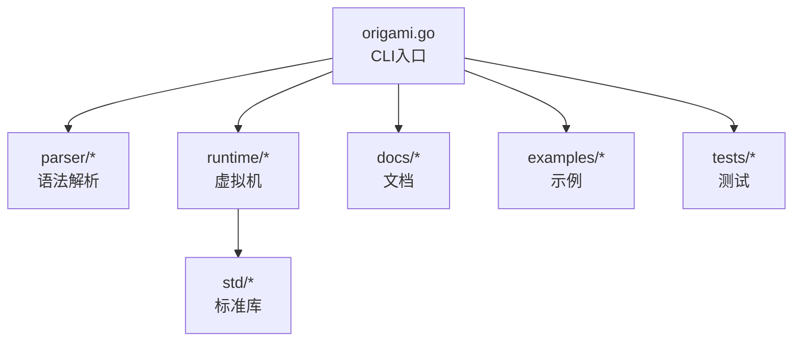
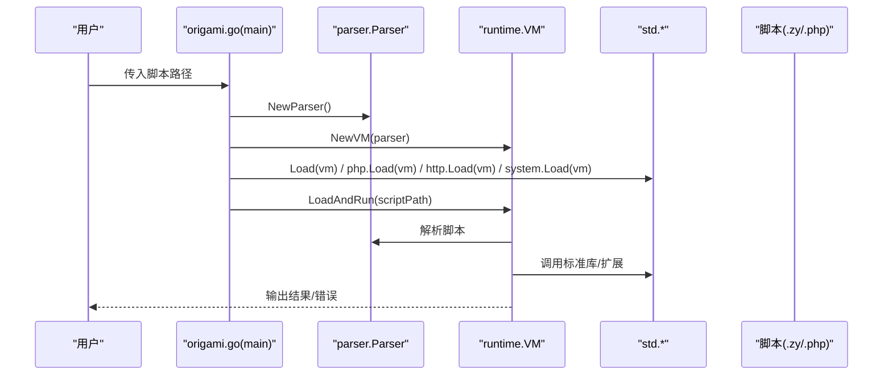
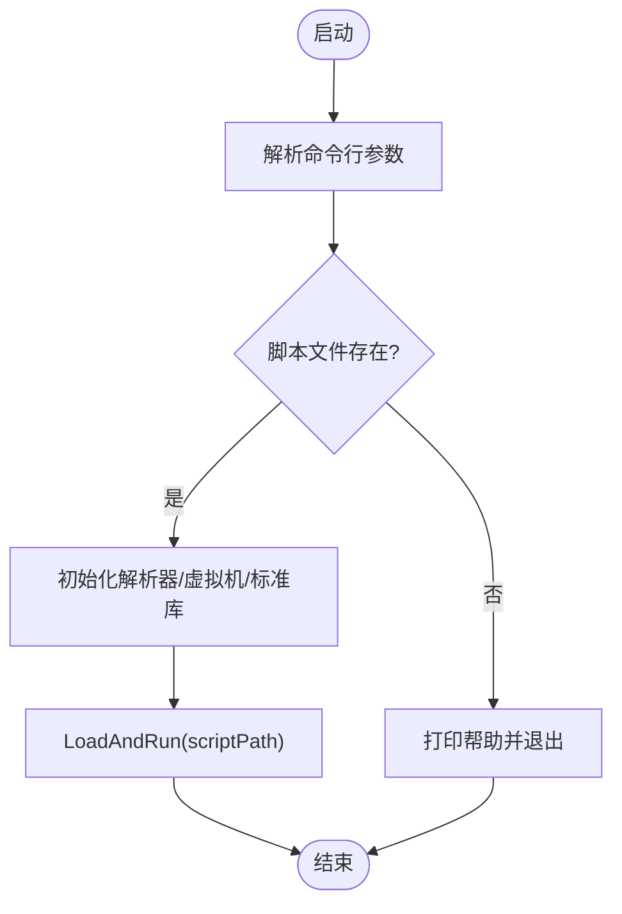
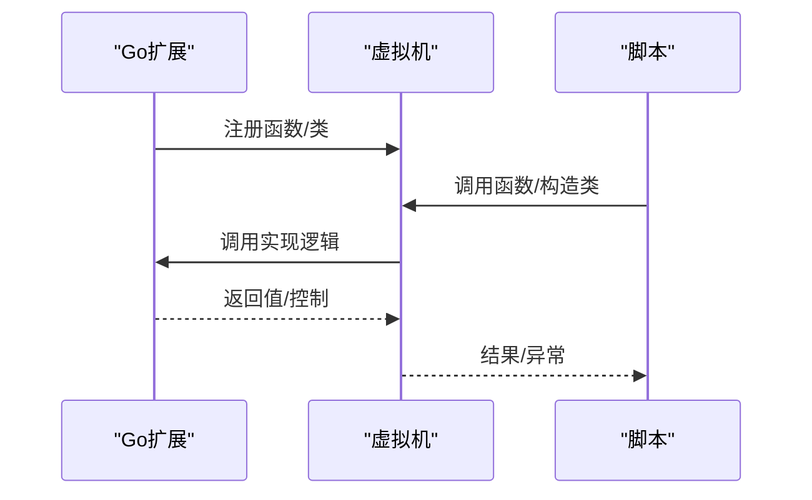
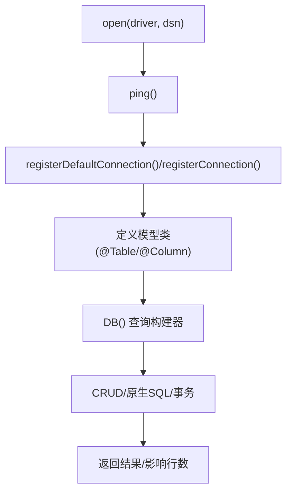
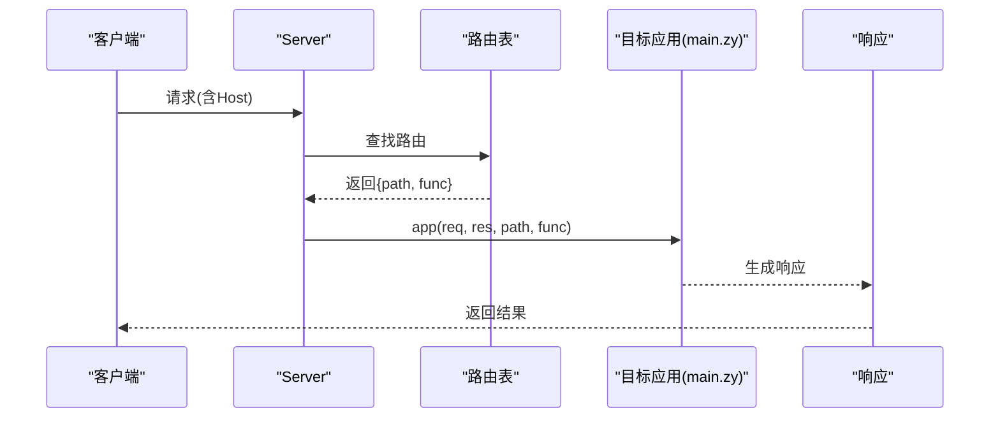
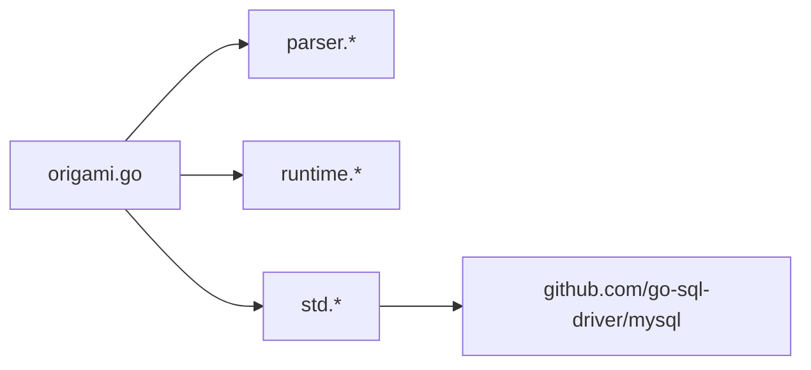

# 项目概述

<cite>
**本文引用的文件**
- [README.md](file://README.md)
- [README_CN.md](file://README_CN.md)
- [origami.go](file://origami.go)
- [go.mod](file://go.mod)
- [docs/README.md](file://docs/README.md)
- [docs/quickstart.md](file://docs/quickstart.md)
- [docs/syntax.md](file://docs/syntax.md)
- [docs/go-integration.md](file://docs/go-integration.md)
- [docs/database.md](file://docs/database.md)
- [performance_comparison.md](file://performance_comparison.md)
- [examples/database/database.zy](file://examples/database/database.zy)
- [examples/gateway/main.zy](file://examples/gateway/main.zy)
</cite>

## 目录
1. [简介](#简介)
2. [项目结构](#项目结构)
3. [核心组件](#核心组件)
4. [架构总览](#架构总览)
5. [详细组件分析](#详细组件分析)
6. [依赖关系分析](#依赖关系分析)
7. [性能考量](#性能考量)
8. [故障排查指南](#故障排查指南)
9. [结论](#结论)
10. [附录](#附录)

## 简介
Origami（折言）是一门融合型脚本语言，旨在将 PHP 的快速开发体验与 Go 的高效并发模型相结合，并引入 Java 与 TypeScript 的部分习惯，形成独特的语法融合特性。它提供：
- 易用的 PHP 兼容语法与生态
- Go 反射集成与零配置注册
- 协程关键字“spawn”与泛型类支持
- HTML 内嵌、鸭子类型“like”、中文关键字、函数式数组方法等特色
- 丰富的标准库与数据库 ORM 能力

项目当前处于开发阶段，明确标注“未优化、性能尚未优化”，建议仅作为工具使用，不应用于生产环境。

**章节来源**
- [README.md:1-69](file://README.md#L1-L69)
- [README_CN.md:1-69](file://README_CN.md#L1-L69)

## 项目结构
仓库采用模块化组织，核心目录与职责如下：
- 根目录入口与构建：origami.go（CLI 入口）、go.mod（依赖与工具链）
- 语言核心：lexer（词法分析）、parser（语法解析）、node（AST 节点）、runtime（虚拟机与执行）
- 标准库：std（标准库模块，含数据库、网络、反射、日志、系统等）
- 文档：docs（语言参考、快速开始、Go 集成、数据库模块等）
- 示例：examples（数据库、HTTP、网关、Spring、团队导航等）
- 测试：tests（语言与标准库行为验证）

**图表来源**
- [origami.go:34-67](file://origami.go#L34-L67)

**章节来源**
- [origami.go:1-68](file://origami.go#L1-L68)
- [go.mod:1-19](file://go.mod#L1-L19)

## 核心组件
- CLI 与运行时
  - CLI 入口负责加载解析器、初始化全局命名空间、注册标准库模块，并执行脚本。
  - 支持 .zy 与 .php 脚本文件，具备基本的帮助输出与错误提示。
- 语法与类型系统
  - 支持 PHP 兼容语法、Go 并发关键字“spawn”、类型声明与可空类型、泛型类等。
  - 提供丰富的数组与字符串方法，便于函数式编程风格。
- Go 集成
  - 通过反射将 Go 函数与结构体注册到脚本域，自动类型转换，支持命名参数。
- 标准库
  - 包含数据库 ORM、HTTP 服务、日志、系统时间、反射、序列化等模块。
- 示例与文档
  - 提供快速开始、语法参考、Go 集成指南、数据库模块等文档，以及多种示例工程。

**章节来源**
- [origami.go:34-67](file://origami.go#L34-L67)
- [docs/quickstart.md:1-262](file://docs/quickstart.md#L1-L262)
- [docs/syntax.md:1-602](file://docs/syntax.md#L1-L602)
- [docs/go-integration.md:1-643](file://docs/go-integration.md#L1-L643)
- [docs/database.md:1-643](file://docs/database.md#L1-L643)

## 架构总览
下图展示从 CLI 到解析、运行与标准库加载的整体流程：

**图表来源**
- [origami.go:34-67](file://origami.go#L34-L67)

**章节来源**
- [origami.go:34-67](file://origami.go#L34-L67)

## 详细组件分析

### CLI 与运行时
- 初始化流程
  - 创建解析器与全局命名空间扫描路径
  - 初始化虚拟机并加载标准库模块
  - 校验命令行参数与脚本文件存在性
  - 执行脚本并处理错误控制
- 关键点
  - 支持 .zy 与 .php 文件
  - 错误时通过解析器控制台提示辅助定位

**图表来源**
- [origami.go:47-67](file://origami.go#L47-L67)

**章节来源**
- [origami.go:34-67](file://origami.go#L34-L67)

### 语法与类型系统
- 文件与命名空间
  - 支持 .zy 与 .php 扩展名；可选命名空间声明
- 变量与类型
  - 类型声明（int/string/bool/float/object/class/array/null/void）
  - 可空类型（?T）
- 运算符与控制结构
  - 算术、比较、逻辑、空合并、赋值等
  - 条件、循环、分支、跳转
- 函数与类
  - 函数支持默认参数、可变参数、命名参数调用
  - 类支持继承、接口、构造函数、Getter/Setter
- 特殊语法
  - HTML 内嵌、模板字符串、match 语句、like 鸭子类型检查
- 数组与字符串方法
  - 丰富的数组与字符串方法，便于函数式编程

**章节来源**
- [docs/syntax.md:5-602](file://docs/syntax.md#L5-L602)

### Go 集成
- 目标
  - 将 Go 函数与结构体注册为脚本函数/类，实现零配置、自动类型转换与命名参数支持
- 方式
  - 实现函数/类接口，注册到虚拟机
  - 在脚本中像调用本地函数一样调用 Go 代码
- 示例主题
  - HTTP 客户端、数据库查询、文件系统读写等

**图表来源**
- [docs/go-integration.md:16-278](file://docs/go-integration.md#L16-L278)

**章节来源**
- [docs/go-integration.md:1-643](file://docs/go-integration.md#L1-L643)

### 标准库与数据库模块
- 数据库模块
  - 连接管理（默认/命名连接注册与使用）
  - 注解驱动模型映射（@Table/@Column/@Id/@GeneratedValue）
  - 查询构建器（where/select/orderBy/groupBy/limit/offset/join）
  - CRUD 操作与原生 SQL 支持
  - 事务、批量操作、复杂查询与性能优化建议
- 示例
  - SQLite 示例演示建表、模型定义、CRUD、关联查询、分页与统计

**图表来源**
- [docs/database.md:18-103](file://docs/database.md#L18-L103)

**章节来源**
- [docs/database.md:1-643](file://docs/database.md#L1-L643)
- [examples/database/database.zy:1-207](file://examples/database/database.zy#L1-L207)

### 示例：API 网关
- 功能
  - 基于 Host 头路由到不同应用（demo、spring 等）
  - 使用 app() 动态加载隔离执行
  - 中间件日志与异常处理
- 场景
  - 多应用统一入口、动态路由与隔离执行

**图表来源**
- [examples/gateway/main.zy:16-103](file://examples/gateway/main.zy#L16-L103)

**章节来源**
- [examples/gateway/main.zy:1-103](file://examples/gateway/main.zy#L1-L103)

## 依赖关系分析
- 语言运行时
  - CLI 依赖解析器与运行时模块
  - 运行时加载标准库模块（std、php、http、system）
- 外部依赖
  - MySQL 驱动（用于数据库示例）
  - 其他间接依赖（如加密、工具链等）

**图表来源**
- [origami.go:7-14](file://origami.go#L7-L14)
- [go.mod:7-18](file://go.mod#L7-L18)

**章节来源**
- [origami.go:1-68](file://origami.go#L1-L68)
- [go.mod:1-19](file://go.mod#L1-L19)

## 性能考量
- 当前状态
  - 项目明确标注“未优化、性能尚未优化”，请勿用于生产环境
- 性能测试
  - 与 Python 3 的百万次赋值/运算对比显示：Origami 执行时间约为 Python 3 的 1.55 倍，每秒操作数约为 920 万次
  - 影响因素包括：解释型语言特性、循环结构差异、开发阶段优化空间
- 建议
  - 优先满足开发效率与易用性，后续版本可进一步优化

**章节来源**
- [README.md:7-11](file://README.md#L7-L11)
- [performance_comparison.md:1-54](file://performance_comparison.md#L1-L54)

## 故障排查指南
- 常见问题
  - 文件不存在：CLI 会提示错误并输出帮助
  - 运行测试：可通过 tests/run_tests.zy 验证语言功能
  - Go 集成：注意类型断言与默认值、资源清理、参数校验
  - 数据库：连接失败使用 try-catch 捕获；调试可使用 EXPLAIN 或原生 SQL
- 调试技巧
  - 使用日志输出与中间件日志
  - 参数验证与恢复处理
  - 合理使用索引与分页，避免大结果集

**章节来源**
- [origami.go:47-67](file://origami.go#L47-L67)
- [docs/go-integration.md:534-643](file://docs/go-integration.md#L534-L643)
- [docs/database.md:582-643](file://docs/database.md#L582-L643)

## 结论
Origami 将 PHP 的易用性与 Go 的并发能力融合，提供了一套兼具生产力与扩展性的脚本语言方案。尽管当前仍处于开发阶段，但已具备完善的语法、标准库与示例，适合学习、原型开发与工具化场景。建议在非生产环境中使用，并关注后续性能优化与生态完善。

## 附录
- 快速开始
  - 创建 .zy/.php 脚本，使用类型声明、数组/字符串方法与函数式风格
- 文档导航
  - 快速开始、语法参考、Go 集成、数据库模块、标准库 API
- 社区与许可
  - 讨论群二维码、MIT 许可证

**章节来源**
- [docs/README.md:1-87](file://docs/README.md#L1-L87)
- [README.md:43-69](file://README.md#L43-L69)
- [README_CN.md:43-69](file://README_CN.md#L43-L69)