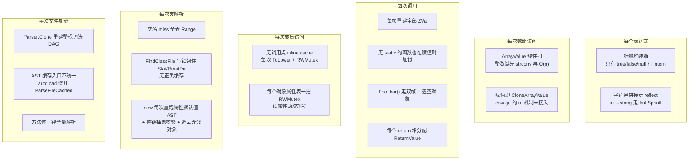
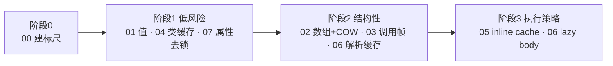

# Origami 性能优化方案总索引

本目录是 Origami 解释器的**内核性能改造方案集**。每份子文档是一张**可独立分派的施工单**：拿到单份文档的模型/开发者不需要读其他文档，就能完成一次完整的、可提交、可回归的改动。

与 [../performance.md](../performance.md) 的分工：那份（待补）面向脚本作者，讲「怎么写快的 PHP」；本目录面向解释器开发者，讲「怎么让解释器变快」。

## 施工前必读的三条硬约束

来自仓库根 [../../AGENTS.md](../../AGENTS.md)，任何一份方案都不得违反：

1. **不改 PHP 来跳过问题。** 禁止改 `vendor/`、示例 `app/`、加 `@`、加 `isset` 护栏来掩盖解释器缺陷。性能改造同理：不允许通过"少做一件 PHP 该做的事"来变快。
2. **不在 `Call()`、每方法/函数、`json_encode` 等热路径插追踪。** 所有度量走进程外采样（见 [00-baseline-and-metrics.md](00-baseline-and-metrics.md)）。临时日志用完必须拆掉。
3. **对齐 PHP 语义优先于性能。** 任何一步优化如果与 PHP 行为冲突，放弃该步优化，而不是接受行为偏差。

## 瓶颈全景

按「单位时间内被执行的次数 × 单次成本」排序，当前解释器的主要开销集中在六个层面：



## 方案清单与分派表

每份文档标注了**独占文件**（该施工单唯一有权修改的文件）和**前置依赖**。并行分派时必须遵守依赖顺序，否则会在同一文件上撞车。

- **[00-baseline-and-metrics.md](00-baseline-and-metrics.md) — 基线与度量设施**
  - 独占：`bench/`（新建）、`scripts/bench/`（新建）、`cmd/root.go`
  - 前置：无。**这是所有其他方案的前置**，没有标尺就无法证明优化有效。
  - 一句话：建 Go Benchmark 套件 + 进程外 pprof 采样 + PHP 官方对照 + Laravel 压测脚本。

- **[01-values-and-boxing.md](01-values-and-boxing.md) — 标量装箱与字符串**
  - 独占：`data/value_intern.go`、`data/value_int.go`、`data/value_string.go`、`data/value_float.go`、`data/scalar_fast.go`、`node/binary_dot.go`、`node/binary_link.go`、`node/string_literal.go`
  - 前置：00
  - 一句话：小整数/短字符串 intern、字符串字面量缓存、`BinaryDot` 去 `reflect`、`AsString` 去 `fmt`。

- **[02-array-hashing-and-cow.md](02-array-hashing-and-cow.md) — 数组哈希化与真 COW**
  - 独占：`data/value_array.go`、`data/cow.go`、`node/array.go`、`node/index.go`、`runtime/context.go` 的 `SetVariableValue`
  - 前置：00
  - 一句话：给 `ArrayValue` 加惰性哈希索引把 O(n) 降到 O(1)；把变量赋值从 eager clone 换成已经写好但没接上的 `rc` COW。

- **[03-call-frames.md](03-call-frames.md) — 调用帧与参数绑定**
  - 独占：`runtime/context.go` 的 `CreateContext`/`resetVariables`、`data/static_locals.go`、`data/value_return.go`、`node/function.go`、`node/call.go`、`node/call_fast.go`、`node/call_static_method.go`、`std/php/**` 的 `GetParams`/`GetVariables`
  - 前置：00、**02**（两者都改 `runtime/context.go`，02 先落地）
  - 一句话：ZVal arena 化、`static` 惰性绑定消除热路径 Mutex、静态调用去第二帧、`ReturnControl` 去分配、内置函数签名常驻化。

- **[04-class-manager.md](04-class-manager.md) — 类管理器与实例化**
  - 独占：`runtime/vm.go` 的类/接口注册与查找、`parser/class_path_manager.go`、`node/class.go` 的 `ClassStatement.GetValue`、`node/static_property_lookup.go`、`data/type_class.go`
  - 前置：00
  - 一句话：小写索引 + 负缓存替掉全表 `Range`；`FindClassFile` 加正负缓存并降为读锁；`new` 的属性默认值模板化、抽象校验缓存、去掉丢弃的父对象。

- **[05-inline-caches.md](05-inline-caches.md) — 调用点与属性 inline cache**
  - 独占：`node/call_object_method.go`、`node/call_object_property.go`、`data/method_lookup_cache.go`、`data/value_class.go` 的方法查找
  - 前置：00、**04**（IC 的失效协议依赖 04 建立的 class generation）、**07**（属性 IC 依赖 07 的属性槽）
  - 一句话：在 AST 节点上缓存 `(类, 方法/属性槽, generation)`，命中即跳过整条查找链。

- **[06-parse-and-opcache.md](06-parse-and-opcache.md) — 词法/解析与 AST 缓存**
  - 独占：`lexer/lexer.go`、`lexer/worker_token.go`、`parser/parser.go` 的 `Clone`/`reset`、`runtime/parse_cache.go`、`runtime/vm.go` 的 `LoadAndRun`、`runtime/vm_temp.go`、`std/vendoraccel/warmup.go`
  - 前置：00、**04**（同改 `runtime/vm.go`，04 先落地）
  - 一句话：词法 DAG 进程单例、token 值切片化、**所有加载入口统一走 `ParseFileCached`**、warmup 去重复解析、方法体延迟解析。

- **[07-object-property-store.md](07-object-property-store.md) — 对象属性存储**
  - 独占：`data/ordered_map.go`、`data/value_object.go`、`data/value_class.go` 的属性读写
  - 前置：00
  - 一句话：`OrderedMap` 去 `RWMutex`、`HasProperty`+`GetProperty` 合并为一次查找、声明属性按编译期 slot 索引、`Delete` 去 O(n) 重建。

### 文件级冲突矩阵

三个文件被多份方案触及，必须串行：

- `runtime/context.go`：02（`SetVariableValue`）→ 03（`CreateContext`/`resetVariables`）
- `runtime/vm.go`：04（类查找）→ 06（`LoadAndRun`）
- `data/value_class.go`：07（属性读写）→ 05（方法查找 IC）
- `node/class.go`：04（`ClassStatement.GetValue`，即 `new` 路径）与 03（`ClassMethod.Call`）是同文件不同函数，可并行但**必须分别提交**，由后合并者负责 rebase。

## 阶段路线图



阶段划分依据是**语义风险**，不是收益大小：

- 阶段 1 都是"加缓存 / 去锁 / 换等价实现"，不改变任何可观察语义。
- 阶段 2 动的是值语义（COW 分离时机）和帧生命周期（ZVal 复用），一旦做错会表现为**跨调用的诡异串值**，必须配套引用相关的回归。
- 阶段 3 依赖前两阶段建立的 generation 失效机制，单独做会缓存到脏数据。

## 度量协议（所有方案共用）

每份施工单的收尾都必须给出这三组数字，缺一不算完成。具体命令见 [00-baseline-and-metrics.md](00-baseline-and-metrics.md)。

1. **微基准增量**：`go test -bench` 前后对比，带 `-benchmem` 的 `allocs/op`。声明改动针对的具体 Benchmark 名。
2. **端到端不回退**：`tests/run_tests.php` 全绿，`examples/laravel13` 能起并响应首页。
3. **分配画像**：`-memprofile` 前后对比，证明目标分配点确实消失，而不是搬到别处。

## 统一验收门槛

每份施工单合并前必须满足：

```bash
# 1. Go 单测
go build ./... && go test ./...

# 2. PHP 语义全量回归（红色输出即失败）
go run ./zy.go tests/run_tests.php

# 3. 本方案新增的最小回归
go run ./zy.go tests/php/<本方案指定的测试文件>.php

# 4. Laravel 13 端到端
cd examples/laravel13 && go run -mod=mod . serve --port=18086
```

补测试的规矩来自 AGENTS.md：核心修好后补 `tests/php/` 最小回归。**性能改动同样要补语义测试**——性能优化最常见的失败模式不是变慢，而是悄悄改变了行为。每份方案都指定了必须新增的测试文件名与要覆盖的场景。

## 现有的性能相关资产

施工时可以复用，也需要知道它们的局限：

- `performance_comparison.md`（仓库根）：一次性微基准，一百万次赋值+乘+加，记录 Origami 约为 Python 的 1.55 倍耗时。**无机器信息、无复跑协议、无 PHP 官方对照**，只能当历史参考。
- `runtime/parse_cache.go` 的 `ParseFileCached`：进程级 AST 缓存，已工作但入口未统一（见 06）。
- `runtime/vm.go` 的 `phpFileCache`：文件级"已加载"标记，语义是跳过执行，不是缓存 AST。
- `data/cow.go`：完整的 `rc` / `CowAssign` / `CowSeparateZVal`，**已实现但变量赋值路径没用**（见 02）。
- `data/method_lookup_cache.go`：per-class 方法解析缓存，含负缓存和 `gen` 失效，是 05 的 IC 失效协议的基础。
- `data/value_intern.go`：目前只 intern 了 `true`/`false`/`null`（见 01）。
- `std/vendoraccel`：Laravel vendor 预热 + Go 原生类替换，`ORIGAMI_LARAVEL_PRELOAD=1` 让 artisan 也预热。
- `runtime/context.go` 的 `contextPool`：`sync.Pool`，只回收 `Context` 壳（见 03）。

需要知道**不存在**的东西：没有任何 `Benchmark*` 函数、没有 pprof/trace 接入点、没有压测脚本。这是 00 要补的。
