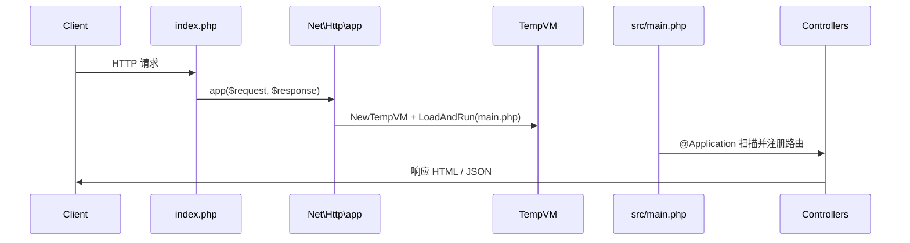

# 团队导航页（team-navigation）

基于 Origami 的团队内部导航示例：集中管理常用工具链接、各项目多环境入口与搜索引擎配置。数据持久化在 SQLite，前后端分离（注解路由 + REST API + 静态资源）。

## 功能特性

- **常用工具导航**：GitLab、Jira、Jenkins 等链接，支持收藏与排序
- **项目与环境**：按项目展示开发 / 测试 / 预发 / 生产等环境地址与状态
- **搜索引擎**：可配置多个搜索源及默认引擎
- **管理后台**：`/admin` 页面通过 REST API 增删改数据
- **快速搜索**：首页 `Ctrl/Cmd + K` 聚焦搜索框
- **响应式 UI**：暗色主题，适配桌面与移动端
- **开发期热重载**：修改 PHP 源码后刷新浏览器即可生效，无需重启进程（见下文）

## 快速开始

在仓库根目录已安装 Go 的前提下：

```bash
cd examples/team-navigation
go run ../../origami.go index.php
```

服务监听 `http://127.0.0.1:8080`。

| 地址 | 说明 |
|------|------|
| `http://127.0.0.1:8080/` | 导航首页 |
| `http://127.0.0.1:8080/admin` | 管理后台 |
| `http://127.0.0.1:8080/assets/...` | 静态资源（映射到 `pages/assets/`） |

首次启动会在当前目录创建 `team_navigation.db` 并写入示例数据；若库文件已存在则跳过初始化。

## 项目结构

```
team-navigation/
├── index.php                 # HTTP 服务入口：数据库、中间件、静态目录、app() 分发
├── team_navigation.db        # SQLite 数据文件（运行后生成，可删库重建）
├── database/
│   └── init.php              # 建表与示例数据
├── src/
│   ├── main.php              # 应用入口，#[Application] 触发控制器扫描与路由注册
│   ├── controllers/          # 注解控制器（页面 + REST API）
│   ├── models/               # 数据模型（配合 Database\DB）
│   └── views/                # HTML 模板（index / admin）
└── pages/
    └── assets/               # CSS / JS（通过 /assets/ 对外提供）
```

### 请求处理流程



1. `index.php` 中 `$server->any(...)` 将所有动态请求交给 `app($request, $response, hotReload: …)`。
2. 当 `hotReload` 为 `true`（默认）时，`app()` 为**当前请求**创建 `TempVM`，重新加载 `src/main.php`。
3. `#[Application]` 在函数体首部注入启动逻辑：扫描 `src/controllers` 下 `.php` / `.zy`，解析 `#[Controller]`、`#[Route]`、`#[GetMapping]` 等并写入**本请求**的路由表。
4. 路由匹配后执行对应控制器方法；静态资源由 `$server->static` 直接由 Go 侧提供，不经过上述流程。

## REST API 概览

| 前缀 | 控制器 | 用途 |
|------|--------|------|
| `/api/tools` | `ToolController` | 工具链接 CRUD |
| `/api/projects` | `ProjectController` | 项目、环境、项目-工具关联 |
| `/api/search-engines` | `SearchEngineController` | 搜索引擎 CRUD |

具体路径与 HTTP 方法见各控制器中的 `#[GetMapping]`、`#[PostMapping]`、`#[PutMapping]`、`#[DeleteMapping]` 注解。

## 配置与定制

### 端口与监听地址

在 `index.php` 中修改：

```php
$server = new Server("0.0.0.0", port: 8080);
```

### 数据库路径

默认使用当前工作目录下的 `team_navigation.db`。删除该文件后重启服务可重新执行 `database/init.php` 中的建表与种子数据。

### 扫描目录

`#[Application]` 默认扫描 `./src/controllers`（可在注解中通过 `scan` 参数覆盖，见 `std/net/annotation/application_class.go`）。

### 前端样式与交互

- 首页：`src/views/index.html`、`pages/assets/css/styles.css`、`pages/assets/js/app.js`
- 后台：`src/views/admin.html`、`pages/assets/css/admin.css`、`pages/assets/js/admin.js`

修改静态资源后刷新浏览器即可；修改 PHP 控制器 / 模型后同样只需刷新（热重载，见下节）。

## 为什么支持热重载

本示例在**不重启 Go 进程**的前提下，改 PHP 源码后下一次 HTTP 请求即可加载新逻辑。原因来自 Origami 的「请求级 VM」设计，而不是浏览器或前端构建工具的热更新。

### 1. `hotReload` 参数（默认 `true`）

`Net\Http\app` 签名：

```php
app($request, $response, $filePath = "./src/main.php", $fun = "App\\main", $hotReload = true);
```

| `hotReload` | 行为 |
|-------------|------|
| `true` | 每个请求新建 `TempVM` 并 `LoadAndRun`，改 PHP 后刷新即生效（开发） |
| `false` | 按 `filePath` + `fun` 仅引导加载一次并缓存，后续请求只分发路由（生产） |

本示例通过环境变量控制（未设置时等同开发模式）：

```bash
# 生产：关闭热重载
ORIGAMI_HOT_RELOAD=0 go run ../../origami.go index.php
```

### 2. 两种加载路径（`std/net/http/app_func.go`）

**开发 `hotReload: true`** — 每请求：

```go
vm := runtime.NewTempVM(baseVM)
vm.LoadAndRun(filePath)
```

**生产 `hotReload: false`** — 进程内只执行一次：

```go
baseVM.LoadAndRun(filePath)  // 类与路由写入全局 VM
```

后续请求不再 `NewTempVM`、不再重新解析，只调用已缓存的 `App\main` 做路由分发。

### 3. 类与路由注册在请求内，不污染全局 VM

`TempVM` 模拟 PHP-FPM 的「请求级生效」：本请求中新注册的类、函数、路由只存在于该 `TempVM` 实例中，请求结束后随 GC 丢弃，不会写入进程级全局 `VM`：

```34:49:runtime/vm_temp.go
// TempVM 用于模拟 php-fpm 请求级生效的 VM（热重载）
// 确保解析阶段（Parser）也绑定到 TempVM
type TempVM struct {
	Base   *VM
	parser *parser.Parser

	addedClasses    map[string]data.ClassStmt
	addedInterfaces map[string]data.InterfaceStmt
	addedFuncs      map[string]data.FuncStmt
	Cache           []Route
}

func (vm *TempVM) AddClass(c data.ClassStmt) data.Control {
	// 仅注册到临时 VM 的映射中（请求级生效）
	vm.addedClasses[c.GetName()] = c
	return nil
}
```

全局 VM 仍保留标准库、数据库驱动等**进程级**一次加载的内容；业务控制器每次请求在 `TempVM` 里重新解析注册。

### 4. `@Application` 与 `@Controller` 依赖 `TempVM`

应用入口上的 `#[Application]` 会在 `main` 函数体前注入 `RegisterRoute`（仅当当前上下文已是 `TempVM` 时）：

```131:139:std/net/annotation/application_class.go
func (m *ApplicationConstructMethod) BuildBoot(ctx data.Context) []data.GetValue {
	if temp, ok := ctx.GetVM().(*runtime.TempVM); ok {
		return []data.GetValue{
			&RegisterRoute{
				vm: temp,
			},
		}
	}
	return []data.GetValue{}
}
```

`Scan` 在**当前请求的 VM** 上对每个控制器文件调用 `LoadAndRun`；`@Controller` 把路由写入 `TempVM.Cache`，再由 `RegisterRoute` 在本请求内建 `ServeMux` 并分发。

因此：改控制器或 `src/main.php` → 下一请求重新扫描 → 新路由生效。

### 5. 与 `HotHandler` 的关系

HTTP 包还提供 `HotHandler`，在 `ServeHTTP` 里同样把上下文 VM 换成 `TempVM`（见 `std/net/http/handler.go`）。本示例选用 `app()` 路径，效果等价：**按请求隔离 + 按请求重新加载应用脚本**。二者都服务于「开发时改代码即生效」，而非生产环境必须的特性。

### 6. 什么不会热重载

| 类型 | 是否需重启进程 | 说明 |
|------|----------------|------|
| `src/**/*.php`、控制器、模型 | 仅 `hotReload=true` 时否 | `hotReload=false` 需重启进程 |
| `pages/assets/*`（CSS/JS） | 否 | 静态文件每次从磁盘读取 |
| `index.php`（服务入口、端口、中间件） | **是** | 只在进程启动时执行一次 |
| Go 侧标准库 / runtime 改动 | **是** | 需重新 `go run` 编译解释器 |

### 开发建议

1. 在 `examples/team-navigation` 目录下启动服务，保证相对路径（数据库、`./src/views`、`./pages/assets`）正确。
2. 开发时保持默认热重载，改 PHP 后刷新即可验证。
3. 部署时设置 `ORIGAMI_HOT_RELOAD=0` 或显式 `app(..., hotReload: false)`。
4. 若改了 `index.php` 或 Go 标准库，需重启 `go run ../../origami.go index.php`。

`src/main.php` 中的注释也概括了这一点：注解会注入路由扫描，且每个请求使用独立 VM 隔离。

## 键盘快捷键

- `Ctrl/Cmd + K`：首页聚焦搜索框

## 技术栈

| 层次 | 技术 |
|------|------|
| 运行时 | Origami（Go 实现的 PHP 类脚本解释器） |
| HTTP | `Net\Http\Server`、`app()`、`static()` |
| 路由 / DI 风格 | `Net\Annotation\Application`、`Controller`、`*Mapping` |
| 数据 | `Database\Sql\open`（SQLite）、`Database\DB` 泛型查询 |
| 前端 | HTML 模板 + 原生 CSS / JS |

## 相关示例

- [`examples/spring`](../spring)：注解驱动路由的入门示例
- [`examples/gateway`](../gateway)：按 Host 将请求转发到多个 `app()` 应用
- [`examples/database`](../database)：数据库标准库用法
- [`examples/html`](../html)：纯静态 / 简单页面服务

## 许可证

与 Origami 主项目相同。
